<!-- dw2md v0.1.0 | facebook/react | 2026-02-12T15:23:15Z | 29 pages -->

# facebook/react — DeepWiki

> Compiled from https://deepwiki.com/facebook/react
> Generated: 2026-02-12T15:23:15Z | Pages: 29

## Table of Contents

- [1 Overview](#1-overview)
  - [1.1 Repository Structure and Packages](#1-1-repository-structure-and-packages)
- [2 Feature Flags System](#2-feature-flags-system)
- [3 Build System and Package Distribution](#3-build-system-and-package-distribution)
  - [3.1 Build Pipeline and Module Forking](#3-1-build-pipeline-and-module-forking)
  - [3.2 Release Channels and Versioning](#3-2-release-channels-and-versioning)
  - [3.3 CI/CD and Artifact Management](#3-3-ci-cd-and-artifact-management)
- [4 React Reconciler](#4-react-reconciler)
  - [4.1 Fiber Architecture and Data Structures](#4-1-fiber-architecture-and-data-structures)
  - [4.2 Work Loop and Rendering Phases](#4-2-work-loop-and-rendering-phases)
  - [4.3 React Hooks System](#4-3-react-hooks-system)
  - [4.4 Lane-Based Scheduling and Priorities](#4-4-lane-based-scheduling-and-priorities)
  - [4.5 Suspense and Error Boundaries](#4-5-suspense-and-error-boundaries)
  - [4.6 Host Configuration Abstraction](#4-6-host-configuration-abstraction)
  - [4.7 Profiling and Performance Tracking](#4-7-profiling-and-performance-tracking)
- [5 Server-Side Rendering](#5-server-side-rendering)
  - [5.1 React Fizz (Streaming SSR)](#5-1-react-fizz-streaming-ssr)
  - [5.2 React Server Components (Flight)](#5-2-react-server-components-flight)
  - [5.3 Build Integration for Server Components](#5-3-build-integration-for-server-components)
  - [5.4 Server Actions and Bidirectional Communication](#5-4-server-actions-and-bidirectional-communication)
- [6 Platform Implementations](#6-platform-implementations)
  - [6.1 React DOM Implementation](#6-1-react-dom-implementation)
  - [6.2 React Native Renderers](#6-2-react-native-renderers)
  - [6.3 Hydration System](#6-3-hydration-system)
  - [6.4 View Transitions and Gesture Scheduling](#6-4-view-transitions-and-gesture-scheduling)
- [7 Developer Tools and Debugging](#7-developer-tools-and-debugging)
  - [7.1 React DevTools Architecture](#7-1-react-devtools-architecture)
  - [7.2 DevTools Distribution and Integration](#7-2-devtools-distribution-and-integration)
  - [7.3 ESLint Plugin for React Hooks](#7-3-eslint-plugin-for-react-hooks)

---

## 1 Overview

## Overview

<details>
<summary>Relevant source files</summary>

The following files were used as context for generating this wiki page:

- [.eslintrc.js](.eslintrc.js)
- [package.json](package.json)
- [packages/eslint-plugin-react-hooks/package.json](packages/eslint-plugin-react-hooks/package.json)
- [packages/jest-react/package.json](packages/jest-react/package.json)
- [packages/react-art/package.json](packages/react-art/package.json)
- [packages/react-dom/package.json](packages/react-dom/package.json)
- [packages/react-is/package.json](packages/react-is/package.json)
- [packages/react-native-renderer/package.json](packages/react-native-renderer/package.json)
- [packages/react-noop-renderer/package.json](packages/react-noop-renderer/package.json)
- [packages/react-reconciler/package.json](packages/react-reconciler/package.json)
- [packages/react-test-renderer/package.json](packages/react-test-renderer/package.json)
- [packages/react/package.json](packages/react/package.json)
- [packages/scheduler/package.json](packages/scheduler/package.json)
- [packages/shared/ReactVersion.js](packages/shared/ReactVersion.js)
- [scripts/flow/config/flowconfig](scripts/flow/config/flowconfig)
- [scripts/flow/createFlowConfigs.js](scripts/flow/createFlowConfigs.js)
- [scripts/flow/environment.js](scripts/flow/environment.js)
- [scripts/rollup/validate/eslintrc.cjs.js](scripts/rollup/validate/eslintrc.cjs.js)
- [scripts/rollup/validate/eslintrc.cjs2015.js](scripts/rollup/validate/eslintrc.cjs2015.js)
- [scripts/rollup/validate/eslintrc.esm.js](scripts/rollup/validate/eslintrc.esm.js)
- [scripts/rollup/validate/eslintrc.fb.js](scripts/rollup/validate/eslintrc.fb.js)
- [scripts/rollup/validate/eslintrc.rn.js](scripts/rollup/validate/eslintrc.rn.js)
- [yarn.lock](yarn.lock)

</details>


### Purpose and Scope

The React repository at https://github.com/facebook/react is a monorepo containing the implementation of React, a JavaScript library for building user interfaces. This repository includes:

- The core `react` package providing the public API (hooks, components, JSX runtime)
- Multiple renderer implementations for different platforms (DOM, Native, test environments)
- The `react-reconciler` package implementing the Fiber architecture
- Server-side rendering systems (Fizz for HTML streaming, Flight for Server Components)
- The `scheduler` package for cooperative task scheduling
- Build tooling, feature flags, and development tools

This document provides a high-level overview of the repository structure and major systems. For detailed information about specific subsystems, see:
- Feature flag management: [Feature Flags System](#2)
- Build and packaging: [Build System and Package Distribution](#3)
- Core reconciliation algorithm: [React Reconciler](#4)
- Server rendering: [Server-Side Rendering](#5)
- Platform implementations: [Platform Implementations](#6)
- Developer tools: [Developer Tools and Debugging](#7)

---

### Repository Structure

The React repository uses a **Yarn workspaces** monorepo structure with 13 packages under the `packages/` directory. The root [package.json:3-5]() defines the workspace configuration.


**Sources:** [package.json:1-5](), [packages/react/package.json:1-7](), [packages/react-dom/package.json:1-10](), [packages/react-reconciler/package.json:1-10]()

---

### Package Categories and Dependencies

The repository's packages are organized by functional category:

| Category | Packages | Purpose |
|----------|----------|---------|
| **Core API** | `react` | Public-facing React API, hooks (`useState`, `useEffect`), JSX runtime |
| **Reconciler** | `react-reconciler` | Fiber reconciliation algorithm, work loop, scheduling |
| **DOM Renderer** | `react-dom` | Browser DOM manipulation, event system, hydration |
| **Native Renderer** | `react-native-renderer` | React Native platform integration |
| **Scheduler** | `scheduler` | Cooperative task scheduling with priority queues |
| **Server Rendering** | `react-dom` (server exports), `react-server-dom-*` | Fizz (streaming HTML), Flight (Server Components) |
| **Test Infrastructure** | `react-test-renderer`, `react-noop-renderer`, `jest-react` | Testing utilities and test environments |
| **Developer Tools** | `react-devtools-*`, `react-debug-tools` | Browser extensions, component inspection |
| **Utilities** | `react-is`, `react-art` | Type checking, Canvas/SVG rendering |
| **Linting** | `eslint-plugin-react-hooks` | Rules of Hooks enforcement |


**Sources:** [packages/react/package.json:1-52](), [packages/react-dom/package.json:19-21](), [packages/react-reconciler/package.json:28-33](), [packages/scheduler/package.json:1-27]()

---

### Major System Components

The React codebase is organized around several interconnected systems:

#### Feature Flags System

The **Feature Flags** system (`ReactFeatureFlags.js` and environment-specific forks) controls which features are enabled in different deployment targets (Facebook web, React Native FB, React Native OSS, test environments). This is the highest-importance system (importance score: 820.92) as it affects all other packages.

See [Feature Flags System](#2) for detailed documentation.

#### Build System

The **Build System** uses **Rollup** to generate bundles across multiple module formats (CommonJS, ESM) and environments (Node.js, browser, Bun, React Native). The build is configured through:
- `scripts/rollup/build-all-release-channels.js` - Main build orchestrator
- `scripts/rollup/bundles.js` - Bundle definitions (importance: 365.86)
- `scripts/rollup/forks.js` - Module replacement configuration
- `scripts/shared/inlinedHostConfigs.js` - Renderer configurations (importance: 317.91)

See [Build System and Package Distribution](#3) for detailed documentation.

#### Fiber Reconciler

The **Fiber Reconciler** (`react-reconciler` package) implements React's core rendering algorithm. It manages:
- Virtual DOM diffing and updates
- Work loop with interruptible rendering
- Lane-based priority scheduling
- Suspense and error boundaries
- Host configuration abstraction for platform independence

See [React Reconciler](#4) for detailed documentation.

#### Server Rendering

React provides two server-side rendering systems:
- **Fizz** (`ReactFizzServer`) - Streaming HTML with Suspense support
- **Flight** (`ReactFlightServer`) - Server Components with RSC protocol

See [Server-Side Rendering](#5) for detailed documentation.

#### Developer Tools

The **React DevTools** system provides component inspection, profiling, and debugging capabilities through browser extensions and standalone applications. The DevTools backend hooks into React renderers via `__REACT_DEVTOOLS_GLOBAL_HOOK__`.

See [Developer Tools and Debugging](#7) for detailed documentation.

**Sources:** [scripts/rollup/build-all-release-channels.js](), [scripts/shared/inlinedHostConfigs.js](), [packages/react-reconciler/package.json:1-34]()

---

### Code Organization and File Structure

The repository follows a consistent structure across packages:


**Key conventions:**

1. **Entry points** follow naming conventions:
   - `index.js` - Main entry point
   - `client.js` - Client-side only code
   - `server.js`, `server.node.js`, `server.browser.js` - Server rendering variants
   - `*.react-server.js` - Server Components environment

2. **Fork files** enable environment-specific implementations:
   - `ReactFeatureFlags.www.js` - Facebook web
   - `ReactFeatureFlags.native-fb.js` - React Native FB
   - `ReactFeatureFlags.native-oss.js` - React Native OSS
   - `ReactFiberConfig.dom.js`, `ReactFiberConfig.native.js` - Host configs

3. **Shared code** lives in `packages/shared/`:
   - `ReactVersion.js` - Current version string
   - `ReactSymbols.js` - Internal symbols
   - Various utility modules

**Sources:** [packages/react-dom/package.json:51-126](), [packages/react/package.json:11-42](), [packages/shared/ReactVersion.js:1-16]()

---

### Development Tools and Configuration

#### ESLint Configuration

The repository uses a comprehensive ESLint configuration with custom rules:


**Custom rules include:**
- `react-internal/prod-error-codes` - Enforces error code extraction
- `react-internal/warning-args` - Validates warning message literals
- `react-internal/safe-string-coercion` - Type-safe string conversion
- `react-internal/no-production-logging` - Removes console calls in production
- `no-for-of-loops` - Prevents Symbol polyfill requirement

**Sources:** [.eslintrc.js:1-658](), [scripts/rollup/validate/eslintrc.cjs.js:1-112](), [packages/eslint-plugin-react-hooks/package.json:1-68]()

#### Flow Type Checking

The repository uses **Flow** for type checking with environment-specific configurations generated by `scripts/flow/createFlowConfigs.js`. This script creates separate `.flowconfig` files for each renderer to handle module resolution with forked implementations.


**Sources:** [scripts/flow/createFlowConfigs.js:1-153](), [scripts/flow/config/flowconfig:1-45](), [scripts/flow/environment.js:1-636]()

#### Testing Infrastructure

The repository uses **Jest** for testing with custom matchers and utilities:

- `jest-react` package provides custom matchers for React-specific assertions
- `react-test-renderer` enables snapshot testing without a DOM
- `react-noop-renderer` provides a test-only renderer for reconciler testing
- `internal-test-utils` contains shared test helpers

Test files follow the pattern `**/__tests__/**/*.js` and are excluded from production builds.

**Sources:** [package.json:121-123](), [packages/jest-react/package.json:1-32](), [packages/react-test-renderer/package.json:1-35](), [packages/react-noop-renderer/package.json:1-32]()

---

### Build Constants and Globals

React uses several global constants that are replaced at build time:

| Constant | Purpose | Set By |
|----------|---------|--------|
| `__DEV__` | Development mode flag | Rollup replace plugin |
| `__PROFILE__` | Profiling build flag | Build configuration |
| `__EXPERIMENTAL__` | Experimental features flag | Release channel |
| `__VARIANT__` | A/B test variant (www only) | Dynamic loading |
| `__TEST__` | Test environment flag | Jest configuration |

These constants enable **dead code elimination** during production builds, significantly reducing bundle size.


**Sources:** [scripts/flow/environment.js:12-14](), [scripts/rollup/validate/eslintrc.cjs.js:43-60](), [.eslintrc.js:639-648]()

---

### Package Export Strategy

React packages use **conditional exports** in `package.json` to provide different entry points for different environments:


The `exports` field in [packages/react-dom/package.json:51-126]() demonstrates this pattern:
- `react-server` condition provides Server Components-compatible exports
- `node`, `browser`, `workerd`, `deno`, `bun` conditions select runtime-specific code
- `default` provides the fallback for other environments

**Sources:** [packages/react-dom/package.json:51-126](), [packages/react/package.json:24-42]()

---

### Version and Release Management

The repository maintains version information in multiple locations:

1. **Source of truth:** [packages/shared/ReactVersion.js:15]() exports the current version string (`'19.3.0'`)
2. **Package manifests:** Each `package.json` declares its version
3. **Dependency versions:** Peer and regular dependencies specify version ranges

The versioning strategy follows semantic versioning:
- `react` and `react-dom` share the same major.minor.patch version
- `react-reconciler` uses a separate version (`0.34.0`)
- `scheduler` has an independent version (`0.28.0`)

**Sources:** [packages/shared/ReactVersion.js:1-16](), [packages/react/package.json:7](), [packages/react-dom/package.json:3](), [packages/react-reconciler/package.json:4](), [packages/scheduler/package.json:3]()

---

---

## 1.1 Repository Structure and Packages

## Repository Structure and Packages

<details>
<summary>Relevant source files</summary>

The following files were used as context for generating this wiki page:

- [.eslintrc.js](.eslintrc.js)
- [package.json](package.json)
- [packages/eslint-plugin-react-hooks/package.json](packages/eslint-plugin-react-hooks/package.json)
- [packages/jest-react/package.json](packages/jest-react/package.json)
- [packages/react-art/package.json](packages/react-art/package.json)
- [packages/react-dom/package.json](packages/react-dom/package.json)
- [packages/react-is/package.json](packages/react-is/package.json)
- [packages/react-native-renderer/package.json](packages/react-native-renderer/package.json)
- [packages/react-noop-renderer/package.json](packages/react-noop-renderer/package.json)
- [packages/react-reconciler/package.json](packages/react-reconciler/package.json)
- [packages/react-test-renderer/package.json](packages/react-test-renderer/package.json)
- [packages/react/package.json](packages/react/package.json)
- [packages/scheduler/package.json](packages/scheduler/package.json)
- [packages/shared/ReactVersion.js](packages/shared/ReactVersion.js)
- [scripts/flow/config/flowconfig](scripts/flow/config/flowconfig)
- [scripts/flow/createFlowConfigs.js](scripts/flow/createFlowConfigs.js)
- [scripts/flow/environment.js](scripts/flow/environment.js)
- [scripts/rollup/validate/eslintrc.cjs.js](scripts/rollup/validate/eslintrc.cjs.js)
- [scripts/rollup/validate/eslintrc.cjs2015.js](scripts/rollup/validate/eslintrc.cjs2015.js)
- [scripts/rollup/validate/eslintrc.esm.js](scripts/rollup/validate/eslintrc.esm.js)
- [scripts/rollup/validate/eslintrc.fb.js](scripts/rollup/validate/eslintrc.fb.js)
- [scripts/rollup/validate/eslintrc.rn.js](scripts/rollup/validate/eslintrc.rn.js)
- [yarn.lock](yarn.lock)

</details>


### Purpose and Scope

This document describes the organizational structure of the React monorepo, detailing how packages are arranged within the Yarn workspaces, their interdependencies, and their specific purposes. It covers core library packages, platform-specific renderers, server-side rendering packages, and development tooling packages.

For information about the build system that processes these packages, see [Build System and Package Distribution](#3). For details on feature flag configuration that affects package behavior across environments, see [Feature Flags System](#2).

---

### Monorepo Workspace Structure

The React repository is organized as a Yarn monorepo using workspaces. The root [`package.json:3-4`]() declares a single workspace pattern:

```json
"workspaces": [
  "packages/*"
]
```

All publishable and internal packages reside under the `packages/` directory. The workspace configuration allows packages to reference each other using symbolic links during development, while maintaining separate `package.json` files for individual publishing.

#### Workspace Configuration Diagram


**Sources:** [`package.json:1-164`](), [`packages/react/package.json`](), [`packages/react-dom/package.json`]()

---

### Core Library Packages

#### react

The `react` package provides the foundational API for building user interfaces, including:
- Component base classes and hooks API
- JSX transformation runtime (`jsx-runtime.js`, `jsx-dev-runtime.js`)
- React Server Components support (`react.react-server.js`)
- Compiler runtime support (`compiler-runtime.js`)

**Package Configuration:**

| Property | Value |
|----------|-------|
| Main Entry | `index.js` |
| Version | `19.3.0` |
| Peer Dependencies | None (provides base API) |

The package exports multiple entry points via the `exports` field in [`packages/react/package.json:24-42`]():
- `.` - Main React API with conditional `react-server` export
- `./jsx-runtime` - JSX transformation runtime
- `./jsx-dev-runtime` - Development JSX runtime with debugging
- `./compiler-runtime` - React Compiler support functions

**Sources:** [`packages/react/package.json:1-52`](), [`packages/shared/ReactVersion.js:15`]()

#### react-dom

The `react-dom` package implements the DOM renderer with extensive platform-specific entry points:

**Client-Side Rendering:**
- `client.js` - Modern client entry using `createRoot`
- `index.js` - Legacy and compatibility entry

**Server-Side Rendering:**
- `server.node.js` - Node.js streaming SSR
- `server.browser.js` - Browser-compatible SSR
- `server.edge.js` - Edge runtime SSR
- `server.bun.js` - Bun runtime SSR
- `static.node.js` - Static pre-rendering for Node.js
- `static.browser.js` - Static pre-rendering for browsers
- `static.edge.js` - Static pre-rendering for edge runtimes

**Testing Utilities:**
- `test-utils.js` - DOM testing helpers
- `unstable_testing.js` - Experimental testing APIs

The package uses conditional exports to select the appropriate implementation based on runtime environment. From [`packages/react-dom/package.json:51-125`](), the exports use conditions like `react-server`, `workerd`, `bun`, `deno`, `worker`, `node`, `edge-light`, and `browser`.

**Dependencies:**

| Dependency | Type | Version |
|------------|------|---------|
| `scheduler` | Dependency | `^0.28.0` |
| `react` | Peer Dependency | `^19.3.0` |

**Sources:** [`packages/react-dom/package.json:1-127`]()

#### react-reconciler

The `react-reconciler` package exposes the Fiber reconciler as a standalone API for building custom renderers. It implements the core reconciliation algorithm that all React renderers use.

**Entry Points:**
- `index.js` - Main reconciler API
- `constants.js` - Fiber-related constants
- `reflection.js` - Reconciler reflection utilities

This package is used internally by `react-dom`, `react-native-renderer`, `react-test-renderer`, and `react-art`. It provides a host config interface that renderers must implement to integrate with the reconciler.

**Dependencies:**

| Dependency | Type | Version |
|------------|------|---------|
| `scheduler` | Dependency | `^0.28.0` |
| `react` | Peer Dependency | `^19.3.0` |

**Sources:** [`packages/react-reconciler/package.json:1-34`]()

#### scheduler

The `scheduler` package provides cooperative scheduling primitives used by the reconciler to prioritize and time-slice work:

**Entry Points:**
- `index.js` - Main scheduler API
- `index.native.js` - React Native-specific implementation
- `unstable_mock.js` - Deterministic mock for testing
- `unstable_post_task.js` - Browser Scheduler API integration

The scheduler manages priority queues and uses `MessageChannel` or other APIs to yield control back to the browser between units of work.

**Sources:** [`packages/scheduler/package.json:1-27`]()

---

### Package Dependency Graph


**Sources:** [`packages/react-dom/package.json:19-21`](), [`packages/react-reconciler/package.json:28-33`](), [`packages/react-test-renderer/package.json:21-26`]()

---

### Renderer Packages

#### react-native-renderer

An internal package (not published to npm) that implements the React renderer for React Native environments. It supports both the legacy and Fabric architectures.

**Configuration:**

| Property | Value |
|----------|-------|
| Version | `16.0.0` (internal) |
| Private | `true` |
| Dependencies | `scheduler: ^0.28.0` |
| Peer Dependencies | `react: ^18.0.0` |

This package has platform-specific behavior controlled by global variables:
- `nativeFabricUIManager` - Fabric UI manager interface
- `RN$enableMicrotasksInReact` - Microtask scheduling flag

**Sources:** [`packages/react-native-renderer/package.json:1-16`](), [`.eslintrc.js:462-467`]()

#### react-art

The `react-art` package provides a renderer for vector graphics using the ART library, supporting Canvas, SVG, and VML (for IE8) outputs.

**Public Exports:**
- `index.js` - Main ART renderer
- `Circle.js` - Circle shape component
- `Rectangle.js` - Rectangle shape component
- `Wedge.js` - Wedge/arc shape component

**Dependencies:**

| Dependency | Type | Version |
|------------|------|---------|
| `art` | Dependency | `^0.10.1` |
| `create-react-class` | Dependency | `^15.6.2` |
| `scheduler` | Dependency | `^0.28.0` |
| `react` | Peer Dependency | `^19.3.0` |

**Sources:** [`packages/react-art/package.json:1-41`]()

#### react-test-renderer

A specialized renderer for snapshot testing that renders React components to pure JavaScript objects without requiring a DOM.

**Entry Points:**
- `index.js` - Main test renderer
- `shallow.js` - Shallow rendering utilities

**Dependencies:**

| Dependency | Type | Version |
|------------|------|---------|
| `react-is` | Dependency | `^19.3.0` |
| `scheduler` | Dependency | `^0.28.0` |
| `react` | Peer Dependency | `^19.3.0` |

**Sources:** [`packages/react-test-renderer/package.json:1-35`]()

#### react-noop-renderer

An internal test package providing mock implementations for testing the Fiber reconciler, Fizz server renderer, and Flight protocol without a real host environment.

**Entry Points:**
- `index.js` - Client-side noop renderer
- `persistent.js` - Persistent mode noop renderer
- `server.js` - Noop server renderer
- `flight-client.js` - Flight client implementation
- `flight-server.js` - Flight server implementation
- `flight-modules.js` - Flight module system

This package is marked as `private: true` and depends on internal packages:
- `react-reconciler`
- `react-client`
- `react-server`

**Sources:** [`packages/react-noop-renderer/package.json:1-32`]()

---

### Development Tooling Packages

#### eslint-plugin-react-hooks

An ESLint plugin that enforces the Rules of Hooks and provides linting for React Hooks usage patterns.

**Key Features:**
- Enforces hook call ordering and conditional usage restrictions
- Validates exhaustive dependencies for effect hooks
- TypeScript type definitions included (`index.d.ts`)

**Build Process:**
The plugin includes a build step that compiles the React Compiler:
```json
"scripts": {
  "build:compiler": "cd ../../compiler && yarn workspace babel-plugin-react-compiler build",
  "test": "yarn build:compiler && jest"
}
```

**Dependencies:**

| Dependency | Purpose |
|------------|---------|
| `@babel/core` | AST parsing and traversal |
| `@babel/parser` | JavaScript/TypeScript parsing |
| `hermes-parser` | Alternative parser for Flow |
| `zod` | Configuration schema validation |

**Peer Dependencies:**
- ESLint versions 3.x through 9.x

**Sources:** [`packages/eslint-plugin-react-hooks/package.json:1-68`]()

#### react-is

A utility package for checking React element types and determining what kind of element a value represents.

**Package Configuration:**

| Property | Value |
|----------|-------|
| Version | `19.3.0` |
| Side Effects | `false` (tree-shakeable) |
| Main Entry | `index.js` |

This package is used internally by `react-test-renderer` and other tools to identify element types without depending on the full React package.

**Sources:** [`packages/react-is/package.json:1-26`]()

#### jest-react

Provides Jest matchers and utilities specifically designed for testing React components.

**Peer Dependencies:**

| Dependency | Supported Versions |
|------------|-------------------|
| `jest` | 23.x - 29.x |
| `react` | `^19.0.0` |
| `react-test-renderer` | `^19.0.0` |

**Sources:** [`packages/jest-react/package.json:1-32`]()

---

### Package Organization by Purpose


**Sources:** [`package.json:1-164`](), [`packages/react/package.json`](), [`packages/react-reconciler/package.json`]()

---

### Build System Configuration

#### Shared Development Dependencies

The root [`package.json:6-120`]() declares all development dependencies used across packages:

**Build Tools:**
- `rollup: ^3.29.5` - Module bundler
- `@rollup/plugin-babel: ^6.0.3` - Babel integration
- `@rollup/plugin-commonjs: ^24.0.1` - CommonJS module support
- `@rollup/plugin-typescript: ^12.1.2` - TypeScript support
- `google-closure-compiler: ^20230206.0.0` - Advanced optimization

**Transpilation:**
- `@babel/core: ^7.11.1` - Babel compiler core
- `flow-bin: ^0.279.0` - Flow type checker
- `typescript: ^5.4.3` - TypeScript compiler

**Testing:**
- `jest: ^29.4.2` - Test framework
- `jest-environment-jsdom: ^29.4.2` - DOM environment
- `@types/eslint: ^9.6.1` - TypeScript definitions

**Linting:**
- `eslint: ^7.7.0` - Linter
- `prettier: ^3.3.3` - Code formatter

**Sources:** [`package.json:6-120`]()

#### Build Scripts

The root package defines several build scripts in [`package.json:124-157`]():

| Script | Purpose |
|--------|---------|
| `build` | Build all packages for all release channels |
| `build-for-devtools` | Build experimental packages for DevTools |
| `build-for-flight-dev` | Build Server Components packages for development |
| `lint` | Run ESLint on all packages |
| `test` | Run Jest tests |
| `test-stable` | Run tests against stable release channel |
| `test-www` | Run tests for Facebook www environment |

**Sources:** [`package.json:124-157`]()

---

### Flow Type Configuration

The repository uses Flow for type checking with multiple configurations for different renderer environments. The script [`scripts/flow/createFlowConfigs.js:1-153`]() generates environment-specific `.flowconfig` files.

#### Flow Configuration Generation


The configuration generation process:
1. Reads the template from [`scripts/flow/config/flowconfig:1-45`]()
2. Discovers all forked files in `packages/*/forks/` directories
3. Maps forked implementations to specific renderers (e.g., `ReactFiberConfig.dom.js`)
4. Generates ignore patterns for other renderers' code paths
5. Writes separate `.flowconfig` files for each renderer

**Key Forked Files:**
- `ReactFiberConfig` - Reconciler host config
- `ReactServerStreamConfig` - Server streaming config
- `ReactFizzConfig` - HTML streaming config
- `ReactFlightServerConfig` - Server Components config
- `ReactFlightClientConfig` - Server Components client config

**Sources:** [`scripts/flow/createFlowConfigs.js:1-153`](), [`scripts/flow/config/flowconfig:1-45`]()

---

### ESLint Configuration by Environment

The repository uses different ESLint configurations for different output targets, defined in [`scripts/rollup/validate/`]():

#### ESLint Configuration Matrix

| Configuration | Parser | ECMAVersion | Source Type | Purpose |
|---------------|--------|-------------|-------------|---------|
| `eslintrc.cjs.js` | `espree` | 2020 | `script` | CommonJS builds |
| `eslintrc.cjs2015.js` | `espree` | 2015 | `script` | ES2015 CommonJS builds |
| `eslintrc.esm.js` | `espree` | 2020 | `module` | ES Module builds |
| `eslintrc.fb.js` | `espree` | 5 | `script` | Facebook internal builds |
| `eslintrc.rn.js` | `espree` | 5 | `script` | React Native builds |

Each configuration declares environment-specific globals. For example, [`scripts/rollup/validate/eslintrc.fb.js:8-70`]() includes:
- ES6+ globals: `Map`, `Set`, `Symbol`, `Proxy`, `WeakRef`
- Typed arrays: `Int8Array`, `Uint8Array`, etc.
- Platform-specific: `__DEV__`, `trustedTypes`, `AsyncLocalStorage`

**Sources:** [`scripts/rollup/validate/eslintrc.cjs.js:1-112`](), [`scripts/rollup/validate/eslintrc.fb.js:1-96`](), [`scripts/rollup/validate/eslintrc.rn.js:1-98`]()

---

### Package Manager Configuration

The repository uses Yarn 1.x as specified in [`package.json:163`]():

```json
"packageManager": "yarn@1.22.22"
```

#### Yarn Resolutions

The repository overrides specific transitive dependencies via resolutions in [`package.json:159-162`]():

```json
"resolutions": {
  "react-is": "npm:react-is",
  "jsdom": "22.1.0"
}
```

This ensures consistent versions of `react-is` across all packages and pins `jsdom` to a specific version for test stability.

**Sources:** [`package.json:159-164`]()

---

### Summary of Key Packages

| Package | Type | Purpose | Exported |
|---------|------|---------|----------|
| `react` | Core | Public component API and hooks | Yes |
| `react-dom` | Renderer | DOM rendering with SSR support | Yes |
| `react-reconciler` | Infrastructure | Fiber reconciler for custom renderers | Yes |
| `scheduler` | Infrastructure | Cooperative scheduling primitives | Yes |
| `react-native-renderer` | Renderer | React Native platform renderer | No (internal) |
| `react-art` | Renderer | Canvas/SVG vector graphics | Yes |
| `react-test-renderer` | Testing | Snapshot testing without DOM | Yes |
| `react-noop-renderer` | Testing | Mock renderer for internal tests | No (internal) |
| `eslint-plugin-react-hooks` | Tooling | Hooks linting rules | Yes |
| `react-is` | Utility | Element type checking | Yes |
| `jest-react` | Testing | Jest matchers for React | Yes |
| `shared` | Infrastructure | Internal shared utilities | No (internal) |

**Sources:** All package.json files referenced throughout this document

---

---

## 2 Feature Flags System

## Feature Flags System

<details>
<summary>Relevant source files</summary>

The following files were used as context for generating this wiki page:

- [packages/shared/ReactFeatureFlags.js](packages/shared/ReactFeatureFlags.js)
- [packages/shared/forks/ReactFeatureFlags.native-fb-dynamic.js](packages/shared/forks/ReactFeatureFlags.native-fb-dynamic.js)
- [packages/shared/forks/ReactFeatureFlags.native-fb.js](packages/shared/forks/ReactFeatureFlags.native-fb.js)
- [packages/shared/forks/ReactFeatureFlags.native-oss.js](packages/shared/forks/ReactFeatureFlags.native-oss.js)
- [packages/shared/forks/ReactFeatureFlags.test-renderer.js](packages/shared/forks/ReactFeatureFlags.test-renderer.js)
- [packages/shared/forks/ReactFeatureFlags.test-renderer.native-fb.js](packages/shared/forks/ReactFeatureFlags.test-renderer.native-fb.js)
- [packages/shared/forks/ReactFeatureFlags.test-renderer.www.js](packages/shared/forks/ReactFeatureFlags.test-renderer.www.js)
- [packages/shared/forks/ReactFeatureFlags.www-dynamic.js](packages/shared/forks/ReactFeatureFlags.www-dynamic.js)
- [packages/shared/forks/ReactFeatureFlags.www.js](packages/shared/forks/ReactFeatureFlags.www.js)
- [scripts/flow/xplat.js](scripts/flow/xplat.js)

</details>


### Purpose and Scope

The Feature Flags System is React's comprehensive mechanism for controlling experimental features, platform-specific behavior, and gradual feature rollouts across different environments and release channels. It enables the same codebase to be compiled with different behaviors for Facebook's internal infrastructure (www), React Native Facebook internal (native-fb), React Native open source (native-oss), and test renderers, while also supporting A/B testing and runtime-controllable flags in production environments.

This document covers the flag definition structure, forking mechanism, dynamic flag integration, build-time macros, and flag lifecycle management. For information about how the build system processes these flags, see [Build System and Package Distribution](#3). For information about how flags affect reconciler behavior, see [React Reconciler](#4).

### System Architecture

The feature flag system is structured as a base definition file with environment-specific forks that override default values. The system supports both static flags (determined at build time) and dynamic flags (controllable at runtime via gatekeepers or feature management systems).


**Sources:** [packages/shared/ReactFeatureFlags.js:1-259](), [packages/shared/forks/ReactFeatureFlags.www.js:1-121](), [packages/shared/forks/ReactFeatureFlags.native-fb.js:1-92](), [packages/shared/forks/ReactFeatureFlags.native-oss.js:1-91]()

### Base Feature Flag Definitions

The base feature flag definitions reside in `ReactFeatureFlags.js` and serve as the canonical source of all flags with their default values for open source builds. This file organizes flags into explicit lifecycle categories that document their intended purpose and stability.

#### Flag Organization Structure


**Sources:** [packages/shared/ReactFeatureFlags.js:10-259]()

#### Key Flag Categories

| Category | Purpose | Example Flags | Lines |
|----------|---------|---------------|-------|
| **Killswitch** | Emergency disable switches for production issues | `enableHydrationLaneScheduling` | [25]() |
| **Land or remove (moderate)** | Flags requiring migration effort | `disableSchedulerTimeoutInWorkLoop` | [35]() |
| **Slated for removal** | Deprecated features awaiting migration | `enableSuspenseCallback`, `enableScopeAPI`, `enableCreateEventHandleAPI` | [52, 55, 58]() |
| **Ongoing experiments** | Active feature development | `enableLegacyCache`, `enableTaint`, `enableViewTransition` | [77, 81, 85]() |
| **Ready for next major** | Features planned for next major release | `disableLegacyContext`, `disableLegacyMode`, `renameElementSymbol` | [177, 195, 167]() |
| **Debugging and DevTools** | Profiling and development tools | `enableProfilerTimer`, `enableComponentPerformanceTrack` | [229, 235]() |

**Sources:** [packages/shared/ReactFeatureFlags.js:10-259]()

#### Common Flag Patterns

The base file defines several patterns of flags:

**Boolean Feature Toggles:**
```
export const enableHalt: boolean = true;
export const enableViewTransition: boolean = true;
export const enableGestureTransition = __EXPERIMENTAL__;
```

**Expiration Timeouts:**
```
export const retryLaneExpirationMs = 5000;
export const syncLaneExpirationMs = 250;
export const transitionLaneExpirationMs = 5000;
```

**Limits and Thresholds:**
```
export const ownerStackLimit = 1e4;
```

**Sources:** [packages/shared/ReactFeatureFlags.js:83-141, 167-172, 258]()

### Fork Mechanism

The fork mechanism allows different builds to use different implementations of the feature flags module. During the build process, Rollup's module resolution is configured to substitute the appropriate fork based on the target bundle type.

#### Fork Resolution Process


**Sources:** [packages/shared/forks/ReactFeatureFlags.www.js:1-121](), [packages/shared/forks/ReactFeatureFlags.native-fb.js:1-92](), [packages/shared/forks/ReactFeatureFlags.native-oss.js:1-91]()

#### Fork Type Verification

Each fork file includes Flow type verification at the end to ensure it exports the same interface as the base file:

```
((((null: any): ExportsType): FeatureFlagsType): ExportsType);
```

This type assertion ensures that:
1. The fork exports all flags defined in the base
2. The fork doesn't export extra flags not in the base
3. Type signatures match exactly

**Sources:** [packages/shared/forks/ReactFeatureFlags.www.js:120](), [packages/shared/forks/ReactFeatureFlags.native-fb.js:91](), [packages/shared/forks/ReactFeatureFlags.native-oss.js:90]()

#### Platform-Specific Flag Values

Different forks set different default values based on platform capabilities and requirements:

| Flag | Base | www | native-fb | native-oss |
|------|------|-----|-----------|------------|
| `enableLegacyFBSupport` | false | true | false | false |
| `disableLegacyMode` | true | true | false | false |
| `enableMoveBefore` | false | false | true | true |
| `enableSuspenseCallback` | false | true | true | false |
| `enableScopeAPI` | false | true | false | false |
| `enableViewTransition` | true | true | false | true |

**Sources:** [packages/shared/ReactFeatureFlags.js:61, 195, 184, 52, 55, 85](), [packages/shared/forks/ReactFeatureFlags.www.js:55, 101, 53, 87, 85](), [packages/shared/forks/ReactFeatureFlags.native-fb.js:51, 39, 46, 62, 60](), [packages/shared/forks/ReactFeatureFlags.native-oss.js:37, 24, 31, 50, 47, 65]()

### Dynamic Feature Flags

Dynamic feature flags enable runtime control of features in internal Meta builds through gatekeeper systems. These flags are re-exported from platform-specific feature flag modules and their values can change without redeploying code.

#### www Dynamic Flags

The `ReactFeatureFlags.www.js` fork imports dynamic flags from a runtime module:


The www fork destructures and re-exports specific flags from the dynamic module:

```
export const {
  alwaysThrottleRetries,
  disableLegacyContextForFunctionComponents,
  disableSchedulerTimeoutInWorkLoop,
  enableHiddenSubtreeInsertionEffectCleanup,
  enableInfiniteRenderLoopDetection,
  enableNoCloningMemoCache,
  enableObjectFiber,
  enableRetryLaneExpiration,
  enableTransitionTracing,
  ...
} = dynamicFeatureFlags;
```

**Sources:** [packages/shared/forks/ReactFeatureFlags.www.js:15-39]()

#### Native Facebook Dynamic Flags

The native-fb fork imports dynamic flags from the `ReactNativeInternalFeatureFlags` native module:

```
import * as dynamicFlagsUntyped from 'ReactNativeInternalFeatureFlags';
const dynamicFlags: DynamicExportsType = (dynamicFlagsUntyped: any);

export const {
  alwaysThrottleRetries,
  enableHiddenSubtreeInsertionEffectCleanup,
  enableObjectFiber,
  enableEagerAlternateStateNodeCleanup,
  passChildrenWhenCloningPersistedNodes,
  renameElementSymbol,
  enableFragmentRefs,
  enableFragmentRefsScrollIntoView,
  enableFragmentRefsInstanceHandles,
} = dynamicFlags;
```

**Sources:** [packages/shared/forks/ReactFeatureFlags.native-fb.js:16-31](), [scripts/flow/xplat.js:10-12]()

#### __VARIANT__ Testing Pattern

Dynamic flag definition files use the `__VARIANT__` macro to enable A/B testing during development. The build system runs tests twice: once with `__VARIANT__ = true` and once with `__VARIANT__ = false`:

```
export const alwaysThrottleRetries: boolean = __VARIANT__;
export const disableLegacyContextForFunctionComponents: boolean = __VARIANT__;
export const enableObjectFiber: boolean = __VARIANT__;
export const enableRetryLaneExpiration: boolean = __VARIANT__;
```

This allows testing both code paths for flags that will be dynamically controlled in production.

**Sources:** [packages/shared/forks/ReactFeatureFlags.www-dynamic.js:13-42](), [packages/shared/forks/ReactFeatureFlags.native-fb-dynamic.js:10-30]()

### Build-Time Macros

Build-time macros are special identifiers that are replaced with boolean values during the build process. These enable conditional compilation based on build configuration.

#### Macro Types and Usage


**Sources:** [packages/shared/ReactFeatureFlags.js:77-126, 229-256](), [packages/shared/forks/ReactFeatureFlags.www.js:41-69]()

#### __EXPERIMENTAL__ Macro

Used to enable features only in experimental release channels:

```
export const enableLegacyCache = __EXPERIMENTAL__;
export const enableAsyncIterableChildren = __EXPERIMENTAL__;
export const enableTaint = __EXPERIMENTAL__;
export const enableGestureTransition = __EXPERIMENTAL__;
```

In the www fork, `__EXPERIMENTAL__` is also used for the new modern build variant:

```
export const disableLegacyContext = __EXPERIMENTAL__;
export const disableTextareaChildren = __EXPERIMENTAL__;
```

**Sources:** [packages/shared/ReactFeatureFlags.js:77, 79, 81, 87](), [packages/shared/forks/ReactFeatureFlags.www.js:69, 91]()

#### __PROFILE__ Macro

Used to enable profiling and performance measurement features:

```
export const enableProfilerTimer = __PROFILE__;
export const enableProfilerCommitHooks = __PROFILE__;
export const enableProfilerNestedUpdatePhase = __PROFILE__;
export const enableUpdaterTracking = __PROFILE__;
export const enableSchedulingProfiler: boolean = 
  !enableComponentPerformanceTrack && __PROFILE__;
```

This enables React DevTools profiling capabilities without impacting production bundle size.

**Sources:** [packages/shared/ReactFeatureFlags.js:229, 248, 251, 256, 244-245](), [packages/shared/forks/ReactFeatureFlags.www.js:44-47, 66-67]()

#### __VARIANT__ Macro

Used in dynamic flag definition files to simulate gatekeepers during testing:

```
export const alwaysThrottleRetries: boolean = __VARIANT__;
export const enableObjectFiber: boolean = __VARIANT__;
export const enableRetryLaneExpiration: boolean = __VARIANT__;
export const enableTransitionTracing: boolean = __VARIANT__;
```

The test infrastructure runs tests multiple times with different `__VARIANT__` values to ensure both code paths work correctly.

**Sources:** [packages/shared/forks/ReactFeatureFlags.www-dynamic.js:16-24](), [packages/shared/forks/ReactFeatureFlags.native-fb-dynamic.js:20-29]()

### Feature Flag Lifecycle

Flags move through different lifecycle stages as features are developed, stabilized, and eventually removed. The base file explicitly documents these stages through code comments and organization.

#### Lifecycle Stage Flow


**Sources:** [packages/shared/ReactFeatureFlags.js:10-259]()

#### Stage Definitions

**Ongoing Experiments (Lines 64-152):**
Features under active development that may change or be reverted. Examples:
- `enableYieldingBeforePassive`: Yield to browser event loop before passive effects
- `enableThrottledScheduling`: Intentionally yield less to block high framerate animations
- `enableViewTransition`: View transition API integration
- `enableSuspenseyImages`: Enhanced image loading with Suspense

**Ready for Next Major (Lines 154-196):**
Features that are stable and will be enabled by default in the next major release:
- `disableLegacyContext`: Remove legacy context API
- `disableLegacyMode`: Remove legacy rendering mode
- `renameElementSymbol`: Update internal element representation
- `enableReactTestRendererWarning`: Warn about test renderer usage

**Slated for Removal (Lines 38-62):**
Deprecated features that didn't ship but can't be deleted until internal migrations complete:
- `enableSuspenseCallback`: Legacy Suspense callback API
- `enableScopeAPI`: Experimental Scope support
- `enableCreateEventHandleAPI`: Experimental event handle API
- `enableLegacyFBSupport`: Legacy Primer support on Facebook internal

**Killswitch (Lines 18-26):**
Flags that exist to quickly disable features if they cause production issues:
- `enableHydrationLaneScheduling`: Can be disabled if hydration scheduling causes issues

**Sources:** [packages/shared/ReactFeatureFlags.js:64-152, 154-196, 38-62, 18-26]()

### Integration with Build System

The feature flag system integrates deeply with the build pipeline through module forking and macro replacement. The build system selects the appropriate fork based on the bundle configuration.

#### Build-Time Flag Resolution

```mermaid
graph TB
    BundleConfig["scripts/rollup/bundles.js<br/>Bundle configuration"]
    ForksConfig["scripts/rollup/forks.js<br/>Fork mappings"]
    RollupPlugin["Rollup Plugin<br/>Module resolution"]
    
    BundleConfig --> BundleType["Bundle Type<br/>FB_WWW, RN_OSS, etc."]
    ForksConfig --> ForkMapping["Fork Mapping<br/>shared/ReactFeatureFlags → shared/forks/ReactFeatureFlags.www"]
    
    BundleType --> RollupPlugin
    ForkMapping --> RollupPlugin
    
    RollupPlugin --> ResolvedModule["Resolved Module<br/>packages/shared/forks/ReactFeatureFlags.www.js"]
    
    ResolvedModule --> BabelTransform["Babel Transform<br/>Macro replacement"]
    
    BabelTransform --> ExperimentalTrue["__EXPERIMENTAL__ → true"]
    BabelTransform --> ExperimentalFalse["__EXPERIMENTAL__ → false"]
    BabelTransform --> ProfileTrue["__PROFILE__ → true"]
    BabelTransform --> ProfileFalse["__PROFILE__ → false"]
    
    ExperimentalTrue --> ClosureCompiler["Closure Compiler<br/>Dead code elimination"]
    ExperimentalFalse --> ClosureCompiler
    ProfileTrue --> ClosureCompiler
    ProfileFalse --> ClosureCompiler
    
    ClosureCompiler --> FinalBundle["Final Bundle<br/>Optimized code"]
```



**Sources:** [packages/shared/forks/ReactFeatureFlags.www.js:1-121](), [packages/shared/forks/ReactFeatureFlags.native-fb.js:1-92]()

#### Fork Selection Examples

Different bundle types resolve to different forks:

| Bundle Type | Fork Path | Purpose |
|-------------|-----------|---------|
| `FB_WWW` | `shared/forks/ReactFeatureFlags.www.js` | Facebook internal web |
| `RN_FB` | `shared/forks/ReactFeatureFlags.native-fb.js` | React Native Facebook internal |
| `RN_OSS` | `shared/forks/ReactFeatureFlags.native-oss.js` | React Native open source |
| `NODE_DEV`, `NODE_PROD` | `shared/ReactFeatureFlags.js` | Node.js builds (base) |
| `UMD_DEV`, `UMD_PROD` | `shared/ReactFeatureFlags.js` | Browser UMD builds (base) |

For test renderer builds, additional specialized forks are used:

| Bundle Type | Fork Path |
|-------------|-----------|
| Test renderer (www) | `shared/forks/ReactFeatureFlags.test-renderer.www.js` |
| Test renderer (native-fb) | `shared/forks/ReactFeatureFlags.test-renderer.native-fb.js` |
| Test renderer (default) | `shared/forks/ReactFeatureFlags.test-renderer.js` |

**Sources:** [packages/shared/forks/ReactFeatureFlags.www.js:1](), [packages/shared/forks/ReactFeatureFlags.native-fb.js:1](), [packages/shared/forks/ReactFeatureFlags.native-oss.js:1](), [packages/shared/forks/ReactFeatureFlags.test-renderer.www.js:1](), [packages/shared/forks/ReactFeatureFlags.test-renderer.native-fb.js:1](), [packages/shared/forks/ReactFeatureFlags.test-renderer.js:1]()

### Flag Consumption in Runtime Code

Runtime code imports feature flags from `shared/ReactFeatureFlags` and the build system resolves this to the appropriate fork:

```
import {
  enableProfilerTimer,
  enableSuspenseCallback,
  enableTransitionTracing,
  enableLegacyHidden,
} from 'shared/ReactFeatureFlags';
```

The reconciler, renderers, and other systems check these flags to conditionally enable features:

```javascript
if (enableTransitionTracing) {
  // Transition tracing logic
}

if (enableProfilerTimer) {
  // Profiling timer logic
}
```

After Babel macro replacement and Closure Compiler dead code elimination, only the active code path remains in the final bundle.

**Sources:** [packages/shared/ReactFeatureFlags.js:1-259]()

### Special Flag Categories

#### Profiling Flags

Profiling flags are controlled by the `__PROFILE__` macro and enable performance measurement features:

| Flag | Purpose | Lines |
|------|---------|-------|
| `enableProfilerTimer` | Gather timing metrics for Profiler subtrees | [229]() |
| `enableComponentPerformanceTrack` | Add performance.measure() marks for Chrome | [235]() |
| `enableSchedulingProfiler` | User timing marks for experimental timeline | [244-245]() |
| `enableProfilerCommitHooks` | Record commit phase durations | [248]() |
| `enableProfilerNestedUpdatePhase` | Differentiate update vs cascading-update | [251]() |
| `enableUpdaterTracking` | Track which Fibers schedule render work | [256]() |

**Sources:** [packages/shared/ReactFeatureFlags.js:229, 235, 244-245, 248, 251, 256]()

#### Expiration and Timeout Flags

These flags control timing behaviors in the scheduler and reconciler:

| Flag | Default Value | Purpose | Lines |
|------|---------------|---------|-------|
| `enableRetryLaneExpiration` | false | Enable expiration time for retry lanes | [137]() |
| `retryLaneExpirationMs` | 5000 | Retry lane expiration timeout | [138]() |
| `syncLaneExpirationMs` | 250 | Sync lane expiration timeout | [139]() |
| `transitionLaneExpirationMs` | 5000 | Transition lane expiration timeout | [140]() |

**Sources:** [packages/shared/ReactFeatureFlags.js:137-140]()

#### Legacy API Deprecation Flags

Flags controlling the removal of legacy APIs:

| Flag | Status | Purpose | Lines |
|------|--------|---------|-------|
| `disableLegacyContext` | Ready for major | Remove static contextTypes API | [177]() |
| `disableLegacyContextForFunctionComponents` | Ready for major | Remove legacy context from function components only | [181]() |
| `disableLegacyMode` | Ready for major | Remove legacy rendering mode | [195]() |
| `enableLegacyHidden` | Slated for removal | Legacy hidden subtree API (FB-only) | [111]() |
| `enableLegacyFBSupport` | Slated for removal | Legacy Primer support | [61]() |

**Sources:** [packages/shared/ReactFeatureFlags.js:177, 181, 195, 111, 61]()

### Flag Naming Conventions

The codebase follows consistent naming conventions for feature flags:

**Enable/Disable Prefix:**
- `enable*`: Positive feature flags (e.g., `enableViewTransition`, `enableTaint`)
- `disable*`: Negative feature flags for deprecations (e.g., `disableLegacyContext`, `disableClientCache`)

**Lifecycle Indicators:**
- Flags in "Slated for removal" section typically start with `enable` but are set to `false`
- Flags in "Ready for next major" that deprecate features use `disable` prefix
- Killswitch flags are typically feature enables that can be toggled to `false` for emergency rollback

**Timing/Configuration Suffixes:**
- `*Ms`: Millisecond timeouts (e.g., `retryLaneExpirationMs`)
- `*Limit`: Numeric limits (e.g., `ownerStackLimit`)

**Sources:** [packages/shared/ReactFeatureFlags.js:1-259]()

### Summary Table: All Feature Flags

| Flag Name | Base | www | native-fb | native-oss | test-renderer | Category |
|-----------|------|-----|-----------|------------|---------------|----------|
| `enableHydrationLaneScheduling` | true | true | true | true | true | Killswitch |
| `disableSchedulerTimeoutInWorkLoop` | false | dynamic | false | false | false | Land/remove (moderate) |
| `enableSuspenseCallback` | false | true | true | false | false | Slated for removal |
| `enableScopeAPI` | false | true | false | false | false | Slated for removal |
| `enableCreateEventHandleAPI` | false | true | false | false | false | Slated for removal |
| `enableLegacyFBSupport` | false | true | false | false | false | Slated for removal |
| `enableYieldingBeforePassive` | false | false | false | false | true | Ongoing |
| `enableThrottledScheduling` | false | false | false | false | false | Ongoing |
| `enableLegacyCache` | __EXPERIMENTAL__ | true | false | false | __EXPERIMENTAL__ | Ongoing |
| `enableTaint` | __EXPERIMENTAL__ | false | true | true | true | Ongoing |
| `enableHalt` | true | true | true | true | true | Ongoing |
| `enableViewTransition` | true | dynamic | false | true | false | Ongoing |
| `disableLegacyContext` | true | __EXPERIMENTAL__ | false | true | true | Ready for major |
| `disableLegacyMode` | true | true | false | false | true | Ready for major |
| `renameElementSymbol` | true | dynamic | dynamic | true | false | Ready for major |

**Sources:** All ReactFeatureFlags files listed above

---

---

## 3 Build System and Package Distribution

## Build System and Package Distribution

<details>
<summary>Relevant source files</summary>

The following files were used as context for generating this wiki page:

- [.eslintrc.js](.eslintrc.js)
- [package.json](package.json)
- [packages/eslint-plugin-react-hooks/package.json](packages/eslint-plugin-react-hooks/package.json)
- [packages/jest-react/package.json](packages/jest-react/package.json)
- [packages/react-art/package.json](packages/react-art/package.json)
- [packages/react-dom/npm/server.browser.js](packages/react-dom/npm/server.browser.js)
- [packages/react-dom/npm/server.bun.js](packages/react-dom/npm/server.bun.js)
- [packages/react-dom/npm/server.edge.js](packages/react-dom/npm/server.edge.js)
- [packages/react-dom/npm/server.node.js](packages/react-dom/npm/server.node.js)
- [packages/react-dom/package.json](packages/react-dom/package.json)
- [packages/react-dom/server.browser.js](packages/react-dom/server.browser.js)
- [packages/react-dom/server.bun.js](packages/react-dom/server.bun.js)
- [packages/react-dom/server.edge.js](packages/react-dom/server.edge.js)
- [packages/react-dom/server.node.js](packages/react-dom/server.node.js)
- [packages/react-dom/src/server/react-dom-server.bun.js](packages/react-dom/src/server/react-dom-server.bun.js)
- [packages/react-dom/src/server/react-dom-server.bun.stable.js](packages/react-dom/src/server/react-dom-server.bun.stable.js)
- [packages/react-is/package.json](packages/react-is/package.json)
- [packages/react-native-renderer/package.json](packages/react-native-renderer/package.json)
- [packages/react-noop-renderer/package.json](packages/react-noop-renderer/package.json)
- [packages/react-reconciler/package.json](packages/react-reconciler/package.json)
- [packages/react-test-renderer/package.json](packages/react-test-renderer/package.json)
- [packages/react/package.json](packages/react/package.json)
- [packages/scheduler/package.json](packages/scheduler/package.json)
- [packages/shared/ReactVersion.js](packages/shared/ReactVersion.js)
- [scripts/flow/config/flowconfig](scripts/flow/config/flowconfig)
- [scripts/flow/createFlowConfigs.js](scripts/flow/createFlowConfigs.js)
- [scripts/flow/environment.js](scripts/flow/environment.js)
- [scripts/jest/setupHostConfigs.js](scripts/jest/setupHostConfigs.js)
- [scripts/rollup/build.js](scripts/rollup/build.js)
- [scripts/rollup/bundles.js](scripts/rollup/bundles.js)
- [scripts/rollup/forks.js](scripts/rollup/forks.js)
- [scripts/rollup/modules.js](scripts/rollup/modules.js)
- [scripts/rollup/packaging.js](scripts/rollup/packaging.js)
- [scripts/rollup/sync.js](scripts/rollup/sync.js)
- [scripts/rollup/validate/eslintrc.cjs.js](scripts/rollup/validate/eslintrc.cjs.js)
- [scripts/rollup/validate/eslintrc.cjs2015.js](scripts/rollup/validate/eslintrc.cjs2015.js)
- [scripts/rollup/validate/eslintrc.esm.js](scripts/rollup/validate/eslintrc.esm.js)
- [scripts/rollup/validate/eslintrc.fb.js](scripts/rollup/validate/eslintrc.fb.js)
- [scripts/rollup/validate/eslintrc.rn.js](scripts/rollup/validate/eslintrc.rn.js)
- [scripts/rollup/validate/index.js](scripts/rollup/validate/index.js)
- [scripts/rollup/wrappers.js](scripts/rollup/wrappers.js)
- [scripts/shared/inlinedHostConfigs.js](scripts/shared/inlinedHostConfigs.js)
- [yarn.lock](yarn.lock)

</details>


### Purpose and Scope

This document describes React's build system architecture, which compiles source code into distributable packages for multiple environments and platforms. The system uses Rollup as its core bundler, applies environment-specific transformations, and generates dozens of bundle variants from a shared codebase.

For information about feature flags that control which code is included in each build, see [Feature Flags System](#2). For details on how the built artifacts integrate with CI/CD, see [CI/CD and Artifact Management](#3.3).

---

### Build Pipeline Overview

React's build system transforms source files through a multi-stage pipeline, generating bundles for different environments (Node.js, browsers, React Native, Facebook internal) with different optimizations (development, production, profiling).

#### Build Orchestration Flow


**Sources:** [scripts/rollup/build.js:1-700](), [package.json:126](), [scripts/rollup/bundles.js:1-100](), [scripts/rollup/forks.js:1-485](), [scripts/rollup/packaging.js:1-292](), [scripts/rollup/wrappers.js:1-300]()

---

### Bundle Type System

The build system generates multiple bundle types from the same source code. Each bundle type represents a combination of environment, module format, and optimization level.

#### Bundle Type Definitions

| Bundle Type | Module Format | Environment | Description |
|------------|---------------|-------------|-------------|
| `NODE_DEV` | CommonJS | Node.js | Development build with full error messages |
| `NODE_PROD` | CommonJS | Node.js | Production build with minified errors |
| `NODE_PROFILING` | CommonJS | Node.js | Production with profiling instrumentation |
| `NODE_ES2015` | CommonJS | Node.js | ES2015+ syntax preserved |
| `ESM_DEV` | ES Modules | Browser/Node | Development ES modules |
| `ESM_PROD` | ES Modules | Browser/Node | Production ES modules |
| `BUN_DEV` | CommonJS | Bun runtime | Development for Bun |
| `BUN_PROD` | CommonJS | Bun runtime | Production for Bun |
| `FB_WWW_DEV` | CommonJS | Facebook web | Facebook development build |
| `FB_WWW_PROD` | CommonJS | Facebook web | Facebook production build |
| `FB_WWW_PROFILING` | CommonJS | Facebook web | Facebook profiling build |
| `RN_OSS_DEV` | CommonJS | React Native OSS | RN open source development |
| `RN_OSS_PROD` | CommonJS | React Native OSS | RN open source production |
| `RN_OSS_PROFILING` | CommonJS | React Native OSS | RN open source profiling |
| `RN_FB_DEV` | CommonJS | React Native FB | RN internal development |
| `RN_FB_PROD` | CommonJS | React Native FB | RN internal production |
| `RN_FB_PROFILING` | CommonJS | React Native FB | RN internal profiling |
| `BROWSER_SCRIPT` | IIFE | Browser | Standalone browser script |
| `CJS_DTS` | CommonJS | TypeScript | Type definitions for CJS |
| `ESM_DTS` | ES Modules | TypeScript | Type definitions for ESM |

**Sources:** [scripts/rollup/bundles.js:10-54](), [scripts/rollup/build.js:50-71]()

#### Bundle Configuration Structure


**Sources:** [scripts/rollup/bundles.js:56-68](), [scripts/rollup/bundles.js:69-885]()

---

### Module Forking Mechanism

The forking system allows different modules to be substituted based on the target environment. This enables shipping different implementations of the same interface to different platforms without runtime checks.

#### Fork Resolution Process

```mermaid
graph TB
    ImportStmt["Import Statement<br/>import X from 'shared/ReactFeatureFlags'"]
    
    ForksConfig["forks.js<br/>Fork definitions"]
    ImportStmt --> ForksConfig
    
    ForksConfig --> BundleCheck{"Check bundleType"}
    
    BundleCheck -->|"FB_WWW_*"| WWWFork["ReactFeatureFlags.www.js"]
    BundleCheck -->|"RN_FB_*"| NativeFBFork["ReactFeatureFlags.native-fb.js"]
    BundleCheck -->|"RN_OSS_*"| NativeOSSFork["ReactFeatureFlags.native-oss.js"]
    BundleCheck -->|"Other"| Default["ReactFeatureFlags.js"]
    
    WWWFork --> Plugin["useForks plugin<br/>Replaces module path"]
    NativeFBFork --> Plugin
    NativeOSSFork --> Plugin
    Default --> Plugin
    
    Plugin --> RollupBundle["Final bundle with<br/>correct module"]
```

#### Key Forked Modules

| Source Module | Purpose | Fork Variants |
|--------------|---------|---------------|
| `ReactFeatureFlags.js` | Feature flag definitions | `www.js`, `native-fb.js`, `native-oss.js`, `test-renderer.js` |
| `ReactSharedInternals.js` | Shared state object | `ReactSharedInternalsClient.js`, `ReactSharedInternalsServer.js` |
| `ReactFiberConfig.js` | Renderer host config | Platform-specific implementations (dom, native, etc.) |
| `ReactFlightServerConfig.js` | Flight server config | `dom`, `webpack`, `turbopack`, `parcel`, etc. |
| `ReactFlightClientConfig.js` | Flight client config | Platform-specific client implementations |
| `EventListener.js` | Event attachment | `EventListener-www.js` for Facebook |

**Sources:** [scripts/rollup/forks.js:52-482](), [scripts/rollup/build.js:398](), [scripts/rollup/modules.js:64-81]()

#### Fork Function Signature

Each entry in `forks.js` is a function that receives context and returns the replacement path:

```
(bundleType, entry, dependencies, moduleType, bundle) => string | Error | null
```

- Returns `null` if no fork is needed
- Returns a file path string to replace the module
- Returns an Error object for modules that should error if imported

**Sources:** [scripts/rollup/forks.js:52-89](), [scripts/rollup/modules.js:64-81]()

---

### Host Configuration System

Host configs define platform-specific behavior for renderers. The `inlinedHostConfigs.js` file maps entry points to platform implementations.

#### Host Config Structure

```mermaid
graph TB
    Entry["Entry Point<br/>react-dom"]
    
    HostConfig["inlinedHostConfigs.js<br/>Configuration array"]
    Entry --> HostConfig
    
    HostConfig --> ShortName["shortName<br/>'dom-browser', 'dom-node', etc."]
    HostConfig --> EntryPoints["entryPoints[]<br/>Associated entry points"]
    HostConfig --> Paths["paths[]<br/>Included source paths"]
    HostConfig --> Flags["Feature flags<br/>isServerSupported, isFlightSupported"]
    
    ShortName --> FiberConfig["ReactFiberConfig.{shortName}.js"]
    ShortName --> FizzConfig["ReactFizzConfig.{shortName}.js"]
    ShortName --> FlightServerConfig["ReactFlightServerConfig.{shortName}.js"]
    ShortName --> FlightClientConfig["ReactFlightClientConfig.{shortName}.js"]
    
    FiberConfig --> FindFork["findNearestExistingForkFile()<br/>Segment matching"]
    FizzConfig --> FindFork
    FlightServerConfig --> FindFork
    FlightClientConfig --> FindFork
    
    FindFork --> Segments["Try segments:<br/>'dom-browser'<br/>'dom'<br/>until match found"]
```

#### Host Config Examples

| Short Name | Entry Points | Server Support | Flight Support |
|-----------|--------------|----------------|----------------|
| `dom-browser` | `react-dom`, `react-dom/client` | Yes | Yes |
| `dom-node` | `react-dom/server.node` | Yes | Yes |
| `dom-edge` | `react-dom/server.edge` | Yes | Yes |
| `dom-bun` | `react-dom/server.bun` | Yes | Yes |
| `native-fb` | `react-native-renderer` | No | No |
| `native-oss` | `react-native-renderer` | No | No |

**Sources:** [scripts/shared/inlinedHostConfigs.js:9-500](), [scripts/rollup/forks.js:242-436]()

#### Segmented Fork Resolution

The `findNearestExistingForkFile` function implements a fallback mechanism:

```mermaid
graph LR
    Start["Host config:<br/>'dom-browser'"]
    
    Start --> Try1["Try: ReactFiberConfig.dom-browser.js"]
    Try1 -->|exists| Use1["Use this file"]
    Try1 -->|not found| Try2["Try: ReactFiberConfig.dom.js"]
    Try2 -->|exists| Use2["Use this file"]
    Try2 -->|not found| Error["Throw error:<br/>No fork found"]
```

**Sources:** [scripts/rollup/forks.js:29-43]()

---

### Plugin Pipeline

The build system applies a series of Rollup plugins to transform source code. The order is critical for correctness.

#### Plugin Execution Sequence

```mermaid
graph TB
    Source["Source Files<br/>.js, .ts files"]
    
    Source --> Dynamic["dynamicImports()<br/>Keep dynamic imports external"]
    
    Dynamic --> TypeCheck{"Has tsconfig?"}
    TypeCheck -->|Yes| TS["typescript plugin<br/>Compile TypeScript"]
    TypeCheck -->|No| Flow["flowRemoveTypes<br/>Strip Flow annotations"]
    
    TS --> CommonJS["commonjs plugin<br/>Handle CJS modules"]
    Flow --> CommonJS
    
    CommonJS --> Forks["useForks()<br/>Module replacement"]
    Forks --> Forbid["forbidFBJSImports()<br/>Prevent fbjs imports"]
    Forbid --> Resolve["resolve plugin<br/>Node resolution"]
    
    Resolve --> Strip["stripBanner()<br/>Remove license headers"]
    Strip --> BabelPlugin["babel()<br/>ES6+ transformation"]
    
    BabelPlugin --> StrictRemove["Remove 'use strict'<br/>String replacement"]
    StrictRemove --> ReplacePlugin["replace()<br/>__DEV__, __EXPERIMENTAL__"]
    
    ReplacePlugin --> External["externalRuntime()<br/>Fizz runtime transform"]
    External --> TopLevel["Top-level definitions<br/>Wrappers"]
    
    TopLevel --> ClosureCheck{"Needs Closure?"}
    ClosureCheck -->|Yes| ClosurePlugin["closure()<br/>SIMPLE compilation"]
    ClosureCheck -->|No| Skip["Skip"]
    
    ClosurePlugin --> PrettierPlugin["prettier()<br/>Reformat code"]
    Skip --> PrettierPlugin
    
    PrettierPlugin --> License["License header<br/>Wrappers"]
    License --> Sizes["sizes()<br/>Record bundle size"]
    
    Sizes --> Output["Final Bundle"]
```

**Sources:** [scripts/rollup/build.js:354-546]()

#### Babel Configuration

The Babel plugin applies different transformations based on bundle type and development mode:

```mermaid
graph LR
    GetBabelConfig["getBabelConfig()"]
    
    GetBabelConfig --> Base["Base plugins:<br/>class-properties<br/>object-rest-spread<br/>template-literals<br/>transform-spread<br/>etc."]
    
    Base --> DevCheck{"isDevelopment?"}
    DevCheck -->|Yes| ES5["Add ES5 plugins:<br/>arrow-functions<br/>block-scoping<br/>shorthand-properties<br/>etc."]
    DevCheck -->|No| Skip["Skip ES5<br/>(Closure handles)"]
    
    ES5 --> ErrorCheck{"minifyWithProdErrorCodes?"}
    Skip --> ErrorCheck
    ErrorCheck -->|Yes & Prod| Errors["transform-error-messages<br/>Replace with codes"]
    ErrorCheck -->|No| NoErrors["Keep full messages"]
```

**Sources:** [scripts/rollup/build.js:143-172](), [scripts/rollup/build.js:111-141]()

---

### Package Output Structure

Built artifacts are organized into a specific directory structure for npm distribution and internal use.

#### Output Directory Layout

```mermaid
graph TB
    Build["build/"]
    
    Build --> NodeModules["node_modules/"]
    Build --> Facebook["facebook-www/"]
    Build --> ReactNative["react-native/"]
    
    NodeModules --> ReactPkg["react/"]
    NodeModules --> ReactDOMPkg["react-dom/"]
    NodeModules --> OtherPkgs["Other packages..."]
    
    ReactPkg --> ReactCJS["cjs/<br/>CommonJS builds"]
    ReactPkg --> ReactFiles["index.js<br/>jsx-runtime.js<br/>compiler-runtime.js"]
    
    ReactDOMPkg --> DOMCJS["cjs/<br/>CommonJS builds"]
    ReactDOMPkg --> DOMESM["esm/<br/>ESM builds (if any)"]
    ReactDOMPkg --> DOMFiles["index.js<br/>client.js<br/>server.node.js<br/>server.browser.js"]
    
    Facebook --> Shims["shims/<br/>Facebook-specific"]
    Facebook --> WWWFiles["React-www.js<br/>ReactDOM-www.js"]
    
    ReactNative --> Implementations["implementations/<br/>RN renderer files"]
    ReactNative --> RNShims["shims/<br/>RN-specific"]
```

**Sources:** [scripts/rollup/packaging.js:48-114]()

#### Path Determination Logic

The `getBundleOutputPath` function maps bundle configuration to output paths:

| Bundle Type | Package Name | Output Path Pattern |
|------------|--------------|-------------------|
| `NODE_DEV`, `NODE_PROD`, `NODE_PROFILING` | Any | `build/node_modules/{pkg}/cjs/{filename}` |
| `ESM_DEV`, `ESM_PROD` | Any | `build/node_modules/{pkg}/esm/{filename}` |
| `FB_WWW_*` | Any | `build/facebook-www/{filename}` |
| `RN_OSS_*` | `react-native-renderer` | `build/react-native/implementations/{filename}` |
| `RN_FB_*` | `react-native-renderer` | `build/react-native/implementations/{filename}.fb.js` |
| `RN_FB_*` | Other | `build/facebook-react-native/{pkg}/cjs/{filename}` |
| `BROWSER_SCRIPT` | Any | `build/node_modules/{pkg}/{bundle.outputPath}` |

**Sources:** [scripts/rollup/packaging.js:48-115]()

---

### Npm Package Preparation

After building, packages must be prepared for npm publication. This involves copying metadata files, filtering entry points, and creating tarballs.

#### Package Preparation Flow

```mermaid
graph TB
    PrepareNpm["prepareNpmPackages()"]
    
    PrepareNpm --> Scan["Scan build/node_modules/<br/>for packages"]
    
    Scan --> ForEach["For each package:"]
    
    ForEach --> Copy["Copy files:<br/>LICENSE<br/>package.json<br/>README.md<br/>npm/ contents"]
    
    Copy --> Filter["filterOutEntrypoints()<br/>Remove unbundled entry points"]
    
    Filter --> ReadPkg["Read package.json"]
    ReadPkg --> CheckFiles["Check files[] array"]
    
    CheckFiles --> CheckBundle{"Entry point<br/>has bundle?"}
    CheckBundle -->|Yes| Keep["Keep in files[]"]
    CheckBundle -->|No| Remove["Remove from files[]<br/>Delete file<br/>Remove from exports{}"]
    
    Remove --> UpdatePkg["Write updated package.json"]
    Keep --> UpdatePkg
    
    UpdatePkg --> Pack["npm pack<br/>Create .tgz"]
    Pack --> Extract["Extract tarball<br/>Strip 'package/' prefix"]
    Extract --> Cleanup["Delete .tgz"]
```

**Sources:** [scripts/rollup/packaging.js:253-284](), [scripts/rollup/packaging.js:171-251]()

#### Entry Point Filtering

The `filterOutEntrypoints` function uses a map to determine which entry points should exist:

```mermaid
graph LR
    EntryMap["entryPointsToHasBundle<br/>Map<entry, boolean>"]
    
    EntryMap --> BuildMap["Built during bundle<br/>iteration"]
    
    BuildMap --> Check["For each file<br/>in package.json:"]
    
    Check --> EntryName["Convert filename<br/>to entry name"]
    EntryName --> Lookup["Look up in map"]
    
    Lookup --> HasBundle{"Has bundle in<br/>this channel?"}
    HasBundle -->|true| Keep["Keep file"]
    HasBundle -->|false| RemoveFile["Remove from package"]
    HasBundle -->|undefined| ExtraFile["Extra file<br/>(keep)"]
    
    RemoveFile --> UpdateExports["Update exports field"]
    RemoveFile --> UpdateBrowser["Update browser field"]
```

**Sources:** [scripts/rollup/packaging.js:158-251]()

---

### Code Wrapping and Headers

Different bundle types require different code wrappers, headers, and guards. The `wrappers.js` module handles this transformation.

#### Wrapper Application

```mermaid
graph TB
    Source["Rollup output"]
    
    Source --> TopLevel["wrapWithTopLevelDefinitions()<br/>Bundle-type specific wrapper"]
    
    TopLevel --> DevGuard{"Is development<br/>bundle?"}
    
    DevGuard -->|NODE_DEV| NodeDev["Wrap in:<br/>if (process.env.NODE_ENV !== 'production')"]
    DevGuard -->|FB_WWW_DEV| WWWDev["Wrap in:<br/>if (__DEV__)"]
    DevGuard -->|RN_*_DEV| RNDev["Wrap in:<br/>if (__DEV__)"]
    DevGuard -->|Production| NoProd["No guard needed"]
    
    NodeDev --> DevTools["wrapWithRegisterInternalModule()<br/>DevTools registration"]
    WWWDev --> DevTools
    RNDev --> DevTools
    NoProd --> ProdCheck{"wrapWithModule<br/>Boundaries?"}
    
    DevTools --> ProdCheck
    ProdCheck -->|Yes| ModuleBoundary["Add __REACT_DEVTOOLS_GLOBAL_HOOK__<br/>registration calls"]
    ProdCheck -->|No| Skip["Skip"]
    
    ModuleBoundary --> License["wrapWithLicenseHeader()<br/>Add copyright header"]
    Skip --> License
    
    License --> Final["Final bundle code"]
```

**Sources:** [scripts/rollup/wrappers.js:32-50](), [scripts/rollup/wrappers.js:58-169](), [scripts/rollup/build.js:446-520]()

#### License Header Format

All bundles include a standard MIT license header:

```
/**
 * Copyright (c) Meta Platforms, Inc. and affiliates.
 *
 * This source code is licensed under the MIT license found in the
 * LICENSE file in the root directory of this source tree.
 */
```

**Sources:** [scripts/rollup/wrappers.js:53-56]()

---

### Bundle Type-Specific Behaviors

Different bundle types have unique compilation and optimization requirements.

#### Development vs Production Differences

| Aspect | Development | Production |
|--------|------------|------------|
| `__DEV__` constant | `true` | `false` |
| Error messages | Full text | Error codes (minified) |
| Babel plugins | Full ES5 transform | Minimal (Closure handles) |
| Closure Compiler | Not used | SIMPLE mode |
| Guard wrappers | `if (process.env.NODE_ENV !== "production")` | None |
| Source maps | Not generated | Not generated |

**Sources:** [scripts/rollup/build.js:253-280](), [scripts/rollup/build.js:432-442](), [scripts/rollup/build.js:469-500]()

#### Profiling Bundles

Profiling bundles are production builds with the `__PROFILE__` flag set to `true`. They include:

- All production optimizations
- Additional performance tracking code
- Profiler hooks enabled

**Sources:** [scripts/rollup/build.js:283-310](), [scripts/rollup/build.js:432-442]()

#### Facebook Internal Bundles

Facebook bundles (`FB_WWW_*` and `RN_FB_*`) have special characteristics:

- Use different feature flag forks (`ReactFeatureFlags.www.js`, `ReactFeatureFlags.native-fb.js`)
- Support dynamic flags via `__VARIANT__` or external gatekeeper systems
- May use Facebook-specific event listener wrappers
- Output to separate directories (`facebook-www/`, `facebook-react-native/`)

**Sources:** [scripts/rollup/bundles.js:19-21](), [scripts/rollup/forks.js:180-188](), [scripts/rollup/packaging.js:64-94]()

---

### Build Commands and Workflow

The monorepo provides several build commands for different use cases.

#### Primary Build Commands

| Command | Description | Implementation |
|---------|-------------|----------------|
| `yarn build` | Build all release channels | [package.json:126]() → `build-all-release-channels.js` |
| `yarn build --type=NODE` | Build only Node bundles | [scripts/rollup/build.js:94-98]() |
| `yarn build react/index,react-dom/index` | Build specific entry points | [scripts/rollup/build.js:100-104]() |
| `yarn build --watch` | Watch mode for development | [scripts/rollup/build.js:106]() |

**Sources:** [package.json:124-157](), [scripts/rollup/build.js:94-106]()

#### Specialized Build Targets

```mermaid
graph LR
    BuildCommands["Build Commands"]
    
    BuildCommands --> DevTools["build-for-devtools<br/>Subset for DevTools testing"]
    BuildCommands --> Flight["build-for-flight-dev<br/>Server Components dev"]
    BuildCommands --> VT["build-for-vt-dev<br/>View Transitions dev"]
    
    DevTools --> Subset1["react, react-dom,<br/>react-is, scheduler,<br/>react-test-renderer"]
    Flight --> Subset2["react, react-dom,<br/>react-server-dom-*"]
    VT --> Subset3["react, react-dom,<br/>server bundles"]
```

**Sources:** [package.json:127-131]()

---

### Module Resolution and Dependencies

The build system needs to resolve modules and determine dependencies for bundling.

#### Dependency Resolution

```mermaid
graph TB
    Entry["Bundle entry point"]
    
    Entry --> GetDeps["getDependencies()<br/>modules.js"]
    
    GetDeps --> LoadPkg["Load package.json<br/>for entry point"]
    
    LoadPkg --> Extract["Extract:<br/>dependencies{}<br/>peerDependencies{}"]
    
    Extract --> Merge["Merge into<br/>single array"]
    
    Merge --> Externals["Mark as external<br/>in Rollup config"]
    
    Externals --> Bundle["Bundle generation<br/>(external deps excluded)"]
```

**Sources:** [scripts/rollup/modules.js:50-61](), [scripts/rollup/build.js:653-654]()

#### Global Variable Mapping

For bundles that expose globals (UMD-style), the system maps package names to global variables:

| Package Name | Global Variable |
|-------------|-----------------|
| `react` | `React` |
| `react-dom` | `ReactDOM` |
| `react-dom/server` | `ReactDOMServer` |
| `scheduler` | `Scheduler` |
| `scheduler/unstable_mock` | `SchedulerMock` |

**Sources:** [scripts/rollup/modules.js:31-38](), [scripts/rollup/build.js:650]()

---

### Build Validation

After building, the system validates the output to catch build pipeline bugs.

#### Validation Process

```mermaid
graph TB
    Validate["yarn lint-build"]
    
    Validate --> Scan["Scan build/ directory<br/>for .js files"]
    
    Scan --> Categorize{"Determine<br/>bundle type"}
    
    Categorize --> CJS["CJS bundles<br/>eslintrc.cjs.js"]
    Categorize --> CJS2015["CJS ES2015 bundles<br/>eslintrc.cjs2015.js"]
    Categorize --> ESM["ESM bundles<br/>eslintrc.esm.js"]
    Categorize --> FB["FB bundles<br/>eslintrc.fb.js"]
    Categorize --> RN["RN bundles<br/>eslintrc.rn.js"]
    
    CJS --> ESLint["Run ESLint<br/>with config"]
    CJS2015 --> ESLint
    ESM --> ESLint
    FB --> ESLint
    RN --> ESLint
    
    ESLint --> Check["Check for:<br/>- Undefined globals<br/>- Invalid syntax<br/>- Closure artifacts"]
    
    Check --> Report["Report errors"]
```

**Sources:** [scripts/rollup/validate/index.js:1-100](), [package.json:135]()

#### Validation Rules

Each bundle type has specific global variables and syntax requirements:

- **CJS**: ES2020 features, Node.js globals (`process`, `Buffer`)
- **CJS ES2015**: ES2015+ features, Node.js globals
- **ESM**: ES2020 features, module syntax
- **FB**: ES5 syntax, `__DEV__` global
- **RN**: ES5 syntax, React Native globals (`nativeFabricUIManager`)

**Sources:** [scripts/rollup/validate/eslintrc.cjs.js:1-111](), [scripts/rollup/validate/eslintrc.fb.js:1-100](), [scripts/rollup/validate/eslintrc.rn.js:1-96]()

---

### Environment-Specific Entry Points

React packages use conditional exports and entry point suffixes to select the correct implementation.

#### Entry Point Fork Resolution

```mermaid
graph TB
    Entry["Bundle entry:<br/>react-dom"]
    
    Entry --> Resolve["require.resolve()<br/>Get full path"]
    
    Resolve --> Fork["resolveEntryFork()"]
    
    Fork --> IsFB{"Is Facebook<br/>bundle?"}
    
    IsFB -->|Yes| TryModern["Try: .modern.fb.js<br/>(if experimental)"]
    IsFB -->|No| TryChannel["Try: .experimental.js<br/>or .stable.js"]
    
    TryModern --> ExistsModern{"File exists?"}
    ExistsModern -->|Yes| UseModern["Use modern FB fork"]
    ExistsModern -->|No| TryClassic["Try: .classic.fb.js<br/>or .fb.js"]
    
    TryClassic --> UseClassic["Use if exists<br/>else try channel fork"]
    
    TryChannel --> UseChannel["Use channel fork<br/>or fallback to .js"]
    
    UseModern --> DevCheck{"Is development?"}
    UseClassic --> DevCheck
    UseChannel --> DevCheck
    
    DevCheck -->|Yes| TryDev["Try: .development.js"]
    DevCheck -->|No| UseProd["Use production file"]
    
    TryDev --> FinalEntry["Resolved entry path"]
    UseProd --> FinalEntry
```

**Sources:** [scripts/rollup/build.js:585-633]()

#### Conditional Exports in package.json

React packages use Node.js conditional exports to select implementations:

```json
{
  "exports": {
    ".": {
      "react-server": "./react.react-server.js",
      "default": "./index.js"
    },
    "./server": {
      "react-server": "./server.react-server.js",
      "workerd": "./server.edge.js",
      "bun": "./server.bun.js",
      "node": "./server.node.js",
      "browser": "./server.browser.js",
      "default": "./server.node.js"
    }
  }
}
```

**Sources:** [packages/react-dom/package.json:51-125](), [packages/react/package.json:24-43]()

---

### Summary

React's build system is a sophisticated multi-stage pipeline that:

1. **Reads configuration** from `bundles.js`, `forks.js`, and `inlinedHostConfigs.js`
2. **Processes source files** through TypeScript/Flow removal, Babel, and Closure Compiler
3. **Applies environment-specific forks** to swap modules based on target platform
4. **Generates dozens of bundle variants** for different environments and optimization levels
5. **Wraps code** with appropriate headers, guards, and DevTools registration
6. **Organizes output** into platform-specific directory structures
7. **Prepares npm packages** by filtering entry points and creating tarballs
8. **Validates output** using ESLint to catch build pipeline errors

The system enables React to maintain a single codebase while shipping optimized, platform-specific implementations to Node.js, browsers, React Native, and Facebook's internal infrastructure.

---

---

## 3.1 Build Pipeline and Module Forking

## Build Pipeline and Module Forking

<details>
<summary>Relevant source files</summary>

The following files were used as context for generating this wiki page:

- [packages/react-dom/npm/server.browser.js](packages/react-dom/npm/server.browser.js)
- [packages/react-dom/npm/server.bun.js](packages/react-dom/npm/server.bun.js)
- [packages/react-dom/npm/server.edge.js](packages/react-dom/npm/server.edge.js)
- [packages/react-dom/npm/server.node.js](packages/react-dom/npm/server.node.js)
- [packages/react-dom/server.browser.js](packages/react-dom/server.browser.js)
- [packages/react-dom/server.bun.js](packages/react-dom/server.bun.js)
- [packages/react-dom/server.edge.js](packages/react-dom/server.edge.js)
- [packages/react-dom/server.node.js](packages/react-dom/server.node.js)
- [packages/react-dom/src/server/react-dom-server.bun.js](packages/react-dom/src/server/react-dom-server.bun.js)
- [packages/react-dom/src/server/react-dom-server.bun.stable.js](packages/react-dom/src/server/react-dom-server.bun.stable.js)
- [packages/react-reconciler/src/ReactFiberOffscreenComponent.js](packages/react-reconciler/src/ReactFiberOffscreenComponent.js)
- [packages/react-reconciler/src/__tests__/ReactHooksWithNoopRenderer-test.js](packages/react-reconciler/src/__tests__/ReactHooksWithNoopRenderer-test.js)
- [packages/react-reconciler/src/__tests__/ReactSuspenseWithNoopRenderer-test.js](packages/react-reconciler/src/__tests__/ReactSuspenseWithNoopRenderer-test.js)
- [scripts/jest/setupHostConfigs.js](scripts/jest/setupHostConfigs.js)
- [scripts/rollup/build.js](scripts/rollup/build.js)
- [scripts/rollup/bundles.js](scripts/rollup/bundles.js)
- [scripts/rollup/forks.js](scripts/rollup/forks.js)
- [scripts/rollup/modules.js](scripts/rollup/modules.js)
- [scripts/rollup/packaging.js](scripts/rollup/packaging.js)
- [scripts/rollup/sync.js](scripts/rollup/sync.js)
- [scripts/rollup/validate/index.js](scripts/rollup/validate/index.js)
- [scripts/rollup/wrappers.js](scripts/rollup/wrappers.js)
- [scripts/shared/inlinedHostConfigs.js](scripts/shared/inlinedHostConfigs.js)

</details>


### Purpose and Scope

This document describes React's build system architecture, which transforms the monorepo's source code into distributable packages for different environments and platforms. The build pipeline uses Rollup to generate hundreds of bundle variants from shared source code, employing a sophisticated module forking mechanism to adapt behavior for specific deployment targets (Facebook internal, React Native, Node.js, browsers, etc.) without maintaining separate codebases.

For information about feature flags that control which features are enabled in each environment, see [Feature Flags System](#2). For details on release channels and versioning, see [Release Channels and Versioning](#3.2). For CI/CD and artifact preparation, see [CI/CD and Artifact Management](#3.3).

---

### Build System Architecture

The React build system is orchestrated by [scripts/rollup/build.js]() and centers around three core concepts:

1. **Bundle Definitions** - Configurations specifying entry points, target environments, and module formats
2. **Module Forking** - Environment-specific module replacement
3. **Plugin Pipeline** - Sequential transformations applied to source code

#### Bundle Configuration System

Bundle definitions in [scripts/rollup/bundles.js:69-1244]() specify all possible build outputs. Each bundle configuration contains:

| Property | Purpose |
|----------|---------|
| `bundleTypes` | Array of target bundle types (NODE_DEV, FB_WWW_PROD, etc.) |
| `moduleType` | Classification (ISOMORPHIC, RENDERER, RECONCILER, RENDERER_UTILS) |
| `entry` | Source entry point path |
| `global` | Global variable name for UMD/IIFE bundles |
| `externals` | External dependencies not to bundle |
| `minifyWithProdErrorCodes` | Whether to replace error messages with codes in production |
| `wrapWithModuleBoundaries` | Whether to wrap with module boundary markers |

**Bundle Types by Environment**

```mermaid
graph TB
    subgraph "Module Formats"
        CJS["CommonJS<br/>(NODE_DEV/PROD/PROFILING)"]
        ESM["ES Modules<br/>(ESM_DEV/PROD)"]
        IIFE["IIFE<br/>(BROWSER_SCRIPT)"]
        ES2015["ES2015<br/>(NODE_ES2015)"]
    end
    
    subgraph "Facebook Internal"
        FBWWW["FB WWW<br/>(FB_WWW_DEV/PROD/PROFILING)"]
        RNFB["RN Facebook<br/>(RN_FB_DEV/PROD/PROFILING)"]
    end
    
    subgraph "Open Source"
        BUN["Bun Runtime<br/>(BUN_DEV/PROD)"]
        RNOSS["RN OSS<br/>(RN_OSS_DEV/PROD/PROFILING)"]
    end
    
    subgraph "TypeScript"
        CJSDTS["CJS Type Defs<br/>(CJS_DTS)"]
        ESMDTS["ESM Type Defs<br/>(ESM_DTS)"]
    end
```

Sources: [scripts/rollup/bundles.js:10-54]()

---

### Module Forking Mechanism

Module forking allows React to replace specific modules with environment-specific implementations at build time. The forking system is defined in [scripts/rollup/forks.js:52-482]().

#### Fork Resolution Process

```mermaid
graph TB
    ImportRequest["Import Request<br/>('./packages/shared/ReactFeatureFlags.js')"]
    
    GetForks["getForks()<br/>[modules.js:64-81]"]
    
    LookupFork["Lookup in forks map<br/>[forks.js:52]"]
    
    EvalFunction["Evaluate fork function<br/>(bundleType, entry, deps, moduleType, bundle)"]
    
    Decision{Fork<br/>Applies?}
    
    ReturnFork["Return fork path<br/>e.g., ReactFeatureFlags.www.js"]
    
    ReturnNull["Return null<br/>(use original)"]
    
    ApplyFork["useForks plugin applies replacement<br/>[plugins/use-forks-plugin.js]"]
    
    ImportRequest --> GetForks
    GetForks --> LookupFork
    LookupFork --> EvalFunction
    EvalFunction --> Decision
    Decision -->|"Yes"| ReturnFork
    Decision -->|"No"| ReturnNull
    ReturnFork --> ApplyFork
```

Sources: [scripts/rollup/forks.js:52-482](), [scripts/rollup/modules.js:64-81]()

#### Critical Forked Modules

**ReactFeatureFlags.js**

The feature flags module has environment-specific forks:

- `ReactFeatureFlags.www.js` - Facebook web builds
- `ReactFeatureFlags.native-fb.js` - Facebook React Native builds
- `ReactFeatureFlags.native-oss.js` - Open source React Native builds
- `ReactFeatureFlags.test-renderer.js` - Test renderer builds

Fork logic: [scripts/rollup/forks.js:134-191]()

**ReactFiberConfig.js (Host Configuration)**

This module provides the host environment abstraction for the reconciler. Different renderers have different implementations:

```mermaid
graph LR
    ReactFiberConfig["ReactFiberConfig.js<br/>(abstract interface)"]
    
    subgraph "Fork Resolution"
        FindRenderer["Find renderer in<br/>inlinedHostConfigs"]
        BuildPath["Build fork path<br/>ReactFiberConfig.{shortName}.js"]
        TrySegments["Try segmented names<br/>dom-browser → dom"]
    end
    
    subgraph "Implementations"
        DOMBrowser["ReactFiberConfig.dom-browser.js<br/>(Browser DOM)"]
        DOMNode["ReactFiberConfig.dom-node.js<br/>(Node.js SSR)"]
        NativeFB["ReactFiberConfig.native-fb.js<br/>(RN Facebook)"]
        NativeOSS["ReactFiberConfig.native-oss.js<br/>(RN OSS)"]
        Test["ReactFiberConfig.test.js<br/>(Test renderer)"]
    end
    
    ReactFiberConfig --> FindRenderer
    FindRenderer --> BuildPath
    BuildPath --> TrySegments
    TrySegments --> DOMBrowser
    TrySegments --> DOMNode
    TrySegments --> NativeFB
    TrySegments --> NativeOSS
    TrySegments --> Test
```

Fork logic: [scripts/rollup/forks.js:242-274]()

The `findNearestExistingForkFile` function [scripts/rollup/forks.js:29-43]() tries progressively shorter segment combinations:
- `ReactFiberConfig.dom-browser.js`
- `ReactFiberConfig.dom.js`
- (fallback to error if none found)

**ReactSharedInternals.js**

Forked to prevent circular dependencies when the `react` package imports shared internals:

- Inside `react` package → uses `ReactSharedInternalsClient.js`
- Inside `react-server` condition → uses `ReactSharedInternalsServer.js`
- Other packages → uses default `ReactSharedInternals.js`

Fork logic: [scripts/rollup/forks.js:55-89]()

**Server Configuration Modules**

Three related config modules for server rendering:

| Module | Purpose | Fork Examples |
|--------|---------|---------------|
| `ReactServerStreamConfig.js` | Stream handling | `ReactServerStreamConfig.dom-browser.js` |
| `ReactFizzConfig.js` | HTML rendering (Fizz) | `ReactFizzConfig.dom-node.js` |
| `ReactFlightServerConfig.js` | Server Components (Flight) | `ReactFlightServerConfig.dom-node-webpack.js` |

Fork logic: [scripts/rollup/forks.js:276-392]()

---

### Entry Point Forking

Beyond module forking, the build system also forks entire entry points based on environment and release channel.

#### Entry Fork Resolution Algorithm

```mermaid
graph TB
    Start["resolveEntryFork()<br/>[build.js:585-633]"]
    
    IsFB{Is FB<br/>Bundle?}
    
    TryModernClassic["Try .modern.fb.js or .classic.fb.js<br/>(based on __EXPERIMENTAL__)"]
    
    TryGenericFB["Try .fb.js"]
    
    TryExperimentalStable["Try .experimental.js or .stable.js<br/>(based on __EXPERIMENTAL__)"]
    
    UsePlain["Use plain .js"]
    
    CheckDev{Is<br/>DEV?}
    
    TryDevVariant["Try .development.js variant<br/>at each step"]
    
    Return["Return resolved path"]
    
    Start --> IsFB
    IsFB -->|Yes| TryModernClassic
    TryModernClassic --> CheckDev
    CheckDev -->|Yes| TryDevVariant
    CheckDev -->|No| TryGenericFB
    TryDevVariant --> TryGenericFB
    TryGenericFB --> TryExperimentalStable
    IsFB -->|No| TryExperimentalStable
    TryExperimentalStable --> UsePlain
    UsePlain --> Return
```

Sources: [scripts/rollup/build.js:585-633]()

**Example Entry Point Variants**

For `packages/react-dom/src/ReactDOMFB.js`:
- `ReactDOMFB.modern.fb.js` - Facebook experimental builds
- `ReactDOMFB.classic.fb.js` - Facebook stable builds  
- `ReactDOMFB.js` - Base implementation

For `packages/react/index.js`:
- `index.experimental.js` - OSS experimental builds
- `index.stable.js` - OSS stable builds
- `index.js` - Base implementation

---

### Plugin Pipeline

The Rollup plugin pipeline transforms source code through multiple stages. The pipeline is constructed in [scripts/rollup/build.js:354-546]().

#### Pipeline Stages

```mermaid
graph TB
    Source["Source Code<br/>(Flow/TypeScript)"]
    
    DynamicImports["dynamicImports()<br/>Externalize dynamic imports"]
    
    TypeRemoval["typescript() or flowRemoveTypes<br/>Strip type annotations"]
    
    CommonJS["commonjs()<br/>(TypeScript only)"]
    
    Forks["useForks()<br/>Apply module replacements"]
    
    ForbidFBJS["forbidFBJSImports()<br/>Block fbjs imports"]
    
    Resolve["resolve()<br/>Node module resolution"]
    
    StripBanner["stripBanner()<br/>Remove individual license headers"]
    
    Babel["babel()<br/>Transpile to ES2015 (+ ES5 in DEV)"]
    
    RemoveStrict["Remove 'use strict'<br/>from individual modules"]
    
    Replace["replace()<br/>__DEV__, __PROFILE__, __EXPERIMENTAL__"]
    
    ExternalRuntime["externalRuntime()<br/>(for server-external-runtime)"]
    
    TopLevel["wrapWithTopLevelDefinitions()<br/>Module boundaries"]
    
    Closure["closure()<br/>Minification (SIMPLE mode)"]
    
    Prettier["prettier()<br/>Format output"]
    
    License["wrapWithLicenseHeader()<br/>Add license"]
    
    Sizes["sizes()<br/>Record bundle size"]
    
    Output["Output Bundle"]
    
    Source --> DynamicImports
    DynamicImports --> TypeRemoval
    TypeRemoval --> CommonJS
    CommonJS --> Forks
    Forks --> ForbidFBJS
    ForbidFBJS --> Resolve
    Resolve --> StripBanner
    StripBanner --> Babel
    Babel --> RemoveStrict
    RemoveStrict --> Replace
    Replace --> ExternalRuntime
    ExternalRuntime --> TopLevel
    TopLevel --> Closure
    Closure --> Prettier
    Prettier --> License
    License --> Sizes
    Sizes --> Output
```

Sources: [scripts/rollup/build.js:380-539]()

#### Key Plugin Details

**Babel Configuration** [scripts/rollup/build.js:143-172]()

Base plugins (all builds):
- `@babel/plugin-proposal-class-properties` (loose)
- `@babel/plugin-proposal-object-rest-spread` (loose)
- `@babel/plugin-transform-template-literals` (loose)
- `@babel/plugin-transform-for-of`
- `@babel/plugin-transform-spread` (loose)
- `@babel/plugin-transform-parameters`
- `@babel/plugin-transform-destructuring` (loose)
- Custom `transform-object-assign`

Additional ES5 plugins (DEV builds only):
- `@babel/plugin-transform-literals`
- `@babel/plugin-transform-arrow-functions`
- `@babel/plugin-transform-block-scoped-functions`
- `@babel/plugin-transform-shorthand-properties`
- `@babel/plugin-transform-computed-properties`
- `@babel/plugin-transform-block-scoping`

**Closure Compiler Configuration** [scripts/rollup/build.js:470-500]()

Settings:
- `compilation_level: 'SIMPLE'` - Basic minification without aggressive optimizations
- `language_in: 'ECMASCRIPT_2020'`
- `language_out: 'ECMASCRIPT5_STRICT'` (except NODE_ES2015 → ES2020, BROWSER_SCRIPT → ES5)
- `renaming: false` - Preserve symbol names (let gzip handle compression)
- `assume_function_wrapper: true` - Prevent global variable pollution

**Constant Replacement** [scripts/rollup/build.js:432-442]()

The `replace()` plugin substitutes build-time constants:

```javascript
__DEV__ → 'true' (development) or 'false' (production)
__PROFILE__ → 'true' (profiling/dev) or 'false' (production)
process.env.NODE_ENV → "'development'" or "'production'"
__EXPERIMENTAL__ → true/false (based on RELEASE_CHANNEL)
```

---

### Host Configuration System

The host configuration system allows React to target different platforms (DOM, React Native, custom renderers) through a common abstraction layer.

#### Host Config Registry

Host configurations are registered in [scripts/shared/inlinedHostConfigs.js:9-357](). Each configuration specifies:

| Property | Description |
|----------|-------------|
| `shortName` | Identifier for fork resolution (e.g., "dom-browser", "native-fb") |
| `entryPoints` | Array of entry points that use this config |
| `paths` | File paths that should use this config |
| `isServerSupported` | Whether server rendering is supported |
| `isFlightSupported` | Whether Server Components are supported |

**Major Host Configurations**

```mermaid
graph TB
    subgraph "Browser Environments"
        DOMBrowser["dom-browser<br/>ReactDOM in browsers<br/>entryPoints: react-dom, react-dom/client"]
        DOMEdge["dom-edge<br/>Edge runtime<br/>entryPoints: react-dom-server.edge.js"]
        DOMBun["dom-bun<br/>Bun runtime<br/>entryPoints: react-dom-server.bun.js"]
    end
    
    subgraph "Server Environments"
        DOMNode["dom-node<br/>Node.js SSR<br/>entryPoints: react-dom-server.node.js"]
        DOMNodeWebpack["dom-node-webpack<br/>Webpack bundler<br/>entryPoints: react-server-dom-webpack"]
        DOMNodeTurbopack["dom-node-turbopack<br/>Turbopack bundler<br/>entryPoints: react-server-dom-turbopack"]
    end
    
    subgraph "React Native"
        NativeFB["native-fb<br/>RN Facebook<br/>entryPoints: react-native-renderer"]
        NativeOSS["native-oss<br/>RN OSS<br/>entryPoints: react-native-renderer"]
    end
    
    subgraph "Other"
        ART["art<br/>React ART<br/>entryPoints: react-art"]
        Test["test<br/>Test renderer<br/>entryPoints: react-test-renderer"]
        Custom["custom<br/>Custom renderers<br/>entryPoints: react-reconciler"]
    end
```

Sources: [scripts/shared/inlinedHostConfigs.js:9-357]()

#### Fork Path Resolution

The `findNearestExistingForkFile` function [scripts/rollup/forks.js:29-43]() resolves forks by trying progressively shorter path segments:

```javascript
// For shortName "dom-node-webpack" and base path 
// "ReactFiberConfig.", tries:
// 1. ReactFiberConfig.dom-node-webpack.js
// 2. ReactFiberConfig.dom-node.js  
// 3. ReactFiberConfig.dom.js
// Returns first that exists
```

This allows sharing implementations across related configs (e.g., `dom-browser` and `dom-node` can share `dom` forks).

---

### Bundle Output Paths

Bundle outputs are organized by environment and package. Output path generation is in [scripts/rollup/packaging.js:48-115]().

#### Output Directory Structure

```mermaid
graph TB
    BuildRoot["build/"]
    
    NodeModules["node_modules/<br/>(OSS packages)"]
    FBWWW["facebook-www/<br/>(FB internal)"]
    ReactNative["react-native/<br/>(RN builds)"]
    FBRN["facebook-react-native/<br/>(FB RN)"]
    
    subgraph "Package Structure"
        PackageDir["&lt;package-name&gt;/"]
        CJS["cjs/<br/>(CommonJS)"]
        ESM["esm/<br/>(ES Modules)"]
        Files["*.js (entry points)"]
        Package["package.json"]
    end
    
    BuildRoot --> NodeModules
    BuildRoot --> FBWWW
    BuildRoot --> ReactNative
    BuildRoot --> FBRN
    
    NodeModules --> PackageDir
    PackageDir --> CJS
    PackageDir --> ESM
    PackageDir --> Files
    PackageDir --> Package
```

Sources: [scripts/rollup/packaging.js:48-115]()

**Path Generation by Bundle Type**

| Bundle Type | Output Path Pattern |
|-------------|-------------------|
| NODE_DEV/PROD/PROFILING | `build/node_modules/<package>/cjs/<filename>` |
| ESM_DEV/PROD | `build/node_modules/<package>/esm/<filename>` |
| BUN_DEV/PROD | `build/node_modules/<package>/cjs/<filename>` |
| FB_WWW_* | `build/facebook-www/<filename>` |
| RN_OSS_* | `build/react-native/implementations/<filename>` |
| RN_FB_* (react-native-renderer) | `build/react-native/implementations/<filename>.fb.js` |
| RN_FB_* (other packages) | `build/facebook-react-native/<package>/cjs/<filename>` |
| BROWSER_SCRIPT | `build/node_modules/<package>/<outputPath>` |

Code: [scripts/rollup/packaging.js:48-115]()

---

### Code Wrappers

Different bundle types require different code wrappers for module boundaries and conditional loading. Wrapper logic is in [scripts/rollup/wrappers.js]().

#### Top-Level Definition Wrappers

**NODE_DEV Wrapper** [scripts/rollup/wrappers.js:86-95]()

```javascript
'use strict';

if (process.env.NODE_ENV !== "production") {
  (function() {
    // ... bundle code ...
  })();
}
```

**FB_WWW_DEV Wrapper** [scripts/rollup/wrappers.js:107-116]()

```javascript
'use strict';

if (__DEV__) {
  (function() {
    // ... bundle code ...
  })();
}
```

**RN_OSS_DEV Wrapper** [scripts/rollup/wrappers.js:128-137]()

```javascript
'use strict';

if (__DEV__) {
  (function() {
    // ... bundle code ...
  })();
}
```

Sources: [scripts/rollup/wrappers.js:58-169]()

#### Reconciler Wrappers

The reconciler (react-reconciler package) uses a special factory function wrapper that accepts a host config:

**NODE_DEV Reconciler** [scripts/rollup/wrappers.js:172-186]()

```javascript
'use strict';

if (process.env.NODE_ENV !== "production") {
  module.exports = function $$$reconciler($$$config) {
    var exports = {};
    // ... bundle code ...
    return exports;
  };
  module.exports.default = module.exports;
  Object.defineProperty(module.exports, "__esModule", { value: true });
}
```

This allows custom renderers to provide their own host config at runtime.

Sources: [scripts/rollup/wrappers.js:171-263]()

#### License Headers

License headers vary by bundle type. Example for OSS builds [scripts/rollup/wrappers.js:326-336]():

```javascript
/**
 * @license React
 * <filename>
 *
 * Copyright (c) Meta Platforms, Inc. and affiliates.
 *
 * This source code is licensed under the MIT license found in the
 * LICENSE file in the root directory of this source tree.
 */
```

Facebook builds include Flow/lint directives [scripts/rollup/wrappers.js:362-374]():

```javascript
/**
 * Copyright (c) Meta Platforms, Inc. and affiliates.
 * ...
 * @noflow
 * @nolint
 * @preventMunge
 * @preserve-invariant-messages
 */
```

Sources: [scripts/rollup/wrappers.js:265-492]()

---

### Build Orchestration

The main build script [scripts/rollup/build.js]() orchestrates the entire build process.

#### Build Execution Flow

```mermaid
graph TB
    Start["buildEverything()<br/>[build.js:828]"]
    
    Clean["asyncRimRaf('build/')<br/>Clean output directory"]
    
    EnumerateBundles["Enumerate all bundles<br/>[bundles.js:69-1244]"]
    
    FilterBundles["Filter by CLI args<br/>(--type, names)"]
    
    CISplit["Split across CI nodes<br/>(CI_TOTAL, CI_INDEX)"]
    
    ForEachBundle["For each bundle"]
    
    Prebuild{Has<br/>prebuild?}
    
    RunPrebuild["runShellCommand(bundle.prebuild)"]
    
    CreateBundle["createBundle(bundle, bundleType)<br/>[build.js:635-751]"]
    
    ResolveEntry["resolveEntryFork()<br/>Pick entry point variant"]
    
    GetForks["getForks()<br/>Get module replacements"]
    
    ConfigureRollup["Configure Rollup<br/>(input, plugins, externals)"]
    
    RunRollup["rollup.rollup(config)"]
    
    WriteOutput["result.write(outputPath)"]
    
    CopyShims["copyAllShims()<br/>Copy www & RN shims"]
    
    PrepareNPM["prepareNpmPackages()<br/>npm pack & extract"]
    
    Sync{Sync to<br/>FB repos?}
    
    SyncFB["Sync to fbsource/www"]
    
    PrintStats["Print build statistics"]
    
    Start --> Clean
    Clean --> EnumerateBundles
    EnumerateBundles --> FilterBundles
    FilterBundles --> CISplit
    CISplit --> ForEachBundle
    ForEachBundle --> Prebuild
    Prebuild -->|Yes| RunPrebuild
    Prebuild -->|No| CreateBundle
    RunPrebuild --> CreateBundle
    CreateBundle --> ResolveEntry
    ResolveEntry --> GetForks
    GetForks --> ConfigureRollup
    ConfigureRollup --> RunRollup
    RunRollup --> WriteOutput
    WriteOutput --> ForEachBundle
    ForEachBundle -->|More| ForEachBundle
    ForEachBundle -->|Done| CopyShims
    CopyShims --> PrepareNPM
    PrepareNPM --> Sync
    Sync -->|Yes| SyncFB
    Sync -->|No| PrintStats
    SyncFB --> PrintStats
```

Sources: [scripts/rollup/build.js:828-896]()

#### Bundle Filtering

The build supports filtering via command-line arguments:

**By Bundle Type** (`--type` flag)

```bash
## Build only Facebook www bundles
yarn build --type=fb_www

## Build multiple types
yarn build --type=node_dev,node_prod
```

Code: [scripts/rollup/build.js:94-98]()

**By Bundle Name** (positional arguments)

```bash
## Build only react-dom
yarn build react-dom

## Build multiple packages
yarn build react react-dom
```

Code: [scripts/rollup/build.js:100-104](), [scripts/rollup/build.js:548-583]()

**Skip Logic** [scripts/rollup/build.js:548-583]()

A bundle is skipped if:
1. Its `bundleTypes` array doesn't include the target bundle type
2. User specified `--type` flags and none match
3. User specified names and the bundle's entry doesn't match

#### Package Preparation

After building, packages are prepared for npm publishing [scripts/rollup/packaging.js:253-284]():

1. Copy metadata files (LICENSE, package.json, README.md)
2. Copy npm/ directory contents (wrapper files)
3. Filter out non-built entry points from package.json
4. Run `npm pack` to create tarball
5. Extract tarball to final location
6. Delete tarball

The filtering step [scripts/rollup/packaging.js:171-251]() removes entry points that weren't built in the current release channel from `package.json` files field and exports map.

Sources: [scripts/rollup/packaging.js:253-284](), [scripts/rollup/packaging.js:171-251]()

---

### External Dependencies

The build system tracks external dependencies and their import side effects.

#### Import Side Effects Registry

[scripts/rollup/modules.js:10-28]() declares whether externals have side effects during import:

```javascript
const importSideEffects = Object.freeze({
  fs: HAS_NO_SIDE_EFFECTS_ON_IMPORT,
  'fs/promises': HAS_NO_SIDE_EFFECTS_ON_IMPORT,
  path: HAS_NO_SIDE_EFFECTS_ON_IMPORT,
  stream: HAS_NO_SIDE_EFFECTS_ON_IMPORT,
  'prop-types/checkPropTypes': HAS_NO_SIDE_EFFECTS_ON_IMPORT,
  scheduler: HAS_NO_SIDE_EFFECTS_ON_IMPORT,
  react: HAS_NO_SIDE_EFFECTS_ON_IMPORT,
  'react-dom': HAS_NO_SIDE_EFFECTS_ON_IMPORT,
  // ...
});
```

This allows tree-shaking unused DEV-only imports in production builds. The `pureExternalModules` list is passed to Rollup's treeshake configuration [scripts/rollup/build.js:656-666]().

#### Known Globals

For UMD/IIFE bundles, external dependencies are mapped to global variables [scripts/rollup/modules.js:31-38]():

```javascript
const knownGlobals = Object.freeze({
  react: 'React',
  'react-dom': 'ReactDOM',
  'react-dom/server': 'ReactDOMServer',
  scheduler: 'Scheduler',
  'scheduler/unstable_mock': 'SchedulerMock',
  ReactNativeInternalFeatureFlags: 'ReactNativeInternalFeatureFlags',
});
```

Sources: [scripts/rollup/modules.js:10-38](), [scripts/rollup/build.js:656-666]()

---

### Special Cases and Edge Cases

#### Facebook-Specific Entry Point Aliasing

In Facebook builds, multiple public entry points may alias to a single internal entry point. For example, `react-dom` and `react-dom/client` both resolve to `ReactDOMFB.js` [scripts/jest/setupHostConfigs.js:18-56]().

#### DevTools Integration

Certain bundles wrap code with DevTools hooks for profiling [scripts/rollup/wrappers.js:32-51]():

```javascript
if (
  typeof __REACT_DEVTOOLS_GLOBAL_HOOK__ !== 'undefined' &&
  typeof __REACT_DEVTOOLS_GLOBAL_HOOK__.registerInternalModuleStart === 'function'
) {
  __REACT_DEVTOOLS_GLOBAL_HOOK__.registerInternalModuleStart(new Error());
}
// ... bundle code ...
if (
  typeof __REACT_DEVTOOLS_GLOBAL_HOOK__ !== 'undefined' &&
  typeof __REACT_DEVTOOLS_GLOBAL_HOOK__.registerInternalModuleStop === 'function'
) {
  __REACT_DEVTOOLS_GLOBAL_HOOK__.registerInternalModuleStop(new Error());
}
```

This is controlled by `wrapWithModuleBoundaries` in bundle configs.

#### Reconciler Factory Pattern

The `react-reconciler` package exports a factory function rather than direct exports [scripts/rollup/wrappers.js:171-263](), allowing custom renderers to provide their own host config:

```javascript
const Reconciler = require('react-reconciler');
const reconciler = Reconciler({
  // custom host config
  createInstance() { /*...*/ },
  appendInitialChild() { /*...*/ },
  // ...
});
```

#### .new and .old File System

The React codebase uses a `.new.js` / `.old.js` suffix pattern for staged changes (not explicitly shown in build code but mentioned in documentation). The build system doesn't special-case these - they're selected via the entry point or fork resolution mechanisms.

Sources: [scripts/rollup/wrappers.js:32-51](), [scripts/rollup/wrappers.js:171-263](), [scripts/jest/setupHostConfigs.js:18-56]()

---

---

## 3.2 Release Channels and Versioning

## Release Channels and Versioning

<details>
<summary>Relevant source files</summary>

The following files were used as context for generating this wiki page:

- [packages/react-dom/npm/server.browser.js](packages/react-dom/npm/server.browser.js)
- [packages/react-dom/npm/server.bun.js](packages/react-dom/npm/server.bun.js)
- [packages/react-dom/npm/server.edge.js](packages/react-dom/npm/server.edge.js)
- [packages/react-dom/npm/server.node.js](packages/react-dom/npm/server.node.js)
- [packages/react-dom/server.browser.js](packages/react-dom/server.browser.js)
- [packages/react-dom/server.bun.js](packages/react-dom/server.bun.js)
- [packages/react-dom/server.edge.js](packages/react-dom/server.edge.js)
- [packages/react-dom/server.node.js](packages/react-dom/server.node.js)
- [packages/react-dom/src/server/react-dom-server.bun.js](packages/react-dom/src/server/react-dom-server.bun.js)
- [packages/react-dom/src/server/react-dom-server.bun.stable.js](packages/react-dom/src/server/react-dom-server.bun.stable.js)
- [packages/shared/ReactFeatureFlags.js](packages/shared/ReactFeatureFlags.js)
- [packages/shared/forks/ReactFeatureFlags.native-fb-dynamic.js](packages/shared/forks/ReactFeatureFlags.native-fb-dynamic.js)
- [packages/shared/forks/ReactFeatureFlags.native-fb.js](packages/shared/forks/ReactFeatureFlags.native-fb.js)
- [packages/shared/forks/ReactFeatureFlags.native-oss.js](packages/shared/forks/ReactFeatureFlags.native-oss.js)
- [packages/shared/forks/ReactFeatureFlags.test-renderer.js](packages/shared/forks/ReactFeatureFlags.test-renderer.js)
- [packages/shared/forks/ReactFeatureFlags.test-renderer.native-fb.js](packages/shared/forks/ReactFeatureFlags.test-renderer.native-fb.js)
- [packages/shared/forks/ReactFeatureFlags.test-renderer.www.js](packages/shared/forks/ReactFeatureFlags.test-renderer.www.js)
- [packages/shared/forks/ReactFeatureFlags.www-dynamic.js](packages/shared/forks/ReactFeatureFlags.www-dynamic.js)
- [packages/shared/forks/ReactFeatureFlags.www.js](packages/shared/forks/ReactFeatureFlags.www.js)
- [scripts/flow/xplat.js](scripts/flow/xplat.js)
- [scripts/jest/setupHostConfigs.js](scripts/jest/setupHostConfigs.js)
- [scripts/rollup/build.js](scripts/rollup/build.js)
- [scripts/rollup/bundles.js](scripts/rollup/bundles.js)
- [scripts/rollup/forks.js](scripts/rollup/forks.js)
- [scripts/rollup/modules.js](scripts/rollup/modules.js)
- [scripts/rollup/packaging.js](scripts/rollup/packaging.js)
- [scripts/rollup/sync.js](scripts/rollup/sync.js)
- [scripts/rollup/validate/index.js](scripts/rollup/validate/index.js)
- [scripts/rollup/wrappers.js](scripts/rollup/wrappers.js)
- [scripts/shared/inlinedHostConfigs.js](scripts/shared/inlinedHostConfigs.js)

</details>


### Purpose and Scope

This document describes React's release channel system and versioning strategy, which enables the codebase to ship different feature sets to different environments from a single source tree. The release channel system determines which experimental features are included in builds, how entry points are resolved, and where build artifacts are placed.

For information about how feature flags control individual features within a release channel, see [Feature Flags System](#2). For details on the build pipeline that processes these channels, see [Build Pipeline and Module Forking](#3.1).

---

### Release Channel Fundamentals

React uses a release channel system to control which features are enabled at build time. The `RELEASE_CHANNEL` environment variable determines the channel, which propagates throughout the build system as the `__EXPERIMENTAL__` constant.

#### Channel Types

| Channel | __EXPERIMENTAL__ Value | Purpose |
|---------|----------------------|---------|
| `experimental` | `true` | Includes all experimental features, used for canary releases and internal testing |
| `stable` (default) | `true` (when unset) | Standard releases with stable features only |
| Facebook-specific | varies | Internal Facebook builds may use custom channels |

The core logic appears in [scripts/rollup/bundles.js:3-8]() and [scripts/rollup/build.js:31-38]():

```javascript
const RELEASE_CHANNEL = process.env.RELEASE_CHANNEL;

const __EXPERIMENTAL__ =
  typeof RELEASE_CHANNEL === 'string'
    ? RELEASE_CHANNEL === 'experimental'
    : true;
```

**Key behavior**: When `RELEASE_CHANNEL` is undefined, `__EXPERIMENTAL__` defaults to `true`, making experimental the default during development.

#### Release Channel Flow

```mermaid
graph TB
    EnvVar["process.env.RELEASE_CHANNEL"]
    CheckType{"typeof === 'string'?"}
    CheckValue{"value === 'experimental'?"}
    DefaultTrue["__EXPERIMENTAL__ = true"]
    SetTrue["__EXPERIMENTAL__ = true"]
    SetFalse["__EXPERIMENTAL__ = false"]
    
    EnvVar --> CheckType
    CheckType -->|"Yes"| CheckValue
    CheckType -->|"No (undefined)"| DefaultTrue
    CheckValue -->|"Yes"| SetTrue
    CheckValue -->|"No"| SetFalse
    
    DefaultTrue --> PropagateToPlugins["Propagate to Rollup plugins"]
    SetTrue --> PropagateToPlugins
    SetFalse --> PropagateToPlugins
    
    PropagateToPlugins --> ReplacePlugin["@rollup/plugin-replace"]
    PropagateToPlugins --> EntryForkResolution["Entry Point Fork Resolution"]
    PropagateToPlugins --> FeatureFlagSelection["Feature Flag Configuration"]
    
    ReplacePlugin --> CodeTransform["__EXPERIMENTAL__ → true/false in source"]
    EntryForkResolution --> FileSelection[".experimental.js vs .stable.js"]
    FeatureFlagSelection --> FlagValues["Flag true/false values"]
```

Sources: [scripts/rollup/bundles.js:3-8](), [scripts/rollup/build.js:31-38](), [scripts/rollup/build.js:432-442]()

---

### Bundle Types and Target Environments

React generates multiple bundle variants for different environments, runtimes, and optimization levels. These bundle types form a matrix with release channels to determine the final build artifacts.

#### Bundle Type Categories

The build system defines bundle types in [scripts/rollup/bundles.js:10-31]():

**Node.js Bundles**
- `NODE_ES2015` - ES2015+ syntax for modern Node
- `NODE_DEV` - Development builds with guards
- `NODE_PROD` - Minified production builds
- `NODE_PROFILING` - Profiling-enabled builds

**Browser Bundles**
- `ESM_DEV` - ES modules for development
- `ESM_PROD` - ES modules for production
- `BROWSER_SCRIPT` - Standalone browser scripts

**Facebook Internal**
- `FB_WWW_DEV` - Facebook web development
- `FB_WWW_PROD` - Facebook web production
- `FB_WWW_PROFILING` - Facebook web with profiling

**React Native**
- `RN_OSS_DEV/PROD/PROFILING` - Open source React Native
- `RN_FB_DEV/PROD/PROFILING` - Facebook's internal React Native

**Bun Runtime**
- `BUN_DEV` - Bun development builds
- `BUN_PROD` - Bun production builds

#### Bundle Type Characteristics

```mermaid
graph LR
    BundleType["Bundle Type"]
    
    subgraph "Production vs Development"
        ProdCheck["isProductionBundleType()"]
        DevGuards["if (process.env.NODE_ENV !== 'production')"]
        DevCode["Development-only code"]
    end
    
    subgraph "Profiling"
        ProfCheck["isProfilingBundleType()"]
        ProfFlag["__PROFILE__ = true"]
        ProfFeatures["Profiling APIs enabled"]
    end
    
    subgraph "Module Format"
        FormatCheck["getFormat()"]
        CJS["CommonJS (cjs)"]
        ESM["ES Modules (es)"]
        IIFE["IIFE (iife)"]
    end
    
    subgraph "Environment Flags"
        FlagsCheck["getBundleTypeFlags()"]
        IsFBWWW["isFBWWWBundle"]
        IsRN["isRNBundle"]
        IsFBRN["isFBRNBundle"]
    end
    
    BundleType --> ProdCheck
    BundleType --> ProfCheck
    BundleType --> FormatCheck
    BundleType --> FlagsCheck
    
    ProdCheck --> DevGuards
    DevGuards --> DevCode
    
    ProfCheck --> ProfFlag
    ProfFlag --> ProfFeatures
    
    FormatCheck --> CJS
    FormatCheck --> ESM
    FormatCheck --> IIFE
    
    FlagsCheck --> IsFBWWW
    FlagsCheck --> IsRN
    FlagsCheck --> IsFBRN
```

The classification logic is in [scripts/rollup/build.js:253-310]():

```javascript
function isProductionBundleType(bundleType) {
  switch (bundleType) {
    case NODE_DEV:
    case FB_WWW_DEV:
    case RN_OSS_DEV:
      return false;
    case NODE_PROD:
    case FB_WWW_PROD:
      return true;
    // ...
  }
}
```

Sources: [scripts/rollup/bundles.js:10-54](), [scripts/rollup/build.js:225-310](), [scripts/rollup/build.js:312-338]()

---

### Entry Point Fork Resolution

React uses file naming conventions to provide different implementations for different release channels and environments. The build system resolves these "forks" at build time.

#### Fork Resolution Priority

Entry points are resolved with the following priority order, from most specific to least specific:

1. `.modern.fb.js` / `.classic.fb.js` (Facebook builds)
2. `.fb.js` (generic Facebook)
3. `.experimental.js` / `.stable.js` (release channel)
4. `.development.js` (development mode)
5. `.js` (base file)

#### Entry Point Resolution Algorithm

```mermaid
graph TB
    ResolveEntry["resolveEntryFork(resolvedEntry, isFBBundle, isDev)"]
    
    CheckFB{"isFBBundle?"}
    
    subgraph "Facebook Fork Resolution"
        TryModernFB["Try: entry.modern.fb.js"]
        ExistsModernFB{"File exists?"}
        TryModernFBDev["Try: entry.modern.fb.development.js"]
        ExistsModernFBDev{"File exists?"}
        
        TryClassicFB["Try: entry.classic.fb.js"]
        ExistsClassicFB{"File exists?"}
        TryClassicFBDev["Try: entry.classic.fb.development.js"]
        ExistsClassicFBDev{"File exists?"}
        
        TryGenericFB["Try: entry.fb.js"]
        ExistsGenericFB{"File exists?"}
        TryGenericFBDev["Try: entry.fb.development.js"]
        ExistsGenericFBDev{"File exists?"}
    end
    
    subgraph "Channel Fork Resolution"
        TryExp["Try: entry.experimental.js"]
        ExistsExp{"File exists?"}
        TryExpDev["Try: entry.experimental.development.js"]
        ExistsExpDev{"File exists?"}
        
        TryStable["Try: entry.stable.js"]
        ExistsStable{"File exists?"}
        TryStableDev["Try: entry.stable.development.js"]
        ExistsStableDev{"File exists?"}
    end
    
    TryPlainDev["Try: entry.development.js"]
    ExistsPlainDev{"File exists?"}
    
    UsePlain["Use: entry.js"]
    
    ResolveEntry --> CheckFB
    
    CheckFB -->|"Yes && __EXPERIMENTAL__"| TryModernFBDev
    CheckFB -->|"Yes && !__EXPERIMENTAL__"| TryClassicFBDev
    CheckFB -->|"No"| TryExpDev
    
    TryModernFBDev --> ExistsModernFBDev
    ExistsModernFBDev -->|"Yes && isDev"| Return1["Return modern.fb.development.js"]
    ExistsModernFBDev -->|"No"| TryModernFB
    
    TryModernFB --> ExistsModernFB
    ExistsModernFB -->|"Yes"| Return2["Return modern.fb.js"]
    ExistsModernFB -->|"No"| TryGenericFBDev
    
    TryClassicFBDev --> ExistsClassicFBDev
    ExistsClassicFBDev -->|"Yes && isDev"| Return3["Return classic.fb.development.js"]
    ExistsClassicFBDev -->|"No"| TryClassicFB
    
    TryClassicFB --> ExistsClassicFB
    ExistsClassicFB -->|"Yes"| Return4["Return classic.fb.js"]
    ExistsClassicFB -->|"No"| TryGenericFBDev
    
    TryGenericFBDev --> ExistsGenericFBDev
    ExistsGenericFBDev -->|"Yes && isDev"| Return5["Return fb.development.js"]
    ExistsGenericFBDev -->|"No"| TryGenericFB
    
    TryGenericFB --> ExistsGenericFB
    ExistsGenericFB -->|"Yes"| Return6["Return fb.js"]
    ExistsGenericFB -->|"No"| TryExpDev
    
    TryExpDev --> ExistsExpDev
    ExistsExpDev -->|"Yes && isDev && __EXPERIMENTAL__"| Return7["Return experimental.development.js"]
    ExistsExpDev -->|"No"| TryExp
    
    TryExp --> ExistsExp
    ExistsExp -->|"Yes && __EXPERIMENTAL__"| Return8["Return experimental.js"]
    ExistsExp -->|"No"| TryStableDev
    
    TryStableDev --> ExistsStableDev
    ExistsStableDev -->|"Yes && isDev && !__EXPERIMENTAL__"| Return9["Return stable.development.js"]
    ExistsStableDev -->|"No"| TryStable
    
    TryStable --> ExistsStable
    ExistsStable -->|"Yes && !__EXPERIMENTAL__"| Return10["Return stable.js"]
    ExistsStable -->|"No"| TryPlainDev
    
    TryPlainDev --> ExistsPlainDev
    ExistsPlainDev -->|"Yes && isDev"| Return11["Return development.js"]
    ExistsPlainDev -->|"No"| UsePlain
    
    UsePlain --> Return12["Return entry.js"]
```

The implementation is in [scripts/rollup/build.js:585-633]():

```javascript
function resolveEntryFork(resolvedEntry, isFBBundle, isDev) {
  if (isFBBundle) {
    const resolvedFBEntry = resolvedEntry.replace(
      '.js',
      __EXPERIMENTAL__ ? '.modern.fb.js' : '.classic.fb.js'
    );
    const devFBEntry = resolvedFBEntry.replace('.js', '.development.js');
    if (isDev && fs.existsSync(devFBEntry)) {
      return devFBEntry;
    }
    if (fs.existsSync(resolvedFBEntry)) {
      return resolvedFBEntry;
    }
    // Falls through to generic .fb.js, then to channel forks
  }
  
  const resolvedForkedEntry = resolvedEntry.replace(
    '.js',
    __EXPERIMENTAL__ ? '.experimental.js' : '.stable.js'
  );
  // ...
}
```

Sources: [scripts/rollup/build.js:585-633](), [scripts/jest/setupHostConfigs.js:7-99]()

---

### Interaction with Feature Flags

Release channels directly influence which feature flag configurations are loaded. The fork resolution system (documented in [Feature Flags System](#2)) selects flag files based on both the bundle type and release channel.

#### Feature Flag Fork Selection

The feature flag forking logic in [scripts/rollup/forks.js:134-191]() demonstrates the relationship:

```javascript
'./packages/shared/ReactFeatureFlags.js': (bundleType, entry) => {
  switch (entry) {
    case 'react-native-renderer':
      switch (bundleType) {
        case RN_FB_DEV:
        case RN_FB_PROD:
          return './packages/shared/forks/ReactFeatureFlags.native-fb.js';
        case RN_OSS_DEV:
        case RN_OSS_PROD:
          return './packages/shared/forks/ReactFeatureFlags.native-oss.js';
      }
    default:
      switch (bundleType) {
        case FB_WWW_DEV:
        case FB_WWW_PROD:
          return './packages/shared/forks/ReactFeatureFlags.www.js';
      }
  }
  return null; // Use canonical flags
}
```

#### Channel-Dependent Flag Values

Certain flags have their values controlled by `__EXPERIMENTAL__`:

```mermaid
graph LR
    subgraph "Canonical Flags"
        CanonicalFile["ReactFeatureFlags.js"]
        FlagDefinitions["Flag = __EXPERIMENTAL__"]
    end
    
    subgraph "Environment Forks"
        WWWFork["ReactFeatureFlags.www.js"]
        NativeFBFork["ReactFeatureFlags.native-fb.js"]
        NativeOSSFork["ReactFeatureFlags.native-oss.js"]
        TestRendererFork["ReactFeatureFlags.test-renderer.js"]
    end
    
    subgraph "Dynamic Flags"
        WWWDynamic["ReactFeatureFlags.www-dynamic.js"]
        NativeFBDynamic["ReactFeatureFlags.native-fb-dynamic.js"]
        VariantFlag["Flag = __VARIANT__"]
    end
    
    EXPERIMENTAL["__EXPERIMENTAL__ constant"]
    
    EXPERIMENTAL --> CanonicalFile
    CanonicalFile --> FlagDefinitions
    
    FlagDefinitions -.overrides.-> WWWFork
    FlagDefinitions -.overrides.-> NativeFBFork
    FlagDefinitions -.overrides.-> NativeOSSFork
    FlagDefinitions -.overrides.-> TestRendererFork
    
    WWWFork --> WWWDynamic
    NativeFBFork --> NativeFBDynamic
    
    WWWDynamic --> VariantFlag
    NativeFBDynamic --> VariantFlag
```

Examples from [packages/shared/ReactFeatureFlags.js:75-100]():

```javascript
export const enableLegacyCache = __EXPERIMENTAL__;
export const enableAsyncIterableChildren = __EXPERIMENTAL__;
export const enableTaint = __EXPERIMENTAL__;
export const enableGestureTransition = __EXPERIMENTAL__;
export const enableFizzBlockingRender = __EXPERIMENTAL__;
```

Sources: [scripts/rollup/forks.js:134-191](), [packages/shared/ReactFeatureFlags.js:75-100](), [packages/shared/forks/ReactFeatureFlags.www.js:1-119]()

---

### Build Output Organization

Build artifacts are organized by environment, with different directory structures for different deployment targets.

#### Output Path Resolution

The `getBundleOutputPath()` function in [scripts/rollup/packaging.js:48-115]() determines where each bundle is written:

| Bundle Type | Output Path Pattern | Example |
|-------------|-------------------|---------|
| NODE_ES2015, NODE_DEV, NODE_PROD, NODE_PROFILING | `build/node_modules/{package}/cjs/{filename}` | `build/node_modules/react/cjs/react.development.js` |
| ESM_DEV, ESM_PROD | `build/node_modules/{package}/esm/{filename}` | `build/node_modules/react/esm/react.development.js` |
| BUN_DEV, BUN_PROD | `build/node_modules/{package}/cjs/{filename}` | `build/node_modules/react-dom/cjs/react-dom-server.bun.development.js` |
| FB_WWW_* | `build/facebook-www/{filename}` | `build/facebook-www/React-prod.classic.js` |
| RN_OSS_* | `build/react-native/implementations/{filename}` | `build/react-native/implementations/ReactFabric-prod.js` |
| RN_FB_* (most packages) | `build/facebook-react-native/{package}/cjs/{filename}` | `build/facebook-react-native/react/cjs/react.production.js` |
| RN_FB_* (renderer) | `build/react-native/implementations/{filename}.fb.js` | `build/react-native/implementations/ReactFabric-prod.fb.js` |
| BROWSER_SCRIPT | `build/node_modules/{package}/{outputPath}` | `build/node_modules/react-dom/unstable_server-external-runtime.js` |

#### Build Directory Structure

```mermaid
graph TB
    BuildRoot["build/"]
    
    subgraph "npm Packages"
        NodeModules["node_modules/"]
        PackageDir["react/, react-dom/, etc."]
        CJSDir["cjs/"]
        ESMDir["esm/"]
        CJSFiles["*.development.js<br/>*.production.js<br/>*.profiling.js"]
        ESMFiles["*.development.js<br/>*.production.js"]
    end
    
    subgraph "Facebook Web"
        FBWWW["facebook-www/"]
        WWWFiles["React-prod.classic.js<br/>React-dev.classic.js<br/>ReactDOM-prod.modern.js"]
        WWWShims["shims/"]
    end
    
    subgraph "React Native"
        RN["react-native/"]
        RNImplementations["implementations/"]
        RNShims["shims/"]
        RNFiles["ReactFabric-dev.js<br/>ReactFabric-prod.fb.js"]
    end
    
    subgraph "Facebook React Native"
        FBRN["facebook-react-native/"]
        FBRNPackages["react/, react-dom/, etc."]
        FBRNCJSDir["cjs/"]
        FBRNCJSFiles["*.development.js<br/>*.production.js"]
    end
    
    BuildRoot --> NodeModules
    BuildRoot --> FBWWW
    BuildRoot --> RN
    BuildRoot --> FBRN
    
    NodeModules --> PackageDir
    PackageDir --> CJSDir
    PackageDir --> ESMDir
    CJSDir --> CJSFiles
    ESMDir --> ESMFiles
    
    FBWWW --> WWWFiles
    FBWWW --> WWWShims
    
    RN --> RNImplementations
    RN --> RNShims
    RNImplementations --> RNFiles
    
    FBRN --> FBRNPackages
    FBRNPackages --> FBRNCJSDir
    FBRNCJSDir --> FBRNCJSFiles
```

Sources: [scripts/rollup/packaging.js:48-115](), [scripts/rollup/packaging.js:117-137]()

---

### Package Preparation and Distribution

After building, packages undergo preparation steps to make them ready for distribution. The process varies by target environment.

#### npm Package Preparation

The `prepareNpmPackages()` function in [scripts/rollup/packaging.js:253-284]() performs the following steps:

1. **Copy package metadata**: LICENSE, package.json, README.md, npm/ directory
2. **Filter entry points**: Remove entry points not built for the current channel using `filterOutEntrypoints()`
3. **Pack and extract**: Use `npm pack` to create a tarball, then extract it

#### Entry Point Filtering

The `filterOutEntrypoints()` function in [scripts/rollup/packaging.js:171-251]() removes entry points from package.json that weren't built for the current release channel:

```mermaid
graph TB
    PackageJSON["Read package.json"]
    FilesArray["files: []"]
    ExportsField["exports: {}"]
    BrowserField["browser: {}"]
    
    IterateFiles["For each file in files[]"]
    DetermineEntry["Determine entry point name"]
    CheckBundle{"Has bundle for<br/>this entry?"}
    
    KeepFile["Keep in files[]<br/>Keep in exports"]
    RemoveFile["Remove from files[]<br/>Delete from exports<br/>unlink() from disk"]
    
    WriteJSON["Write updated package.json"]
    
    PackageJSON --> FilesArray
    PackageJSON --> ExportsField
    PackageJSON --> BrowserField
    
    FilesArray --> IterateFiles
    IterateFiles --> DetermineEntry
    DetermineEntry --> CheckBundle
    
    CheckBundle -->|"Yes"| KeepFile
    CheckBundle -->|"No (wrong channel)"| RemoveFile
    
    KeepFile --> WriteJSON
    RemoveFile --> WriteJSON
```

The function uses the `entryPointsToHasBundle` map built in [scripts/rollup/packaging.js:158-169]():

```javascript
let entryPointsToHasBundle = new Map();
for (const bundle of Bundles.bundles) {
  const hasNonFBBundleTypes = bundle.bundleTypes.some(
    type =>
      type !== FB_WWW_DEV && type !== FB_WWW_PROD && type !== FB_WWW_PROFILING
  );
  entryPointsToHasBundle.set(bundle.entry, hasNonFBBundleTypes);
}
```

This ensures that if a bundle is only built for internal Facebook use, it won't appear in the public npm package.

#### Conditional Package Exports

React uses package.json `exports` field to provide different entry points based on environment. Entry points may include suffixes like `.react-server` or `.rsc` that inherit their bundle status from the base entry point:

```javascript
if (entry.endsWith('.react-server')) {
  hasBundle = entryPointsToHasBundle.get(
    entry.slice(0, '.react-server'.length * -1)
  );
} else if (entry.endsWith('.rsc')) {
  hasBundle = entryPointsToHasBundle.get(
    entry.slice(0, '.rsc'.length * -1)
  );
}
```

From [scripts/rollup/packaging.js:197-205]().

#### Server Entry Point Distribution

React provides multiple server rendering entry points with conditional loading based on `process.env.NODE_ENV`. These are demonstrated in npm wrapper files:

**Node.js Server** - [packages/react-dom/npm/server.node.js:1-19]():
```javascript
var l, s;
if (process.env.NODE_ENV === 'production') {
  l = require('./cjs/react-dom-server-legacy.node.production.js');
  s = require('./cjs/react-dom-server.node.production.js');
} else {
  l = require('./cjs/react-dom-server-legacy.node.development.js');
  s = require('./cjs/react-dom-server.node.development.js');
}

exports.renderToString = l.renderToString;
exports.renderToStaticMarkup = l.renderToStaticMarkup;
exports.renderToPipeableStream = s.renderToPipeableStream;
```

**Browser Server** - [packages/react-dom/npm/server.browser.js:1-17]()

**Bun Server** - [packages/react-dom/npm/server.bun.js:1-20]()

**Edge Runtime** - [packages/react-dom/npm/server.edge.js:1-18]()

Each runtime has slightly different API surfaces based on capabilities. For example, `renderToPipeableStream` is only available in Node.js and Bun, not in the browser.

Sources: [scripts/rollup/packaging.js:158-273](), [packages/react-dom/npm/server.node.js:1-19](), [packages/react-dom/npm/server.browser.js:1-17](), [packages/react-dom/npm/server.bun.js:1-20]()

---

### Release Channel Usage in Tests

The test infrastructure respects release channels through environment setup. The `setupHostConfigs.js` file in [scripts/jest/setupHostConfigs.js:7-99]() uses the same `resolveEntryFork()` logic to ensure tests load the correct entry points.

#### Test Environment Globals

Tests can set global flags to simulate different environments:

- `global.__WWW__` - Simulates Facebook web environment
- `global.__XPLAT__` - Simulates cross-platform (React Native) environment  
- `global.__DEV__` - Simulates development vs production mode
- `__EXPERIMENTAL__` - Set based on test configuration to simulate different channels

These globals interact with `resolveEntryFork()` to load the appropriate module variants:

```javascript
function mockReact() {
  jest.mock('react', () => {
    const resolvedEntryPoint = resolveEntryFork(
      require.resolve('react'),
      global.__WWW__ || global.__XPLAT__,
      global.__DEV__
    );
    return jest.requireActual(resolvedEntryPoint);
  });
}
```

From [scripts/jest/setupHostConfigs.js:101-115]().

Sources: [scripts/jest/setupHostConfigs.js:7-115]()

---

---

## 3.3 CI/CD and Artifact Management

## CI/CD and Artifact Management

<details>
<summary>Relevant source files</summary>

The following files were used as context for generating this wiki page:

- [.eslintrc.js](.eslintrc.js)
- [package.json](package.json)
- [packages/eslint-plugin-react-hooks/package.json](packages/eslint-plugin-react-hooks/package.json)
- [packages/jest-react/package.json](packages/jest-react/package.json)
- [packages/react-art/package.json](packages/react-art/package.json)
- [packages/react-dom/npm/server.browser.js](packages/react-dom/npm/server.browser.js)
- [packages/react-dom/npm/server.bun.js](packages/react-dom/npm/server.bun.js)
- [packages/react-dom/npm/server.edge.js](packages/react-dom/npm/server.edge.js)
- [packages/react-dom/npm/server.node.js](packages/react-dom/npm/server.node.js)
- [packages/react-dom/package.json](packages/react-dom/package.json)
- [packages/react-dom/server.browser.js](packages/react-dom/server.browser.js)
- [packages/react-dom/server.bun.js](packages/react-dom/server.bun.js)
- [packages/react-dom/server.edge.js](packages/react-dom/server.edge.js)
- [packages/react-dom/server.node.js](packages/react-dom/server.node.js)
- [packages/react-dom/src/server/react-dom-server.bun.js](packages/react-dom/src/server/react-dom-server.bun.js)
- [packages/react-dom/src/server/react-dom-server.bun.stable.js](packages/react-dom/src/server/react-dom-server.bun.stable.js)
- [packages/react-is/package.json](packages/react-is/package.json)
- [packages/react-native-renderer/package.json](packages/react-native-renderer/package.json)
- [packages/react-noop-renderer/package.json](packages/react-noop-renderer/package.json)
- [packages/react-reconciler/package.json](packages/react-reconciler/package.json)
- [packages/react-test-renderer/package.json](packages/react-test-renderer/package.json)
- [packages/react/package.json](packages/react/package.json)
- [packages/scheduler/package.json](packages/scheduler/package.json)
- [packages/shared/ReactVersion.js](packages/shared/ReactVersion.js)
- [scripts/flow/config/flowconfig](scripts/flow/config/flowconfig)
- [scripts/flow/createFlowConfigs.js](scripts/flow/createFlowConfigs.js)
- [scripts/flow/environment.js](scripts/flow/environment.js)
- [scripts/jest/setupHostConfigs.js](scripts/jest/setupHostConfigs.js)
- [scripts/rollup/build.js](scripts/rollup/build.js)
- [scripts/rollup/bundles.js](scripts/rollup/bundles.js)
- [scripts/rollup/forks.js](scripts/rollup/forks.js)
- [scripts/rollup/modules.js](scripts/rollup/modules.js)
- [scripts/rollup/packaging.js](scripts/rollup/packaging.js)
- [scripts/rollup/sync.js](scripts/rollup/sync.js)
- [scripts/rollup/validate/eslintrc.cjs.js](scripts/rollup/validate/eslintrc.cjs.js)
- [scripts/rollup/validate/eslintrc.cjs2015.js](scripts/rollup/validate/eslintrc.cjs2015.js)
- [scripts/rollup/validate/eslintrc.esm.js](scripts/rollup/validate/eslintrc.esm.js)
- [scripts/rollup/validate/eslintrc.fb.js](scripts/rollup/validate/eslintrc.fb.js)
- [scripts/rollup/validate/eslintrc.rn.js](scripts/rollup/validate/eslintrc.rn.js)
- [scripts/rollup/validate/index.js](scripts/rollup/validate/index.js)
- [scripts/rollup/wrappers.js](scripts/rollup/wrappers.js)
- [scripts/shared/inlinedHostConfigs.js](scripts/shared/inlinedHostConfigs.js)
- [yarn.lock](yarn.lock)

</details>


This document describes the build artifact generation, packaging, and distribution system in the React repository. It covers the build pipeline that produces multiple bundle variants, npm package preparation, Facebook internal synchronization, and validation processes.

For information about the build system's bundle configuration and plugin pipeline, see [Build Pipeline and Module Forking](#3.1). For release channel management, see [Release Channels and Versioning](#3.2).

---

### Build Artifact Structure

The React build system generates artifacts in multiple formats and configurations, organized by deployment target and environment.

#### Bundle Types

The build system produces 13 distinct bundle types, each targeting specific runtime environments:

| Bundle Type | Format | Environment | Purpose |
|------------|--------|-------------|---------|
| `NODE_ES2015` | CJS | Node.js | ES2015+ features, modern Node |
| `NODE_DEV` | CJS | Node.js | Development with DEV checks |
| `NODE_PROD` | CJS | Node.js | Production, minified |
| `NODE_PROFILING` | CJS | Node.js | Production with profiling |
| `BUN_DEV` | CJS | Bun runtime | Development for Bun |
| `BUN_PROD` | CJS | Bun runtime | Production for Bun |
| `ESM_DEV` | ESM | Browsers/Bundlers | ES Module development |
| `ESM_PROD` | ESM | Browsers/Bundlers | ES Module production |
| `FB_WWW_DEV` | CJS | Facebook web | Internal development |
| `FB_WWW_PROD` | CJS | Facebook web | Internal production |
| `FB_WWW_PROFILING` | CJS | Facebook web | Internal profiling |
| `RN_OSS_DEV` | CJS | React Native OSS | RN open source dev |
| `RN_OSS_PROD` | CJS | React Native OSS | RN open source prod |
| `RN_OSS_PROFILING` | CJS | React Native OSS | RN open source profiling |
| `RN_FB_DEV` | CJS | React Native FB | RN internal dev |
| `RN_FB_PROD` | CJS | React Native FB | RN internal prod |
| `RN_FB_PROFILING` | CJS | React Native FB | RN internal profiling |
| `BROWSER_SCRIPT` | IIFE | Browser | Direct script inclusion |

**Sources:** [scripts/rollup/bundles.js:10-31](), [scripts/rollup/build.js:50-71]()

#### Output Directory Structure

```mermaid
graph TB
    Build["build/"]
    
    NodeModules["node_modules/"]
    FacebookWWW["facebook-www/"]
    FacebookRN["facebook-react-native/"]
    ReactNative["react-native/"]
    
    Build --> NodeModules
    Build --> FacebookWWW
    Build --> FacebookRN
    Build --> ReactNative
    
    NodeModules --> ReactPkg["react/"]
    NodeModules --> ReactDOMPkg["react-dom/"]
    NodeModules --> SchedulerPkg["scheduler/"]
    
    ReactPkg --> ReactCJS["cjs/"]
    ReactPkg --> ReactESM["esm/"]
    ReactPkg --> ReactNPM["npm/"]
    
    ReactDOMPkg --> DOMcjs["cjs/"]
    ReactDOMPkg --> DOMesm["esm/"]
    
    FacebookWWW --> WWWBundles["*.js (FB_WWW_* bundles)"]
    FacebookWWW --> WWWShims["shims/"]
    
    ReactNative --> RNImplementations["implementations/"]
    ReactNative --> RNShims["shims/"]
    
    FacebookRN --> FBRNReact["react/cjs/"]
    FacebookRN --> FBRNReactDOM["react-dom/cjs/"]
    FacebookRN --> FBRNScheduler["scheduler/cjs/"]
```

**Sources:** [scripts/rollup/packaging.js:48-114]()

---

### Build Pipeline

#### Build Orchestration

The build process is orchestrated by `build.js`, which coordinates bundle generation across all configurations:

```mermaid
graph TB
    Entry["Build Entry Point<br/>scripts/rollup/build.js"]
    
    ParseArgs["Parse CLI Arguments<br/>--type, bundle names, --watch"]
    LoadBundles["Load Bundle Configs<br/>from bundles.js"]
    FilterBundles["Filter by Requested<br/>Types and Names"]
    
    Entry --> ParseArgs
    ParseArgs --> LoadBundles
    LoadBundles --> FilterBundles
    
    subgraph "For Each Bundle"
        ResolveEntry["Resolve Entry Fork<br/>resolveEntryFork()"]
        GetPlugins["Build Plugin Pipeline<br/>getPlugins()"]
        ConfigRollup["Configure Rollup<br/>input, external, treeshake"]
        RunRollup["Execute Rollup Build"]
        WrapOutput["Apply Wrappers<br/>license, module boundaries"]
        RecordSize["Record Bundle Size<br/>to Stats"]
    end
    
    FilterBundles --> ResolveEntry
    ResolveEntry --> GetPlugins
    GetPlugins --> ConfigRollup
    ConfigRollup --> RunRollup
    RunRollup --> WrapOutput
    WrapOutput --> RecordSize
    
    RecordSize --> PackagePrep["Prepare NPM Packages<br/>prepareNpmPackages()"]
    RecordSize --> CopyShims["Copy Shims<br/>copyAllShims()"]
    RecordSize --> Sync["Sync to Facebook<br/>if --sync-* args"]
```

**Sources:** [scripts/rollup/build.js:635-785](), [scripts/rollup/build.js:94-108]()

#### Entry Point Resolution

Entry points use a forking mechanism to select environment-specific implementations:

```mermaid
graph LR
    BaseEntry["base/entry.js"]
    
    FBModern[".modern.fb.js"]
    FBClassic[".classic.fb.js"]
    FBGeneric[".fb.js"]
    Experimental[".experimental.js"]
    Stable[".stable.js"]
    DevVariant[".development.js"]
    
    BaseEntry -->|"FB_WWW + __EXPERIMENTAL__"| FBModern
    BaseEntry -->|"FB_WWW + !__EXPERIMENTAL__"| FBClassic
    BaseEntry -->|"FB_WWW (fallback)"| FBGeneric
    BaseEntry -->|"!FB + __EXPERIMENTAL__"| Experimental
    BaseEntry -->|"!FB + !__EXPERIMENTAL__"| Stable
    
    FBModern -.->|"isDev"| DevVariant
    Experimental -.->|"isDev"| DevVariant
```

**Sources:** [scripts/rollup/build.js:585-633]()

#### Plugin Pipeline

Each bundle type uses a customized Rollup plugin pipeline:

```mermaid
graph TB
    SourceCode["Source Code<br/>(Flow/TypeScript)"]
    
    subgraph "Preprocessing"
        DynamicImports["dynamicImports()<br/>Keep dynamic imports external"]
        TypeRemoval["Flow/TypeScript Removal<br/>flowRemoveTypes() or typescript()"]
        CommonJS["commonjs()<br/>For TypeScript bundles only"]
    end
    
    subgraph "Module Resolution"
        Forks["useForks()<br/>Environment-specific modules"]
        ForbidFB["forbidFBJSImports()<br/>Prevent fbjs imports"]
        Resolve["resolve()<br/>Node module resolution"]
    end
    
    subgraph "Transformation"
        StripBanner["stripBanner()<br/>Remove license headers"]
        Babel["babel()<br/>ES2015+ → ES5"]
        RemoveStrict["Remove 'use strict'"]
        Replace["replace()<br/>__DEV__, __PROFILE__, etc"]
        External["externalRuntime()<br/>For server-external-runtime"]
    end
    
    subgraph "Optimization"
        TopLevel["wrapWithTopLevelDefinitions()<br/>Module boundaries"]
        Closure["closure()<br/>Google Closure Compiler"]
        Prettier["prettier()<br/>Format output"]
    end
    
    subgraph "Finalization"
        License["wrapWithLicenseHeader()"]
        Sizes["sizes()<br/>Record bundle metrics"]
    end
    
    SourceCode --> DynamicImports
    DynamicImports --> TypeRemoval
    TypeRemoval --> CommonJS
    CommonJS --> Forks
    Forks --> ForbidFB
    ForbidFB --> Resolve
    Resolve --> StripBanner
    StripBanner --> Babel
    Babel --> RemoveStrict
    RemoveStrict --> Replace
    Replace --> External
    External --> TopLevel
    TopLevel --> Closure
    Closure --> Prettier
    Prettier --> License
    License --> Sizes
```

**Sources:** [scripts/rollup/build.js:354-546]()

---

### Package Preparation

#### NPM Package Generation Process

After building, artifacts are prepared for npm distribution:

```mermaid
graph TB
    BuildComplete["Build Complete<br/>Artifacts in build/"]
    
    CopyFiles["Copy Package Files<br/>LICENSE, README.md, package.json"]
    CopyNPM["Copy npm/ Directory<br/>Wrapper files"]
    
    FilterEntries["filterOutEntrypoints()<br/>Remove unbundled entries"]
    ReadPkgJSON["Read package.json"]
    CheckFiles["Check files[] array"]
    
    subgraph "Entry Point Filtering"
        FindEntry["For each file in files[]"]
        CheckBundle["Check entryPointsToHasBundle Map"]
        HasBundle{Has Bundle?}
        KeepFile["Keep in files[]"]
        RemoveFile["Remove from files[]<br/>Delete file<br/>Update exports, browser"]
    end
    
    NPMPack["npm pack build/node_modules/PKG"]
    ExtractTar["Extract .tgz"]
    StripPackage["Strip 'package/' prefix"]
    
    BuildComplete --> CopyFiles
    CopyFiles --> CopyNPM
    CopyNPM --> FilterEntries
    
    FilterEntries --> ReadPkgJSON
    ReadPkgJSON --> CheckFiles
    CheckFiles --> FindEntry
    FindEntry --> CheckBundle
    CheckBundle --> HasBundle
    HasBundle -->|Yes| KeepFile
    HasBundle -->|No| RemoveFile
    
    RemoveFile --> NPMPack
    KeepFile --> NPMPack
    NPMPack --> ExtractTar
    ExtractTar --> StripPackage
```

**Sources:** [scripts/rollup/packaging.js:253-273](), [scripts/rollup/packaging.js:171-251]()

#### Package Structure Example (react-dom)

The `react-dom` package demonstrates multi-environment entry points:

| Entry Point | File | Condition | Bundle Type |
|-------------|------|-----------|-------------|
| `.` | `index.js` | default | NODE_DEV/PROD |
| `.` | `react-dom.react-server.js` | react-server | SERVER |
| `./client` | `client.js` | default | NODE_DEV/PROD |
| `./client` | `client.react-server.js` | react-server | SERVER |
| `./server` | `server.node.js` | node | NODE_DEV/PROD |
| `./server` | `server.browser.js` | browser/worker | BROWSER |
| `./server` | `server.edge.js` | edge-light/workerd | EDGE |
| `./server` | `server.bun.js` | bun | BUN_DEV/PROD |
| `./profiling` | `profiling.js` | default | NODE_PROFILING |
| `./test-utils` | `test-utils.js` | default | NODE_DEV/PROD |

**Sources:** [packages/react-dom/package.json:51-125]()

#### Bundle Output Path Mapping

The `getBundleOutputPath()` function maps bundles to their destination paths:

```mermaid
graph TB
    Bundle["Bundle Configuration"]
    
    NodeESM["NODE_ES2015/ESM_*<br/>→ build/node_modules/PKG/esm/"]
    NodeCJS["NODE_DEV/PROD/PROFILING<br/>→ build/node_modules/PKG/cjs/"]
    BunCJS["BUN_DEV/PROD<br/>→ build/node_modules/PKG/cjs/"]
    
    FBWWW["FB_WWW_*<br/>→ build/facebook-www/"]
    
    RNOSSImpl["RN_OSS_* (react-native-renderer)<br/>→ build/react-native/implementations/"]
    RNFBImpl["RN_FB_* (react-native-renderer)<br/>→ build/react-native/implementations/*.fb.js"]
    RNFBPkg["RN_FB_* (other packages)<br/>→ build/facebook-react-native/PKG/cjs/"]
    
    BrowserScript["BROWSER_SCRIPT<br/>→ build/node_modules/PKG/outputPath"]
    
    Bundle --> NodeESM
    Bundle --> NodeCJS
    Bundle --> BunCJS
    Bundle --> FBWWW
    Bundle --> RNOSSImpl
    Bundle --> RNFBImpl
    Bundle --> RNFBPkg
    Bundle --> BrowserScript
```

**Sources:** [scripts/rollup/packaging.js:48-114]()

---

### Facebook Internal Synchronization

#### Sync Infrastructure

The `sync.js` module provides utilities to copy build artifacts to Facebook's internal repositories:

```mermaid
graph TB
    BuildArtifacts["Build Artifacts"]
    
    SyncFBSource["Sync to fbsource<br/>--sync-fbsource PATH"]
    SyncWWW["Sync to www<br/>--sync-www PATH"]
    
    subgraph "fbsource Sync"
        RNPath["xplat/js/react-native-github/<br/>Libraries/Renderer/"]
        CopyRN["Copy RN_FB_* bundles"]
    end
    
    subgraph "www Sync"
        WWWPath["~/www/"]
        CopyWWW["Copy FB_WWW_* bundles"]
    end
    
    BuildArtifacts --> SyncFBSource
    BuildArtifacts --> SyncWWW
    
    SyncFBSource --> RNPath
    RNPath --> CopyRN
    
    SyncWWW --> WWWPath
    WWWPath --> CopyWWW
```

**Sources:** [scripts/rollup/sync.js:1-47]()

#### Shim Files

Environment-specific shims are copied to build outputs:

- **Facebook WWW**: [scripts/rollup/shims/facebook-www]() → `build/facebook-www/shims/`
- **React Native**: [scripts/rollup/shims/react-native]() → `build/react-native/shims/`
- **RN Types**: [react-native-renderer/src/ReactNativeTypes.js]() → `build/react-native/shims/ReactNativeTypes.js`

**Sources:** [scripts/rollup/packaging.js:117-137]()

---

### Build Validation

#### Artifact Linting System

After the build completes, all artifacts are validated using ESLint with environment-specific configurations:

```mermaid
graph TB
    Validate["validate/index.js"]
    
    GlobFiles["Glob build/**/*.js"]
    DetermineFormat["getFormat(filepath)"]
    
    FormatFB{Format?}
    FormatRN[RN]
    FormatCJS[CJS]
    FormatCJS2015[CJS2015]
    FormatESM[ESM]
    
    ConfigFB["eslintrc.fb.js"]
    ConfigRN["eslintrc.rn.js"]
    ConfigCJS["eslintrc.cjs.js"]
    ConfigCJS2015["eslintrc.cjs2015.js"]
    ConfigESM["eslintrc.esm.js"]
    
    RunESLint["ESLint.lintFiles()"]
    CheckResults["Check for Errors"]
    ReportErrors["Log Errors with Context"]
    
    Validate --> GlobFiles
    GlobFiles --> DetermineFormat
    DetermineFormat --> FormatFB
    
    FormatFB -->|fb| ConfigFB
    FormatFB -->|rn| ConfigRN
    FormatFB -->|cjs| ConfigCJS
    FormatFB -->|cjs2015| ConfigCJS2015
    FormatFB -->|esm| ConfigESM
    
    ConfigFB --> RunESLint
    ConfigRN --> RunESLint
    ConfigCJS --> RunESLint
    ConfigCJS2015 --> RunESLint
    ConfigESM --> RunESLint
    
    RunESLint --> CheckResults
    CheckResults --> ReportErrors
```

**Sources:** [scripts/rollup/validate/index.js:11-100]()

#### Environment-Specific ESLint Rules

Each build format has specific global variable and syntax constraints:

| Format | Parser | ECMAScript | Unique Globals |
|--------|--------|------------|----------------|
| `fb` | ESLint (ES5) | ES5 | `__DEV__` |
| `rn` | ESLint (ES5) | ES5 | `__DEV__`, `nativeFabricUIManager`, `RN$enableMicrotasksInReact` |
| `cjs` | ESLint (ES2020) | ES2020 | Node.js globals (`process`, `Buffer`, `setImmediate`) |
| `cjs2015` | ESLint (ES2020) | ES2020 | Same as CJS, plus ES2015+ features |
| `esm` | ESLint (ES2020) | ES2020 | Same as CJS |

All formats validate:
- No undefined variables (`no-undef`)
- No shadowing restricted names (`no-shadow-restricted-names`)
- No `JSCompiler_OptimizeArgumentsArray_*` identifiers (GCC optimization artifact)

**Sources:** [scripts/rollup/validate/eslintrc.fb.js:1-112](), [scripts/rollup/validate/eslintrc.rn.js:1-97](), [scripts/rollup/validate/eslintrc.cjs.js:1-111](), [scripts/rollup/validate/eslintrc.cjs2015.js:1-111](), [scripts/rollup/validate/eslintrc.esm.js:1-112]()

---

### Build Script Integration

#### Primary Build Commands

The root `package.json` defines build workflows:

```mermaid
graph LR
    BuildCmd["yarn build"]
    BuildReleaseChannels["build-all-release-channels.js"]
    
    BuildDevTools["yarn build-for-devtools"]
    BuildFlight["yarn build-for-flight-dev"]
    BuildVT["yarn build-for-vt-dev"]
    
    BuildCmd --> BuildReleaseChannels
    BuildReleaseChannels --> BuildStable["Build stable channel"]
    BuildReleaseChannels --> BuildExperimental["Build experimental channel"]
    
    BuildDevTools --> FilteredBuild1["react, react-dom, scheduler<br/>NODE_DEV/PROD, experimental"]
    BuildFlight --> FilteredBuild2["RSC packages<br/>NODE_DEV, ESM_PROD, NODE_ES2015"]
    BuildVT --> FilteredBuild3["View Transitions<br/>NODE_DEV, experimental"]
```

Key command arguments:
- `--type=BUNDLE_TYPE`: Filter by bundle type (e.g., `NODE_DEV`, `FB_WWW_PROD`)
- Bundle names: Filter by entry point (e.g., `react/index`, `react-dom/server`)
- `--watch`: Enable watch mode for development
- `--sync-fbsource PATH`: Sync to Facebook internal monorepo
- `--sync-www PATH`: Sync to Facebook www repository

**Sources:** [package.json:124-157]()

#### Release Channel Environment Variable

The `RELEASE_CHANNEL` environment variable controls which feature flag fork is used:

- `RELEASE_CHANNEL=experimental`: Enables experimental features, uses `.experimental.js` forks
- `RELEASE_CHANNEL=stable`: Uses stable feature flags, uses `.stable.js` forks
- Undefined: Defaults to experimental

**Sources:** [scripts/rollup/build.js:31-38](), [scripts/rollup/bundles.js:3-8]()

---

### Artifact Metadata

#### Bundle Size Tracking

The `sizes-plugin` records bundle sizes during build:

```javascript
// In getPlugins()
sizes({
  getSize: (size, gzip) => {
    const currentSizes = Stats.currentBuildResults.bundleSizes;
    const recordIndex = currentSizes.findIndex(
      record =>
        record.filename === filename && record.bundleType === bundleType
    );
    const index = recordIndex !== -1 ? recordIndex : currentSizes.length;
    currentSizes[index] = {
      filename,
      bundleType,
      packageName,
      size,
      gzip,
    };
  },
})
```

This data is stored in the `Stats` module and used for size regression analysis.

**Sources:** [scripts/rollup/build.js:522-538]()

#### Version Management

The canonical version is maintained in `ReactVersion.js`:

```javascript
export default '19.3.0';
```

This version is:
- Used at runtime for DevTools compatibility
- Injected into package.json files during package preparation
- Referenced by release scripts

**Sources:** [packages/shared/ReactVersion.js:1-16](), [packages/react/package.json:7](), [packages/react-dom/package.json:3]()

---

### Code Wrapping and Headers

#### Module Boundary Wrappers

The `wrappers.js` module provides environment-specific code wrapping:

**Development Bundles (NODE_DEV, FB_WWW_DEV, RN_OSS_DEV, RN_FB_DEV)**:
```javascript
'use strict';

if (__DEV__) {  // or process.env.NODE_ENV !== "production"
  (function() {
    // Bundle code here
  })();
}
```

**Production Bundles**: No wrapping, direct execution

**Reconciler Bundles with DevTools**:
```javascript
'use strict';
if (typeof __REACT_DEVTOOLS_GLOBAL_HOOK__ !== 'undefined' &&
    typeof __REACT_DEVTOOLS_GLOBAL_HOOK__.registerInternalModuleStart === 'function') {
  __REACT_DEVTOOLS_GLOBAL_HOOK__.registerInternalModuleStart(new Error());
}
// Bundle code
if (typeof __REACT_DEVTOOLS_GLOBAL_HOOK__ !== 'undefined' &&
    typeof __REACT_DEVTOOLS_GLOBAL_HOOK__.registerInternalModuleStop === 'function') {
  __REACT_DEVTOOLS_GLOBAL_HOOK__.registerInternalModuleStop(new Error());
}
```

**Sources:** [scripts/rollup/wrappers.js:32-169]()

#### License Headers

All production artifacts include the MIT license header:

```
/**
 * Copyright (c) Meta Platforms, Inc. and affiliates.
 *
 * This source code is licensed under the MIT license found in the
 * LICENSE file in the root directory of this source tree.
 */
```

**Sources:** [scripts/rollup/wrappers.js:53-56]()

---

---

## 4 React Reconciler

## React Reconciler

<details>
<summary>Relevant source files</summary>

The following files were used as context for generating this wiki page:

- [packages/react-client/src/ReactFlightPerformanceTrack.js](packages/react-client/src/ReactFlightPerformanceTrack.js)
- [packages/react-debug-tools/src/ReactDebugHooks.js](packages/react-debug-tools/src/ReactDebugHooks.js)
- [packages/react-debug-tools/src/__tests__/ReactHooksInspection-test.js](packages/react-debug-tools/src/__tests__/ReactHooksInspection-test.js)
- [packages/react-debug-tools/src/__tests__/ReactHooksInspectionIntegration-test.js](packages/react-debug-tools/src/__tests__/ReactHooksInspectionIntegration-test.js)
- [packages/react-debug-tools/src/__tests__/ReactHooksInspectionIntegrationDOM-test.js](packages/react-debug-tools/src/__tests__/ReactHooksInspectionIntegrationDOM-test.js)
- [packages/react-devtools-shell/src/app/InspectableElements/CustomHooks.js](packages/react-devtools-shell/src/app/InspectableElements/CustomHooks.js)
- [packages/react-dom/index.js](packages/react-dom/index.js)
- [packages/react-dom/src/__tests__/ReactDOMFiberAsync-test.js](packages/react-dom/src/__tests__/ReactDOMFiberAsync-test.js)
- [packages/react-dom/src/__tests__/refs-test.js](packages/react-dom/src/__tests__/refs-test.js)
- [packages/react-reconciler/src/ReactChildFiber.js](packages/react-reconciler/src/ReactChildFiber.js)
- [packages/react-reconciler/src/ReactFiber.js](packages/react-reconciler/src/ReactFiber.js)
- [packages/react-reconciler/src/ReactFiberBeginWork.js](packages/react-reconciler/src/ReactFiberBeginWork.js)
- [packages/react-reconciler/src/ReactFiberClassComponent.js](packages/react-reconciler/src/ReactFiberClassComponent.js)
- [packages/react-reconciler/src/ReactFiberCommitWork.js](packages/react-reconciler/src/ReactFiberCommitWork.js)
- [packages/react-reconciler/src/ReactFiberCompleteWork.js](packages/react-reconciler/src/ReactFiberCompleteWork.js)
- [packages/react-reconciler/src/ReactFiberHooks.js](packages/react-reconciler/src/ReactFiberHooks.js)
- [packages/react-reconciler/src/ReactFiberLane.js](packages/react-reconciler/src/ReactFiberLane.js)
- [packages/react-reconciler/src/ReactFiberPerformanceTrack.js](packages/react-reconciler/src/ReactFiberPerformanceTrack.js)
- [packages/react-reconciler/src/ReactFiberReconciler.js](packages/react-reconciler/src/ReactFiberReconciler.js)
- [packages/react-reconciler/src/ReactFiberRoot.js](packages/react-reconciler/src/ReactFiberRoot.js)
- [packages/react-reconciler/src/ReactFiberRootScheduler.js](packages/react-reconciler/src/ReactFiberRootScheduler.js)
- [packages/react-reconciler/src/ReactFiberSuspenseComponent.js](packages/react-reconciler/src/ReactFiberSuspenseComponent.js)
- [packages/react-reconciler/src/ReactFiberUnwindWork.js](packages/react-reconciler/src/ReactFiberUnwindWork.js)
- [packages/react-reconciler/src/ReactFiberWorkLoop.js](packages/react-reconciler/src/ReactFiberWorkLoop.js)
- [packages/react-reconciler/src/ReactInternalTypes.js](packages/react-reconciler/src/ReactInternalTypes.js)
- [packages/react-reconciler/src/ReactProfilerTimer.js](packages/react-reconciler/src/ReactProfilerTimer.js)
- [packages/react-reconciler/src/__tests__/ReactDeferredValue-test.js](packages/react-reconciler/src/__tests__/ReactDeferredValue-test.js)
- [packages/react-reconciler/src/__tests__/ReactHooks-test.internal.js](packages/react-reconciler/src/__tests__/ReactHooks-test.internal.js)
- [packages/react-reconciler/src/__tests__/ReactLazy-test.internal.js](packages/react-reconciler/src/__tests__/ReactLazy-test.internal.js)
- [packages/react-reconciler/src/__tests__/ReactPerformanceTrack-test.js](packages/react-reconciler/src/__tests__/ReactPerformanceTrack-test.js)
- [packages/react-reconciler/src/__tests__/ReactSiblingPrerendering-test.js](packages/react-reconciler/src/__tests__/ReactSiblingPrerendering-test.js)
- [packages/react-reconciler/src/__tests__/ReactSuspense-test.internal.js](packages/react-reconciler/src/__tests__/ReactSuspense-test.internal.js)
- [packages/react-reconciler/src/__tests__/ReactSuspensePlaceholder-test.internal.js](packages/react-reconciler/src/__tests__/ReactSuspensePlaceholder-test.internal.js)
- [packages/react-reconciler/src/__tests__/ReactSuspenseyCommitPhase-test.js](packages/react-reconciler/src/__tests__/ReactSuspenseyCommitPhase-test.js)
- [packages/react-server/src/ReactFizzHooks.js](packages/react-server/src/ReactFizzHooks.js)
- [packages/react-server/src/ReactFlightAsyncSequence.js](packages/react-server/src/ReactFlightAsyncSequence.js)
- [packages/react-server/src/ReactFlightHooks.js](packages/react-server/src/ReactFlightHooks.js)
- [packages/react-server/src/ReactFlightServerConfigDebugNode.js](packages/react-server/src/ReactFlightServerConfigDebugNode.js)
- [packages/react-server/src/ReactFlightServerConfigDebugNoop.js](packages/react-server/src/ReactFlightServerConfigDebugNoop.js)
- [packages/react-server/src/ReactFlightStackConfigV8.js](packages/react-server/src/ReactFlightStackConfigV8.js)
- [packages/react-server/src/__tests__/ReactFlightAsyncDebugInfo-test.js](packages/react-server/src/__tests__/ReactFlightAsyncDebugInfo-test.js)
- [packages/react/src/ReactHooks.js](packages/react/src/ReactHooks.js)
- [packages/react/src/ReactLazy.js](packages/react/src/ReactLazy.js)
- [packages/react/src/__tests__/ReactProfiler-test.internal.js](packages/react/src/__tests__/ReactProfiler-test.internal.js)
- [packages/shared/ReactPerformanceTrackProperties.js](packages/shared/ReactPerformanceTrackProperties.js)

</details>


The React Reconciler is the platform-agnostic core reconciliation algorithm that coordinates React updates. It implements the Fiber architecture, manages component lifecycles, schedules work, and delegates host-specific operations to pluggable renderers through the `ReactFiberConfig` interface.

**Scope**: This page covers the reconciler's architecture, work loop execution, phase separation, and coordination mechanisms. For specific renderer implementations (DOM, Native), see [Rendering Targets](#4). For server-side rendering systems (Fizz, Flight), see [Server-Side Rendering](#5). For Hooks implementation details, see [React Hooks System](#3.2). For scheduling and priority details, see [Lane-Based Priority and Scheduling](#3.4).

---

### Reconciler Architecture Overview

```mermaid
graph TB
    subgraph "React Public API"
        JSX["JSX / React.createElement"]
        Hooks["useState/useEffect/..."]
        Context["Context API"]
    end
    
    subgraph "Reconciler Core (react-reconciler/src/)"
        ReconcilerAPI["ReactFiberReconciler.js<br/>createContainer()<br/>updateContainer()"]
        WorkLoop["ReactFiberWorkLoop.js<br/>performWorkOnRoot()<br/>renderRootSync/Concurrent()"]
        BeginWork["ReactFiberBeginWork.js<br/>beginWork()<br/>updateFunctionComponent()"]
        CompleteWork["ReactFiberCompleteWork.js<br/>completeWork()<br/>createInstance()"]
        CommitWork["ReactFiberCommitWork.js<br/>commitMutationEffects()<br/>commitLayoutEffects()"]
        Hooks2["ReactFiberHooks.js<br/>renderWithHooks()<br/>mountState()/updateState()"]
    end
    
    subgraph "Fiber Data Structure"
        FiberNode["Fiber (ReactInternalTypes.js)<br/>tag: WorkTag<br/>stateNode: any<br/>memoizedState: any<br/>updateQueue: UpdateQueue"]
        FiberRoot["FiberRoot<br/>current: Fiber<br/>containerInfo: Container<br/>pendingLanes: Lanes"]
    end
    
    subgraph "Host Configuration"
        HostConfig["ReactFiberConfig.js<br/>createInstance()<br/>appendChild()<br/>commitUpdate()"]
    end
    
    subgraph "Renderers"
        DOM["ReactFiberConfigDOM"]
        Native["ReactFiberConfigNative"]
    end
    
    JSX --> ReconcilerAPI
    Hooks --> Hooks2
    Context --> BeginWork
    
    ReconcilerAPI --> WorkLoop
    WorkLoop --> BeginWork
    BeginWork --> CompleteWork
    CompleteWork --> CommitWork
    Hooks2 --> BeginWork
    
    BeginWork --> FiberNode
    CompleteWork --> FiberNode
    WorkLoop --> FiberRoot
    
    CompleteWork --> HostConfig
    CommitWork --> HostConfig
    
    HostConfig --> DOM
    HostConfig --> Native
    
    style WorkLoop fill:#f9f9f9
    style HostConfig fill:#f9f9f9
```

The reconciler operates through a two-phase render cycle: the **render phase** (interruptible) walks the Fiber tree calling `beginWork` and `completeWork`, and the **commit phase** (synchronous) applies changes to the host environment.

**Sources**: [packages/react-reconciler/src/ReactFiberWorkLoop.js:1-1279](), [packages/react-reconciler/src/ReactFiberReconciler.js:1-354](), [packages/react-reconciler/src/ReactInternalTypes.js:88-207]()

---

### Fiber Data Structure

The **Fiber** is the fundamental unit of work in the reconciler. Each Fiber node represents a component instance and its associated work.

```mermaid
graph LR
    subgraph "Fiber Node Structure"
        Fiber["Fiber<br/>ReactInternalTypes.js:88-207"]
        
        Identity["Identity Fields<br/>tag: WorkTag<br/>key: string | null<br/>elementType: any<br/>type: any<br/>stateNode: any"]
        
        Tree["Tree Structure<br/>return: Fiber | null<br/>child: Fiber | null<br/>sibling: Fiber | null<br/>index: number"]
        
        State["State & Props<br/>pendingProps: mixed<br/>memoizedProps: mixed<br/>memoizedState: any<br/>updateQueue: UpdateQueue"]
        
        Effects["Effects<br/>flags: Flags<br/>subtreeFlags: Flags<br/>deletions: Array<Fiber>"]
        
        Scheduling["Scheduling<br/>lanes: Lanes<br/>childLanes: Lanes<br/>alternate: Fiber | null"]
    end
    
    Fiber --> Identity
    Fiber --> Tree
    Fiber --> State
    Fiber --> Effects
    Fiber --> Scheduling
```

| Field | Purpose |
|-------|---------|
| `tag` | WorkTag identifying component type (FunctionComponent, ClassComponent, HostComponent, etc.) |
| `stateNode` | Reference to DOM node, class instance, or other host instance |
| `memoizedState` | Output state from last render; for hooks, this is the linked list of Hook objects |
| `updateQueue` | Queue of state updates and effects to process |
| `flags` | Side-effect flags (Placement, Update, Deletion, Passive, etc.) |
| `lanes` | Priority lanes representing pending work on this fiber |
| `alternate` | Double-buffering: points to the current tree's corresponding fiber during updates |

**Sources**: [packages/react-reconciler/src/ReactInternalTypes.js:88-207](), [packages/react-reconciler/src/ReactFiber.js:136-209]()

---

### Work Loop Execution Model

The work loop is the heart of the reconciler, managing the progression through render and commit phases.

```mermaid
graph TB
    Start["scheduleUpdateOnFiber()<br/>ReactFiberWorkLoop.js:916"]
    
    EnsureScheduled["ensureRootIsScheduled()<br/>Determine next work lanes"]
    
    PerformWork["performWorkOnRoot()<br/>ReactFiberWorkLoop.js:1066"]
    
    TimeSlice{"shouldTimeSlice?<br/>!forceSync &&<br/>!includesBlockingLane()"}
    
    RenderSync["renderRootSync()<br/>ReactFiberWorkLoop.js:1499"]
    RenderConcurrent["renderRootConcurrent()<br/>ReactFiberWorkLoop.js:1416"]
    
    WorkLoopSync["workLoopSync()<br/>while (workInProgress !== null)<br/>  performUnitOfWork()"]
    
    WorkLoopConcurrent["workLoopConcurrent()<br/>while (workInProgress !== null<br/>  && !shouldYield())<br/>  performUnitOfWork()"]
    
    UnitOfWork["performUnitOfWork()<br/>ReactFiberWorkLoop.js:1794"]
    
    BeginPhase["beginWork()<br/>ReactFiberBeginWork.js"]
    CompletePhase["completeUnitOfWork()<br/>completeWork()"]
    
    CommitRoot["commitRoot()<br/>ReactFiberWorkLoop.js:2386"]
    
    CommitBeforeMutation["commitBeforeMutationEffects()"]
    CommitMutation["commitMutationEffects()"]
    CommitLayout["commitLayoutEffects()"]
    CommitPassive["flushPassiveEffects()"]
    
    Start --> EnsureScheduled
    EnsureScheduled --> PerformWork
    PerformWork --> TimeSlice
    
    TimeSlice -->|Yes| RenderConcurrent
    TimeSlice -->|No| RenderSync
    
    RenderSync --> WorkLoopSync
    RenderConcurrent --> WorkLoopConcurrent
    
    WorkLoopSync --> UnitOfWork
    WorkLoopConcurrent --> UnitOfWork
    
    UnitOfWork --> BeginPhase
    BeginPhase --> CompletePhase
    
    CompletePhase --> CommitRoot
    
    CommitRoot --> CommitBeforeMutation
    CommitBeforeMutation --> CommitMutation
    CommitMutation --> CommitLayout
    CommitLayout --> CommitPassive
```

#### Render Phase

The render phase walks the Fiber tree and determines what changes are needed. It consists of two sub-phases:

**Begin Work** ([ReactFiberBeginWork.js:1400-2900]()):
- Processes the component (calls render, hooks, etc.)
- Reconciles children using `reconcileChildren`
- Returns the next child fiber to process
- Key functions: `updateFunctionComponent`, `updateClassComponent`, `updateHostComponent`

**Complete Work** ([ReactFiberCompleteWork.js:600-1200]()):
- Creates or updates host instances via `createInstance`, `finalizeInitialChildren`
- Bubbles up side-effect flags from children
- Returns to parent, then processes sibling

The render phase is **interruptible** in concurrent mode — `shouldYield()` allows pausing to handle higher-priority work.

#### Commit Phase

The commit phase applies the work from the render phase. It is **synchronous and uninterruptible**:

1. **Before Mutation** ([ReactFiberCommitWork.js:343-591]()): `getSnapshotBeforeUpdate`, prepare for DOM mutations
2. **Mutation** ([ReactFiberCommitWork.js:2400-3100]()): Apply DOM changes (insert, update, delete nodes)
3. **Layout** ([ReactFiberCommitWork.js:593-870]()): `componentDidMount`, `useLayoutEffect`, ref attachment
4. **Passive** ([ReactFiberCommitWork.js:2629-2800]()): `useEffect` (scheduled after paint)

**Sources**: [packages/react-reconciler/src/ReactFiberWorkLoop.js:1066-1800](), [packages/react-reconciler/src/ReactFiberBeginWork.js:341-470](), [packages/react-reconciler/src/ReactFiberCommitWork.js:343-870]()

---

### Host Configuration Abstraction

The reconciler delegates all platform-specific operations through the `ReactFiberConfig` interface. This enables React to target multiple platforms without modifying core logic.

```mermaid
graph TB
    subgraph "Reconciler Operations"
        CreateInst["createInstance() call<br/>in completeWork()"]
        AppendChild["appendChild() call<br/>in commitMutationEffects()"]
        CommitUpdate["commitUpdate() call<br/>in commitMutationEffects()"]
    end
    
    subgraph "ReactFiberConfig Interface"
        Config["ReactFiberConfig.js<br/>Platform-specific implementation"]
        
        Methods["Key Methods:<br/>createInstance(type, props)<br/>createTextInstance(text)<br/>appendChild(parent, child)<br/>insertBefore(parent, child, before)<br/>removeChild(parent, child)<br/>commitUpdate(instance, type, oldProps, newProps)<br/>finalizeInitialChildren(instance, type, props)<br/>prepareForCommit(container)<br/>resetAfterCommit(container)"]
    end
    
    subgraph "Renderer Implementations"
        DOMConfig["ReactFiberConfigDOM.js<br/>DOM-specific"]
        FabricConfig["ReactFiberConfigFabric.js<br/>React Native Fabric"]
        NoopConfig["ReactNoop.js<br/>Testing"]
    end
    
    CreateInst --> Config
    AppendChild --> Config
    CommitUpdate --> Config
    
    Config --> Methods
    
    Methods --> DOMConfig
    Methods --> FabricConfig
    Methods --> NoopConfig
```

#### Mutation vs Persistence

Renderers implement one of two strategies:

**Mutation Mode** (DOM, React Native Legacy):
- `supportsMutation = true`
- Modifies host instances in place
- Methods: `appendChild`, `removeChild`, `commitUpdate`

**Persistence Mode** (React Native Fabric):
- `supportsPersistence = true`
- Clones and replaces entire subtrees
- Methods: `cloneInstance`, `createContainerChildSet`, `replaceContainerChildren`

#### Example: DOM Renderer Integration

```
completeWork() → createInstance() → document.createElement()
commitMutationEffects() → appendChild() → parentInstance.appendChild()
commitMutationEffects() → commitUpdate() → updateProperties()
```

The reconciler calls high-level operations like `createInstance`; the DOM renderer translates these to `document.createElement()`, `node.appendChild()`, etc.

**Sources**: [packages/react-reconciler/src/ReactFiberCompleteWork.js:105-129](), [packages/react-dom-bindings/src/client/ReactFiberConfigDOM.js:1-50](), [packages/react-reconciler/src/ReactFiberCommitWork.js:154-186]()

---

### Reconciliation and Diffing

When React updates a component, it reconciles the new children with the existing Fiber tree.

```mermaid
graph TB
    ReconcileChildren["reconcileChildren()<br/>ReactFiberBeginWork.js:341"]
    
    MountOrUpdate{"current === null?"}
    
    MountChildren["mountChildFibers()<br/>No side-effects tracking"]
    ReconcileExisting["reconcileChildFibers()<br/>Track Placement, Deletion"]
    
    ChildReconciler["ChildReconciler<br/>ReactChildFiber.js"]
    
    SingleChild["reconcileSingleElement()<br/>Single child reconciliation"]
    ArrayChildren["reconcileChildrenArray()<br/>List reconciliation with keys"]
    
    PlacementFlag["Mark Fiber with Placement flag"]
    DeletionFlag["Add old Fiber to deletions array"]
    UpdateFlag["Reuse existing Fiber, update props"]
    
    ReconcileChildren --> MountOrUpdate
    MountOrUpdate -->|Mount| MountChildren
    MountOrUpdate -->|Update| ReconcileExisting
    
    MountChildren --> ChildReconciler
    ReconcileExisting --> ChildReconciler
    
    ChildReconciler --> SingleChild
    ChildReconciler --> ArrayChildren
    
    SingleChild --> PlacementFlag
    ArrayChildren --> PlacementFlag
    ArrayChildren --> DeletionFlag
    ArrayChildren --> UpdateFlag
```

#### Array Reconciliation Algorithm

When reconciling an array of children ([ReactChildFiber.js:800-1200]()):

1. **First Pass**: Walk old and new children in parallel, matching by `key` (if provided) or `index`
   - If `key` matches and `type` matches: reuse Fiber, update props
   - If mismatch: break and proceed to repositioning

2. **Deletions**: Remaining old children not matched are marked for deletion

3. **Insertions**: Remaining new children create new Fibers with `Placement` flag

4. **Key Map**: For complex reorderings, build a map of `key → Fiber` to efficiently find matches

The reconciler marks each Fiber with flags:
- `Placement`: Needs to be inserted into DOM
- `Update`: Props changed, needs DOM update
- `Deletion`: Needs to be removed from DOM

**Sources**: [packages/react-reconciler/src/ReactFiberBeginWork.js:341-404](), [packages/react-reconciler/src/ReactChildFiber.js:800-1200]()

---

### Global State and Work-in-Progress

The reconciler maintains global mutable state during rendering:

```mermaid
graph LR
    subgraph "Global State (ReactFiberWorkLoop.js)"
        ExecutionContext["executionContext: ExecutionContext<br/>NoContext | RenderContext | CommitContext"]
        WIPRoot["workInProgressRoot: FiberRoot | null"]
        WIP["workInProgress: Fiber | null"]
        WIPLanes["workInProgressRootRenderLanes: Lanes"]
        WIPExitStatus["workInProgressRootExitStatus: RootExitStatus<br/>RootInProgress | RootCompleted | RootSuspended..."]
    end
    
    subgraph "Current vs Work-in-Progress"
        CurrentTree["current tree<br/>Visible on screen"]
        WIPTree["workInProgress tree<br/>Being built"]
        Alternate["Fibers linked via<br/>alternate pointer"]
    end
    
    ExecutionContext -.-> WIPRoot
    WIPRoot --> WIP
    WIPRoot --> CurrentTree
    CurrentTree --> Alternate
    Alternate --> WIPTree
```

**Double Buffering**: React maintains two Fiber trees:
- **Current tree**: The currently rendered tree, visible to the user
- **Work-in-progress tree**: The tree being built during an update

Each Fiber's `alternate` pointer links to its counterpart in the other tree. After commit, the work-in-progress tree becomes the current tree via pointer swap ([ReactFiberWorkLoop.js:2600-2650]()).

**Sources**: [packages/react-reconciler/src/ReactFiberWorkLoop.js:406-526](), [packages/react-reconciler/src/ReactFiber.js:360-480]()

---

### Render Exit Statuses

The render phase can exit in multiple states ([ReactFiberWorkLoop.js:413-420]()):

| Status | Description |
|--------|-------------|
| `RootInProgress` | Render is still in progress |
| `RootCompleted` | Render completed successfully |
| `RootErrored` | Render hit an error |
| `RootSuspended` | Render suspended waiting for data |
| `RootSuspendedWithDelay` | Suspended with throttling delay |
| `RootSuspendedAtTheShell` | Suspended during initial shell, show fallback immediately |
| `RootFatalErrored` | Fatal error, cannot recover |

The status determines whether to commit immediately, retry, or show a Suspense fallback.

---

### Error Handling and Boundaries

Error handling propagates up the Fiber tree until an error boundary is found.

```mermaid
graph TB
    ThrowException["throwException()<br/>ReactFiberThrow.js"]
    
    FindBoundary["Find nearest Suspense or ErrorBoundary<br/>Walk up fiber.return chain"]
    
    Boundary{"Boundary type?"}
    
    ErrorBoundary["Error Boundary (ClassComponent)<br/>getDerivedStateFromError<br/>componentDidCatch"]
    
    SuspenseBoundary["Suspense Boundary<br/>Show fallback UI"]
    
    CreateUpdate["createClassErrorUpdate()<br/>Schedule re-render with error"]
    
    ShowFallback["Mark SuspenseComponent with<br/>DidCapture flag"]
    
    UnwindWork["unwindWork()<br/>ReactFiberUnwindWork.js<br/>Clean up context stacks"]
    
    ThrowException --> FindBoundary
    FindBoundary --> Boundary
    
    Boundary -->|Error| ErrorBoundary
    Boundary -->|Suspense| SuspenseBoundary
    
    ErrorBoundary --> CreateUpdate
    SuspenseBoundary --> ShowFallback
    
    CreateUpdate --> UnwindWork
    ShowFallback --> UnwindWork
```

When an error or promise is thrown:

1. `throwException()` is called with the thrown value
2. Walk up the tree to find an appropriate boundary
3. For errors: call `getDerivedStateFromError` on error boundary, schedule re-render
4. For Suspense: mark boundary with `DidCapture`, prepare to show fallback
5. `unwindWork()` cleans up any context stacks, unwinds to the boundary
6. Restart render from the boundary

**Sources**: [packages/react-reconciler/src/ReactFiberThrow.js:400-600](), [packages/react-reconciler/src/ReactFiberUnwindWork.js:63-180](), [packages/react-reconciler/src/ReactFiberWorkLoop.js:1900-2100]()

---

### Concurrent Features and Interruption

In concurrent mode, the render phase can be interrupted to handle higher-priority updates.

```mermaid
graph TB
    WorkLoop["workLoopConcurrent()<br/>ReactFiberWorkLoop.js:1794"]
    
    CheckYield{"shouldYield()?<br/>Time slice expired?"}
    
    Continue["performUnitOfWork()<br/>Continue rendering"]
    
    Yield["Yield to browser<br/>Return from work loop"]
    
    Schedule["Schedule continuation<br/>Scheduler.scheduleCallback()"]
    
    HighPriorityInterrupt["High-priority update arrives<br/>prepareFreshStack()<br/>Discard WIP, restart"]
    
    WorkLoop --> CheckYield
    CheckYield -->|No| Continue
    Continue --> WorkLoop
    
    CheckYield -->|Yes| Yield
    Yield --> Schedule
    
    Continue -.->|Update arrives| HighPriorityInterrupt
    HighPriorityInterrupt --> WorkLoop
```

**Interruption points**:
- Between units of work (fibers)
- `shouldYield()` checks if time slice exhausted
- New higher-priority updates can discard work-in-progress

**Resumption**:
- Work-in-progress state is preserved
- Can resume from `workInProgress` fiber
- Or restart from root for higher priority

**Sources**: [packages/react-reconciler/src/ReactFiberWorkLoop.js:1776-1850](), [packages/react-reconciler/src/ReactFiberWorkLoop.js:1300-1400]()

---

### Component Types and Tags

The reconciler handles different component types via the `WorkTag` enum.

```mermaid
graph TB
    subgraph "Host Components"
        HostRoot["HostRoot = 3<br/>Root of Fiber tree"]
        HostComponent["HostComponent = 5<br/>DOM element (div, span)"]
        HostText["HostText = 6<br/>Text node"]
        HostPortal["HostPortal = 4<br/>ReactDOM.createPortal"]
    end
    
    subgraph "React Components"
        FunctionComponent["FunctionComponent = 0<br/>Function components"]
        ClassComponent["ClassComponent = 1<br/>Class components"]
        ForwardRef["ForwardRef = 11<br/>React.forwardRef"]
        MemoComponent["MemoComponent = 14<br/>React.memo"]
        SimpleMemoComponent["SimpleMemoComponent = 15<br/>Memo with simple comparison"]
    end
    
    subgraph "Async Components"
        SuspenseComponent["SuspenseComponent = 13<br/>React.Suspense"]
        SuspenseListComponent["SuspenseListComponent = 23<br/>React.SuspenseList"]
        OffscreenComponent["OffscreenComponent = 22<br/>Hidden content"]
        ActivityComponent["ActivityComponent = 25<br/>React.Activity"]
    end
    
    subgraph "Other"
        Fragment["Fragment = 7<br/>React.Fragment"]
        ContextProvider["ContextProvider = 10<br/>Context.Provider"]
        ContextConsumer["ContextConsumer = 9<br/>Context.Consumer"]
        Profiler["Profiler = 12<br/>React.Profiler"]
    end
```

The `tag` field on each Fiber determines which code path `beginWork` and `completeWork` take.

**Example dispatching** ([ReactFiberBeginWork.js:3800-4100]()):
```
switch (workInProgress.tag) {
  case FunctionComponent:
    return updateFunctionComponent(...)
  case ClassComponent:
    return updateClassComponent(...)
  case HostComponent:
    return updateHostComponent(...)
  ...
}
```

**Sources**: [packages/react-reconciler/src/ReactWorkTags.js:1-60](), [packages/react-reconciler/src/ReactFiberBeginWork.js:3800-4100]()

---

### Context System

React Context is implemented at the reconciler level.

```mermaid
graph TB
    subgraph "Context Definition"
        CreateContext["React.createContext(defaultValue)<br/>Returns Context object"]
        ContextObject["Context = {<br/>  $$typeof: REACT_CONTEXT_TYPE<br/>  _currentValue: any<br/>  Provider: ReactProviderType<br/>  Consumer: ReactContext<br/>}"]
    end
    
    subgraph "Provider in Tree"
        ProviderFiber["Fiber with tag=ContextProvider<br/>type = Context<br/>pendingProps.value = newValue"]
        
        PushProvider["pushProvider()<br/>ReactFiberNewContext.js:200<br/>Push value onto stack"]
    end
    
    subgraph "Consumer in Tree"
        ConsumerFiber["Component using useContext()<br/>or Context.Consumer"]
        
        ReadContext["readContext(Context)<br/>ReactFiberNewContext.js:250<br/>Read from stack"]
        
        Dependencies["fiber.dependencies = {<br/>  lanes: Lanes<br/>  firstContext: ContextDependency<br/>}"]
    end
    
    subgraph "Change Propagation"
        ValueChange["Provider value changes"]
        Propagate["propagateContextChange()<br/>ReactFiberNewContext.js:300<br/>Mark consumers with lanes"]
    end
    
    CreateContext --> ContextObject
    ContextObject --> ProviderFiber
    ProviderFiber --> PushProvider
    
    PushProvider --> ConsumerFiber
    ConsumerFiber --> ReadContext
    ReadContext --> Dependencies
    
    ValueChange --> Propagate
    Propagate --> ConsumerFiber
```

**Context mechanism**:
1. **Stack-based**: Providers push values onto a stack as the tree is traversed
2. **Dependencies**: Consuming components record a dependency in `fiber.dependencies`
3. **Bailout prevention**: When context value changes, `propagateContextChange()` marks all consumers with update lanes, preventing bailout

**Key functions**:
- `pushProvider()` - Push new context value onto stack ([ReactFiberNewContext.js:200-250]())
- `readContext()` - Read current context value and record dependency ([ReactFiberNewContext.js:250-350]())
- `propagateContextChange()` - Mark consumers for update when value changes ([ReactFiberNewContext.js:400-550]())

**Sources**: [packages/react-reconciler/src/ReactFiberNewContext.js:200-550](), [packages/react-reconciler/src/ReactFiberBeginWork.js:3200-3350]()

---

### Scheduling Entry Points

Updates enter the reconciler through several paths:

```mermaid
graph TB
    subgraph "Public API Entry Points"
        Root["root.render(element)<br/>ReactFiberReconciler.js:356"]
        SetState["this.setState(update)<br/>classComponentUpdater"]
        UseState["setStateFromHook<br/>from useState()"]
        ForceUpdate["this.forceUpdate()"]
    end
    
    subgraph "Update Creation"
        CreateUpdate["createUpdate(lane)<br/>ReactFiberClassUpdateQueue.js:200"]
        UpdatePayload["Update = {<br/>  lane: Lane<br/>  tag: UpdateState<br/>  payload: any<br/>  callback: Function | null<br/>  next: Update<br/>}"]
    end
    
    subgraph "Enqueueing"
        EnqueueUpdate["enqueueUpdate(fiber, update, lane)<br/>ReactFiberClassUpdateQueue.js:500"]
        
        ConcurrentUpdate["enqueueConcurrentHookUpdate()<br/>For hooks updates"]
        
        UpdateQueue["fiber.updateQueue<br/>Circular linked list"]
    end
    
    subgraph "Scheduling"
        ScheduleUpdate["scheduleUpdateOnFiber()<br/>ReactFiberWorkLoop.js:916"]
        RequestLane["requestUpdateLane(fiber)<br/>Determine priority"]
        MarkRootUpdated["markRootUpdated(root, lane)"]
        EnsureScheduled["ensureRootIsScheduled(root)<br/>Schedule work with Scheduler"]
    end
    
    Root --> CreateUpdate
    SetState --> CreateUpdate
    UseState --> ConcurrentUpdate
    ForceUpdate --> CreateUpdate
    
    CreateUpdate --> UpdatePayload
    UpdatePayload --> EnqueueUpdate
    ConcurrentUpdate --> EnqueueUpdate
    
    EnqueueUpdate --> UpdateQueue
    UpdateQueue --> ScheduleUpdate
    
    ScheduleUpdate --> RequestLane
    ScheduleUpdate --> MarkRootUpdated
    ScheduleUpdate --> EnsureScheduled
```

**Update lifecycle**:
1. User calls `setState()` or `render()`
2. Create an `Update` object with priority lane
3. Enqueue update onto fiber's `updateQueue`
4. Call `scheduleUpdateOnFiber()` with root and lane
5. `ensureRootIsScheduled()` schedules work with Scheduler based on lanes

**Sources**: [packages/react-reconciler/src/ReactFiberReconciler.js:356-461](), [packages/react-reconciler/src/ReactFiberWorkLoop.js:916-1042](), [packages/react-reconciler/src/ReactFiberClassUpdateQueue.js:165-243]()

---

### Batching and Synchronization

The reconciler batches updates to minimize renders.

```mermaid
graph TB
    subgraph "Batching Mechanisms"
        ExecutionContext2["executionContext flag<br/>BatchedContext = 0b001<br/>RenderContext = 0b010<br/>CommitContext = 0b100"]
        
        BatchedUpdates["batchedUpdates(fn)<br/>Set BatchedContext<br/>Execute fn<br/>Clear BatchedContext"]
        
        FlushSync["flushSync(fn)<br/>Force synchronous render<br/>Execute fn<br/>flushSyncWork()"]
    end
    
    subgraph "Update Accumulation"
        Update1["setState() call 1"]
        Update2["setState() call 2"]
        Update3["setState() call 3"]
        
        Accumulated["All updates on same fiber<br/>merged into updateQueue"]
    end
    
    subgraph "Rendering"
        SingleRender["Single render pass<br/>processes all updates"]
    end
    
    ExecutionContext2 --> BatchedUpdates
    BatchedUpdates --> Update1
    BatchedUpdates --> Update2
    BatchedUpdates --> Update3
    
    Update1 --> Accumulated
    Update2 --> Accumulated
    Update3 --> Accumulated
    
    Accumulated --> SingleRender
    
    FlushSync -.->|Forces| SingleRender
```

**Automatic batching**: In React 18+, all updates are automatically batched within a single event, timeout, or promise callback. The `executionContext` prevents nested flush operations.

**Manual control**:
- `flushSync()` - Force synchronous rendering ([ReactFiberWorkLoop.js:1244-1278]())
- `batchedUpdates()` - Explicit batching (mostly legacy) ([ReactFiberWorkLoop.js:2832-2850]())

**Sources**: [packages/react-reconciler/src/ReactFiberWorkLoop.js:1244-1278](), [packages/react-reconciler/src/ReactFiberWorkLoop.js:2832-2850]()

---

### Refs and Imperative Handles

The reconciler manages refs and provides imperative access to instances.

```mermaid
graph TB
    subgraph "Ref Types"
        CallbackRef["Callback Ref<br/>ref={(node) => {...}}"]
        ObjectRef["Object Ref<br/>ref={useRef()}"]
        StringRef["String Ref (legacy)<br/>ref='myRef'"]
    end
    
    subgraph "Ref Attachment"
        CommitLayoutPhase["Layout Effects Phase<br/>commitLayoutEffects()"]
        
        AttachRef["safelyAttachRef()<br/>ReactFiberCommitEffects.js:650"]
        
        SetRef["Set ref.current = instance<br/>or call ref(instance)"]
    end
    
    subgraph "Ref Cleanup"
        BeforeUpdate["Before mutation or unmount"]
        
        DetachRef["safelyDetachRef()<br/>ReactFiberCommitEffects.js:680"]
        
        ClearRef["Set ref.current = null<br/>or call ref(null)"]
    end
    
    subgraph "Imperative Handle"
        UseImperativeHandle["useImperativeHandle()<br/>Customize ref value"]
        
        ImperativeInstance["Custom instance object<br/>returned by callback"]
    end
    
    CallbackRef --> CommitLayoutPhase
    ObjectRef --> CommitLayoutPhase
    StringRef --> CommitLayoutPhase
    
    CommitLayoutPhase --> AttachRef
    AttachRef --> SetRef
    
    BeforeUpdate --> DetachRef
    DetachRef --> ClearRef
    
    UseImperativeHandle --> ImperativeInstance
    ImperativeInstance --> AttachRef
```

**Ref lifecycle**:
1. **Detachment**: Before mutations, call `safelyDetachRef()` to clear old refs
2. **Attachment**: In layout phase, call `safelyAttachRef()` to set new refs
3. **Instance**: For host components, ref points to DOM node; for class components, to class instance; for function components with `useImperativeHandle`, to custom object

**Sources**: [packages/react-reconciler/src/ReactFiberCommitEffects.js:650-720](), [packages/react-reconciler/src/ReactFiberHooks.js:2100-2200]()

---

### Profiler Integration

The reconciler integrates with React DevTools Profiler to track render times.

```mermaid
graph TB
    subgraph "Timing Collection"
        ProfilerTimer["enableProfilerTimer<br/>feature flag"]
        
        ActualDuration["fiber.actualDuration<br/>Time spent in this render"]
        
        TreeBaseDuration["fiber.treeBaseDuration<br/>Total time for subtree"]
        
        RecordStart["startProfilerTimer()<br/>ReactProfilerTimer.js:200"]
        
        RecordStop["stopProfilerTimerIfRunning()<br/>ReactProfilerTimer.js:250"]
    end
    
    subgraph "Profiler Component"
        ProfilerTag["<Profiler id='x' onRender={callback}>"]
        
        OnRenderCallback["onRender(id, phase, actualDuration,<br/>  baseDuration, startTime, commitTime)"]
    end
    
    subgraph "DevTools Hook"
        DevToolsHook["__REACT_DEVTOOLS_GLOBAL_HOOK__"]
        
        MarkRenderStarted["markRenderStarted(lane)"]
        MarkRenderStopped["markRenderStopped()"]
        OnCommitRoot["onCommitRoot(root)"]
    end
    
    ProfilerTimer --> RecordStart
    ProfilerTimer --> RecordStop
    
    RecordStart --> ActualDuration
    RecordStop --> TreeBaseDuration
    
    ActualDuration --> ProfilerTag
    TreeBaseDuration --> ProfilerTag
    
    ProfilerTag --> OnRenderCallback
    
    RecordStart --> MarkRenderStarted
    RecordStop --> MarkRenderStopped
    ActualDuration --> OnCommitRoot
    
    MarkRenderStarted --> DevToolsHook
    MarkRenderStopped --> DevToolsHook
    OnCommitRoot --> DevToolsHook
```

**Profiler mechanism**:
- `actualDuration`: Time spent rendering this component in the current render
- `treeBaseDuration`: Estimated time to re-render entire subtree (cached from previous render)
- `startProfilerTimer()` / `stopProfilerTimerIfRunning()`: Record timing around component render
- `<Profiler>` component invokes `onRender` callback with timing data after commit
- DevTools hook receives notifications of render start/stop/commit

**Sources**: [packages/react-reconciler/src/ReactProfilerTimer.js:150-350](), [packages/react-reconciler/src/ReactFiberCommitEffects.js:720-780](), [packages/react-reconciler/src/ReactFiberDevToolsHook.js:200-350]()

---

### Concurrent Mode Rendering Patterns

#### Selective Hydration

The reconciler supports hydrating server-rendered content selectively based on user interactions.

```mermaid
graph TB
    HydrateRoot["hydrateRoot(container, element)"]
    
    Dehydrated["Dehydrated Suspense boundary<br/>Server-rendered fallback"]
    
    UserClick["User clicks inside boundary"]
    
    UpgradePriority["Upgrade hydration lane<br/>to higher priority"]
    
    HydrateBoundary["Hydrate clicked boundary first<br/>Before other boundaries"]
    
    ThrowException2["If data not ready:<br/>throw SelectiveHydrationException"]
    
    HydrateRoot --> Dehydrated
    Dehydrated --> UserClick
    UserClick --> UpgradePriority
    UpgradePriority --> HydrateBoundary
    HydrateBoundary --> ThrowException2
```

When a user interacts with a dehydrated boundary, React prioritizes hydrating that boundary to make it interactive quickly.

**Sources**: [packages/react-reconciler/src/ReactFiberBeginWork.js:311-317](), [packages/react-reconciler/src/ReactFiberReconciler.js:489-520]()

#### Offscreen Rendering

`OffscreenComponent` allows pre-rendering content that's not yet visible.

```mermaid
graph TB
    Offscreen["<Offscreen mode='hidden'>"]
    
    Hidden["Content rendered but not visible<br/>style={{ visibility: 'hidden' }}"]
    
    DeferredLane["Scheduled at OffscreenLane<br/>Low priority"]
    
    Visible["<Offscreen mode='visible'>"]
    
    Reveal["Content becomes visible<br/>Re-render at higher priority"]
    
    Offscreen --> Hidden
    Hidden --> DeferredLane
    DeferredLane --> Visible
    Visible --> Reveal
```

Offscreen components are rendered at low priority and kept in the DOM with `visibility: hidden`, then revealed instantly when needed.

**Sources**: [packages/react-reconciler/src/ReactFiberBeginWork.js:613-871](), [packages/react-reconciler/src/ReactFiberOffscreenComponent.js:1-50]()

---

### Summary

The React Reconciler is the core reconciliation engine that:

- **Manages Fiber trees**: Double-buffered trees with `current` and `workInProgress`
- **Coordinates render phases**: Interruptible render phase, synchronous commit phase
- **Abstracts platforms**: Delegates host operations through `ReactFiberConfig` interface
- **Schedules work**: Priority-based scheduling using lanes and the Scheduler
- **Handles updates**: Batches updates, processes update queues, reconciles children
- **Supports features**: Hooks, Context, Suspense, Error Boundaries, Concurrent Rendering

Key entry points:
- `createContainer()` / `updateContainer()` - Initialize and update roots
- `scheduleUpdateOnFiber()` - Schedule work on a fiber
- `performWorkOnRoot()` - Execute render and commit phases
- `beginWork()` / `completeWork()` - Walk the fiber tree
- `commitMutationEffects()` / `commitLayoutEffects()` - Apply changes to host

The reconciler is platform-agnostic, enabling React to target DOM, Native, Canvas, and custom renderers while maintaining a single core algorithm.

---

---

## 4.1 Fiber Architecture and Data Structures

## Fiber Architecture and Data Structures

<details>
<summary>Relevant source files</summary>

The following files were used as context for generating this wiki page:

- [packages/react-client/src/ReactFlightPerformanceTrack.js](packages/react-client/src/ReactFlightPerformanceTrack.js)
- [packages/react-dom/index.js](packages/react-dom/index.js)
- [packages/react-dom/src/__tests__/ReactDOMFiberAsync-test.js](packages/react-dom/src/__tests__/ReactDOMFiberAsync-test.js)
- [packages/react-dom/src/__tests__/refs-test.js](packages/react-dom/src/__tests__/refs-test.js)
- [packages/react-reconciler/src/ReactChildFiber.js](packages/react-reconciler/src/ReactChildFiber.js)
- [packages/react-reconciler/src/ReactFiber.js](packages/react-reconciler/src/ReactFiber.js)
- [packages/react-reconciler/src/ReactFiberBeginWork.js](packages/react-reconciler/src/ReactFiberBeginWork.js)
- [packages/react-reconciler/src/ReactFiberClassComponent.js](packages/react-reconciler/src/ReactFiberClassComponent.js)
- [packages/react-reconciler/src/ReactFiberCommitWork.js](packages/react-reconciler/src/ReactFiberCommitWork.js)
- [packages/react-reconciler/src/ReactFiberCompleteWork.js](packages/react-reconciler/src/ReactFiberCompleteWork.js)
- [packages/react-reconciler/src/ReactFiberLane.js](packages/react-reconciler/src/ReactFiberLane.js)
- [packages/react-reconciler/src/ReactFiberOffscreenComponent.js](packages/react-reconciler/src/ReactFiberOffscreenComponent.js)
- [packages/react-reconciler/src/ReactFiberPerformanceTrack.js](packages/react-reconciler/src/ReactFiberPerformanceTrack.js)
- [packages/react-reconciler/src/ReactFiberReconciler.js](packages/react-reconciler/src/ReactFiberReconciler.js)
- [packages/react-reconciler/src/ReactFiberRootScheduler.js](packages/react-reconciler/src/ReactFiberRootScheduler.js)
- [packages/react-reconciler/src/ReactFiberSuspenseComponent.js](packages/react-reconciler/src/ReactFiberSuspenseComponent.js)
- [packages/react-reconciler/src/ReactFiberUnwindWork.js](packages/react-reconciler/src/ReactFiberUnwindWork.js)
- [packages/react-reconciler/src/ReactFiberWorkLoop.js](packages/react-reconciler/src/ReactFiberWorkLoop.js)
- [packages/react-reconciler/src/ReactProfilerTimer.js](packages/react-reconciler/src/ReactProfilerTimer.js)
- [packages/react-reconciler/src/__tests__/ReactDeferredValue-test.js](packages/react-reconciler/src/__tests__/ReactDeferredValue-test.js)
- [packages/react-reconciler/src/__tests__/ReactHooksWithNoopRenderer-test.js](packages/react-reconciler/src/__tests__/ReactHooksWithNoopRenderer-test.js)
- [packages/react-reconciler/src/__tests__/ReactLazy-test.internal.js](packages/react-reconciler/src/__tests__/ReactLazy-test.internal.js)
- [packages/react-reconciler/src/__tests__/ReactPerformanceTrack-test.js](packages/react-reconciler/src/__tests__/ReactPerformanceTrack-test.js)
- [packages/react-reconciler/src/__tests__/ReactSiblingPrerendering-test.js](packages/react-reconciler/src/__tests__/ReactSiblingPrerendering-test.js)
- [packages/react-reconciler/src/__tests__/ReactSuspense-test.internal.js](packages/react-reconciler/src/__tests__/ReactSuspense-test.internal.js)
- [packages/react-reconciler/src/__tests__/ReactSuspensePlaceholder-test.internal.js](packages/react-reconciler/src/__tests__/ReactSuspensePlaceholder-test.internal.js)
- [packages/react-reconciler/src/__tests__/ReactSuspenseWithNoopRenderer-test.js](packages/react-reconciler/src/__tests__/ReactSuspenseWithNoopRenderer-test.js)
- [packages/react-reconciler/src/__tests__/ReactSuspenseyCommitPhase-test.js](packages/react-reconciler/src/__tests__/ReactSuspenseyCommitPhase-test.js)
- [packages/react-server/src/ReactFlightAsyncSequence.js](packages/react-server/src/ReactFlightAsyncSequence.js)
- [packages/react-server/src/ReactFlightServerConfigDebugNode.js](packages/react-server/src/ReactFlightServerConfigDebugNode.js)
- [packages/react-server/src/ReactFlightServerConfigDebugNoop.js](packages/react-server/src/ReactFlightServerConfigDebugNoop.js)
- [packages/react-server/src/ReactFlightStackConfigV8.js](packages/react-server/src/ReactFlightStackConfigV8.js)
- [packages/react-server/src/__tests__/ReactFlightAsyncDebugInfo-test.js](packages/react-server/src/__tests__/ReactFlightAsyncDebugInfo-test.js)
- [packages/react/src/ReactLazy.js](packages/react/src/ReactLazy.js)
- [packages/react/src/__tests__/ReactProfiler-test.internal.js](packages/react/src/__tests__/ReactProfiler-test.internal.js)
- [packages/shared/ReactPerformanceTrackProperties.js](packages/shared/ReactPerformanceTrackProperties.js)

</details>


### Purpose and Scope

This page documents React's Fiber data structure, the FiberRoot container, the double-buffering technique using current and work-in-progress trees, and the tree traversal mechanisms using child/sibling/return pointers. These are the foundational data structures that enable React's incremental reconciliation.

For related topics, see:
- Work loop execution and render/commit phases: [Work Loop and Rendering Phases](#4.2)
- Hooks implementation: [React Hooks System](#4.3)
- Priority scheduling: [Lane-Based Scheduling and Priorities](#4.4)
- Error and Suspense handling: [Suspense and Error Boundaries](#4.5)
- Host-specific operations: [Host Configuration Abstraction](#4.6)

### FiberRoot: The Container

The `FiberRoot` is the container object that holds the entire fiber tree and coordinates rendering. It is created by `createFiberRoot` in [ReactFiberRoot.js:109-225]() when calling `createRoot()` or `createContainer()`.

#### FiberRoot Structure

Key fields defined in [ReactInternalTypes.js:253-334]():

| Field | Type | Purpose |
|-------|------|---------|
| `containerInfo` | `Container` | The host container (e.g., DOM node) |
| `current` | `Fiber` | Pointer to the current HostRoot fiber |
| `finishedWork` | `Fiber \| null` | Work-in-progress root after render completes |
| `pendingLanes` | `Lanes` | Lanes with pending work |
| `suspendedLanes` | `Lanes` | Lanes suspended by promises |
| `pingedLanes` | `Lanes` | Lanes that have been pinged to retry |
| `expiredLanes` | `Lanes` | Lanes that have expired |
| `callbackNode` | `mixed` | Scheduler callback node |
| `callbackPriority` | `Lane` | Priority of scheduled callback |
| `hydrationCallbacks` | `null \| SuspenseHydrationCallbacks` | Hydration callbacks |
| `context` | `Object \| null` | Context object for legacy context |
| `pendingContext` | `Object \| null` | Pending context updates |

**Diagram: FiberRoot and HostRoot Relationship**

```mermaid
graph TB
    ContainerDiv["containerInfo<br/>(DOM div)"]
    FiberRoot["FiberRoot"]
    CurrentHostRoot["current<br/>(HostRoot fiber)"]
    WIPHostRoot["finishedWork<br/>(HostRoot fiber WIP)"]
    
    FiberRoot -->|"containerInfo"| ContainerDiv
    FiberRoot -->|"current"| CurrentHostRoot
    FiberRoot -->|"finishedWork"| WIPHostRoot
    
    CurrentHostRoot -->|"stateNode"| FiberRoot
    WIPHostRoot -->|"stateNode"| FiberRoot
    
    CurrentHostRoot -.->|"alternate"| WIPHostRoot
    WIPHostRoot -.->|"alternate"| CurrentHostRoot
    
    CurrentHostRoot -->|"child"| CurrentApp["App fiber (current)"]
    WIPHostRoot -->|"child"| WIPApp["App fiber (WIP)"]
```

The `HostRoot` fiber (tag = 3) is special:
- Its `stateNode` points back to the `FiberRoot`
- It has no React element (it's the root of the React tree)
- Its `memoizedState` contains the initial element passed to `render()` [ReactInternalTypes.js:246-251]()

Sources: [ReactFiberRoot.js:109-225](), [ReactInternalTypes.js:253-334](), [ReactInternalTypes.js:246-251]()

### The Fiber Data Structure

#### Fiber Node Definition

A Fiber is React's internal unit of work, representing a component instance, DOM node, or other React element. It is a mutable JavaScript object containing all information needed for reconciliation, scheduling, and effects.

The `FiberNode` constructor is defined in [ReactFiber.js:138-211](). React provides two implementations:
- Class-based: `createFiberImplClass` (default)
- Object literal: `createFiberImplObject` (controlled by `enableObjectFiber` flag)

#### Fiber Fields by Category

| Field Category | Key Fields | Purpose |
|---------------|------------|---------|
| **Instance Identity** | `tag`, `key`, `elementType`, `type` | Identify what this fiber represents |
| **Instance State** | `stateNode` | Reference to component instance, DOM node, or other state |
| **Tree Structure** | `return`, `child`, `sibling`, `index` | Form the fiber tree via pointers |
| **Refs** | `ref`, `refCleanup` | Handle ref attachment and cleanup |
| **Props** | `pendingProps`, `memoizedProps` | Props being processed and last rendered props |
| **State** | `memoizedState`, `updateQueue` | Component state and pending updates |
| **Context** | `dependencies` | Context subscriptions |
| **Mode** | `mode` | Bitfield for ConcurrentMode, StrictMode, etc. |
| **Effects** | `flags`, `subtreeFlags`, `deletions` | Side-effects to perform in commit phase |
| **Scheduling** | `lanes`, `childLanes` | Work priority for this fiber and its subtree |
| **Double Buffering** | `alternate` | Link to counterpart fiber in other tree |
| **Profiling** | `actualDuration`, `selfBaseDuration`, etc. | Timing information (if enabled) |

**Fiber Creation:**

New fibers are created by `createFiber` [ReactFiber.js:303-305]():
```javascript
const createFiber = enableObjectFiber
  ? createFiberImplObject
  : createFiberImplClass;
```

Sources: [ReactFiber.js:138-211](), [ReactFiber.js:226-305](), [ReactInternalTypes.js:89-205]()

#### Work Tags

Each fiber's `tag` field identifies its type, defined in [ReactWorkTags.js:10-37]():

| Tag Constant | Value | Represents |
|--------------|-------|------------|
| `FunctionComponent` | 0 | Function component |
| `ClassComponent` | 1 | Class component |
| `HostRoot` | 3 | Root of a fiber tree (container) |
| `HostComponent` | 5 | Platform element (e.g., DOM `<div>`) |
| `HostText` | 6 | Text node |
| `HostPortal` | 4 | Portal to different container |
| `Fragment` | 7 | `React.Fragment` |
| `Mode` | 8 | StrictMode, ConcurrentMode, etc. |
| `ContextProvider` | 10 | `Context.Provider` |
| `ContextConsumer` | 9 | `Context.Consumer` |
| `ForwardRef` | 11 | `React.forwardRef()` wrapper |
| `Profiler` | 12 | `<Profiler>` component |
| `SuspenseComponent` | 13 | `<Suspense>` boundary |
| `MemoComponent` | 14 | `React.memo()` wrapper |
| `SimpleMemoComponent` | 15 | Optimized memo for simple functions |
| `LazyComponent` | 16 | `React.lazy()` wrapper |
| `OffscreenComponent` | 22 | Hidden/deferred subtree |
| `CacheComponent` | 24 | Cache boundary |
| `TracingMarkerComponent` | 25 | Transition tracing marker |

The tag determines how the fiber is processed during reconciliation (in `beginWork`/`completeWork`) and what lifecycle methods or hooks it supports.

Sources: [ReactWorkTags.js:10-37](), [ReactFiber.js:146]()

### Double Buffering: Current and Work-in-Progress Trees

React maintains two fiber trees using a technique called double buffering:
- **Current tree**: Reflects what's currently rendered on screen
- **Work-in-progress tree**: Being constructed during the render phase

#### The `alternate` Pointer

Each fiber has an `alternate` field pointing to its counterpart in the other tree [ReactFiber.js:177]():

```mermaid
graph LR
    subgraph Current["Current Tree (on screen)"]
        C_Root["HostRoot"]
        C_App["App"]
        C_Div["div"]
        C_Text["'Hello'"]
    end
    
    subgraph WorkInProgress["Work-in-Progress Tree (being built)"]
        W_Root["HostRoot"]
        W_App["App"]
        W_Div["div"]
        W_Text["'Hello World'"]
    end
    
    C_Root <-.alternate.-> W_Root
    C_App <-.alternate.-> W_App
    C_Div <-.alternate.-> W_Div
    C_Text <-.alternate.-> W_Text
```

**Diagram: Alternate Pointers Between Trees**

#### Creating Work-in-Progress Fibers

The `createWorkInProgress` function [ReactFiber.js:327-383]() manages fiber reuse:

**On first update (alternate is null):**
1. Creates new fiber with `createFiber()`
2. Copies `elementType`, `type`, `stateNode` from current
3. Sets up bidirectional `alternate` pointers
4. Initializes with `pendingProps`

**On subsequent updates (alternate exists):**
1. Reuses existing alternate fiber
2. Resets flags: `flags = NoFlags`, `subtreeFlags = NoFlags`
3. Clears `deletions` array
4. Updates `pendingProps` to new props
5. Resets `lanes` and `childLanes`

**Benefits of double buffering:**
- Memory efficiency: reuses fiber objects across renders
- Enables bailout optimizations by comparing to `current`
- Allows interruption: work-in-progress can be discarded if superseded
- Atomic updates: switch trees by updating single pointer (`FiberRoot.current`)

Sources: [ReactFiber.js:327-383](), [ReactFiber.js:177]()

#### Tree Swap on Commit

After rendering completes successfully, the work-in-progress tree becomes current via a single pointer update in `commitRootImpl` [ReactFiberWorkLoop.js:2268-2826]():

```javascript
root.current = finishedWork;
```

The previous current tree becomes the new work-in-progress alternate for the next update.

Sources: [ReactFiberWorkLoop.js:2268-2826]()

### Work Loop Architecture

#### Overview: `performWorkOnRoot`

The work loop orchestrates rendering and committing. The main entry point is `performWorkOnRoot` [ReactFiberWorkLoop.js:940-1089](), which:

1. Prepares the work-in-progress root
2. Executes the render phase (`renderRootSync` or `renderRootConcurrent`)
3. If successful, executes the commit phase (`commitRoot`)
4. Handles errors and suspensions
5. Schedules any remaining work

```mermaid
graph TB
    ScheduleUpdate["scheduleUpdateOnFiber()<br/>(mark fiber with lane)"]
    EnsureScheduled["ensureRootIsScheduled()<br/>(schedule work on root)"]
    PerformWork["performWorkOnRoot()<br/>(process scheduled work)"]
    
    DetermineMode{"Sync or<br/>Concurrent?"}
    RenderSync["renderRootSync()<br/>(uninterruptible)"]
    RenderConcurrent["renderRootConcurrent()<br/>(can yield)"]
    
    WorkLoop["workLoopSync() or<br/>workLoopConcurrent()"]
    PerformUnit["performUnitOfWork()"]
    
    CheckExitStatus{"Exit Status?"}
    CommitRoot["commitRoot()<br/>(apply changes)"]
    HandleError["Handle error/<br/>suspension"]
    
    ScheduleUpdate --> EnsureScheduled
    EnsureScheduled --> PerformWork
    PerformWork --> DetermineMode
    
    DetermineMode -->|"includes SyncLane"| RenderSync
    DetermineMode -->|"concurrent lanes"| RenderConcurrent
    
    RenderSync --> WorkLoop
    RenderConcurrent --> WorkLoop
    WorkLoop --> PerformUnit
    
    PerformUnit --> CheckExitStatus
    CheckExitStatus -->|"RootCompleted"| CommitRoot
    CheckExitStatus -->|"RootErrored/<br/>RootSuspended"| HandleError
```

**Diagram: Work Loop Execution Flow**

Sources: [ReactFiberWorkLoop.js:940-1089](), [ReactFiberWorkLoop.js:1643-1846]()

#### Work Loop State Variables

Key module-level state in [ReactFiberWorkLoop.js:423-496]():

```javascript
let workInProgressRoot: FiberRoot | null = null;     // Root being rendered
let workInProgress: Fiber | null = null;             // Current fiber being processed
let workInProgressRootRenderLanes: Lanes = NoLanes; // Lanes being rendered

let workInProgressSuspendedReason: SuspendedReason = NotSuspended;
let workInProgressThrownValue: mixed = null;

let workInProgressRootExitStatus: RootExitStatus = RootInProgress;
```

These variables track the current render's state globally within the reconciler.

Sources: [ReactFiberWorkLoop.js:423-496]()

### The Render Phase

The render phase builds the work-in-progress tree by traversing fibers depth-first. This phase is **interruptible** in concurrent mode.

#### Work Loop Functions

Two variants exist [ReactFiberWorkLoop.js:1848-1856]():

**Synchronous (uninterruptible):**
```javascript
function workLoopSync() {
  while (workInProgress !== null) {
    performUnitOfWork(workInProgress);
  }
}
```

**Concurrent (interruptible):**
```javascript
function workLoopConcurrent() {
  while (workInProgress !== null && !shouldYield()) {
    performUnitOfWork(workInProgress);
  }
}
```

The concurrent version checks `shouldYield()` from Scheduler to yield control back to the browser.

Sources: [ReactFiberWorkLoop.js:1848-1856]()

#### Unit of Work: `performUnitOfWork`

Each iteration processes one fiber [ReactFiberWorkLoop.js:1858-1884]():

```javascript
function performUnitOfWork(unitOfWork: Fiber): void {
  const current = unitOfWork.alternate;
  
  let next = beginWork(current, unitOfWork, renderLanes);
  
  unitOfWork.memoizedProps = unitOfWork.pendingProps;
  
  if (next === null) {
    completeUnitOfWork(unitOfWork);
  } else {
    workInProgress = next;
  }
}
```

**Flow:**
1. Call `beginWork` to process the fiber and generate children
2. If `beginWork` returns a child, set it as next `workInProgress`
3. If no child, call `completeUnitOfWork` to finish this fiber and move to sibling/parent

Sources: [ReactFiberWorkLoop.js:1858-1884]()

#### Begin Work: `beginWork`

The `beginWork` function [ReactFiberBeginWork.js:3649-4221]() is a large switch statement that processes each fiber type:

```mermaid
graph TB
    BeginWork["beginWork(current, workInProgress, lanes)"]
    
    CheckBailout{"Can bailout?<br/>(props unchanged &&<br/>no work in subtree)"}
    BailoutPath["bailoutOnAlreadyFinishedWork()"]
    
    SwitchTag["Switch on workInProgress.tag"]
    
    FuncComp["updateFunctionComponent()<br/>(call renderWithHooks)"]
    ClassComp["updateClassComponent()<br/>(process lifecycle, call render)"]
    HostRoot["updateHostRoot()<br/>(process update queue)"]
    HostComp["updateHostComponent()<br/>(no render, just reconcile)"]
    HostText["updateHostText()<br/>(text has no children)"]
    Suspense["updateSuspenseComponent()<br/>(check fallback/primary)"]
    Fragment["updateFragment()<br/>(just reconcile children)"]
    
    ReconcileChildren["reconcileChildren()<br/>(diff algorithm)"]
    ReturnChild["Return child<br/>(or null)"]
    
    BeginWork --> CheckBailout
    CheckBailout -->|Yes| BailoutPath
    CheckBailout -->|No| SwitchTag
    
    SwitchTag --> FuncComp
    SwitchTag --> ClassComp
    SwitchTag --> HostRoot
    SwitchTag --> HostComp
    SwitchTag --> HostText
    SwitchTag --> Suspense
    SwitchTag --> Fragment
    
    FuncComp --> ReconcileChildren
    ClassComp --> ReconcileChildren
    HostRoot --> ReconcileChildren
    HostComp --> ReconcileChildren
    Fragment --> ReconcileChildren
    
    ReconcileChildren --> ReturnChild
    BailoutPath --> ReturnChild
    Suspense --> ReturnChild
    HostText --> ReturnChild
```

**Diagram: beginWork Processing Flow**

##### Key Operations in `beginWork`:

1. **Bailout optimization** [ReactFiberBeginWork.js:3798-3823](): If props haven't changed and there's no work scheduled in the subtree, skip processing

2. **Component-specific updates**:
   - `updateFunctionComponent` [ReactFiberBeginWork.js:1363-1434](): Calls `renderWithHooks` to execute the function
   - `updateClassComponent` [ReactFiberBeginWork.js:1179-1298](): Processes lifecycle methods and calls `render()`
   - `updateHostComponent` [ReactFiberBeginWork.js:1745-1791](): For DOM elements, just prepares for children reconciliation

3. **Child reconciliation** [ReactFiberBeginWork.js:340-371](): Calls `reconcileChildren` which:
   - Uses `mountChildFibers` for initial mount (no placement flags)
   - Uses `reconcileChildFibers` for updates (tracks side-effects)
   - Implements React's diffing algorithm in [ReactChildFiber.js]()

Sources: [ReactFiberBeginWork.js:3649-4221](), [ReactFiberBeginWork.js:340-371](), [ReactChildFiber.js]()

#### Complete Work: `completeWork`

After all children are processed, `completeUnitOfWork` [ReactFiberWorkLoop.js:1886-1949]() calls `completeWork` [ReactFiberCompleteWork.js:652-1441]() to finalize the fiber.

```mermaid
graph TB
    CompleteWork["completeWork(current, workInProgress, lanes)"]
    
    SwitchTag["Switch on workInProgress.tag"]
    
    HostComp["HostComponent"]
    HostText["HostText"]
    HostRoot["HostRoot"]
    Suspense["SuspenseComponent"]
    ContextProv["ContextProvider"]
    
    CheckMount{"current === null?<br/>(initial mount)"}
    
    CreateInstance["createInstance()<br/>(create DOM node)"]
    AppendChildren["appendAllChildren()<br/>(attach child DOM nodes)"]
    FinalizeProps["finalizeInitialChildren()<br/>(set props, event listeners)"]
    
    UpdateCheck{"Props changed?"}
    MarkUpdate["Mark fiber with Update flag"]
    
    BubbleProps["bubbleProperties()<br/>(aggregate flags/lanes from children)"]
    ReturnNull["Return null<br/>(move to sibling/parent)"]
    
    CompleteWork --> SwitchTag
    
    SwitchTag --> HostComp
    SwitchTag --> HostText
    SwitchTag --> HostRoot
    SwitchTag --> Suspense
    SwitchTag --> ContextProv
    
    HostComp --> CheckMount
    CheckMount -->|"Yes (mount)"| CreateInstance
    CreateInstance --> AppendChildren
    AppendChildren --> FinalizeProps
    
    CheckMount -->|"No (update)"| UpdateCheck
    UpdateCheck -->|Yes| MarkUpdate
    
    FinalizeProps --> BubbleProps
    MarkUpdate --> BubbleProps
    HostText --> BubbleProps
    HostRoot --> BubbleProps
    Suspense --> BubbleProps
    ContextProv --> BubbleProps
    
    BubbleProps --> ReturnNull
```

**Diagram: completeWork Processing Flow**

##### Key Operations in `completeWork`:

For **HostComponent** (DOM elements) on mount [ReactFiberCompleteWork.js:652-1441]():
1. `createInstance` - Creates the DOM node via host config
2. `appendAllChildren` - Walks the fiber tree and attaches child DOM nodes
3. `finalizeInitialChildren` - Sets initial props and event listeners
4. Marks with Update flag if needed (e.g., autoFocus)

For **HostComponent** on update:
1. Calls `updateHostComponent` [ReactFiberCompleteWork.js:455-540]()
2. If old props !== new props, marks fiber with Update flag
3. The actual prop update happens in commit phase

**Property Bubbling** [ReactFiberCompleteWork.js:1443-1543]():
- Aggregates all child `flags` into `subtreeFlags`
- Aggregates all child `lanes` and `childLanes` into this fiber's `childLanes`
- Enables efficient subtree skipping during traversal

Sources: [ReactFiberCompleteWork.js:652-1441](), [ReactFiberCompleteWork.js:242-346](), [ReactFiberCompleteWork.js:1443-1543]()

#### Traversal Pattern: Depth-First with Siblings

The work loop implements depth-first traversal with sibling processing [ReactFiberWorkLoop.js:1886-1949]():

```
1. Begin work on fiber A
2. If A has child B, begin work on B (go deeper)
3. If B has no child, complete work on B
4. If B has sibling C, begin work on C
5. If no sibling, complete parent A
6. Continue until root is complete
```

This ensures proper parent→child→sibling ordering.

Sources: [ReactFiberWorkLoop.js:1886-1949]()

### The Commit Phase

Once render phase completes successfully (`RootCompleted`), the commit phase applies all changes to the host environment. This phase is **uninterruptible** and **synchronous**.

#### Commit Phase Structure

The `commitRootImpl` function [ReactFiberWorkLoop.js:2268-2826]() orchestrates commit in three sub-phases plus passive effects:

```mermaid
graph LR
    Start["commitRootImpl(root, recoverableErrors, lanes)"]
    
    BeforeMut["Before Mutation Phase<br/>commitBeforeMutationEffects()"]
    MutPhase["Mutation Phase<br/>commitMutationEffects()"]
    SwapTrees["root.current = finishedWork<br/>(swap trees)"]
    LayoutPhase["Layout Phase<br/>commitLayoutEffects()"]
    
    SchedulePassive["Schedule Passive Effects<br/>scheduleCallback(commitPassiveMountEffects)"]
    
    CleanupSync["Cleanup & schedule<br/>next work"]
    
    Start --> BeforeMut
    BeforeMut --> MutPhase
    MutPhase --> SwapTrees
    SwapTrees --> LayoutPhase
    LayoutPhase --> SchedulePassive
    SchedulePassive --> CleanupSync
```

**Diagram: Commit Phase Sub-phases**

Sources: [ReactFiberWorkLoop.js:2268-2826]()

#### Before Mutation Phase

`commitBeforeMutationEffects` [ReactFiberCommitWork.js:344-363]() traverses the tree and:

1. Calls `getSnapshotBeforeUpdate` on class components [ReactFiberCommitWork.js:475-574]()
2. Schedules useEffect hooks (doesn't run them yet)
3. Handles view transition tracking (if enabled)
4. Detects focus changes for `beforeActiveInstanceBlur`

**Key point:** This phase reads from the DOM *before* any mutations, allowing components to capture information (e.g., scroll position).

Sources: [ReactFiberCommitWork.js:344-363](), [ReactFiberCommitWork.js:475-574]()

#### Mutation Phase

`commitMutationEffects` [ReactFiberCommitWork.js:856-1097]() applies actual DOM changes:

```mermaid
graph TB
    MutationEffects["commitMutationEffects(root, finishedWork, lanes)"]
    
    RecursiveTraverse["Recursively traverse tree<br/>commitMutationEffectsOnFiber()"]
    
    CheckFlags["Check fiber.flags"]
    
    ContentReset["ContentReset:<br/>clearTextContent()"]
    Ref["Ref:<br/>safelyDetachRef()"]
    Visibility["Visibility:<br/>Hide/show instances"]
    Placement["Placement:<br/>commitPlacement()"]
    Update["Update:<br/>commitWork()"]
    ChildDeletion["ChildDeletion:<br/>commitDeletionEffects()"]
    
    PlacementOps["Insert DOM node into parent<br/>via insertBefore/appendChild"]
    UpdateOps["Update DOM properties<br/>updateProperties()"]
    DeletionOps["Remove DOM node<br/>removeChild()"]
    
    MutationEffects --> RecursiveTraverse
    RecursiveTraverse --> CheckFlags
    
    CheckFlags --> ContentReset
    CheckFlags --> Ref
    CheckFlags --> Visibility
    CheckFlags --> Placement
    CheckFlags --> Update
    CheckFlags --> ChildDeletion
    
    Placement --> PlacementOps
    Update --> UpdateOps
    ChildDeletion --> DeletionOps
```

**Diagram: Mutation Phase Operations**

**Key operations:**
- **Placement** [ReactFiberCommitWork.js](): Inserts new or moved DOM nodes using `insertBefore` or `appendChild`
- **Update** [ReactFiberCommitWork.js](): Updates properties on existing DOM nodes via `updateProperties`
- **Deletion** [ReactFiberCommitWork.js](): Recursively unmounts components and removes DOM nodes
- **Visibility** [ReactFiberCommitWork.js](): Hides/shows DOM nodes for Suspense/Offscreen

Sources: [ReactFiberCommitWork.js:856-1097](), [ReactFiberCommitHostEffects.js]()

#### Tree Swap

Between mutation and layout phases [ReactFiberWorkLoop.js:2268-2826]():

```javascript
root.current = finishedWork;
```

This swaps the work-in-progress tree to become the current tree. From this point forward, the newly committed tree represents what's on screen.

Sources: [ReactFiberWorkLoop.js:2268-2826]()

#### Layout Phase

`commitLayoutEffects` [ReactFiberCommitWork.js:594-854]() runs immediately after DOM mutations, while browser is still processing layout:

1. **Class components** [ReactFiberCommitWork.js:607-638](): 
   - Calls `componentDidMount` on mount
   - Calls `componentDidUpdate` on update
   - Invokes `setState` callbacks

2. **Function components** [ReactFiberCommitWork.js:607-619]():
   - Calls `useLayoutEffect` effect functions

3. **Refs** [ReactFiberCommitWork.js:635-637]():
   - Calls `safelyAttachRef` to set refs to current instances

4. **Host components** [ReactFiberCommitWork.js:657-697]():
   - Calls `commitMount` for initial mount side-effects (e.g., autoFocus)

**Key point:** This phase can synchronously read layout from the DOM. `useLayoutEffect` runs here specifically to allow synchronous DOM measurements before paint.

Sources: [ReactFiberCommitWork.js:594-854](), [ReactFiberCommitEffects.js]()

#### Passive Effects Phase

`commitPassiveEffects` [ReactFiberWorkLoop.js:2858-3025]() runs **asynchronously** after browser paint, scheduled via `scheduleCallback`:

```javascript
scheduleCallback(NormalSchedulerPriority, () => {
  flushPassiveEffects();
  return null;
});
```

**Two passes:**

1. **Unmount effects** [ReactFiberCommitWork.js:2446-2593]():
   - Calls cleanup functions from previous `useEffect` hooks
   - Invokes `componentWillUnmount` on unmounted class components

2. **Mount effects** [ReactFiberCommitWork.js:2595-2774]():
   - Calls effect functions from current `useEffect` hooks

**Key characteristics:**
- Runs after paint (non-blocking)
- Lower priority than layout effects
- Ideal for side-effects that don't need synchronous DOM access (data fetching, subscriptions)

Sources: [ReactFiberWorkLoop.js:2858-3025](), [ReactFiberCommitWork.js:2446-2774]()

### Error Handling and Suspension

#### Unwinding on Errors/Suspensions

When `beginWork` or other code throws during render, React unwinds the stack using `unwindWork` [ReactFiberUnwindWork.js:66-235]():

1. Walks back up the tree via `return` pointers
2. Pops context stacks to maintain consistency
3. Looks for error boundaries (`ClassComponent` with `getDerivedStateFromError` or `componentDidCatch`)
4. Looks for Suspense boundaries (`SuspenseComponent`)
5. Marks boundary with `ShouldCapture` flag

```javascript
// Simplified unwinding logic
function unwindWork(current, workInProgress, renderLanes) {
  switch (workInProgress.tag) {
    case ClassComponent:
      if (flags & ShouldCapture) {
        workInProgress.flags = (flags & ~ShouldCapture) | DidCapture;
        return workInProgress; // Re-render this boundary
      }
      return null;
    
    case SuspenseComponent:
      if (flags & ShouldCapture) {
        workInProgress.flags = (flags & ~ShouldCapture) | DidCapture;
        return workInProgress; // Show fallback
      }
      return null;
    
    // ... other cases pop context
  }
}
```

Sources: [ReactFiberUnwindWork.js:66-235]()

#### Handling Thrown Values

`throwException` [ReactFiberThrow.js]() processes different types of thrown values:

**Promises (Suspense):**
- Attaches ping listener to the promise
- Finds nearest Suspense boundary
- Marks boundary to show fallback

**Errors:**
- Finds nearest error boundary
- Creates error update with `getDerivedStateFromError` or `componentDidCatch`
- Schedules re-render of boundary

**Special values:**
- `SelectiveHydrationException`: Signals need to interrupt current render for hydration

Sources: [ReactFiberThrow.js]()

#### Suspended Work Tracking

When work suspends [ReactFiberWorkLoop.js:1987-2134]():

```javascript
workInProgressSuspendedReason = SuspendedOnData;
workInProgressThrownValue = thrownValue;
```

The work loop checks this state and:
- Attempts to unwind to a Suspense boundary
- May continue rendering siblings to "pre-warm" them
- Marks lanes for retry when promise resolves

Sources: [ReactFiberWorkLoop.js:1987-2134]()

### Integration with Scheduler

#### Scheduling Root Work

`ensureRootIsScheduled` [ReactFiberRootScheduler.js:185-403]() is called after updates are enqueued:

1. Determines next lanes to process via `getNextLanes`
2. Calculates Scheduler priority from lane priority via `lanesToEventPriority`
3. Schedules callback:
   - **Sync lanes**: Uses microtask or immediate callback
   - **Concurrent lanes**: Uses `Scheduler_scheduleCallback` with appropriate priority

```javascript
const schedulerPriorityLevel = lanesToEventPriority(nextLanes);
const newCallbackNode = scheduleCallback(
  schedulerPriorityLevel,
  performWorkOnRoot.bind(null, root)
);
```

Sources: [ReactFiberRootScheduler.js:185-403]()

#### Yielding to Browser

In concurrent mode, `workLoopConcurrent` [ReactFiberWorkLoop.js:1851-1856]() checks `shouldYield()` from Scheduler:

```javascript
function workLoopConcurrent() {
  while (workInProgress !== null && !shouldYield()) {
    performUnitOfWork(workInProgress);
  }
}
```

If `shouldYield()` returns true:
- Work loop exits
- Current render state is preserved in module variables
- Scheduler callback is re-scheduled
- When callback runs again, rendering resumes from `workInProgress`

This enables:
- Responding to higher-priority user input
- Keeping frame rate high during complex renders
- Time-slicing long operations

Sources: [ReactFiberWorkLoop.js:1851-1856](), [Scheduler.js]()

#### Priority Mapping

Lane priorities map to Scheduler priorities [ReactEventPriorities.js]():

| React Lane | Scheduler Priority |
|------------|-------------------|
| `SyncLane` | `ImmediatePriority` |
| `InputContinuousLane` | `UserBlockingPriority` |
| `DefaultLane` | `NormalPriority` |
| `TransitionLanes` | `NormalPriority` |
| `RetryLanes` | `NormalPriority` |
| `IdleLane` | `IdlePriority` |

Sources: [ReactEventPriorities.js](), [ReactFiberLane.js]()

### Profiling and Performance Tracking

#### Profiler Timing

When `enableProfilerTimer` is enabled, each fiber tracks timing information [ReactFiber.js:179-197]():

```javascript
fiber.actualDuration = -0;        // Time spent rendering this update
fiber.actualStartTime = -1.1;     // When rendering started
fiber.selfBaseDuration = -0;      // Base time excluding children
fiber.treeBaseDuration = -0;      // Base time including children
```

These are updated during:
- `performUnitOfWork` starts the timer
- `completeWork` stops and accumulates duration
- Child durations are subtracted to compute self time

The `Profiler` component [ReactFiberBeginWork.js:1136-1177]() uses these to report render times via the `onRender` callback.

Sources: [ReactFiber.js:179-197](), [ReactProfilerTimer.js]()

#### Performance Track Logging

`ReactFiberPerformanceTrack` [ReactFiberPerformanceTrack.js]() logs performance events to browser DevTools Performance panel:

**Component tracks:**
- `logComponentRender` logs individual component render times with color-coded severity
- `logComponentMount/Unmount` logs lifecycle events
- Tracks props changes and deep equality warnings

**Lane tracks:**
- Separate tracks for Blocking, Gesture, Transition, Suspense, Idle
- Shows update propagation and priority changes
- Visualizes which updates triggered renders

**Event tracking:**
- Correlates user events with resulting updates
- Tracks cascading updates (updates triggered during render)
- Measures time from event to commit

Sources: [ReactFiberPerformanceTrack.js:221-450]()

### Summary

The Fiber architecture and work loop provide React's reconciliation mechanism with these key characteristics:

**Fiber Structure:**
- Mutable plain objects forming a linked tree
- Double-buffered (current ↔ work-in-progress)
- Tracks props, state, effects, and scheduling information

**Work Loop:**
- Depth-first traversal via `performUnitOfWork`
- **Render phase** (interruptible): `beginWork` → `completeWork`
- **Commit phase** (uninterruptible): before-mutation → mutation → layout → passive

**Key Capabilities:**
- Incremental rendering with yielding to browser
- Priority-based scheduling via lanes
- Efficient bailout and memoization
- Error boundaries and Suspense
- Profiling and performance tracking

This architecture enables React to:
- Keep UIs responsive during complex updates
- Prioritize user interactions over background work
- Gracefully handle async operations and errors
- Provide detailed performance insights

Sources: [ReactFiberWorkLoop.js](), [ReactFiberBeginWork.js](), [ReactFiberCompleteWork.js](), [ReactFiberCommitWork.js](), [ReactFiber.js](), [ReactProfilerTimer.js](), [ReactFiberPerformanceTrack.js]()

---

---

## 4.2 Work Loop and Rendering Phases

## Work Loop and Rendering Phases

<details>
<summary>Relevant source files</summary>

The following files were used as context for generating this wiki page:

- [packages/react-client/src/ReactFlightPerformanceTrack.js](packages/react-client/src/ReactFlightPerformanceTrack.js)
- [packages/react-dom/index.js](packages/react-dom/index.js)
- [packages/react-dom/src/__tests__/ReactDOMFiberAsync-test.js](packages/react-dom/src/__tests__/ReactDOMFiberAsync-test.js)
- [packages/react-dom/src/__tests__/refs-test.js](packages/react-dom/src/__tests__/refs-test.js)
- [packages/react-reconciler/src/ReactChildFiber.js](packages/react-reconciler/src/ReactChildFiber.js)
- [packages/react-reconciler/src/ReactFiber.js](packages/react-reconciler/src/ReactFiber.js)
- [packages/react-reconciler/src/ReactFiberBeginWork.js](packages/react-reconciler/src/ReactFiberBeginWork.js)
- [packages/react-reconciler/src/ReactFiberClassComponent.js](packages/react-reconciler/src/ReactFiberClassComponent.js)
- [packages/react-reconciler/src/ReactFiberCommitWork.js](packages/react-reconciler/src/ReactFiberCommitWork.js)
- [packages/react-reconciler/src/ReactFiberCompleteWork.js](packages/react-reconciler/src/ReactFiberCompleteWork.js)
- [packages/react-reconciler/src/ReactFiberLane.js](packages/react-reconciler/src/ReactFiberLane.js)
- [packages/react-reconciler/src/ReactFiberPerformanceTrack.js](packages/react-reconciler/src/ReactFiberPerformanceTrack.js)
- [packages/react-reconciler/src/ReactFiberReconciler.js](packages/react-reconciler/src/ReactFiberReconciler.js)
- [packages/react-reconciler/src/ReactFiberRootScheduler.js](packages/react-reconciler/src/ReactFiberRootScheduler.js)
- [packages/react-reconciler/src/ReactFiberSuspenseComponent.js](packages/react-reconciler/src/ReactFiberSuspenseComponent.js)
- [packages/react-reconciler/src/ReactFiberUnwindWork.js](packages/react-reconciler/src/ReactFiberUnwindWork.js)
- [packages/react-reconciler/src/ReactFiberWorkLoop.js](packages/react-reconciler/src/ReactFiberWorkLoop.js)
- [packages/react-reconciler/src/ReactProfilerTimer.js](packages/react-reconciler/src/ReactProfilerTimer.js)
- [packages/react-reconciler/src/__tests__/ReactDeferredValue-test.js](packages/react-reconciler/src/__tests__/ReactDeferredValue-test.js)
- [packages/react-reconciler/src/__tests__/ReactLazy-test.internal.js](packages/react-reconciler/src/__tests__/ReactLazy-test.internal.js)
- [packages/react-reconciler/src/__tests__/ReactPerformanceTrack-test.js](packages/react-reconciler/src/__tests__/ReactPerformanceTrack-test.js)
- [packages/react-reconciler/src/__tests__/ReactSiblingPrerendering-test.js](packages/react-reconciler/src/__tests__/ReactSiblingPrerendering-test.js)
- [packages/react-reconciler/src/__tests__/ReactSuspense-test.internal.js](packages/react-reconciler/src/__tests__/ReactSuspense-test.internal.js)
- [packages/react-reconciler/src/__tests__/ReactSuspensePlaceholder-test.internal.js](packages/react-reconciler/src/__tests__/ReactSuspensePlaceholder-test.internal.js)
- [packages/react-reconciler/src/__tests__/ReactSuspenseyCommitPhase-test.js](packages/react-reconciler/src/__tests__/ReactSuspenseyCommitPhase-test.js)
- [packages/react-server/src/ReactFlightAsyncSequence.js](packages/react-server/src/ReactFlightAsyncSequence.js)
- [packages/react-server/src/ReactFlightServerConfigDebugNode.js](packages/react-server/src/ReactFlightServerConfigDebugNode.js)
- [packages/react-server/src/ReactFlightServerConfigDebugNoop.js](packages/react-server/src/ReactFlightServerConfigDebugNoop.js)
- [packages/react-server/src/ReactFlightStackConfigV8.js](packages/react-server/src/ReactFlightStackConfigV8.js)
- [packages/react-server/src/__tests__/ReactFlightAsyncDebugInfo-test.js](packages/react-server/src/__tests__/ReactFlightAsyncDebugInfo-test.js)
- [packages/react/src/ReactLazy.js](packages/react/src/ReactLazy.js)
- [packages/react/src/__tests__/ReactProfiler-test.internal.js](packages/react/src/__tests__/ReactProfiler-test.internal.js)
- [packages/shared/ReactPerformanceTrackProperties.js](packages/shared/ReactPerformanceTrackProperties.js)

</details>


This document describes the reconciler's work loop execution and the three phases of processing the Fiber tree: **begin work**, **complete work**, and **commit work**. The work loop is the core mechanism that processes fibers, determines what changed, and applies updates to the host environment.

For information about the Fiber data structure itself, see [Fiber Architecture and Data Structures](#4.1). For details on scheduling and priority management, see [Lane-Based Scheduling and Priorities](#4.4). For the commit phase effects system, see [React Hooks System](#4.3).

### Overview

The work loop is implemented in [packages/react-reconciler/src/ReactFiberWorkLoop.js](). It orchestrates two distinct phases:

| Phase | Purpose | Can be interrupted? |
|-------|---------|-------------------|
| **Render Phase** | Traverse the Fiber tree, compute changes, and mark effects | Yes (in concurrent mode) |
| **Commit Phase** | Apply computed changes to the host environment | No (synchronous) |

The render phase processes fibers through two sub-phases: `beginWork` and `completeWork`. The commit phase executes through three sub-phases: `commitBeforeMutationEffects`, `commitMutationEffects`, and `commitLayoutEffects`.

**Sources:** [packages/react-reconciler/src/ReactFiberWorkLoop.js:1-3000]()

### Work Loop Execution

#### Entry Points and Root Processing

Work on a root begins through one of two main entry points:

```
performSyncWorkOnRoot(root)      // Synchronous, uninterruptible
performConcurrentWorkOnRoot(root) // Concurrent, can yield
```

Both functions follow this pattern:
1. Prepare the work-in-progress root and lanes
2. Enter the render phase (`renderRootSync` or `renderRootConcurrent`)
3. If render completes successfully, enter commit phase (`commitRoot`)

**Render Phase Entry:**

```mermaid
graph TB
    scheduleUpdateOnFiber["scheduleUpdateOnFiber(root, fiber, lane)"]
    ensureRoot["ensureRootIsScheduled(root)"]
    performSync["performSyncWorkOnRoot(root)"]
    performConcurrent["performConcurrentWorkOnRoot(root)"]
    
    scheduleUpdateOnFiber --> ensureRoot
    ensureRoot -->|"SyncLane"| performSync
    ensureRoot -->|"other lanes"| performConcurrent
    
    performSync --> renderRootSync["renderRootSync(root, lanes)"]
    performConcurrent --> renderRootConcurrent["renderRootConcurrent(root, lanes)"]
    
    renderRootSync --> prepareFresh["prepareFreshStack(root, lanes)<br/>Creates workInProgress tree"]
    renderRootConcurrent --> prepareFresh
    
    prepareFresh --> setContext["executionContext |= RenderContext"]
    setContext --> workLoopSync["workLoopSync()"]
    setContext --> workLoopConcurrent["workLoopConcurrent()"]
    
    workLoopSync --> exitRender["exitStatus = RootCompleted/RootErrored/etc"]
    workLoopConcurrent --> exitRender
```

The `prepareFreshStack` function creates the work-in-progress tree by calling `createWorkInProgress(root.current, null)`, which either reuses the existing alternate fiber or creates a new one.

**Sources:** [packages/react-reconciler/src/ReactFiberWorkLoop.js:966-1092](), [packages/react-reconciler/src/ReactFiberWorkLoop.js:1116-1300]()

#### The Work Loops

The actual work loop is remarkably simple:

```javascript
// Synchronous mode - never yields
function workLoopSync() {
  while (workInProgress !== null) {
    performUnitOfWork(workInProgress);
  }
}

// Concurrent mode - yields when shouldYield() returns true
function workLoopConcurrent() {
  while (workInProgress !== null && !shouldYield()) {
    performUnitOfWork(workInProgress);
  }
}
```

The `workInProgress` variable points to the current Fiber being processed. `performUnitOfWork` processes one unit of work and advances to the next fiber.

The `shouldYield()` function is imported from the Scheduler package and checks if the current time slice has expired. In concurrent mode, React will pause work and return control to the browser if `shouldYield()` returns true, allowing the browser to handle higher-priority work like user input.

**Sources:** [packages/react-reconciler/src/ReactFiberWorkLoop.js:1801-1812](), [packages/react-reconciler/src/Scheduler.js:70-76]()

#### Work Loop State Variables

The work loop maintains several module-level variables that track the current state:

| Variable | Type | Purpose |
|----------|------|---------|
| `workInProgressRoot` | `FiberRoot \| null` | The root currently being worked on |
| `workInProgress` | `Fiber \| null` | The fiber currently being processed |
| `workInProgressRootRenderLanes` | `Lanes` | The lanes being rendered |
| `workInProgressSuspendedReason` | `SuspendedReason` | Why work is suspended (0-9: NotSuspended, SuspendedOnError, SuspendedOnData, etc.) |
| `workInProgressRootExitStatus` | `RootExitStatus` | Final status: RootInProgress, RootCompleted, RootErrored, RootSuspended, etc. |
| `workInProgressThrownValue` | `mixed` | The value that was thrown (promise, error, etc.) |
| `executionContext` | `ExecutionContext` | Bitmask tracking current context: NoContext, RenderContext, CommitContext |

The `executionContext` variable tracks what phase React is currently executing:

```javascript
const NoContext = 0b000;
const RenderContext = 0b010;  // Currently in render phase
const CommitContext = 0b100;  // Currently in commit phase
```

This prevents re-entrant updates and helps detect improper usage patterns.

**Sources:** [packages/react-reconciler/src/ReactFiberWorkLoop.js:418-458]()

### Render Phase: Begin Work and Complete Work

The render phase processes the Fiber tree in a depth-first traversal, calling `beginWork` on the way down and `completeWork` on the way up.

#### performUnitOfWork Flow

```mermaid
graph TB
    start["performUnitOfWork(unitOfWork)"]
    begin["next = beginWork(current, unitOfWork, lanes)"]
    hasNext{"next !== null?"}
    complete["completeUnitOfWork(unitOfWork)"]
    advance["workInProgress = next"]
    
    start --> begin
    begin --> hasNext
    hasNext -->|"Yes (has child)"| advance
    hasNext -->|"No (no child)"| complete
    advance --> return["return to workLoop"]
    complete --> return
```

**Sources:** [packages/react-reconciler/src/ReactFiberWorkLoop.js:1814-1848]()

#### Begin Work Phase

The `beginWork` function in [packages/react-reconciler/src/ReactFiberBeginWork.js]() is responsible for:

1. Determining if the fiber's work can be skipped (bailout optimization)
2. Creating or updating child fibers based on the fiber's tag
3. Returning the first child fiber to process next

**Begin Work Dispatch by Fiber Tag:**

```mermaid
graph TB
    beginWork["beginWork(current, workInProgress, renderLanes)"]
    
    checkBailout{"Can bailout?"}
    bailout["bailoutOnAlreadyFinishedWork()"]
    
    beginWork --> checkBailout
    checkBailout -->|"Yes"| bailout
    
    checkBailout -->|"No"| switch{"workInProgress.tag"}
    
    switch -->|"FunctionComponent"| updateFunction["updateFunctionComponent()"]
    switch -->|"ClassComponent"| updateClass["updateClassComponent()"]
    switch -->|"HostComponent"| updateHost["updateHostComponent()"]
    switch -->|"HostRoot"| updateRoot["updateHostRoot()"]
    switch -->|"SuspenseComponent"| updateSuspense["updateSuspenseComponent()"]
    switch -->|"OffscreenComponent"| updateOffscreen["updateOffscreenComponent()"]
    
    updateFunction --> reconcile["reconcileChildren()"]
    updateClass --> reconcile
    updateHost --> reconcile
    updateRoot --> reconcile
    updateSuspense --> reconcile
    updateOffscreen --> reconcile
    
    reconcile --> returnChild["return workInProgress.child"]
```

**Key Begin Work Functions:**

| Function | Fiber Tag | Responsibility |
|----------|-----------|----------------|
| `updateFunctionComponent` | FunctionComponent, ForwardRef, SimpleMemoComponent | Calls `renderWithHooks` to execute function body and hooks |
| `updateClassComponent` | ClassComponent | Processes lifecycle: `componentWillMount`, `getDerivedStateFromProps`, `render`, etc. |
| `updateHostComponent` | HostComponent | Processes DOM elements (div, span, etc.), marks props updates |
| `updateHostRoot` | HostRoot | Processes root container, applies context updates |
| `updateSuspenseComponent` | SuspenseComponent | Manages fallback vs primary content based on suspension state |
| `updateOffscreenComponent` | OffscreenComponent | Handles hidden subtrees and prerendering |
| `reconcileChildren` | (all) | Core diffing algorithm - reconciles current children with new children |

The `bailoutOnAlreadyFinishedWork` function is called when a component can skip re-rendering. It checks if `workInProgress.lanes` and `renderLanes` have no overlap, and if so, clones the children without doing any work.

**Sources:** [packages/react-reconciler/src/ReactFiberBeginWork.js:3746-4016](), [packages/react-reconciler/src/ReactFiberBeginWork.js:340-371](), [packages/react-reconciler/src/ReactFiberBeginWork.js:3569-3633]()

#### Complete Work Phase

When `beginWork` returns `null` (no more children to process), `completeUnitOfWork` is called. This function:

1. Calls `completeWork` on the current fiber
2. Collects subtree flags by bubbling them up
3. Moves to the next sibling or returns to the parent

**Complete Unit of Work Flow:**

```mermaid
graph TB
    start["completeUnitOfWork(unitOfWork)"]
    loop["Loop: completedWork = unitOfWork"]
    complete["completeWork(current, completedWork, lanes)"]
    hasFlags{"completedWork.flags & Incomplete?"}
    unwind["unwindWork() - handle errors"]
    
    start --> loop
    loop --> complete
    complete --> hasFlags
    
    hasFlags -->|"Yes (error)"| unwind
    hasFlags -->|"No (success)"| bubble["bubbleProperties(completedWork)<br/>Aggregate child flags"]
    
    bubble --> resetLanes["Reset completedWork.lanes = NoLanes"]
    resetLanes --> hasSibling{"completedWork.sibling !== null?"}
    
    hasSibling -->|"Yes"| returnSibling["workInProgress = sibling<br/>Return to performUnitOfWork"]
    hasSibling -->|"No"| moveParent["completedWork = completedWork.return"]
    
    moveParent --> atRoot{"completedWork === null?"}
    atRoot -->|"Yes (at root)"| exit["workInProgress = null<br/>Render phase complete"]
    atRoot -->|"No"| loop
```

During `completeUnitOfWork`, if the `Incomplete` flag is set, it indicates an error or suspension occurred. The function then calls `unwindWork` to clean up context stacks and find an error boundary or suspense boundary.

**Sources:** [packages/react-reconciler/src/ReactFiberWorkLoop.js:1850-1980]()

The `completeWork` function in [packages/react-reconciler/src/ReactFiberCompleteWork.js]() handles:

- Creating host instances (DOM nodes) for new HostComponents
- Updating props that changed
- Marking Update flags when work is needed
- Handling hydration for server-rendered content

**Key Complete Work Responsibilities:**

| Fiber Tag | Complete Work Action |
|-----------|---------------------|
| HostComponent | Create DOM node, append children, finalize props |
| HostText | Create text node |
| HostRoot | Finalize container if using persistence mode |
| SuspenseComponent | Determine if showing fallback or primary content |
| OffscreenComponent | Handle visibility transitions |

**Sources:** [packages/react-reconciler/src/ReactFiberWorkLoop.js:1850-1980](), [packages/react-reconciler/src/ReactFiberCompleteWork.js:845-1400]()

#### Flags and Subtree Flags

During the render phase, fibers are marked with **flags** indicating what effects need to be applied during commit. The `bubbleProperties` function propagates these flags up the tree:

```javascript
function bubbleProperties(completedWork) {
  let subtreeFlags = NoFlags;
  let child = completedWork.child;
  
  // Collect flags from all children
  while (child !== null) {
    subtreeFlags |= child.subtreeFlags;
    subtreeFlags |= child.flags;
    child = child.sibling;
  }
  
  completedWork.subtreeFlags = subtreeFlags;
}
```

This allows ancestor fibers to know if any descendant has effects, enabling efficient traversal during commit.

**Sources:** [packages/react-reconciler/src/ReactFiberCompleteWork.js:662-724]()

### Commit Phase

Once the render phase completes successfully (`workInProgressRootExitStatus === RootCompleted`), the commit phase begins. The commit phase is **synchronous and uninterruptible** - it must complete once started.

#### Commit Root Entry

```mermaid
graph TB
    renderComplete["renderRoot completes successfully"]
    finishConcurrent["finishQueueingConcurrentUpdates()"]
    commitRoot["commitRoot(root, recoverableErrors, transitions)"]
    
    renderComplete --> finishConcurrent
    finishConcurrent --> commitRoot
    
    commitRoot --> commitImpl["commitRootImpl(root, recoverableErrors, transitions, renderPriorityLevel)"]
    
    commitImpl --> beforeMutation["commitBeforeMutationEffects(root, finishedWork)"]
    commitImpl --> mutation["commitMutationEffects(root, finishedWork, lanes)"]
    commitImpl --> layout["commitLayoutEffects(finishedWork, root, lanes)"]
```

**Sources:** [packages/react-reconciler/src/ReactFiberWorkLoop.js:2210-2350]()

#### Commit Sub-Phases

The commit phase executes in three sequential sub-phases:

##### 1. Before Mutation Phase

**Purpose:** Run effects that read the DOM before mutations occur

**Key Function:** `commitBeforeMutationEffects(root, firstChild, committedLanes)`

This phase traverses the tree and for each fiber:

| Fiber Tag | Action |
|-----------|--------|
| ClassComponent | Calls `instance.getSnapshotBeforeUpdate(prevProps, prevState)` |
| HostRoot | Clears container if needed |
| FunctionComponent | Updates ref.impl for `useImperativeHandle` |

The traversal pattern uses `nextEffect` pointer and processes:
1. Deletions array on each fiber
2. The fiber itself via `commitBeforeMutationEffectsOnFiber`
3. Children recursively

**Sources:** [packages/react-reconciler/src/ReactFiberCommitWork.js:343-362](), [packages/react-reconciler/src/ReactFiberCommitWork.js:474-569]()

##### 2. Mutation Phase

**Purpose:** Apply all DOM mutations (insertions, updates, deletions)

**Key Function:** `commitMutationEffects(root, finishedWork, committedLanes)`

This is where the actual DOM changes occur:

| Operation | Function | What It Does |
|-----------|----------|--------------|
| Insert/Move | `commitPlacement(finishedWork)` | Inserts fiber's host instance into parent using `insertBefore` or `appendChild` |
| Update | `commitUpdate(instance, updatePayload, type, oldProps, newProps)` | Updates DOM properties using `updateProperties` |
| Delete | `commitDeletion(root, deletion)` | Recursively unmounts subtree and removes from DOM |
| Text Update | `commitTextUpdate(textInstance, oldText, newText)` | Updates text node's `nodeValue` |
| Ref Update | `safelyDetachRef(fiber)` / `safelyAttachRef(fiber)` | Detaches old refs, attaches new ones |

**Critical Moment:** After mutations complete, the tree switch occurs:

```javascript
root.current = finishedWork;
```

The work-in-progress tree becomes the current tree. From this point, the new tree is "live."

**Sources:** [packages/react-reconciler/src/ReactFiberCommitWork.js:1817-1900](), [packages/react-reconciler/src/ReactFiberCommitHostEffects.js:250-485](), [packages/react-reconciler/src/ReactFiberCommitHostEffects.js:132-150]()

##### 3. Layout Phase

**Purpose:** Run effects that need to read the updated DOM layout

**Key Function:** `commitLayoutEffects(finishedRoot, finishedWork, committedLanes)`

This phase runs synchronously after mutations and calls:

| Fiber Tag | Lifecycle Methods Called |
|-----------|-------------------------|
| ClassComponent | `componentDidMount()` or `componentDidUpdate(prevProps, prevState, snapshot)` |
| FunctionComponent | Layout effects from `useLayoutEffect(() => { ... })` |
| HostRoot | Root-level callbacks if any |
| Profiler | `onRender(id, phase, actualDuration, ...)` |

The layout effect execution order:
1. Traverse tree depth-first
2. Call `commitHookLayoutEffects(fiber, HookLayout | HookHasEffect)` for function components
3. Call `commitClassLayoutLifecycles(fiber, current)` for class components
4. Attach refs via `safelyAttachRef(fiber, fiber.return)`

**Sources:** [packages/react-reconciler/src/ReactFiberCommitWork.js:590-800](), [packages/react-reconciler/src/ReactFiberCommitEffects.js:1-150]()

**Commit Phase Timeline:**

```mermaid
graph LR
    start["Commit Begins"]
    before["Before Mutation<br/>getSnapshotBeforeUpdate"]
    switch["Switch Trees<br/>root.current = finishedWork"]
    mutation["Mutation<br/>Apply DOM changes"]
    layout["Layout<br/>componentDidMount<br/>useLayoutEffect"]
    passive["Passive Effects<br/>useEffect<br/>(scheduled async)"]
    
    start --> before
    before --> mutation
    mutation --> switch
    switch --> layout
    layout --> passive
```

**Sources:** [packages/react-reconciler/src/ReactFiberWorkLoop.js:2510-2900]()

#### Passive Effects (useEffect)

Unlike layout effects which run synchronously during commit, passive effects (from `useEffect`) are scheduled to run **after** the commit phase completes. They run in a separate task:

**Passive Effect Scheduling Flow:**

```mermaid
graph TB
    beforeMut["Before Mutation Phase"]
    detectPassive["Detect fibers with PassiveMask flag"]
    scheduleCallback["scheduleCallback(NormalPriority, flushPassiveEffects)"]
    
    beforeMut --> detectPassive
    detectPassive --> scheduleCallback
    
    layoutDone["Layout Phase Complete"]
    layoutDone --> yieldToBrowser["Yield to browser"]
    
    yieldToBrowser --> passiveTask["Scheduler picks up passive effects task"]
    passiveTask --> flushPassive["flushPassiveEffects()"]
    
    flushPassive --> unmount["commitPassiveUnmountEffects(root, finishedWork)<br/>Run cleanup functions"]
    unmount --> mount["commitPassiveMountEffects(root, finishedWork)<br/>Run effect create functions"]
```

**Key Functions:**

- `commitPassiveUnmountEffects`: Walks tree and calls `destroy()` functions from previous render
- `commitPassiveMountEffects`: Walks tree and calls effect `create()` functions, storing returned cleanup
- `commitHookPassiveUnmountEffects(fiber, HookPassive | HookHasEffect)`: Processes individual hook effects
- `commitHookPassiveMountEffects(fiber, HookPassive | HookHasEffect)`: Runs effect callbacks

The separation allows the browser to paint before running effects, improving perceived performance.

**Sources:** [packages/react-reconciler/src/ReactFiberCommitWork.js:2300-2500](), [packages/react-reconciler/src/ReactFiberCommitEffects.js:150-300]()

### Error Handling and Suspension

#### Suspended Render

If during `beginWork` a component throws a promise (Suspense) or encounters an error, the work loop enters a suspended state:

```mermaid
graph TB
    beginWork["beginWork throws"]
    caught["try/catch in performUnitOfWork or workLoopConcurrent"]
    handleThrow["handleThrow(root, thrownValue)"]
    
    beginWork --> caught
    caught --> handleThrow
    
    handleThrow --> classify{"Classify thrown value"}
    
    classify -->|"SuspenseException"| suspendedOnData["workInProgressSuspendedReason = SuspendedOnData"]
    classify -->|"Error object"| suspendedOnError["workInProgressSuspendedReason = SuspendedOnError"]
    classify -->|"SuspenseActionException"| suspendedOnAction["workInProgressSuspendedReason = SuspendedOnAction"]
    classify -->|"Wakeable/Promise"| suspendedOnImmediate["workInProgressSuspendedReason = SuspendedOnImmediate"]
    
    suspendedOnData --> throwException["throwException(root, errorInfo, lane)"]
    suspendedOnError --> throwException
    suspendedOnAction --> throwException
    suspendedOnImmediate --> throwException
    
    throwException --> getSuspense["getSuspenseHandler() - find nearest Suspense boundary"]
    getSuspense --> markCapture["boundary.flags |= ShouldCapture"]
    markCapture --> attachPing["Attach ping listener to promise"]
    attachPing --> unwind["Begin unwinding: unwindUnitOfWork()"]
```

**Key Suspension Reasons (workInProgressSuspendedReason):**

| Reason | Value | Triggered By |
|--------|-------|--------------|
| NotSuspended | 0 | Normal execution |
| SuspendedOnError | 1 | Error thrown during render |
| SuspendedOnData | 2 | Promise thrown from `use(promise)` or legacy Suspense |
| SuspendedOnImmediate | 3 | Promise without fallback |
| SuspendedOnAction | 9 | Server Action suspended |

When a promise is thrown, React:
1. Finds the nearest Suspense boundary via `getSuspenseHandler()`
2. Marks it with `ShouldCapture` flag
3. Attaches a ping listener that will schedule a retry when the promise resolves
4. Unwinds the stack to the boundary
5. Re-renders from the boundary, this time rendering the fallback

**Sources:** [packages/react-reconciler/src/ReactFiberWorkLoop.js:1610-1800](), [packages/react-reconciler/src/ReactFiberThrow.js:200-600](), [packages/react-reconciler/src/ReactFiberWorkLoop.js:441-451]()

#### Unwind Work

When unwinding due to an error or suspension, `unwindWork` is called on each fiber to clean up:

**Unwind Work By Fiber Tag:**

| Fiber Tag | Cleanup Actions |
|-----------|----------------|
| ClassComponent | `popLegacyContext(workInProgress)` if context provider |
| HostRoot | `popHostContainer`, `popTopLevelLegacyContextObject`, `popRootTransition`, `popCacheProvider` |
| HostComponent | `popHostContext(workInProgress)` |
| SuspenseComponent | `popSuspenseHandler(workInProgress)` |
| OffscreenComponent | `popHiddenContext`, `popSuspenseHandler` |
| CacheComponent | `popCacheProvider` |

If the fiber has the `ShouldCapture` flag, `unwindWork` converts it to `DidCapture` and returns the fiber, telling the work loop to re-render from this point (for error boundaries and Suspense boundaries).

The function `unwindInterruptedWork` is similar but used when work is interrupted (e.g., higher priority update arrives), and doesn't handle error capture.

**Sources:** [packages/react-reconciler/src/ReactFiberUnwindWork.js:66-200]()

### Complete Work Loop Diagram

```mermaid
graph TB
    update["State update or initial render"]
    schedule["scheduleUpdateOnFiber(root, fiber, lane)"]
    ensureScheduled["ensureRootIsScheduled(root)"]
    
    update --> schedule
    schedule --> ensureScheduled
    
    ensureScheduled --> performRoot["performSyncWorkOnRoot or<br/>performConcurrentWorkOnRoot"]
    
    performRoot --> prepareStack["prepareFreshStack(root, lanes)<br/>Create workInProgress tree"]
    
    prepareStack --> workLoop["workLoopSync() or<br/>workLoopConcurrent()"]
    
    workLoop --> performUnit["performUnitOfWork(workInProgress)"]
    
    performUnit --> beginPhase["beginWork(current, workInProgress, lanes)"]
    
    beginPhase --> hasChild{"Returns child?"}
    
    hasChild -->|"Yes"| nextFiber["workInProgress = child<br/>Continue loop"]
    hasChild -->|"No"| completePhase["completeUnitOfWork(workInProgress)"]
    
    completePhase --> completeWork["completeWork(current, completedWork, lanes)"]
    
    completeWork --> hasSibling{"Has sibling?"}
    
    hasSibling -->|"Yes"| nextSibling["workInProgress = sibling<br/>Continue loop"]
    hasSibling -->|"No"| parent["Move to parent"]
    
    parent --> atRoot{"At root?"}
    atRoot -->|"No"| completeWork
    atRoot -->|"Yes"| checkStatus{"Exit status?"}
    
    checkStatus -->|"RootCompleted"| commitPhase["Commit Phase"]
    checkStatus -->|"RootSuspended"| scheduleRetry["Schedule retry"]
    checkStatus -->|"RootErrored"| handleError["Handle error"]
    
    commitPhase --> beforeMutation["Before Mutation Sub-Phase"]
    beforeMutation --> mutationPhase["Mutation Sub-Phase"]
    mutationPhase --> switchCurrent["root.current = finishedWork"]
    switchCurrent --> layoutPhase["Layout Sub-Phase"]
    layoutPhase --> schedulePassive["Schedule Passive Effects"]
    schedulePassive --> done["Commit Complete"]
    
    nextFiber --> performUnit
    nextSibling --> performUnit
```

**Sources:** [packages/react-reconciler/src/ReactFiberWorkLoop.js:400-3000](), [packages/react-reconciler/src/ReactFiberBeginWork.js:1-4000](), [packages/react-reconciler/src/ReactFiberCompleteWork.js:1-1400](), [packages/react-reconciler/src/ReactFiberCommitWork.js:1-3500]()

---

---

## 4.3 React Hooks System

## React Hooks System

<details>
<summary>Relevant source files</summary>

The following files were used as context for generating this wiki page:

- [packages/react-debug-tools/src/ReactDebugHooks.js](packages/react-debug-tools/src/ReactDebugHooks.js)
- [packages/react-debug-tools/src/__tests__/ReactHooksInspection-test.js](packages/react-debug-tools/src/__tests__/ReactHooksInspection-test.js)
- [packages/react-debug-tools/src/__tests__/ReactHooksInspectionIntegration-test.js](packages/react-debug-tools/src/__tests__/ReactHooksInspectionIntegration-test.js)
- [packages/react-debug-tools/src/__tests__/ReactHooksInspectionIntegrationDOM-test.js](packages/react-debug-tools/src/__tests__/ReactHooksInspectionIntegrationDOM-test.js)
- [packages/react-devtools-shell/src/app/InspectableElements/CustomHooks.js](packages/react-devtools-shell/src/app/InspectableElements/CustomHooks.js)
- [packages/react-reconciler/src/ReactFiberHooks.js](packages/react-reconciler/src/ReactFiberHooks.js)
- [packages/react-reconciler/src/ReactFiberOffscreenComponent.js](packages/react-reconciler/src/ReactFiberOffscreenComponent.js)
- [packages/react-reconciler/src/ReactFiberRoot.js](packages/react-reconciler/src/ReactFiberRoot.js)
- [packages/react-reconciler/src/ReactInternalTypes.js](packages/react-reconciler/src/ReactInternalTypes.js)
- [packages/react-reconciler/src/__tests__/ReactHooks-test.internal.js](packages/react-reconciler/src/__tests__/ReactHooks-test.internal.js)
- [packages/react-reconciler/src/__tests__/ReactHooksWithNoopRenderer-test.js](packages/react-reconciler/src/__tests__/ReactHooksWithNoopRenderer-test.js)
- [packages/react-reconciler/src/__tests__/ReactSuspenseWithNoopRenderer-test.js](packages/react-reconciler/src/__tests__/ReactSuspenseWithNoopRenderer-test.js)
- [packages/react-server/src/ReactFizzHooks.js](packages/react-server/src/ReactFizzHooks.js)
- [packages/react-server/src/ReactFlightHooks.js](packages/react-server/src/ReactFlightHooks.js)
- [packages/react/src/ReactHooks.js](packages/react/src/ReactHooks.js)

</details>


### Purpose and Scope

This document describes the React Hooks System implementation, including the dispatcher pattern, hook data structures, effect execution lifecycle, and debugging capabilities. Hooks enable function components to use state and lifecycle features without writing classes.

For information about the overall reconciliation process that invokes hooks, see [Fiber Architecture and Work Loop](#4.1). For server-side rendering specifics, see [React Fizz (Streaming SSR)](#5.1). For static analysis of hook usage, see [ESLint Plugin for React Hooks](#7.2).

### Architecture Overview

The hooks system uses a **dispatcher pattern** to provide different implementations based on component lifecycle phase. During render, hooks resolve to mount, update, or rerender dispatchers. Hook state is stored as a linked list on `fiber.memoizedState`, while effects form a circular list on `fiber.updateQueue.lastEffect`.

**Hooks System Architecture**

```mermaid
graph TB
    subgraph "Public API Layer"
        ReactHooks["React.useState<br/>React.useEffect<br/>React.useCallback<br/>etc."]
    end
    
    subgraph "Dispatcher Resolution"
        resolveDispatcher["resolveDispatcher()<br/>ReactSharedInternals.H"]
        MountDispatcher["HooksDispatcherOnMount"]
        UpdateDispatcher["HooksDispatcherOnUpdate"]
        RerenderDispatcher["HooksDispatcherOnRerender"]
        ContextOnlyDispatcher["ContextOnlyDispatcher"]
    end
    
    subgraph "Core Render Function"
        renderWithHooks["renderWithHooks()<br/>Sets dispatcher, calls component"]
        finishRenderingHooks["finishRenderingHooks()<br/>Resets state"]
    end
    
    subgraph "Hook Implementation"
        mountState["mountState()<br/>Initialize hook"]
        updateState["updateState()<br/>Process updates"]
        mountEffect["mountEffect()<br/>Create effect"]
        updateEffect["updateEffect()<br/>Update effect"]
    end
    
    subgraph "Data Structures"
        HookList["Hook Linked List<br/>fiber.memoizedState"]
        UpdateQueue["UpdateQueue<br/>pending updates"]
        EffectList["Effect Circular List<br/>fiber.updateQueue.lastEffect"]
    end
    
    subgraph "Commit Phase"
        commitHookEffectListMount["commitHookEffectListMount()"]
        commitHookEffectListUnmount["commitHookEffectListUnmount()"]
        flushPassiveEffects["flushPassiveEffects()"]
    end
    
    ReactHooks --> resolveDispatcher
    resolveDispatcher --> MountDispatcher
    resolveDispatcher --> UpdateDispatcher
    resolveDispatcher --> RerenderDispatcher
    resolveDispatcher --> ContextOnlyDispatcher
    
    MountDispatcher --> renderWithHooks
    UpdateDispatcher --> renderWithHooks
    RerenderDispatcher --> renderWithHooks
    
    renderWithHooks --> mountState
    renderWithHooks --> updateState
    renderWithHooks --> mountEffect
    renderWithHooks --> updateEffect
    renderWithHooks --> finishRenderingHooks
    
    mountState --> HookList
    updateState --> HookList
    updateState --> UpdateQueue
    mountEffect --> EffectList
    updateEffect --> EffectList
    
    EffectList --> commitHookEffectListMount
    EffectList --> commitHookEffectListUnmount
    EffectList --> flushPassiveEffects
```

Sources: [packages/react-reconciler/src/ReactFiberHooks.js:1-200](), [packages/react/src/ReactHooks.js:1-242]()

### Public Hooks API

The public API is exposed through `packages/react/src/ReactHooks.js`. Each hook function calls `resolveDispatcher()` to obtain the current dispatcher from `ReactSharedInternals.H`, then delegates to the dispatcher implementation.

**Available Hooks**

| Hook | Purpose | Stateful |
|------|---------|----------|
| `useState` | Local component state | Yes |
| `useReducer` | State with reducer logic | Yes |
| `useEffect` | Side effects after paint | No |
| `useLayoutEffect` | Side effects before paint | No |
| `useInsertionEffect` | CSS-in-JS insertions | No |
| `useContext` | Read context value | No |
| `useRef` | Mutable reference | Yes |
| `useMemo` | Memoized value | Yes |
| `useCallback` | Memoized callback | Yes |
| `useImperativeHandle` | Customize ref value | No |
| `useDebugValue` | DevTools label | No |
| `useId` | Stable unique ID | Yes |
| `useTransition` | Non-blocking updates | Yes |
| `useDeferredValue` | Defer value updates | Yes |
| `useSyncExternalStore` | Subscribe to external store | Yes |
| `useOptimistic` | Optimistic UI updates | Yes |
| `useActionState` | Form action state | Yes |
| `use` | Read Promise/Context | No |

**Dispatcher Resolution Flow**

```mermaid
graph LR
    App["Component calls<br/>useState()"]
    resolveDispatcher["resolveDispatcher()"]
    SharedInternals["ReactSharedInternals.H"]
    
    CurrentDispatcher{{"Current<br/>Dispatcher?"}}
    
    Mount["HooksDispatcherOnMount"]
    Update["HooksDispatcherOnUpdate"]
    Rerender["HooksDispatcherOnRerender"]
    ContextOnly["ContextOnlyDispatcher"]
    
    mountState["mountState()"]
    updateState["updateState()"]
    
    App --> resolveDispatcher
    resolveDispatcher --> SharedInternals
    SharedInternals --> CurrentDispatcher
    
    CurrentDispatcher -->|"First render"| Mount
    CurrentDispatcher -->|"Subsequent render"| Update
    CurrentDispatcher -->|"Render phase update"| Rerender
    CurrentDispatcher -->|"Outside render"| ContextOnly
    
    Mount --> mountState
    Update --> updateState
    Rerender --> updateState
    ContextOnly -->|"Throws error"| Error["Invalid hook call"]
```

Sources: [packages/react/src/ReactHooks.js:24-42](), [packages/react/src/ReactHooks.js:66-71]()

### Dispatcher Pattern

The dispatcher is a dynamic vtable that changes based on component lifecycle phase. `renderWithHooks()` sets the appropriate dispatcher before calling the component function, ensuring hooks resolve to the correct implementation.

**Dispatcher Implementations**

| Dispatcher | When Used | Behavior |
|------------|-----------|----------|
| `HooksDispatcherOnMount` | First render (`current === null`) | Initializes hook state, creates linked list |
| `HooksDispatcherOnUpdate` | Subsequent renders | Reuses existing hooks, processes updates |
| `HooksDispatcherOnRerender` | Render phase updates | Handles setState during render |
| `ContextOnlyDispatcher` | Outside component render | Throws "Invalid hook call" error |
| `HooksDispatcherOnMountInDEV` | DEV first render | Validates hook order, dependencies |
| `HooksDispatcherOnUpdateInDEV` | DEV subsequent render | Validates hook order changes |

**renderWithHooks Execution Flow**

```mermaid
graph TB
    Start["renderWithHooks(current, workInProgress, Component)"]
    
    SetContext["Set module state:<br/>renderLanes = nextRenderLanes<br/>currentlyRenderingFiber = workInProgress"]
    
    ResetFiber["Reset fiber state:<br/>workInProgress.memoizedState = null<br/>workInProgress.updateQueue = null"]
    
    CheckCurrent{{"current === null ||<br/>current.memoizedState === null"}}
    
    SetMount["ReactSharedInternals.H =<br/>HooksDispatcherOnMount"]
    SetUpdate["ReactSharedInternals.H =<br/>HooksDispatcherOnUpdate"]
    
    CallComponent["children = Component(props, secondArg)"]
    
    CheckRerender{{"didScheduleRenderPhaseUpdateDuringThisPass"}}
    
    RerenderLoop["renderWithHooksAgain():<br/>Loop while updates scheduled<br/>Use HooksDispatcherOnRerender"]
    
    StrictModeCheck{{"StrictMode enabled?"}}
    
    DoubleInvoke["Double invoke component<br/>for side effect detection"]
    
    Finish["finishRenderingHooks():<br/>Reset dispatcher to ContextOnlyDispatcher"]
    
    Return["Return children"]
    
    Start --> SetContext
    SetContext --> ResetFiber
    ResetFiber --> CheckCurrent
    
    CheckCurrent -->|"Yes (mount)"| SetMount
    CheckCurrent -->|"No (update)"| SetUpdate
    
    SetMount --> CallComponent
    SetUpdate --> CallComponent
    
    CallComponent --> CheckRerender
    
    CheckRerender -->|"Yes"| RerenderLoop
    CheckRerender -->|"No"| StrictModeCheck
    
    RerenderLoop --> StrictModeCheck
    
    StrictModeCheck -->|"Yes"| DoubleInvoke
    StrictModeCheck -->|"No"| Finish
    
    DoubleInvoke --> Finish
    Finish --> Return
```

Sources: [packages/react-reconciler/src/ReactFiberHooks.js:503-632](), [packages/react-reconciler/src/ReactFiberHooks.js:634-750]()

### Hook Data Structures

#### Hook Linked List

Each hook call appends a `Hook` object to a singly-linked list stored on `fiber.memoizedState`. The list order must remain constant across renders (enforced by DEV warnings).

**Hook Object Structure**

```mermaid
graph LR
    Fiber["Fiber Node"]
    
    subgraph "fiber.memoizedState"
        Hook1["Hook {<br/>memoizedState: any<br/>baseState: any<br/>baseQueue: Update | null<br/>queue: UpdateQueue | null<br/>next: Hook | null<br/>}"]
        
        Hook2["Hook {<br/>memoizedState: any<br/>...next<br/>}"]
        
        Hook3["Hook {<br/>memoizedState: any<br/>...next<br/>}"]
    end
    
    Fiber --> Hook1
    Hook1 -->|"next"| Hook2
    Hook2 -->|"next"| Hook3
    Hook3 -->|"next"| Null["null"]
```

The `Hook` type definition:

```typescript
type Hook = {
  memoizedState: any,      // Current state value or effect list
  baseState: any,          // State before pending updates
  baseQueue: Update | null, // Updates skipped by priority
  queue: any,              // UpdateQueue for useState/useReducer
  next: Hook | null        // Next hook in list
}
```

Sources: [packages/react-reconciler/src/ReactFiberHooks.js:195-201](), [packages/react-reconciler/src/ReactFiberHooks.js:980-999]()

#### UpdateQueue Structure

State hooks (`useState`, `useReducer`) maintain an `UpdateQueue` to track pending updates. Updates form a circular linked list and are processed in order during render.

**UpdateQueue and Update Structure**

```mermaid
graph TB
    Hook["Hook"]
    
    subgraph "hook.queue (UpdateQueue)"
        Queue["UpdateQueue {<br/>pending: Update | null<br/>lanes: Lanes<br/>dispatch: Function<br/>lastRenderedReducer: Function<br/>lastRenderedState: any<br/>}"]
    end
    
    subgraph "Circular Update List"
        Update1["Update {<br/>lane: Lane<br/>action: any<br/>hasEagerState: boolean<br/>eagerState: any<br/>next: Update<br/>}"]
        
        Update2["Update {<br/>lane: Lane<br/>action: any<br/>...next<br/>}"]
        
        Update3["Update {<br/>lane: Lane<br/>action: any<br/>...next<br/>}"]
    end
    
    Hook -->|"queue"| Queue
    Queue -->|"pending"| Update3
    Update3 -->|"next"| Update1
    Update1 -->|"next"| Update2
    Update2 -->|"next"| Update3
```

Sources: [packages/react-reconciler/src/ReactFiberHooks.js:165-181](), [packages/react-reconciler/src/ReactFiberHooks.js:175-181]()

#### Effect Circular List

Effects (`useEffect`, `useLayoutEffect`, `useInsertionEffect`) are stored in a circular linked list on `fiber.updateQueue.lastEffect`. Each `Effect` object contains the effect function, cleanup function, dependencies, and flags.

**Effect Data Structure**

```typescript
type Effect = {
  tag: HookFlags,              // HookPassive | HookLayout | HookInsertion
  inst: EffectInstance,        // { destroy: Function | void }
  create: () => (() => void) | void,  // Effect function
  deps: Array<mixed> | void | null,   // Dependency array
  next: Effect                 // Next effect in circular list
}

type FunctionComponentUpdateQueue = {
  lastEffect: Effect | null,   // Tail of circular effect list
  events: Array<any> | null,   // Event functions
  stores: Array<any> | null,   // Store consistency checks
  memoCache: MemoCache | null  // Compiler cache
}
```

The `lastEffect` pointer points to the **last** effect in the circular list, so `lastEffect.next` is the **first** effect.

Sources: [packages/react-reconciler/src/ReactFiberHooks.js:217-227](), [packages/react-reconciler/src/ReactFiberHooks.js:247-252]()

### Core Hook Implementations

#### State Hooks: useState and useReducer

`useState` is implemented as a specialized `useReducer` with a basic state reducer. Both follow the mount/update pattern.

**useState/useReducer Implementation Flow**

```mermaid
graph TB
    Call["useState(initialState)<br/>or useReducer(reducer, initialArg, init)"]
    
    CreateWIP["createWorkInProgressHook()"]
    
    CheckPhase{{"Mount or Update?"}}
    
    subgraph "Mount Phase"
        InitState["Calculate initial state:<br/>- useState: call initializer if function<br/>- useReducer: call init(initialArg) if provided"]
        CreateQueue["Create UpdateQueue:<br/>queue = {<br/>  pending: null,<br/>  lanes: NoLanes,<br/>  dispatch: null,<br/>  lastRenderedReducer: reducer,<br/>  lastRenderedState: initialState<br/>}"]
        BindDispatch["dispatch = dispatchSetState.bind(null, fiber, queue)"]
        StoreState["hook.memoizedState = initialState<br/>hook.queue = queue"]
        ReturnMount["Return [initialState, dispatch]"]
    end
    
    subgraph "Update Phase"
        CloneHook["Clone hook from current:<br/>workInProgressHook = {<br/>  memoizedState: currentHook.memoizedState,<br/>  baseState: currentHook.baseState,<br/>  baseQueue: currentHook.baseQueue,<br/>  queue: currentHook.queue<br/>}"]
        
        CheckUpdates{{"queue.pending !== null?"}}
        
        ProcessQueue["Process update queue:<br/>- Apply baseQueue (skipped updates)<br/>- Apply pending updates<br/>- Calculate new state<br/>- Determine if state changed"]
        
        UpdateBaseState["Update baseState, baseQueue<br/>for next render"]
        
        ReturnUpdate["Return [newState, dispatch]"]
    end
    
    Call --> CreateWIP
    CreateWIP --> CheckPhase
    
    CheckPhase -->|"Mount"| InitState
    InitState --> CreateQueue
    CreateQueue --> BindDispatch
    BindDispatch --> StoreState
    StoreState --> ReturnMount
    
    CheckPhase -->|"Update"| CloneHook
    CloneHook --> CheckUpdates
    
    CheckUpdates -->|"Yes"| ProcessQueue
    CheckUpdates -->|"No"| ReturnUpdate
    
    ProcessQueue --> UpdateBaseState
    UpdateBaseState --> ReturnUpdate
```

**Eager State Computation**

When `setState` is called, React attempts to compute the new state eagerly (outside render) if the queue is empty. If the new state equals the current state (using `Object.is`), React can bail out of the render entirely.

```mermaid
graph TB
    SetState["setState(action)<br/>or dispatch(action)"]
    
    CheckContext{{"Is inside render?"}}
    
    RenderPhaseUpdate["Enqueue render phase update:<br/>Store in renderPhaseUpdates Map"]
    
    CreateUpdate["Create Update object:<br/>update = {<br/>  lane: requestUpdateLane(),<br/>  action: action,<br/>  hasEagerState: false,<br/>  eagerState: null,<br/>  next: null<br/>}"]
    
    EnqueueConcurrent["enqueueConcurrentHookUpdate(fiber, queue, update, lane)"]
    
    CheckEager{{"Queue is empty &<br/>alternate exists?"}}
    
    ComputeEager["Eager computation:<br/>eagerState = lastRenderedReducer(lastRenderedState, action)"]
    
    CheckSame{{"Object.is(eagerState, currentState)?"}}
    
    MarkEager["update.hasEagerState = true<br/>update.eagerState = eagerState"]
    
    BailOut["Bail out:<br/>Do not schedule update<br/>Return immediately"]
    
    ScheduleUpdate["scheduleUpdateOnFiber(fiber, lane)"]
    
    SetState --> CheckContext
    
    CheckContext -->|"Yes"| RenderPhaseUpdate
    CheckContext -->|"No"| CreateUpdate
    
    CreateUpdate --> EnqueueConcurrent
    EnqueueConcurrent --> CheckEager
    
    CheckEager -->|"Yes"| ComputeEager
    CheckEager -->|"No"| ScheduleUpdate
    
    ComputeEager --> CheckSame
    
    CheckSame -->|"Yes"| MarkEager
    CheckSame -->|"No"| ScheduleUpdate
    
    MarkEager --> BailOut
```

Sources: [packages/react-reconciler/src/ReactFiberHooks.js:1095-1253](), [packages/react-reconciler/src/ReactFiberHooks.js:2648-2861]()

#### Effect Hooks: useEffect, useLayoutEffect, useInsertionEffect

Effect hooks create `Effect` objects and append them to the circular effect list. The `tag` field determines when the effect is executed:

- `HookInsertion`: During commit before mutations (for CSS-in-JS)
- `HookLayout`: During commit after mutations, before paint (sync)
- `HookPassive`: After commit and paint (async via scheduler)

**Effect Mount and Update**

```mermaid
graph TB
    CallEffect["useEffect(create, deps)"]
    
    CreateWIP["createWorkInProgressHook()"]
    
    CheckPhase{{"Mount or Update?"}}
    
    subgraph "Mount Phase"
        CreateEffect["Create Effect object:<br/>effect = {<br/>  tag: HookPassive | HookHasEffect,<br/>  inst: { destroy: undefined },<br/>  create: create,<br/>  deps: deps,<br/>  next: null<br/>}"]
        
        AppendEffect["Append to circular list:<br/>fiber.updateQueue.lastEffect = effect"]
        
        MarkFlag["Mark fiber flag:<br/>fiber.flags |= PassiveEffect"]
    end
    
    subgraph "Update Phase"
        CheckDeps{{"areHookInputsEqual(nextDeps, prevDeps)?"}}
        
        CreateNoOpEffect["Create Effect without HookHasEffect:<br/>effect.tag = HookPassive<br/>(won't fire)"]
        
        CreateNewEffect["Create Effect with HookHasEffect:<br/>effect.tag = HookPassive | HookHasEffect<br/>(will fire)"]
        
        UpdateList["Update circular list"]
    end
    
    CallEffect --> CreateWIP
    CreateWIP --> CheckPhase
    
    CheckPhase -->|"Mount"| CreateEffect
    CreateEffect --> AppendEffect
    AppendEffect --> MarkFlag
    
    CheckPhase -->|"Update"| CheckDeps
    
    CheckDeps -->|"Deps unchanged"| CreateNoOpEffect
    CheckDeps -->|"Deps changed"| CreateNewEffect
    
    CreateNoOpEffect --> UpdateList
    CreateNewEffect --> UpdateList
    UpdateList --> MarkFlag
```

Sources: [packages/react-reconciler/src/ReactFiberHooks.js:1956-2023](), [packages/react-reconciler/src/ReactFiberHooks.js:2025-2069]()

#### Ref Hook: useRef

`useRef` is a simple hook that stores a mutable object with a `current` property. The ref object identity remains stable across renders.

```mermaid
graph LR
    Call["useRef(initialValue)"]
    
    CreateWIP["createWorkInProgressHook()"]
    
    CheckPhase{{"Mount or Update?"}}
    
    Mount["Mount:<br/>ref = { current: initialValue }<br/>hook.memoizedState = ref"]
    
    Update["Update:<br/>ref = hook.memoizedState"]
    
    Return["Return ref"]
    
    Call --> CreateWIP
    CreateWIP --> CheckPhase
    CheckPhase -->|"Mount"| Mount
    CheckPhase -->|"Update"| Update
    Mount --> Return
    Update --> Return
```

Sources: [packages/react-reconciler/src/ReactFiberHooks.js:1764-1779]()

#### Memoization Hooks: useMemo and useCallback

`useMemo` and `useCallback` cache computed values based on dependency arrays. During mount, they compute and store the value. During update, they check dependencies and either reuse or recompute.

**useMemo Implementation**

```mermaid
graph TB
    Call["useMemo(create, deps)"]
    
    CreateWIP["createWorkInProgressHook()"]
    
    CheckPhase{{"Mount or Update?"}}
    
    subgraph "Mount Phase"
        CallCreate["value = create()"]
        StoreMount["hook.memoizedState = [value, deps]"]
        ReturnMount["Return value"]
    end
    
    subgraph "Update Phase"
        GetPrev["prevState = hook.memoizedState<br/>[prevValue, prevDeps] = prevState"]
        
        CheckDeps{{"areHookInputsEqual(nextDeps, prevDeps)?"}}
        
        ReuseValue["Return prevValue"]
        
        RecomputeValue["value = create()<br/>hook.memoizedState = [value, nextDeps]"]
        
        ReturnNew["Return value"]
    end
    
    Call --> CreateWIP
    CreateWIP --> CheckPhase
    
    CheckPhase -->|"Mount"| CallCreate
    CallCreate --> StoreMount
    StoreMount --> ReturnMount
    
    CheckPhase -->|"Update"| GetPrev
    GetPrev --> CheckDeps
    
    CheckDeps -->|"Yes"| ReuseValue
    CheckDeps -->|"No"| RecomputeValue
    
    RecomputeValue --> ReturnNew
```

`useCallback(fn, deps)` is implemented as `useMemo(() => fn, deps)`.

Sources: [packages/react-reconciler/src/ReactFiberHooks.js:1890-1931](), [packages/react-reconciler/src/ReactFiberHooks.js:1933-1954]()

### Effect Execution Lifecycle

Effects are executed during the commit phase, but at different times based on their type. The fiber flags (`PassiveEffect`, `UpdateEffect`) indicate which effects need to be processed.

**Effect Execution Timeline**

```mermaid
graph TB
    subgraph "Render Phase"
        RenderComponent["renderWithHooks()<br/>Component executes"]
        CollectEffects["Effects collected in<br/>fiber.updateQueue.lastEffect"]
        MarkFlags["Set fiber.flags:<br/>PassiveEffect, UpdateEffect, etc."]
    end
    
    subgraph "Commit Phase - Before Mutation"
        BeforeMutation["commitBeforeMutationEffects()"]
        Snapshots["No effect execution<br/>(getSnapshotBeforeUpdate)"]
    end
    
    subgraph "Commit Phase - Mutation"
        Mutation["commitMutationEffects()"]
        InsertionUnmount["commitHookEffectListUnmount(HookInsertion):<br/>Run insertion effect cleanups"]
    end
    
    subgraph "Commit Phase - Layout"
        Layout["commitLayoutEffects()"]
        
        InsertionMount["commitHookEffectListMount(HookInsertion):<br/>Run insertion effects"]
        
        LayoutUnmount["commitHookEffectListUnmount(HookLayout):<br/>Run layout effect cleanups"]
        
        LayoutMount["commitHookEffectListMount(HookLayout):<br/>Run layout effects (useLayoutEffect)"]
    end
    
    subgraph "After Paint - Async"
        SchedulePassive["scheduleCallback(NormalPriority, flushPassiveEffects)"]
        
        FlushPassive["flushPassiveEffects()"]
        
        PassiveUnmount["commitHookPassiveUnmountEffects():<br/>Run passive effect cleanups"]
        
        PassiveMount["commitHookPassiveMountEffects():<br/>Run passive effects (useEffect)"]
    end
    
    RenderComponent --> CollectEffects
    CollectEffects --> MarkFlags
    
    MarkFlags --> BeforeMutation
    BeforeMutation --> Snapshots
    
    Snapshots --> Mutation
    Mutation --> InsertionUnmount
    
    InsertionUnmount --> Layout
    Layout --> InsertionMount
    InsertionMount --> LayoutUnmount
    LayoutUnmount --> LayoutMount
    
    LayoutMount --> SchedulePassive
    SchedulePassive --> FlushPassive
    FlushPassive --> PassiveUnmount
    PassiveUnmount --> PassiveMount
```

**Effect Tag Bits**

| Tag | Constant | Meaning |
|-----|----------|---------|
| `HookHasEffect` | `0b001` | Effect should fire this render |
| `HookInsertion` | `0b010` | Insertion effect (CSS-in-JS) |
| `HookLayout` | `0b100` | Layout effect (sync after mutations) |
| `HookPassive` | `0b1000` | Passive effect (async after paint) |

Effects only execute if `effect.tag & HookHasEffect !== 0`. During mount, all effects have `HookHasEffect`. During update, only effects with changed dependencies have `HookHasEffect`.

Sources: [packages/react-reconciler/src/ReactHookEffectTags.js:1-21](), [packages/react-reconciler/src/ReactFiberHooks.js:1956-2023]()

### Server-Side Hooks Implementation

The Fizz server renderer (`packages/react-server/src/ReactFizzHooks.js`) provides a separate hooks implementation optimized for synchronous server rendering. Key differences:

- **No effects**: `useEffect`, `useLayoutEffect`, `useInsertionEffect` are no-ops
- **Simpler state management**: No concurrent updates or lanes
- **Synchronous execution**: No scheduling or yielding
- **Render phase updates**: Handled via re-render loop with `renderPhaseUpdates` Map

**Server Hook State Management**

```mermaid
graph TB
    PrepareHooks["prepareToUseHooks(request, task, componentIdentity)"]
    
    SetContext["Set module state:<br/>currentlyRenderingComponent = componentIdentity<br/>currentlyRenderingTask = task<br/>currentlyRenderingRequest = request"]
    
    CallComponent["Component(props, context)"]
    
    CreateWIPHook["createWorkInProgressHook():<br/>Create or reuse hook"]
    
    CheckRerender{{"didScheduleRenderPhaseUpdate?"}}
    
    RerenderLoop["Loop while updates scheduled:<br/>Apply renderPhaseUpdates<br/>Re-call Component()"]
    
    FinishHooks["finishHooks():<br/>Return children"]
    
    ResetState["resetHooksState():<br/>Clear module state"]
    
    PrepareHooks --> SetContext
    SetContext --> CallComponent
    
    CallComponent --> CreateWIPHook
    CreateWIPHook --> CheckRerender
    
    CheckRerender -->|"Yes"| RerenderLoop
    RerenderLoop --> CheckRerender
    
    CheckRerender -->|"No"| FinishHooks
    FinishHooks --> ResetState
```

**Server useActionState Hook**

`useActionState` (formerly `useFormState`) is special on the server. It receives permalink information and action state from the request, enabling progressive enhancement of forms.

Sources: [packages/react-server/src/ReactFizzHooks.js:207-316](), [packages/react-server/src/ReactFizzHooks.js:665-831]()

### Debug and DevTools Integration

#### ReactDebugHooks

The `react-debug-tools` package provides `inspectHooks()` and `inspectHooksOfFiber()` to extract hook information for DevTools. It uses a custom dispatcher that logs all hook calls.

**Hook Inspection Architecture**

```mermaid
graph TB
    DevTools["React DevTools"]
    
    InspectAPI["ReactDebugTools.inspectHooksOfFiber(fiber)"]
    
    subgraph "Inspection Process"
        SaveDispatcher["Save current dispatcher"]
        
        SetDebugDispatcher["Set ReactSharedInternals.H = DispatcherProxy"]
        
        SetupContext["Setup currentFiber, currentHook<br/>from fiber.memoizedState"]
        
        ReplayRender["Call Component(props)<br/>to replay render"]
        
        LogHooks["Dispatcher logs each hook call:<br/>hookLog.push({ primitive, value, stackError })"]
        
        RestoreDispatcher["Restore original dispatcher"]
        
        BuildTree["buildTree(rootStack, hookLog):<br/>Parse stack traces<br/>Construct hook tree with nesting"]
    end
    
    ReturnTree["Return HooksTree:<br/>Array of HooksNode"]
    
    DevTools --> InspectAPI
    InspectAPI --> SaveDispatcher
    SaveDispatcher --> SetDebugDispatcher
    SetDebugDispatcher --> SetupContext
    SetupContext --> ReplayRender
    ReplayRender --> LogHooks
    LogHooks --> RestoreDispatcher
    RestoreDispatcher --> BuildTree
    BuildTree --> ReturnTree
    ReturnTree --> DevTools
```

**HooksNode Structure**

```typescript
type HooksNode = {
  id: number | null,              // Hook index for state hooks
  isStateEditable: boolean,       // Can DevTools edit this state?
  name: string,                   // Hook name (e.g., "State", "Effect", "Custom")
  value: mixed,                   // Hook value
  subHooks: Array<HooksNode>,     // Nested custom hook calls
  debugInfo: ReactDebugInfo | null, // Debug metadata
  hookSource: HookSource | null   // Source location { fileName, lineNumber, etc. }
}
```

The debug dispatcher intercepts every hook call, extracts its value from the fiber's hook list, and records it in `hookLog`. Stack trace parsing determines which hooks are nested inside custom hooks.

Sources: [packages/react-debug-tools/src/ReactDebugHooks.js:1-300](), [packages/react-debug-tools/src/ReactDebugHooks.js:996-1098]()

#### DEV-Only Validation

In development builds, React enforces the Rules of Hooks through several mechanisms:

**Hook Order Validation**

```mermaid
graph TB
    Render["Component renders"]
    
    CheckDev{{"__DEV__ mode?"}}
    
    SaveTypes["Save hook types:<br/>workInProgress._debugHookTypes = hookTypesDev"]
    
    MountHook["mountHookTypesDev():<br/>hookTypesDev.push(hookName)"]
    
    UpdateHook["updateHookTypesDev():<br/>Check hookTypesDev[index] === hookName"]
    
    Mismatch{{"Hook type mismatch?"}}
    
    WarnMismatch["console.error:<br/>'React has detected a change in the order of Hooks'<br/>Show table of previous vs current"]
    
    CheckDeps["checkDepsAreArrayDev(deps):<br/>Warn if deps is not array"]
    
    CheckDepLength["Check deps.length matches prevDeps.length"]
    
    Continue["Continue render"]
    
    Render --> CheckDev
    
    CheckDev -->|"Yes"| SaveTypes
    CheckDev -->|"No"| Continue
    
    SaveTypes --> MountHook
    SaveTypes --> UpdateHook
    
    UpdateHook --> Mismatch
    
    Mismatch -->|"Yes"| WarnMismatch
    Mismatch -->|"No"| CheckDeps
    
    WarnMismatch --> Continue
    CheckDeps --> CheckDepLength
    CheckDepLength --> Continue
```

**Validated Conditions**

| Rule | Check | Error Message |
|------|-------|---------------|
| Hook order | `hookTypesDev[index] === currentHookName` | "React has detected a change in the order of Hooks" |
| Dependency array | `isArray(deps)` | "received a final argument that is not an array" |
| Dependency length | `nextDeps.length === prevDeps.length` | "changed size between renders" |
| Effect callback | `create != null` | "requires an effect callback" |
| Invalid context | `currentlyRenderingFiber !== null` | "Invalid hook call" |
| Async component | `Object.prototype.toString.call(Component) !== '[object AsyncFunction]'` | "is an async Client Component" |

Sources: [packages/react-reconciler/src/ReactFiberHooks.js:309-394](), [packages/react-reconciler/src/ReactFiberHooks.js:334-347]()

### Hook Lifecycle Summary

**Complete Hook Execution Flow**

```mermaid
graph TB
    subgraph "Initial Mount"
        Mount1["renderWithHooks() sets HooksDispatcherOnMount"]
        Mount2["Component calls hooks"]
        Mount3["mountWorkInProgressHook() creates Hook nodes"]
        Mount4["Hooks stored in fiber.memoizedState linked list"]
        Mount5["Effects stored in fiber.updateQueue.lastEffect"]
        Mount6["Fiber marked with PassiveEffect, UpdateEffect flags"]
    end
    
    subgraph "Update Render"
        Update1["renderWithHooks() sets HooksDispatcherOnUpdate"]
        Update2["Component calls hooks"]
        Update3["updateWorkInProgressHook() clones from current"]
        Update4["Process update queues"]
        Update5["Compare dependencies for effects"]
        Update6["Mark changed effects with HookHasEffect"]
    end
    
    subgraph "Commit Effects"
        Commit1["Commit phase begins"]
        Commit2["commitMutationEffects(): Insertion effect cleanups"]
        Commit3["commitLayoutEffects(): Insertion + Layout effects"]
        Commit4["Layout effect cleanups, then mounts"]
        Commit5["scheduleCallback for passive effects"]
        Commit6["After paint: flushPassiveEffects()"]
        Commit7["Passive effect cleanups, then mounts"]
    end
    
    subgraph "setState Called"
        SetState1["setState(action) during event"]
        SetState2["Create Update object"]
        SetState3["Eager state computation if possible"]
        SetState4["enqueueConcurrentHookUpdate()"]
        SetState5["scheduleUpdateOnFiber()"]
        SetState6["Triggers new render"]
    end
    
    Mount1 --> Mount2
    Mount2 --> Mount3
    Mount3 --> Mount4
    Mount4 --> Mount5
    Mount5 --> Mount6
    
    Mount6 --> Commit1
    
    Update1 --> Update2
    Update2 --> Update3
    Update3 --> Update4
    Update4 --> Update5
    Update5 --> Update6
    
    Update6 --> Commit1
    
    Commit1 --> Commit2
    Commit2 --> Commit3
    Commit3 --> Commit4
    Commit4 --> Commit5
    Commit5 --> Commit6
    Commit6 --> Commit7
    
    SetState1 --> SetState2
    SetState2 --> SetState3
    SetState3 --> SetState4
    SetState4 --> SetState5
    SetState5 --> SetState6
    SetState6 --> Update1
```

Sources: [packages/react-reconciler/src/ReactFiberHooks.js:503-750](), [packages/react-reconciler/src/ReactFiberHooks.js:2648-2861]()

### Key Implementation Files

| File | Purpose |
|------|---------|
| [packages/react/src/ReactHooks.js]() | Public hooks API, dispatcher resolution |
| [packages/react-reconciler/src/ReactFiberHooks.js]() | Core hooks implementation for client-side rendering |
| [packages/react-reconciler/src/ReactInternalTypes.js:46-66]() | `HookType`, `Dispatcher`, `Hook` type definitions |
| [packages/react-reconciler/src/ReactInternalTypes.js:398-459]() | `Dispatcher` interface with all hook methods |
| [packages/react-server/src/ReactFizzHooks.js]() | Server-side hooks implementation for Fizz |
| [packages/react-debug-tools/src/ReactDebugHooks.js]() | Hook inspection for DevTools |
| [packages/react-reconciler/src/ReactHookEffectTags.js]() | Effect type flags and constants |
| [packages/react-reconciler/src/ReactFiberCommitWork.js]() | Effect execution during commit phase |

---

---

## 4.4 Lane-Based Scheduling and Priorities

## Lane-Based Scheduling and Priorities

<details>
<summary>Relevant source files</summary>

The following files were used as context for generating this wiki page:

- [packages/react-client/src/ReactFlightPerformanceTrack.js](packages/react-client/src/ReactFlightPerformanceTrack.js)
- [packages/react-dom/index.js](packages/react-dom/index.js)
- [packages/react-dom/src/__tests__/ReactDOMFiberAsync-test.js](packages/react-dom/src/__tests__/ReactDOMFiberAsync-test.js)
- [packages/react-dom/src/__tests__/refs-test.js](packages/react-dom/src/__tests__/refs-test.js)
- [packages/react-reconciler/src/ReactChildFiber.js](packages/react-reconciler/src/ReactChildFiber.js)
- [packages/react-reconciler/src/ReactFiber.js](packages/react-reconciler/src/ReactFiber.js)
- [packages/react-reconciler/src/ReactFiberBeginWork.js](packages/react-reconciler/src/ReactFiberBeginWork.js)
- [packages/react-reconciler/src/ReactFiberClassComponent.js](packages/react-reconciler/src/ReactFiberClassComponent.js)
- [packages/react-reconciler/src/ReactFiberCommitWork.js](packages/react-reconciler/src/ReactFiberCommitWork.js)
- [packages/react-reconciler/src/ReactFiberCompleteWork.js](packages/react-reconciler/src/ReactFiberCompleteWork.js)
- [packages/react-reconciler/src/ReactFiberLane.js](packages/react-reconciler/src/ReactFiberLane.js)
- [packages/react-reconciler/src/ReactFiberPerformanceTrack.js](packages/react-reconciler/src/ReactFiberPerformanceTrack.js)
- [packages/react-reconciler/src/ReactFiberReconciler.js](packages/react-reconciler/src/ReactFiberReconciler.js)
- [packages/react-reconciler/src/ReactFiberRootScheduler.js](packages/react-reconciler/src/ReactFiberRootScheduler.js)
- [packages/react-reconciler/src/ReactFiberSuspenseComponent.js](packages/react-reconciler/src/ReactFiberSuspenseComponent.js)
- [packages/react-reconciler/src/ReactFiberUnwindWork.js](packages/react-reconciler/src/ReactFiberUnwindWork.js)
- [packages/react-reconciler/src/ReactFiberWorkLoop.js](packages/react-reconciler/src/ReactFiberWorkLoop.js)
- [packages/react-reconciler/src/ReactProfilerTimer.js](packages/react-reconciler/src/ReactProfilerTimer.js)
- [packages/react-reconciler/src/__tests__/ReactDeferredValue-test.js](packages/react-reconciler/src/__tests__/ReactDeferredValue-test.js)
- [packages/react-reconciler/src/__tests__/ReactLazy-test.internal.js](packages/react-reconciler/src/__tests__/ReactLazy-test.internal.js)
- [packages/react-reconciler/src/__tests__/ReactPerformanceTrack-test.js](packages/react-reconciler/src/__tests__/ReactPerformanceTrack-test.js)
- [packages/react-reconciler/src/__tests__/ReactSiblingPrerendering-test.js](packages/react-reconciler/src/__tests__/ReactSiblingPrerendering-test.js)
- [packages/react-reconciler/src/__tests__/ReactSuspense-test.internal.js](packages/react-reconciler/src/__tests__/ReactSuspense-test.internal.js)
- [packages/react-reconciler/src/__tests__/ReactSuspensePlaceholder-test.internal.js](packages/react-reconciler/src/__tests__/ReactSuspensePlaceholder-test.internal.js)
- [packages/react-reconciler/src/__tests__/ReactSuspenseyCommitPhase-test.js](packages/react-reconciler/src/__tests__/ReactSuspenseyCommitPhase-test.js)
- [packages/react-server/src/ReactFlightAsyncSequence.js](packages/react-server/src/ReactFlightAsyncSequence.js)
- [packages/react-server/src/ReactFlightServerConfigDebugNode.js](packages/react-server/src/ReactFlightServerConfigDebugNode.js)
- [packages/react-server/src/ReactFlightServerConfigDebugNoop.js](packages/react-server/src/ReactFlightServerConfigDebugNoop.js)
- [packages/react-server/src/ReactFlightStackConfigV8.js](packages/react-server/src/ReactFlightStackConfigV8.js)
- [packages/react-server/src/__tests__/ReactFlightAsyncDebugInfo-test.js](packages/react-server/src/__tests__/ReactFlightAsyncDebugInfo-test.js)
- [packages/react/src/ReactLazy.js](packages/react/src/ReactLazy.js)
- [packages/react/src/__tests__/ReactProfiler-test.internal.js](packages/react/src/__tests__/ReactProfiler-test.internal.js)
- [packages/shared/ReactPerformanceTrackProperties.js](packages/shared/ReactPerformanceTrackProperties.js)

</details>


### Purpose and Scope

This document explains React's lane-based scheduling system, which assigns priority levels to updates and determines the order in which work is processed. Lanes are React's internal mechanism for implementing concurrent rendering, allowing high-priority updates to interrupt lower-priority work.

For information about the reconciler work loop that executes scheduled work, see [4.2](#4.2). For hook state management within the scheduling system, see [4.3](#4.3). For Suspense-specific retry scheduling, see [4.5](#4.5).

### Overview

The lane system represents priority levels as bit flags in a 32-bit integer, where each bit position corresponds to a specific priority level. This allows React to efficiently perform set operations (union, intersection, difference) on groups of lanes and quickly determine the highest priority work.

Updates are assigned lanes based on their origin (user input, transition, idle work) and context (render phase, commit phase). The reconciler then selects which lanes to work on, potentially preempting lower-priority work when higher-priority updates arrive.

Sources: [packages/react-reconciler/src/ReactFiberLane.js:1-100]()

### Lane Definitions and Priority Levels

The following table lists all lane types from highest to lowest priority:

| Lane Name | Binary Representation | Use Case |
|-----------|----------------------|----------|
| `SyncHydrationLane` | `0b...0001` | Synchronous hydration during SSR |
| `SyncLane` | `0b...0010` | Synchronous updates (e.g., `flushSync`) |
| `InputContinuousHydrationLane` | `0b...0100` | Hydration for continuous input |
| `InputContinuousLane` | `0b...1000` | Continuous user input (drag, scroll) |
| `DefaultHydrationLane` | `0b...10000` | Default hydration priority |
| `DefaultLane` | `0b...100000` | Default updates (most `setState` calls) |
| `GestureLane` | `0b...1000000` | Gesture-driven transitions |
| `TransitionHydrationLane` | `0b...10000000` | Hydration for transitions |
| `TransitionLanes` (16 lanes) | `0b...1111111100000000` | Transition updates (`startTransition`) |
| `RetryLanes` (5 lanes) | `0b...11111000000000000000000` | Suspense boundary retries |
| `IdleHydrationLane` | `0b...100000000000000000000000` | Idle hydration work |
| `IdleLane` | `0b...1000000000000000000000000` | Idle updates |
| `OffscreenLane` | `0b...10000000000000000000000000` | Offscreen/prerendering work |

Sources: [packages/react-reconciler/src/ReactFiberLane.js:40-93]()

### Lane Representation and Bitwise Operations

#### Lane Type Definitions

```
type Lanes = number;  // Set of lanes (bitwise OR of Lane values)
type Lane = number;   // Single lane (power of 2)
```

Lanes use bitwise operations for efficient set manipulation:

```mermaid
graph TB
    subgraph "Lane Operations"
        A["mergeLanes(a, b)"]
        B["removeLanes(set, subset)"]
        C["intersectLanes(a, b)"]
        D["isSubsetOfLanes(set, subset)"]
        E["includesSomeLane(a, b)"]
        F["getHighestPriorityLane(lanes)"]
    end
    
    A -->|"a | b"| OR["Bitwise OR"]
    B -->|"set & ~subset"| AND_NOT["Bitwise AND NOT"]
    C -->|"a & b"| AND["Bitwise AND"]
    D -->|"(set & subset) === subset"| CHECK1["Equality Check"]
    E -->|"(a & b) !== NoLanes"| CHECK2["Non-zero Check"]
    F -->|"lanes & -lanes"| ISOLATE["Isolate Rightmost Bit"]
```

**Diagram: Lane Bitwise Operations**

Sources: [packages/react-reconciler/src/ReactFiberLane.js:145-223]()

#### Common Lane Groupings

| Group Name | Lanes Included | Purpose |
|------------|----------------|---------|
| `SyncUpdateLanes` | `SyncLane \| InputContinuousLane \| DefaultLane` | Synchronous or near-synchronous updates |
| `UpdateLanes` | All non-hydration, non-offscreen lanes | Normal update work |
| `NonIdleWork` | All lanes except `IdleLane` and `OffscreenLane` | Work that shouldn't be idle |

Sources: [packages/react-reconciler/src/ReactFiberLane.js:55-56]()

### Lane Assignment Process

#### Update Lane Request Flow

```mermaid
graph TD
    Update["Update Triggered"]
    Update --> CheckContext{"Execution Context?"}
    
    CheckContext -->|"RenderContext"| RenderPhase["pickArbitraryLane(workInProgressRootRenderLanes)"]
    CheckContext -->|"NoContext"| CheckTransition{"In Transition?"}
    
    CheckTransition -->|"Yes"| RequestTransition["requestTransitionLane(transition)"]
    CheckTransition -->|"No"| EventPriority["eventPriorityToLane(resolveUpdatePriority())"]
    
    RequestTransition --> ClaimTransition["claimNextTransitionLane()"]
    ClaimTransition --> AssignedLane["Transition Lane Assigned"]
    
    EventPriority --> MapEvent{"Event Priority"}
    MapEvent -->|"DiscreteEventPriority"| Sync["SyncLane"]
    MapEvent -->|"ContinuousEventPriority"| Continuous["InputContinuousLane"]
    MapEvent -->|"DefaultEventPriority"| Default["DefaultLane"]
    MapEvent -->|"IdleEventPriority"| Idle["IdleLane"]
    
    RenderPhase --> AssignedLane
    Sync --> AssignedLane
    Continuous --> AssignedLane
    Default --> AssignedLane
    Idle --> AssignedLane
```

**Diagram: Lane Assignment Decision Tree**

Sources: [packages/react-reconciler/src/ReactFiberWorkLoop.js:803-847](), [packages/react-reconciler/src/ReactFiberRootScheduler.js:206-271]()

#### Transition Lane Allocation

Transition lanes are allocated cyclically from a pool of 16 lanes:

```mermaid
graph LR
    T["Transition Created"] --> Pool["Transition Lane Pool<br/>(16 lanes)"]
    Pool --> Claim["claimNextTransitionLane()"]
    Claim --> Next["nextTransitionLane<br/>(cycling index)"]
    Next --> Assign["Assign TransitionLane1-16"]
    Assign --> Increment["Increment nextTransitionLane"]
    Increment --> Wrap{"Wrapped around?"}
    Wrap -->|"Yes"| Reset["Reset to TransitionLane1"]
    Wrap -->|"No"| Pool
```

**Diagram: Transition Lane Cycling**

Sources: [packages/react-reconciler/src/ReactFiberLane.js:394-439]()

#### Retry Lane Allocation

When Suspense boundaries suspend, they're assigned retry lanes from a pool of 5 lanes:

```
claimNextRetryLane(): Lane
  ├── Checks current lane against retry lane mask
  ├── Returns next available retry lane
  └── Wraps around after lane 5
```

Sources: [packages/react-reconciler/src/ReactFiberLane.js:353-385]()

### Lane Selection Algorithm

The `getNextLanes()` function determines which lanes React should work on next:

```mermaid
graph TD
    Start["getNextLanes(root, wipLanes)"]
    Start --> CheckPending{"pendingLanes === NoLanes?"}
    CheckPending -->|"Yes"| ReturnNone["return NoLanes"]
    CheckPending -->|"No"| MarkExpired["markStarvedLanesAsExpired(root, currentTime)"]
    
    MarkExpired --> CheckNonIdle{"includesNonIdleWork(wipLanes)?"}
    CheckNonIdle -->|"Yes"| NonIdlePath["nonIdlePendingLanes = pendingLanes & ~IdleLanes"]
    CheckNonIdle -->|"No"| IdlePath["Work from all pendingLanes"]
    
    NonIdlePath --> CheckBlocking{"includesBlockingLane()?"}
    IdlePath --> CheckBlocking
    
    CheckBlocking -->|"Yes"| BlockingLanes["return blocking lanes<br/>(SyncUpdateLanes)"]
    CheckBlocking -->|"No"| CheckExpired{"includesExpiredLane()?"}
    
    CheckExpired -->|"Yes"| ExpiredLanes["return expired lanes"]
    CheckExpired -->|"No"| CheckEntangled{"Check entangled lanes"}
    
    CheckEntangled --> FinalLanes["return highest priority lanes"]
```

**Diagram: Lane Selection Algorithm**

Sources: [packages/react-reconciler/src/ReactFiberLane.js:544-697]()

#### Priority Checks

The selection algorithm uses several helper functions to categorize lanes:

| Function | Purpose |
|----------|---------|
| `includesBlockingLane(lanes)` | Checks if lanes include sync or input-continuous work |
| `includesExpiredLane(root, lanes)` | Checks if any lanes have expired |
| `includesNonIdleWork(lanes)` | Checks if work is not idle priority |
| `includesOnlyRetries(lanes)` | Checks if only retry lanes remain |
| `includesTransitionLane(lanes)` | Checks if transition work is present |

Sources: [packages/react-reconciler/src/ReactFiberLane.js:225-304]()

### Root Lane Management

Each `FiberRoot` maintains several lane sets to track work state:

```mermaid
graph TD
    subgraph FiberRoot["FiberRoot Lane State"]
        Pending["pendingLanes<br/>All pending work"]
        Suspended["suspendedLanes<br/>Work blocked on Suspense"]
        Pinged["pingedLanes<br/>Suspense resolved"]
        Expired["expiredLanes<br/>Starved lanes"]
        Finished["finishedLanes<br/>Just committed"]
    end
    
    Update["New Update"] -->|"markRootUpdated()"| Pending
    Suspend["Suspends"] -->|"markRootSuspended()"| Suspended
    Resolve["Promise Resolves"] -->|"markRootPinged()"| Pinged
    TimeOut["Time Passes"] -->|"markStarvedLanesAsExpired()"| Expired
    Commit["Commit"] -->|"markRootFinished()"| Finished
    
    Pending -.->|"influences"| NextLanes["getNextLanes()"]
    Suspended -.->|"influences"| NextLanes
    Pinged -.->|"influences"| NextLanes
    Expired -.->|"influences"| NextLanes
```

**Diagram: Root Lane State Management**

Sources: [packages/react-reconciler/src/ReactFiberLane.js:845-1065]()

#### Lane State Transitions

```mermaid
stateDiagram-v2
    [*] --> Pending: markRootUpdated()
    Pending --> Rendering: performWorkOnRoot()
    Rendering --> Suspended: Suspends
    Rendering --> Committed: Completes
    Suspended --> Pinged: markRootPinged()
    Pinged --> Rendering: Retry
    Suspended --> Expired: Timeout
    Expired --> Rendering: Force retry
    Committed --> [*]: markRootFinished()
```

**Diagram: Lane Lifecycle**

Sources: [packages/react-reconciler/src/ReactFiberWorkLoop.js:1116-1400](), [packages/react-reconciler/src/ReactFiberLane.js:845-949]()

### Lane Entanglement

Entanglement forces certain lanes to render together, ensuring consistency:

```mermaid
graph TD
    subgraph "Entanglement Scenarios"
        A["Update in Transition"]
        B["Update to Suspense Boundary"]
        C["Context Provider Update"]
    end
    
    A --> Track["Track entangled lanes<br/>root.entangledLanes"]
    B --> Track
    C --> Track
    
    Track --> Get["getEntangledLanes(root, renderLanes)"]
    Get --> Merge["mergeLanes(renderLanes, entangled)"]
    Merge --> Render["Render all entangled work together"]
```

**Diagram: Lane Entanglement Process**

When an update occurs during a transition that also affects non-transition work, both must complete together to maintain consistency.

Sources: [packages/react-reconciler/src/ReactFiberLane.js:699-787](), [packages/react-reconciler/src/ReactFiberClassUpdateQueue.js:534-553]()

#### Entanglement Example

```
Scenario: User in transition, context updates
  1. Transition lane: TransitionLane1
  2. Context update schedules: DefaultLane
  3. Entangle: TransitionLane1 | DefaultLane
  4. Both lanes render together
```

Sources: [packages/react-reconciler/src/ReactFiberClassUpdateQueue.js:534-553]()

### Expiration and Starvation Prevention

React prevents starvation by marking lanes as expired after they wait too long:

```mermaid
graph LR
    Check["markStarvedLanesAsExpired()"]
    Check --> CurrentTime["now()"]
    CurrentTime --> Compare{"For each pending lane"}
    
    Compare --> CheckTime{"expirationTime > 0<br/>&& expirationTime <= currentTime?"}
    CheckTime -->|"Yes"| MarkExpired["expiredLanes |= lane"]
    CheckTime -->|"No"| CheckExist{"expirationTime === NoTimestamp?"}
    
    CheckExist -->|"Yes"| SetExpire["Set expirationTime =<br/>currentTime + timeout"]
    CheckExist -->|"No"| Continue["Continue to next lane"]
    
    MarkExpired --> Continue
    SetExpire --> Continue
```

**Diagram: Expiration Marking Process**

Sources: [packages/react-reconciler/src/ReactFiberLane.js:789-843]()

#### Timeout Values

| Lane Type | Timeout (ms) | Constant |
|-----------|--------------|----------|
| Sync lanes | 250 | `syncLaneExpirationMs` |
| Transition lanes | 5000 | `transitionLaneExpirationMs` |
| Retry lanes | 5000 | `retryLaneExpirationMs` |

Sources: [packages/shared/ReactFeatureFlags.js]() (referenced in [packages/react-reconciler/src/ReactFiberLane.js:22-28]())

### Transitions and Deferred Updates

#### Transition Lane Characteristics

Transitions use a dedicated pool of 16 lanes with special properties:

1. **Interruptible**: Can be interrupted by higher-priority updates
2. **Deferrable**: Use `useDeferredValue` to defer derived values
3. **Suspense-aware**: Show loading states for longer waits
4. **Batched**: Multiple transitions can be in flight simultaneously

```mermaid
graph TD
    StartTransition["startTransition(callback)"]
    StartTransition --> SetTransition["Set ReactSharedInternals.T = {transition object}"]
    SetTransition --> Callback["Execute callback()"]
    
    Callback --> SetState["setState() called"]
    SetState --> RequestLane["requestUpdateLane(fiber)"]
    RequestLane --> CheckTransition{"ReactSharedInternals.T !== null?"}
    CheckTransition -->|"Yes"| ClaimLane["claimNextTransitionLane()"]
    CheckTransition -->|"No"| EventLane["eventPriorityToLane()"]
    
    ClaimLane --> TransitionWork["Schedule as TransitionLane"]
    EventLane --> NormalWork["Schedule as normal lane"]
```

**Diagram: Transition Update Flow**

Sources: [packages/react-reconciler/src/ReactFiberWorkLoop.js:824-843](), [packages/react-reconciler/src/ReactFiberRootScheduler.js:206-271]()

#### Deferred Lane Allocation

The `requestDeferredLane()` function allocates lanes for `useDeferredValue`:

```
requestDeferredLane(): Lane
  ├── Check if already allocated: workInProgressDeferredLane
  ├── If prerendering: return OffscreenLane
  ├── Otherwise: claimNextTransitionDeferredLane()
  └── Mark Suspense boundary with DidDefer flag
```

Sources: [packages/react-reconciler/src/ReactFiberWorkLoop.js:863-900]()

### Concurrent Rendering and Preemption

The scheduler checks if work should yield based on lane priority:

```mermaid
graph TD
    Rendering["Rendering fiber tree"]
    Rendering --> CheckYield{"shouldYield()?"}
    
    CheckYield -->|"No"| Continue["Continue rendering"]
    CheckYield -->|"Yes"| CheckInterrupt{"Higher priority work?"}
    
    CheckInterrupt -->|"Yes"| Interrupt["Interrupt render<br/>Return to work loop"]
    CheckInterrupt -->|"No"| YieldTime["Yield to browser<br/>Resume later"]
    
    Continue --> NextUnit["workLoopConcurrent()"]
    Interrupt --> Schedule["ensureRootIsScheduled()"]
    YieldTime --> Schedule
    
    Schedule --> NextRender["Restart with new lanes"]
```

**Diagram: Concurrent Rendering Preemption**

When higher-priority lanes arrive during a concurrent render, React interrupts the current work and restarts with the higher priority lanes.

Sources: [packages/react-reconciler/src/ReactFiberWorkLoop.js:2210-2276]()

### Event Priority to Lane Mapping

Events are classified by priority and mapped to lanes:

```mermaid
graph LR
    subgraph Events["Event Types"]
        Discrete["Discrete<br/>(click, keypress)"]
        Continuous["Continuous<br/>(drag, scroll)"]
        Default["Default<br/>(network, timers)"]
        Idle["Idle<br/>(analytics)"]
    end
    
    subgraph Priorities["Event Priorities"]
        DiscretePri["DiscreteEventPriority"]
        ContinuousPri["ContinuousEventPriority"]
        DefaultPri["DefaultEventPriority"]
        IdlePri["IdleEventPriority"]
    end
    
    subgraph Lanes["Lanes"]
        SyncL["SyncLane"]
        InputL["InputContinuousLane"]
        DefaultL["DefaultLane"]
        IdleL["IdleLane"]
    end
    
    Discrete --> DiscretePri
    Continuous --> ContinuousPri
    Default --> DefaultPri
    Idle --> IdlePri
    
    DiscretePri --> SyncL
    ContinuousPri --> InputL
    DefaultPri --> DefaultL
    IdlePri --> IdleL
```

**Diagram: Event to Lane Priority Mapping**

Sources: [packages/react-reconciler/src/ReactEventPriorities.js:14-83](), [packages/react-reconciler/src/ReactFiberWorkLoop.js:846]()

### Lane Debugging and Introspection

For development and profiling, lanes can be converted to human-readable labels:

| Function | Purpose |
|----------|---------|
| `getLabelForLane(lane)` | Returns string label like "Sync", "Transition", "Retry" |
| `getGroupNameOfHighestPriorityLane(lanes)` | Returns priority group: "Blocking", "Transition", "Idle" |
| `checkIfRootIsPrerendering(root)` | Checks if root is prerendering (OffscreenLane) |

These functions are used by React DevTools and performance tracking to display which priority level is being worked on.

Sources: [packages/react-reconciler/src/ReactFiberLane.js:1287-1412]()

### Implementation Details

#### Key Data Structures

**FiberRoot Lane Fields:**
```
type FiberRoot = {
  pendingLanes: Lanes,              // All scheduled work
  suspendedLanes: Lanes,            // Work blocked on Suspense
  pingedLanes: Lanes,               // Suspense resolved, ready to retry
  expiredLanes: Lanes,              // Expired (must complete)
  finishedLanes: Lanes,             // Just committed
  entangledLanes: Lanes,            // Must render together
  entanglements: LaneMap<Lanes>,    // Per-lane entanglements
  expirationTimes: LaneMap<number>, // Expiration timestamps
  hiddenUpdates: LaneMap<Array<ConcurrentUpdate>>, // Offscreen updates
  ...
}
```

Sources: [packages/react-reconciler/src/ReactFiberRoot.js:87-173]()

#### Critical Functions Reference

| Function | Location | Purpose |
|----------|----------|---------|
| `getNextLanes()` | [ReactFiberLane.js:544-697]() | Select next lanes to render |
| `requestUpdateLane()` | [ReactFiberWorkLoop.js:803-847]() | Determine lane for update |
| `markRootUpdated()` | [ReactFiberLane.js:845-877]() | Mark new work on root |
| `markRootSuspended()` | [ReactFiberLane.js:879-917]() | Mark lanes as suspended |
| `markRootPinged()` | [ReactFiberLane.js:919-949]() | Mark suspended lanes ready |
| `markStarvedLanesAsExpired()` | [ReactFiberLane.js:789-843]() | Expire starved lanes |
| `includesBlockingLane()` | [ReactFiberLane.js:244-246]() | Check for blocking work |
| `claimNextTransitionLane()` | [ReactFiberRootScheduler.js:253-271]() | Allocate transition lane |

Sources: [packages/react-reconciler/src/ReactFiberLane.js:1-1412](), [packages/react-reconciler/src/ReactFiberWorkLoop.js:1-3095]()

---

---

## 4.5 Suspense and Error Boundaries

## Suspense and Error Boundaries

<details>
<summary>Relevant source files</summary>

The following files were used as context for generating this wiki page:

- [packages/react-client/src/ReactFlightPerformanceTrack.js](packages/react-client/src/ReactFlightPerformanceTrack.js)
- [packages/react-dom/index.js](packages/react-dom/index.js)
- [packages/react-dom/src/__tests__/ReactDOMFiberAsync-test.js](packages/react-dom/src/__tests__/ReactDOMFiberAsync-test.js)
- [packages/react-dom/src/__tests__/refs-test.js](packages/react-dom/src/__tests__/refs-test.js)
- [packages/react-reconciler/src/ReactChildFiber.js](packages/react-reconciler/src/ReactChildFiber.js)
- [packages/react-reconciler/src/ReactFiber.js](packages/react-reconciler/src/ReactFiber.js)
- [packages/react-reconciler/src/ReactFiberBeginWork.js](packages/react-reconciler/src/ReactFiberBeginWork.js)
- [packages/react-reconciler/src/ReactFiberClassComponent.js](packages/react-reconciler/src/ReactFiberClassComponent.js)
- [packages/react-reconciler/src/ReactFiberCommitWork.js](packages/react-reconciler/src/ReactFiberCommitWork.js)
- [packages/react-reconciler/src/ReactFiberCompleteWork.js](packages/react-reconciler/src/ReactFiberCompleteWork.js)
- [packages/react-reconciler/src/ReactFiberLane.js](packages/react-reconciler/src/ReactFiberLane.js)
- [packages/react-reconciler/src/ReactFiberOffscreenComponent.js](packages/react-reconciler/src/ReactFiberOffscreenComponent.js)
- [packages/react-reconciler/src/ReactFiberPerformanceTrack.js](packages/react-reconciler/src/ReactFiberPerformanceTrack.js)
- [packages/react-reconciler/src/ReactFiberReconciler.js](packages/react-reconciler/src/ReactFiberReconciler.js)
- [packages/react-reconciler/src/ReactFiberRootScheduler.js](packages/react-reconciler/src/ReactFiberRootScheduler.js)
- [packages/react-reconciler/src/ReactFiberSuspenseComponent.js](packages/react-reconciler/src/ReactFiberSuspenseComponent.js)
- [packages/react-reconciler/src/ReactFiberUnwindWork.js](packages/react-reconciler/src/ReactFiberUnwindWork.js)
- [packages/react-reconciler/src/ReactFiberWorkLoop.js](packages/react-reconciler/src/ReactFiberWorkLoop.js)
- [packages/react-reconciler/src/ReactProfilerTimer.js](packages/react-reconciler/src/ReactProfilerTimer.js)
- [packages/react-reconciler/src/__tests__/ReactDeferredValue-test.js](packages/react-reconciler/src/__tests__/ReactDeferredValue-test.js)
- [packages/react-reconciler/src/__tests__/ReactHooksWithNoopRenderer-test.js](packages/react-reconciler/src/__tests__/ReactHooksWithNoopRenderer-test.js)
- [packages/react-reconciler/src/__tests__/ReactLazy-test.internal.js](packages/react-reconciler/src/__tests__/ReactLazy-test.internal.js)
- [packages/react-reconciler/src/__tests__/ReactPerformanceTrack-test.js](packages/react-reconciler/src/__tests__/ReactPerformanceTrack-test.js)
- [packages/react-reconciler/src/__tests__/ReactSiblingPrerendering-test.js](packages/react-reconciler/src/__tests__/ReactSiblingPrerendering-test.js)
- [packages/react-reconciler/src/__tests__/ReactSuspense-test.internal.js](packages/react-reconciler/src/__tests__/ReactSuspense-test.internal.js)
- [packages/react-reconciler/src/__tests__/ReactSuspensePlaceholder-test.internal.js](packages/react-reconciler/src/__tests__/ReactSuspensePlaceholder-test.internal.js)
- [packages/react-reconciler/src/__tests__/ReactSuspenseWithNoopRenderer-test.js](packages/react-reconciler/src/__tests__/ReactSuspenseWithNoopRenderer-test.js)
- [packages/react-reconciler/src/__tests__/ReactSuspenseyCommitPhase-test.js](packages/react-reconciler/src/__tests__/ReactSuspenseyCommitPhase-test.js)
- [packages/react-server/src/ReactFlightAsyncSequence.js](packages/react-server/src/ReactFlightAsyncSequence.js)
- [packages/react-server/src/ReactFlightServerConfigDebugNode.js](packages/react-server/src/ReactFlightServerConfigDebugNode.js)
- [packages/react-server/src/ReactFlightServerConfigDebugNoop.js](packages/react-server/src/ReactFlightServerConfigDebugNoop.js)
- [packages/react-server/src/ReactFlightStackConfigV8.js](packages/react-server/src/ReactFlightStackConfigV8.js)
- [packages/react-server/src/__tests__/ReactFlightAsyncDebugInfo-test.js](packages/react-server/src/__tests__/ReactFlightAsyncDebugInfo-test.js)
- [packages/react/src/ReactLazy.js](packages/react/src/ReactLazy.js)
- [packages/react/src/__tests__/ReactProfiler-test.internal.js](packages/react/src/__tests__/ReactProfiler-test.internal.js)
- [packages/shared/ReactPerformanceTrackProperties.js](packages/shared/ReactPerformanceTrackProperties.js)

</details>


### Purpose and Scope

This document describes how React handles asynchronous operations and errors during rendering through two key mechanisms: **Suspense boundaries** and **Error boundaries**. Suspense boundaries enable components to declaratively wait for asynchronous data by catching thrown promises and rendering fallback UI. Error boundaries catch JavaScript errors anywhere in their child component tree and display fallback UI instead of crashing the entire application.

For information about hydration of server-rendered Suspense boundaries, see [Hydration System](#6.3). For details on how Suspense integrates with Server Components and streaming SSR, see [React Fizz (Streaming SSR)](#5.1).

---

### Overview: Two Boundary Types

React provides two types of boundaries that interrupt normal rendering flow:

| Boundary Type | Catches | Defined By | Triggers |
|--------------|---------|------------|----------|
| **Suspense Boundary** | Thrown promises (async operations) | `<Suspense>` component with `fallback` prop | Components throw promises during render |
| **Error Boundary** | JavaScript errors | Class components with `componentDidCatch` or `getDerivedStateFromError` | Errors thrown during render, lifecycle methods, or event handlers |

Both boundaries share similar mechanics for capturing exceptions during render phase and unwinding the fiber tree, but differ in what they catch and how they recover.

Sources: [packages/react-reconciler/src/ReactFiberBeginWork.js:1-100](), [packages/react-reconciler/src/ReactFiberClassComponent.js:1-50]()

---

### Suspense Boundaries

#### Suspense Component Structure

A Suspense boundary is created using the `<Suspense>` component which accepts `fallback` and `children` props:

```javascript
<Suspense fallback={<LoadingSpinner />}>
  <AsyncComponent />
</Suspense>
```

Internally, Suspense is represented by the `SuspenseComponent` work tag and maintains state via `SuspenseState`:

```typescript
type SuspenseState = {
  dehydrated: null | SuspenseInstance,  // Non-null if SSR dehydrated
  retryLane: Lane,                       // Lane to retry rendering
  treeContext: TreeContext | null,       // Tree context for hydration
  ...
}
```

Sources: [packages/react-reconciler/src/ReactFiberSuspenseComponent.js:24-36](), [packages/react-reconciler/src/ReactWorkTags.js:70]()

#### How Suspense Works

```mermaid
graph TB
    Render["Component Render<br/>(beginWork)"]
    ThrowPromise["Throw Promise<br/>Component suspends"]
    ThrowException["throwException()<br/>ReactFiberThrow"]
    FindBoundary["Find Suspense Boundary<br/>Walk up fiber tree"]
    SetFlags["Set ShouldCapture flag<br/>on boundary fiber"]
    Unwind["unwindWork()<br/>Pop contexts"]
    ReRender["Re-render boundary<br/>with fallback"]
    ShowFallback["Display fallback UI"]
    PromiseResolve["Promise resolves"]
    Ping["Ping boundary<br/>scheduleUpdateOnFiber"]
    RetryRender["Retry with RetryLane<br/>Render children again"]
    ShowContent["Display content"]
    
    Render --> ThrowPromise
    ThrowPromise --> ThrowException
    ThrowException --> FindBoundary
    FindBoundary --> SetFlags
    SetFlags --> Unwind
    Unwind --> ReRender
    ReRender --> ShowFallback
    ShowFallback --> PromiseResolve
    PromiseResolve --> Ping
    Ping --> RetryRender
    RetryRender --> ShowContent
```

**Suspense Flow Steps:**

1. **Component Throws Promise**: During render, a component reads async data and throws a promise if data isn't ready
2. **Catch in Work Loop**: The work loop catches the thrown value in `handleThrow` ([packages/react-reconciler/src/ReactFiberWorkLoop.js:1800-1900]())
3. **throwException**: Identifies what was thrown and finds the nearest Suspense boundary ([packages/react-reconciler/src/ReactFiberThrow.js:1-100]())
4. **Mark Boundary**: Sets `ShouldCapture` flag on the Suspense boundary fiber ([packages/react-reconciler/src/ReactFiberBeginWork.js:3800-3900]())
5. **Unwind Stack**: Unwinds the fiber tree via `unwindWork`, popping contexts and checking each fiber for `ShouldCapture` ([packages/react-reconciler/src/ReactFiberUnwindWork.js:156-183]())
6. **Convert to DidCapture**: When unwinding reaches the Suspense boundary, converts `ShouldCapture` to `DidCapture` flag ([packages/react-reconciler/src/ReactFiberUnwindWork.js:170-180]())
7. **Re-render with Fallback**: Re-renders the Suspense boundary which now shows fallback instead of children ([packages/react-reconciler/src/ReactFiberBeginWork.js:3800-4000]())
8. **Attach Listener**: Attaches a ping listener to the thrown promise via `attachPingListener` ([packages/react-reconciler/src/ReactFiberThrow.js:400-500]())
9. **Promise Resolves**: When the promise resolves, the ping callback triggers `retryDehydratedSuspenseBoundary` or schedules an update
10. **Retry Render**: Re-renders at a retry lane, attempting to render children again ([packages/react-reconciler/src/ReactFiberWorkLoop.js:2000-2100]())

Sources: [packages/react-reconciler/src/ReactFiberWorkLoop.js:1800-2000](), [packages/react-reconciler/src/ReactFiberThrow.js:1-500](), [packages/react-reconciler/src/ReactFiberUnwindWork.js:156-183]()

#### Suspense Context and Handler Stack

React maintains a `SuspenseContext` stack to track which Suspense boundaries are active during rendering:

```mermaid
graph TB
    subgraph "Suspense Context Stack"
        Root["Root (no handler)"]
        Outer["Outer Suspense Boundary<br/>pushPrimaryTreeSuspenseHandler"]
        Inner["Inner Suspense Boundary<br/>pushPrimaryTreeSuspenseHandler"]
    end
    
    GetHandler["getSuspenseHandler()<br/>Returns current boundary"]
    Component["Component throws promise"]
    FindBoundary["throwException finds handler<br/>via getSuspenseHandler()"]
    
    Root --> Outer
    Outer --> Inner
    Inner -.-> GetHandler
    Component --> FindBoundary
    FindBoundary -.-> GetHandler
```

Key functions for managing Suspense context:

- `pushPrimaryTreeSuspenseHandler(workInProgress)` - Pushes a new Suspense boundary onto the stack ([packages/react-reconciler/src/ReactFiberSuspenseContext.js:100-150]())
- `pushFallbackTreeSuspenseHandler(workInProgress)` - Pushes when rendering fallback tree
- `popSuspenseHandler(workInProgress)` - Pops the handler when leaving a Suspense boundary
- `getSuspenseHandler()` - Returns the current innermost Suspense boundary ([packages/react-reconciler/src/ReactFiberSuspenseContext.js:200-250]())

Sources: [packages/react-reconciler/src/ReactFiberSuspenseContext.js:1-300](), [packages/react-reconciler/src/ReactFiberBeginWork.js:3700-3800]()

#### Retry Mechanism and Lanes

When a promise resolves, React needs to retry rendering the suspended tree. This is managed via **retry lanes**:

```mermaid
graph LR
    Suspend["Component Suspends<br/>Shows fallback"]
    AttachPing["Attach ping listener<br/>to promise"]
    PromiseResolve["Promise resolves"]
    PingCallback["pingCallback invoked"]
    ClaimRetryLane["claimNextRetryLane()<br/>Assigns RetryLane"]
    ScheduleUpdate["scheduleUpdateOnFiber<br/>with RetryLane"]
    RenderRoot["performWorkOnRoot<br/>renders at RetryLane"]
    AttemptRender["Attempt to render<br/>children again"]
    
    Suspend --> AttachPing
    AttachPing --> PromiseResolve
    PromiseResolve --> PingCallback
    PingCallback --> ClaimRetryLane
    ClaimRetryLane --> ScheduleUpdate
    ScheduleUpdate --> RenderRoot
    RenderRoot --> AttemptRender
```

**Key components:**

- `RetryQueue`: Stored on `workInProgress.updateQueue` for Suspense boundaries, contains `Wakeable` (promises) being tracked ([packages/react-reconciler/src/ReactFiberSuspenseComponent.js:100-120]())
- `claimNextRetryLane()`: Assigns a specific retry lane from the `RetryLanes` bitmask ([packages/react-reconciler/src/ReactFiberLane.js:850-900]())
- `attachPingListener()`: Attaches callback to promise that will schedule an update when resolved ([packages/react-reconciler/src/ReactFiberThrow.js:400-500]())
- `retryDehydratedSuspenseBoundary()`: Schedules a retry for dehydrated boundaries ([packages/react-reconciler/src/ReactFiberWorkLoop.js:1200-1300]())

Sources: [packages/react-reconciler/src/ReactFiberSuspenseComponent.js:100-150](), [packages/react-reconciler/src/ReactFiberLane.js:850-900](), [packages/react-reconciler/src/ReactFiberThrow.js:400-500]()

#### Suspended Reasons

The work loop tracks why rendering is suspended via `workInProgressSuspendedReason`:

| Reason | Value | Description |
|--------|-------|-------------|
| `NotSuspended` | 0 | Not currently suspended |
| `SuspendedOnError` | 1 | Suspended due to an error |
| `SuspendedOnData` | 2 | Suspended waiting for data (promise) |
| `SuspendedOnImmediate` | 3 | Suspended on immediate priority |
| `SuspendedOnInstance` | 4 | Suspended on resource instance |
| `SuspendedOnInstanceAndReadyToContinue` | 5 | Instance ready, can continue |
| `SuspendedOnDeprecatedThrowPromise` | 6 | Legacy throw promise |
| `SuspendedAndReadyToContinue` | 7 | Suspended but ready to continue |
| `SuspendedOnHydration` | 8 | Suspended during hydration |
| `SuspendedOnAction` | 9 | Suspended on async action |

These reasons determine how the work loop handles the suspension and whether to unwind immediately or continue.

Sources: [packages/react-reconciler/src/ReactFiberWorkLoop.js:431-441]()

---

### Error Boundaries

#### Defining Error Boundaries

Error boundaries are class components that implement one or both of these lifecycle methods:

```javascript
class ErrorBoundary extends React.Component {
  static getDerivedStateFromError(error) {
    // Update state to show fallback UI
    return { hasError: true };
  }

  componentDidCatch(error, errorInfo) {
    // Log error to error reporting service
    logErrorToService(error, errorInfo);
  }

  render() {
    if (this.state.hasError) {
      return <h1>Something went wrong.</h1>;
    }
    return this.props.children;
  }
}
```

**Key characteristics:**
- Must be class components (function components cannot be error boundaries)
- `getDerivedStateFromError`: Static method called during render phase to update state
- `componentDidCatch`: Instance method called during commit phase for side effects
- Only catches errors in child components, not in the boundary itself

Sources: [packages/react-reconciler/src/ReactFiberClassComponent.js:1-100]()

#### Error Capture Flow

```mermaid
graph TB
    Render["Component Render"]
    ThrowError["Error thrown"]
    Catch["Work loop catches error<br/>handleThrow()"]
    ThrowException["throwException()<br/>Classify error"]
    WalkTree["Walk up fiber tree<br/>Find error boundary"]
    FindBoundary{"Class with error<br/>lifecycle methods?"}
    CreateUpdate["createClassErrorUpdate()<br/>Create error update"]
    SetFlags["Set ShouldCapture flag<br/>on boundary"]
    Unwind["unwindWork()<br/>Unwind to boundary"]
    ConvertFlag["Convert ShouldCapture<br/>to DidCapture"]
    ApplyUpdate["Process update queue<br/>Call getDerivedStateFromError"]
    ReRender["Re-render boundary<br/>Shows fallback UI"]
    CommitPhase["Commit phase"]
    CallDidCatch["Call componentDidCatch<br/>with error info"]
    
    Render --> ThrowError
    ThrowError --> Catch
    Catch --> ThrowException
    ThrowException --> WalkTree
    WalkTree --> FindBoundary
    FindBoundary -->|Yes| CreateUpdate
    FindBoundary -->|No| WalkTree
    CreateUpdate --> SetFlags
    SetFlags --> Unwind
    Unwind --> ConvertFlag
    ConvertFlag --> ApplyUpdate
    ApplyUpdate --> ReRender
    ReRender --> CommitPhase
    CommitPhase --> CallDidCatch
```

**Error Boundary Flow:**

1. **Error Occurs**: An error is thrown during render, lifecycle method, or event handler
2. **Catch in Work Loop**: The work loop catches the error in `handleThrow` ([packages/react-reconciler/src/ReactFiberWorkLoop.js:1800-1900]())
3. **throwException**: Examines the error and walks up the fiber tree to find an error boundary ([packages/react-reconciler/src/ReactFiberThrow.js:200-400]())
4. **Identify Boundary**: Looks for class components with `getDerivedStateFromError` or `componentDidCatch` ([packages/react-reconciler/src/ReactFiberThrow.js:250-350]())
5. **Create Error Update**: Calls `createClassErrorUpdate` to create an update on the boundary's queue ([packages/react-reconciler/src/ReactFiberThrow.js:300-350]())
6. **Set ShouldCapture**: Marks the error boundary fiber with `ShouldCapture` flag
7. **Unwind**: Unwinds the stack via `unwindWork`, checking each fiber for `ShouldCapture` ([packages/react-reconciler/src/ReactFiberUnwindWork.js:77-93]())
8. **Convert to DidCapture**: When unwinding reaches the error boundary, converts `ShouldCapture` to `DidCapture` ([packages/react-reconciler/src/ReactFiberUnwindWork.js:83-91]())
9. **Process Update**: During re-render, processes the error update and calls `getDerivedStateFromError` ([packages/react-reconciler/src/ReactFiberClassUpdateQueue.js:200-300]())
10. **Render Fallback**: Re-renders the boundary with updated state showing fallback UI
11. **Commit Phase**: During commit, calls `componentDidCatch` with error and error info ([packages/react-reconciler/src/ReactFiberCommitWork.js:1000-1100]())

Sources: [packages/react-reconciler/src/ReactFiberWorkLoop.js:1800-1900](), [packages/react-reconciler/src/ReactFiberThrow.js:200-400](), [packages/react-reconciler/src/ReactFiberUnwindWork.js:77-93]()

#### Error Boundary Detection

Error boundaries are identified by checking for specific static and instance methods:

```mermaid
graph LR
    Fiber["Class Component Fiber"]
    CheckType["Check ctor.getDerivedStateFromError"]
    CheckInstance["Check instance.componentDidCatch"]
    IsErrorBoundary{"Has error<br/>lifecycle?"}
    Capture["Can capture errors"]
    Skip["Skip, not error boundary"]
    
    Fiber --> CheckType
    CheckType --> IsErrorBoundary
    CheckInstance --> IsErrorBoundary
    IsErrorBoundary -->|Yes| Capture
    IsErrorBoundary -->|No| Skip
```

Code logic in `throwException`:

```javascript
// Check if this is a class component error boundary
if (
  sourceFiber.tag === ClassComponent &&
  (ctor.getDerivedStateFromError !== undefined ||
   (instance !== null && 
    typeof instance.componentDidCatch === 'function'))
) {
  // This is an error boundary
}
```

Sources: [packages/react-reconciler/src/ReactFiberThrow.js:250-350]()

---

### Throwing and Capturing Mechanism

#### throwException Function

The `throwException` function in `ReactFiberThrow.js` is the central dispatcher that handles both promises (Suspense) and errors (Error Boundaries):

```mermaid
graph TB
    ThrowException["throwException(root, returnFiber, sourceFiber, value)"]
    CheckValue{"Check value type"}
    IsPromise["Is Wakeable/Promise?"]
    IsError["Is Error?"]
    IsSuspenseException["Is SuspenseException?"]
    HandleSuspense["Handle Suspense<br/>Find Suspense boundary<br/>Attach ping listener"]
    HandleError["Handle Error<br/>Find Error boundary<br/>Create error update"]
    HandleSpecial["Handle SuspenseException<br/>Special suspension handling"]
    SetFlags["Set ShouldCapture flags<br/>on boundaries"]
    
    ThrowException --> CheckValue
    CheckValue --> IsPromise
    CheckValue --> IsError
    CheckValue --> IsSuspenseException
    IsPromise --> HandleSuspense
    IsError --> HandleError
    IsSuspenseException --> HandleSpecial
    HandleSuspense --> SetFlags
    HandleError --> SetFlags
    HandleSpecial --> SetFlags
```

**Key responsibilities:**

1. **Type Detection**: Determines whether the thrown value is a promise, error, or special exception type
2. **Boundary Search**: Walks up the fiber tree from `sourceFiber` to find appropriate boundary
3. **Flag Setting**: Marks boundaries with `ShouldCapture` flag to trigger unwinding
4. **Listener Attachment**: For promises, attaches ping listeners for retry when resolved
5. **Update Creation**: For errors, creates updates on error boundary components

Sources: [packages/react-reconciler/src/ReactFiberThrow.js:1-600]()

#### Fiber Flags for Capture

React uses specific flags to coordinate the capture and unwinding process:

| Flag | Value | Description |
|------|-------|-------------|
| `ShouldCapture` | Bit flag | Marks that a fiber should capture an error/suspense |
| `DidCapture` | Bit flag | Marks that a fiber has captured and is showing fallback |
| `ForceClientRender` | Bit flag | Forces client-side render (hydration failure) |

**Flag transitions during unwinding:**

```mermaid
stateDiagram-v2
    [*] --> NoFlags: Normal render
    NoFlags --> ShouldCapture: Error/Suspense thrown
    ShouldCapture --> DidCapture: Unwinding reaches boundary
    DidCapture --> NoFlags: Retry/recovery
    ShouldCapture --> NoFlags: Unwinding complete (no capture)
```

The `unwindWork` function checks and transforms these flags:

```javascript
const flags = workInProgress.flags;
if (flags & ShouldCapture) {
  workInProgress.flags = (flags & ~ShouldCapture) | DidCapture;
  // Return this fiber to re-render with fallback
  return workInProgress;
}
```

Sources: [packages/react-reconciler/src/ReactFiberFlags.js:1-200](), [packages/react-reconciler/src/ReactFiberUnwindWork.js:66-200]()

#### Unwinding the Fiber Tree

When an error or promise is caught, React must unwind the fiber tree to the nearest boundary. The `unwindWork` function handles this:

```mermaid
graph TB
    ThrowCaught["Exception caught in work loop"]
    StartUnwind["Begin unwinding"]
    CheckFiber["Process current fiber<br/>unwindWork()"]
    PopContexts["Pop contexts<br/>(Host, Suspense, etc.)"]
    CheckFlags{"Has ShouldCapture<br/>flag?"}
    ConvertFlags["Convert to DidCapture<br/>Return fiber"]
    MoveUp["Move to parent fiber<br/>workInProgress.return"]
    ReachedRoot{"Reached root?"}
    HandleRootError["Handle uncaught error<br/>at root level"]
    ReRenderBoundary["Re-render boundary<br/>with fallback"]
    
    ThrowCaught --> StartUnwind
    StartUnwind --> CheckFiber
    CheckFiber --> PopContexts
    PopContexts --> CheckFlags
    CheckFlags -->|Yes| ConvertFlags
    CheckFlags -->|No| MoveUp
    ConvertFlags --> ReRenderBoundary
    MoveUp --> ReachedRoot
    ReachedRoot -->|No| CheckFiber
    ReachedRoot -->|Yes| HandleRootError
```

Key operations during unwinding:

1. **Pop Contexts**: Each fiber type pops its associated contexts (host context, suspense context, cache context, etc.)
2. **Check Capture Flag**: Examines whether `ShouldCapture` flag is set
3. **Transform Flag**: Converts `ShouldCapture` to `DidCapture` for boundaries that will handle the exception
4. **Transfer Duration**: For profiling, transfers actual duration to parent if in profile mode
5. **Return Fiber**: Returns the boundary fiber to re-render, or null to continue unwinding

The `unwindWork` function is called for each fiber type during unwinding:

- **ClassComponent**: Pops legacy context if context provider ([packages/react-reconciler/src/ReactFiberUnwindWork.js:77-93]())
- **HostRoot**: Pops all root-level contexts ([packages/react-reconciler/src/ReactFiberUnwindWork.js:95-118]())
- **SuspenseComponent**: Pops suspense handler and checks for dehydrated boundaries ([packages/react-reconciler/src/ReactFiberUnwindWork.js:156-183]())
- **SuspenseListComponent**: Pops suspense list context ([packages/react-reconciler/src/ReactFiberUnwindWork.js:184-194]())

Sources: [packages/react-reconciler/src/ReactFiberUnwindWork.js:66-250]()

---

### Integration with Work Loop

#### Handling Throws in performWorkOnRoot

The main work loop integrates error and suspense handling via `handleThrow`:

```mermaid
graph TB
    PerformWork["performWorkOnRoot(root, lanes)"]
    PrepareFresh["prepareFreshStack(root, lanes)"]
    WorkLoop["workLoopSync() or<br/>workLoopConcurrent()"]
    BeginWork["beginWork(current, workInProgress, lanes)"]
    ThrowOccurs["Exception thrown"]
    CatchBlock["try/catch block"]
    HandleThrow["handleThrow(root, thrownValue)"]
    ClassifyError["Classify thrown value<br/>Error vs Promise vs Special"]
    ThrowException["throwException(root, returnFiber,<br/>sourceFiber, thrownValue)"]
    UnwindLoop["Start unwinding loop"]
    CompleteUnitOfWork["completeUnitOfWork() or<br/>continue work loop"]
    
    PerformWork --> PrepareFresh
    PrepareFresh --> WorkLoop
    WorkLoop --> BeginWork
    BeginWork --> ThrowOccurs
    ThrowOccurs --> CatchBlock
    CatchBlock --> HandleThrow
    HandleThrow --> ClassifyError
    ClassifyError --> ThrowException
    ThrowException --> UnwindLoop
    UnwindLoop --> CompleteUnitOfWork
```

The work loop wraps rendering in try/catch:

```javascript
do {
  try {
    workLoopSync(); // or workLoopConcurrent()
    break;
  } catch (thrownValue) {
    handleThrow(root, thrownValue);
  }
} while (true);
```

The `handleThrow` function:

1. Sets `workInProgressSuspendedReason` based on thrown value type
2. Stores `workInProgressThrownValue` for later processing
3. Calls `throwException` to find and mark boundaries
4. Initiates the unwinding process

Sources: [packages/react-reconciler/src/ReactFiberWorkLoop.js:1700-2000]()

#### Retry and Ping Mechanism

When a suspended boundary is ready to retry (promise resolved), React uses the ping mechanism:

```mermaid
sequenceDiagram
    participant C as Component
    participant P as Promise
    participant L as Ping Listener
    participant S as Scheduler
    participant WL as Work Loop
    participant B as Suspense Boundary
    
    C->>P: Throw promise
    WL->>P: Attach ping listener
    Note over P,L: attachPingListener(root, wakeable, lanes)
    P->>P: Promise resolves
    P->>L: Call ping callback
    L->>S: scheduleUpdateOnFiber(root, fiber, lane)
    S->>WL: Schedule work at RetryLane
    WL->>B: Re-render boundary
    B->>C: Retry rendering component
    C->>C: Data available, render succeeds
```

**Ping callback implementation:**

```javascript
function attachPingListener(root, wakeable, lanes) {
  let pingCache = root.pingCache;
  let threadIDs;
  if (pingCache === null) {
    pingCache = root.pingCache = new PossiblyWeakMap();
    threadIDs = new Set();
    pingCache.set(wakeable, threadIDs);
  } else {
    threadIDs = pingCache.get(wakeable);
    if (threadIDs === undefined) {
      threadIDs = new Set();
      pingCache.set(wakeable, threadIDs);
    }
  }
  
  if (!threadIDs.has(lanes)) {
    threadIDs.add(lanes);
    let ping = pingSuspendedRoot.bind(null, root, wakeable, lanes);
    wakeable.then(ping, ping);
  }
}
```

The `pingSuspendedRoot` callback schedules an update at the retry lane, triggering a re-render of the suspended tree.

Sources: [packages/react-reconciler/src/ReactFiberThrow.js:400-500](), [packages/react-reconciler/src/ReactFiberWorkLoop.js:1000-1100]()

---

### Dehydrated Suspense Boundaries

During Server-Side Rendering (SSR), Suspense boundaries can be rendered in a "dehydrated" state where the server sends placeholder markers instead of waiting for all async data. The client then "hydrates" these boundaries by matching them with real DOM nodes.

#### Dehydrated State Structure

```mermaid
graph TB
    subgraph "Server-Rendered HTML"
        Comment1["<!-- $? --> Start marker"]
        Fallback["Fallback UI (initially hidden)"]
        Comment2["<!-- /$? --> End marker"]
    end
    
    subgraph "SuspenseState"
        Dehydrated["dehydrated: SuspenseInstance"]
        RetryLane["retryLane: Lane"]
        TreeContext["treeContext: TreeContext"]
    end
    
    Comment1 -.-> Dehydrated
    Comment2 -.-> Dehydrated
    Dehydrated --> RetryLane
    Dehydrated --> TreeContext
```

**Key functions for dehydrated boundaries:**

- `isSuspenseInstancePending(instance)`: Checks if dehydrated boundary is still waiting
- `isSuspenseInstanceFallback(instance)`: Checks if showing fallback
- `reenterHydrationStateFromDehydratedSuspenseInstance()`: Re-enters hydration mode for dehydrated content ([packages/react-reconciler/src/ReactFiberHydrationContext.js:400-500]())

During hydration, when React encounters a dehydrated Suspense boundary:

1. **Detect Marker**: Identifies the `<!-- $? -->` comment marker in the DOM
2. **Store Instance**: Stores the `SuspenseInstance` in `SuspenseState.dehydrated`
3. **Skip Children**: Skips hydrating children initially (they're not yet in the DOM)
4. **Wait for Data**: Waits for server to stream the actual content
5. **Hydrate on Arrival**: When content arrives, hydrates the real DOM nodes

Sources: [packages/react-reconciler/src/ReactFiberHydrationContext.js:1-500](), [packages/react-reconciler/src/ReactFiberBeginWork.js:3900-4100]()

---

### Error Boundary Lifecycle Methods

#### getDerivedStateFromError

Static method called during the render phase to update state in response to an error:

```javascript
static getDerivedStateFromError(error: Error): PartialState {
  return { hasError: true, error };
}
```

**Characteristics:**
- Called during render phase (can be called multiple times)
- Must be pure and have no side effects
- Returns state update or null
- Called before `componentDidCatch`

**Processing in update queue:**

When an error is caught, React creates an error update with tag `CaptureUpdate`:

```javascript
function createClassErrorUpdate(fiber, errorInfo, lane) {
  const update = createUpdate(lane);
  update.tag = CaptureUpdate;
  update.payload = {element: null};
  
  const error = errorInfo.value;
  update.callback = function() {
    // This will be called after getDerivedStateFromError
    onUncaughtError(error);
  };
  return update;
}
```

Sources: [packages/react-reconciler/src/ReactFiberThrow.js:100-200](), [packages/react-reconciler/src/ReactFiberClassUpdateQueue.js:100-200]()

#### componentDidCatch

Instance method called during the commit phase for side effects:

```javascript
componentDidCatch(error: Error, errorInfo: {componentStack: string}) {
  // Side effects like logging
  logErrorToMyService(error, errorInfo);
}
```

**Characteristics:**
- Called during commit phase (effects phase)
- Can have side effects (logging, analytics, etc.)
- Receives error and errorInfo with component stack
- Called after render is committed
- Not called if boundary is unmounting

**Invocation during commit:**

```javascript
function commitClassLifecycles(finishedWork, current) {
  const instance = finishedWork.stateNode;
  if (finishedWork.flags & DidCapture) {
    // Error was caught, call componentDidCatch
    if (typeof instance.componentDidCatch === 'function') {
      const error = /* error from update queue */;
      const errorInfo = createCapturedValueFromError(error);
      instance.componentDidCatch(error, errorInfo);
    }
  }
}
```

Sources: [packages/react-reconciler/src/ReactFiberCommitWork.js:800-1000](), [packages/react-reconciler/src/ReactFiberCommitEffects.js:200-400]()

---

### Advanced: Multiple Nested Boundaries

React can have multiple nested Suspense boundaries and error boundaries, each catching exceptions at different levels:

```mermaid
graph TB
    Root["Root"]
    ErrorBoundary["Error Boundary"]
    OuterSuspense["Outer Suspense"]
    InnerSuspense["Inner Suspense"]
    Component["Component"]
    
    Root --> ErrorBoundary
    ErrorBoundary --> OuterSuspense
    OuterSuspense --> InnerSuspense
    InnerSuspense --> Component
    
    Component -.->|Throws promise| InnerSuspense
    Component -.->|Throws error| ErrorBoundary
    InnerSuspense -.->|If suspends| OuterSuspense
```

**Boundary selection rules:**

1. **Innermost First**: Always captures at the nearest boundary
2. **Type Matters**: Suspense catches promises, Error Boundaries catch errors
3. **Fallback Hiding**: Outer boundaries can hide inner boundaries' fallback if outer also suspends
4. **Throttling**: React throttles showing multiple fallbacks to avoid UI flickering ([packages/react-reconciler/src/ReactFiberWorkLoop.js:500-520]())

#### Suspense List Coordination

`<SuspenseList>` coordinates the reveal order of multiple Suspense boundaries:

```javascript
<SuspenseList revealOrder="forwards">
  <Suspense fallback={<Spinner />}>
    <Item1 />
  </Suspense>
  <Suspense fallback={<Spinner />}>
    <Item2 />
  </Suspense>
  <Suspense fallback={<Spinner />}>
    <Item3 />
  </Suspense>
</SuspenseList>
```

The `SuspenseListComponent` maintains `SuspenseListRenderState` to track which children are suspended and control reveal order.

Sources: [packages/react-reconciler/src/ReactFiberSuspenseComponent.js:150-250](), [packages/react-reconciler/src/ReactFiberBeginWork.js:4100-4300]()

---

### Performance Considerations

#### Fallback Throttling

To prevent UI flickering from rapid fallback showing/hiding, React implements throttling:

```javascript
const FALLBACK_THROTTLE_MS = 300;
```

If a Suspense boundary suspends, React waits 300ms before showing the fallback, hoping the promise will resolve quickly.

Sources: [packages/react-reconciler/src/ReactFiberWorkLoop.js:514]()

#### Retry Lane Priority

Retry lanes are lower priority than user-blocking updates but higher than idle work:

```javascript
const RetryLanes = 0b0000011110000000000000000000000;
```

This ensures retries happen promptly but don't block urgent user interactions.

Sources: [packages/react-reconciler/src/ReactFiberLane.js:93-99]()

#### Error Boundary Re-render Optimization

After catching an error, React skips rendering the error boundary's children and goes straight to the fallback, avoiding wasted work.

Sources: [packages/react-reconciler/src/ReactFiberBeginWork.js:1200-1300]()

---

---

## 4.6 Host Configuration Abstraction

## Host Configuration Abstraction

<details>
<summary>Relevant source files</summary>

The following files were used as context for generating this wiki page:

- [fixtures/view-transition/README.md](fixtures/view-transition/README.md)
- [fixtures/view-transition/public/favicon.ico](fixtures/view-transition/public/favicon.ico)
- [fixtures/view-transition/public/index.html](fixtures/view-transition/public/index.html)
- [fixtures/view-transition/src/components/Chrome.css](fixtures/view-transition/src/components/Chrome.css)
- [fixtures/view-transition/src/components/Chrome.js](fixtures/view-transition/src/components/Chrome.js)
- [fixtures/view-transition/src/components/Page.css](fixtures/view-transition/src/components/Page.css)
- [fixtures/view-transition/src/components/Page.js](fixtures/view-transition/src/components/Page.js)
- [fixtures/view-transition/src/components/SwipeRecognizer.js](fixtures/view-transition/src/components/SwipeRecognizer.js)
- [packages/react-art/src/ReactFiberConfigART.js](packages/react-art/src/ReactFiberConfigART.js)
- [packages/react-dom-bindings/src/client/ReactFiberConfigDOM.js](packages/react-dom-bindings/src/client/ReactFiberConfigDOM.js)
- [packages/react-native-renderer/src/ReactFiberConfigFabric.js](packages/react-native-renderer/src/ReactFiberConfigFabric.js)
- [packages/react-native-renderer/src/ReactFiberConfigNative.js](packages/react-native-renderer/src/ReactFiberConfigNative.js)
- [packages/react-noop-renderer/src/createReactNoop.js](packages/react-noop-renderer/src/createReactNoop.js)
- [packages/react-reconciler/src/ReactFiberApplyGesture.js](packages/react-reconciler/src/ReactFiberApplyGesture.js)
- [packages/react-reconciler/src/ReactFiberCommitViewTransitions.js](packages/react-reconciler/src/ReactFiberCommitViewTransitions.js)
- [packages/react-reconciler/src/ReactFiberConfigWithNoMutation.js](packages/react-reconciler/src/ReactFiberConfigWithNoMutation.js)
- [packages/react-reconciler/src/ReactFiberGestureScheduler.js](packages/react-reconciler/src/ReactFiberGestureScheduler.js)
- [packages/react-reconciler/src/ReactFiberViewTransitionComponent.js](packages/react-reconciler/src/ReactFiberViewTransitionComponent.js)
- [packages/react-reconciler/src/__tests__/ReactFiberHostContext-test.internal.js](packages/react-reconciler/src/__tests__/ReactFiberHostContext-test.internal.js)
- [packages/react-reconciler/src/forks/ReactFiberConfig.custom.js](packages/react-reconciler/src/forks/ReactFiberConfig.custom.js)
- [packages/react-test-renderer/src/ReactFiberConfigTestHost.js](packages/react-test-renderer/src/ReactFiberConfigTestHost.js)

</details>


The Host Configuration abstraction is React's platform adaptation layer that enables the reconciler to target different rendering environments (DOM, React Native, canvas, terminal, etc.) through a consistent interface. Each renderer implements a host config that translates React's universal operations into platform-specific actions.

For information about the reconciler's work loop and rendering phases, see [4.2](#4.2). For platform-specific implementations like React DOM and hydration, see [6.1](#6.1) and [6.3](#6.3).

### Host Config Interface

The host config defines a contract between the reconciler and the host platform. Renderers provide implementations by passing a configuration object to `react-reconciler` which acts as a factory function wrapping the reconciler code.

#### Core Configuration Structure

```mermaid
graph TB
    Reconciler["react-reconciler<br/>(ReactFiberWorkLoop)"]
    CustomConfig["ReactFiberConfig.custom.js<br/>Interface Definition"]
    
    subgraph "Platform Implementations"
        DOMConfig["ReactFiberConfigDOM.js<br/>DOM Renderer"]
        FabricConfig["ReactFiberConfigFabric.js<br/>RN Fabric"]
        NativeConfig["ReactFiberConfigNative.js<br/>RN Legacy"]
        NoopConfig["createReactNoop.js<br/>Test Renderer"]
        TestConfig["ReactFiberConfigTestHost.js<br/>Test Renderer"]
        ARTConfig["ReactFiberConfigART.js<br/>ART Renderer"]
    end
    
    Reconciler -->|"uses via $$$config"| CustomConfig
    CustomConfig -.->|"implemented by"| DOMConfig
    CustomConfig -.->|"implemented by"| FabricConfig
    CustomConfig -.->|"implemented by"| NativeConfig
    CustomConfig -.->|"implemented by"| NoopConfig
    CustomConfig -.->|"implemented by"| TestConfig
    CustomConfig -.->|"implemented by"| ARTConfig
```

**Diagram: Host Config Architecture**

Sources: [packages/react-reconciler/src/forks/ReactFiberConfig.custom.js:1-287](), [packages/react-dom-bindings/src/client/ReactFiberConfigDOM.js:1-150](), [packages/react-native-renderer/src/ReactFiberConfigFabric.js:1-82]()

#### Essential Host Config Methods

The host config interface consists of over 100 methods, organized into several categories:

| Category | Required | Example Methods | Purpose |
|----------|----------|----------------|---------|
| **Metadata** | Yes | `rendererVersion`, `rendererPackageName`, `isPrimaryRenderer` | Identify the renderer |
| **Instance Creation** | Yes | `createInstance`, `createTextInstance`, `appendInitialChild` | Build host trees during render |
| **Context Management** | Yes | `getRootHostContext`, `getChildHostContext` | Track rendering context (e.g., namespace) |
| **Finalization** | Yes | `finalizeInitialChildren`, `shouldSetTextContent` | Complete initial setup |
| **Commit Preparation** | Yes | `prepareForCommit`, `resetAfterCommit` | Bracket commit phase |
| **Public Instance** | Yes | `getPublicInstance` | Expose instances through refs |
| **Scheduling** | Yes | `scheduleTimeout`, `cancelTimeout`, `now` | Time-based operations |
| **Priority Management** | Yes | `setCurrentUpdatePriority`, `getCurrentUpdatePriority`, `resolveUpdatePriority` | Manage event priorities |
| **Mutation** | Optional | `appendChild`, `removeChild`, `commitUpdate`, `commitTextUpdate` | Mutate existing trees |
| **Persistence** | Optional | `cloneInstance`, `replaceContainerChildren` | Replace trees immutably |
| **Hydration** | Optional | `canHydrateInstance`, `hydrateInstance`, `getNextHydratableSibling` | Match server-rendered markup |
| **Resources** | Optional | `supportsResources`, `acquireResource`, `releaseResource` | Manage hoistable resources |
| **Singletons** | Optional | `supportsSingletons`, `acquireSingletonInstance` | Manage singleton elements |
| **View Transitions** | Optional | `startViewTransition`, `measureInstance` | Animate state transitions |
| **Suspense Commit** | Optional | `maySuspendCommit`, `waitForCommitToBeReady` | Delay commits for loading |

Sources: [packages/react-reconciler/src/forks/ReactFiberConfig.custom.js:52-287]()

#### Host Config Method Signatures

```mermaid
graph LR
    subgraph "Render Phase"
        CreateInstance["createInstance()<br/>type, props, rootContainer,<br/>hostContext, handle"]
        CreateText["createTextInstance()<br/>text, rootContainer,<br/>hostContext, handle"]
        AppendInitial["appendInitialChild()<br/>parent, child"]
        Finalize["finalizeInitialChildren()<br/>instance, type, props"]
    end
    
    subgraph "Commit Phase - Mutation"
        AppendChild["appendChild()<br/>parent, child"]
        RemoveChild["removeChild()<br/>parent, child"]
        CommitUpdate["commitUpdate()<br/>instance, type,<br/>oldProps, newProps"]
        CommitText["commitTextUpdate()<br/>textInstance,<br/>oldText, newText"]
    end
    
    subgraph "Commit Phase - Persistence"
        CloneInstance["cloneInstance()<br/>instance, type,<br/>oldProps, newProps,<br/>keepChildren, newChildren"]
        ReplaceChildren["replaceContainerChildren()<br/>container, newChildren"]
    end
    
    CreateInstance --> AppendInitial
    CreateText --> AppendInitial
    AppendInitial --> Finalize
    Finalize -.->|"mutation"| AppendChild
    Finalize -.->|"persistence"| CloneInstance
```

**Diagram: Key Host Config Method Flow**

Sources: [packages/react-reconciler/src/forks/ReactFiberConfig.custom.js:61-189]()

### Mutation vs Persistence Modes

React's reconciler supports two modes for applying updates, chosen at compile time through the host config:

#### Mutation Mode

**Mode Identifier**: `supportsMutation = true`, `supportsPersistence = false`

In mutation mode, the reconciler directly modifies existing host instances. This is more memory-efficient but requires the host platform to support in-place updates.

**Required Methods**:
- `appendChild(parentInstance, child)` - Add child to parent
- `removeChild(parentInstance, child)` - Remove child from parent
- `insertBefore(parentInstance, child, beforeChild)` - Insert at position
- `commitUpdate(instance, type, oldProps, newProps)` - Update instance properties
- `commitTextUpdate(textInstance, oldText, newText)` - Update text content
- `resetTextContent(instance)` - Clear text content
- `hideInstance(instance)` / `unhideInstance(instance, props)` - Toggle visibility

**Example Implementation (DOM)**:

```mermaid
graph TB
    Reconciler["Reconciler detects update"]
    CommitUpdate["commitUpdate() called"]
    UpdateProps["updateProperties()<br/>diff oldProps vs newProps"]
    UpdateDOM["Apply changes to DOM node"]
    UpdateFiberProps["updateFiberProps()<br/>cache on DOM node"]
    
    Reconciler --> CommitUpdate
    CommitUpdate --> UpdateProps
    UpdateProps --> UpdateDOM
    CommitUpdate --> UpdateFiberProps
```

**Diagram: DOM Mutation Mode Flow**

Sources: [packages/react-dom-bindings/src/client/ReactFiberConfigDOM.js:940-953](), [packages/react-dom-bindings/src/client/ReactDOMComponent.js:78-82]()

#### Persistence Mode

**Mode Identifier**: `supportsMutation = false`, `supportsPersistence = true`

In persistence mode, the reconciler creates new clones of instances that need updates, building a new tree structure. This enables features like time-travel debugging and structural sharing.

**Required Methods**:
- `cloneInstance(instance, type, oldProps, newProps, keepChildren, newChildren)` - Clone with updates
- `createContainerChildSet()` - Create new child collection
- `appendChildToContainerChildSet(childSet, child)` - Add to collection
- `finalizeContainerChildren(container, newChildren)` - Prepare for replacement
- `replaceContainerChildren(container, newChildren)` - Atomic swap
- `cloneHiddenInstance(instance, type, props)` - Clone as hidden
- `cloneHiddenTextInstance(instance, text)` - Clone text as hidden

**Example Implementation (React Native Fabric)**:

```mermaid
graph TB
    Reconciler["Reconciler detects update"]
    CloneInstance["cloneInstance() called"]
    DiffProps["diffAttributePayloads()<br/>compute property changes"]
    CloneNode["cloneNodeWithNewProps()<br/>native clone operation"]
    ShareCanonical["Share canonical object<br/>with original instance"]
    
    Reconciler --> CloneInstance
    CloneInstance --> DiffProps
    DiffProps --> CloneNode
    CloneInstance --> ShareCanonical
```

**Diagram: Fabric Persistence Mode Flow**

Sources: [packages/react-native-renderer/src/ReactFiberConfigFabric.js:451-504]()

#### Mode Comparison

| Aspect | Mutation Mode | Persistence Mode |
|--------|---------------|------------------|
| **Memory** | Lower (reuses instances) | Higher (creates clones) |
| **Complexity** | Higher (manage mutations) | Lower (immutable trees) |
| **Debugging** | Harder (state changes) | Easier (tree snapshots) |
| **Platform Fit** | DOM, legacy systems | React Native Fabric, immutable backends |
| **Update Mechanism** | In-place modification | Clone and replace |
| **Instance Lifetime** | Long-lived | Short-lived per update |

Sources: [packages/react-reconciler/src/ReactFiberConfigWithNoPersistence.js:1-62](), [packages/react-reconciler/src/ReactFiberConfigWithNoMutation.js:1-62]()

### Fork Resolution System

React uses a build-time fork system to select the appropriate host config implementation without runtime overhead. The reconciler imports from `react-reconciler/src/ReactFiberConfig` which is resolved to different files based on the target renderer.

#### Fork Resolution Mechanism

```mermaid
graph TB
    Source["reconciler imports<br/>'./ReactFiberConfig'"]
    BuildSystem["Rollup Build System<br/>(scripts/rollup/build.js)"]
    ForksConfig["forks.js configuration"]
    
    subgraph "Fork Targets"
        DOMFork["ReactFiberConfigDOM.js"]
        FabricFork["ReactFiberConfigFabric.js"]
        NativeFork["ReactFiberConfigNative.js"]
        CustomFork["ReactFiberConfig.custom.js"]
    end
    
    Source --> BuildSystem
    BuildSystem --> ForksConfig
    ForksConfig -.->|"react-dom bundle"| DOMFork
    ForksConfig -.->|"react-native-renderer<br/>(fabric)"| FabricFork
    ForksConfig -.->|"react-native-renderer<br/>(legacy)"| NativeFork
    ForksConfig -.->|"react-reconciler npm"| CustomFork
```

**Diagram: Build-Time Fork Resolution**

The fork configuration in `scripts/rollup/forks.js` maps bundle types to specific host config files:

```
'react-reconciler/src/ReactFiberConfig': {
  'react-dom': 'react-dom-bindings/src/client/ReactFiberConfigDOM',
  'react-native-renderer': 'react-native-renderer/src/ReactFiberConfigNative',
  'react-native-renderer/fabric': 'react-native-renderer/src/ReactFiberConfigFabric',
  'react-test-renderer': 'react-test-renderer/src/ReactFiberConfigTestHost',
  'react-art': 'react-art/src/ReactFiberConfigART',
  'react-reconciler': 'react-reconciler/src/forks/ReactFiberConfig.custom'
}
```

Sources: [packages/react-reconciler/src/forks/ReactFiberConfig.custom.js:10-24](), build system configuration (inferred from imports)

#### Custom Renderer Pattern

The `react-reconciler` npm package enables third-party renderers by exporting a factory function. The custom host config uses a global `$$$config` variable that gets injected at build time:

```mermaid
graph LR
    ThirdParty["Third-party Renderer"]
    ReconcilerFactory["reconciler(hostConfig)"]
    GlobalConfig["$$$config variable<br/>(injected by wrapper)"]
    CustomConfig["ReactFiberConfig.custom.js<br/>re-exports from $$$config"]
    ReconcilerCore["Reconciler Core Logic"]
    
    ThirdParty -->|"calls with config"| ReconcilerFactory
    ReconcilerFactory -->|"wraps and injects"| GlobalConfig
    GlobalConfig --> CustomConfig
    CustomConfig --> ReconcilerCore
```

**Diagram: Third-Party Renderer Integration**

The custom config file exports all methods from the injected `$$$config` object:

```javascript
declare const $$$config: any;
export const getPublicInstance = $$$config.getPublicInstance;
export const getRootHostContext = $$$config.getRootHostContext;
export const createInstance = $$$config.createInstance;
// ... 100+ more exports
```

Sources: [packages/react-reconciler/src/forks/ReactFiberConfig.custom.js:26-287]()

### Platform Implementations

#### React DOM (Mutation Mode)

The DOM host config is the most feature-complete implementation, supporting hydration, resources, singletons, view transitions, and suspense commits.

**Key Characteristics**:
- Mutation mode: directly modifies DOM nodes
- Namespace context: tracks SVG, MathML, HTML contexts
- Event system integration: delegates to `ReactDOMEventListener`
- Resource management: hoists `<link>`, `<script>`, `<style>` to document head
- Hydration: matches server-rendered markup

**Instance Types**:

| Type | Definition | Usage |
|------|------------|-------|
| `Instance` | `Element` | DOM element nodes |
| `TextInstance` | `Text` | DOM text nodes |
| `Container` | `Element \| Document \| DocumentFragment` | Root container |
| `SuspenseInstance` | `Comment` (with `_reactRetry`) | Suspense boundaries in SSR |
| `ActivityInstance` | `Comment` | Activity boundaries in SSR |
| `HydratableInstance` | Union of above | Any hydratable node |

**Context Management**:

```mermaid
graph TB
    RootContext["getRootHostContext()<br/>Detect document/fragment/<br/>element namespace"]
    ChildContext["getChildHostContext()<br/>parentContext, type"]
    
    subgraph "Namespace Detection"
        None["HostContextNamespaceNone<br/>(HTML)"]
        SVG["HostContextNamespaceSvg"]
        Math["HostContextNamespaceMath"]
    end
    
    RootContext --> None
    RootContext --> SVG
    RootContext --> Math
    
    ChildContext -.->|"svg tag"| SVG
    ChildContext -.->|"math tag"| Math
    ChildContext -.->|"foreignObject in SVG"| None
    ChildContext -.->|"inherits parent"| None
```

**Diagram: DOM Context Tracking**

**Instance Creation**:

The `createInstance` method creates DOM elements with proper namespace handling:

```
1. Extract host context (namespace)
2. Get owner document from root container
3. Create element with appropriate createElementNS or createElement
4. Special handling for 'script' (create via innerHTML to prevent execution)
5. Special handling for 'select' (apply size/multiple before children)
6. Cache fiber node on DOM node via precacheFiberNode()
7. Cache props on DOM node via updateFiberProps()
8. Return DOM element
```

Sources: [packages/react-dom-bindings/src/client/ReactFiberConfigDOM.js:303-609](), [packages/react-dom-bindings/src/client/ReactDOMComponentTree.js:47-59]()

#### React Native Fabric (Persistence Mode)

Fabric is React Native's modern rendering architecture, using persistence mode to enable structural sharing and better integration with native rendering.

**Key Characteristics**:
- Persistence mode: creates clones instead of mutating
- Shadow nodes: lightweight native representations
- Canonical object sharing: multiple clones share state
- Public instance laziness: created on first ref access

**Instance Structure**:

```typescript
type Instance = {
  node: Node,  // Shadow node reference (native)
  canonical: {
    nativeTag: number,
    viewConfig: ViewConfig,
    currentProps: Props,
    internalInstanceHandle: Fiber,
    publicInstance: PublicInstance | null,  // Lazily created
    publicRootInstance?: PublicRootInstance | null
  }
}
```

**Clone Strategy**:

```mermaid
graph TB
    CloneCall["cloneInstance() called"]
    DiffProps["diffAttributePayloads()<br/>compute changes"]
    CheckChildren["Check keepChildren flag"]
    
    subgraph "Clone Operations"
        ClonePropsOnly["cloneNodeWithNewProps()<br/>(keep children)"]
        CloneChildren["cloneNodeWithNewChildren()<br/>(replace children)"]
        CloneBoth["cloneNodeWithNewChildrenAndProps()<br/>(both changed)"]
    end
    
    ShareCanonical["Share canonical object<br/>across all clones"]
    
    CloneCall --> DiffProps
    DiffProps --> CheckChildren
    CheckChildren -->|"keepChildren=true<br/>props changed"| ClonePropsOnly
    CheckChildren -->|"keepChildren=false<br/>no props changed"| CloneChildren
    CheckChildren -->|"keepChildren=false<br/>props changed"| CloneBoth
    
    ClonePropsOnly --> ShareCanonical
    CloneChildren --> ShareCanonical
    CloneBoth --> ShareCanonical
```

**Diagram: Fabric Clone Strategy**

The `canonical` object is shared across all clones of an instance, providing a stable identity for:
- Public instance exposure through refs
- Event handler lookup
- Current props access for event dispatching

Sources: [packages/react-native-renderer/src/ReactFiberConfigFabric.js:95-113](), [packages/react-native-renderer/src/ReactFiberConfigFabric.js:451-504]()

#### React Native Legacy (Mutation Mode)

The legacy React Native renderer uses mutation mode with the UIManager bridge API.

**Key Characteristics**:
- Mutation mode: calls UIManager to modify native views
- Instance tracking: `ReactNativeFiberHostComponent` wrapper
- Children management: tracks `_children` array on instance
- Bridge batching: accumulates changes before native calls

**Instance Management**:

```mermaid
graph TB
    CreateInstance["createInstance()"]
    AllocateTag["allocateTag()<br/>unique view ID"]
    GetConfig["getViewConfigForType()<br/>from registry"]
    CreatePayload["create()<br/>attribute payload"]
    UIManagerCreate["UIManager.createView()<br/>tag, viewName, rootTag, props"]
    WrapInstance["new ReactNativeFiberHostComponent()"]
    
    CreateInstance --> AllocateTag
    CreateInstance --> GetConfig
    CreateInstance --> CreatePayload
    CreateInstance --> UIManagerCreate
    CreateInstance --> WrapInstance
```

**Diagram: Legacy RN Instance Creation**

**Mutation Operations**:

All mutations go through `UIManager.manageChildren()` which batches multiple operations:
- `moveFromIndices` / `moveToIndices` - Reorder children
- `addChildReactTags` / `addAtIndices` - Insert new children
- `removeAtIndices` - Remove children

Sources: [packages/react-native-renderer/src/ReactFiberConfigNative.js:130-169](), [packages/react-native-renderer/src/ReactFiberConfigNative.js:379-411]()

#### Test Renderers (Noop and Test)

React provides test renderers for unit testing without real host platforms.

**Noop Renderer** (`react-noop-renderer`):
- Used by React's internal tests
- Simple JS object instances: `{type, props, children, hidden, id}`
- Supports both mutation and persistence modes
- Configurable behavior (e.g., errors, suspense)

**Test Renderer** (`react-test-renderer`):
- Public testing API
- Mutation mode only
- Creates mockable instances
- Simple tree inspection: `root.toJSON()`

**Noop Instance Structure**:

```javascript
type Instance = {
  id: number,           // Hidden from enumeration
  type: string,
  children: Array<Instance | TextInstance>,
  parent: number,       // Hidden from enumeration
  text: string | null,  // Hidden from enumeration
  prop: any,            // User-defined prop
  hidden: boolean,
  context: HostContext  // Hidden from enumeration
}
```

The noop renderer uses `Object.defineProperty()` to hide implementation details from test assertions, making test output cleaner.

Sources: [packages/react-noop-renderer/src/createReactNoop.js:399-453](), [packages/react-test-renderer/src/ReactFiberConfigTestHost.js:158-174]()

#### ART Renderer (Canvas/SVG)

The ART renderer targets the ART drawing library for canvas and SVG rendering.

**Key Characteristics**:
- Mutation mode
- Transform-based positioning
- Pooled transform object (reused across calls)
- Event listener management

**Transform Application**:

```mermaid
graph LR
    Props["props: x, y, rotation,<br/>scaleX, scaleY, transform"]
    PooledTransform["pooledTransform<br/>(reused Transform object)"]
    Compose["Compose transformations:<br/>1. move(x, y)<br/>2. rotate()<br/>3. scale()<br/>4. apply custom transform"]
    CheckDirty["Compare with instance<br/>current transform"]
    Apply["instance.transformTo()<br/>if changed"]
    
    Props --> PooledTransform
    PooledTransform --> Compose
    Compose --> CheckDirty
    CheckDirty -->|"changed"| Apply
```

**Diagram: ART Transform Management**

The pooled transform pattern avoids allocating a new transform object for every update, reducing GC pressure during animations.

Sources: [packages/react-art/src/ReactFiberConfigART.js:140-184]()

### Key Host Config Methods

#### Instance Lifecycle

**createInstance(type, props, rootContainer, hostContext, internalInstanceHandle)**

Creates a new host instance during the render phase. This is the primary factory method for host components.

**Parameters**:
- `type`: Component type string (e.g., "div", "View")
- `props`: Component props object
- `rootContainer`: The root container being rendered into
- `hostContext`: Context from parent (e.g., namespace, text context)
- `internalInstanceHandle`: Fiber reference for this instance

**Returns**: Platform-specific instance (Element, native node, JS object, etc.)

**Timing**: Called during `completeWork` in the render phase when a host component is first mounted.

Sources: [packages/react-dom-bindings/src/client/ReactFiberConfigDOM.js:485-609](), [packages/react-native-renderer/src/ReactFiberConfigFabric.js:176-220]()

**appendInitialChild(parentInstance, child)**

Attaches a child instance to its parent during initial tree construction. This builds the tree bottom-up before commit.

**Note**: Only called for newly created instances. Updates use different methods depending on mutation/persistence mode.

Sources: [packages/react-dom-bindings/src/client/ReactFiberConfigDOM.js:640-646](), [packages/react-native-renderer/src/ReactFiberConfigFabric.js:167-172]()

**finalizeInitialChildren(instance, type, props, hostContext)**

Called after all children have been appended to a newly created instance, allowing any final initialization.

**Returns**: Boolean indicating whether `commitMount` should be called during commit phase (e.g., for autofocus).

Sources: [packages/react-dom-bindings/src/client/ReactFiberConfigDOM.js:648-666](), [packages/react-native-renderer/src/ReactFiberConfigFabric.js:250-257]()

#### Context Management

**getRootHostContext(rootContainer)**

Initializes the host context for the root of the tree. This determines the initial rendering context.

**DOM Example**: Detects whether root is SVG, MathML, or HTML based on namespace.

**React Native Example**: Returns `{isInAParentText: false}`.

Sources: [packages/react-dom-bindings/src/client/ReactFiberConfigDOM.js:303-356](), [packages/react-native-renderer/src/ReactFiberConfigFabric.js:259-267]()

**getChildHostContext(parentHostContext, type)**

Computes child context based on parent context and the current component type. This propagates context down the tree.

**DOM Example**: Entering `<svg>` switches to SVG namespace, `<foreignObject>` switches back to HTML.

**React Native Example**: Entering text component types sets `isInAParentText: true`.

Sources: [packages/react-dom-bindings/src/client/ReactFiberConfigDOM.js:392-407](), [packages/react-native-renderer/src/ReactFiberConfigFabric.js:269-291]()

#### Commit Phase Operations

**prepareForCommit(containerInfo)** / **resetAfterCommit(containerInfo)**

These methods bracket the entire commit phase, allowing renderers to prepare and cleanup.

**DOM Example**: 
- `prepareForCommit`: Disables event system, saves selection state, returns focused instance
- `resetAfterCommit`: Re-enables event system, restores selection

**React Native Example**: Both are no-ops (native rendering is synchronous).

Sources: [packages/react-dom-bindings/src/client/ReactFiberConfigDOM.js:413-451]()

#### Mutation Mode Methods

**appendChild(parentInstance, child)** / **removeChild(parentInstance, child)**

Add or remove a child from a parent instance. Only defined in mutation mode.

**DOM**: Uses `moveBefore()` if available (future API), otherwise `appendChild()`/`removeChild()`.

**React Native Legacy**: Calls `UIManager.manageChildren()` to batch native changes.

Sources: [packages/react-dom-bindings/src/client/ReactFiberConfigDOM.js:973-983](), [packages/react-native-renderer/src/ReactFiberConfigNative.js:379-411]()

**commitUpdate(instance, type, oldProps, newProps, internalInstanceHandle)**

Updates an existing instance's properties. Only defined in mutation mode.

**DOM**: Calls `updateProperties()` which diffs props and applies changes to DOM.

**React Native Legacy**: Diffs props and calls `UIManager.updateView()`.

Sources: [packages/react-dom-bindings/src/client/ReactFiberConfigDOM.js:940-953](), [packages/react-native-renderer/src/ReactFiberConfigNative.js:445-468]()

#### Persistence Mode Methods

**cloneInstance(instance, type, oldProps, newProps, keepChildren, newChildSet)**

Creates a clone of an instance with updated properties. Only defined in persistence mode.

**Fabric**: Calls native clone operations (`cloneNodeWithNewProps`, `cloneNodeWithNewChildren`, etc.) and shares the `canonical` object.

Sources: [packages/react-native-renderer/src/ReactFiberConfigFabric.js:451-504]()

**replaceContainerChildren(container, newChildren)**

Atomically replaces the root container's children with a new child set. Only defined in persistence mode.

**Fabric**: Calls `completeRoot()` to finalize the native tree.

Sources: [packages/react-native-renderer/src/ReactFiberConfigFabric.js:556-561]()

#### Priority and Scheduling

**setCurrentUpdatePriority(priority)** / **getCurrentUpdatePriority()** / **resolveUpdatePriority()**

Manage the priority of the current update. These methods bridge React's event priorities with platform-specific priority systems.

**DOM**: Uses React's priority constants directly.

**React Native Fabric**: Maps between React priorities and Fabric's native priority system:
- `FabricDiscretePriority` ↔ `DiscreteEventPriority`
- `FabricContinuousPriority` ↔ `ContinuousEventPriority`
- `FabricIdlePriority` ↔ `IdleEventPriority`
- `FabricDefaultPriority` ↔ `DefaultEventPriority`

Sources: [packages/react-dom-bindings/src/client/ReactDOMUpdatePriority.js:42-45](), [packages/react-native-renderer/src/ReactFiberConfigFabric.js:386-419]()

#### Suspense Commit Support

**maySuspendCommit(type, props)** / **preloadInstance(instance, type, props)**

These optional methods enable the reconciler to delay commits while resources load, preventing layout thrashing.

**maySuspendCommit**: Returns true if this type+props combination might need to load before committing.

**preloadInstance**: Initiates loading and returns true if already loaded, false if still loading.

**DOM Example**: Implements for `` with `loading="lazy"` and `<link>` resources.

**startSuspendingCommit()** / **suspendInstance()** / **waitForCommitToBeReady()**

Create suspended state, track instances blocking commit, and provide a callback-based API for resuming when ready.

Sources: [packages/react-dom-bindings/src/client/ReactFiberConfigDOM.js:1213-1264](), [packages/react-noop-renderer/src/createReactNoop.js:618-679]()

#### View Transition Support

**startViewTransition()** / **startGestureTransition()**

Optional methods for animating state changes using the View Transition API or gesture-driven transitions.

**Parameters include**:
- Callbacks for mutation, layout, and passive phases
- Transition types for CSS class selection  
- Timeline objects for gesture control
- Error and profiling callbacks

**DOM**: Integrates with native `document.startViewTransition()` API.

**Other platforms**: Typically no-op or call callbacks without animation.

Sources: [packages/react-dom-bindings/src/client/ReactFiberConfigDOM.js:1383-1520]()

### Default Implementations

React provides default implementations for optional features that throw errors or return no-ops:

- **ReactFiberConfigWithNoMutation.js**: Exports that throw for mutation methods
- **ReactFiberConfigWithNoPersistence.js**: Exports that throw for persistence methods
- **ReactFiberConfigWithNoHydration.js**: Exports that return false/null for hydration
- **ReactFiberConfigWithNoResources.js**: Exports that throw for resource management
- **ReactFiberConfigWithNoSingletons.js**: Exports that throw for singleton management
- **ReactFiberConfigWithNoTestSelectors.js**: Exports that throw for test selectors
- **ReactFiberConfigWithNoMicrotasks.js**: Exports that disable microtask scheduling
- **ReactFiberConfigWithNoScopes.js**: Exports for disabled scope API

Renderers import these default modules and then override only the features they support:

```javascript
export * from 'react-reconciler/src/ReactFiberConfigWithNoMutation';
export * from 'react-reconciler/src/ReactFiberConfigWithNoHydration';
// ... etc

// Then override specific methods:
export const supportsPersistence = true;
export function cloneInstance(...) { /* implementation */ }
```

Sources: [packages/react-reconciler/src/ReactFiberConfigWithNoMutation.js:1-62](), [packages/react-native-renderer/src/ReactFiberConfigFabric.js:160-165]()

---

---

## 4.7 Profiling and Performance Tracking

## Profiling and Performance Tracking

<details>
<summary>Relevant source files</summary>

The following files were used as context for generating this wiki page:

- [packages/react-client/src/ReactFlightPerformanceTrack.js](packages/react-client/src/ReactFlightPerformanceTrack.js)
- [packages/react-dom/index.js](packages/react-dom/index.js)
- [packages/react-dom/src/__tests__/ReactDOMFiberAsync-test.js](packages/react-dom/src/__tests__/ReactDOMFiberAsync-test.js)
- [packages/react-dom/src/__tests__/refs-test.js](packages/react-dom/src/__tests__/refs-test.js)
- [packages/react-reconciler/src/ReactChildFiber.js](packages/react-reconciler/src/ReactChildFiber.js)
- [packages/react-reconciler/src/ReactFiber.js](packages/react-reconciler/src/ReactFiber.js)
- [packages/react-reconciler/src/ReactFiberBeginWork.js](packages/react-reconciler/src/ReactFiberBeginWork.js)
- [packages/react-reconciler/src/ReactFiberClassComponent.js](packages/react-reconciler/src/ReactFiberClassComponent.js)
- [packages/react-reconciler/src/ReactFiberCommitWork.js](packages/react-reconciler/src/ReactFiberCommitWork.js)
- [packages/react-reconciler/src/ReactFiberCompleteWork.js](packages/react-reconciler/src/ReactFiberCompleteWork.js)
- [packages/react-reconciler/src/ReactFiberLane.js](packages/react-reconciler/src/ReactFiberLane.js)
- [packages/react-reconciler/src/ReactFiberPerformanceTrack.js](packages/react-reconciler/src/ReactFiberPerformanceTrack.js)
- [packages/react-reconciler/src/ReactFiberReconciler.js](packages/react-reconciler/src/ReactFiberReconciler.js)
- [packages/react-reconciler/src/ReactFiberRootScheduler.js](packages/react-reconciler/src/ReactFiberRootScheduler.js)
- [packages/react-reconciler/src/ReactFiberSuspenseComponent.js](packages/react-reconciler/src/ReactFiberSuspenseComponent.js)
- [packages/react-reconciler/src/ReactFiberUnwindWork.js](packages/react-reconciler/src/ReactFiberUnwindWork.js)
- [packages/react-reconciler/src/ReactFiberWorkLoop.js](packages/react-reconciler/src/ReactFiberWorkLoop.js)
- [packages/react-reconciler/src/ReactProfilerTimer.js](packages/react-reconciler/src/ReactProfilerTimer.js)
- [packages/react-reconciler/src/__tests__/ReactDeferredValue-test.js](packages/react-reconciler/src/__tests__/ReactDeferredValue-test.js)
- [packages/react-reconciler/src/__tests__/ReactLazy-test.internal.js](packages/react-reconciler/src/__tests__/ReactLazy-test.internal.js)
- [packages/react-reconciler/src/__tests__/ReactPerformanceTrack-test.js](packages/react-reconciler/src/__tests__/ReactPerformanceTrack-test.js)
- [packages/react-reconciler/src/__tests__/ReactSiblingPrerendering-test.js](packages/react-reconciler/src/__tests__/ReactSiblingPrerendering-test.js)
- [packages/react-reconciler/src/__tests__/ReactSuspense-test.internal.js](packages/react-reconciler/src/__tests__/ReactSuspense-test.internal.js)
- [packages/react-reconciler/src/__tests__/ReactSuspensePlaceholder-test.internal.js](packages/react-reconciler/src/__tests__/ReactSuspensePlaceholder-test.internal.js)
- [packages/react-reconciler/src/__tests__/ReactSuspenseyCommitPhase-test.js](packages/react-reconciler/src/__tests__/ReactSuspenseyCommitPhase-test.js)
- [packages/react-server/src/ReactFlightAsyncSequence.js](packages/react-server/src/ReactFlightAsyncSequence.js)
- [packages/react-server/src/ReactFlightServerConfigDebugNode.js](packages/react-server/src/ReactFlightServerConfigDebugNode.js)
- [packages/react-server/src/ReactFlightServerConfigDebugNoop.js](packages/react-server/src/ReactFlightServerConfigDebugNoop.js)
- [packages/react-server/src/ReactFlightStackConfigV8.js](packages/react-server/src/ReactFlightStackConfigV8.js)
- [packages/react-server/src/__tests__/ReactFlightAsyncDebugInfo-test.js](packages/react-server/src/__tests__/ReactFlightAsyncDebugInfo-test.js)
- [packages/react/src/ReactLazy.js](packages/react/src/ReactLazy.js)
- [packages/react/src/__tests__/ReactProfiler-test.internal.js](packages/react/src/__tests__/ReactProfiler-test.internal.js)
- [packages/shared/ReactPerformanceTrackProperties.js](packages/shared/ReactPerformanceTrackProperties.js)

</details>


### Purpose and Scope

The profiling system provides instrumentation for measuring React component rendering performance through four key mechanisms:

1. **Profiler Component** - Public `<Profiler>` API for programmatic performance monitoring
2. **Performance Measurement** - `actualDuration` and `baseDuration` fields tracking render times
3. **Component Effects Tracking** - Measurement of effect execution times within Profiler boundaries
4. **Browser DevTools Integration** - `performance.measure()` and `console.timeStamp()` integration for visual profiling

This system enables both runtime performance callbacks via the Profiler component and offline analysis through browser performance timelines and React DevTools.

For information about the DevTools profiling interface, see page 7.1. For lane-based scheduling that determines update priorities, see page 4.4.

---

### System Architecture

The profiling system operates across multiple phases of the React reconciliation and commit lifecycle:

```mermaid
graph TB
    subgraph "Public API"
        ProfilerComponent["<Profiler> Component<br/>with onRender callback"]
    end
    
    subgraph "Fiber Fields"
        ActualDuration["actualDuration<br/>Time spent rendering"]
        ActualStartTime["actualStartTime<br/>When render began"]
        SelfBaseDuration["selfBaseDuration<br/>Component time only"]
        TreeBaseDuration["treeBaseDuration<br/>Including children"]
    end
    
    subgraph "Timing Infrastructure"
        StartProfilerTimer["startProfilerTimer()<br/>Begin timing"]
        StopProfilerTimer["stopProfilerTimerIfRunning()<br/>End timing"]
        RecordRenderTime["recordRenderTime()<br/>Track render duration"]
        RecordCommitTime["recordCommitTime()<br/>Track commit duration"]
    end
    
    subgraph "Render Phase Instrumentation"
        MarkRenderStarted["markComponentRenderStarted()<br/>BeginWork hooks"]
        MarkRenderStopped["markComponentRenderStopped()<br/>After component render"]
        TransferDuration["transferActualDuration()<br/>Bubble up times"]
    end
    
    subgraph "Commit Phase Instrumentation"
        CommitProfilerUpdate["commitProfilerUpdate()<br/>Layout effects"]
        PushEffectDurations["pushNestedEffectDurations()<br/>Track effect times"]
        PopEffectDurations["popNestedEffectDurations()<br/>Bubble effect times"]
    end
    
    subgraph "Performance Track"
        LogComponentRender["logComponentRender()<br/>Browser timeline"]
        LogComponentMount["logComponentMount()"]
        LogComponentEffect["logComponentEffect()"]
        ConsoleTimeStamp["console.timeStamp()"]
        PerformanceMeasure["performance.measure()"]
    end
    
    ProfilerComponent --> ActualDuration
    ProfilerComponent --> TreeBaseDuration
    
    StartProfilerTimer --> ActualStartTime
    StopProfilerTimer --> ActualDuration
    
    MarkRenderStarted --> StartProfilerTimer
    MarkRenderStopped --> StopProfilerTimer
    TransferDuration --> TreeBaseDuration
    
    CommitProfilerUpdate --> PushEffectDurations
    CommitProfilerUpdate --> PopEffectDurations
    
    LogComponentRender --> ConsoleTimeStamp
    LogComponentRender --> PerformanceMeasure
    LogComponentMount --> ConsoleTimeStamp
    LogComponentEffect --> PerformanceMeasure
    
    RecordRenderTime --> LogComponentRender
    RecordCommitTime --> CommitProfilerUpdate
```

**Sources:** [packages/react-reconciler/src/ReactProfilerTimer.js:1-700](), [packages/react-reconciler/src/ReactFiberPerformanceTrack.js:1-600]()

---

### Profiler Component API

The public `<Profiler>` component allows measuring rendering costs programmatically:

```mermaid
graph LR
    subgraph "Component Tree"
        App["App Component"]
        ProfilerNode["<Profiler id='navigation'<br/>onRender=callback>"]
        Children["Navigation children"]
    end
    
    subgraph "Callback Invocation"
        OnRenderCallback["onRender callback"]
        CallbackArgs["Arguments:<br/>id, phase, actualDuration,<br/>baseDuration, startTime,<br/>commitTime"]
    end
    
    subgraph "Profiler Fiber"
        ProfilerFiber["Profiler Fiber<br/>tag: Profiler"]
        StateNode["stateNode:<br/>{id, onRender, effectDuration}"]
    end
    
    App --> ProfilerNode
    ProfilerNode --> Children
    ProfilerNode --> ProfilerFiber
    ProfilerFiber --> StateNode
    ProfilerFiber --> OnRenderCallback
    OnRenderCallback --> CallbackArgs
```

#### Callback Signature

The `onRender` callback receives six arguments as defined in `commitProfilerUpdate`:

| Parameter | Type | Description |
|-----------|------|-------------|
| `id` | string | Unique identifier for the Profiler |
| `phase` | "mount" \| "update" \| "nested-update" | Render phase type |
| `actualDuration` | number | Time spent rendering this update (ms) |
| `baseDuration` | number | Total render time without memoization (ms) |
| `startTime` | number | When React began rendering (ms from page load) |
| `commitTime` | number | When React committed the update (ms from page load) |

The callback is invoked during the layout effects phase via `commitProfilerUpdate`. When `enableProfilerCommitHooks` is enabled, the callback is called synchronously after layout effects but before passive effects.

**Example from tests:**
```javascript
// Test verifying callback parameters
<Profiler id="test" onRender={callback}>
  <AdvanceTime />
</Profiler>

// callback receives:
// id: 'test'
// phase: 'mount'
// actualDuration: 10  // time spent in this render
// baseDuration: 10    // time without memo optimizations
// startTime: 5        // when render started
// commitTime: 15      // when commit finished
```

**Sources:** [packages/react/src/__tests__/ReactProfiler-test.internal.js:287-360](), [packages/react-reconciler/src/ReactFiberCommitEffects.js:350-380](), [packages/react-reconciler/src/ReactFiberCommitWork.js:699-734]()

---

### Internal Timing Infrastructure

#### Fiber Timing Fields

Each fiber maintains four timing-related fields when `enableProfilerTimer` is enabled. These fields are initialized in the `FiberNode` constructor:

```mermaid
graph TB
    FiberNode["Fiber Node<br/>(FiberNode constructor)"]
    
    subgraph "Performance Measurement Fields"
        ActualDuration["actualDuration: number<br/>Accumulated render time<br/>for this render pass<br/>(starts at -0)"]
        ActualStartTime["actualStartTime: number<br/>When this fiber began<br/>rendering, or -1 if not started<br/>(initialized to -1.1)"]
        SelfBaseDuration["selfBaseDuration: number<br/>Most recent render time<br/>excluding children<br/>(starts at -0)"]
        TreeBaseDuration["treeBaseDuration: number<br/>Total time for subtree<br/>without memoization<br/>(starts at -0)"]
    end
    
    FiberNode --> ActualDuration
    FiberNode --> ActualStartTime
    FiberNode --> SelfBaseDuration
    FiberNode --> TreeBaseDuration
    
    style FiberNode fill:#f9f9f9
```

**Field Semantics:**

- **`actualDuration`**: Accumulates the time spent rendering during the current work-in-progress pass. Updated by `stopProfilerTimerIfRunningAndRecordDuration`.
- **`actualStartTime`**: Set by `startProfilerTimer` when rendering begins. Value of -1 indicates the fiber hasn't started rendering in this pass.
- **`selfBaseDuration`**: Time for this component alone, excluding children. Calculated during `completeWork`.
- **`treeBaseDuration`**: Estimated total time including all children if nothing was memoized. Bubbles up via `transferActualDuration`.

These fields use double values (initialized to -0 and -1.1) to avoid V8 performance cliffs when Object.preventExtensions is applied in DEV mode.

**Sources:** [packages/react-reconciler/src/ReactFiber.js:179-197](), [packages/react-reconciler/src/ReactFiber.js:281-286](), [packages/react-reconciler/src/ReactProfilerTimer.js:324-400]()

#### Timer Control Functions

The profiling system provides functions to start and stop timers during component rendering:

| Function | Location | Purpose |
|----------|----------|---------|
| `startProfilerTimer(fiber)` | ReactProfilerTimer.js | Begin timing a fiber's render |
| `stopProfilerTimerIfRunningAndRecordDuration(fiber)` | ReactProfilerTimer.js | Complete timing and record duration |
| `stopProfilerTimerIfRunningAndRecordIncompleteDuration(fiber)` | ReactProfilerTimer.js | Record partial duration if interrupted |
| `recordRenderTime(endTime)` | ReactProfilerTimer.js | Mark render phase completion |
| `recordCommitTime(endTime)` | ReactProfilerTimer.js | Mark commit phase completion |

**Sources:** [packages/react-reconciler/src/ReactProfilerTimer.js:324-400]()

---

### Render Phase Instrumentation

During the render phase, React instruments component rendering at key points:

```mermaid
graph TD
    BeginWork["beginWork(fiber)"]
    PrepareToReadContext["prepareToReadContext()"]
    MarkStarted["markComponentRenderStarted(fiber)<br/>if enableSchedulingProfiler"]
    
    RenderComponent["renderWithHooks() or<br/>callComponentInDEV()"]
    
    MarkStopped["markComponentRenderStopped()<br/>if enableSchedulingProfiler"]
    StopTimer["stopProfilerTimerIfRunning(fiber)<br/>if enableProfilerTimer"]
    
    CompleteWork["completeWork(fiber)"]
    TransferDuration["transferActualDuration(fiber)<br/>Bubble to parent Profiler"]
    
    BeginWork --> PrepareToReadContext
    PrepareToReadContext --> MarkStarted
    MarkStarted --> RenderComponent
    RenderComponent --> MarkStopped
    MarkStopped --> StopTimer
    StopTimer --> CompleteWork
    CompleteWork --> TransferDuration
```

#### Component Render Timing

For function components, the instrumentation occurs in `updateFunctionComponent`:

[packages/react-reconciler/src/ReactFiberBeginWork.js:438-454]()

For class components, timing wraps lifecycle methods:

[packages/react-reconciler/src/ReactFiberClassComponent.js:56-63]()

#### Duration Accumulation

As the reconciler completes work on child fibers, their `actualDuration` values bubble up to ancestor Profiler components via `transferActualDuration`:

[packages/react-reconciler/src/ReactProfilerTimer.js:680-700]()

**Sources:** [packages/react-reconciler/src/ReactFiberBeginWork.js:438-454](), [packages/react-reconciler/src/ReactProfilerTimer.js:680-700]()

---

### Component Effects Tracking

The commit phase tracks the execution time of effects (layout and passive) within Profiler boundaries. This is crucial for understanding not just render costs but also effect costs.

#### Effect Duration Measurement Flow

```mermaid
graph TD
    subgraph "commitLayoutEffectOnFiber"
        Start["Enter commitLayoutEffectOnFiber(fiber)"]
        PushEffectStart["pushComponentEffectStart()<br/>Record start time in componentEffectStartTime"]
        PushEffectDuration["pushComponentEffectDuration()<br/>Save previous duration"]
        
        CheckProfiler{"Is fiber a<br/>Profiler tag?"}
        
        PushNested["pushNestedEffectDurations()<br/>Save prevProfilerEffectDuration<br/>Reset profilerEffectDuration = 0"]
        
        ExecuteEffects["Execute layout effects<br/>(recursively for children)"]
        
        PopNested["popNestedEffectDurations(prev)<br/>Calculate nested duration<br/>Add to profilerEffectDuration"]
        
        InvokeCallback["commitProfilerUpdate()<br/>Call onRender with effectDuration"]
        
        PopEffectStart["popComponentEffectStart()"]
        PopEffectDuration["popComponentEffectDuration()<br/>Add elapsed time to componentEffectDuration"]
    end
    
    Start --> PushEffectStart
    PushEffectStart --> PushEffectDuration
    PushEffectDuration --> CheckProfiler
    CheckProfiler -->|Yes| PushNested
    CheckProfiler -->|No| ExecuteEffects
    PushNested --> ExecuteEffects
    ExecuteEffects --> PopNested
    PopNested --> InvokeCallback
    ExecuteEffects --> PopEffectStart
    PopEffectStart --> PopEffectDuration
    
    style CheckProfiler fill:#f9f9f9
    style InvokeCallback fill:#f9f9f9
```

#### Effect Timing Variables

The profiler maintains several module-level variables for effect timing:

```javascript
// From ReactProfilerTimer.js
export let profilerEffectDuration: number = -0;
export let componentEffectStartTime: number = -1.1;
export let componentEffectEndTime: number = -1.1;
export let componentEffectDuration: number = -0;
```

These track:
- **`profilerEffectDuration`**: Total effect time within current Profiler boundary
- **`componentEffectStartTime`**: When effect execution started for current component
- **`componentEffectDuration`**: Accumulated effect time for current component

#### Stack-Based Duration Tracking

The system uses a stack to handle nested Profilers correctly:

```javascript
// pushNestedEffectDurations saves current duration and resets
const prevProfilerEffectDuration = profilerEffectDuration;
profilerEffectDuration = 0;

// After children execute effects...

// popNestedEffectDurations calculates and bubbles up
const nestedDuration = profilerEffectDuration;
profilerEffectDuration = prevDuration + nestedDuration;
```

This ensures each Profiler accurately measures only the effects in its subtree, including nested Profilers.

#### Profiler Callback with Effect Duration

When `commitProfilerUpdate` is called for a Profiler fiber with `enableProfilerCommitHooks` enabled:

[packages/react-reconciler/src/ReactFiberCommitEffects.js:350-380]()

The callback receives `effectDuration` calculated from `profilerEffectDuration`, which includes:
- Time executing layout effects in the Profiler's subtree
- Time from nested Profiler components
- Effect cleanup and setup time

**Sources:** [packages/react-reconciler/src/ReactFiberCommitWork.js:699-734](), [packages/react-reconciler/src/ReactProfilerTimer.js:61-68](), [packages/react-reconciler/src/ReactProfilerTimer.js:123-141]()

---

### Browser DevTools Performance API Integration

When `enableComponentPerformanceTrack` is enabled, React integrates with browser DevTools using the Performance API. This creates visual profiling data in Chrome/Edge DevTools Performance panel and Firefox Performance tools.

#### Browser API Integration Points

```mermaid
graph TB
    subgraph "React Profiling Events"
        RenderComplete["Render phase completes<br/>recordRenderTime()"]
        ComponentRender["Component finishes rendering<br/>stopProfilerTimer()"]
        EffectExecute["Effects execute<br/>commitLayoutEffects()"]
        ComponentMount["Component mounts<br/>commitHostMount()"]
        ComponentUnmount["Component unmounts<br/>safelyCallComponentWillUnmount()"]
    end
    
    subgraph "ReactFiberPerformanceTrack.js Functions"
        LogRender["logComponentRender(fiber, start, end)<br/>Main render tracking"]
        LogMount["logComponentMount(fiber, start, end)<br/>Mount event marker"]
        LogUnmount["logComponentUnmount(fiber, start, end)<br/>Unmount event marker"]
        LogEffect["logComponentEffect(fiber, start, end)<br/>Effect execution span"]
    end
    
    subgraph "Browser Performance APIs"
        ConsoleTimeStamp["console.timeStamp(name, start, end,<br/>track, group, color)<br/>Creates timeline marker"]
        PerformanceMeasure["performance.measure(name, options)<br/>Creates performance span"]
        PerformanceClear["performance.clearMeasures(name)<br/>Cleanup after logging"]
    end
    
    subgraph "Performance Panel Result"
        ComponentsTrack["'Components ⚛' track<br/>Render spans with metadata"]
        LanesTrack["'Scheduler ⚛' group<br/>Blocking/Gesture/Transition/etc"]
        Markers["Timeline markers<br/>Mount/Unmount events"]
    end
    
    ComponentRender --> LogRender
    ComponentMount --> LogMount
    ComponentUnmount --> LogUnmount
    EffectExecute --> LogEffect
    
    LogRender --> ConsoleTimeStamp
    LogRender --> PerformanceMeasure
    LogMount --> ConsoleTimeStamp
    LogEffect --> PerformanceMeasure
    
    PerformanceMeasure --> PerformanceClear
    
    ConsoleTimeStamp --> ComponentsTrack
    PerformanceMeasure --> ComponentsTrack
    ConsoleTimeStamp --> Markers
    
    RenderComplete --> LanesTrack
    
    style ConsoleTimeStamp fill:#f9f9f9
    style PerformanceMeasure fill:#f9f9f9
```

#### Performance Measure Options

React uses the extended `performance.measure()` API with DevTools-specific metadata:

```javascript
// From logComponentRender in ReactFiberPerformanceTrack.js
const reusableComponentOptions = {
  start: startTime,
  end: endTime,
  detail: {
    devtools: {
      dataType: 'track-entry',
      color: 'primary', // or 'primary-light', 'primary-dark', 'error'
      track: 'Components ⚛',
      tooltipText: componentName,
      properties: [
        // Array of property changes, warnings, etc.
      ]
    }
  }
};

performance.measure(measureName, reusableComponentOptions);
```

The `detail.devtools` object is recognized by Chrome DevTools to:
- Place entries in named tracks ("Components ⚛")
- Apply color coding based on render duration
- Add tooltips with component names
- Attach structured metadata (props changes, warnings)

#### Track Organization

Performance entries are organized into distinct tracks visible in the Performance panel:

| Track/Group | Created By | Entries |
|-------------|------------|---------|
| Components ⚛ | `logComponentRender()` | Individual component render spans |
| Scheduler ⚛ | `markAllLanesInOrder()` | Lane group initialization markers |
| Blocking (sub-track) | Lane tracking | Blocking lane renders |
| Gesture (sub-track) | Lane tracking | Gesture transition renders |
| Transition (sub-track) | Lane tracking | Transition renders |
| Suspense (sub-track) | Lane tracking | Retry lane renders |
| Idle (sub-track) | Lane tracking | Idle priority renders |

#### Metadata in Performance Entries

Each component render entry includes rich metadata via the `properties` array:

```javascript
// Property metadata structure
properties: [
  ['Props Changed', changedPropNames.join(', ')],
  ['Deep Equal Props', deepEqualProps ? 'true' : 'false'],
  ['Cascading Update', didCascade ? 'true' : 'false'],
  // ... additional entries
]
```

This metadata appears in the DevTools UI when selecting a performance entry, helping developers identify:
- Which props changed to trigger the render
- Whether deeply equal objects caused unnecessary renders
- If the component updated during another component's render

#### Console Task Integration

In development mode with `console.createTask()` support, React links performance entries to the component's debug task:

[packages/react-reconciler/src/ReactFiberPerformanceTrack.js:125-137]()

This allows DevTools to group related async operations and show the component stack that initiated them.

**Sources:** [packages/react-reconciler/src/ReactFiberPerformanceTrack.js:42-51](), [packages/react-reconciler/src/ReactFiberPerformanceTrack.js:112-139](), [packages/react-reconciler/src/ReactFiberPerformanceTrack.js:221-330]()

---

### Update Type Tracking

The profiling system distinguishes between different types of updates:

```mermaid
graph LR
    subgraph "Update Types"
        RegularUpdate["REGULAR_UPDATE (0)<br/>Normal setState/dispatch"]
        SpawnedUpdate["SPAWNED_UPDATE (1)<br/>Update during render"]
        PingedUpdate["PINGED_UPDATE (2)<br/>Retry after Suspense"]
    end
    
    subgraph "Update Timers"
        BlockingTimers["Blocking update timers:<br/>blockingUpdateTime,<br/>blockingUpdateTask,<br/>blockingUpdateMethodName"]
        GestureTimers["Gesture update timers:<br/>gestureUpdateTime,<br/>gestureUpdateTask,<br/>gestureUpdateMethodName"]
        TransitionTimers["Transition update timers:<br/>transitionUpdateTime,<br/>transitionUpdateTask,<br/>transitionUpdateMethodName"]
    end
    
    subgraph "Event Tracking"
        EventTime["Event timestamp"]
        EventType["Event type (click, input, etc)"]
        EventRepeatTime["Repeat event detection"]
        SuspendedTime["Time suspended waiting"]
    end
    
    RegularUpdate --> BlockingTimers
    RegularUpdate --> GestureTimers
    RegularUpdate --> TransitionTimers
    
    BlockingTimers --> EventTime
    GestureTimers --> EventTime
    TransitionTimers --> EventTime
    
    EventTime --> EventType
    EventType --> EventRepeatTime
    EventRepeatTime --> SuspendedTime
```

#### Timer Lifecycle

For each lane group, the system maintains separate timers:

**Blocking Lane Updates:**
[packages/react-reconciler/src/ReactProfilerTimer.js:69-78]()

**Gesture Lane Updates (when enabled):**
[packages/react-reconciler/src/ReactProfilerTimer.js:80-89]()

**Transition Lane Updates:**
[packages/react-reconciler/src/ReactProfilerTimer.js:92-101]()

These timers are started when updates are scheduled and are clamped to the render/commit boundaries.

**Sources:** [packages/react-reconciler/src/ReactProfilerTimer.js:52-101](), [packages/react-reconciler/src/ReactProfilerTimer.js:276-343]()

---

### React DevTools Backend Integration

The profiling system provides data to React DevTools through the DevTools hook, which is injected globally. This allows the standalone DevTools UI to display profiling data collected by the reconciler.

#### DevTools Hook Communication

```mermaid
graph TB
    subgraph "Reconciler Commit Phases"
        CommitRoot["commitRoot(root, ...) in<br/>ReactFiberWorkLoop.js"]
        LayoutPhase["Layout effects phase<br/>commitLayoutEffects()"]
        ProfilerCallback["Profiler onRender callbacks<br/>commitProfilerUpdate()"]
        PassivePhase["Passive effects phase<br/>commitPassiveMountEffects()"]
    end
    
    subgraph "Profiling Data Collection"
        FiberTree["Fiber tree with<br/>actualDuration, treeBaseDuration"]
        RootEffectDuration["root.effectDuration<br/>(accumulated during layout)"]
        UpdateTracker["Update tracking metadata<br/>(_updatedFibers in DEV)"]
    end
    
    subgraph "DevTools Hook Functions"
        OnCommitRoot["onCommitRootDevTools(root, lanes)<br/>from ReactFiberDevToolsHook.js"]
        OnPostCommitRoot["onPostCommitRootDevTools()<br/>(after passive effects)"]
        MarkCommitStarted["markCommitStarted(lanes)<br/>(scheduling profiler)"]
        MarkCommitStopped["markCommitStopped()<br/>(scheduling profiler)"]
    end
    
    subgraph "DevTools UI"
        ProfilerPanel["Profiler Panel<br/>(in React DevTools extension)"]
        FlameGraph["Flame Graph view"]
        RankedChart["Ranked Chart view"]
        Timeline["Timeline view"]
    end
    
    CommitRoot --> LayoutPhase
    LayoutPhase --> ProfilerCallback
    CommitRoot --> PassivePhase
    
    LayoutPhase --> RootEffectDuration
    ProfilerCallback --> FiberTree
    
    CommitRoot --> MarkCommitStarted
    MarkCommitStarted --> OnCommitRoot
    OnCommitRoot --> FiberTree
    OnCommitRoot --> RootEffectDuration
    
    PassivePhase --> OnPostCommitRoot
    
    OnCommitRoot --> ProfilerPanel
    ProfilerPanel --> FlameGraph
    ProfilerPanel --> RankedChart
    ProfilerPanel --> Timeline
    
    style OnCommitRoot fill:#f9f9f9
    style ProfilerPanel fill:#f9f9f9
```

#### Commit Root Notification

After each commit completes, React notifies DevTools via `onCommitRootDevTools`:

[packages/react-reconciler/src/ReactFiberDevToolsHook.js:353-369]()

This hook is called with:
- The `FiberRoot` containing the committed fiber tree
- The `lanes` that were committed
- Timing information from `commitStartTime` and `commitEndTime`

#### Effect Duration on FiberRoot

The `effectDuration` field on FiberRoot accumulates the total time spent in layout effects:

[packages/react-reconciler/src/ReactFiberCommitWork.js:650-654]()

This value is calculated using `popNestedEffectDurations` and includes:
- Time in all layout effect setup and cleanup functions
- Nested Profiler effect durations
- Class component lifecycle methods (componentDidMount, componentDidUpdate)

#### Debug Information in DEV

When `enableUpdaterTracking` is enabled in development mode, transitions track which fibers were updated:

```javascript
// From ReactFiberWorkLoop.js - requestUpdateLane
if (__DEV__) {
  if (!transition._updatedFibers) {
    transition._updatedFibers = new Set();
  }
  transition._updatedFibers.add(fiber);
}
```

This allows DevTools to show which components were affected by a particular transition, helping developers understand the scope of updates.

#### Console Task Tracking

In development mode, each fiber can have an associated `_debugTask` created with `console.createTask()`:

[packages/react-reconciler/src/ReactFiber.js:199-210]()

This task is used to wrap performance measurements and other async operations, creating a causal chain that DevTools can visualize. The task shows which user interaction or async operation caused a particular component to render.

**Sources:** [packages/react-reconciler/src/ReactFiberDevToolsHook.js:353-369](), [packages/react-reconciler/src/ReactFiberCommitWork.js:650-654](), [packages/react-reconciler/src/ReactFiberWorkLoop.js:792-836](), [packages/react-reconciler/src/ReactFiber.js:199-210]()

---

### Feature Flags

The profiling system respects several feature flags:

| Flag | File | Purpose |
|------|------|---------|
| `enableProfilerTimer` | ReactFeatureFlags | Enable all timing infrastructure |
| `enableProfilerCommitHooks` | ReactFeatureFlags | Enable Profiler onRender callbacks |
| `enableProfilerNestedUpdatePhase` | ReactFeatureFlags | Track nested update phase separately |
| `enableSchedulingProfiler` | ReactFeatureFlags | Enable DevTools scheduling profiler |
| `enableComponentPerformanceTrack` | ReactFeatureFlags | Enable browser performance timeline |

When `enableProfilerTimer` is false, all timing fields are omitted from fibers to reduce memory overhead.

**Sources:** [packages/shared/ReactFeatureFlags.js:1-100](), [packages/react-reconciler/src/ReactFiber.js:179-197]()

---

### Performance Considerations

#### Memory Overhead

Profiling adds several fields to each fiber:
- 4 double-precision numbers (32 bytes on 64-bit systems)
- Additional tracking state for update types and timers

This overhead is eliminated in production builds when profiling is disabled.

#### Timing Precision

The system uses `Scheduler.unstable_now()` which delegates to `performance.now()` when available, providing microsecond precision on most platforms:

[packages/react-reconciler/src/ReactProfilerTimer.js:43]()

#### Deep Equality Detection

The performance track system includes warnings for deeply equal props that might benefit from memoization:

[packages/react-reconciler/src/ReactFiberPerformanceTrack.js:216-219](), [packages/react-reconciler/src/ReactFiberPerformanceTrack.js:269-291]()

This detection is expensive and only runs in development mode.

**Sources:** [packages/react-reconciler/src/ReactProfilerTimer.js:40-50](), [packages/react-reconciler/src/ReactFiberPerformanceTrack.js:269-291]()

---

---

## 5 Server-Side Rendering

## Server-Side Rendering

<details>
<summary>Relevant source files</summary>

The following files were used as context for generating this wiki page:

- [packages/react-client/src/ReactFlightClient.js](packages/react-client/src/ReactFlightClient.js)
- [packages/react-client/src/ReactFlightReplyClient.js](packages/react-client/src/ReactFlightReplyClient.js)
- [packages/react-client/src/ReactFlightTemporaryReferences.js](packages/react-client/src/ReactFlightTemporaryReferences.js)
- [packages/react-client/src/__tests__/ReactFlight-test.js](packages/react-client/src/__tests__/ReactFlight-test.js)
- [packages/react-dom-bindings/src/client/ReactDOMComponentTree.js](packages/react-dom-bindings/src/client/ReactDOMComponentTree.js)
- [packages/react-dom-bindings/src/server/ReactFizzConfigDOM.js](packages/react-dom-bindings/src/server/ReactFizzConfigDOM.js)
- [packages/react-dom-bindings/src/server/ReactFizzConfigDOMLegacy.js](packages/react-dom-bindings/src/server/ReactFizzConfigDOMLegacy.js)
- [packages/react-dom-bindings/src/shared/ReactDOMResourceValidation.js](packages/react-dom-bindings/src/shared/ReactDOMResourceValidation.js)
- [packages/react-dom/src/__tests__/ReactDOMFizzServer-test.js](packages/react-dom/src/__tests__/ReactDOMFizzServer-test.js)
- [packages/react-dom/src/__tests__/ReactDOMFizzServerBrowser-test.js](packages/react-dom/src/__tests__/ReactDOMFizzServerBrowser-test.js)
- [packages/react-dom/src/__tests__/ReactDOMFizzServerNode-test.js](packages/react-dom/src/__tests__/ReactDOMFizzServerNode-test.js)
- [packages/react-dom/src/__tests__/ReactDOMFizzStatic-test.js](packages/react-dom/src/__tests__/ReactDOMFizzStatic-test.js)
- [packages/react-dom/src/__tests__/ReactDOMFizzStaticBrowser-test.js](packages/react-dom/src/__tests__/ReactDOMFizzStaticBrowser-test.js)
- [packages/react-dom/src/__tests__/ReactDOMFizzStaticNode-test.js](packages/react-dom/src/__tests__/ReactDOMFizzStaticNode-test.js)
- [packages/react-dom/src/__tests__/ReactDOMFizzSuppressHydrationWarning-test.js](packages/react-dom/src/__tests__/ReactDOMFizzSuppressHydrationWarning-test.js)
- [packages/react-dom/src/__tests__/ReactDOMFloat-test.js](packages/react-dom/src/__tests__/ReactDOMFloat-test.js)
- [packages/react-dom/src/__tests__/ReactDOMHydrationDiff-test.js](packages/react-dom/src/__tests__/ReactDOMHydrationDiff-test.js)
- [packages/react-dom/src/__tests__/ReactDOMServerPartialHydration-test.internal.js](packages/react-dom/src/__tests__/ReactDOMServerPartialHydration-test.internal.js)
- [packages/react-dom/src/__tests__/ReactDOMSingletonComponents-test.js](packages/react-dom/src/__tests__/ReactDOMSingletonComponents-test.js)
- [packages/react-dom/src/__tests__/ReactRenderDocument-test.js](packages/react-dom/src/__tests__/ReactRenderDocument-test.js)
- [packages/react-dom/src/__tests__/ReactServerRenderingHydration-test.js](packages/react-dom/src/__tests__/ReactServerRenderingHydration-test.js)
- [packages/react-dom/src/server/ReactDOMFizzServerBrowser.js](packages/react-dom/src/server/ReactDOMFizzServerBrowser.js)
- [packages/react-dom/src/server/ReactDOMFizzServerBun.js](packages/react-dom/src/server/ReactDOMFizzServerBun.js)
- [packages/react-dom/src/server/ReactDOMFizzServerEdge.js](packages/react-dom/src/server/ReactDOMFizzServerEdge.js)
- [packages/react-dom/src/server/ReactDOMFizzServerNode.js](packages/react-dom/src/server/ReactDOMFizzServerNode.js)
- [packages/react-dom/src/server/ReactDOMFizzStaticBrowser.js](packages/react-dom/src/server/ReactDOMFizzStaticBrowser.js)
- [packages/react-dom/src/server/ReactDOMFizzStaticEdge.js](packages/react-dom/src/server/ReactDOMFizzStaticEdge.js)
- [packages/react-dom/src/server/ReactDOMFizzStaticNode.js](packages/react-dom/src/server/ReactDOMFizzStaticNode.js)
- [packages/react-markup/src/ReactFizzConfigMarkup.js](packages/react-markup/src/ReactFizzConfigMarkup.js)
- [packages/react-noop-renderer/src/ReactNoopServer.js](packages/react-noop-renderer/src/ReactNoopServer.js)
- [packages/react-reconciler/src/ReactFiberHydrationContext.js](packages/react-reconciler/src/ReactFiberHydrationContext.js)
- [packages/react-server-dom-esm/src/ReactFlightESMReferences.js](packages/react-server-dom-esm/src/ReactFlightESMReferences.js)
- [packages/react-server-dom-fb/src/__tests__/ReactDOMServerFB-test.internal.js](packages/react-server-dom-fb/src/__tests__/ReactDOMServerFB-test.internal.js)
- [packages/react-server-dom-parcel/src/ReactFlightParcelReferences.js](packages/react-server-dom-parcel/src/ReactFlightParcelReferences.js)
- [packages/react-server-dom-turbopack/src/ReactFlightTurbopackReferences.js](packages/react-server-dom-turbopack/src/ReactFlightTurbopackReferences.js)
- [packages/react-server-dom-unbundled/src/ReactFlightUnbundledReferences.js](packages/react-server-dom-unbundled/src/ReactFlightUnbundledReferences.js)
- [packages/react-server-dom-webpack/src/ReactFlightWebpackReferences.js](packages/react-server-dom-webpack/src/ReactFlightWebpackReferences.js)
- [packages/react-server-dom-webpack/src/__tests__/ReactFlightDOM-test.js](packages/react-server-dom-webpack/src/__tests__/ReactFlightDOM-test.js)
- [packages/react-server-dom-webpack/src/__tests__/ReactFlightDOMBrowser-test.js](packages/react-server-dom-webpack/src/__tests__/ReactFlightDOMBrowser-test.js)
- [packages/react-server-dom-webpack/src/__tests__/ReactFlightDOMEdge-test.js](packages/react-server-dom-webpack/src/__tests__/ReactFlightDOMEdge-test.js)
- [packages/react-server-dom-webpack/src/__tests__/ReactFlightDOMNode-test.js](packages/react-server-dom-webpack/src/__tests__/ReactFlightDOMNode-test.js)
- [packages/react-server-dom-webpack/src/__tests__/ReactFlightDOMReply-test.js](packages/react-server-dom-webpack/src/__tests__/ReactFlightDOMReply-test.js)
- [packages/react-server-dom-webpack/src/__tests__/ReactFlightDOMReplyEdge-test.js](packages/react-server-dom-webpack/src/__tests__/ReactFlightDOMReplyEdge-test.js)
- [packages/react-server/src/ReactFizzServer.js](packages/react-server/src/ReactFizzServer.js)
- [packages/react-server/src/ReactFlightReplyServer.js](packages/react-server/src/ReactFlightReplyServer.js)
- [packages/react-server/src/ReactFlightServer.js](packages/react-server/src/ReactFlightServer.js)
- [packages/react-server/src/ReactFlightServerTemporaryReferences.js](packages/react-server/src/ReactFlightServerTemporaryReferences.js)
- [packages/react-server/src/forks/ReactFizzConfig.custom.js](packages/react-server/src/forks/ReactFizzConfig.custom.js)
- [scripts/error-codes/codes.json](scripts/error-codes/codes.json)

</details>


### Purpose and Scope

This document provides an overview of React's server-side rendering capabilities, covering both **HTML streaming (Fizz)** and **Server Components (Flight)**. These two complementary systems enable React applications to render on the server and transmit the results to clients for hydration or consumption.

For detailed implementation of HTML streaming with Suspense boundaries, see [React Fizz (Streaming SSR)](#5.1). For Server Components serialization and the RSC protocol, see [React Server Components (Flight)](#5.2). For build system integration, see [Build Integration for Server Components](#5.3). For server actions and bidirectional communication, see [Server Actions and Bidirectional Communication](#5.4).

This page focuses on the high-level architecture, the relationship between Fizz and Flight, and the core request/response model shared by both systems.

### The Two SSR Systems

React provides two distinct server-side rendering systems that serve different purposes:

| System | Purpose | Output Format | Primary Use Case |
|--------|---------|---------------|------------------|
| **Fizz** | HTML Streaming SSR | HTML + JavaScript instructions | Traditional SSR with progressive hydration |
| **Flight** | Server Components Serialization | Binary/JSON protocol (RSC wire format) | Server Components tree transmission |

**Fizz** (`ReactFizzServer`) renders React components to HTML, streaming the output progressively with support for Suspense boundaries. It generates hydration instructions embedded in `<script>` tags to enable client-side React to attach to the server-rendered HTML.

**Flight** (`ReactFlightServer`) serializes Server Component trees into a compact streaming protocol. It handles module references (Client Components) and streams chunks representing the component tree structure, allowing clients to reconstruct the React element tree without executing Server Component code.

These systems can be used independently or together. In React Server Components applications, Flight renders the Server Component tree, which may reference Client Components. When rendering to HTML, Fizz consumes the Flight stream and renders Client Components to HTML.

Sources: [packages/react-server/src/ReactFizzServer.js:1-100](), [packages/react-server/src/ReactFlightServer.js:1-100]()

### Architecture Overview

```mermaid
graph TB
    subgraph "Server Environment"
        SC["Server Components<br/>(React Server)"]
        FlightServer["ReactFlightServer<br/>packages/react-server/src/ReactFlightServer.js"]
        FizzServer["ReactFizzServer<br/>packages/react-server/src/ReactFizzServer.js"]
    end
    
    subgraph "Network Layer"
        FlightStream["Flight Stream<br/>RSC Protocol Chunks"]
        HTMLStream["HTML Stream<br/>+ Hydration Instructions"]
    end
    
    subgraph "Client Environment"
        FlightClient["ReactFlightClient<br/>packages/react-client/src/ReactFlightClient.js"]
        Hydration["ReactFiberHydrationContext<br/>Client-side Hydration"]
        ClientComponents["Client Components<br/>(Browser React)"]
    end
    
    SC -->|"serialize"| FlightServer
    FlightServer -->|"stream chunks"| FlightStream
    FlightStream -->|"deserialize"| FlightClient
    FlightClient -->|"React elements"| ClientComponents
    
    SC -->|"render to HTML"| FizzServer
    FizzServer -->|"stream HTML"| HTMLStream
    HTMLStream -->|"hydrateRoot()"| Hydration
    Hydration -->|"attach events"| ClientComponents
    
    FlightStream -.->|"integrated mode"| FizzServer
```

**Diagram: Server-Side Rendering Architecture**

In an integrated Server Components application, the flow works as follows:

1. Server Components execute in the React Server environment
2. Flight serializes the Server Component tree, including references to Client Components
3. Fizz can consume the Flight stream and render Client Components to HTML
4. The client receives both the HTML (for immediate display) and Flight chunks (for interactivity)
5. Client-side React hydrates the HTML and processes Flight chunks to reconstruct the component tree

Sources: [packages/react-server/src/ReactFlightServer.js:1-200](), [packages/react-server/src/ReactFizzServer.js:1-200](), [packages/react-client/src/ReactFlightClient.js:1-200]()

### Request and Response Model

Both Fizz and Flight use a request/response architecture with a task-based rendering model:

```mermaid
graph LR
    subgraph "Request Creation"
        Model["ReactClientValue<br/>or ReactNodeList"]
        CreateReq["createRequest()<br/>or createPrerenderRequest()"]
        Req["Request Object"]
    end
    
    subgraph "Request State"
        Status["status: OPENING | OPEN<br/>| ABORTING | CLOSING | CLOSED"]
        Tasks["pingedTasks: Array&lt;Task&gt;<br/>abortableTasks: Set&lt;Task&gt;"]
        Chunks["completedChunks:<br/>Regular | Import | Hint | Error"]
    end
    
    subgraph "Rendering Loop"
        PerformWork["performWork(request)"]
        RenderTask["renderTask(task)"]
        EmitChunks["emitChunk() / writeChunk()"]
    end
    
    subgraph "Output Destination"
        Dest["Destination<br/>(Stream, WritableStream, etc)"]
        FlushChunks["flushCompletedChunks()"]
    end
    
    Model --> CreateReq
    CreateReq --> Req
    Req --> Status
    Req --> Tasks
    Req --> Chunks
    
    Tasks --> PerformWork
    PerformWork --> RenderTask
    RenderTask --> Chunks
    Chunks --> FlushChunks
    FlushChunks --> Dest
```

**Diagram: Request/Response Processing Model**

#### Request Types

Both systems define a `Request` type that maintains rendering state:

**Fizz Request** [packages/react-server/src/ReactFizzServer.js:367-408]():
- Manages HTML generation and Suspense boundaries
- Tracks segments, boundaries, and preamble state
- Coordinates progressive streaming of HTML chunks

**Flight Request** [packages/react-server/src/ReactFlightServer.js:571-617]():
- Manages serialization of Server Component trees
- Tracks module references and serialized values
- Coordinates streaming of protocol chunks

#### Request Lifecycle

```mermaid
stateDiagram-v2
    [*] --> OPENING: createRequest()
    OPENING --> OPEN: startWork()
    OPEN --> OPEN: performWork()
    OPEN --> ABORTING: abort()
    OPEN --> CLOSING: all tasks complete
    ABORTING --> CLOSED: cleanup
    CLOSING --> CLOSED: flushCompleted()
    CLOSED --> [*]
```

**Diagram: Request Status Lifecycle**

Sources: [packages/react-server/src/ReactFizzServer.js:360-554](), [packages/react-server/src/ReactFlightServer.js:527-841]()

### Task-Based Rendering

Both systems use a task queue to manage rendering work:

#### Task Structure

**Fizz Tasks** [packages/react-server/src/ReactFizzServer.js:279-331]():
```
RenderTask {
  node: ReactNodeList          // Content to render
  blockedSegment: Segment      // Output target
  blockedBoundary: Root | SuspenseBoundary
  keyPath: Root | KeyNode      // For tracking postponed content
  formatContext: FormatContext // HTML/SVG/MathML context
  thenableState: ThenableState // Suspense tracking
}

ReplayTask {
  replay: ReplaySet           // Resume from postponed state
  node: ReactNodeList
  blockedBoundary: Root | SuspenseBoundary
  // Similar fields for context
}
```

**Flight Tasks** [packages/react-server/src/ReactFlightServer.js:533-549]():
```
Task {
  id: number
  status: PENDING | COMPLETED | ABORTED | ERRORED | RENDERING
  model: ReactClientValue      // Value to serialize
  ping: () => void            // Resume after suspending
  keyPath: ReactKey           // Parent component keys
  formatContext: FormatContext
  thenableState: ThenableState
}
```

#### Work Loop

Both systems process tasks in a similar pattern:

1. **Dequeue**: Pop tasks from `request.pingedTasks`
2. **Render**: Execute task rendering logic (`renderTask`)
3. **Suspend**: On Suspense, create new task and await Promise
4. **Complete**: Emit chunks/segments when tasks finish
5. **Flush**: Write completed output to destination

Sources: [packages/react-server/src/ReactFizzServer.js:791-802](), [packages/react-server/src/ReactFlightServer.js:2420-2500]()

### Streaming Output Formats

#### Fizz HTML Format

Fizz outputs HTML with embedded JavaScript instructions:

```
<!DOCTYPE html><html><head>...</head><body>
<div>Server-rendered content</div>
<!--$?--><template id="B:0"></template>
<div>Fallback for suspended content...</div>
<!--/$-->

<script>
$RC=function(b,c,e){/* completeBoundary runtime */};
</script>
<script>
$RC("B:0","S:1")
</script>
```

Instructions include:
- `$RC`: Complete boundary (reveal suspended content)
- `$RX`: Client render boundary (error fallback)
- `$RS`: Complete segment
- Form state markers for progressive enhancement

Sources: [packages/react-dom-bindings/src/server/ReactFizzConfigDOM.js:1-300]()

#### Flight Protocol Format

Flight outputs newline-delimited chunks with a typed protocol:

```
0:{"id":"./ClientComponent.js#","chunks":["client123"],"name":"default"}
1:I["module1","ClientComponent",123]
2:{"type":"div","props":{"children":"Hello"}}
3:@2
```

Chunk types:
- **Model row** (`id:json`): JSON-encoded value
- **Module row** (`id:I[...]`): Client module reference
- **Error row** (`id:E{...}`): Serialized error
- **Reference** (`@id`): Pointer to another chunk
- **Promise row** (`id:@...`): Async value placeholder
- **Debug info** (`id:D{...}`): DEV-only metadata

Sources: [packages/react-server/src/ReactFlightServer.js:2700-3200](), [packages/react-client/src/ReactFlightClient.js:149-164]()

### Request Creation APIs

#### Fizz APIs

| Function | Purpose | Environment |
|----------|---------|-------------|
| `renderToPipeableStream()` | Node.js streams | server.node |
| `renderToReadableStream()` | Web Streams API | server.browser, server.edge |
| `renderToStaticMarkup()` | Non-interactive HTML | server.* |
| `renderToString()` | Synchronous render | server.* |

**Prerendering:**
- `createPrerenderRequest()` [packages/react-server/src/ReactFizzServer.js:623-655](): Creates request that tracks postponed holes for resume
- `resumeRequest()` [packages/react-server/src/ReactFizzServer.js:657-749](): Resumes from `PostponedState`

Sources: [packages/react-dom/src/server/ReactDOMFizzServerNode.js:1-300](), [packages/react-dom/src/server/ReactDOMFizzServerBrowser.js:1-200]()

#### Flight APIs

| Function | Purpose | Environment |
|----------|---------|-------------|
| `renderToReadableStream()` | Render to Web Stream | server.browser, server.edge, server.node |
| `decodeReply()` | Decode form data/request body | server.* |
| `decodeAction()` | Decode server action reference | server.* |

**Prerendering:**
- `createPrerenderRequest()` [packages/react-server/src/ReactFlightServer.js:811-841](): Creates request with `onAllReady` and `onFatalError` callbacks
- Prerender can be resumed or converted to static output

Sources: [packages/react-server/src/ReactFlightServer.js:781-841]()

### Integration Points

#### Fizz + Flight Integration

When rendering Server Components to HTML:

```mermaid
graph TB
    subgraph "Server Render"
        ServerComp["Server Component Tree"]
        FlightRender["Flight: renderToReadableStream()"]
        FlightStream["Flight Stream<br/>(RSC Protocol)"]
    end
    
    subgraph "HTML Generation"
        FizzConsume["Fizz consumes Flight stream"]
        ClientCompRender["Render Client Components"]
        HTMLOutput["HTML + Inline Flight Data"]
    end
    
    subgraph "Client Hydration"
        ParseHTML["Parse HTML"]
        ReadFlight["Read inline Flight data"]
        Reconstruct["Reconstruct component tree"]
        Hydrate["hydrateRoot()"]
    end
    
    ServerComp --> FlightRender
    FlightRender --> FlightStream
    FlightStream --> FizzConsume
    FizzConsume --> ClientCompRender
    ClientCompRender --> HTMLOutput
    
    HTMLOutput --> ParseHTML
    HTMLOutput --> ReadFlight
    ParseHTML --> Hydrate
    ReadFlight --> Reconstruct
    Reconstruct --> Hydrate
```

**Diagram: Integrated SSR with Server Components**

The Flight stream can be:
1. **Embedded**: Serialized into `<script>` tags in HTML for immediate consumption
2. **Separate**: Sent as a parallel stream for progressive enhancement
3. **Preloaded**: Generated during build and embedded in HTML

Sources: [packages/react-server/src/ReactFizzServer.js:1-100](), [packages/react-server/src/ReactFlightServer.js:1-100]()

#### Host Configuration

Both systems use host configs for platform adaptation:

**Fizz Host Config** [packages/react-dom-bindings/src/server/ReactFizzConfigDOM.js]():
- HTML generation (`pushStartInstance`, `pushEndInstance`)
- Resource management (scripts, stylesheets, preloads)
- Streaming format (inline scripts vs external runtime)

**Flight Host Config** [packages/react-server/src/ReactFlightServerConfig.js]():
- Module reference resolution (`resolveClientReferenceMetadata`)
- Bundler integration (`getClientReferenceKey`)
- Request storage (`supportsRequestStorage`, `requestStorage`)

### Error Handling and Suspense

Both systems handle errors and Suspense similarly:

#### Suspense Boundaries

**Fizz** [packages/react-server/src/ReactFizzServer.js:804-849]():
- Creates `SuspenseBoundary` with fallback content
- Tracks pending tasks within boundary
- Streams fallback immediately, content when ready
- Emits completion instruction to reveal content

**Flight** [packages/react-server/src/ReactFlightServer.js:1034-1136]():
- Serializes Thenable as Promise reference
- Creates task for resolved value
- Client reconstructs async boundary

#### Error Recovery

Both systems:
1. Catch errors during rendering
2. Call `onError` callback with error info
3. Emit error chunks/boundaries
4. Allow client-side error boundaries to handle

Sources: [packages/react-server/src/ReactFizzServer.js:2100-2300](), [packages/react-server/src/ReactFlightServer.js:2600-2800]()

### Performance Considerations

#### Progressive Streaming

**Fizz** progressively flushes:
- Shell (initial content) as soon as possible
- Suspense boundaries when they resolve
- Resources (scripts, styles) with proper priorities

**Flight** streams:
- Chunks as components complete
- Lazy module references
- Async boundaries incrementally

#### Chunking Strategy

**Fizz** uses `progressiveChunkSize` [packages/react-server/src/ReactFizzServer.js:437]():
- Default: 12,800 bytes (~500ms on 3G)
- Controls when to flush buffered HTML

**Flight** streams eagerly:
- Emits chunks immediately when tasks complete
- No configurable buffering (streams are already buffered)

Sources: [packages/react-server/src/ReactFizzServer.js:422-472](), [packages/react-server/src/ReactFlightServer.js:2420-2500]()

### Feature Flags

Key feature flags affecting SSR:

| Flag | Impact |
|------|--------|
| `enableHalt` | Allows prerendering to halt on dynamic content |
| `enablePostpone` | Enables postpone() API for incremental rendering |
| `enableFizzExternalRuntime` | Uses external runtime script vs inline |
| `enableAsyncDebugInfo` | Includes async stack traces in DEV |
| `enableComponentPerformanceTrack` | Tracks component render timing |

Sources: [packages/shared/ReactFeatureFlags.js](), [packages/react-server/src/ReactFizzServer.js:177-187](), [packages/react-server/src/ReactFlightServer.js:14-20]()

### Summary

React's server-side rendering encompasses two complementary systems:

- **Fizz** handles HTML streaming with Suspense, progressive hydration, and resource management
- **Flight** serializes Server Component trees for efficient client consumption

Both share a task-based rendering model with progressive streaming, Suspense support, and error recovery. They can operate independently or in an integrated mode where Flight output is consumed by Fizz to generate HTML with embedded RSC data.

For implementation details, see the child pages: [React Fizz (Streaming SSR)](#5.1) for HTML generation, [React Server Components (Flight)](#5.2) for the RSC protocol, [Build Integration for Server Components](#5.3) for bundler integration, and [Server Actions and Bidirectional Communication](#5.4) for client-to-server RPC.

---

---

## 5.1 React Fizz (Streaming SSR)

## React Fizz (Streaming SSR)

<details>
<summary>Relevant source files</summary>

The following files were used as context for generating this wiki page:

- [packages/react-dom-bindings/src/client/ReactDOMComponentTree.js](packages/react-dom-bindings/src/client/ReactDOMComponentTree.js)
- [packages/react-dom-bindings/src/server/ReactFizzConfigDOM.js](packages/react-dom-bindings/src/server/ReactFizzConfigDOM.js)
- [packages/react-dom-bindings/src/server/ReactFizzConfigDOMLegacy.js](packages/react-dom-bindings/src/server/ReactFizzConfigDOMLegacy.js)
- [packages/react-dom-bindings/src/shared/ReactDOMResourceValidation.js](packages/react-dom-bindings/src/shared/ReactDOMResourceValidation.js)
- [packages/react-dom/src/__tests__/ReactDOMFizzServer-test.js](packages/react-dom/src/__tests__/ReactDOMFizzServer-test.js)
- [packages/react-dom/src/__tests__/ReactDOMFizzServerBrowser-test.js](packages/react-dom/src/__tests__/ReactDOMFizzServerBrowser-test.js)
- [packages/react-dom/src/__tests__/ReactDOMFizzServerNode-test.js](packages/react-dom/src/__tests__/ReactDOMFizzServerNode-test.js)
- [packages/react-dom/src/__tests__/ReactDOMFizzStatic-test.js](packages/react-dom/src/__tests__/ReactDOMFizzStatic-test.js)
- [packages/react-dom/src/__tests__/ReactDOMFizzStaticBrowser-test.js](packages/react-dom/src/__tests__/ReactDOMFizzStaticBrowser-test.js)
- [packages/react-dom/src/__tests__/ReactDOMFizzStaticNode-test.js](packages/react-dom/src/__tests__/ReactDOMFizzStaticNode-test.js)
- [packages/react-dom/src/__tests__/ReactDOMFizzSuppressHydrationWarning-test.js](packages/react-dom/src/__tests__/ReactDOMFizzSuppressHydrationWarning-test.js)
- [packages/react-dom/src/__tests__/ReactDOMFloat-test.js](packages/react-dom/src/__tests__/ReactDOMFloat-test.js)
- [packages/react-dom/src/__tests__/ReactDOMHydrationDiff-test.js](packages/react-dom/src/__tests__/ReactDOMHydrationDiff-test.js)
- [packages/react-dom/src/__tests__/ReactDOMServerPartialHydration-test.internal.js](packages/react-dom/src/__tests__/ReactDOMServerPartialHydration-test.internal.js)
- [packages/react-dom/src/__tests__/ReactDOMSingletonComponents-test.js](packages/react-dom/src/__tests__/ReactDOMSingletonComponents-test.js)
- [packages/react-dom/src/__tests__/ReactRenderDocument-test.js](packages/react-dom/src/__tests__/ReactRenderDocument-test.js)
- [packages/react-dom/src/__tests__/ReactServerRenderingHydration-test.js](packages/react-dom/src/__tests__/ReactServerRenderingHydration-test.js)
- [packages/react-dom/src/server/ReactDOMFizzServerBrowser.js](packages/react-dom/src/server/ReactDOMFizzServerBrowser.js)
- [packages/react-dom/src/server/ReactDOMFizzServerBun.js](packages/react-dom/src/server/ReactDOMFizzServerBun.js)
- [packages/react-dom/src/server/ReactDOMFizzServerEdge.js](packages/react-dom/src/server/ReactDOMFizzServerEdge.js)
- [packages/react-dom/src/server/ReactDOMFizzServerNode.js](packages/react-dom/src/server/ReactDOMFizzServerNode.js)
- [packages/react-dom/src/server/ReactDOMFizzStaticBrowser.js](packages/react-dom/src/server/ReactDOMFizzStaticBrowser.js)
- [packages/react-dom/src/server/ReactDOMFizzStaticEdge.js](packages/react-dom/src/server/ReactDOMFizzStaticEdge.js)
- [packages/react-dom/src/server/ReactDOMFizzStaticNode.js](packages/react-dom/src/server/ReactDOMFizzStaticNode.js)
- [packages/react-markup/src/ReactFizzConfigMarkup.js](packages/react-markup/src/ReactFizzConfigMarkup.js)
- [packages/react-noop-renderer/src/ReactNoopServer.js](packages/react-noop-renderer/src/ReactNoopServer.js)
- [packages/react-reconciler/src/ReactFiberHydrationContext.js](packages/react-reconciler/src/ReactFiberHydrationContext.js)
- [packages/react-server-dom-fb/src/__tests__/ReactDOMServerFB-test.internal.js](packages/react-server-dom-fb/src/__tests__/ReactDOMServerFB-test.internal.js)
- [packages/react-server/src/ReactFizzServer.js](packages/react-server/src/ReactFizzServer.js)
- [packages/react-server/src/forks/ReactFizzConfig.custom.js](packages/react-server/src/forks/ReactFizzConfig.custom.js)

</details>


### Purpose and Scope

React Fizz is the streaming server-side rendering (SSR) system that generates HTML progressively, sending content to the client as it becomes ready. This document covers the core Fizz rendering engine, its request/task/segment model, resource management, and platform-specific implementations for Node.js, Web streams, and static generation.

For information about React Server Components (RSC) and the Flight protocol, see [React Server Components (Flight)](#5.2). For client-side hydration, see [Hydration System](#6.3).

### High-Level Architecture

React Fizz operates as a streaming HTML renderer that processes React elements and outputs HTML chunks incrementally. The system is platform-agnostic at its core, with platform-specific adapters for different streaming targets.

**Fizz Architecture Overview**

```mermaid
graph TB
    subgraph "Entry Points"
        NodeEntry["renderToPipeableStream<br/>(Node.js)"]
        BrowserEntry["renderToReadableStream<br/>(Web Streams)"]
        StaticEntry["prerender<br/>(Static Generation)"]
    end
    
    subgraph "Core Engine (ReactFizzServer)"
        CreateRequest["createRequest()<br/>createPrerenderRequest()<br/>resumeRequest()"]
        StartWork["startWork()<br/>Process pingedTasks"]
        PerformWork["performWork()<br/>Main work loop"]
        RenderTask["renderNode()<br/>Component rendering"]
    end
    
    subgraph "State Management"
        Request["Request<br/>allPendingTasks<br/>pingedTasks<br/>completedBoundaries"]
        Task["Task<br/>RenderTask | ReplayTask<br/>node, segment, boundary"]
        Segment["Segment<br/>chunks, children<br/>status, boundary"]
        Boundary["SuspenseBoundary<br/>pendingTasks<br/>completedSegments<br/>contentState/fallbackState"]
    end
    
    subgraph "Output Management"
        RenderState["RenderState<br/>hoistableChunks<br/>bootstrapChunks<br/>styles, scripts"]
        ResumableState["ResumableState<br/>resumable resources<br/>idPrefix, nextFormID"]
        FlushFunctions["writeCompletedRoot()<br/>writeCompletedBoundary()<br/>writeCompletedSegment()"]
    end
    
    subgraph "Platform Streaming"
        Destination["Destination<br/>(Writable | Controller)"]
        StreamConfig["ReactServerStreamConfig<br/>writeChunk()<br/>scheduleWork()"]
    end
    
    NodeEntry --> CreateRequest
    BrowserEntry --> CreateRequest
    StaticEntry --> CreateRequest
    
    CreateRequest --> Request
    CreateRequest --> StartWork
    StartWork --> PerformWork
    PerformWork --> RenderTask
    
    RenderTask --> Task
    Task --> Segment
    Task --> Boundary
    
    Request --> RenderState
    Request --> ResumableState
    
    PerformWork --> FlushFunctions
    FlushFunctions --> StreamConfig
    StreamConfig --> Destination
    
    Boundary --> RenderState
```

Sources: [packages/react-server/src/ReactFizzServer.js:1-4000](), [packages/react-dom-bindings/src/server/ReactFizzConfigDOM.js:1-500](), [packages/react-dom/src/server/ReactDOMFizzServerNode.js:1-300]()

### Core Data Structures

#### Request

The `Request` is the top-level rendering context that tracks the entire SSR operation.

**Request Structure**

| Field | Type | Purpose |
|-------|------|---------|
| `destination` | `Destination \| null` | Output stream target |
| `resumableState` | `ResumableState` | Serializable state for resuming |
| `renderState` | `RenderState` | Per-request working state |
| `allPendingTasks` | `number` | Total tasks to complete |
| `pendingRootTasks` | `number` | Tasks blocking shell completion |
| `pingedTasks` | `Array<Task>` | High-priority tasks ready to work |
| `completedBoundaries` | `Array<SuspenseBoundary>` | Boundaries ready to flush |
| `clientRenderedBoundaries` | `Array<SuspenseBoundary>` | Errored boundaries |
| `partialBoundaries` | `Array<SuspenseBoundary>` | Boundaries with partial content |
| `abortableTasks` | `Set<Task>` | Tasks that can be aborted |
| `trackedPostpones` | `PostponedHoles \| null` | For prerendering resume |

Sources: [packages/react-server/src/ReactFizzServer.js:359-400]()

#### Task Types

Tasks represent units of work in the rendering pipeline. There are two types:

**RenderTask vs ReplayTask**

```mermaid
graph LR
    subgraph "RenderTask"
        RT_replay["replay: null"]
        RT_node["node: ReactNodeList"]
        RT_segment["blockedSegment: Segment"]
        RT_boundary["blockedBoundary: Root|SuspenseBoundary"]
        RT_render["Writes to segment.chunks"]
    end
    
    subgraph "ReplayTask"
        RPT_replay["replay: ReplaySet"]
        RPT_node["node: ReactNodeList"]
        RPT_segment["blockedSegment: null"]
        RPT_boundary["blockedBoundary: Root|SuspenseBoundary"]
        RPT_render["Validates against replay nodes"]
    end
    
    RT_node --> RT_render
    RT_segment --> RT_render
    
    RPT_replay --> RPT_render
    RPT_node --> RPT_render
```

Sources: [packages/react-server/src/ReactFizzServer.js:272-324]()

#### Segment

A `Segment` represents a chunk of HTML output with its rendering status.

**Segment Lifecycle**

```mermaid
stateDiagram-v2
    [*] --> PENDING: createPendingSegment()
    PENDING --> RENDERING: Start rendering
    RENDERING --> COMPLETED: finishedTask()
    RENDERING --> ERRORED: Error occurred
    RENDERING --> POSTPONED: postponed()
    RENDERING --> ABORTED: abortTask()
    COMPLETED --> FLUSHED: flushSegment()
    PENDING --> ABORTED: abortTask()
```

| Status | Value | Description |
|--------|-------|-------------|
| `PENDING` | 0 | Waiting to render |
| `COMPLETED` | 1 | Rendered successfully |
| `FLUSHED` | 2 | Written to destination |
| `ABORTED` | 3 | Rendering canceled |
| `ERRORED` | 4 | Error during rendering |
| `POSTPONED` | 5 | Postponed for later |
| `RENDERING` | 6 | Currently rendering |

Sources: [packages/react-server/src/ReactFizzServer.js:326-351]()

#### SuspenseBoundary

A `SuspenseBoundary` manages Suspense boundaries, tracking pending work and managing fallback rendering.

**SuspenseBoundary Fields**

| Field | Type | Purpose |
|-------|------|---------|
| `status` | `0 \| 1 \| 4 \| 5` | PENDING, COMPLETED, CLIENT_RENDERED, POSTPONED |
| `rootSegmentID` | `number` | ID for boundary's root segment |
| `pendingTasks` | `number` | Tasks blocking completion |
| `completedSegments` | `Array<Segment>` | Ready but not flushed |
| `byteSize` | `number` | Total size for inlining decisions |
| `defer` | `boolean` | Never inline deferred boundaries |
| `contentState` | `HoistableState` | Resources for content |
| `fallbackState` | `HoistableState` | Resources for fallback |
| `fallbackAbortableTasks` | `Set<Task>` | Cancel if content completes |
| `errorDigest` | `?string` | Error hash if errored |

Sources: [packages/react-server/src/ReactFizzServer.js:248-270]()

### Rendering Pipeline

The rendering pipeline flows from request creation through task processing to HTML output.

**Complete Rendering Flow**

```mermaid
graph TB
    subgraph "1. Initialization"
        Create["createRequest(children, options)"]
        RootSegment["createPendingSegment()<br/>Root segment"]
        RootTask["createRenderTask()<br/>Initial task"]
        PushTask["pingedTasks.push(rootTask)"]
    end
    
    subgraph "2. Work Loop"
        StartWork["startWork(request)"]
        PerformWork["performWork(request)"]
        ProcessTask["processTask(task)"]
        RenderNode["renderNode(request, task, node)"]
    end
    
    subgraph "3. Component Rendering"
        CheckType["Check node type<br/>(Element, Suspense, etc.)"]
        RenderElement["renderElement(task, type, props)"]
        RenderSuspense["renderSuspenseBoundary(task, props)"]
        RenderText["pushTextInstance(target, text)"]
    end
    
    subgraph "4. Segment Completion"
        FinishTask["finishedTask(request, boundary, segment)"]
        CompleteSegment["segment.status = COMPLETED"]
        DecrementPending["boundary.pendingTasks--"]
        CheckBoundary["pendingTasks === 0?"]
    end
    
    subgraph "5. Boundary Completion"
        CompleteBoundary["boundary.status = COMPLETED"]
        QueueBoundary["completedBoundaries.push(boundary)"]
        FlushBoundary["flushCompletedBoundary()"]
    end
    
    subgraph "6. Output"
        WriteInstructions["writeCompletedBoundaryInstruction()"]
        WriteSegments["writeCompletedSegmentInstruction()"]
        FlushDestination["flushBuffered(destination)"]
    end
    
    Create --> RootSegment
    RootSegment --> RootTask
    RootTask --> PushTask
    PushTask --> StartWork
    
    StartWork --> PerformWork
    PerformWork --> ProcessTask
    ProcessTask --> RenderNode
    
    RenderNode --> CheckType
    CheckType --> RenderElement
    CheckType --> RenderSuspense
    CheckType --> RenderText
    
    RenderElement --> FinishTask
    FinishTask --> CompleteSegment
    CompleteSegment --> DecrementPending
    DecrementPending --> CheckBoundary
    
    CheckBoundary -->|Yes| CompleteBoundary
    CompleteBoundary --> QueueBoundary
    QueueBoundary --> FlushBoundary
    
    FlushBoundary --> WriteInstructions
    WriteInstructions --> WriteSegments
    WriteSegments --> FlushDestination
```

Sources: [packages/react-server/src/ReactFizzServer.js:548-800](), [packages/react-server/src/ReactFizzServer.js:1600-2000]()

### Task Scheduling and Execution

#### Task Creation

Tasks are created when starting rendering or when Suspense boundaries need to render their content or fallback.

**Task Creation Functions**

```mermaid
graph LR
    subgraph "Task Factories"
        CreateRenderTask["createRenderTask()<br/>Regular rendering"]
        CreateReplayTask["createReplayTask()<br/>Resume rendering"]
    end
    
    subgraph "Task Properties"
        Node["node: ReactNodeList<br/>What to render"]
        Segment["blockedSegment: Segment<br/>Where to write (render only)"]
        Boundary["blockedBoundary: Root|SuspenseBoundary<br/>Parent boundary"]
        Context["context: ContextSnapshot<br/>treeContext, legacyContext"]
        FormatContext["formatContext: FormatContext<br/>HTML/SVG/MathML context"]
        KeyPath["keyPath: Root|KeyNode<br/>Component key path"]
    end
    
    subgraph "Task Lifecycle"
        AddToAbortSet["abortSet.add(task)"]
        IncrementPending["allPendingTasks++<br/>boundary.pendingTasks++"]
        PingTask["pingTask(request, task)<br/>Schedule work"]
    end
    
    CreateRenderTask --> Node
    CreateRenderTask --> Segment
    CreateReplayTask --> Node
    
    Node --> AddToAbortSet
    Segment --> IncrementPending
    Boundary --> IncrementPending
    IncrementPending --> PingTask
```

Sources: [packages/react-server/src/ReactFizzServer.js:843-953]()

#### performWork Loop

The `performWork` function is the main work loop that processes tasks and flushes output.

**performWork Execution**

```mermaid
graph TB
    Entry["performWork(request)"]
    
    subgraph "Task Processing"
        CheckStatus["request.status === OPEN?"]
        PopTask["task = pingedTasks.pop()"]
        HasTask["task !== undefined?"]
        
        SetCurrentRequest["currentRequest = request"]
        RenderWithResumeId["renderNodeWithResumeId(request, task)"]
        
        RerenderTask["Try rerender task<br/>if it suspended"]
        ClearCurrentRequest["currentRequest = null"]
    end
    
    subgraph "Flushing Boundaries"
        FlushClientRendered["flushClientRenderedBoundaries()<br/>Error boundaries"]
        FlushCompleted["flushCompletedBoundaries()<br/>Ready boundaries"]
        FlushPartial["flushPartialBoundaries()<br/>Partial boundaries"]
    end
    
    subgraph "Completion"
        AllComplete["allPendingTasks === 0?"]
        CloseRequest["request.status = CLOSED<br/>close(destination)"]
        FlushHeaders["flushHeaders()<br/>Send Link headers"]
    end
    
    Entry --> CheckStatus
    CheckStatus -->|Yes| PopTask
    PopTask --> HasTask
    HasTask -->|Yes| SetCurrentRequest
    SetCurrentRequest --> RenderWithResumeId
    RenderWithResumeId --> RerenderTask
    RerenderTask --> ClearCurrentRequest
    ClearCurrentRequest --> PopTask
    
    HasTask -->|No| FlushClientRendered
    FlushClientRendered --> FlushCompleted
    FlushCompleted --> FlushPartial
    FlushPartial --> AllComplete
    
    AllComplete -->|Yes| CloseRequest
    CloseRequest --> FlushHeaders
    
    CheckStatus -->|No| FlushHeaders
```

Sources: [packages/react-server/src/ReactFizzServer.js:2800-3000]()

#### renderNode Dispatch

The `renderNode` function dispatches to specialized rendering logic based on node type.

**Node Type Dispatch**

| Node Type | Symbol | Rendering Function |
|-----------|--------|-------------------|
| React Element | `REACT_ELEMENT_TYPE` | `renderElement(request, task, type, props, ref)` |
| Lazy Component | `REACT_LAZY_TYPE` | `renderLazyComponent(request, task, lazyComponent)` |
| Suspense | `REACT_SUSPENSE_TYPE` | `renderSuspenseBoundary(request, task, props)` |
| SuspenseList | `REACT_SUSPENSE_LIST_TYPE` | `renderSuspenseList(request, task, props)` |
| Fragment | `REACT_FRAGMENT_TYPE` | `renderNodeFragment(request, task, children)` |
| Provider | `REACT_CONTEXT_TYPE` | `pushProvider(context, value)` |
| Forward Ref | `REACT_FORWARD_REF_TYPE` | `renderForwardRef(request, task, render, props, ref)` |
| Memo | `REACT_MEMO_TYPE` | `renderMemo(request, task, type, props)` |
| Portal | `REACT_PORTAL_TYPE` | Error - not supported |
| String/Number | primitive | `pushTextInstance(segment, text)` |
| Array | `isArray(node)` | `renderChildrenArray(request, task, children)` |
| Async Iterable | `node[ASYNC_ITERATOR]` | `renderAsyncIterable(request, task, iterable)` |

Sources: [packages/react-server/src/ReactFizzServer.js:1800-2400]()

### Suspense Boundary Management

Suspense boundaries enable streaming and progressive rendering by allowing parts of the tree to suspend while other parts complete.

**Suspense Boundary Rendering Flow**

```mermaid
graph TB
    subgraph "Boundary Setup"
        CreateBoundary["createSuspenseBoundary(request, row, fallbackTasks, defer)"]
        ContentSegment["Create content segment<br/>segment.boundary = boundary"]
        FallbackSegment["Create fallback segment"]
        
        ContentTask["createRenderTask(content)<br/>boundary.pendingTasks++"]
        FallbackTask["createRenderTask(fallback)<br/>fallbackAbortableTasks.add()"]
    end
    
    subgraph "Content Rendering"
        RenderContent["Render content children"]
        ContentSuspends["Content suspends?"]
        ContentComplete["Content completes<br/>boundary.pendingTasks--"]
    end
    
    subgraph "Boundary States"
        Pending["PENDING<br/>Still waiting"]
        Completed["COMPLETED<br/>Content ready<br/>cancelFallbackTasks()"]
        ClientRendered["CLIENT_RENDERED<br/>Error occurred"]
    end
    
    subgraph "Output Decision"
        CheckEligible["isEligibleForOutlining()<br/>byteSize > 500"]
        Inline["Inline content<br/>Write directly"]
        Outline["Outline boundary<br/>Write template + script"]
    end
    
    CreateBoundary --> ContentSegment
    CreateBoundary --> FallbackSegment
    ContentSegment --> ContentTask
    FallbackSegment --> FallbackTask
    
    ContentTask --> RenderContent
    RenderContent --> ContentSuspends
    ContentSuspends -->|Yes| Pending
    ContentSuspends -->|No| ContentComplete
    
    ContentComplete --> Completed
    Completed --> CheckEligible
    
    CheckEligible -->|Small| Inline
    CheckEligible -->|Large| Outline
```

Sources: [packages/react-server/src/ReactFizzServer.js:796-841](), [packages/react-server/src/ReactFizzServer.js:2500-2700]()

#### Boundary Completion and Flushing

When a boundary completes, it moves through queues before being flushed to the output.

**Boundary Flush Process**

```mermaid
graph LR
    subgraph "Completion"
        DecPending["boundary.pendingTasks--"]
        CheckZero["pendingTasks === 0?"]
        SetCompleted["boundary.status = COMPLETED"]
    end
    
    subgraph "Queueing"
        QueueCompleted["completedBoundaries.push(boundary)"]
        CheckShell["Shell completed?"]
        QueuePartial["partialBoundaries.push(boundary)"]
    end
    
    subgraph "Flushing"
        FlushCompleted["flushCompletedBoundary(request, destination, boundary)"]
        WriteStart["writeStartCompletedSuspenseBoundary()"]
        WriteSegments["Write all completedSegments"]
        WriteEnd["writeEndCompletedSuspenseBoundary()"]
        WriteInstruction["writeCompletedBoundaryInstruction(boundaryID, contentSegmentID)"]
    end
    
    DecPending --> CheckZero
    CheckZero -->|Yes| SetCompleted
    SetCompleted --> CheckShell
    CheckShell -->|Complete| QueueCompleted
    CheckShell -->|Not complete| QueuePartial
    
    QueueCompleted --> FlushCompleted
    FlushCompleted --> WriteStart
    WriteStart --> WriteSegments
    WriteSegments --> WriteEnd
    WriteEnd --> WriteInstruction
```

Sources: [packages/react-server/src/ReactFizzServer.js:3200-3500]()

### Resource Management

React Fizz manages resources (scripts, stylesheets, preloads) through the `RenderState` and `ResumableState` structures to optimize loading and prevent duplicates.

**Resource State Architecture**

```mermaid
graph TB
    subgraph "ResumableState (Serializable)"
        DNS["dnsResources: {[key]: Exists}<br/>DNS prefetches"]
        Connect["connectResources:<br/>default/anonymous/credentials<br/>{[key]: Exists}"]
        Style["styleResources: {[key]: Exists|Preloaded}"]
        Script["scriptResources: {[key]: Exists|Preloaded}"]
        ModuleScript["moduleScriptResources: {[key]: Exists|Preloaded}"]
        Image["imageResources: {[key]: Preloaded}"]
    end
    
    subgraph "RenderState (Per-Request)"
        Preconnects["preconnects: Set<Resource><br/>Flush early"]
        FontPreloads["fontPreloads: Set<Resource><br/>Flush early"]
        HighImagePreloads["highImagePreloads: Set<Resource><br/>Flush early"]
        Styles["styles: Map<string, StyleQueue><br/>Stylesheets + dependencies"]
        Scripts["scripts: Set<Resource><br/>Script tags"]
        BulkPreloads["bulkPreloads: Set<Resource><br/>Regular preloads"]
    end
    
    subgraph "HoistableState (Per-Boundary)"
        BoundaryStyles["styles: Set<string><br/>Required stylesheets"]
        BoundaryScripts["scripts: Set<string><br/>Required scripts"]
    end
    
    subgraph "Headers"
        HeadersObj["headers: {<br/>preconnects: string,<br/>fontPreloads: string,<br/>highImagePreloads: string,<br/>remainingCapacity: number<br/>}"]
        OnHeaders["onHeaders(headers: HeadersDescriptor)"]
    end
    
    DNS --> Preconnects
    Connect --> Preconnects
    Style --> Styles
    Script --> Scripts
    Image --> HighImagePreloads
    
    Styles --> BoundaryStyles
    Scripts --> BoundaryScripts
    
    Preconnects --> HeadersObj
    FontPreloads --> HeadersObj
    HighImagePreloads --> HeadersObj
    HeadersObj --> OnHeaders
```

Sources: [packages/react-dom-bindings/src/server/ReactFizzConfigDOM.js:260-310](), [packages/react-dom-bindings/src/server/ReactFizzConfigDOM.js:148-234]()

#### Resource Deduplication

Resources are tracked in `ResumableState` to prevent duplicate output across boundaries and resume scenarios.

**Resource Tracking Types**

| Type | Tracked By | Values |
|------|-----------|--------|
| DNS Prefetch | `href` | `EXISTS` (null) |
| Preconnect | `href` + `crossOrigin` | `EXISTS` (null) |
| Stylesheet | `href` | `EXISTS` \| `[crossOrigin, integrity]` |
| Script | `src` | `EXISTS` \| `[crossOrigin, integrity]` |
| Module | `src` | `EXISTS` \| `[crossOrigin, integrity]` |
| Image Preload | `href` + `imageSrcSet` + `imageSizes` | `[]` (empty array) |
| Font Preload | `href` | `[]` (empty array) |

Sources: [packages/react-dom-bindings/src/server/ReactFizzConfigDOM.js:236-258]()

#### Resource Flushing Order

Resources are flushed in a specific order to optimize page load performance.

**Resource Flush Sequence**

```mermaid
graph TB
    Start["Start Flushing"]
    
    subgraph "Shell Phase"
        Charset["1. charsetChunks<br/><meta charset>"]
        Viewport["2. viewportChunks<br/><meta viewport>"]
        EarlyPreconnects["3. preconnects (Set)<br/><link rel=preconnect>"]
        EarlyFontPreloads["4. fontPreloads (Set)<br/><link rel=preload as=font>"]
        EarlyImagePreloads["5. highImagePreloads (Set)<br/><link rel=preload as=image fetchpriority=high>"]
        Hoistables["6. hoistableChunks<br/>Other <link>/<meta> tags"]
    end
    
    subgraph "Boundary Phase"
        BoundaryStyles["7. Boundary styles<br/>writeHoistablesForBoundary()"]
        BoundaryScripts["8. Boundary scripts<br/>Required dependencies"]
    end
    
    subgraph "Late Resources"
        BulkPreloads["9. bulkPreloads<br/>Regular priority preloads"]
        BootstrapScripts["10. bootstrapScripts<br/>Application initialization"]
    end
    
    Start --> Charset
    Charset --> Viewport
    Viewport --> EarlyPreconnects
    EarlyPreconnects --> EarlyFontPreloads
    EarlyFontPreloads --> EarlyImagePreloads
    EarlyImagePreloads --> Hoistables
    Hoistables --> BoundaryStyles
    BoundaryStyles --> BoundaryScripts
    BoundaryScripts --> BulkPreloads
    BulkPreloads --> BootstrapScripts
```

Sources: [packages/react-dom-bindings/src/server/ReactFizzConfigDOM.js:3800-4200]()

### Platform-Specific Implementations

React Fizz has multiple entry points for different JavaScript environments, each adapting the core engine to platform-specific streaming APIs.

**Platform Entry Points**

```mermaid
graph TB
    subgraph "Node.js"
        NodeEntry["ReactDOMFizzServerNode.js<br/>renderToPipeableStream()"]
        NodeStream["Node Writable Stream"]
        NodeDestination["Destination = Writable"]
    end
    
    subgraph "Web Browsers / Workers"
        BrowserEntry["ReactDOMFizzServerBrowser.js<br/>renderToReadableStream()"]
        WebStream["ReadableStream (Web Streams API)"]
        WebDestination["Destination = ReadableStreamController"]
    end
    
    subgraph "Edge Runtime"
        EdgeEntry["ReactDOMFizzServerEdge.js<br/>renderToReadableStream()"]
        EdgeStream["ReadableStream"]
    end
    
    subgraph "Bun Runtime"
        BunEntry["ReactDOMFizzServerBun.js<br/>renderToReadableStream()"]
        BunStream["ReadableStream"]
    end
    
    subgraph "Static Generation"
        StaticNode["ReactDOMFizzStaticNode.js<br/>prerender()"]
        StaticBrowser["ReactDOMFizzStaticBrowser.js<br/>prerender()"]
        StaticEdge["ReactDOMFizzStaticEdge.js<br/>prerender()"]
        PrerenderRequest["createPrerenderRequest()<br/>trackedPostpones"]
    end
    
    subgraph "Core Engine"
        FizzServer["ReactFizzServer.js<br/>createRequest()<br/>performWork()"]
        StreamConfig["ReactServerStreamConfig<br/>writeChunk()<br/>scheduleWork()"]
    end
    
    NodeEntry --> NodeStream
    NodeStream --> NodeDestination
    NodeDestination --> FizzServer
    
    BrowserEntry --> WebStream
    WebStream --> WebDestination
    WebDestination --> FizzServer
    
    EdgeEntry --> EdgeStream
    BunEntry --> BunStream
    EdgeStream --> FizzServer
    BunStream --> FizzServer
    
    StaticNode --> PrerenderRequest
    StaticBrowser --> PrerenderRequest
    StaticEdge --> PrerenderRequest
    PrerenderRequest --> FizzServer
    
    FizzServer --> StreamConfig
```

Sources: [packages/react-dom/src/server/ReactDOMFizzServerNode.js:1-300](), [packages/react-dom/src/server/ReactDOMFizzServerBrowser.js:1-200](), [packages/react-dom/src/server/ReactDOMFizzStaticBrowser.js:1-200]()

#### Node.js: renderToPipeableStream

The Node.js implementation uses Node's `Writable` stream interface with backpressure support.

**Node.js Streaming Flow**

```mermaid
graph LR
    subgraph "API"
        Render["renderToPipeableStream(children, options)"]
        PipeableStream["PipeableStream<br/>{pipe, abort}"]
    end
    
    subgraph "Setup"
        CreateReq["createRequestImpl()<br/>createResumableState()<br/>createRenderState()"]
        StartWork["startWork(request)"]
    end
    
    subgraph "Streaming"
        Pipe["pipe(destination: Writable)"]
        DrainHandler["'drain' event<br/>startFlowing()"]
        ErrorHandler["'error' event<br/>abort()"]
        CloseHandler["'close' event<br/>abort()"]
    end
    
    subgraph "Callbacks"
        OnShellReady["onShellReady()<br/>Initial HTML ready"]
        OnAllReady["onAllReady()<br/>All content ready"]
        OnShellError["onShellError(error)<br/>Shell failed"]
    end
    
    Render --> CreateReq
    CreateReq --> StartWork
    StartWork --> PipeableStream
    
    PipeableStream --> Pipe
    Pipe --> DrainHandler
    Pipe --> ErrorHandler
    Pipe --> CloseHandler
    
    StartWork --> OnShellReady
    StartWork --> OnAllReady
    StartWork --> OnShellError
```

Sources: [packages/react-dom/src/server/ReactDOMFizzServerNode.js:131-166]()

#### Browser/Edge: renderToReadableStream

The browser implementation uses the Web Streams API's `ReadableStream` with a bytes source.

**Web Streams Flow**

```mermaid
graph LR
    subgraph "API"
        Render["renderToReadableStream(children, options)"]
        Promise["Promise<ReactDOMServerReadableStream>"]
        ReadableStream["ReadableStream & {allReady: Promise}"]
    end
    
    subgraph "Controller"
        BytesSource["ReadableStream({type: 'bytes'})"]
        Pull["pull(controller)<br/>startFlowing(request, controller)"]
        Cancel["cancel(reason)<br/>abort(request, reason)"]
    end
    
    subgraph "Promises"
        ShellPromise["Shell promise<br/>resolve(stream)"]
        AllReadyPromise["allReady promise<br/>resolve when done"]
    end
    
    subgraph "Error Handling"
        OnShellReady["onShellReady()<br/>resolve shell promise"]
        OnShellError["onShellError(error)<br/>reject shell promise"]
        OnFatalError["onFatalError(error)<br/>reject allReady"]
    end
    
    Render --> BytesSource
    BytesSource --> Pull
    BytesSource --> Cancel
    
    Pull --> OnShellReady
    OnShellReady --> ShellPromise
    ShellPromise --> Promise
    Promise --> ReadableStream
    
    ReadableStream --> AllReadyPromise
    OnFatalError --> AllReadyPromise
```

Sources: [packages/react-dom/src/server/ReactDOMFizzServerBrowser.js:75-165]()

### Prerendering and Resumability

Prerendering generates static HTML while tracking postponed boundaries for later resumption.

**Prerender Architecture**

```mermaid
graph TB
    subgraph "Prerender Request"
        CreatePrerender["createPrerenderRequest(children)<br/>trackedPostpones = {<br/>  workingMap: Map<KeyNode, ReplayNode>,<br/>  rootNodes: Array<ReplayNode>,<br/>  rootSlots: ResumeSlots<br/>}"]
    end
    
    subgraph "Tracking Postponed Holes"
        ComponentKey["keyPath: Root|KeyNode<br/>Unique path in tree"]
        ReplayNode["ReplayNode<br/>[name, key, children, slots]"]
        ReplaySuspense["ReplaySuspenseBoundary<br/>[name, key, children, contentSlots, fallback, rootSegmentID]"]
        WorkingMap["workingMap.set(keyPath, replayNode)"]
    end
    
    subgraph "Completion"
        PostponedState["getPostponedState(request)<br/>{<br/>  replayNodes,<br/>  replaySlots,<br/>  resumableState,<br/>  nextSegmentId,<br/>  ...formatContext<br/>}"]
    end
    
    subgraph "Resume"
        ResumeRequest["resumeRequest(children, postponedState)<br/>OR<br/>resumeAndPrerenderRequest(children, postponedState)"]
        CreateReplayTasks["createReplayTask(replay: ReplaySet)<br/>Validates against tracked nodes"]
        ReplayContinue["Continue from postponed holes"]
    end
    
    CreatePrerender --> ComponentKey
    ComponentKey --> ReplayNode
    ReplayNode --> ReplaySuspense
    ReplaySuspense --> WorkingMap
    WorkingMap --> PostponedState
    
    PostponedState --> ResumeRequest
    ResumeRequest --> CreateReplayTasks
    CreateReplayTasks --> ReplayContinue
```

Sources: [packages/react-server/src/ReactFizzServer.js:615-770]()

#### PostponedState Structure

The `PostponedState` captures everything needed to resume rendering from postponed boundaries.

**PostponedState Fields**

| Field | Type | Purpose |
|-------|------|---------|
| `replayNodes` | `Array<ReplayNode>` | Tree of tracked component keys |
| `replaySlots` | `ResumeSlots` | Segment IDs to resume |
| `resumableState` | `ResumableState` | Resource state to continue |
| `nextSegmentId` | `number` | Next available segment ID |
| `rootFormatContext` | `FormatContext` | HTML/SVG/MathML context |
| `progressiveChunkSize` | `number` | Chunk size setting |

Sources: [packages/react-server/src/ReactFizzServer.js:3900-4000]()

#### ReplayTask Validation

When resuming, `ReplayTask` instances validate that the component tree matches the tracked structure.

**Replay Validation Flow**

```mermaid
graph TB
    RenderReplay["renderNode(request, task, node)<br/>task.replay !== null"]
    
    subgraph "Key Matching"
        GetKey["getKeyPath(task)"]
        FindReplayNode["Find matching ReplayNode<br/>in replay.nodes"]
        KeyMatches["Keys match?"]
    end
    
    subgraph "Suspense Handling"
        IsSuspense["Is Suspense boundary?"]
        ReplaySuspenseBoundary["Cast to ReplaySuspenseBoundary"]
        ResumeChildren["Create ReplayTask for children"]
        ResumeFallback["Track fallback if present"]
    end
    
    subgraph "Error Cases"
        NoMatch["No matching ReplayNode"]
        AbortReplay["Abort replay<br/>Client render boundary"]
    end
    
    RenderReplay --> GetKey
    GetKey --> FindReplayNode
    FindReplayNode --> KeyMatches
    
    KeyMatches -->|Yes| IsSuspense
    KeyMatches -->|No| NoMatch
    NoMatch --> AbortReplay
    
    IsSuspense -->|Yes| ReplaySuspenseBoundary
    ReplaySuspenseBoundary --> ResumeChildren
    ReplaySuspenseBoundary --> ResumeFallback
```

Sources: [packages/react-server/src/ReactFizzServer.js:1900-2100]()

### Streaming Format and Instructions

React Fizz can output HTML in two formats: inline scripts or data attributes with an external runtime.

**Streaming Formats**

| Format | Value | Configuration | Use Case |
|--------|-------|---------------|----------|
| `ScriptStreamingFormat` | 0 | Default | Inline instructions in `<script>` tags |
| `DataStreamingFormat` | 1 | `unstable_externalRuntimeSrc` | Instructions via data attributes, separate runtime |

Sources: [packages/react-dom-bindings/src/server/ReactFizzConfigDOM.js:122-124]()

#### Instruction State Bits

The `InstructionState` tracks which instructions have been sent to avoid duplication.

**InstructionState Flags**

| Flag | Bit | Purpose |
|------|-----|---------|
| `SentCompleteSegmentFunction` | 0b000000001 | `completeSegment` function sent |
| `SentCompleteBoundaryFunction` | 0b000000010 | `completeBoundary` function sent |
| `SentClientRenderFunction` | 0b000000100 | `clientRenderBoundary` function sent |
| `SentStyleInsertionFunction` | 0b000001000 | `completeBoundaryWithStyles` sent |
| `SentFormReplayingRuntime` | 0b000010000 | Form replaying runtime sent |
| `SentCompletedShellId` | 0b000100000 | Shell completion marker sent |
| `SentMarkShellTime` | 0b001000000 | Shell timing marker sent |
| `NeedUpgradeToViewTransitions` | 0b010000000 | View transitions needed |
| `SentUpgradeToViewTransitions` | 0b100000000 | View transition upgrade sent |

Sources: [packages/react-dom-bindings/src/server/ReactFizzConfigDOM.js:127-136]()

#### Boundary Completion Instructions

When a boundary completes, an inline script or data attribute instructs the client to reveal the content.

**Boundary Instruction Output**

```mermaid
graph LR
    subgraph "Inline Script Format"
        ScriptStart["<script>"]
        FunctionCall["$RC(boundaryID, contentSegmentID)"]
        ScriptEnd["</script>"]
    end
    
    subgraph "Data Attribute Format"
        Template["<template id=B:boundaryID"]
        DataAttr["data-dgst=errorDigest"]
        DataRender["data-msg=errorMessage"]
        TemplateEnd["></template>"]
    end
    
    subgraph "Client Processing"
        Runtime["React runtime on client"]
        RevealContent["Reveal completed content"]
        RemoveFallback["Remove fallback"]
    end
    
    ScriptStart --> FunctionCall
    FunctionCall --> ScriptEnd
    ScriptEnd --> Runtime
    
    Template --> DataAttr
    DataAttr --> DataRender
    DataRender --> TemplateEnd
    TemplateEnd --> Runtime
    
    Runtime --> RevealContent
    RevealContent --> RemoveFallback
```

Sources: [packages/react-dom-bindings/src/server/ReactFizzConfigDOM.js:4500-4700]()

### Error Handling and Recovery

React Fizz handles errors at different levels with different recovery strategies.

**Error Handling Hierarchy**

```mermaid
graph TB
    subgraph "Error Types"
        RootError["Root Error<br/>No error boundary"]
        BoundaryError["Boundary Error<br/>Within Suspense"]
        FallbackError["Fallback Error<br/>Within fallback"]
    end
    
    subgraph "Root Error Handling"
        RootAbort["Abort entire request"]
        RejectPromise["Reject entry point promise"]
        CloseWithError["closeWithError(destination, error)"]
    end
    
    subgraph "Boundary Error Handling"
        MarkClientRendered["boundary.status = CLIENT_RENDERED<br/>boundary.errorDigest = digest"]
        QueueClientRender["clientRenderedBoundaries.push(boundary)"]
        FlushClientRender["writeClientRenderBoundaryInstruction(boundaryID, digest, message)"]
    end
    
    subgraph "Error Callbacks"
        OnError["onError(error, errorInfo)<br/>Returns error digest"]
        OnShellError["onShellError(error)<br/>Called for shell errors"]
        OnFatalError["onFatalError(error)<br/>Called for unrecoverable errors"]
    end
    
    RootError --> RootAbort
    RootAbort --> OnShellError
    RootAbort --> OnFatalError
    RootAbort --> RejectPromise
    RejectPromise --> CloseWithError
    
    BoundaryError --> MarkClientRendered
    MarkClientRendered --> OnError
    OnError --> QueueClientRender
    QueueClientRender --> FlushClientRender
    
    FallbackError --> RootAbort
```

Sources: [packages/react-server/src/ReactFizzServer.js:3600-3800]()

#### Error Information

The `onError` callback receives detailed error information for logging and monitoring.

**ErrorInfo Structure**

| Field | Type | Description |
|-------|------|-------------|
| `componentStack` | `string` | Component stack trace |
| `error` | `mixed` | The thrown error object |
| `errorInfo.digest` | `?string` | Error hash for client matching |

Sources: [packages/react-server/src/ReactFizzServer.js:384-400]()

### Performance Optimizations

#### Progressive Chunk Size

The `progressiveChunkSize` option controls how much HTML is buffered before flushing.

**Default Chunk Size Calculation**

The default of 12,800 bytes is based on:
- 3G network speed: ~500 kbits/second
- Target: Send content every 500ms
- 500ms × (500 kbits/s) × 0.8 (realistic throughput) × 0.5 (HTML overhead) / 2 = 12.5kb

Sources: [packages/react-server/src/ReactFizzServer.js:414-429]()

#### Boundary Inlining

Small boundaries can be inlined directly instead of being outlined with separate instructions.

**Outlining Eligibility**

```javascript
function isEligibleForOutlining(request, boundary) {
  return (
    (boundary.byteSize > 500 ||
      hasSuspenseyContent(boundary.contentState) ||
      boundary.defer) &&
    boundary.preamble === null
  );
}
```

- Boundaries < 500 bytes: Inlined
- Boundaries ≥ 500 bytes: Outlined with instructions
- Defer boundaries: Always outlined
- Preamble boundaries: Never outlined (for render-blocking)

Sources: [packages/react-server/src/ReactFizzServer.js:466-482]()

#### Early Headers

The `onHeaders` callback allows sending `Link` headers before any HTML for early hints.

**Header Capacity Management**

Resources are accumulated into Link headers until capacity is reached:
- Default capacity: 2000 UTF-16 code units (~2KB)
- Priority order: preconnects, font preloads, high-priority image preloads
- Remaining resources flush in HTML `<link>` tags

Sources: [packages/react-dom-bindings/src/server/ReactFizzConfigDOM.js:367-489]()

---

---

## 5.2 React Server Components (Flight)

## React Server Components (Flight)

<details>
<summary>Relevant source files</summary>

The following files were used as context for generating this wiki page:

- [packages/react-client/src/ReactFlightClient.js](packages/react-client/src/ReactFlightClient.js)
- [packages/react-client/src/ReactFlightReplyClient.js](packages/react-client/src/ReactFlightReplyClient.js)
- [packages/react-client/src/ReactFlightTemporaryReferences.js](packages/react-client/src/ReactFlightTemporaryReferences.js)
- [packages/react-client/src/__tests__/ReactFlight-test.js](packages/react-client/src/__tests__/ReactFlight-test.js)
- [packages/react-server-dom-esm/src/ReactFlightESMReferences.js](packages/react-server-dom-esm/src/ReactFlightESMReferences.js)
- [packages/react-server-dom-parcel/src/ReactFlightParcelReferences.js](packages/react-server-dom-parcel/src/ReactFlightParcelReferences.js)
- [packages/react-server-dom-turbopack/src/ReactFlightTurbopackReferences.js](packages/react-server-dom-turbopack/src/ReactFlightTurbopackReferences.js)
- [packages/react-server-dom-unbundled/src/ReactFlightUnbundledReferences.js](packages/react-server-dom-unbundled/src/ReactFlightUnbundledReferences.js)
- [packages/react-server-dom-webpack/src/ReactFlightWebpackReferences.js](packages/react-server-dom-webpack/src/ReactFlightWebpackReferences.js)
- [packages/react-server-dom-webpack/src/__tests__/ReactFlightDOM-test.js](packages/react-server-dom-webpack/src/__tests__/ReactFlightDOM-test.js)
- [packages/react-server-dom-webpack/src/__tests__/ReactFlightDOMBrowser-test.js](packages/react-server-dom-webpack/src/__tests__/ReactFlightDOMBrowser-test.js)
- [packages/react-server-dom-webpack/src/__tests__/ReactFlightDOMEdge-test.js](packages/react-server-dom-webpack/src/__tests__/ReactFlightDOMEdge-test.js)
- [packages/react-server-dom-webpack/src/__tests__/ReactFlightDOMNode-test.js](packages/react-server-dom-webpack/src/__tests__/ReactFlightDOMNode-test.js)
- [packages/react-server-dom-webpack/src/__tests__/ReactFlightDOMReply-test.js](packages/react-server-dom-webpack/src/__tests__/ReactFlightDOMReply-test.js)
- [packages/react-server-dom-webpack/src/__tests__/ReactFlightDOMReplyEdge-test.js](packages/react-server-dom-webpack/src/__tests__/ReactFlightDOMReplyEdge-test.js)
- [packages/react-server/src/ReactFlightReplyServer.js](packages/react-server/src/ReactFlightReplyServer.js)
- [packages/react-server/src/ReactFlightServer.js](packages/react-server/src/ReactFlightServer.js)
- [packages/react-server/src/ReactFlightServerTemporaryReferences.js](packages/react-server/src/ReactFlightServerTemporaryReferences.js)
- [scripts/error-codes/codes.json](scripts/error-codes/codes.json)

</details>


React Server Components (Flight) is React's protocol and runtime system for executing React components on the server, serializing them into a streamable format, and reconstructing them on the client. This system enables server-side computation while maintaining React's component model and interactivity on the client.

For information about streaming server-side rendering with HTML output, see [React Fizz (Streaming SSR)](#5.1). For traditional server rendering patterns, see [Legacy Server Rendering](#5.3).

### Architecture Overview

React Flight is the protocol and runtime for React Server Components (RSC). It serializes component trees on the server into a streaming wire format and reconstructs them on the client. The protocol enables server-side components to pass serialized data, client component references, and server function references to the client.

#### Server-to-Client Data Flow

```mermaid
graph TB
    SC["Server Component<br/>ReactElement"]
    Request["Request<br/>(RequestInstance)"]
    Task["Task<br/>(render unit)"]
    Model["ReactClientValue<br/>(serializable model)"]
    Chunks["Chunk Array<br/>(completedRegularChunks)"]
    Stream["Destination<br/>(WritableStream)"]
    
    SC -->|"renderToPipeableStream()"| Request
    Request -->|"createTask()"| Task
    Task -->|"renderModelDestructive()"| Model
    Model -->|"emitChunk()"| Chunks
    Chunks -->|"flushBuffered()"| Stream
    
    subgraph "Client Side"
        Response["Response<br/>(_chunks Map)"]
        ReactPromise["ReactPromise<br/>(SomeChunk)"]
        Element["React Element"]
    end
    
    Stream -->|"processFullRow()"| Response
    Response -->|"getChunk()"| ReactPromise
    ReactPromise -->|"initializeModelChunk()"| Element
```

**Sources:** [packages/react-server/src/ReactFlightServer.js:651-777](), [packages/react-client/src/ReactFlightClient.js:245-331](), [packages/react-client/src/ReactFlightClient.js:1437-1580]()

### Core Components

#### Flight Server (ReactFlightServer)

The Flight server executes React components and serializes their output into chunks. The `Request` object maintains serialization state and manages chunk emission.

##### Request Structure

```mermaid
graph TD
    Request["Request"]
    
    Request --> status["status: OPENING|OPEN|ABORTING|CLOSING|CLOSED"]
    Request --> destination["destination: Destination"]
    Request --> bundlerConfig["bundlerConfig: ClientManifest"]
    Request --> chunks["Chunk Arrays"]
    Request --> writtenObjects["writtenObjects: WeakMap"]
    Request --> cache["cache: Map<Function, mixed>"]
    
    chunks --> completedRegularChunks["completedRegularChunks"]
    chunks --> completedErrorChunks["completedErrorChunks"]
    chunks --> completedImportChunks["completedImportChunks"]
    chunks --> completedHintChunks["completedHintChunks"]
    
    Task["Task"]
    Task --> id["id: number"]
    Task --> model["model: ReactClientValue"]
    Task --> keyPath["keyPath: ReactKey"]
    Task --> formatContext["formatContext: FormatContext"]
```

**Key Types and Functions:**

| Symbol | Type | Purpose |
|--------|------|---------|
| `Request` | Object | Central state for a Flight render, tracks chunks and serialization |
| `Task` | Object | Unit of work for rendering a component tree segment |
| `ReactClientValue` | Type | Union of all serializable types (elements, primitives, references) |
| `createRequest()` | Function | Initializes request with `bundlerConfig` and callbacks |
| `createTask()` | Function | Creates a task with `id`, `model`, and `keyPath` |
| `renderModelDestructive()` | Function | Main serialization dispatcher, mutates model to JSON-compatible form |
| `emitChunk()` | Function | Writes chunk rows to destination stream |

**Sources:** [packages/react-server/src/ReactFlightServer.js:569-615](), [packages/react-server/src/ReactFlightServer.js:533-549](), [packages/react-server/src/ReactFlightServer.js:1756-1858]()

#### Flight Client (ReactFlightClient)

The Flight client parses the streamed protocol and reconstructs React elements. It maintains a `Response` object with a `Map` of chunks that transition through states.

##### Client Architecture

```mermaid
graph TD
    Response["Response"]
    
    Response --> _chunks["_chunks: Map<number, SomeChunk>"]
    Response --> _bundlerConfig["_bundlerConfig: ServerConsumerModuleMap"]
    Response --> _fromJSON["_fromJSON: (key, value) => any"]
    Response --> _stringDecoder["_stringDecoder: StringDecoder"]
    Response --> _closed["_closed: boolean"]
    
    SomeChunk["SomeChunk<T>"]
    SomeChunk --> PendingChunk["PendingChunk<br/>status: 'pending'"]
    SomeChunk --> BlockedChunk["BlockedChunk<br/>status: 'blocked'"]
    SomeChunk --> ResolvedModelChunk["ResolvedModelChunk<br/>status: 'resolved_model'"]
    SomeChunk --> ResolvedModuleChunk["ResolvedModuleChunk<br/>status: 'resolved_module'"]
    SomeChunk --> InitializedChunk["InitializedChunk<br/>status: 'fulfilled'"]
    SomeChunk --> ErroredChunk["ErroredChunk<br/>status: 'rejected'"]
```

**Key Functions:**

| Function | Input | Output | Purpose |
|----------|-------|--------|---------|
| `createFromReadableStream()` | `stream: ReadableStream` | `Promise<T>` | Creates Response, starts stream parsing |
| `processFullRow()` | `response: Response, row: string` | `void` | Parses row format: `id:tag data` |
| `parseModelString()` | `response: Response, json: string` | `any` | Parses JSON with special prefixes (`$`, `@`, etc.) |
| `getChunk()` | `response: Response, id: number` | `SomeChunk<T>` | Retrieves or creates chunk by ID |
| `initializeModelChunk()` | `chunk: ResolvedModelChunk` | `void` | Converts JSON model to React element |
| `readChunk()` | `chunk: SomeChunk<T>` | `T` | Synchronously reads initialized chunk or throws |

**Row Parser State Machine:**

The client processes incoming bytes through a state machine defined by `RowParserState`:

| State | Value | Parsing |
|-------|-------|---------|
| `ROW_ID` | `0` | Reading chunk ID (hexadecimal) |
| `ROW_TAG` | `1` | Reading row type tag (single char) |
| `ROW_LENGTH` | `2` | Reading length field for binary chunks |
| `ROW_CHUNK_BY_NEWLINE` | `3` | Reading text chunk until `\n` |
| `ROW_CHUNK_BY_LENGTH` | `4` | Reading binary chunk by byte count |

**Sources:** [packages/react-client/src/ReactFlightClient.js:345-383](), [packages/react-client/src/ReactFlightClient.js:146-152](), [packages/react-client/src/ReactFlightClient.js:162-235](), [packages/react-client/src/ReactFlightClient.js:1437-1580]()

### Wire Protocol Format

#### Row-Based Streaming Protocol

Flight streams data as newline-delimited rows. Each row has the format: `{id}:{tag}{data}\n`

**Row Format Components:**

| Component | Format | Description |
|-----------|--------|-------------|
| `id` | Hex integer | Unique chunk identifier (e.g., `0`, `1a`, `2f`) |
| `:` | Delimiter | Separates ID from tag |
| `tag` | Single char | Row type indicator |
| `data` | Variable | JSON string, binary length, or empty |
| `\n` | Terminator | Marks end of row (except binary chunks) |

**Row Tags:**

| Tag | Name | Data Format | Purpose |
|-----|------|-------------|---------|
| `J` | Model | JSON string | Serialized model/element |
| `M` | Module (Client Reference) | JSON string | Client component reference |
| `E` | Error | JSON error object | Error chunk |
| `T` | Hint/Metadata | JSON string | Preload hints, metadata |
| `@` | Promise | Promise ID | Async chunk reference |
| `H` | Halt (DEV) | Empty | Indicates stopped resolution |
| `R` | ReadableStream start | Empty | Stream initialization |
| `r` | BYOB stream start | Empty | Binary stream initialization |
| `C` | Stream close | Empty or final value | Stream completion |
| `X` | Async iterator start | Empty | Iterator initialization |
| `x` | Iterator instance | Empty | Single-shot iterator |

**Example Row Sequences:**

```
0:J{"type":"div","props":{"children":"Hello"}}
1:M{"id":"./ClientComponent.js","chunks":["chunk1"],"name":"default"}
2:@3
3:J"Resolved value"
```

**Sources:** [packages/react-client/src/ReactFlightClient.js:1437-1580](), [packages/react-server/src/ReactFlightServer.js:1860-1930]()

#### Value Serialization Encoding

The server encodes special values with prefix markers in JSON strings:

```mermaid
graph TD
    Value["Value to Serialize"]
    
    Value -->|"reference to chunk"| RefPrefix["$ + hex ID<br/>e.g., '$5'"]
    Value -->|"Promise"| PromisePrefix["$@ + hex ID<br/>e.g., '$@a'"]
    Value -->|"Server Reference"| ServerPrefix["$F + hex ID<br/>e.g., '$F3'"]
    Value -->|"Client Reference"| ClientPrefix["$$id<br/>e.g., '$$./Component.js#default'"]
    Value -->|"Symbol"| SymbolPrefix["$S + symbol key<br/>e.g., '$Sreact.element'"]
    Value -->|"-0"| NegZero["$-0"]
    Value -->|"Infinity"| Inf["$Infinity"]
    Value -->|"-Infinity"| NegInf["$-Infinity"]
    Value -->|"NaN"| NotANumber["$NaN"]
    Value -->|"undefined"| Undef["$undefined"]
    Value -->|"Date"| DatePrefix["$D + ISO string<br/>e.g., '$D2023-01-01T00:00:00.000Z'"]
    Value -->|"BigInt"| BigIntPrefix["$n + decimal<br/>e.g., '$n12345'"]
    Value -->|"Map"| MapPrefix["$Q + hex ID"]
    Value -->|"Set"| SetPrefix["$W + hex ID"]
    Value -->|"FormData"| FormDataPrefix["$K + hex ID"]
    Value -->|"Blob/ArrayBuffer"| BlobPrefix["$B + hex ID"]
    Value -->|"Iterator"| IteratorPrefix["$i + hex ID"]
    Value -->|"Typed Array"| TypedArrayPrefix["$O + type + hex ID<br/>e.g., '$OUint8Array1'"]
    Value -->|"Error"| ErrorPrefix["$E + serialized error"]
    Value -->|"String starting with $"| Escaped["$$ + rest of string"]
```

**Key Encoding Functions:**

| Function | Return | Purpose |
|----------|--------|---------|
| `serializeByValueID(id)` | `'$' + id.toString(16)` | References to other chunks |
| `serializePromiseID(id)` | `'$@' + id.toString(16)` | Async chunk placeholders |
| `serializeServerReferenceID(id)` | `'$F' + id.toString(16)` | Server function references |
| `serializeClientReference(ref)` | `'$$' + ref.$$id` | Client component module path |
| `serializeNumber(n)` | Special string or number | Handles `-0`, `Infinity`, `NaN` |
| `serializeSymbol(sym)` | `'$S' + key` | Well-known React symbols |
| `escapeStringValue(s)` | `'$' + s` if starts with `$` | Escapes `$` prefix in strings |

**Sources:** [packages/react-server/src/ReactFlightServer.js:1860-1930](), [packages/react-server/src/ReactFlightServer.js:1932-2042](), [packages/react-client/src/ReactFlightClient.js:1583-1800]()

#### Chunk States and Transitions

Chunks transition through states as data arrives and is processed:

```mermaid
stateDiagram-v2
    [*] --> PENDING: getChunk() creates
    PENDING --> BLOCKED: waiting on dependencies
    PENDING --> RESOLVED_MODEL: receiveModel() called
    PENDING --> RESOLVED_MODULE: receiveModule() called
    PENDING --> ERRORED: triggerErrorOnChunk()
    
    BLOCKED --> RESOLVED_MODEL: dependencies resolved
    BLOCKED --> ERRORED: dependency failed
    
    RESOLVED_MODEL --> INITIALIZED: initializeModelChunk() success
    RESOLVED_MODEL --> BLOCKED: circular dependencies found
    RESOLVED_MODEL --> ERRORED: initializeModelChunk() throws
    
    RESOLVED_MODULE --> INITIALIZED: initializeModuleChunk() loads
    
    INITIALIZED --> [*]
    ERRORED --> [*]
```

**State Transitions:**

- **PENDING → RESOLVED_MODEL**: Server sends `J` (JSON model) row with matching ID
- **PENDING → RESOLVED_MODULE**: Server sends `M` (module reference) row  
- **RESOLVED_MODEL → INITIALIZED**: `initializeModelChunk()` parses JSON and resolves references
- **RESOLVED_MODULE → INITIALIZED**: `initializeModuleChunk()` loads client module
- **BLOCKED**: Created when chunk references another pending chunk
- **ERRORED**: Server sends `E` row or initialization throws

**Sources:** [packages/react-client/src/ReactFlightClient.js:154-243](), [packages/react-client/src/ReactFlightClient.js:767-908](), [packages/react-client/src/ReactFlightClient.js:1126-1206]()

### Component and Function References

#### Client References (Client Components)

Client references represent components that must execute on the client. They are serialized as module metadata that the client can load.

**Server-Side Handling:**

```mermaid
graph LR
    ServerComp["Server Component"]
    Import["import ClientComp from './Client.js'"]
    ClientRef["ClientReference<br/>{$$typeof: CLIENT_REFERENCE,<br/>$$id: './Client.js#default'}"]
    Serialize["serializeClientReference()"]
    Row["Row: M tag<br/>{id, chunks, name}"]
    
    ServerComp --> Import
    Import --> ClientRef
    ClientRef --> Serialize
    Serialize --> Row
```

**Client-Side Resolution:**

```mermaid
graph LR
    Row["M row received"]
    CreateChunk["createResolvedModuleChunk()"]
    ResolvedModule["ResolvedModuleChunk<br/>status: 'resolved_module'"]
    InitModule["initializeModuleChunk()"]
    LoadModule["resolveClientReference()"]
    PreloadModule["preloadModule()"]
    RequireModule["requireModule()"]
    ClientComp["Client Component Function"]
    
    Row --> CreateChunk
    CreateChunk --> ResolvedModule
    ResolvedModule --> InitModule
    InitModule --> LoadModule
    LoadModule --> PreloadModule
    PreloadModule --> RequireModule
    RequireModule --> ClientComp
```

**Key Functions:**

| Side | Function | Purpose |
|------|----------|---------|
| Server | `isClientReference(value)` | Checks `$$typeof === CLIENT_REFERENCE` |
| Server | `getClientReferenceKey(ref)` | Extracts module path from reference |
| Server | `resolveClientReferenceMetadata(config, ref)` | Gets chunk info from `ClientManifest` |
| Client | `resolveClientReference(metadata)` | Creates lazy wrapper for module |
| Client | `preloadModule(metadata)` | Preloads chunks (async) |
| Client | `requireModule(metadata)` | Synchronously imports module |

**ClientManifest Structure:**

The server uses a `ClientManifest` (bundler-generated) to map references to chunk IDs:

```typescript
{
  "./ClientComponent.js#default": {
    id: "client-chunk-123",
    chunks: ["chunk-abc.js", "chunk-def.js"],
    name: "default"
  }
}
```

**Sources:** [packages/react-server/src/ReactFlightServer.js:1932-2042](), [packages/react-client/src/ReactFlightClient.js:1208-1274](), [packages/react-client/src/ReactFlightClient.js:882-908]()

#### Server References (Server Actions)

Server references enable client-to-server RPC. The client can call these functions, and Flight serializes arguments, invokes the server function, and returns results.

**Server-Side Creation:**

```mermaid
graph TD
    ServerFunc["async function myAction(data) { }"]
    Register["registerServerReference(fn, id, name)"]
    Proxy["Server Reference Proxy<br/>{$$typeof: SERVER_REFERENCE,<br/>$$id: 'module#myAction',<br/>$$bound: null}"]
    Serialize["serializeServerReference()"]
    Row["Row: F tag<br/>id + bound args"]
    
    ServerFunc --> Register
    Register --> Proxy
    Proxy --> Serialize
    Serialize --> Row
```

**Client-Side Invocation:**

```mermaid
graph LR
    ClientCall["clientRef(arg1, arg2)"]
    CallServer["callServer(id, args)"]
    EncodeReply["encodeReply([arg1, arg2])"]
    FormData["FormData with serialized args"]
    ServerInvoke["Server receives request"]
    DecodeReply["decodeReply(body, serverMap)"]
    Invoke["serverFunc(...args)"]
    Result["Flight response with result"]
    
    ClientCall --> CallServer
    CallServer --> EncodeReply
    EncodeReply --> FormData
    FormData --> ServerInvoke
    ServerInvoke --> DecodeReply
    DecodeReply --> Invoke
    Invoke --> Result
```

**Key Functions:**

| Side | Function | Purpose |
|------|----------|---------|
| Server | `registerServerReference(fn, id, name)` | Marks function as server reference |
| Server | `getServerReferenceId(ref)` | Extracts module ID |
| Server | `getServerReferenceBoundArguments(ref)` | Gets pre-bound arguments (from `.bind()`) |
| Client | `createServerReference(id, callServer)` | Creates callable proxy |
| Client | `callServer(id, args)` | User-provided RPC implementation |
| Client | `encodeReply(value)` | Serializes arguments to FormData |
| Server | `decodeReply(body, serverMap)` | Deserializes FormData to values |

**Bound Server References:**

Server references can be partially applied with `.bind()`:

```javascript
// Server
export async function deleteItem(userId, itemId) { ... }

// Server component passes bound reference
const boundDelete = deleteItem.bind(null, currentUserId);
return <Button action={boundDelete} />
```

The bound arguments are serialized in the Flight stream, and the client proxy includes them when calling back.

**Sources:** [packages/react-server/src/ReactFlightServer.js:2044-2143](), [packages/react-client/src/ReactFlightClient.js:1583-1650](), [packages/react-client/src/ReactFlightReplyClient.js:179-560](), [packages/react-server/src/ReactFlightReplyServer.js:400-650]()

### Request Lifecycle

#### Server Render Flow

```mermaid
graph TD
    Entry["renderToPipeableStream(model, config)"]
    CreateReq["createRequest(RENDER, model, bundlerConfig, ...)"]
    Request["Request<br/>{status: OPENING, nextChunkId: 0}"]
    RootTask["createTask(request, model, null, ...)"]
    PingedTasks["pingedTasks array"]
    
    Entry --> CreateReq
    CreateReq --> Request
    Request --> RootTask
    RootTask --> PingedTasks
    
    StartWork["startWork(request)"]
    PerformWork["performWork(request)"]
    RetryTask["retryTask(request, task)"]
    RenderModel["renderModelDestructive(request, task, ...)"]
    EmitChunk["emitChunk(request, task.id, model)"]
    FlushChunks["flushCompletedChunks(request)"]
    
    PingedTasks --> StartWork
    StartWork --> PerformWork
    PerformWork --> RetryTask
    RetryTask --> RenderModel
    RenderModel --> EmitChunk
    EmitChunk --> FlushChunks
```

**Processing Steps:**

1. **Initialization**: `createRequest()` creates `Request` with `OPENING` status and root task
2. **Work Loop**: `performWork()` processes `pingedTasks` array, rendering each task
3. **Serialization**: `renderModelDestructive()` recursively serializes model, mutating it to JSON-compatible form
4. **Chunk Emission**: `emitChunk()` generates row string and adds to `completedRegularChunks`
5. **Flushing**: `flushCompletedChunks()` writes accumulated chunks to destination stream
6. **Completion**: When all tasks done, status transitions to `CLOSED` and stream is closed

**Key Task States:**

| Task Status | Value | Description |
|-------------|-------|-------------|
| `PENDING` | `0` | Task created but not started |
| `COMPLETED` | `1` | Task finished successfully |
| `ABORTED` | `3` | Task aborted due to error/abort |
| `ERRORED` | `4` | Task threw error during render |
| `RENDERING` | `5` | Task currently executing |

**Sources:** [packages/react-server/src/ReactFlightServer.js:779-807](), [packages/react-server/src/ReactFlightServer.js:1373-1445](), [packages/react-server/src/ReactFlightServer.js:1447-1533]()

#### Client Parsing Flow

```mermaid
graph TD
    CreateResp["createFromReadableStream(stream, options)"]
    Response["Response<br/>{_chunks: new Map(), _closed: false}"]
    ReadStream["Read stream chunks"]
    ProcessBinary["processBinaryChunk(response, chunk)"]
    ParseRow["Parse row: id:tag data"]
    ProcessRow["processFullRow(response, row)"]
    
    CreateResp --> Response
    Response --> ReadStream
    ReadStream --> ProcessBinary
    ProcessBinary --> ParseRow
    ParseRow --> ProcessRow
    
    ResolveModel["resolveModel(response, id, model)"]
    ResolveModule["resolveModule(response, id, metadata)"]
    ResolveError["resolveError(response, id, error)"]
    GetChunk["getChunk(response, id)"]
    CreateChunk["createPendingChunk() or fetch from _chunks"]
    UpdateChunk["Update chunk status and value"]
    WakeListeners["Wake pending .then() listeners"]
    
    ProcessRow -->|"J tag"| ResolveModel
    ProcessRow -->|"M tag"| ResolveModule
    ProcessRow -->|"E tag"| ResolveError
    
    ResolveModel --> GetChunk
    GetChunk --> CreateChunk
    CreateChunk --> UpdateChunk
    UpdateChunk --> WakeListeners
```

**Parsing States:**

The parser maintains state between stream chunks:

| Parser State | Processing |
|--------------|------------|
| `ROW_ID` | Reading chunk ID in hex (e.g., `1a`) |
| `ROW_TAG` | Reading single-char tag after `:` |
| `ROW_LENGTH` | Reading length field for binary data |
| `ROW_CHUNK_BY_NEWLINE` | Accumulating row until `\n` |
| `ROW_CHUNK_BY_LENGTH` | Reading exact byte count for binary |

**Processing Steps:**

1. **Stream Reading**: `processBinaryChunk()` processes incoming bytes
2. **Row Parsing**: State machine extracts `id`, `tag`, and `data` from each row
3. **Row Processing**: `processFullRow()` dispatches based on tag
4. **Chunk Resolution**: Updates or creates chunk in `_chunks` Map
5. **Listener Notification**: Wakes any promises/callbacks waiting on this chunk
6. **Initialization**: When chunk read via `readChunk()`, calls `initializeModelChunk()` if needed

**Sources:** [packages/react-client/src/ReactFlightClient.js:1437-1580](), [packages/react-client/src/ReactFlightClient.js:1626-1935](), [packages/react-client/src/ReactFlightClient.js:852-880]()

### Configuration and Integration

#### Environment-Specific Configurations

Flight supports multiple deployment environments through configuration modules:

- `ReactFlightServerConfig` - Server-side environment configuration
- `ReactFlightClientConfig` - Client-side environment configuration  
- Webpack integration through `ReactFlightWebpackPlugin`
- Turbopack integration for Next.js environments

**Sources:** [packages/react-server-dom-webpack/src/ReactFlightWebpackPlugin.js:1-50](), [packages/react-server-dom-webpack/src/ReactFlightWebpackNodeLoader.js:1-30]()

#### Performance and Debugging

Flight includes performance tracking and debugging capabilities:

- Component render timing with `enableComponentPerformanceTrack`
- Async operation tracking with `enableAsyncDebugInfo`  
- Console log forwarding from server to client
- Stack trace preservation across server-client boundary

**Sources:** [packages/react-client/src/ReactFlightPerformanceTrack.js:75-140](), [packages/react-server/src/__tests__/ReactFlightAsyncDebugInfo-test.js:105-150]()

---

---

## 5.3 Build Integration for Server Components

## Build Integration for Server Components

<details>
<summary>Relevant source files</summary>

The following files were used as context for generating this wiki page:

- [packages/react-client/src/ReactFlightClient.js](packages/react-client/src/ReactFlightClient.js)
- [packages/react-client/src/ReactFlightReplyClient.js](packages/react-client/src/ReactFlightReplyClient.js)
- [packages/react-client/src/ReactFlightTemporaryReferences.js](packages/react-client/src/ReactFlightTemporaryReferences.js)
- [packages/react-client/src/__tests__/ReactFlight-test.js](packages/react-client/src/__tests__/ReactFlight-test.js)
- [packages/react-dom/npm/server.browser.js](packages/react-dom/npm/server.browser.js)
- [packages/react-dom/npm/server.bun.js](packages/react-dom/npm/server.bun.js)
- [packages/react-dom/npm/server.edge.js](packages/react-dom/npm/server.edge.js)
- [packages/react-dom/npm/server.node.js](packages/react-dom/npm/server.node.js)
- [packages/react-dom/server.browser.js](packages/react-dom/server.browser.js)
- [packages/react-dom/server.bun.js](packages/react-dom/server.bun.js)
- [packages/react-dom/server.edge.js](packages/react-dom/server.edge.js)
- [packages/react-dom/server.node.js](packages/react-dom/server.node.js)
- [packages/react-dom/src/server/react-dom-server.bun.js](packages/react-dom/src/server/react-dom-server.bun.js)
- [packages/react-dom/src/server/react-dom-server.bun.stable.js](packages/react-dom/src/server/react-dom-server.bun.stable.js)
- [packages/react-server-dom-esm/src/ReactFlightESMReferences.js](packages/react-server-dom-esm/src/ReactFlightESMReferences.js)
- [packages/react-server-dom-parcel/src/ReactFlightParcelReferences.js](packages/react-server-dom-parcel/src/ReactFlightParcelReferences.js)
- [packages/react-server-dom-turbopack/src/ReactFlightTurbopackReferences.js](packages/react-server-dom-turbopack/src/ReactFlightTurbopackReferences.js)
- [packages/react-server-dom-unbundled/src/ReactFlightUnbundledReferences.js](packages/react-server-dom-unbundled/src/ReactFlightUnbundledReferences.js)
- [packages/react-server-dom-webpack/src/ReactFlightWebpackReferences.js](packages/react-server-dom-webpack/src/ReactFlightWebpackReferences.js)
- [packages/react-server-dom-webpack/src/__tests__/ReactFlightDOM-test.js](packages/react-server-dom-webpack/src/__tests__/ReactFlightDOM-test.js)
- [packages/react-server-dom-webpack/src/__tests__/ReactFlightDOMBrowser-test.js](packages/react-server-dom-webpack/src/__tests__/ReactFlightDOMBrowser-test.js)
- [packages/react-server-dom-webpack/src/__tests__/ReactFlightDOMEdge-test.js](packages/react-server-dom-webpack/src/__tests__/ReactFlightDOMEdge-test.js)
- [packages/react-server-dom-webpack/src/__tests__/ReactFlightDOMNode-test.js](packages/react-server-dom-webpack/src/__tests__/ReactFlightDOMNode-test.js)
- [packages/react-server-dom-webpack/src/__tests__/ReactFlightDOMReply-test.js](packages/react-server-dom-webpack/src/__tests__/ReactFlightDOMReply-test.js)
- [packages/react-server-dom-webpack/src/__tests__/ReactFlightDOMReplyEdge-test.js](packages/react-server-dom-webpack/src/__tests__/ReactFlightDOMReplyEdge-test.js)
- [packages/react-server/src/ReactFlightReplyServer.js](packages/react-server/src/ReactFlightReplyServer.js)
- [packages/react-server/src/ReactFlightServer.js](packages/react-server/src/ReactFlightServer.js)
- [packages/react-server/src/ReactFlightServerTemporaryReferences.js](packages/react-server/src/ReactFlightServerTemporaryReferences.js)
- [scripts/error-codes/codes.json](scripts/error-codes/codes.json)
- [scripts/jest/setupHostConfigs.js](scripts/jest/setupHostConfigs.js)
- [scripts/rollup/build.js](scripts/rollup/build.js)
- [scripts/rollup/bundles.js](scripts/rollup/bundles.js)
- [scripts/rollup/forks.js](scripts/rollup/forks.js)
- [scripts/rollup/modules.js](scripts/rollup/modules.js)
- [scripts/rollup/packaging.js](scripts/rollup/packaging.js)
- [scripts/rollup/sync.js](scripts/rollup/sync.js)
- [scripts/rollup/validate/index.js](scripts/rollup/validate/index.js)
- [scripts/rollup/wrappers.js](scripts/rollup/wrappers.js)
- [scripts/shared/inlinedHostConfigs.js](scripts/shared/inlinedHostConfigs.js)

</details>


### Purpose and Scope

This document explains how bundlers integrate with React Server Components (RSC) through build-time plugins, manifest generation, and directive processing. It covers the Webpack plugin implementation, module reference systems, and how the build toolchain transforms code containing `'use client'` and `'use server'` directives into the appropriate module references and manifests.

For information about the runtime behavior of Flight serialization and deserialization, see [React Server Components (Flight)](#5.2). For server actions and client-to-server communication, see [Server Actions and Bidirectional Communication](#5.4).

---

### Build Integration Architecture

The build integration for React Server Components consists of several cooperating systems that run at build time to analyze modules, generate manifests, and transform code references.

**Build Integration Flow**

```mermaid
graph TB
    subgraph "Source Code"
        ServerComponents["Server Components<br/>(no directive)"]
        ClientComponents["Client Components<br/>'use client'"]
        ServerActions["Server Actions<br/>'use server'"]
    end
    
    subgraph "Build Process"
        WebpackPlugin["ReactFlightWebpackPlugin"]
        NodeLoader["react-server-dom-webpack/node-loader"]
        
        WebpackPlugin -->|analyzes| DirectiveDetection["Directive Detection"]
        WebpackPlugin -->|generates| ClientManifest["Client Manifest<br/>clientReferenceMap"]
        WebpackPlugin -->|generates| ServerManifest["Server Manifest<br/>serverReferenceMap"]
        
        DirectiveDetection -->|'use client'| ClientModuleTransform["Client Module Transform"]
        DirectiveDetection -->|'use server'| ServerModuleTransform["Server Module Transform"]
    end
    
    subgraph "Output Artifacts"
        ServerBundle["Server Bundle<br/>react-server condition"]
        ClientBundle["Client Bundle<br/>default condition"]
        
        ClientManifest -->|consumed by| ServerBundle
        ServerManifest -->|consumed by| ClientBundle
    end
    
    subgraph "Runtime"
        FlightServer["Flight Server<br/>ReactFlightServer.js"]
        FlightClient["Flight Client<br/>ReactFlightClient.js"]
        
        FlightServer -->|serializes with| ClientManifest
        FlightClient -->|deserializes with| ServerManifest
    end
    
    ServerComponents --> WebpackPlugin
    ClientComponents --> WebpackPlugin
    ServerActions --> WebpackPlugin
    
    ServerBundle --> FlightServer
    ClientBundle --> FlightClient
```

Sources: [scripts/rollup/bundles.js:524-558](), [packages/react-server/src/ReactFlightServer.js:1-100](), [packages/react-client/src/ReactFlightClient.js:1-100]()

---

### Webpack Plugin Implementation

The `ReactFlightWebpackPlugin` is the primary build-time integration point. It analyzes modules for directives, transforms module references, and generates the client and server manifests.

**Plugin Bundle Configuration**

| Property | Value |
|----------|-------|
| Entry Point | `react-server-dom-webpack/plugin` |
| Bundle Type | `NODE_ES2015` |
| Module Type | `RENDERER_UTILS` |
| Global Name | `ReactServerWebpackPlugin` |
| Externals | `fs`, `path`, `url`, `neo-async` |

The plugin operates as a Webpack compilation plugin that hooks into the module graph construction process to identify client and server boundaries.

**Module Analysis Process**

```mermaid
graph LR
    subgraph "Webpack Compilation"
        ModuleGraph["Webpack Module Graph"]
        
        ModuleGraph -->|for each module| AnalyzeModule["Analyze Module"]
        
        AnalyzeModule -->|check| HasDirective{"Has 'use client'<br/>or 'use server'?"}
        
        HasDirective -->|yes| RegisterReference["Register Module Reference"]
        HasDirective -->|no| CheckImports["Check Imports"]
        
        RegisterReference -->|'use client'| AddToClientManifest["Add to Client Manifest"]
        RegisterReference -->|'use server'| AddToServerManifest["Add to Server Manifest"]
        
        CheckImports -->|imports client module| ProxyModule["Create Proxy Module"]
    end
    
    subgraph "Reference Generation"
        AddToClientManifest --> GenerateClientID["Generate Client ID<br/>module path + export name"]
        AddToServerManifest --> GenerateServerID["Generate Server ID<br/>module path + export name"]
        
        GenerateClientID --> ClientMetadata["Client Reference Metadata<br/>{id, chunks, name}"]
        GenerateServerID --> ServerMetadata["Server Reference Metadata<br/>{id, bound}"]
    end
```

Sources: [scripts/rollup/bundles.js:524-533]()

---

### Module Reference System

React Server Components use a module reference system to represent code that crosses the server/client boundary. These references are opaque identifiers that get resolved at runtime using the manifests.

**Client Reference Structure**

A client reference represents a module that should be loaded on the client. When server code imports a client component, it receives a reference instead of the actual module.

```mermaid
graph TB
    subgraph "Server-Side"
        ServerCode["Server Component Code"]
        ClientRefProxy["Client Reference Proxy<br/>$$typeof: 'react.client.reference'"]
        
        ServerCode -->|imports| ClientRefProxy
    end
    
    subgraph "Client Manifest Entry"
        ManifestEntry["Client Manifest Entry"]
        
        ManifestEntry -->|contains| ModuleID["id: 'path/to/module.js#Component'"]
        ManifestEntry -->|contains| ChunkIDs["chunks: ['client-chunk-123']"]
        ManifestEntry -->|contains| ExportName["name: 'Component' or '*'"]
    end
    
    subgraph "Serialization"
        FlightProtocol["Flight Protocol Stream"]
        
        ClientRefProxy -->|serialized as| ModuleReference["M1:{id,chunks,name}"]
        ModuleReference -->|written to| FlightProtocol
    end
    
    subgraph "Client-Side"
        FlightClient["Flight Client"]
        ManifestLookup["Manifest Lookup"]
        ModuleLoader["Module Loader"]
        
        FlightProtocol -->|read by| FlightClient
        FlightClient -->|resolves with| ManifestLookup
        ManifestLookup -->|loads| ModuleLoader
        ModuleLoader -->|returns| ActualComponent["Actual Component Implementation"]
    end
    
    ClientRefProxy -.manifest key.-> ManifestEntry
```

Sources: [packages/react-client/src/ReactFlightClient.js:1-100](), [packages/react-server/src/ReactFlightServer.js:79-101]()

**Server Reference Structure**

A server reference represents a function that should execute on the server. When client code calls a server action, it sends a reference and arguments back to the server.

```mermaid
graph TB
    subgraph "Client-Side"
        ClientCode["Client Component Code"]
        ServerRefFunc["Server Reference Function<br/>$$typeof: 'react.server.reference'"]
        
        ClientCode -->|calls| ServerRefFunc
        ServerRefFunc -->|serializes| ServerRefCall["Call: {id, args}"]
    end
    
    subgraph "Server Manifest Entry"
        ServerManifestEntry["Server Manifest Entry"]
        
        ServerManifestEntry -->|contains| ServerModuleID["id: 'path/to/actions.js#saveData'"]
        ServerManifestEntry -->|contains| BoundArgs["bound: null or Array"]
    end
    
    subgraph "Server-Side"
        FlightReply["Flight Reply Processor"]
        ManifestResolve["Manifest Resolution"]
        ActualFunction["Actual Server Function"]
        
        ServerRefCall -->|sent to| FlightReply
        FlightReply -->|resolves with| ManifestResolve
        ManifestResolve -->|loads| ActualFunction
        ActualFunction -->|executes| ReturnValue["Return Value"]
    end
    
    ServerRefFunc -.manifest key.-> ServerManifestEntry
```

Sources: [packages/react-client/src/ReactFlightReplyClient.js:52-80](), [packages/react-server/src/ReactFlightReplyServer.js:1-50]()

---

### Directive Processing

The build system processes two types of directives: `'use client'` and `'use server'`. These directives must appear at the top of the module, before any other code.

**Directive Detection and Transformation**

| Directive | Location | Meaning | Build Transformation |
|-----------|----------|---------|---------------------|
| `'use client'` | Top of file | Entire module runs on client | Replace with client reference proxy in server bundle |
| `'use server'` | Top of file | Entire module exports server actions | Replace with server reference proxies in client bundle |
| `'use server'` | Inside function | Single function is server action | Extract and create server reference |

**Client Directive Processing Flow**

```mermaid
graph TB
    subgraph "Source Module"
        ClientDirective["'use client'<br/>export function Button() {...}"]
    end
    
    subgraph "Server Bundle Transform"
        DetectDirective["Detect 'use client' Directive"]
        GenerateProxy["Generate Proxy Module"]
        
        DetectDirective --> GenerateProxy
        GenerateProxy --> ProxyContent["Proxy exports client references<br/>for each export"]
    end
    
    subgraph "Client Bundle Transform"
        IncludeOriginal["Include Original Module"]
        AddChunkInfo["Add to Chunk Manifest"]
        
        IncludeOriginal --> AddChunkInfo
    end
    
    subgraph "Manifest Generation"
        ClientManifestEntry["Client Manifest Entry<br/>{<br/>  id: 'Button.js',<br/>  chunks: ['chunk-123'],<br/>  name: 'Button'<br/>}"]
    end
    
    ClientDirective -->|server bundle| DetectDirective
    ClientDirective -->|client bundle| IncludeOriginal
    
    ProxyContent --> ClientManifestEntry
    AddChunkInfo --> ClientManifestEntry
```

Sources: [scripts/rollup/bundles.js:448-522]()

**Server Directive Processing Flow**

```mermaid
graph TB
    subgraph "Source Module"
        ServerDirective["'use server'<br/>export async function saveData() {...}"]
    end
    
    subgraph "Client Bundle Transform"
        DetectServerDirective["Detect 'use server' Directive"]
        GenerateServerProxy["Generate Server Reference Proxy"]
        
        DetectServerDirective --> GenerateServerProxy
        GenerateServerProxy --> ProxyFunc["Proxy function calls server<br/>via callServer()"]
    end
    
    subgraph "Server Bundle Transform"
        KeepOriginal["Keep Original Implementation"]
        RegisterAction["Register in Server Manifest"]
        
        KeepOriginal --> RegisterAction
    end
    
    subgraph "Manifest Generation"
        ServerManifestEntry["Server Manifest Entry<br/>{<br/>  id: 'actions.js#saveData',<br/>  bound: null<br/>}"]
    end
    
    ServerDirective -->|client bundle| DetectServerDirective
    ServerDirective -->|server bundle| KeepOriginal
    
    ProxyFunc --> ServerManifestEntry
    RegisterAction --> ServerManifestEntry
```

Sources: [packages/react-client/src/ReactFlightReplyClient.js:1-100](), [packages/react-server/src/ReactFlightReplyServer.js:1-50]()

---

### Manifest Structures

The build process generates two manifest files that enable runtime module resolution across the server/client boundary.

**Client Manifest Format**

The client manifest maps module IDs to chunk information, allowing the server to serialize client references that the client can resolve.

```mermaid
graph TB
    subgraph "Client Manifest Structure"
        ClientManifest["clientReferenceManifest"]
        
        ClientManifest --> ModuleMap["Module Map<br/>{[moduleId]: ModuleExports}"]
        
        ModuleMap --> ModuleExports["Module Exports<br/>{[exportName]: ExportInfo}"]
        
        ModuleExports --> ExportInfo["Export Info"]
        
        ExportInfo --> ExportID["id: string<br/>'path/to/module#export'"]
        ExportInfo --> ExportChunks["chunks: Array<string><br/>['chunk-abc', 'chunk-def']"]
        ExportInfo --> ExportName["name: string<br/>'ComponentName' or '*'"]
    end
    
    subgraph "Example Entry"
        Example["ClientButton.js:<br/>{<br/>  'Button': {<br/>    id: './ClientButton.js#Button',<br/>    chunks: ['client-chunk-123'],<br/>    name: 'Button'<br/>  },<br/>  '*': {<br/>    id: './ClientButton.js#*',<br/>    chunks: ['client-chunk-123'],<br/>    name: '*'<br/>  }<br/>}"]
    end
```

**Client Manifest Runtime Usage**

| Stage | Operation | Manifest Usage |
|-------|-----------|----------------|
| Server Render | Encounter client component | Look up module ID in manifest to get chunks |
| Flight Serialization | Serialize client reference | Include `{id, chunks, name}` in stream |
| Client Receive | Deserialize reference | Use chunks to preload/load module |
| Client Render | Instantiate component | Import module and get export by name |

Sources: [packages/react-server/src/ReactFlightServer.js:79-101](), [packages/react-client/src/ReactFlightClient.js:44-64]()

**Server Manifest Format**

The server manifest maps server action IDs to module locations, allowing the client to invoke server functions.

```mermaid
graph TB
    subgraph "Server Manifest Structure"
        ServerManifest["serverReferenceManifest"]
        
        ServerManifest --> ActionMap["Action Map<br/>{[actionId]: ActionInfo}"]
        
        ActionMap --> ActionInfo["Action Info"]
        
        ActionInfo --> ActionID["id: string<br/>'actions.js#saveData'"]
        ActionInfo --> BoundArgs["bound: null | Promise<Array>"]
    end
    
    subgraph "Example Entry"
        ServerExample["Server Actions:<br/>{<br/>  'actions.js#saveData': {<br/>    id: 'actions.js#saveData',<br/>    bound: null<br/>  },<br/>  'actions.js#deleteData': {<br/>    id: 'actions.js#deleteData',<br/>    bound: Promise.resolve([userId])<br/>  }<br/>}"]
    end
```

**Server Manifest Runtime Usage**

| Stage | Operation | Manifest Usage |
|-------|-----------|----------------|
| Client Render | Receive server reference | Store reference with `$$typeof` marker |
| Client Invoke | Call server function | Serialize `{id, args}` with Flight Reply |
| Server Receive | Deserialize call | Look up action ID in manifest |
| Server Execute | Load and invoke | Require module and call export by name |

Sources: [packages/react-client/src/ReactFlightReplyClient.js:52-80](), [packages/react-server/src/ReactFlightReplyServer.js:1-50]()

---

### Module Loading Integration

The build integration includes module loaders that handle the `react-server` condition at runtime, ensuring the correct versions of modules are loaded in each environment.

**Node.js Loader Configuration**

| Property | Value |
|----------|-------|
| Entry Point | `react-server-dom-webpack/node-loader` |
| Bundle Type | `ESM_PROD` |
| Condition | `react-server` |
| External | `acorn` (for AST parsing) |

The Node.js loader uses ESM loader hooks to intercept module resolution and ensure that modules with the `react-server` export condition are loaded in the server environment.

**Module Resolution Flow**

```mermaid
graph TB
    subgraph "Import Statement"
        ImportReact["import React from 'react'"]
    end
    
    subgraph "Node.js Loader Hooks"
        ResolveHook["resolve() hook"]
        LoadHook["load() hook"]
        
        ResolveHook -->|check conditions| ConditionCheck{"Has react-server<br/>export condition?"}
        
        ConditionCheck -->|yes| UseReactServer["Use react.react-server.js"]
        ConditionCheck -->|no| UseDefault["Use index.js"]
        
        UseReactServer --> LoadHook
        UseDefault --> LoadHook
    end
    
    subgraph "Package Exports"
        PackageJson["package.json exports field"]
        
        PackageJson --> ReactServerExport["'react-server': './react.react-server.js'"]
        PackageJson --> DefaultExport["'default': './index.js'"]
    end
    
    ImportReact --> ResolveHook
    ReactServerExport -.used by.-> UseReactServer
    DefaultExport -.used by.-> UseDefault
```

Sources: [scripts/rollup/bundles.js:535-545](), [packages/react/package.json:24-42]()

**CommonJS Module Registration**

For CommonJS environments, a registration module handles module loading:

| Property | Value |
|----------|-------|
| Entry Point | `react-server-dom-webpack/src/ReactFlightWebpackNodeRegister` |
| Name | `react-server-dom-webpack-node-register` |
| Condition | `react-server` |
| Externals | `url`, `module`, `react-server-dom-webpack/server` |

This module hooks into Node's `require()` system to apply the `react-server` condition for CommonJS modules.

Sources: [scripts/rollup/bundles.js:547-558]()

---

### Build Output Organization

The build system produces separate bundles for server and client environments, each consuming the appropriate manifest.

**Bundle Type Matrix**

| Bundle | Entry Points | Condition | Consumes Manifest | Target Environment |
|--------|--------------|-----------|-------------------|--------------------|
| Server | `react-server-dom-webpack/server.{node,browser,edge}` | `react-server` | Client Manifest | Node.js, Edge Runtime, Browser (SSR) |
| Client | `react-server-dom-webpack/client.{node,browser,edge}` | default | Server Manifest | Node.js (for SSR), Browser |
| Plugin | `react-server-dom-webpack/plugin` | N/A | Generates both | Build time only |
| Loader | `react-server-dom-webpack/node-loader` | `react-server` | N/A | Node.js ESM runtime |

**Server Bundle Configuration**

```mermaid
graph LR
    subgraph "Server Entry Points"
        ServerBrowser["server.browser"]
        ServerNode["server.node"]
        ServerEdge["server.edge"]
    end
    
    subgraph "Configuration"
        Condition["condition: 'react-server'"]
        Externals["externals:<br/>react, react-dom,<br/>crypto, stream, util"]
        GlobalName["global: 'ReactServerDOMServer'"]
    end
    
    subgraph "Consumes"
        ClientManifest2["Client Manifest"]
    end
    
    ServerBrowser --> Condition
    ServerNode --> Condition
    ServerEdge --> Condition
    
    Condition --> ClientManifest2
    Externals --> ClientManifest2
```

Sources: [scripts/rollup/bundles.js:448-489]()

**Client Bundle Configuration**

```mermaid
graph LR
    subgraph "Client Entry Points"
        ClientBrowser["client.browser"]
        ClientNode["client.node"]
        ClientEdge["client.edge"]
    end
    
    subgraph "Configuration"
        NoCondition["condition: default"]
        ClientExternals["externals:<br/>react, react-dom,<br/>util, crypto"]
        ClientGlobalName["global: 'ReactServerDOMClient'"]
    end
    
    subgraph "Consumes"
        ServerManifest2["Server Manifest"]
    end
    
    ClientBrowser --> NoCondition
    ClientNode --> NoCondition
    ClientEdge --> NoCondition
    
    NoCondition --> ServerManifest2
    ClientExternals --> ServerManifest2
```

Sources: [scripts/rollup/bundles.js:491-522]()

---

### Fork System Integration

The build system uses a fork mechanism to provide different implementations of shared modules based on the bundle type and environment.

**React Shared Internals Forking**

```mermaid
graph TB
    subgraph "Import Statement"
        ImportShared["import ReactSharedInternals"]
    end
    
    subgraph "Fork Resolution"
        ForkCheck{"Check bundle<br/>condition"}
        
        ForkCheck -->|react-server| ServerInternals["ReactSharedInternalsServer"]
        ForkCheck -->|default| ClientInternals["ReactSharedInternalsClient"]
    end
    
    subgraph "Implementation Files"
        ServerImpl["packages/react-server/src/<br/>ReactSharedInternalsServer.js"]
        ClientImpl["packages/react/src/<br/>ReactSharedInternalsClient.js"]
    end
    
    ImportShared --> ForkCheck
    ServerInternals --> ServerImpl
    ClientInternals --> ClientImpl
```

**Fork Configuration Table**

| Module | Condition | Fork Target | Purpose |
|--------|-----------|-------------|---------|
| `shared/ReactSharedInternals.js` | `react-server` | `ReactSharedInternalsServer.js` | Server-specific internals (Flight hooks) |
| `shared/ReactSharedInternals.js` | default | `ReactSharedInternalsClient.js` | Client-specific internals (useState, etc.) |
| `shared/ReactDOMSharedInternals.js` | `react-server` | N/A | Not available in react-server |
| `shared/ReactDOMSharedInternals.js` | default | `ReactDOMSharedInternals.js` | DOM-specific internals |

Sources: [scripts/rollup/forks.js:52-131](), [scripts/rollup/build.js:354-403]()

---

### Integration with Other Bundlers

While the primary implementation uses Webpack, the architecture supports other bundlers through similar plugin systems.

**Turbopack Integration**

| Bundle | Entry Point | Notes |
|--------|-------------|-------|
| Server | `react-server-dom-turbopack/server.{browser,node,edge}` | Similar to Webpack server |
| Client | `react-server-dom-turbopack/client.{browser,node,edge}` | Similar to Webpack client |

The Turbopack integration follows the same manifest generation and module reference patterns, but uses Turbopack's native plugin system instead of Webpack's.

Sources: [scripts/rollup/bundles.js:560-672]()

**Unbundled (Development) Integration**

For development and testing without a bundler:

| Bundle | Entry Point | Purpose |
|--------|-------------|---------|
| Server | `react-server-dom-unbundled/server.node` | No bundling, direct module resolution |
| Client | `react-server-dom-unbundled/client.node` | No bundling, direct module imports |

This configuration is used primarily in tests to validate the Flight protocol without bundler complexity.

Sources: Test files show usage of WebpackMock utilities that simulate manifest generation without actual bundling.

---

### Summary

The build integration for React Server Components operates through:

1. **Plugin System**: `ReactFlightWebpackPlugin` analyzes modules and generates manifests
2. **Module References**: Abstract representations of cross-boundary modules with `$$typeof` markers
3. **Directive Processing**: Transform `'use client'` and `'use server'` directives into appropriate references
4. **Manifest Generation**: Create client manifest (server → client) and server manifest (client → server)
5. **Module Loading**: Use condition-based resolution with `react-server` export condition
6. **Fork System**: Provide environment-specific implementations of shared modules

The architecture is bundler-agnostic, with implementations for Webpack, Turbopack, and unbundled environments all following the same manifest and reference patterns.

Sources: [scripts/rollup/bundles.js:448-672](), [scripts/rollup/forks.js:1-300](), [scripts/rollup/build.js:1-600]()

---

---

## 5.4 Server Actions and Bidirectional Communication

## Server Actions and Bidirectional Communication

<details>
<summary>Relevant source files</summary>

The following files were used as context for generating this wiki page:

- [packages/react-client/src/ReactFlightClient.js](packages/react-client/src/ReactFlightClient.js)
- [packages/react-client/src/ReactFlightReplyClient.js](packages/react-client/src/ReactFlightReplyClient.js)
- [packages/react-client/src/ReactFlightTemporaryReferences.js](packages/react-client/src/ReactFlightTemporaryReferences.js)
- [packages/react-client/src/__tests__/ReactFlight-test.js](packages/react-client/src/__tests__/ReactFlight-test.js)
- [packages/react-server-dom-esm/src/ReactFlightESMReferences.js](packages/react-server-dom-esm/src/ReactFlightESMReferences.js)
- [packages/react-server-dom-parcel/src/ReactFlightParcelReferences.js](packages/react-server-dom-parcel/src/ReactFlightParcelReferences.js)
- [packages/react-server-dom-turbopack/src/ReactFlightTurbopackReferences.js](packages/react-server-dom-turbopack/src/ReactFlightTurbopackReferences.js)
- [packages/react-server-dom-unbundled/src/ReactFlightUnbundledReferences.js](packages/react-server-dom-unbundled/src/ReactFlightUnbundledReferences.js)
- [packages/react-server-dom-webpack/src/ReactFlightWebpackReferences.js](packages/react-server-dom-webpack/src/ReactFlightWebpackReferences.js)
- [packages/react-server-dom-webpack/src/__tests__/ReactFlightDOM-test.js](packages/react-server-dom-webpack/src/__tests__/ReactFlightDOM-test.js)
- [packages/react-server-dom-webpack/src/__tests__/ReactFlightDOMBrowser-test.js](packages/react-server-dom-webpack/src/__tests__/ReactFlightDOMBrowser-test.js)
- [packages/react-server-dom-webpack/src/__tests__/ReactFlightDOMEdge-test.js](packages/react-server-dom-webpack/src/__tests__/ReactFlightDOMEdge-test.js)
- [packages/react-server-dom-webpack/src/__tests__/ReactFlightDOMNode-test.js](packages/react-server-dom-webpack/src/__tests__/ReactFlightDOMNode-test.js)
- [packages/react-server-dom-webpack/src/__tests__/ReactFlightDOMReply-test.js](packages/react-server-dom-webpack/src/__tests__/ReactFlightDOMReply-test.js)
- [packages/react-server-dom-webpack/src/__tests__/ReactFlightDOMReplyEdge-test.js](packages/react-server-dom-webpack/src/__tests__/ReactFlightDOMReplyEdge-test.js)
- [packages/react-server/src/ReactFlightReplyServer.js](packages/react-server/src/ReactFlightReplyServer.js)
- [packages/react-server/src/ReactFlightServer.js](packages/react-server/src/ReactFlightServer.js)
- [packages/react-server/src/ReactFlightServerTemporaryReferences.js](packages/react-server/src/ReactFlightServerTemporaryReferences.js)
- [scripts/error-codes/codes.json](scripts/error-codes/codes.json)

</details>


### Purpose and Scope

This page documents React's server action system and bidirectional communication protocol. Server actions enable client code to invoke server-side functions, creating a communication channel from client to server. This complements the server-to-client RSC protocol documented in [React Server Components (Flight)](#5.2).

Key topics covered:
- **Server References**: Functions that can be serialized and invoked from the client
- **Reply Encoding**: How client arguments are serialized and sent to the server
- **Reply Decoding**: How the server deserializes client data
- **Form Integration**: Using server actions as form actions for progressive enhancement
- **Bound Arguments**: Pre-binding arguments to server functions

For server-to-client streaming, see [React Server Components (Flight)](#5.2). For build-time module resolution, see [Build Integration for Server Components](#5.3).

---

### Server Reference Architecture

Server references are special function objects that can be serialized and sent to the client, then invoked to trigger server-side execution.

#### Server Reference Structure

```mermaid
graph TB
    subgraph "Server Reference Object"
        SR["ServerReference&lt;T&gt;"]
        SR --> typeof["$$typeof: SERVER_REFERENCE_TAG"]
        SR --> id["$$id: string"]
        SR --> bound["$$bound: null | Array&lt;ReactClientValue&gt;"]
        SR --> location["$$location?: Error (DEV only)"]
    end
    
    subgraph "Symbol Tags"
        SERVER_TAG["SERVER_REFERENCE_TAG<br/>Symbol.for('react.server.reference')"]
        CLIENT_TAG["CLIENT_REFERENCE_TAG<br/>Symbol.for('react.client.reference')"]
    end
    
    typeof -.-> SERVER_TAG
    
    subgraph "Registration"
        registerServerReference["registerServerReference()"]
        isServerReference["isServerReference()"]
    end
    
    registerServerReference --> SR
    SR --> isServerReference
    
    style SR fill:#f9f9f9
    style typeof fill:#e8f4f8
    style id fill:#e8f4f8
    style bound fill:#e8f4f8
```

**Server Reference Registration**

Server references are created using `registerServerReference()`:

Sources: [packages/react-server-dom-webpack/src/ReactFlightWebpackReferences.js:111-130]()

The registration process:
1. Marks the function with `$$typeof: SERVER_REFERENCE_TAG`
2. Assigns a unique `$$id` (module path + export name)
3. Initializes `$$bound` to `null`
4. Attaches custom `.bind()` implementation
5. In DEV, adds `$$location` for debugging

#### Custom Bind Implementation

Server references override `Function.prototype.bind` to support argument binding:

```mermaid
graph LR
    subgraph "Bind Process"
        Original["serverAction"]
        BindCall["serverAction.bind(null, arg1, arg2)"]
        NewRef["New ServerReference"]
    end
    
    Original --> BindCall
    BindCall --> NewRef
    
    subgraph "New Reference Properties"
        NewRef --> id2["$$id: same as original"]
        NewRef --> bound2["$$bound: [arg1, arg2]"]
        NewRef --> bind2["bind: custom implementation"]
    end
    
    style BindCall fill:#fff4e1
    style NewRef fill:#f9f9f9
```

Sources: [packages/react-server-dom-webpack/src/ReactFlightWebpackReferences.js:62-103]()

When `.bind()` is called on a server reference:
1. Uses native `Function.prototype.bind` to create new function
2. Copies `$$typeof` and `$$id` from original
3. Concatenates new args with `$$bound` from original
4. Attaches custom `.bind()` to the new function

**Important**: The first argument (thisArg) must be `null` or `undefined`. In DEV, a warning is logged if a non-null thisArg is provided.

---

### Reply Encoding Protocol

The reply encoding protocol serializes client-side JavaScript values into a format that can be transmitted to the server and reconstructed.

#### Encoding Architecture

```mermaid
graph TB
    subgraph "Client Side"
        ClientValue["Client JavaScript Value"]
        encodeReply["ReactServerDOMClient.encodeReply()"]
        processReply["processReply()"]
        resolveToJSON["resolveToJSON() recursion"]
    end
    
    ClientValue --> encodeReply
    encodeReply --> processReply
    processReply --> resolveToJSON
    
    subgraph "Serialization Output"
        StringOutput["JSON string"]
        FormDataOutput["FormData (for streams/blobs)"]
    end
    
    resolveToJSON --> StringOutput
    resolveToJSON --> FormDataOutput
    
    subgraph "Special Encodings"
        ServerRef["Server Reference → $h{id}"]
        Promise["Promise → $@{id}"]
        TypedArray["TypedArray → ${tag}{id}"]
        Stream["ReadableStream → $R{id}"]
        FormDataRef["FormData → $K{id}"]
        Undefined["undefined → $undefined"]
        BigInt["BigInt → $n{value}"]
        Date["Date → $D{isoString}"]
    end
    
    resolveToJSON -.-> ServerRef
    resolveToJSON -.-> Promise
    resolveToJSON -.-> TypedArray
    resolveToJSON -.-> Stream
    resolveToJSON -.-> FormDataRef
    resolveToJSON -.-> Undefined
    resolveToJSON -.-> BigInt
    resolveToJSON -.-> Date
    
    style encodeReply fill:#e8f4f8
    style processReply fill:#e8f4f8
```

**Encoding Entry Point**

Sources: [packages/react-client/src/ReactFlightReplyClient.js:183-465]()

The `processReply()` function coordinates encoding:
1. Maintains a `writtenObjects` WeakMap to handle circular references
2. Tracks `pendingParts` for async values
3. Upgrades to FormData when binary data or streams are present
4. Returns either a JSON string or FormData

#### Value Encoding Reference

| Type | Encoding | Example |
|------|----------|---------|
| `undefined` | `"$undefined"` | `undefined → "$undefined"` |
| `-0` | `"$-0"` | `-0 → "$-0"` |
| `Infinity` | `"$Infinity"` | `Infinity → "$Infinity"` |
| `NaN` | `"$NaN"` | `NaN → "$NaN"` |
| `BigInt` | `"$n" + value` | `123n → "$n123"` |
| `Date` | `"$D" + isoString` | `new Date() → "$D2024-01-01..."` |
| `Map` | `"$Q" + id` | Outlined as separate chunk |
| `Set` | `"$W" + id` | Outlined as separate chunk |
| `FormData` | `"$K" + id` | Outlined as separate chunk |
| `Blob` | `"$B" + id` | Outlined as separate chunk |
| `TypedArray` | `"$" + tag + id` | `Uint8Array → "$o{id}"` |
| `Promise` | `"$@" + id` | Async resolution |
| `ServerReference` | `"$h" + id` | Bound args outlined separately |
| `Iterator` | `"$i" + id` | Single-shot iteration |
| `AsyncIterable` | `"$x" + id` | Multi-shot async iteration |
| `ReadableStream` | `"$R" + id` (text) or `"$r" + id` (binary) | Streaming chunks |

Sources: [packages/react-client/src/ReactFlightReplyClient.js:103-170]()

#### Server Reference Encoding

When encoding a server reference with bound arguments:

```mermaid
graph TB
    ServerRef["Server Reference"]
    CheckBound{"Has $$bound?"}
    
    ServerRef --> CheckBound
    
    CheckBound -->|No| Simple["Encode as $h{id}"]
    CheckBound -->|Yes| Complex["Outline bound args"]
    
    Complex --> EncodeArgs["processReply() on $$bound array"]
    EncodeArgs --> OutlineChunk["Create separate chunk for args"]
    OutlineChunk --> Reference["Encode as $h{id} with args reference"]
    
    style ServerRef fill:#f9f9f9
    style Complex fill:#fff4e1
```

Sources: [packages/react-client/src/ReactFlightReplyClient.js:556-607]()

Process:
1. Check if `$$bound` is non-null
2. If bound, outline the arguments array as a separate reply chunk
3. Encode reference as `{id: $$id, bound: chunkId}` structure
4. If not bound, encode as simple string `"$h" + id`

#### Streaming Values

For streams and async iterables, the encoding creates streaming channels:

Sources: [packages/react-client/src/ReactFlightReplyClient.js:260-304](), [packages/react-client/src/ReactFlightReplyClient.js:306-381]()

**ReadableStream Encoding:**
1. Upgrade to FormData mode
2. Allocate a stream ID
3. Create a reader and start reading
4. For each chunk, append serialized value to FormData with stream ID
5. When done, append close signal `"C"`

**AsyncIterable Encoding:**
1. Similar to ReadableStream
2. Distinguish between single-shot (iterator === iterable) and multi-shot
3. Encode close instruction with optional final value

---

### Reply Decoding Protocol

The server reconstructs client values from the encoded reply format.

#### Decoding Architecture

```mermaid
graph TB
    subgraph "Server Side"
        EncodedInput["FormData or string body"]
        decodeReply["ReactServerDOMServer.decodeReply()"]
        createResponse["createResponse()"]
        processReplyChunk["processReplyChunk()"]
    end
    
    EncodedInput --> decodeReply
    decodeReply --> createResponse
    createResponse --> processReplyChunk
    
    subgraph "Response State"
        ChunksMap["_chunks: Map&lt;number, Chunk&gt;"]
        FormDataStore["_formData: FormData"]
        BundlerConfig["_bundlerConfig: ServerManifest"]
        TempRefs["_temporaryReferences"]
    end
    
    createResponse --> ChunksMap
    createResponse --> FormDataStore
    createResponse --> BundlerConfig
    createResponse --> TempRefs
    
    subgraph "Chunk Processing"
        ParseJSON["JSON.parse() with revivers"]
        InitializeChunk["initializeModelChunk()"]
        ResolveRefs["Resolve cross-references"]
    end
    
    processReplyChunk --> ParseJSON
    ParseJSON --> InitializeChunk
    InitializeChunk --> ResolveRefs
    
    subgraph "Output"
        ReconstructedValue["Reconstructed JavaScript Value"]
    end
    
    ResolveRefs --> ReconstructedValue
    
    style decodeReply fill:#e8f4f8
    style createResponse fill:#e8f4f8
```

**Decoding Entry Point**

Sources: [packages/react-server/src/ReactFlightReplyServer.js:1113-1183]()

The `decodeReply()` function:
1. Creates a `Response` object to track state
2. Parses FormData entries or JSON string
3. For each chunk, calls `processReplyChunk()`
4. Returns root chunk (ID 0) as a Promise
5. Resolves when all referenced chunks are initialized

#### Chunk State Machine

Each chunk in the reply goes through these states:

```mermaid
stateDiagram-v2
    [*] --> PENDING: Create chunk
    PENDING --> RESOLVED_MODEL: Receive data
    RESOLVED_MODEL --> INITIALIZED: Parse JSON
    RESOLVED_MODEL --> BLOCKED: Reference not ready
    BLOCKED --> INITIALIZED: All refs ready
    PENDING --> ERRORED: Parsing error
    INITIALIZED --> [*]
    ERRORED --> [*]
```

Sources: [packages/react-server/src/ReactFlightReplyServer.js:53-107]()

Chunk types:
- **PendingChunk**: Waiting for data
- **BlockedChunk**: Data received but references unresolved
- **ResolvedModelChunk**: JSON string ready to parse
- **InitializedChunk**: Final value ready
- **ErroredChunk**: Failed to decode

#### JSON Revival

The decoder uses custom JSON revivers to handle special encodings:

Sources: [packages/react-server/src/ReactFlightReplyServer.js:595-951]()

The `parseModelString()` function handles prefixed values:
- `"$undefined"` → `undefined`
- `"$-0"` → `-0`
- `"$Infinity"` → `Infinity`
- `"$NaN"` → `NaN`
- `"$n{digits}"` → `BigInt`
- `"$D{isoString}"` → `Date`
- `"$Q{id}"` → Reference to Map chunk
- `"$W{id}"` → Reference to Set chunk
- `"$h{id}"` → Server reference with optional bound args
- `"$@{id}"` → Promise reference
- `"${tag}{id}"` → Typed array reference

#### Server Reference Resolution

When decoding a server reference:

```mermaid
graph TB
    RefString["$h{id} string"]
    Parse["Parse reference structure"]
    
    RefString --> Parse
    
    HasBound{"Has bound args?"}
    Parse --> HasBound
    
    HasBound -->|No| ResolveModule["resolveServerReference(bundlerConfig, id)"]
    HasBound -->|Yes| DecodeBound["Decode bound args chunk"]
    
    DecodeBound --> CreateBound["createBoundServerReference()"]
    CreateBound --> BoundFunc["Function with bound args"]
    
    ResolveModule --> Module["Server module function"]
    
    style Parse fill:#e8f4f8
    style CreateBound fill:#fff4e1
```

Sources: [packages/react-server/src/ReactFlightReplyServer.js:716-778]()

Process:
1. Parse `$$id` from the reference
2. If `$$bound` exists, decode the bound arguments chunk
3. Use `resolveServerReference()` to load the module
4. If bound, call `createBoundServerReference()` from Reply Client
5. Return executable function

---

### Form Actions and Progressive Enhancement

Server actions integrate with HTML forms to enable progressive enhancement, where forms work even without JavaScript.

#### Form Action Encoding

```mermaid
graph TB
    subgraph "Server Rendering"
        ServerAction["Server Action Function"]
        RenderForm["<form action={serverAction}>"]
    end
    
    ServerAction --> RenderForm
    
    subgraph "HTML Output"
        FormTag["<form action=... enctype=...>"]
        HiddenInputs["Hidden inputs with encoded action"]
    end
    
    RenderForm --> FormTag
    RenderForm --> HiddenInputs
    
    subgraph "Client Behavior"
        JSDisabled["JS Disabled: Native form submit"]
        JSEnabled["JS Enabled: Intercept with React"]
    end
    
    FormTag --> JSDisabled
    FormTag --> JSEnabled
    
    JSDisabled --> HTTPPost["POST to server action endpoint"]
    JSEnabled --> CallAction["Call action with FormData"]
    
    style RenderForm fill:#e8f4f8
    style JSEnabled fill:#d4f4dd
```

**Form Action Flow**

Sources: [packages/react-client/src/ReactFlightReplyClient.js:642-686]()

The `encodeFormAction()` callback is provided by integrations (webpack, etc.):
1. Takes a server reference ID and bound arguments
2. Returns a `ReactCustomFormAction` object
3. Contains action URL and method for form submission
4. React inserts hidden inputs to encode the action

**Progressive Enhancement:**
- **Without JS**: Form submits normally to server action endpoint
- **With JS**: React intercepts submit, encodes FormData, calls action directly
- Result: Forms work regardless of JS availability

#### Form Data Encoding

When a form is submitted:

Sources: [packages/react-client/src/ReactFlightReplyClient.js:688-763]()

The `encodeFormData()` function:
1. Walks the FormData entries
2. Identifies which entries are files/blobs
3. Creates a filtered FormData with only files
4. Encodes non-file entries as JSON
5. Appends the JSON structure to FormData
6. Returns the combined FormData

This allows mixing structured data (objects, arrays) with file uploads in a single form submission.

---

### Bound Arguments

Server actions support partial application through `.bind()`, enabling arguments to be pre-bound on the server before sending to the client.

#### Binding Flow

```mermaid
sequenceDiagram
    participant Server as Server (RSC Render)
    participant Client as Client
    participant ServerExec as Server (Action Execution)
    
    Server->>Server: Define serverAction()
    Server->>Server: boundAction = serverAction.bind(null, 'presetArg')
    Server->>Client: Serialize boundAction with $$bound
    
    Note over Client: Client receives:<br/>{$$id, $$bound: chunk ref}
    
    Client->>Client: User calls boundAction('userArg')
    Client->>Client: encodeReply(['userArg'])
    Client->>ServerExec: POST with encoded args
    
    ServerExec->>ServerExec: decodeReply() → ['userArg']
    ServerExec->>ServerExec: Decode $$bound → ['presetArg']
    ServerExec->>ServerExec: Concat: ['presetArg', 'userArg']
    ServerExec->>ServerExec: Execute serverAction('presetArg', 'userArg')
    ServerExec->>Client: Return result
```

**Bound Arguments Storage**

Sources: [packages/react-server/src/ReactFlightServer.js:2507-2566]()

When serializing a server reference with `$$bound`:
1. Server outlines the bound array as a separate chunk
2. Serializes the reference as `{id, bound}` structure
3. Client reconstructs with bound args attached
4. On invocation, concatenates bound args with call args

**Chaining Binds**

Multiple `.bind()` calls accumulate arguments:

```javascript
const action1 = serverAction.bind(null, 'a');
// action1.$$bound = ['a']

const action2 = action1.bind(null, 'b');
// action2.$$bound = ['a', 'b']
```

Sources: [packages/react-server-dom-webpack/src/ReactFlightWebpackReferences.js:77-80]()

---

### Streaming and Async Values

Both encoding and decoding support streaming and asynchronous values, enabling progressive data transmission.

#### Streaming Reply Encoding

```mermaid
graph TB
    subgraph "Client Encoding Stream"
        AsyncValue["Promise or AsyncIterable"]
        StreamID["Allocate stream ID"]
        InitialReply["Return $@{id} immediately"]
    end
    
    AsyncValue --> StreamID
    StreamID --> InitialReply
    
    subgraph "Async Resolution"
        ResolveValue["Value resolves"]
        EncodeResolved["Encode resolved value"]
        AppendChunk["Append to FormData with stream ID"]
    end
    
    InitialReply --> ResolveValue
    ResolveValue --> EncodeResolved
    EncodeResolved --> AppendChunk
    
    subgraph "Stream Completion"
        CloseSignal["Append 'C' close signal"]
        ResolvePending["Resolve pending parts counter"]
    end
    
    AppendChunk --> CloseSignal
    CloseSignal --> ResolvePending
    
    style AsyncValue fill:#fff4e1
    style InitialReply fill:#e8f4f8
```

**Promise Encoding**

Sources: [packages/react-client/src/ReactFlightReplyClient.js:466-554]()

The `serializePromise()` function:
1. Returns immediately with `$@{id}` reference
2. Attaches `.then()` handlers to the promise
3. When resolved, encodes the value
4. Appends encoded value to FormData with the stream ID
5. When FormData is complete, resolves the `processReply()` promise

#### Async Iterable Encoding

Sources: [packages/react-client/src/ReactFlightReplyClient.js:306-381]()

The `serializeAsyncIterable()` function:
1. Distinguishes single-shot (iterator === iterable) vs multi-shot
2. Encodes as `$x{id}` or `$X{id}`
3. For each iteration result, appends to FormData
4. Encodes done values if non-undefined
5. Closes stream with `"C"` signal

#### Streaming Reply Decoding

On the server, streamed values are reconstructed progressively:

Sources: [packages/react-server/src/ReactFlightReplyServer.js:352-469]()

**Stream Chunk Processing:**
1. Each FormData entry with a stream ID is a chunk
2. The first entry creates the stream structure
3. Subsequent entries enqueue values
4. The `"C"` entry closes the stream

**Async Iterable Reconstruction:**

Sources: [packages/react-server/src/ReactFlightReplyServer.js:411-469]()

The `createAsyncIterable()` function:
1. Creates a controller with enqueue/close/error methods
2. Returns an async iterable that yields queued values
3. Distinguishes single-shot vs multi-shot based on prefix

---

### Execution Flow Diagram

This diagram shows a complete round-trip from server action definition to execution:

```mermaid
sequenceDiagram
    participant ServerRender as Server (RSC Render)
    participant FlightStream as Flight Stream
    participant ClientRuntime as Client Runtime
    participant UserCode as User Code
    participant ReplyEncoding as Reply Encoding
    participant ServerAction as Server (Action Exec)
    participant ServerModule as Server Module
    
    ServerRender->>ServerRender: Define greet(name)
    ServerRender->>ServerRender: registerServerReference(greet, id)
    ServerRender->>FlightStream: Serialize {$$typeof, $$id, $$bound}
    
    FlightStream->>ClientRuntime: Stream server reference
    ClientRuntime->>ClientRuntime: Reconstruct proxy function
    ClientRuntime->>UserCode: Provide greet()
    
    Note over UserCode: User clicks button,<br/>calls greet('Alice')
    
    UserCode->>ReplyEncoding: greet('Alice')
    ReplyEncoding->>ReplyEncoding: encodeReply(['Alice'])
    ReplyEncoding->>ServerAction: POST body with encoded args
    
    ServerAction->>ServerAction: decodeReply(body)
    ServerAction->>ServerAction: resolveServerReference(id)
    ServerAction->>ServerModule: Load module
    ServerModule->>ServerAction: Return greet function
    ServerAction->>ServerAction: Execute greet(...decodedArgs)
    ServerAction->>ClientRuntime: Return result
    
    ClientRuntime->>UserCode: Resolve promise with result
```

**Complete Workflow:**

1. **Server Render Phase**: Define and register server actions
2. **Flight Streaming**: Serialize references with IDs
3. **Client Reconstruction**: Create callable proxy functions
4. **User Invocation**: Call action from client code
5. **Reply Encoding**: Serialize arguments as FormData/JSON
6. **Server Reception**: Decode reply and resolve module
7. **Execution**: Run actual server function
8. **Result Return**: Stream response back to client

Sources: [packages/react-server/src/ReactFlightServer.js:2507-2566](), [packages/react-client/src/ReactFlightReplyClient.js:183-465](), [packages/react-server/src/ReactFlightReplyServer.js:1113-1183]()

---

### Key Implementation Files

| Component | File Path | Key Functions |
|-----------|-----------|---------------|
| Server Reference Registration | [packages/react-server-dom-webpack/src/ReactFlightWebpackReferences.js]() | `registerServerReference()`, `isServerReference()`, custom `bind()` |
| Reply Encoding | [packages/react-client/src/ReactFlightReplyClient.js]() | `encodeReply()`, `processReply()`, `resolveToJSON()` |
| Reply Decoding | [packages/react-server/src/ReactFlightReplyServer.js]() | `decodeReply()`, `processReplyChunk()`, `parseModelString()` |
| Server Reference Execution | [packages/react-server/src/ReactFlightReplyServer.js:716-778]() | Server reference resolution and bound arg handling |
| Form Action Encoding | [packages/react-client/src/ReactFlightReplyClient.js:642-763]() | `encodeFormAction()`, `encodeFormData()` |
| Bound Server References | [packages/react-client/src/ReactFlightReplyClient.js:69-71]() | `createBoundServerReference()`, `registerBoundServerReference()` |

Sources: All files listed in the table above.

---

---

## 6 Platform Implementations

## Platform Implementations

<details>
<summary>Relevant source files</summary>

The following files were used as context for generating this wiki page:

- [.eslintrc.js](.eslintrc.js)
- [fixtures/view-transition/README.md](fixtures/view-transition/README.md)
- [fixtures/view-transition/public/favicon.ico](fixtures/view-transition/public/favicon.ico)
- [fixtures/view-transition/public/index.html](fixtures/view-transition/public/index.html)
- [fixtures/view-transition/src/components/Chrome.css](fixtures/view-transition/src/components/Chrome.css)
- [fixtures/view-transition/src/components/Chrome.js](fixtures/view-transition/src/components/Chrome.js)
- [fixtures/view-transition/src/components/Page.css](fixtures/view-transition/src/components/Page.css)
- [fixtures/view-transition/src/components/Page.js](fixtures/view-transition/src/components/Page.js)
- [fixtures/view-transition/src/components/SwipeRecognizer.js](fixtures/view-transition/src/components/SwipeRecognizer.js)
- [package.json](package.json)
- [packages/eslint-plugin-react-hooks/package.json](packages/eslint-plugin-react-hooks/package.json)
- [packages/jest-react/package.json](packages/jest-react/package.json)
- [packages/react-art/package.json](packages/react-art/package.json)
- [packages/react-art/src/ReactFiberConfigART.js](packages/react-art/src/ReactFiberConfigART.js)
- [packages/react-dom-bindings/src/client/ReactFiberConfigDOM.js](packages/react-dom-bindings/src/client/ReactFiberConfigDOM.js)
- [packages/react-dom/package.json](packages/react-dom/package.json)
- [packages/react-is/package.json](packages/react-is/package.json)
- [packages/react-native-renderer/package.json](packages/react-native-renderer/package.json)
- [packages/react-native-renderer/src/ReactFiberConfigFabric.js](packages/react-native-renderer/src/ReactFiberConfigFabric.js)
- [packages/react-native-renderer/src/ReactFiberConfigNative.js](packages/react-native-renderer/src/ReactFiberConfigNative.js)
- [packages/react-noop-renderer/package.json](packages/react-noop-renderer/package.json)
- [packages/react-noop-renderer/src/createReactNoop.js](packages/react-noop-renderer/src/createReactNoop.js)
- [packages/react-reconciler/package.json](packages/react-reconciler/package.json)
- [packages/react-reconciler/src/ReactFiberApplyGesture.js](packages/react-reconciler/src/ReactFiberApplyGesture.js)
- [packages/react-reconciler/src/ReactFiberCommitViewTransitions.js](packages/react-reconciler/src/ReactFiberCommitViewTransitions.js)
- [packages/react-reconciler/src/ReactFiberConfigWithNoMutation.js](packages/react-reconciler/src/ReactFiberConfigWithNoMutation.js)
- [packages/react-reconciler/src/ReactFiberGestureScheduler.js](packages/react-reconciler/src/ReactFiberGestureScheduler.js)
- [packages/react-reconciler/src/ReactFiberViewTransitionComponent.js](packages/react-reconciler/src/ReactFiberViewTransitionComponent.js)
- [packages/react-reconciler/src/__tests__/ReactFiberHostContext-test.internal.js](packages/react-reconciler/src/__tests__/ReactFiberHostContext-test.internal.js)
- [packages/react-reconciler/src/forks/ReactFiberConfig.custom.js](packages/react-reconciler/src/forks/ReactFiberConfig.custom.js)
- [packages/react-test-renderer/package.json](packages/react-test-renderer/package.json)
- [packages/react-test-renderer/src/ReactFiberConfigTestHost.js](packages/react-test-renderer/src/ReactFiberConfigTestHost.js)
- [packages/react/package.json](packages/react/package.json)
- [packages/scheduler/package.json](packages/scheduler/package.json)
- [packages/shared/ReactVersion.js](packages/shared/ReactVersion.js)
- [scripts/flow/config/flowconfig](scripts/flow/config/flowconfig)
- [scripts/flow/createFlowConfigs.js](scripts/flow/createFlowConfigs.js)
- [scripts/flow/environment.js](scripts/flow/environment.js)
- [scripts/rollup/validate/eslintrc.cjs.js](scripts/rollup/validate/eslintrc.cjs.js)
- [scripts/rollup/validate/eslintrc.cjs2015.js](scripts/rollup/validate/eslintrc.cjs2015.js)
- [scripts/rollup/validate/eslintrc.esm.js](scripts/rollup/validate/eslintrc.esm.js)
- [scripts/rollup/validate/eslintrc.fb.js](scripts/rollup/validate/eslintrc.fb.js)
- [scripts/rollup/validate/eslintrc.rn.js](scripts/rollup/validate/eslintrc.rn.js)
- [yarn.lock](yarn.lock)

</details>


### Purpose and Scope

This section documents React's **platform implementations**—the concrete renderers that adapt React's reconciler to specific environments. React maintains official implementations for browser DOM ([React DOM Implementation](#6.1)) and React Native ([React Native Renderers](#6.2)), along with specialized features like client-side hydration ([Hydration System](#6.3)) and view transitions ([View Transitions and Gesture Scheduling](#6.4)).

The foundation enabling these diverse platforms is the **host configuration abstraction layer**—an interface between the reconciler and platform-specific code. The host config provides platform-specific implementations of operations like creating instances, updating properties, and managing tree structure. This abstraction allows the same reconciler logic to render to browser DOM, React Native, canvas-based renderers, test environments, and custom targets.

For the reconciler's architecture and how it processes the Fiber tree, see [React Reconciler](#4).

### Platform Overview

React's architecture separates the **reconciler** (platform-agnostic tree diffing and scheduling) from **renderers** (platform-specific instance management and DOM/native manipulation). The primary platforms are:

**React DOM** ([ReactFiberConfigDOM](#6.1)): Renders to browser DOM. Supports mutation mode, hydration of server-rendered HTML, resource management (stylesheets, scripts), singleton components (document head), and view transitions.

**React Native Fabric** ([ReactFiberConfigFabric](#6.2)): New React Native architecture using persistence mode with immutable shadow nodes. Communicates with `nativeFabricUIManager` for native UI operations.

**React Native Legacy** ([ReactFiberConfigNative](#6.2)): Original React Native renderer using mutation mode. Communicates with `UIManager` for native view management.

**Test Renderer** ([ReactFiberConfigTestHost](#6.2)): In-memory tree representation for snapshot testing without actual rendering.

**Noop Renderer** (createReactNoop): Testing-only renderer supporting both mutation and persistence modes for validating reconciler behavior.

Each platform implements the host configuration interface to provide its specific behavior while using the shared reconciler logic.

**Sources:** [packages/react-dom-bindings/src/client/ReactFiberConfigDOM.js:1-153](), [packages/react-native-renderer/src/ReactFiberConfigFabric.js:1-82](), [packages/react-native-renderer/src/ReactFiberConfigNative.js:1-58](), [packages/react-test-renderer/src/ReactFiberConfigTestHost.js:1-26](), [packages/react-noop-renderer/src/createReactNoop.js:1-111]()

### Host Configuration Architecture

The host configuration interface defines a contract between the reconciler and the platform. The reconciler calls host config methods during the render and commit phases to perform platform-specific operations. Each renderer (react-dom, react-native-renderer, react-test-renderer, etc.) provides its own implementation of this interface.

```mermaid
graph TB
    subgraph "React Core"
        Reconciler["Reconciler<br/>(WorkLoop, BeginWork, CommitWork)"]
    end
    
    subgraph "Host Config Interface"
        HostConfigInterface["Host Configuration Interface<br/>createInstance, commitUpdate,<br/>appendChild, etc."]
    end
    
    subgraph "Platform Implementations"
        DOM["ReactFiberConfigDOM<br/>Browser DOM operations"]
        Fabric["ReactFiberConfigFabric<br/>React Native Fabric<br/>(Persistence Mode)"]
        NativeLegacy["ReactFiberConfigNative<br/>React Native Legacy<br/>(Mutation Mode)"]
        TestRenderer["ReactFiberConfigTestHost<br/>Test environment"]
        NoopRenderer["createReactNoop<br/>Testing reconciler"]
        CustomRenderer["ReactFiberConfig.custom<br/>Third-party renderers"]
    end
    
    subgraph "Native APIs"
        BrowserAPIs["Browser DOM APIs<br/>document.createElement,<br/>appendChild, etc."]
        FabricUIManager["nativeFabricUIManager<br/>createNode, cloneNode,<br/>completeRoot"]
        LegacyUIManager["UIManager<br/>createView, updateView,<br/>manageChildren"]
        MemoryTree["In-Memory Tree<br/>(for testing)"]
    end
    
    Reconciler -->|"calls"| HostConfigInterface
    
    HostConfigInterface -->|"implemented by"| DOM
    HostConfigInterface -->|"implemented by"| Fabric
    HostConfigInterface -->|"implemented by"| NativeLegacy
    HostConfigInterface -->|"implemented by"| TestRenderer
    HostConfigInterface -->|"implemented by"| NoopRenderer
    HostConfigInterface -->|"implemented by"| CustomRenderer
    
    DOM --> BrowserAPIs
    Fabric --> FabricUIManager
    NativeLegacy --> LegacyUIManager
    TestRenderer --> MemoryTree
    NoopRenderer --> MemoryTree
```

**Sources:** [packages/react-dom-bindings/src/client/ReactFiberConfigDOM.js:1-292](), [packages/react-native-renderer/src/ReactFiberConfigFabric.js:1-160](), [packages/react-native-renderer/src/ReactFiberConfigNative.js:1-115](), [packages/react-test-renderer/src/ReactFiberConfigTestHost.js:1-59](), [packages/react-noop-renderer/src/createReactNoop.js:1-111]()

### Core Host Configuration Methods

The host configuration interface consists of several categories of methods that the reconciler invokes at different stages of the rendering process.

```mermaid
graph LR
    subgraph "Instance Management"
        createInstance["createInstance<br/>(type, props, rootContainer, hostContext)"]
        createTextInstance["createTextInstance<br/>(text, rootContainer, hostContext)"]
        createHoistableInstance["createHoistableInstance<br/>(type, props, rootContainer)<br/>(DOM only)"]
    end
    
    subgraph "Context Management"
        getRootHostContext["getRootHostContext<br/>(rootContainer)"]
        getChildHostContext["getChildHostContext<br/>(parentContext, type)"]
    end
    
    subgraph "Initial Render"
        appendInitialChild["appendInitialChild<br/>(parent, child)"]
        finalizeInitialChildren["finalizeInitialChildren<br/>(instance, type, props)"]
    end
    
    subgraph "Commit Phase"
        commitMount["commitMount<br/>(instance, type, props)"]
        commitUpdate["commitUpdate<br/>(instance, type, oldProps, newProps)"]
        commitTextUpdate["commitTextUpdate<br/>(textInstance, oldText, newText)"]
    end
    
    subgraph "Tree Manipulation - Mutation"
        appendChild["appendChild<br/>(parent, child)"]
        insertBefore["insertBefore<br/>(parent, child, beforeChild)"]
        removeChild["removeChild<br/>(parent, child)"]
    end
    
    subgraph "Tree Manipulation - Persistence"
        cloneInstance["cloneInstance<br/>(instance, type, oldProps, newProps)"]
        createContainerChildSet["createContainerChildSet"]
        replaceContainerChildren["replaceContainerChildren<br/>(container, newChildren)"]
    end
```

**Sources:** [packages/react-dom-bindings/src/client/ReactFiberConfigDOM.js:484-608](), [packages/react-native-renderer/src/ReactFiberConfigFabric.js:176-220](), [packages/react-native-renderer/src/ReactFiberConfigNative.js:130-169](), [packages/react-reconciler/src/forks/ReactFiberConfig.custom.js:56-188]()

### Platform Type Definitions

Each platform implementation defines its own types for instances, containers, and other platform-specific data structures:

| Type | ReactFiberConfigDOM | ReactFiberConfigFabric | ReactFiberConfigNative | ReactFiberConfigTestHost |
|------|---------------------|------------------------|------------------------|--------------------------|
| **Type** | `string` (element tag name) | `string` (view type) | `string` (view type) | `string` |
| **Instance** | `Element` (DOM element) | `{node: Node, canonical: {...}}` (shadow node) | `ReactNativeFiberHostComponent` | `{type, props, children, tag: 'INSTANCE'}` |
| **TextInstance** | `Text` (DOM text node) | `{node: Node}` (text shadow node) | `number` (text tag) | `{text, tag: 'TEXT'}` |
| **Container** | `Element \| Document \| DocumentFragment` | `{containerTag: number, publicInstance}` | `{containerTag: number, publicInstance}` | `{children: [], createNodeMock, tag: 'CONTAINER'}` |
| **HostContext** | `HostContextNamespace` (0=None, 1=SVG, 2=Math) | `{isInAParentText: boolean}` | `{isInAParentText: boolean}` | `Object` (NO_CONTEXT) |
| **UpdatePayload** | `Array<mixed>` (property updates) | `Object` (attribute payload) | `Object` (unused) | `Object` |
| **Mode** | Mutation | Persistence | Mutation | Mutation |

**Sources:** [packages/react-dom-bindings/src/client/ReactFiberConfigDOM.js:153-250](), [packages/react-native-renderer/src/ReactFiberConfigFabric.js:93-139](), [packages/react-native-renderer/src/ReactFiberConfigNative.js:59-73](), [packages/react-test-renderer/src/ReactFiberConfigTestHost.js:26-58]()

### Mutation vs Persistence Modes

Host configurations can operate in two different modes depending on the platform's capabilities:

```mermaid
graph TB
    subgraph "Mutation Mode (DOM, React Native Legacy, Test Renderer)"
        MutationFlag["supportsMutation = true<br/>supportsPersistence = false"]
        
        MutationRender["Render Phase:<br/>Create instances and build tree"]
        MutationCommit["Commit Phase:<br/>Mutate existing instances in-place"]
        
        MutationOps["Operations:<br/>• appendChild<br/>• insertBefore<br/>• removeChild<br/>• commitUpdate (mutate props)<br/>• commitTextUpdate"]
        
        MutationFlag --> MutationRender
        MutationRender --> MutationCommit
        MutationCommit --> MutationOps
    end
    
    subgraph "Persistence Mode (React Native Fabric)"
        PersistenceFlag["supportsMutation = false<br/>supportsPersistence = true"]
        
        PersistenceRender["Render Phase:<br/>Clone and build new tree"]
        PersistenceCommit["Commit Phase:<br/>Replace entire tree atomically"]
        
        PersistenceOps["Operations:<br/>• cloneInstance<br/>• createContainerChildSet<br/>• appendChildToContainerChildSet<br/>• replaceContainerChildren<br/>• No in-place mutations"]
        
        PersistenceFlag --> PersistenceRender
        PersistenceRender --> PersistenceCommit
        PersistenceCommit --> PersistenceOps
    end
```

**Mutation Mode** (DOM, React Native Legacy): Instances can be mutated in place. The reconciler creates instances once and then updates them by calling methods like `commitUpdate`, `appendChild`, `removeChild`. This is more memory efficient but requires careful synchronization.

**Persistence Mode** (React Native Fabric): Instances are immutable. The reconciler clones instances to create modified versions, builds a complete new tree, and replaces the old tree atomically. This provides better concurrency characteristics and aligns with React Native's new architecture.

**Sources:** [packages/react-dom-bindings/src/client/ReactFiberConfigDOM.js:811](), [packages/react-native-renderer/src/ReactFiberConfigFabric.js:449](), [packages/react-native-renderer/src/ReactFiberConfigNative.js:377](), [packages/react-reconciler/src/ReactFiberConfigWithNoMutation.js:22]()

### Platform-Specific Instance Creation

Each platform implements `createInstance` differently based on its underlying rendering API. DOM creates actual browser elements with namespace handling for SVG/MathML, while React Native allocates tags and communicates with native UI managers. For detailed implementation specifics, see [React DOM Implementation](#6.1) and [React Native Renderers](#6.2).

**DOM**: Calls `document.createElement()` or `document.createElementNS()` based on namespace context, then sets initial properties and caches the fiber node reference.

**React Native Fabric**: Allocates a unique tag, gets the view configuration, creates an attribute payload, and calls `nativeFabricUIManager.createNode()` to create an immutable shadow node.

**React Native Legacy**: Allocates a tag, creates an update payload, calls `UIManager.createView()`, and wraps the result in a `ReactNativeFiberHostComponent` instance.

**Sources:** [packages/react-dom-bindings/src/client/ReactFiberConfigDOM.js:484-608](), [packages/react-native-renderer/src/ReactFiberConfigFabric.js:176-220](), [packages/react-native-renderer/src/ReactFiberConfigNative.js:130-169]()

### Host Context Management

Host context flows down the tree during rendering and provides namespace/environment information needed for instance creation. Different platforms use it for different purposes:

**DOM**: Tracks namespace (None, SVG, Math) to create elements with the correct namespace. SVG and MathML elements require `createElementNS`.

```
getRootHostContext: Determine initial namespace from root element
getChildHostContext: Update namespace when entering/leaving <svg>, <math>, or <foreignObject>
```

**React Native**: Tracks whether rendering is occurring within a Text component, which affects validation (text strings must be inside `<Text>`).

```
getRootHostContext: Returns {isInAParentText: false}
getChildHostContext: Updates isInAParentText based on component type (RCTText, AndroidTextInput, etc.)
```

**Test/Noop Renderers**: Returns a constant `NO_CONTEXT` object since no special context is needed.

**Sources:** [packages/react-dom-bindings/src/client/ReactFiberConfigDOM.js:302-406](), [packages/react-native-renderer/src/ReactFiberConfigFabric.js:259-291](), [packages/react-native-renderer/src/ReactFiberConfigNative.js:264-287]()

### Priority and Event Management

Host configurations provide methods for managing update priorities and tracking events:

| Method | Purpose | DOM Implementation | React Native Implementation |
|--------|---------|-------------------|----------------------------|
| `setCurrentUpdatePriority` | Set the current update priority | Stores in module variable | Stores in module variable |
| `getCurrentUpdatePriority` | Get the current update priority | Returns stored priority | Returns stored priority |
| `resolveUpdatePriority` | Resolve priority for a batch of work | Returns current or defers to event priority | Returns current or default priority |
| `trackSchedulerEvent` | Track the current browser event | Stores `window.event` | No-op |
| `resolveEventType` | Get the current event type | Returns `window.event.type` | Returns null |
| `resolveEventTimeStamp` | Get the current event timestamp | Returns `window.event.timeStamp` | Returns -1.1 |
| `shouldAttemptEagerTransition` | Check if should render transitions synchronously | Checks if `popstate` event | Returns false |

**Sources:** [packages/react-dom-bindings/src/client/ReactFiberConfigDOM.js:709-747](), [packages/react-native-renderer/src/ReactFiberConfigFabric.js:386-433](), [packages/react-native-renderer/src/ReactFiberConfigNative.js:343-371]()

### Commit Lifecycle Methods

The reconciler invokes these methods during the commit phase to finalize changes:

**`prepareForCommit(containerInfo)`**: Called before mutations begin. Returns an object that will be passed to `resetAfterCommit`. DOM uses this to disable events and capture selection state. React Native returns null (no-op).

**`resetAfterCommit(containerInfo)`**: Called after mutations complete. DOM restores event handling and selection. React Native is a no-op.

**`commitMount(instance, type, props, internalInstanceHandle)`**: Called for instances that returned `true` from `finalizeInitialChildren`. Used to implement effects that should happen after the instance is in the tree (e.g., auto-focus, triggering image load events).

**`commitUpdate(instance, type, oldProps, newProps, internalInstanceHandle)`**: Called to update an existing instance with new props. DOM calls `updateProperties` to diff and apply property changes. React Native calls `UIManager.updateView` with diffed payload.

**`commitTextUpdate(textInstance, oldText, newText)`**: Called to update a text node. DOM sets `nodeValue`, React Native calls `UIManager.updateView`.

**Sources:** [packages/react-dom-bindings/src/client/ReactFiberConfigDOM.js:412-450](), [packages/react-dom-bindings/src/client/ReactFiberConfigDOM.js:813-872](), [packages/react-dom-bindings/src/client/ReactFiberConfigDOM.js:917-942](), [packages/react-native-renderer/src/ReactFiberConfigNative.js:317-467]()

### Hydration Support

React DOM implements client-side **hydration** to attach React to server-rendered HTML. The host config provides methods for traversing and validating existing DOM nodes during initial render:

**`hydrateInstance(instance, type, props, hostContext)`**: Validates and updates a DOM element to match React props. Returns an update payload if properties differ.

**`hydrateTextInstance(textInstance, text, internalInstanceHandle)`**: Validates text node content matches expected text. Returns `true` if text differs (triggering a warning in DEV).

**`getNextHydratableSibling(instance)`**: Returns the next DOM sibling that can be hydrated.

**`getFirstHydratableChild(parentInstance)`**: Returns the first hydratable child of a DOM node.

**`hydrateRootInstance(container)`**: Clears comment nodes and prepares the root container for hydration.

**`shouldDeleteUnhydratedTailInstances()`**: Returns `true` to delete remaining DOM nodes after hydration completes.

The hydration process handles mismatches, supports Suspense boundaries, and enables selective hydration for improved time-to-interactive. For complete details, see [Hydration System](#6.3).

**Sources:** [packages/react-dom-bindings/src/client/ReactFiberConfigDOM.js:1281-1590]()

### View Transitions and Gesture Scheduling

React DOM includes experimental support for the View Transition API to enable smooth animated transitions between UI states. The host config provides methods for managing view transition instances and gesture-driven animations:

**`startViewTransition(root, updater, options)`**: Initiates a view transition with callback for custom animation timelines.

**`cloneMutableInstance(instance, keepChildren)`**: Clones DOM elements to create animation pairs for view transitions.

**View Transition Instance Management**: Methods for applying/restoring transition names, measuring instance geometry, and tracking viewport visibility.

**Gesture Scheduling**: Integration with gesture recognizers to drive view transitions based on user input (swipes, drags).

The system coordinates with `ReactFiberCommitViewTransitions` to identify animated elements, clone instances for animation pairs, measure geometry changes, and execute transition animations. For complete details, see [View Transitions and Gesture Scheduling](#6.4).

**Sources:** [packages/react-dom-bindings/src/client/ReactFiberConfigDOM.js:613-638](), [packages/react-reconciler/src/ReactFiberCommitViewTransitions.js:1-50](), [packages/react-reconciler/src/ReactFiberApplyGesture.js:1-100]()

### Testing and Third-Party Renderers

#### Test Renderer

The test renderer creates an in-memory tree representation without rendering to any actual surface. Instances are plain objects with `tag: 'INSTANCE'` or `tag: 'TEXT'`. This is used for snapshot testing and asserting on React's output without a DOM.

**Sources:** [packages/react-test-renderer/src/ReactFiberConfigTestHost.js:158-174](), [packages/react-test-renderer/src/ReactFiberConfigTestHost.js:216-227]()

#### Noop Renderer

The noop renderer is similar to the test renderer but provides both mutation and persistence mode implementations. It's primarily used for testing the reconciler itself and validating reconciler behavior without platform-specific complications.

**Sources:** [packages/react-noop-renderer/src/createReactNoop.js:111-452]()

#### Custom Renderers (Third-Party)

The `react-reconciler` package allows third parties to create custom renderers by passing a host config object to the reconciler factory function. The `ReactFiberConfig.custom.js` file serves as a shim that forwards all host config methods from a `$$$config` variable (passed as an argument to the reconciler bundle).

```mermaid
graph LR
    CustomRenderer["Custom Renderer Package"]
    HostConfigObject["Host Config Object<br/>{createInstance, commitUpdate, ...}"]
    ReconcilerFactory["ReactFiberReconciler(config)"]
    ReconcilerInstance["Reconciler Instance<br/>{createContainer, updateContainer, ...}"]
    
    CustomRenderer --> HostConfigObject
    HostConfigObject --> ReconcilerFactory
    ReconcilerFactory --> ReconcilerInstance
    
    ReconcilerInstance -->|"calls during render/commit"| HostConfigObject
```

**Sources:** [packages/react-reconciler/src/forks/ReactFiberConfig.custom.js:1-285](), [packages/react-reconciler/src/__tests__/ReactFiberHostContext-test.internal.js:41-121]()

### Optional Features and Capabilities

Host configurations can opt into or out of various capabilities by implementing specific methods or setting flags:

| Feature | Flag/Methods | DOM | Fabric | Native Legacy | Test |
|---------|-------------|-----|--------|---------------|------|
| **Mutation** | `supportsMutation` | ✓ | ✗ | ✓ | ✓ |
| **Persistence** | `supportsPersistence` | ✗ | ✓ | ✗ | ✗ |
| **Hydration** | `supportsHydration` | ✓ | ✗ | ✗ | ✗ |
| **Microtasks** | `supportsMicrotasks` | ✓ | ✗ | ✗ | ✗ |
| **Resources** | `supportsResources` | ✓ | ✗ | ✗ | ✗ |
| **Singletons** | `supportsSingletons` | ✓ | ✗ | ✗ | ✗ |
| **Test Selectors** | `supportsTestSelectors` | ✗ | ✗ | ✗ | ✗ |
| **Fragment Instances** | `createFragmentInstance` | ✓ | ✓ | No-op | No-op |
| **View Transitions** | `startViewTransition` | Planned | No-op | No-op | No-op |

Most platforms import default implementations for unsupported features from modules like `ReactFiberConfigWithNoHydration`, `ReactFiberConfigWithNoResources`, etc., which provide no-op implementations or throw errors.

**Sources:** [packages/react-dom-bindings/src/client/ReactFiberConfigDOM.js:292](), [packages/react-native-renderer/src/ReactFiberConfigFabric.js:160-165](), [packages/react-native-renderer/src/ReactFiberConfigNative.js:115-121](), [packages/react-reconciler/src/ReactFiberConfigWithNoMutation.js:22-60]()

### Summary

The host configuration abstraction is the foundation of React's platform independence. By defining a clear interface between the reconciler and platform-specific code, React can:

- Render to vastly different targets (DOM, native mobile, canvas, terminals, etc.)
- Support different rendering paradigms (mutation vs persistence)
- Optimize for platform-specific capabilities (hydration, resources, singletons)
- Enable third-party renderers without forking the reconciler

Each platform implementation makes trade-offs based on its constraints—DOM uses mutation for efficiency and hydration support, Fabric uses persistence for better concurrency, test renderers prioritize simplicity and determinism. The host config interface accommodates all these approaches while keeping the reconciler's core logic platform-agnostic.

---

---

## 6.1 React DOM Implementation

## React DOM Implementation

<details>
<summary>Relevant source files</summary>

The following files were used as context for generating this wiki page:

- [.eslintrc.js](.eslintrc.js)
- [fixtures/view-transition/README.md](fixtures/view-transition/README.md)
- [fixtures/view-transition/public/favicon.ico](fixtures/view-transition/public/favicon.ico)
- [fixtures/view-transition/public/index.html](fixtures/view-transition/public/index.html)
- [fixtures/view-transition/src/components/Chrome.css](fixtures/view-transition/src/components/Chrome.css)
- [fixtures/view-transition/src/components/Chrome.js](fixtures/view-transition/src/components/Chrome.js)
- [fixtures/view-transition/src/components/Page.css](fixtures/view-transition/src/components/Page.css)
- [fixtures/view-transition/src/components/Page.js](fixtures/view-transition/src/components/Page.js)
- [fixtures/view-transition/src/components/SwipeRecognizer.js](fixtures/view-transition/src/components/SwipeRecognizer.js)
- [package.json](package.json)
- [packages/eslint-plugin-react-hooks/package.json](packages/eslint-plugin-react-hooks/package.json)
- [packages/jest-react/package.json](packages/jest-react/package.json)
- [packages/react-art/package.json](packages/react-art/package.json)
- [packages/react-art/src/ReactFiberConfigART.js](packages/react-art/src/ReactFiberConfigART.js)
- [packages/react-dom-bindings/src/client/ReactFiberConfigDOM.js](packages/react-dom-bindings/src/client/ReactFiberConfigDOM.js)
- [packages/react-dom/package.json](packages/react-dom/package.json)
- [packages/react-is/package.json](packages/react-is/package.json)
- [packages/react-native-renderer/package.json](packages/react-native-renderer/package.json)
- [packages/react-native-renderer/src/ReactFiberConfigFabric.js](packages/react-native-renderer/src/ReactFiberConfigFabric.js)
- [packages/react-native-renderer/src/ReactFiberConfigNative.js](packages/react-native-renderer/src/ReactFiberConfigNative.js)
- [packages/react-noop-renderer/package.json](packages/react-noop-renderer/package.json)
- [packages/react-noop-renderer/src/createReactNoop.js](packages/react-noop-renderer/src/createReactNoop.js)
- [packages/react-reconciler/package.json](packages/react-reconciler/package.json)
- [packages/react-reconciler/src/ReactFiberApplyGesture.js](packages/react-reconciler/src/ReactFiberApplyGesture.js)
- [packages/react-reconciler/src/ReactFiberCommitViewTransitions.js](packages/react-reconciler/src/ReactFiberCommitViewTransitions.js)
- [packages/react-reconciler/src/ReactFiberConfigWithNoMutation.js](packages/react-reconciler/src/ReactFiberConfigWithNoMutation.js)
- [packages/react-reconciler/src/ReactFiberGestureScheduler.js](packages/react-reconciler/src/ReactFiberGestureScheduler.js)
- [packages/react-reconciler/src/ReactFiberViewTransitionComponent.js](packages/react-reconciler/src/ReactFiberViewTransitionComponent.js)
- [packages/react-reconciler/src/__tests__/ReactFiberHostContext-test.internal.js](packages/react-reconciler/src/__tests__/ReactFiberHostContext-test.internal.js)
- [packages/react-reconciler/src/forks/ReactFiberConfig.custom.js](packages/react-reconciler/src/forks/ReactFiberConfig.custom.js)
- [packages/react-test-renderer/package.json](packages/react-test-renderer/package.json)
- [packages/react-test-renderer/src/ReactFiberConfigTestHost.js](packages/react-test-renderer/src/ReactFiberConfigTestHost.js)
- [packages/react/package.json](packages/react/package.json)
- [packages/scheduler/package.json](packages/scheduler/package.json)
- [packages/shared/ReactVersion.js](packages/shared/ReactVersion.js)
- [scripts/flow/config/flowconfig](scripts/flow/config/flowconfig)
- [scripts/flow/createFlowConfigs.js](scripts/flow/createFlowConfigs.js)
- [scripts/flow/environment.js](scripts/flow/environment.js)
- [scripts/rollup/validate/eslintrc.cjs.js](scripts/rollup/validate/eslintrc.cjs.js)
- [scripts/rollup/validate/eslintrc.cjs2015.js](scripts/rollup/validate/eslintrc.cjs2015.js)
- [scripts/rollup/validate/eslintrc.esm.js](scripts/rollup/validate/eslintrc.esm.js)
- [scripts/rollup/validate/eslintrc.fb.js](scripts/rollup/validate/eslintrc.fb.js)
- [scripts/rollup/validate/eslintrc.rn.js](scripts/rollup/validate/eslintrc.rn.js)
- [yarn.lock](yarn.lock)

</details>


### Purpose and Scope

This document describes the React DOM host configuration implementation (`ReactFiberConfigDOM`), which serves as the bridge between React's reconciler and the browser's DOM APIs. This implementation defines how React creates, updates, and manages DOM elements during rendering and commits.

For information about the host configuration abstraction itself, see [Host Configuration Abstraction](#4.6). For hydration-specific functionality, see [Hydration System](#6.3). For view transition coordination, see [View Transitions and Gesture Scheduling](#6.4).

**Sources:** [packages/react-dom-bindings/src/client/ReactFiberConfigDOM.js:1-150]()

### Architecture Overview

The DOM host configuration implements the interface expected by the React reconciler, translating reconciler operations into browser DOM manipulations. It operates in mutation mode, directly modifying the DOM tree as changes occur.

```mermaid
graph TB
    subgraph "React Reconciler"
        Reconciler["React Reconciler<br/>Work Loop & Commit"]
        HostConfigInterface["Host Config Interface<br/>createInstance, commitUpdate, etc."]
    end
    
    subgraph "ReactFiberConfigDOM"
        InstanceCreation["Instance Creation<br/>createInstance()<br/>createTextInstance()"]
        PropertyMgmt["Property Management<br/>setInitialProperties()<br/>updateProperties()"]
        MutationOps["Mutation Operations<br/>appendChild()<br/>insertBefore()<br/>commitUpdate()"]
        EventIntegration["Event Integration<br/>listenToAllSupportedEvents()"]
        ResourceMgmt["Resource Management<br/>createHoistableInstance()"]
        HostContext["Host Context<br/>Namespace Tracking"]
    end
    
    subgraph "Browser APIs"
        DOM["DOM APIs<br/>createElement, appendChild, etc."]
        EventSystem["Browser Event System"]
    end
    
    Reconciler --> HostConfigInterface
    HostConfigInterface --> InstanceCreation
    HostConfigInterface --> PropertyMgmt
    HostConfigInterface --> MutationOps
    HostConfigInterface --> ResourceMgmt
    HostConfigInterface --> HostContext
    
    InstanceCreation --> DOM
    PropertyMgmt --> DOM
    MutationOps --> DOM
    EventIntegration --> EventSystem
    ResourceMgmt --> DOM
```

**Sources:** [packages/react-dom-bindings/src/client/ReactFiberConfigDOM.js:1-292]()

### Type System

ReactFiberConfigDOM defines the core types that represent DOM constructs within the reconciler.

#### Core Types

| Type | Definition | Description |
|------|------------|-------------|
| `Type` | `string` | Element type (e.g., 'div', 'span') |
| `Props` | `object` | React props object with DOM-specific properties |
| `Container` | `Element \| Document \| DocumentFragment` | Root container element with `_reactRootContainer` field |
| `Instance` | `Element` | A DOM element instance |
| `TextInstance` | `Text` | A DOM text node |
| `HostContext` | `HostContextDev \| HostContextProd` | Namespace context (SVG, MathML, or HTML) |
| `UpdatePayload` | `Array<mixed>` | Array of alternating property keys and values |

**Sources:** [packages/react-dom-bindings/src/client/ReactFiberConfigDOM.js:153-248]()

#### Instance Types Diagram

```mermaid
graph LR
    Container["Container<br/>(Element/Document/DocumentFragment)"]
    Instance["Instance<br/>(Element)"]
    TextInstance["TextInstance<br/>(Text)"]
    HydratableInstance["HydratableInstance<br/>(Instance | TextInstance | SuspenseInstance | ActivityInstance)"]
    
    Container -->|"contains"| Instance
    Container -->|"contains"| TextInstance
    Instance -->|"children"| Instance
    Instance -->|"children"| TextInstance
    Instance -.->|"is a"| HydratableInstance
    TextInstance -.->|"is a"| HydratableInstance
```

**Sources:** [packages/react-dom-bindings/src/client/ReactFiberConfigDOM.js:211-237]()

### Host Context Management

The host context tracks the current namespace (HTML, SVG, MathML) to ensure elements are created with the correct namespace URI. This is critical for proper rendering of SVG and MathML elements within HTML documents.

#### Namespace Constants

```mermaid
graph TD
    HostContextNamespace["HostContextNamespace<br/>opaque type: 0 | 1 | 2"]
    
    HostContextNamespace --> None["HostContextNamespaceNone = 0<br/>(HTML namespace)"]
    HostContextNamespace --> Svg["HostContextNamespaceSvg = 1<br/>(SVG namespace)"]
    HostContextNamespace --> Math["HostContextNamespaceMath = 2<br/>(MathML namespace)"]
```

#### Context Flow

The reconciler calls `getRootHostContext` when entering a root container, then `getChildHostContext` for each child element to determine the appropriate namespace.

```mermaid
graph TB
    GetRoot["getRootHostContext(rootContainer)"]
    CheckNodeType{"rootContainer<br/>nodeType"}
    DocumentNode["DOCUMENT_NODE or<br/>DOCUMENT_FRAGMENT_NODE"]
    ElementNode["ELEMENT_NODE"]
    
    GetRoot --> CheckNodeType
    CheckNodeType -->|"9 or 11"| DocumentNode
    CheckNodeType -->|"1"| ElementNode
    
    DocumentNode --> CheckDocElement{"documentElement<br/>namespaceURI"}
    CheckDocElement -->|"svg"| ReturnSvg["Return HostContextNamespaceSvg"]
    CheckDocElement -->|"math"| ReturnMath["Return HostContextNamespaceMath"]
    CheckDocElement -->|"other"| ReturnNone["Return HostContextNamespaceNone"]
    
    ElementNode --> GetOwnContext["getOwnHostContext(namespaceURI)"]
    GetOwnContext --> GetChildContext["getChildHostContextProd(context, type)"]
```

Key functions:
- `getRootHostContext(rootContainerInstance)` [packages/react-dom-bindings/src/client/ReactFiberConfigDOM.js:302-355]()
- `getChildHostContext(parentHostContext, type)` [packages/react-dom-bindings/src/client/ReactFiberConfigDOM.js:391-406]()
- `getChildHostContextProd(parentNamespace, type)` [packages/react-dom-bindings/src/client/ReactFiberConfigDOM.js:368-389]()

#### Namespace Transitions

Special handling exists for namespace transitions:
- Entering `<svg>` from HTML switches to SVG namespace
- Entering `<math>` from HTML switches to MathML namespace  
- `<foreignObject>` within SVG returns to HTML namespace

**Sources:** [packages/react-dom-bindings/src/client/ReactFiberConfigDOM.js:284-406]()

### Instance Creation

DOM instances are created during the reconciler's render phase and finalized during the commit phase.

#### Regular Instance Creation

```mermaid
graph TB
    CreateInstance["createInstance(type, props, rootContainer, hostContext, fiber)"]
    
    CreateInstance --> CheckContext{"hostContext<br/>namespace"}
    
    CheckContext -->|"Svg"| CreateSvg["ownerDocument.createElementNS<br/>(SVG_NAMESPACE, type)"]
    CheckContext -->|"Math"| CreateMath["ownerDocument.createElementNS<br/>(MATH_NAMESPACE, type)"]
    CheckContext -->|"None"| CheckSpecial{"Special element?"}
    
    CheckSpecial -->|"'script'"| CreateScript["Create via innerHTML<br/>to prevent execution"]
    CheckSpecial -->|"'select'"| CreateSelect["createElement('select')<br/>+ handle multiple/size"]
    CheckSpecial -->|"other"| CreateNormal["createElement(type)"]
    
    CreateSvg --> Cache["precacheFiberNode(fiber, element)"]
    CreateMath --> Cache
    CreateScript --> Cache
    CreateSelect --> Cache
    CreateNormal --> Cache
    
    Cache --> UpdateProps["updateFiberProps(element, props)"]
    UpdateProps --> Return["Return element"]
```

The `createInstance` function:
1. Determines the owner document from the root container
2. Creates the element with the appropriate namespace
3. Caches the fiber-to-DOM mapping via `precacheFiberNode`
4. Stores props on the DOM node via `updateFiberProps`
5. Does NOT call `setInitialProperties` (that happens in `finalizeInitialChildren`)

**Sources:** [packages/react-dom-bindings/src/client/ReactFiberConfigDOM.js:484-608]()

#### Hoistable Instance Creation

Hoistable instances are special DOM elements (like `<link>`, `<style>`, `<script>`) that can be "hoisted" to the document head for resource management.

```mermaid
graph LR
    CreateHoistable["createHoistableInstance(type, props, rootContainer, fiber)"]
    CreateHoistable --> CreateElem["createElement(type)"]
    CreateElem --> PrecacheAndProps["precacheFiberNode + updateFiberProps"]
    PrecacheAndProps --> SetInitial["setInitialProperties(element, type, props)"]
    SetInitial --> Mark["markNodeAsHoistable(element)"]
    Mark --> Return["Return element"]
```

**Sources:** [packages/react-dom-bindings/src/client/ReactFiberConfigDOM.js:452-468]()

#### Text Instance Creation

Text nodes are simpler:

```mermaid
graph LR
    CreateText["createTextInstance(text, rootContainer, hostContext, fiber)"]
    CreateText --> Validate["validateTextNesting<br/>(DEV only)"]
    Validate --> CreateNode["ownerDocument.createTextNode(text)"]
    CreateNode --> Precache["precacheFiberNode(fiber, textNode)"]
    Precache --> Return["Return textNode"]
```

**Sources:** [packages/react-dom-bindings/src/client/ReactFiberConfigDOM.js:679-701]()

### Property Management

Properties (React props) are translated into DOM attributes and properties through dedicated helper modules.

#### Property Application Flow

```mermaid
graph TB
    Mount["Mount (New Element)"]
    Update["Update (Existing Element)"]
    
    Mount --> AppendChild["appendInitialChild(parent, child)"]
    AppendChild --> Finalize["finalizeInitialChildren(element, type, props)"]
    Finalize --> SetInitial["setInitialProperties(element, type, props)"]
    
    Update --> CommitUpdate["commitUpdate(element, type, oldProps, newProps)"]
    CommitUpdate --> UpdateProps["updateProperties(element, type, oldProps, newProps)"]
    UpdateProps --> UpdateFiberProps["updateFiberProps(element, newProps)"]
```

Key functions from `ReactDOMComponent`:
- `setInitialProperties(domElement, tag, props)` - Applied during finalization [packages/react-dom-bindings/src/client/ReactDOMComponent.js]()
- `updateProperties(domElement, tag, lastProps, nextProps)` - Applied during commit update [packages/react-dom-bindings/src/client/ReactDOMComponent.js]()

Special property handling includes:
- `dangerouslySetInnerHTML` - Sets innerHTML
- `children` (when string/number) - Sets textContent  
- `style` - Object converted to CSS string
- `autoFocus` - Handled in `commitMount`
- Event handlers - Registered with event system
- `value`, `checked`, `selected` - Special form control properties

**Sources:** [packages/react-dom-bindings/src/client/ReactFiberConfigDOM.js:78-86](), [packages/react-dom-bindings/src/client/ReactFiberConfigDOM.js:917-930]()

### Mutation Operations

ReactFiberConfigDOM operates in mutation mode (`supportsMutation = true`), directly modifying the DOM tree. All mutation operations support the `moveBefore` API when available.

#### Core Mutation Methods

| Method | Purpose | When Called |
|--------|---------|-------------|
| `appendChild(parent, child)` | Append child to end | Repositioning during updates |
| `appendChildToContainer(container, child)` | Append to root container | Mounting root content |
| `insertBefore(parent, child, before)` | Insert child before sibling | Reordering, insertion |
| `insertInContainerBefore(container, child, before)` | Insert into root before sibling | Root-level insertions |
| `removeChild(parent, child)` | Remove child from parent | Deletions |
| `removeChildFromContainer(container, child)` | Remove from root | Root-level deletions |

#### moveBefore Feature Detection

React detects and uses the `moveBefore` DOM API when available for more efficient repositioning:

```mermaid
graph TB
    AppendChild["appendChild(parentInstance, child)"]
    
    CheckMoveBefore{"supportsMoveBefore &&<br/>child.parentNode !== null"}
    
    AppendChild --> CheckMoveBefore
    CheckMoveBefore -->|"true"| UseMoveBefore["parentInstance.moveBefore(child, null)"]
    CheckMoveBefore -->|"false"| UseAppend["parentInstance.appendChild(child)"]
```

**Sources:** [packages/react-dom-bindings/src/client/ReactFiberConfigDOM.js:944-960]()

#### Commit Operations

```mermaid
graph TB
    CommitMount["commitMount(element, type, props, fiber)"]
    CommitUpdate["commitUpdate(element, type, oldProps, newProps, fiber)"]
    CommitTextUpdate["commitTextUpdate(textInstance, oldText, newText)"]
    
    CommitMount --> CheckAutoFocus{"type matches form element<br/>& autoFocus?"}
    CheckAutoFocus -->|"yes"| Focus["element.focus()"]
    CheckAutoFocus -->|"img + src"| ReassignSrc["Reassign src/srcSet<br/>to trigger load event"]
    
    CommitUpdate --> UpdateProperties["updateProperties(element, type, oldProps, newProps)"]
    UpdateProperties --> UpdateFiberProps["updateFiberProps(element, newProps)"]
    
    CommitTextUpdate --> SetNodeValue["textInstance.nodeValue = newText"]
```

**Sources:** [packages/react-dom-bindings/src/client/ReactFiberConfigDOM.js:813-872](), [packages/react-dom-bindings/src/client/ReactFiberConfigDOM.js:917-942]()

### Event System Integration

ReactFiberConfigDOM integrates with React's synthetic event system through several key functions.

#### Event Setup

```mermaid
graph LR
    PrepareForCommit["prepareForCommit(container)"]
    PrepareForCommit --> DisableEvents["ReactBrowserEventEmitterSetEnabled(false)"]
    DisableEvents --> SaveSelection["getSelectionInformation(container)"]
    
    ResetAfterCommit["resetAfterCommit(container)"]
    ResetAfterCommit --> RestoreSelection["restoreSelection(selectionInfo, container)"]
    RestoreSelection --> EnableEvents["ReactBrowserEventEmitterSetEnabled(true)"]
    
    PreparePortal["preparePortalMount(portalInstance)"]
    PreparePortal --> ListenAll["listenToAllSupportedEvents(portalInstance)"]
```

The event system is temporarily disabled during commits to prevent unwanted event dispatching while the DOM is being mutated.

**Sources:** [packages/react-dom-bindings/src/client/ReactFiberConfigDOM.js:412-450](), [packages/react-dom-bindings/src/client/ReactFiberConfigDOM.js:767-769]()

#### Priority and Event Tracking

```mermaid
graph TB
    TrackEvent["trackSchedulerEvent()"]
    TrackEvent --> SaveEvent["schedulerEvent = window.event"]
    
    ResolveType["resolveEventType()"]
    ResolveType --> CheckEvent{"event && event !== schedulerEvent?"}
    CheckEvent -->|"yes"| ReturnType["Return event.type"]
    CheckEvent -->|"no"| ReturnNull["Return null"]
    
    ResolveTimestamp["resolveEventTimeStamp()"]
    ResolveTimestamp --> CheckEvent2{"event && event !== schedulerEvent?"}
    CheckEvent2 -->|"yes"| ReturnTS["Return event.timeStamp"]
    CheckEvent2 -->|"no"| ReturnDefault["Return -1.1"]
```

These functions help the reconciler determine the priority and nature of the current event for scheduling purposes.

**Sources:** [packages/react-dom-bindings/src/client/ReactFiberConfigDOM.js:734-747]()

#### Eager Transitions

```mermaid
graph TB
    ShouldAttempt["shouldAttemptEagerTransition()"]
    CheckEventType{"event.type === 'popstate'"}
    
    ShouldAttempt --> CheckEventType
    CheckEventType -->|"no"| ReturnFalse["Return false"]
    CheckEventType -->|"yes"| CheckCached{"event === currentPopstateTransitionEvent?"}
    CheckCached -->|"yes"| ReturnFalse2["Return false<br/>(already attempted)"]
    CheckCached -->|"no"| CacheAndReturn["currentPopstateTransitionEvent = event<br/>Return true"]
```

This optimization attempts to render popstate transitions synchronously to avoid flicker during browser history navigation.

**Sources:** [packages/react-dom-bindings/src/client/ReactFiberConfigDOM.js:709-732]()

### Resource Management

ReactFiberConfigDOM implements special handling for "hoistable" resources - elements like stylesheets and scripts that should be singleton instances in the document head.

#### Hoistable Elements

Resources are marked as hoistable through the `markNodeAsHoistable` function, which sets an internal flag on the DOM node:

```mermaid
graph LR
    CreateHoistable["createHoistableInstance()"]
    CreateHoistable --> CreateElement["createElement(type)"]
    CreateElement --> SetProps["setInitialProperties()"]
    SetProps --> MarkHoistable["markNodeAsHoistable(element)"]
    
    CheckHoistable["isMarkedHoistable(element)"]
    CheckHoistable --> ReadFlag["Check internal flag"]
    
    GetResources["getResourcesFromRoot(root)"]
    GetResources --> ReturnSet["Return Set of hoistable instances"]
```

The hoisting mechanism ensures that:
- Multiple identical `<link>` or `<script>` elements are deduplicated
- Resources are moved to the document `<head>`
- Resources persist across re-renders if they remain in the tree

**Sources:** [packages/react-dom-bindings/src/client/ReactDOMComponentTree.js:56-59](), [packages/react-dom-bindings/src/client/ReactFiberConfigDOM.js:452-468]()

#### Resource Validation

For stylesheet links, React validates props to ensure correct resource semantics:

```mermaid
graph TB
    ValidateLink["validateLinkPropsForStyleResource(props)"]
    
    ValidateLink --> CheckRel{"props.rel === 'stylesheet'?"}
    CheckRel -->|"no"| Error1["Warn: link must have rel='stylesheet'"]
    
    CheckRel -->|"yes"| CheckHref{"props.href present?"}
    CheckHref -->|"no"| Error2["Warn: stylesheet link must have href"]
    
    CheckHref -->|"yes"| CheckOnLoad{"props.onLoad or props.onError?"}
    CheckOnLoad -->|"yes"| Error3["Warn: stylesheet links in head<br/>cannot have onLoad/onError"]
```

**Sources:** [packages/react-dom-bindings/src/shared/ReactDOMResourceValidation.js:138]()

### Special Element Handling

Several element types require special treatment beyond standard property application.

#### Script Elements

Script tags must be created in a way that prevents execution:

```mermaid
graph LR
    CreateScript["Creating 'script' element"]
    CreateDiv["Create temporary div"]
    SetInnerHTML["div.innerHTML = '<script></script>'"]
    ExtractScript["Extract script element"]
    RemoveFromDiv["div.removeChild(firstChild)"]
    Return["Return non-executing script element"]
    
    CreateScript --> CreateDiv --> SetInnerHTML --> ExtractScript --> RemoveFromDiv --> Return
```

This ensures scripts don't execute during render, only during commit if explicitly mounted.

**Sources:** [packages/react-dom-bindings/src/client/ReactFiberConfigDOM.js:523-542]()

#### Select Elements

Select elements handle `multiple` and `size` props specially:

```mermaid
graph TB
    CreateSelect["Creating 'select' element"]
    
    CheckMultiple{"props.multiple?"}
    CreateSelect --> CheckMultiple
    
    CheckMultiple -->|"true"| SetMultiple["element.multiple = true"]
    CheckMultiple -->|"false"| CheckSize{"props.size?"}
    
    CheckSize -->|"yes"| SetSize["element.size = props.size<br/>(enables multi-select mode)"]
```

**Sources:** [packages/react-dom-bindings/src/client/ReactFiberConfigDOM.js:544-562]()

#### Form Controls (Input, Textarea, Select)

Form controls have specialized prop handling:
- `finalizeInitialChildren` returns `true` for inputs, selects, textareas to schedule `commitMount`
- `commitMount` handles `autoFocus` by calling `element.focus()`
- Dedicated modules handle controlled vs uncontrolled state: `ReactDOMInput`, `ReactDOMTextarea`, `ReactDOMSelect`

**Sources:** [packages/react-dom-bindings/src/client/ReactFiberConfigDOM.js:625-643](), [packages/react-dom-bindings/src/client/ReactFiberConfigDOM.js:813-872]()

#### Image Elements

Images receive special handling in `commitMount` to ensure `onLoad` events fire correctly:

```mermaid
graph TB
    CommitMountImg["commitMount for 'img'"]
    
    CheckSrc{"props.src present?"}
    CommitMountImg --> CheckSrc
    
    CheckSrc -->|"yes"| CheckObjectSrc{"src is object<br/>(Blob/MediaStream)?"}
    CheckObjectSrc -->|"yes"| SetSrcObject["setSrcObject(element, type, src)"]
    CheckObjectSrc -->|"no"| ReassignSrc["element.src = src<br/>(triggers new load)"]
    
    CheckSrc -->|"no"| CheckSrcSet{"props.srcSet present?"}
    CheckSrcSet -->|"yes"| ReassignSrcSet["element.srcset = srcSet"]
```

The reassignment ensures that even if the image has already loaded, the `onLoad` handler will be called again.

**Sources:** [packages/react-dom-bindings/src/client/ReactFiberConfigDOM.js:838-869]()

### Hydration Support

ReactFiberConfigDOM provides hydration functions to match server-rendered HTML with React's virtual DOM during client-side hydration. This is a large topic covered in detail in [Hydration System](#6.3).

Key hydration functions exported:
- `hydrateProperties(domElement, tag, props)` - Matches and validates props
- `hydrateText(textInstance, text)` - Validates text content
- `diffHydratedProperties(domElement, tag, props)` - Produces update payload for mismatches
- `diffHydratedText(textInstance, text)` - Checks for text mismatches

Hydration also handles special cases:
- Dehydrated Suspense boundaries (marked with comment nodes)
- Form state markers for preserving form data across SSR
- Input/textarea/select state synchronization via `hydrateInput`, `hydrateTextarea`, `hydrateSelect`

**Sources:** [packages/react-dom-bindings/src/client/ReactFiberConfigDOM.js:81-89](), [packages/react-dom-bindings/src/client/ReactFiberConfigDOM.js:874-915]()

### View Transitions and Scheduling

ReactFiberConfigDOM includes stubs and partial implementations for view transitions, which enable animated transitions between states. Full details are in [View Transitions and Gesture Scheduling](#6.4).

#### View Transition Lifecycle

The host config provides functions called by the reconciler during view transitions:

| Function | Purpose |
|----------|---------|
| `measureInstance(instance)` | Capture instance measurements before transition |
| `cloneRootViewTransitionContainer(root)` | Clone the root for "old" state capture |
| `startViewTransition(...)` | Begin coordinating the transition animation |
| `applyViewTransitionName(instance, name, className)` | Apply CSS view-transition-name |
| `stopViewTransition(transition)` | End the transition |

#### Gesture Scheduling

Gesture timeline integration (for scrubbing through transitions) is also stubbed:

```mermaid
graph LR
    StartGesture["startGestureTransition(container, timeline, ...)"]
    StartGesture --> MutationCB["mutationCallback()"]
    MutationCB --> AnimateCB["animateCallback()"]
    AnimateCB --> Return["Return null<br/>(no actual animation)"]
```

**Sources:** [packages/react-dom-bindings/src/client/ReactFiberConfigDOM.js:1094-1358]()

### Component Tree Mapping

ReactFiberConfigDOM maintains a mapping between DOM nodes and React fibers to support:
- Event dispatching (finding the React instance for a DOM node)
- React DevTools (inspecting the component tree)
- Public instance access (refs)

#### Mapping Functions

```mermaid
graph TB
    subgraph "Fiber to DOM"
        PrecacheFiber["precacheFiberNode(fiber, domNode)"]
        PrecacheFiber --> StoreOnNode["domNode[internalInstanceKey] = fiber"]
    end
    
    subgraph "DOM to Fiber"
        GetInstance["getInstanceFromNode(domNode)"]
        GetInstance --> ReadKey["return domNode[internalInstanceKey]"]
    end
    
    subgraph "Props Storage"
        UpdateFiberProps["updateFiberProps(domNode, props)"]
        UpdateFiberProps --> StoreProps["domNode[internalPropsKey] = props"]
        
        GetFiberProps["getFiberCurrentPropsFromNode(domNode)"]
        GetFiberProps --> ReadProps["return domNode[internalPropsKey]"]
    end
```

These mappings are established during instance creation and used throughout the lifecycle for event handling and introspection.

**Sources:** [packages/react-dom-bindings/src/client/ReactDOMComponentTree.js:47-60]()

### Summary

ReactFiberConfigDOM serves as the critical bridge between React's platform-agnostic reconciler and the browser DOM. It:

- **Creates DOM instances** with proper namespacing (HTML, SVG, MathML)
- **Manages properties** by translating React props to DOM attributes/properties
- **Performs mutations** efficiently using native DOM APIs (with `moveBefore` optimization)
- **Integrates events** by coordinating with React's synthetic event system
- **Handles resources** through hoisting mechanisms for stylesheets and scripts
- **Supports hydration** by matching server-rendered HTML with the React tree
- **Enables view transitions** for animated state changes (experimental)

The implementation is mutation-based (unlike React Native's persistence mode) and optimized for the browser environment, with special handling for form controls, scripts, images, and other HTML-specific elements.

**Sources:** [packages/react-dom-bindings/src/client/ReactFiberConfigDOM.js:1-1500]()

---

---

## 6.2 React Native Renderers

## React Native Renderers

<details>
<summary>Relevant source files</summary>

The following files were used as context for generating this wiki page:

- [fixtures/view-transition/README.md](fixtures/view-transition/README.md)
- [fixtures/view-transition/public/favicon.ico](fixtures/view-transition/public/favicon.ico)
- [fixtures/view-transition/public/index.html](fixtures/view-transition/public/index.html)
- [fixtures/view-transition/src/components/Chrome.css](fixtures/view-transition/src/components/Chrome.css)
- [fixtures/view-transition/src/components/Chrome.js](fixtures/view-transition/src/components/Chrome.js)
- [fixtures/view-transition/src/components/Page.css](fixtures/view-transition/src/components/Page.css)
- [fixtures/view-transition/src/components/Page.js](fixtures/view-transition/src/components/Page.js)
- [fixtures/view-transition/src/components/SwipeRecognizer.js](fixtures/view-transition/src/components/SwipeRecognizer.js)
- [packages/react-art/src/ReactFiberConfigART.js](packages/react-art/src/ReactFiberConfigART.js)
- [packages/react-dom-bindings/src/client/ReactFiberConfigDOM.js](packages/react-dom-bindings/src/client/ReactFiberConfigDOM.js)
- [packages/react-native-renderer/src/ReactFiberConfigFabric.js](packages/react-native-renderer/src/ReactFiberConfigFabric.js)
- [packages/react-native-renderer/src/ReactFiberConfigNative.js](packages/react-native-renderer/src/ReactFiberConfigNative.js)
- [packages/react-noop-renderer/src/createReactNoop.js](packages/react-noop-renderer/src/createReactNoop.js)
- [packages/react-reconciler/src/ReactFiberApplyGesture.js](packages/react-reconciler/src/ReactFiberApplyGesture.js)
- [packages/react-reconciler/src/ReactFiberCommitViewTransitions.js](packages/react-reconciler/src/ReactFiberCommitViewTransitions.js)
- [packages/react-reconciler/src/ReactFiberConfigWithNoMutation.js](packages/react-reconciler/src/ReactFiberConfigWithNoMutation.js)
- [packages/react-reconciler/src/ReactFiberGestureScheduler.js](packages/react-reconciler/src/ReactFiberGestureScheduler.js)
- [packages/react-reconciler/src/ReactFiberViewTransitionComponent.js](packages/react-reconciler/src/ReactFiberViewTransitionComponent.js)
- [packages/react-reconciler/src/__tests__/ReactFiberHostContext-test.internal.js](packages/react-reconciler/src/__tests__/ReactFiberHostContext-test.internal.js)
- [packages/react-reconciler/src/forks/ReactFiberConfig.custom.js](packages/react-reconciler/src/forks/ReactFiberConfig.custom.js)
- [packages/react-test-renderer/src/ReactFiberConfigTestHost.js](packages/react-test-renderer/src/ReactFiberConfigTestHost.js)

</details>


### Purpose and Scope

This document describes React Native's renderer implementations, which enable React to target native mobile platforms (iOS and Android). React Native provides two distinct renderers: **Fabric** (the new architecture using persistence mode) and **Legacy/Paper** (the old architecture using mutation mode). Both implement the host config interface defined by the reconciler to bridge React's virtual representation with platform-specific native UI components.

For information about the general host configuration abstraction, see [Host Configuration Abstraction](#4.6). For React DOM's implementation, see [React DOM Implementation](#6.1).

---

### Host Config Interface

React Native renderers implement the same host config interface as other renderers, providing platform-specific implementations of instance creation, updates, and tree manipulation. The reconciler calls these methods to perform platform operations without knowing the underlying implementation details.

#### Core Type Definitions

Both renderers define these fundamental types:

| Type | Fabric | Legacy |
|------|--------|--------|
| `Type` | `string` (component type) | `string` (component type) |
| `Instance` | Object with `node` and `canonical` | `ReactNativeFiberHostComponent` |
| `TextInstance` | Object with `node` | `number` (native tag) |
| `Container` | `{containerTag, publicInstance}` | `{containerTag, publicInstance}` |
| `Props` | `Object` | `Object` |
| `HostContext` | `{isInAParentText: boolean}` | `{isInAParentText: boolean}` |

**Sources:** [packages/react-native-renderer/src/ReactFiberConfigFabric.js:93-134](), [packages/react-native-renderer/src/ReactFiberConfigNative.js:59-73]()

---

### Fabric Renderer (New Architecture)

#### Architecture Overview

```mermaid
graph TB
    Reconciler["React Reconciler"]
    FabricConfig["ReactFiberConfigFabric"]
    FabricUIManager["nativeFabricUIManager"]
    ShadowTree["C++ Shadow Tree"]
    NativeUI["Native UI Components"]
    
    Reconciler -->|"Host config calls"| FabricConfig
    FabricConfig -->|"createNode()<br/>cloneNode()<br/>appendChild()"| FabricUIManager
    FabricUIManager -->|"Synchronous updates"| ShadowTree
    ShadowTree -->|"commitRoot()"| NativeUI
    
    subgraph "JavaScript Layer"
        Reconciler
        FabricConfig
    end
    
    subgraph "Native Bridge"
        FabricUIManager
    end
    
    subgraph "Native Layer"
        ShadowTree
        NativeUI
    end
```

Fabric Renderer Architecture

**Sources:** [packages/react-native-renderer/src/ReactFiberConfigFabric.js:31-60]()

#### Instance Structure

Fabric uses a **canonical instance pattern** where all clones of an instance share a common data structure:

```mermaid
graph LR
    Instance1["Instance (clone 1)"]
    Instance2["Instance (clone 2)"]
    Instance3["Instance (clone 3)"]
    Canonical["Canonical Object"]
    Node1["Shadow Node 1"]
    Node2["Shadow Node 2"]
    Node3["Shadow Node 3"]
    
    Instance1 -->|"node"| Node1
    Instance2 -->|"node"| Node2
    Instance3 -->|"node"| Node3
    
    Instance1 -->|"canonical"| Canonical
    Instance2 -->|"canonical"| Canonical
    Instance3 -->|"canonical"| Canonical
    
    Canonical -->|"nativeTag"| Tag["Unique Tag"]
    Canonical -->|"viewConfig"| ViewConfig["View Configuration"]
    Canonical -->|"currentProps"| Props["Current Props"]
    Canonical -->|"internalInstanceHandle"| Fiber["Fiber Reference"]
    Canonical -->|"publicInstance"| Public["Public Instance (lazy)"]
```

Fabric Instance Canonical Pattern

The canonical object contains:
- `nativeTag`: Unique identifier (even numbers starting from 2)
- `viewConfig`: Native component configuration from registry
- `currentProps`: Current props for event handling
- `internalInstanceHandle`: Reference to the Fiber
- `publicInstance`: Lazily created public instance for refs
- `publicRootInstance`: Root instance (nulled after public instance creation)

**Sources:** [packages/react-native-renderer/src/ReactFiberConfigFabric.js:95-113]()

#### Tag Allocation

Fabric tags follow a specific pattern:
- Start at `2` and increment by `2` for each new instance
- `tag % 10 === 1` means it's a root tag
- `tag % 2 === 0` means it's a Fabric tag
- This ensures Fabric tags never overlap with Legacy tags

**Sources:** [packages/react-native-renderer/src/ReactFiberConfigFabric.js:86-89]()

#### Persistence Mode Operations

Fabric uses **persistence mode** (`supportsPersistence = true`), meaning it creates new shadow node instances rather than mutating existing ones:

| Operation | Implementation |
|-----------|----------------|
| `createInstance` | `createNode(tag, viewName, rootTag, props, handle)` |
| `cloneInstance` | `cloneNodeWithNewProps()` or `cloneNodeWithNewChildren()` |
| `appendInitialChild` | `appendChildNode(parent.node, child.node)` |
| `createContainerChildSet` | Returns `[]` (array mode) |
| `appendChildToContainerChildSet` | `childSet.push(child.node)` |
| `finalizeContainerChildren` | No-op (children replaced in next step) |
| `replaceContainerChildren` | `completeRoot(containerTag, newChildren)` |

**Sources:** [packages/react-native-renderer/src/ReactFiberConfigFabric.js:449-561]()

#### Native UI Manager Integration

Fabric communicates with the native layer through `nativeFabricUIManager`:

```mermaid
graph TB
    createNode["createNode(tag, viewName, rootTag, props, handle)"]
    cloneNode["cloneNodeWithNewProps(node, props)"]
    appendChild["appendChildNode(parent, child)"]
    completeRoot["completeRoot(containerTag, children)"]
    registerEventHandler["registerEventHandler(dispatchEvent)"]
    
    createNode -->|"Returns"| ShadowNode["Shadow Node"]
    cloneNode -->|"Returns"| ClonedNode["Cloned Shadow Node"]
    appendChild -->|"Mutates"| ParentNode["Parent Shadow Tree"]
    completeRoot -->|"Commits"| NativeUI["Native UI Tree"]
    registerEventHandler -->|"Sets"| EventBridge["Event Bridge"]
```

Fabric UI Manager API

**Sources:** [packages/react-native-renderer/src/ReactFiberConfigFabric.js:45-60]()

---

### Legacy Renderer (Old Architecture/Paper)

#### Architecture Overview

```mermaid
graph TB
    Reconciler["React Reconciler"]
    LegacyConfig["ReactFiberConfigNative"]
    UIManager["UIManager"]
    NativeBridge["Native Bridge (async)"]
    NativeUI["Native UI Components"]
    
    Reconciler -->|"Host config calls"| LegacyConfig
    LegacyConfig -->|"createView()<br/>updateView()<br/>manageChildren()"| UIManager
    UIManager -->|"JSON over bridge"| NativeBridge
    NativeBridge -->|"Async updates"| NativeUI
    
    subgraph "JavaScript Layer"
        Reconciler
        LegacyConfig
        UIManager
    end
    
    subgraph "Native Layer"
        NativeBridge
        NativeUI
    end
```

Legacy Renderer Architecture

**Sources:** [packages/react-native-renderer/src/ReactFiberConfigNative.js:14-20]()

#### Instance Structure

Legacy renderer uses `ReactNativeFiberHostComponent` as instances, which are simpler objects with:
- `_nativeTag`: The native view tag
- `_children`: Array of child instances
- `viewConfig`: View configuration
- Internal methods for event handling

**Sources:** [packages/react-native-renderer/src/ReactFiberConfigNative.js:29](), [packages/react-native-renderer/src/ReactFiberConfigNative.js:157-169]()

#### Tag Allocation

Legacy tags use a different allocation strategy:
- Start at `3` and increment by `2`
- Skip tags where `tag % 10 === 1` (reserved for root tags)
- Skip tags where `tag % 2 === 0` (reserved for Fabric tags)

```javascript
function allocateTag() {
  let tag = nextReactTag;
  if (tag % 10 === 1) {
    tag += 2;
  }
  nextReactTag = tag + 2;
  return tag;
}
```

**Sources:** [packages/react-native-renderer/src/ReactFiberConfigNative.js:94-102]()

#### Mutation Mode Operations

Legacy uses **mutation mode** (`supportsMutation = true`), directly mutating the native view hierarchy:

| Operation | Implementation |
|-----------|----------------|
| `createInstance` | `UIManager.createView(tag, viewName, rootTag, props)` |
| `commitUpdate` | `UIManager.updateView(tag, viewName, updatePayload)` |
| `appendChild` | `UIManager.manageChildren(parent, moveFrom, moveTo, add, addAt, remove)` |
| `insertBefore` | `UIManager.manageChildren()` with calculated indices |
| `removeChild` | `UIManager.manageChildren()` with removeAtIndices |
| `commitTextUpdate` | `UIManager.updateView(tag, 'RCTRawText', {text})` |

**Sources:** [packages/react-native-renderer/src/ReactFiberConfigNative.js:377-541]()

#### UIManager Integration

The Legacy renderer uses the `UIManager` module to communicate with native:

```mermaid
graph LR
    createView["UIManager.createView(tag, viewName, rootTag, props)"]
    updateView["UIManager.updateView(tag, viewName, props)"]
    manageChildren["UIManager.manageChildren(parent, moveFrom, moveTo, add, addAt, remove)"]
    setChildren["UIManager.setChildren(parent, children)"]
    
    createView -->|"Async"| NativeQueue["Native Command Queue"]
    updateView -->|"Async"| NativeQueue
    manageChildren -->|"Async"| NativeQueue
    setChildren -->|"Async"| NativeQueue
    
    NativeQueue -->|"Batched"| NativeUI["Native UI Thread"]
```

Legacy UIManager API

**Sources:** [packages/react-native-renderer/src/ReactFiberConfigNative.js:150-155](), [packages/react-native-renderer/src/ReactFiberConfigNative.js:392-410]()

---

### Key Differences Between Fabric and Legacy

#### Comparison Table

| Aspect | Fabric | Legacy |
|--------|--------|--------|
| **Mode** | Persistence | Mutation |
| **Instance Type** | `{node, canonical}` | `ReactNativeFiberHostComponent` |
| **Text Instance** | `{node, publicInstance?}` | `number` (tag only) |
| **Tag Pattern** | Even numbers (2, 4, 6...) | Odd numbers (3, 5, 7...) skipping multiples of 10 |
| **Native API** | `nativeFabricUIManager` (synchronous) | `UIManager` (asynchronous) |
| **Cloning** | `cloneNodeWithNewProps/Children()` | Not supported |
| **Child Updates** | Replace entire child set | `manageChildren()` with indices |
| **Event Registration** | `registerEventHandler(dispatchEvent)` | Implicit via `UIManager` |
| **Public Instance** | Lazily created via `createPublicInstance` | Instance itself (or Fabric compat) |

**Sources:** [packages/react-native-renderer/src/ReactFiberConfigFabric.js:449](), [packages/react-native-renderer/src/ReactFiberConfigNative.js:377]()

#### Architectural Comparison Diagram

```mermaid
graph TB
    subgraph "Fabric (New)"
        FabricReact["React Tree"]
        FabricClone["Clone Operations<br/>(persistence)"]
        FabricShadow["Shadow Tree<br/>(synchronous)"]
        FabricCommit["completeRoot()"]
        FabricNative["Native UI"]
        
        FabricReact --> FabricClone
        FabricClone --> FabricShadow
        FabricShadow --> FabricCommit
        FabricCommit --> FabricNative
    end
    
    subgraph "Legacy (Old)"
        LegacyReact["React Tree"]
        LegacyMutate["Mutation Operations"]
        LegacyQueue["Command Queue<br/>(asynchronous)"]
        LegacyNative["Native UI"]
        
        LegacyReact --> LegacyMutate
        LegacyMutate --> LegacyQueue
        LegacyQueue --> LegacyNative
    end
```

Fabric vs Legacy Architecture

**Sources:** [packages/react-native-renderer/src/ReactFiberConfigFabric.js:1-8](), [packages/react-native-renderer/src/ReactFiberConfigNative.js:1-8]()

---

### Instance Management and Public Instances

#### Public Instance Creation

Both renderers expose instances to user code via refs, but they handle this differently:

**Fabric:**
- Public instances are created lazily via `createPublicInstance(tag, viewConfig, handle, rootInstance)`
- Stored in the `canonical.publicInstance` field
- All clones share the same public instance through the canonical object
- `getPublicInstance()` creates on first access

**Legacy:**
- The instance itself serves as the public instance
- Simpler model without lazy initialization
- Compatibility layer exists for Fabric instances in mixed environments

**Sources:** [packages/react-native-renderer/src/ReactFiberConfigFabric.js:293-325](), [packages/react-native-renderer/src/ReactFiberConfigNative.js:289-315]()

#### Host Context Management

Both renderers track whether the current tree position is inside a text component:

```mermaid
graph TD
    Root["Root Context<br/>{isInAParentText: false}"]
    View["<View><br/>isInAParentText: false"]
    Text["<Text><br/>isInAParentText: true"]
    TextInput["<TextInput><br/>isInAParentText: true"]
    String["Text String<br/>(must be in text)"]
    
    Root --> View
    View --> Text
    Text --> String
    View --> TextInput
    
    Text -.->|"Sets true"| String
    TextInput -.->|"Sets true"| String
```

Host Context Propagation

The context prevents raw text strings from appearing outside text components. In DEV mode, this triggers a warning.

**Sources:** [packages/react-native-renderer/src/ReactFiberConfigFabric.js:259-291](), [packages/react-native-renderer/src/ReactFiberConfigNative.js:264-287]()

---

### Fragment Refs Support

Fabric includes support for fragment instance handles, enabling refs to fragments. The `FragmentInstance` class implements DOM-like APIs for native components:

#### FragmentInstance Implementation

```mermaid
classDiagram
    class FragmentInstance {
        -Fiber _fragmentFiber
        -Set~IntersectionObserver~ _observers
        +observeUsing(observer)
        +unobserveUsing(observer)
        +compareDocumentPosition(otherNode)
        +getRootNode(options)
        +getClientRects()
    }
    
    class IntersectionObserver {
        +observe(target)
        +unobserve(target)
    }
    
    FragmentInstance --> IntersectionObserver : manages
    FragmentInstance --> Fiber : references
```

FragmentInstance Class Structure

#### Key Methods

| Method | Purpose | Implementation |
|--------|---------|----------------|
| `observeUsing()` | Attach IntersectionObserver | Traverses fragment, calls `observer.observe()` on each child |
| `unobserveUsing()` | Detach IntersectionObserver | Traverses fragment, calls `observer.unobserve()` on each child |
| `compareDocumentPosition()` | Compare positions | Uses first/last child positions with special empty fragment handling |
| `getRootNode()` | Get root container | Delegates to parent host fiber's `getRootNode()` |
| `getClientRects()` | Get bounding rects | Collects `getBoundingClientRect()` from all children |

**Sources:** [packages/react-native-renderer/src/ReactFiberConfigFabric.js:646-799]()

#### Fragment Traversal

Fragment instances use `traverseFragmentInstance()` from the reconciler to walk the fragment's children:

```mermaid
graph TB
    FragmentFiber["Fragment Fiber"]
    Child1["Host Component 1"]
    Child2["Host Component 2"]
    Child3["Nested Fragment"]
    Child3a["Host Component 3a"]
    Child3b["Host Component 3b"]
    
    FragmentFiber --> Child1
    FragmentFiber --> Child2
    FragmentFiber --> Child3
    Child3 --> Child3a
    Child3 --> Child3b
    
    Traverse["traverseFragmentInstance(fiber, callback, data)"]
    Traverse -.->|"Visits"| Child1
    Traverse -.->|"Visits"| Child2
    Traverse -.->|"Recursively visits"| Child3a
    Traverse -.->|"Recursively visits"| Child3b
```

Fragment Traversal Pattern

**Sources:** [packages/react-native-renderer/src/ReactFiberConfigFabric.js:27-29](), [packages/react-native-renderer/src/ReactFiberConfigFabric.js:672-678]()

---

### Props and Attribute Handling

#### Attribute Payload Creation

Both renderers use the React Native view configuration registry to validate and transform props:

```mermaid
graph LR
    Props["Component Props"]
    ViewConfig["View Config<br/>(from registry)"]
    ValidAttributes["validAttributes"]
    
    Props --> CreatePayload["createAttributePayload()"]
    ViewConfig --> CreatePayload
    ValidAttributes --> CreatePayload
    
    CreatePayload --> Payload["Native Attribute Payload"]
    
    Payload --> FabricCreate["Fabric: createNode()"]
    Payload --> LegacyCreate["Legacy: UIManager.createView()"]
```

Attribute Payload Flow

**Fabric:**
```javascript
const updatePayload = createAttributePayload(
  props,
  viewConfig.validAttributes,
);
const node = createNode(tag, viewConfig.uiViewClassName, rootTag, updatePayload, handle);
```

**Legacy:**
```javascript
const updatePayload = create(props, viewConfig.validAttributes);
UIManager.createView(tag, viewConfig.uiViewClassName, rootTag, updatePayload);
```

**Sources:** [packages/react-native-renderer/src/ReactFiberConfigFabric.js:196-207](), [packages/react-native-renderer/src/ReactFiberConfigNative.js:148-155]()

#### Update Payload Diffing

When props change, both renderers compute a diff to minimize native updates:

**Fabric:**
```javascript
const updatePayload = diffAttributePayloads(
  oldProps,
  newProps,
  viewConfig.validAttributes,
);
// Updates canonical.currentProps for events
instance.canonical.currentProps = newProps;
```

**Legacy:**
```javascript
const updatePayload = diff(oldProps, newProps, viewConfig.validAttributes);
if (updatePayload != null) {
  UIManager.updateView(tag, viewConfig.uiViewClassName, updatePayload);
}
```

**Sources:** [packages/react-native-renderer/src/ReactFiberConfigFabric.js:460-468](), [packages/react-native-renderer/src/ReactFiberConfigNative.js:452-467]()

---

### Event Priority Integration

Both renderers integrate with the React event priority system to map native events to React priorities:

#### Priority Resolution

```mermaid
graph TD
    GetPriority["resolveUpdatePriority()"]
    CurrentPriority["currentUpdatePriority<br/>(from setState, etc)"]
    FabricPriority["fabricGetCurrentEventPriority()<br/>(from native)"]
    
    GetPriority --> CheckCurrent{{"currentUpdatePriority<br/>!== NoEventPriority?"}}
    CheckCurrent -->|Yes| CurrentPriority
    CheckCurrent -->|No| FabricPriority
    
    FabricPriority --> MapPriority["Map to React Priority"]
    MapPriority --> Discrete["DiscreteEventPriority<br/>(clicks, inputs)"]
    MapPriority --> Continuous["ContinuousEventPriority<br/>(scrolls, drags)"]
    MapPriority --> Idle["IdleEventPriority"]
    MapPriority --> Default["DefaultEventPriority"]
```

Event Priority Resolution (Fabric)

**Fabric Priority Mapping:**
| Fabric Priority | React Priority |
|----------------|----------------|
| `FabricDiscretePriority` | `DiscreteEventPriority` |
| `FabricContinuousPriority` | `ContinuousEventPriority` |
| `FabricIdlePriority` | `IdleEventPriority` |
| `FabricDefaultPriority` | `DefaultEventPriority` |

**Legacy:** Always returns `DefaultEventPriority` (no native priority integration).

**Sources:** [packages/react-native-renderer/src/ReactFiberConfigFabric.js:395-419](), [packages/react-native-renderer/src/ReactFiberConfigNative.js:352-357]()

---

### Summary

React Native provides two renderer implementations that bridge React's platform-agnostic reconciler to native mobile UI:

1. **Fabric** (new architecture): Uses persistence mode with synchronous shadow tree operations, enabling better performance and simpler concurrency support
2. **Legacy/Paper** (old architecture): Uses mutation mode with asynchronous command batching via the bridge

Both implement the same host config interface but with fundamentally different operational models. Fabric's persistence approach aligns better with React's concurrent rendering model, while Legacy maintains backward compatibility with existing React Native applications.

The key architectural components are:
- **Tag allocation** strategies ensuring Fabric and Legacy tags don't conflict
- **Instance management** patterns (canonical sharing vs direct instances)
- **Native bridge integration** (synchronous vs asynchronous)
- **Public instance creation** for refs
- **Fragment refs support** (Fabric only)
- **Attribute payload** creation and diffing
- **Event priority** mapping (enhanced in Fabric)

**Sources:** [packages/react-native-renderer/src/ReactFiberConfigFabric.js:1-838](), [packages/react-native-renderer/src/ReactFiberConfigNative.js:1-751]()

---

---

## 6.3 Hydration System

## Hydration System

<details>
<summary>Relevant source files</summary>

The following files were used as context for generating this wiki page:

- [packages/react-dom-bindings/src/client/ReactDOMComponentTree.js](packages/react-dom-bindings/src/client/ReactDOMComponentTree.js)
- [packages/react-dom-bindings/src/server/ReactFizzConfigDOM.js](packages/react-dom-bindings/src/server/ReactFizzConfigDOM.js)
- [packages/react-dom-bindings/src/server/ReactFizzConfigDOMLegacy.js](packages/react-dom-bindings/src/server/ReactFizzConfigDOMLegacy.js)
- [packages/react-dom-bindings/src/shared/ReactDOMResourceValidation.js](packages/react-dom-bindings/src/shared/ReactDOMResourceValidation.js)
- [packages/react-dom/src/__tests__/ReactDOMFizzServer-test.js](packages/react-dom/src/__tests__/ReactDOMFizzServer-test.js)
- [packages/react-dom/src/__tests__/ReactDOMFizzServerBrowser-test.js](packages/react-dom/src/__tests__/ReactDOMFizzServerBrowser-test.js)
- [packages/react-dom/src/__tests__/ReactDOMFizzServerNode-test.js](packages/react-dom/src/__tests__/ReactDOMFizzServerNode-test.js)
- [packages/react-dom/src/__tests__/ReactDOMFizzStatic-test.js](packages/react-dom/src/__tests__/ReactDOMFizzStatic-test.js)
- [packages/react-dom/src/__tests__/ReactDOMFizzStaticBrowser-test.js](packages/react-dom/src/__tests__/ReactDOMFizzStaticBrowser-test.js)
- [packages/react-dom/src/__tests__/ReactDOMFizzStaticNode-test.js](packages/react-dom/src/__tests__/ReactDOMFizzStaticNode-test.js)
- [packages/react-dom/src/__tests__/ReactDOMFizzSuppressHydrationWarning-test.js](packages/react-dom/src/__tests__/ReactDOMFizzSuppressHydrationWarning-test.js)
- [packages/react-dom/src/__tests__/ReactDOMFloat-test.js](packages/react-dom/src/__tests__/ReactDOMFloat-test.js)
- [packages/react-dom/src/__tests__/ReactDOMHydrationDiff-test.js](packages/react-dom/src/__tests__/ReactDOMHydrationDiff-test.js)
- [packages/react-dom/src/__tests__/ReactDOMServerPartialHydration-test.internal.js](packages/react-dom/src/__tests__/ReactDOMServerPartialHydration-test.internal.js)
- [packages/react-dom/src/__tests__/ReactDOMSingletonComponents-test.js](packages/react-dom/src/__tests__/ReactDOMSingletonComponents-test.js)
- [packages/react-dom/src/__tests__/ReactRenderDocument-test.js](packages/react-dom/src/__tests__/ReactRenderDocument-test.js)
- [packages/react-dom/src/__tests__/ReactServerRenderingHydration-test.js](packages/react-dom/src/__tests__/ReactServerRenderingHydration-test.js)
- [packages/react-dom/src/server/ReactDOMFizzServerBrowser.js](packages/react-dom/src/server/ReactDOMFizzServerBrowser.js)
- [packages/react-dom/src/server/ReactDOMFizzServerBun.js](packages/react-dom/src/server/ReactDOMFizzServerBun.js)
- [packages/react-dom/src/server/ReactDOMFizzServerEdge.js](packages/react-dom/src/server/ReactDOMFizzServerEdge.js)
- [packages/react-dom/src/server/ReactDOMFizzServerNode.js](packages/react-dom/src/server/ReactDOMFizzServerNode.js)
- [packages/react-dom/src/server/ReactDOMFizzStaticBrowser.js](packages/react-dom/src/server/ReactDOMFizzStaticBrowser.js)
- [packages/react-dom/src/server/ReactDOMFizzStaticEdge.js](packages/react-dom/src/server/ReactDOMFizzStaticEdge.js)
- [packages/react-dom/src/server/ReactDOMFizzStaticNode.js](packages/react-dom/src/server/ReactDOMFizzStaticNode.js)
- [packages/react-markup/src/ReactFizzConfigMarkup.js](packages/react-markup/src/ReactFizzConfigMarkup.js)
- [packages/react-noop-renderer/src/ReactNoopServer.js](packages/react-noop-renderer/src/ReactNoopServer.js)
- [packages/react-reconciler/src/ReactFiberHydrationContext.js](packages/react-reconciler/src/ReactFiberHydrationContext.js)
- [packages/react-server-dom-fb/src/__tests__/ReactDOMServerFB-test.internal.js](packages/react-server-dom-fb/src/__tests__/ReactDOMServerFB-test.internal.js)
- [packages/react-server/src/ReactFizzServer.js](packages/react-server/src/ReactFizzServer.js)
- [packages/react-server/src/forks/ReactFizzConfig.custom.js](packages/react-server/src/forks/ReactFizzConfig.custom.js)

</details>


This document describes React's hydration system, which attaches React to server-rendered HTML, transforming static markup into an interactive application. Hydration reuses existing DOM nodes rather than creating new ones, validating that the server and client render the same content.

For server-side rendering fundamentals, see [React Fizz (Streaming SSR)](#5.1). For broader React DOM rendering concepts, see [React DOM](#4.1). For the underlying reconciliation mechanics, see [Fiber Architecture and Work Loop](#3.1).
</thinking>

### Hydration Overview

Hydration is the process of attaching React's event listeners and internal state to server-rendered HTML. Instead of creating new DOM nodes, React walks the existing DOM tree, attaching Fiber nodes to existing elements and validating that the client render matches the server render.

```mermaid
graph TD
    SSR["Server-Rendered HTML<br/>(ReactDOMFizzServer)"]
    Container["DOM Container"]
    HydrateRoot["ReactDOMClient.hydrateRoot()"]
    HydrationContext["ReactFiberHydrationContext"]
    FiberTree["Fiber Tree"]
    AttachedDOM["Attached DOM with Event Listeners"]
    
    SSR --> Container
    Container --> HydrateRoot
    HydrateRoot --> HydrationContext
    HydrationContext --> FiberTree
    FiberTree --> AttachedDOM
```

**Hydration Flow**

Sources: [packages/react-dom-bindings/src/client/ReactFiberConfigDOM.js:1-1500](), [packages/react-reconciler/src/ReactFiberHydrationContext.js:1-100]()

### Hydration Context State

React maintains hydration state in `ReactFiberHydrationContext`, tracking the current position in the DOM tree and whether hydration is in progress.

| State Variable | Type | Purpose |
|---------------|------|---------|
| `hydrationParentFiber` | `Fiber | null` | Current fiber being hydrated |
| `nextHydratableInstance` | `HydratableInstance | null` | Next DOM node to hydrate |
| `isHydrating` | `boolean` | Whether currently hydrating |
| `didSuspendOrErrorDEV` | `boolean` | Suppress warnings after errors |
| `hydrationDiffRootDEV` | `HydrationDiffNode | null` | Tracked diffs for error reporting |
| `hydrationErrors` | `Array<CapturedValue> | null` | Collected hydration errors |

```mermaid
graph TD
    BeginWork["beginWork()"]
    TryToClaimNextHydratableInstance["tryToClaimNextHydratableInstance()"]
    NextHydratableInstance["nextHydratableInstance"]
    CanHydrate["canHydrateInstance()"]
    PopHydrationState["popHydrationState()"]
    
    BeginWork --> TryToClaimNextHydratableInstance
    TryToClaimNextHydratableInstance --> NextHydratableInstance
    NextHydratableInstance --> CanHydrate
    CanHydrate -->|"match"| AttachFiber["Attach Fiber to DOM node"]
    CanHydrate -->|"mismatch"| RecordMismatch["deleteHydratableInstance()"]
    BeginWork --> PopHydrationState
```

**Hydration State Management**

Sources: [packages/react-reconciler/src/ReactFiberHydrationContext.js:78-95](), [packages/react-reconciler/src/ReactFiberHydrationContext.js:135-200]()

### Hydration Process

During hydration, React walks the Fiber tree and the DOM tree in parallel, attempting to match each Fiber to an existing DOM node.

#### Host Component Hydration

For host components (DOM elements), React validates the tag name and props, attaching the existing DOM node to the Fiber.

```mermaid
sequenceDiagram
    participant Reconciler
    participant HydrationContext
    participant HostConfig
    participant DOM
    
    Reconciler->>HydrationContext: tryToClaimNextHydratableInstance()
    HydrationContext->>DOM: Get nextHydratableInstance
    HydrationContext->>HostConfig: canHydrateInstance(type, instance)
    HostConfig-->>HydrationContext: true/false
    alt Can Hydrate
        HydrationContext->>HostConfig: hydrateInstance(instance, type, props)
        HostConfig->>DOM: Validate props
        HostConfig-->>HydrationContext: updatePayload | null
        HydrationContext->>Reconciler: Attach instance to fiber
    else Cannot Hydrate
        HydrationContext->>HydrationContext: deleteHydratableInstance()
        HydrationContext->>Reconciler: Create new instance
    end
```

**Host Component Hydration Sequence**

Sources: [packages/react-reconciler/src/ReactFiberHydrationContext.js:400-500](), [packages/react-dom-bindings/src/client/ReactFiberConfigDOM.js:1200-1350]()

#### Text Node Hydration

Text nodes are compared directly. If the text content differs, React logs a warning but uses the existing node.

```mermaid
graph TD
    TryHydrateText["tryToClaimNextHydratableInstance()<br/>(text)"]
    CanHydrateText["canHydrateTextInstance()"]
    HydrateText["hydrateTextInstance()"]
    DiffText["diffHydratedTextForDevWarnings()"]
    
    TryHydrateText --> CanHydrateText
    CanHydrateText -->|"is text node"| HydrateText
    CanHydrateText -->|"wrong type"| DeleteAndCreate["Delete + Create new"]
    HydrateText --> DiffText
    DiffText -->|"DEV only"| LogWarning["Log mismatch warning"]
```

**Text Node Hydration**

Sources: [packages/react-reconciler/src/ReactFiberHydrationContext.js:500-550](), [packages/react-dom-bindings/src/client/ReactFiberConfigDOM.js:1350-1400]()

### Mismatch Detection and Recovery

When React detects a mismatch between server-rendered HTML and client render, it attempts recovery by deleting the mismatched server node and creating the correct client node.

#### Mismatch Types

| Mismatch Type | Detection Method | Recovery Strategy |
|--------------|------------------|-------------------|
| Tag name mismatch | `canHydrateInstance()` returns false | Delete server node, insert client node |
| Text mismatch | `diffHydratedText()` compares strings | Use server text, log warning |
| Missing children | No DOM node for Fiber child | Insert client-rendered child |
| Extra DOM nodes | DOM nodes without Fiber | Delete extra nodes |
| Prop mismatch | `diffHydratedProperties()` | Apply client props, log warning |

```mermaid
graph TD
    BeginHydration["Begin Hydration"]
    TryClaim["tryToClaimNextHydratableInstance()"]
    Validate["Validate node type and props"]
    
    Match["Match Found"]
    Mismatch["Mismatch Detected"]
    
    DeleteServer["deleteHydratableInstance()"]
    InsertClient["insertNonHydratedInstance()"]
    LogError["queueHydrationError()"]
    
    BeginHydration --> TryClaim
    TryClaim --> Validate
    Validate --> Match
    Validate --> Mismatch
    
    Mismatch --> DeleteServer
    Mismatch --> InsertClient
    Mismatch --> LogError
    
    Match --> ContinueHydration["Continue Hydration"]
```

**Mismatch Recovery Flow**

Sources: [packages/react-reconciler/src/ReactFiberHydrationContext.js:300-400](), [packages/react-dom-bindings/src/client/ReactFiberConfigDOM.js:1400-1500]()

#### Hydration Diff Tracking (DEV)

In development, React builds a tree of hydration differences to provide detailed error messages with component stacks.

```mermaid
graph TD
    DetectMismatch["Detect Mismatch"]
    BuildDiffNode["buildHydrationDiffNode()"]
    RecordDiff["Record in hydrationDiffRootDEV"]
    ThrowError["throwOnHydrationMismatch()"]
    DescribeDiff["describeDiff()"]
    ErrorWithStack["Error with Component Stack"]
    
    DetectMismatch --> BuildDiffNode
    BuildDiffNode --> RecordDiff
    RecordDiff --> ThrowError
    ThrowError --> DescribeDiff
    DescribeDiff --> ErrorWithStack
```

**Hydration Diff Reporting**

Sources: [packages/react-reconciler/src/ReactFiberHydrationContext.js:96-135](), [packages/react-reconciler/src/ReactFiberHydrationDiffs.js:1-200]()

### Dehydrated Suspense Boundaries

When React Fizz server renders a Suspense boundary that suspended, it emits special HTML comment markers to indicate dehydrated content. These markers allow the client to skip hydrating the fallback and wait for the real content.

#### Suspense Boundary Markers

React uses specific comment node data to mark Suspense boundaries in SSR output:

| Marker | Data Attribute | Purpose |
|--------|---------------|---------|
| Pending Start | `$?` | Suspense that hasn't resolved yet |
| Fallback Start | `$!` | Suspense showing fallback |
| Complete Start | `$` | Completed Suspense |
| End | `/$` | End of Suspense boundary |

```mermaid
graph TD
    ServerRender["Server Render<br/>(ReactFizzServer)"]
    SuspensePending["Component Suspends"]
    EmitMarker["Emit <!--$?--> marker"]
    StreamFallback["Stream fallback HTML"]
    
    ClientHydrate["Client Hydration"]
    FindMarker["Find dehydrated boundary"]
    SkipFallback["Skip hydrating fallback"]
    WaitForContent["Wait for streamed content"]
    HydrateContent["Hydrate real content"]
    
    ServerRender --> SuspensePending
    SuspensePending --> EmitMarker
    EmitMarker --> StreamFallback
    
    ClientHydrate --> FindMarker
    FindMarker --> SkipFallback
    SkipFallback --> WaitForContent
    WaitForContent --> HydrateContent
```

**Dehydrated Suspense Boundary Flow**

Sources: [packages/react-server/src/ReactFizzServer.js:262-274](), [packages/react-dom-bindings/src/client/ReactFiberConfigDOM.js:262-274]()

#### Suspense Instance Recognition

The client recognizes dehydrated Suspense boundaries by checking comment node data attributes.

```mermaid
graph TD
    GetNextSibling["getNextHydratableSibling()"]
    CheckComment["Check if Comment node"]
    CheckData["Check node.data"]
    
    SuspenseStart["SUSPENSE_*_DATA"]
    ActivityStart["ACTIVITY_*_DATA"]
    RegularComment["Regular comment"]
    
    GetNextSibling --> CheckComment
    CheckComment --> CheckData
    CheckData --> SuspenseStart
    CheckData --> ActivityStart
    CheckData --> RegularComment
    
    SuspenseStart --> CreateDehydratedFragment["createFiberFromDehydratedFragment()"]
    ActivityStart --> HandleActivity["Handle Activity boundary"]
    RegularComment --> SkipNode["Skip to next sibling"]
```

**Suspense Instance Recognition**

Sources: [packages/react-dom-bindings/src/client/ReactFiberConfigDOM.js:1120-1180](), [packages/react-reconciler/src/ReactFiberHydrationContext.js:550-650]()

#### Hydrating Dehydrated Boundaries

When React encounters a dehydrated Suspense boundary, it creates a `DehydratedFragment` fiber and skips the initial content, waiting for the server stream to complete.

```mermaid
sequenceDiagram
    participant Reconciler
    participant HydrationContext
    participant FiberTree
    participant SuspenseComponent
    
    Reconciler->>HydrationContext: tryToClaimNextHydratableInstance()
    HydrationContext->>HydrationContext: Check for suspense marker
    HydrationContext->>FiberTree: createFiberFromDehydratedFragment()
    FiberTree->>SuspenseComponent: Mount with dehydrated state
    SuspenseComponent->>SuspenseComponent: Register _reactRetry callback
    
    Note over SuspenseComponent: Wait for server completion
    
    SuspenseComponent->>SuspenseComponent: Receive completion signal
    SuspenseComponent->>HydrationContext: Hydrate real content
    HydrationContext->>FiberTree: Replace dehydrated fiber
```

**Dehydrated Fragment Hydration**

Sources: [packages/react-reconciler/src/ReactFiber.js:800-850](), [packages/react-reconciler/src/ReactFiberHydrationContext.js:700-800]()

### Selective Hydration

Selective hydration allows React to prioritize hydrating Suspense boundaries based on user interactions, improving perceived performance.

#### Priority-Based Hydration

When a user interacts with a dehydrated boundary, React immediately schedules that boundary for hydration at a higher priority.

| Interaction Type | Priority | Scheduling |
|-----------------|----------|-----------|
| Click, focus, submit | Discrete | Sync hydration |
| Hover, scroll | Continuous | High priority |
| No interaction | Default | Normal priority |

```mermaid
graph TD
    UserClick["User clicks dehydrated area"]
    FindTarget["findInstanceBlockingEvent()"]
    CheckHydrated["Check if target hydrated"]
    
    IsDehydrated["Target is dehydrated"]
    ScheduleHydration["attemptDiscreteHydration()"]
    QueueEvent["queueDiscreteEvent()"]
    
    CompleteHydration["Hydration completes"]
    ReplayEvent["replayUnblockedEvents()"]
    DispatchToHandler["Dispatch to event handler"]
    
    UserClick --> FindTarget
    FindTarget --> CheckHydrated
    CheckHydrated --> IsDehydrated
    IsDehydrated --> ScheduleHydration
    IsDehydrated --> QueueEvent
    ScheduleHydration --> CompleteHydration
    CompleteHydration --> ReplayEvent
    ReplayEvent --> DispatchToHandler
```

**Selective Hydration with Event Replay**

Sources: [packages/react-dom-bindings/src/events/ReactDOMEventReplaying.js:1-300](), [packages/react-dom/src/__tests__/ReactDOMServerPartialHydration-test.internal.js:146-200]()

#### Event Queueing and Replay

Events targeting dehydrated content are queued until hydration completes, then replayed to ensure they're handled correctly.

```mermaid
sequenceDiagram
    participant User
    participant EventSystem
    participant HydrationContext
    participant QueuedEvent
    participant EventHandler
    
    User->>EventSystem: Click on dehydrated area
    EventSystem->>HydrationContext: attemptDiscreteHydration()
    EventSystem->>QueuedEvent: queueDiscreteEvent()
    
    Note over HydrationContext: Hydrate boundary at high priority
    
    HydrationContext->>HydrationContext: Complete hydration
    HydrationContext->>QueuedEvent: replayUnblockedEvents()
    QueuedEvent->>EventHandler: Dispatch original event
    EventHandler->>User: Handle interaction
```

**Event Replay Flow**

Sources: [packages/react-dom-bindings/src/events/ReactDOMEventReplaying.js:150-250](), [packages/react-dom/src/__tests__/ReactDOMServerPartialHydration-test.internal.js:728-850]()

#### Multiple Boundary Prioritization

When multiple Suspense boundaries are dehydrated, React hydrates the one the user interacted with first, deferring others.

```mermaid
graph TD
    MultipleBoundaries["Multiple Dehydrated Boundaries"]
    
    BoundaryA["Boundary A<br/>(dehydrated)"]
    BoundaryB["Boundary B<br/>(dehydrated)"]
    BoundaryC["Boundary C<br/>(dehydrated)"]
    
    UserInteraction["User clicks Boundary B"]
    
    PrioritizeB["Prioritize Boundary B"]
    HydrateB["Hydrate B first"]
    HydrateRest["Hydrate A & C later"]
    
    MultipleBoundaries --> BoundaryA
    MultipleBoundaries --> BoundaryB
    MultipleBoundaries --> BoundaryC
    
    UserInteraction --> PrioritizeB
    PrioritizeB --> HydrateB
    HydrateB --> HydrateRest
```

**Multi-Boundary Prioritization**

Sources: [packages/react-dom/src/__tests__/ReactDOMServerPartialHydration-test.internal.js:300-400]()

### Error Handling and Recovery

React's hydration system includes comprehensive error handling to recover from mismatches and provide useful diagnostics.

#### Recoverable Errors

Hydration mismatches are treated as recoverable errors. React logs the error via `onRecoverableError` callback but continues rendering.

| Error Type | Recovery Strategy | User Impact |
|-----------|------------------|-------------|
| Tag mismatch | Client render subtree | Flicker during replacement |
| Text mismatch | Use server text | Dev warning only |
| Missing attribute | Apply client attribute | Attribute updates |
| Extra DOM nodes | Delete extra nodes | Removed from DOM |

```mermaid
graph TD
    DetectError["Detect Hydration Mismatch"]
    CaptureError["createCapturedValueAtFiber()"]
    QueueError["queueHydrationError()"]
    
    ClientRenderBoundary["Find nearest Suspense boundary"]
    UnmountServer["Unmount server subtree"]
    MountClient["Mount client tree"]
    
    CallRecoverable["onRecoverableError()"]
    LogWarning["Log warning in DEV"]
    
    DetectError --> CaptureError
    CaptureError --> QueueError
    QueueError --> ClientRenderBoundary
    ClientRenderBoundary --> UnmountServer
    UnmountServer --> MountClient
    MountClient --> CallRecoverable
    MountClient --> LogWarning
```

**Error Recovery Process**

Sources: [packages/react-reconciler/src/ReactFiberHydrationContext.js:850-950](), [packages/react-reconciler/src/ReactCapturedValue.js:1-50]()

#### HydrationMismatchException

In DEV, React throws `HydrationMismatchException` with detailed component stacks and diff information.

```mermaid
graph TD
    BuildDiff["buildHydrationDiffNode()"]
    CollectAncestors["Collect ancestor path"]
    ThrowException["throwOnHydrationMismatch()"]
    
    ServerProps["Record server props"]
    ClientProps["Record client props"]
    DescribeDiff["describeDiff()"]
    
    FormatError["Format error message"]
    ComponentStack["Generate component stack"]
    ThrowError["Throw HydrationMismatchException"]
    
    BuildDiff --> CollectAncestors
    BuildDiff --> ServerProps
    BuildDiff --> ClientProps
    ThrowException --> DescribeDiff
    DescribeDiff --> FormatError
    FormatError --> ComponentStack
    ComponentStack --> ThrowError
```

**HydrationMismatchException Generation**

Sources: [packages/react-reconciler/src/ReactFiberHydrationContext.js:950-1050](), [packages/react-reconciler/src/ReactFiberHydrationDiffs.js:50-150]()

### Integration Points

The DOM event system and selective hydration work together to provide seamless interactivity in server-rendered applications:

1. **Event Detection**: The event system identifies user interactions that should trigger hydration
2. **Priority Assignment**: Different event types receive different hydration priorities
3. **Boundary Targeting**: Events target specific Suspense boundaries for hydration
4. **Event Queueing**: Original events are queued during hydration
5. **Replay Execution**: Events are replayed after hydration completes

This integration ensures that server-rendered applications feel responsive while optimizing initial load performance through strategic hydration.

Sources: [packages/react-dom/src/__tests__/ReactDOMServerSelectiveHydration-test.internal.js:1-2200](), [packages/react-dom/src/events/__tests__/DOMPluginEventSystem-test.internal.js:1-2000]()

---

---

## 6.4 View Transitions and Gesture Scheduling

## View Transitions and Gesture Scheduling

<details>
<summary>Relevant source files</summary>

The following files were used as context for generating this wiki page:

- [fixtures/view-transition/README.md](fixtures/view-transition/README.md)
- [fixtures/view-transition/public/favicon.ico](fixtures/view-transition/public/favicon.ico)
- [fixtures/view-transition/public/index.html](fixtures/view-transition/public/index.html)
- [fixtures/view-transition/src/components/Chrome.css](fixtures/view-transition/src/components/Chrome.css)
- [fixtures/view-transition/src/components/Chrome.js](fixtures/view-transition/src/components/Chrome.js)
- [fixtures/view-transition/src/components/Page.css](fixtures/view-transition/src/components/Page.css)
- [fixtures/view-transition/src/components/Page.js](fixtures/view-transition/src/components/Page.js)
- [fixtures/view-transition/src/components/SwipeRecognizer.js](fixtures/view-transition/src/components/SwipeRecognizer.js)
- [packages/react-art/src/ReactFiberConfigART.js](packages/react-art/src/ReactFiberConfigART.js)
- [packages/react-dom-bindings/src/client/ReactFiberConfigDOM.js](packages/react-dom-bindings/src/client/ReactFiberConfigDOM.js)
- [packages/react-native-renderer/src/ReactFiberConfigFabric.js](packages/react-native-renderer/src/ReactFiberConfigFabric.js)
- [packages/react-native-renderer/src/ReactFiberConfigNative.js](packages/react-native-renderer/src/ReactFiberConfigNative.js)
- [packages/react-noop-renderer/src/createReactNoop.js](packages/react-noop-renderer/src/createReactNoop.js)
- [packages/react-reconciler/src/ReactFiberApplyGesture.js](packages/react-reconciler/src/ReactFiberApplyGesture.js)
- [packages/react-reconciler/src/ReactFiberCommitViewTransitions.js](packages/react-reconciler/src/ReactFiberCommitViewTransitions.js)
- [packages/react-reconciler/src/ReactFiberConfigWithNoMutation.js](packages/react-reconciler/src/ReactFiberConfigWithNoMutation.js)
- [packages/react-reconciler/src/ReactFiberGestureScheduler.js](packages/react-reconciler/src/ReactFiberGestureScheduler.js)
- [packages/react-reconciler/src/ReactFiberViewTransitionComponent.js](packages/react-reconciler/src/ReactFiberViewTransitionComponent.js)
- [packages/react-reconciler/src/__tests__/ReactFiberHostContext-test.internal.js](packages/react-reconciler/src/__tests__/ReactFiberHostContext-test.internal.js)
- [packages/react-reconciler/src/forks/ReactFiberConfig.custom.js](packages/react-reconciler/src/forks/ReactFiberConfig.custom.js)
- [packages/react-test-renderer/src/ReactFiberConfigTestHost.js](packages/react-test-renderer/src/ReactFiberConfigTestHost.js)

</details>


### Purpose and Scope

This document describes React's view transition and gesture scheduling systems, which coordinate smooth animations and gesture-driven updates with React's rendering lifecycle. View transitions integrate with the browser's View Transition API to animate between UI states, while gesture scheduling manages gesture-driven animations (such as scroll-linked or drag-based animations) by scheduling renders at specific points along a gesture timeline.

For information about the general reconciler architecture and commit phase, see [React Reconciler](#4). For lane-based scheduling and priorities, see [Lane-Based Scheduling and Priorities](#4.4).

---

### Overview

React's view transition and gesture scheduling systems provide host configuration APIs that allow renderers to:

1. **Coordinate view transitions** - Apply view-transition-name CSS properties, measure DOM changes, and manage the lifecycle of browser view transitions
2. **Schedule gesture-driven renders** - Queue gestures, track their progress along timelines, and render at specific animation offsets
3. **Detect visual changes** - Measure instance dimensions and positions to determine what changed during updates
4. **Manage transition lifecycle** - Start, stop, and cancel transitions in coordination with React's commit phases

These systems are primarily implemented for the DOM renderer, with stub implementations in React Native and test renderers.

Sources: [packages/react-dom-bindings/src/client/ReactFiberConfigDOM.js](), [packages/react-reconciler/src/ReactFiberGestureScheduler.js]()

---

### Host Configuration Interface

#### Core Types and Data Structures

**Type Hierarchy and Relationships**

```mermaid
graph TB
    subgraph "View Transition Types"
        VTI["ViewTransitionInstance<br/>{name, group, imagePair, old, new}"]
        VTS["ViewTransitionState<br/>{autoName, paired, clones, ref}"]
        RVT["RunningViewTransition<br/>Platform-specific handle"]
        IM["InstanceMeasurement<br/>Position & size data"]
    end
    
    subgraph "Gesture Types"
        GT["GestureTimeline<br/>Timeline provider"]
        SG["ScheduledGesture<br/>{provider, count, rangeStart,<br/>rangeEnd, types, running, commit}"]
    end
    
    subgraph "Host Config Methods"
        SVTN["applyViewTransitionName()"]
        RVTN["restoreViewTransitionName()"]
        CMI["cloneMutableInstance()"]
        MI["measureInstance()"]
        MCI["measureClonedInstance()"]
        SVT["startViewTransition()"]
        SGT["startGestureTransition()"]
        GGO["getCurrentGestureOffset()"]
    end
    
    VTS --> VTI
    VTI --> SVTN
    RVT --> SVT
    RVT --> SGT
    IM --> MI
    IM --> MCI
    GT --> SGT
    GT --> GGO
    SG --> SGT
    VTS --> CMI
```

**ViewTransitionState Structure**

The `ViewTransitionState` is attached to ViewTransition fiber nodes and tracks transition lifecycle:

| Field | Type | Description |
|-------|------|-------------|
| `autoName` | `null \| string` | Auto-generated view-transition-name (when name prop is 'auto') |
| `paired` | `null \| ViewTransitionState` | Paired instance during enter/exit transitions |
| `clones` | `null \| Array<Instance>` | Cloned host instances during gesture apply phase |
| `ref` | `null \| ViewTransitionInstance` | Current ref instance exposed to user code |

**ViewTransitionInstance Structure**

The `ViewTransitionInstance` represents a view transition element with animatable pseudo-elements:

| Field | Type | Description |
|-------|------|-------------|
| `name` | `string` | The view-transition-name identifying this element |
| `group` | `mixin$Animatable` | The ::view-transition-group pseudo-element |
| `imagePair` | `mixin$Animatable` | The ::view-transition-image-pair pseudo-element |
| `old` | `mixin$Animatable` | The ::view-transition-old pseudo-element |
| `new` | `mixin$Animatable` | The ::view-transition-new pseudo-element |

**ScheduledGesture Structure**

Gestures are queued and tracked in a linked list per `FiberRoot.pendingGestures`:

| Field | Type | Description |
|-------|------|-------------|
| `provider` | `GestureTimeline` | The timeline provider (e.g., ScrollTimeline) |
| `count` | `number` | Reference count for active starts |
| `rangeStart` | `number` | Start percentage (0-100) of current state |
| `rangeEnd` | `number` | End percentage (0-100) of destination state |
| `types` | `null \| TransitionTypes` | Transition type annotations from addTransitionType |
| `running` | `null \| RunningViewTransition` | Active transition handle |
| `commit` | `null \| (() => void)` | Deferred commit callback |
| `committing` | `boolean` | Whether gesture should commit on release |
| `revertLane` | `Lane` | Lane used to schedule revert render |
| `prev` | `null \| ScheduledGesture` | Previous gesture in linked list |
| `next` | `null \| ScheduledGesture` | Next gesture in linked list |

Sources: [packages/react-reconciler/src/ReactFiberViewTransitionComponent.js:19-24](), [packages/react-dom-bindings/src/client/ReactFiberConfigDOM.js:253-259](), [packages/react-reconciler/src/ReactFiberGestureScheduler.js:31-43]()

---

### View Transition Lifecycle

#### ViewTransition Component and State Management

**ViewTransition Name Resolution**

The `getViewTransitionName` function in `ReactFiberViewTransitionComponent.js` resolves the transition name:

1. If `props.name` is explicitly set (and not 'auto'), use that name
2. Otherwise, if `instance.autoName` exists, use the cached auto-generated name
3. Otherwise, generate a unique name: `'_' + identifierPrefix + 't_' + globalClientId + '_'`

The `getViewTransitionClassName` function resolves CSS classes based on:
- `props.default` - Default class for all transitions
- `props.enter` / `props.exit` / `props.share` - Event-specific classes
- Active transition types from `getPendingTransitionTypes()`

**Class Name Selection by Type**

```mermaid
graph LR
    subgraph "Props"
        D["props.default"]
        E["props.enter / exit / share"]
    end
    
    subgraph "Runtime"
        TT["getPendingTransitionTypes()"]
        ATT["Active types array"]
    end
    
    subgraph "Resolution"
        GCBT["getClassNameByType()"]
        Result["Resolved className"]
    end
    
    D --> GCBT
    E --> GCBT
    TT --> ATT
    ATT --> GCBT
    GCBT --> Result
    
    Result --> Apply["applyViewTransitionName(instance, name, className)"]
```

Sources: [packages/react-reconciler/src/ReactFiberViewTransitionComponent.js:28-92]()

#### Applying and Managing View Transition Names

**View Transition Name Application Sequence**

```mermaid
sequenceDiagram
    participant R as Reconciler
    participant CV as ReactFiberCommitViewTransitions
    participant H as Host Config
    participant D as DOM Element
    participant V as View Transition API
    
    Note over R,CV: Before Mutation Phase
    R->>CV: commitAppearingPairViewTransitions()
    CV->>CV: Find paired enter/exit transitions
    CV->>H: applyViewTransitionName(instance, name, className)
    H->>D: element.style.viewTransitionName = name
    H->>D: element.style.viewTransitionClass = className
    
    Note over R,V: Mutation Phase
    R->>H: startViewTransition(container, types, callbacks...)
    H->>V: document.startViewTransition(() => mutationCallback())
    V-->>H: transition handle
    H->>R: mutationCallback()
    H->>R: layoutCallback()
    H->>R: spawnedWorkCallback()
    
    Note over V,H: Animation Phase
    V->>V: Capture old state pseudo-elements
    V->>V: Apply DOM mutations
    V->>V: Capture new state pseudo-elements
    V->>V: Animate between states
    
    Note over R,H: After Animation
    V->>H: Animation completes
    H->>R: finishedAnimation() (profiling)
    
    Note over R,D: Cleanup Phase
    R->>H: restoreViewTransitionName(instance, props)
    H->>D: Restore original view-transition-name
```

**Key Host Config Methods:**

- **`applyViewTransitionName(instance, name, className)`** - Sets `view-transition-name` and optional `view-transition-class` CSS properties
- **`restoreViewTransitionName(instance, props)`** - Restores the view-transition-name from props after transition completes
- **`cancelViewTransitionName(instance, name, props)`** - Removes view-transition-name from an element
- **`cancelRootViewTransitionName(rootContainer)`** - Cancels view transition name on the root container
- **`restoreRootViewTransitionName(rootContainer)`** - Restores root container's view transition name

Sources: [packages/react-dom-bindings/src/client/ReactFiberConfigDOM.js:1212-1297](), [packages/react-reconciler/src/ReactFiberCommitViewTransitions.js:232-285](), [packages/react-noop-renderer/src/createReactNoop.js:799-826]()

#### Starting and Stopping View Transitions

**startViewTransition Host Config Method**

The `startViewTransition` method coordinates a view transition with React's commit phases:

```javascript
startViewTransition(
  rootContainer: Container,
  transitionTypes: null | TransitionTypes,
  mutationCallback: () => void,
  layoutCallback: () => void,
  afterMutationCallback: () => void,
  spawnedWorkCallback: () => void,
  passiveCallback: () => mixed,
  errorCallback: mixed => void,
  blockedCallback: string => void,  // Profiling-only
  finishedAnimation: () => void      // Profiling-only
): null | RunningViewTransition
```

**DOM Implementation**

The DOM renderer in `ReactFiberConfigDOM.js` wraps the native View Transition API:

1. Calls `document.startViewTransition(() => { mutationCallback(); })` to start the transition
2. Attaches `.finished` promise handler to call `finishedAnimation()` for profiling
3. Returns the transition object which has `.skipTransition()` method
4. If animation detection enabled, uses `suspendOnActiveViewTransition()` to wait for animation

**Callback Execution Order:**

1. **`mutationCallback()`** - Executed inside `document.startViewTransition()` to apply DOM changes
2. **`layoutCallback()`** - Called immediately after mutation to execute layout effects
3. **`afterMutationCallback()`** - Called after mutations complete (skipped in some paths)
4. **`spawnedWorkCallback()`** - Called to signal that spawned work needs scheduling
5. **`passiveCallback()`** - Called during passive effects phase (skipped in some paths)
6. **`finishedAnimation()`** - Called when animation completes (profiling builds only)

**Stopping Transitions**

The `stopViewTransition(transition)` method cancels an active transition:
- In DOM: Calls `transition.skipTransition()` to abort the animation
- In test renderers: No-op since no actual animation occurs

**Transition Lifecycle Tracking**

```mermaid
graph TB
    subgraph "Start Transition"
        SVT["startViewTransition()"]
        DVT["document.startViewTransition()"]
        MutCB["mutationCallback()"]
        LayoutCB["layoutCallback()"]
    end
    
    subgraph "Running State"
        RVT["RunningViewTransition handle"]
        FP["transition.finished Promise"]
    end
    
    subgraph "Completion"
        FA["finishedAnimation()"]
        Cleanup["Restore view transition names"]
    end
    
    SVT --> DVT
    DVT --> MutCB
    MutCB --> LayoutCB
    DVT --> RVT
    RVT --> FP
    FP --> FA
    FA --> Cleanup
    
    RVT --> |"stopViewTransition()"| Skip["transition.skipTransition()"]
    Skip --> Cleanup
```

Sources: [packages/react-dom-bindings/src/client/ReactFiberConfigDOM.js:1299-1412](), [packages/react-noop-renderer/src/createReactNoop.js:854-896](), [packages/react-native-renderer/src/ReactFiberConfigNative.js:668-690]()

---

### Apply Gesture Phase

#### Instance Cloning for Gestures

During gesture transitions, React clones the tree to create a snapshot that can be animated while the live tree renders the destination state. The cloning process is managed by `ReactFiberApplyGesture.js`.

**Cloning Architecture**

```mermaid
graph TB
    subgraph "Original Tree"
        OF["Original Fiber Tree"]
        OHI["Original Host Instances"]
    end
    
    subgraph "Cloning Process"
        CMI["cloneMutableInstance(instance, keepChildren)"]
        CMTI["cloneMutableTextInstance(textInstance)"]
        Clone["Clone Tree Construction"]
    end
    
    subgraph "Cloned Tree"
        CF["Cloned Fiber References"]
        CHI["Cloned Host Instances"]
        VTS["ViewTransitionState.clones"]
    end
    
    OF --> CMI
    OHI --> CMI
    CMI --> Clone
    CMTI --> Clone
    Clone --> CHI
    Clone --> VTS
    CF --> CHI
```

**Visit Phases**

The apply gesture algorithm uses different visit phases to determine cloning behavior:

| Phase | Value | Description |
|-------|-------|-------------|
| `CLONE_UPDATE` | 0 | Mutations or layout changes in this subtree |
| `CLONE_EXIT` | 1 | Inside reappearing offscreen before next ViewTransition/HostComponent |
| `CLONE_UNHIDE` | 2 | Inside reappearing offscreen before next HostComponent |
| `CLONE_APPEARING_PAIR` | 3 | Finding paired appearing transitions |
| `CLONE_UNCHANGED` | 4 | No changes but walking to clone tree |
| `INSERT_EXIT` | 5 | Inside newly mounted tree before next ViewTransition/HostComponent |
| `INSERT_APPEND` | 6 | Inside newly mounted tree before next HostComponent |
| `INSERT_APPEARING_PAIR` | 7 | Inside newly mounted tree finding pairs |

**Cloning and Mutation Tracking**

```mermaid
sequenceDiagram
    participant WL as Work Loop
    participant AG as ReactFiberApplyGesture
    participant MT as ReactFiberMutationTracking
    participant HC as Host Config
    
    Note over WL,AG: Apply Gesture Phase
    WL->>AG: applyGestureToRoot(root, gesture)
    AG->>MT: pushMutationContext(viewTransitionMutationContext)
    AG->>AG: Walk fiber tree with visitPhase
    
    loop For each ViewTransition boundary
        AG->>AG: Detect if mutations/layout changes
        AG->>HC: cloneMutableInstance(instance, keepChildren)
        HC-->>AG: Cloned instance
        AG->>AG: Store in ViewTransitionState.clones
        AG->>HC: applyViewTransitionName(clone, name, className)
    end
    
    AG->>MT: popMutationContext()
    AG->>MT: Apply tracked mutations to clones
    AG->>HC: Insert cloned tree into DOM
```

**Instance Cloning Methods:**

- **`cloneMutableInstance(instance, keepChildren)`** - Clones a host instance, optionally keeping children
- **`cloneMutableTextInstance(textInstance)`** - Clones a text instance
- **`cloneRootViewTransitionContainer(rootContainer)`** - Clones the root container for transitions

Sources: [packages/react-reconciler/src/ReactFiberApplyGesture.js:104-316](), [packages/react-dom-bindings/src/client/ReactFiberConfigDOM.js:613-638]()

#### Measurement System

**Instance Measurement and Change Detection**

React measures instance positions and sizes to determine what changed during a transition:

```mermaid
graph TB
    subgraph "Measurement Phase"
        MI["measureInstance(instance)"]
        MCI["measureClonedInstance(clone)"]
        IM["InstanceMeasurement<br/>{position, size, viewport}"]
    end
    
    subgraph "Change Detection"
        WIV["wasInstanceInViewport(measurement)"]
        HIC["hasInstanceChanged(oldMeasurement, newMeasurement)"]
        HIAP["hasInstanceAffectedParent(oldMeasurement, newMeasurement)"]
    end
    
    subgraph "Decision Logic"
        Decision["Should animate?"]
        Apply["Apply view transition name"]
        Skip["Skip transition"]
    end
    
    MI --> IM
    MCI --> IM
    IM --> WIV
    IM --> HIC
    IM --> HIAP
    
    WIV --> Decision
    HIC --> Decision
    HIAP --> Decision
    
    Decision --> |"Yes"| Apply
    Decision --> |"No"| Skip
```

**Measurement API Methods:**

| Method | Purpose | Implementation |
|--------|---------|----------------|
| `measureInstance(instance)` | Captures position and size before changes | DOM: Uses `getBoundingClientRect()` |
| `measureClonedInstance(instance)` | Measures a cloned instance | DOM: Uses `getBoundingClientRect()` on clone |
| `wasInstanceInViewport(measurement)` | Checks if instance was in viewport | DOM: Compares bounds to window dimensions |
| `hasInstanceChanged(oldMeasurement, newMeasurement)` | Detects position/size changes | DOM: Compares measurement values |
| `hasInstanceAffectedParent(oldMeasurement, newMeasurement)` | Checks if parent layout affected | DOM: Compares parent-relative positions |

**Root Container Cloning:**

For view transitions involving the root, React clones the entire container:

- **`cloneRootViewTransitionContainer(rootContainer)`** - Creates a snapshot clone of the root
- **`removeRootViewTransitionClone(rootContainer, clone)`** - Removes the cloned snapshot after transition

Sources: [packages/react-dom-bindings/src/client/ReactFiberConfigDOM.js:1508-1584](), [packages/react-noop-renderer/src/createReactNoop.js:828-852](), [packages/react-native-renderer/src/ReactFiberConfigNative.js:639-666]()

---

### Gesture Scheduling System

#### Gesture Queue and Lifecycle

**FiberRoot Gesture State Management**

```mermaid
graph TB
    subgraph "FiberRoot State"
        PG["root.pendingGestures<br/>(ScheduledGesture linked list)"]
        SG["root.stoppingGestures<br/>(Gestures to stop)"]
        PL["root.pendingLanes"]
        GL["GestureLane bit"]
    end
    
    subgraph "Scheduling Operations"
        SchG["scheduleGesture(root, provider)"]
        StSG["startScheduledGesture(root, timeline, options, types)"]
        CanG["cancelScheduledGesture(root, gesture)"]
        DelG["deleteScheduledGesture(root, gesture)"]
        StopG["stopCompletedGestures(root)"]
    end
    
    subgraph "Work Loop Integration"
        ERS["ensureRootIsScheduled(root)"]
        RGL["renderOnGestureLane()"]
        AGR["applyGestureToRoot()"]
    end
    
    SchG --> PG
    StSG --> PG
    CanG --> SG
    DelG --> PG
    StopG --> SG
    
    PG --> GL
    GL --> PL
    PL --> ERS
    ERS --> RGL
    RGL --> AGR
```

#### Scheduling Gestures

**scheduleGesture Function Flow**

The `scheduleGesture(root, provider)` function in `ReactFiberGestureScheduler.js` adds a gesture to the pending queue:

1. Searches `root.pendingGestures` linked list for matching `provider`
2. If found, returns existing `ScheduledGesture`
3. If not found, creates new `ScheduledGesture` with initial state:
   - `count: 0` (not yet started)
   - `rangeStart: 0, rangeEnd: 100` (uninitialized)
   - `types: null` (no transition types yet)
   - `running: null` (no active transition)
4. Appends to linked list
5. Calls `ensureRootIsScheduled(root)` to schedule render work

**startScheduledGesture Activation**

The `startScheduledGesture(root, gestureTimeline, gestureOptions, transitionTypes)` function activates a gesture:

1. Calculates `rangeStart` from `gestureOptions.rangeStart` or `getCurrentGestureOffset(gestureTimeline)`
2. Calculates `rangeEnd` from `gestureOptions.rangeEnd` or heuristic based on current offset:
   - If `rangeStart < 50`, default `rangeEnd = 100`
   - If `rangeStart >= 50`, default `rangeEnd = 0`
3. Finds matching gesture in `root.pendingGestures`
4. Increments `gesture.count` (reference counting)
5. Updates `gesture.rangeStart`, `gesture.rangeEnd`
6. Merges `transitionTypes` into `gesture.types` array (deduplicates)
7. Returns the `ScheduledGesture` for tracking

**Gesture Lifecycle Sequence**

```mermaid
sequenceDiagram
    participant Hook as startGestureTransition hook
    participant GS as ReactFiberGestureScheduler
    participant FR as FiberRoot
    participant WL as Work Loop
    participant AG as ReactFiberApplyGesture
    
    Note over Hook,GS: Schedule Phase
    Hook->>GS: scheduleGesture(root, provider)
    GS->>FR: Search pendingGestures
    alt Gesture exists
        FR-->>GS: Return existing ScheduledGesture
    else New gesture
        GS->>FR: Create & append ScheduledGesture
        GS->>GS: ensureRootIsScheduled(root)
    end
    GS-->>Hook: Return ScheduledGesture
    
    Note over Hook,GS: Start Phase
    Hook->>GS: startScheduledGesture(root, timeline, options, types)
    GS->>GS: Calculate rangeStart/rangeEnd
    GS->>FR: gesture.count++, update ranges & types
    GS-->>Hook: Return ScheduledGesture
    
    Note over FR,AG: Render Phase
    FR->>WL: Render on GestureLane
    WL->>AG: applyGestureToRoot(root, gesture)
    AG->>AG: Clone tree, apply mutations
    AG->>FR: gesture.running = startGestureTransition(...)
    
    Note over Hook,GS: Cancel Phase
    Hook->>GS: cancelScheduledGesture(root, gesture)
    GS->>FR: gesture.count--
    alt count === 0
        GS->>GS: Delete gesture from list
        alt Has runningTransition & pending lanes
            GS->>FR: Move to root.stoppingGestures
        else Has runningTransition & no pending work
            GS->>GS: stopViewTransition(runningTransition)
        end
    end
    
    Note over FR,WL: Post-Commit
    WL->>GS: stopCompletedGestures(root)
    GS->>GS: Stop all deferred transitions
```

Sources: [packages/react-reconciler/src/ReactFiberGestureScheduler.js:48-130]()

#### Canceling and Stopping Gestures

**cancelScheduledGesture Implementation**

The `cancelScheduledGesture(root, gesture)` function handles gesture cleanup with reference counting:

1. If `gesture.revertLane !== NoLane`, entangles it with any new transition lanes to ensure they commit together
2. Decrements `gesture.count`
3. If `count === 0`:
   - Determines whether to commit or revert based on final offset:
     - If `rangeStart < rangeEnd`: commit if `finalOffset > midpoint`
     - If `rangeStart > rangeEnd`: commit if `finalOffset < midpoint`
   - If committing and has `gesture.running`:
     - Sets `gesture.committing = true`
     - Schedules render on `GestureLane` to commit
   - Otherwise, calls `deleteScheduledGesture(root, gesture)` to remove

**deleteScheduledGesture Linked List Management**

The `deleteScheduledGesture(root, gesture)` function removes gesture from queue:

1. Updates linked list pointers:
   - `gesture.prev.next = gesture.next`
   - `gesture.next.prev = gesture.prev`
2. If removing head, updates `root.pendingGestures = gesture.next`
3. If queue becomes empty (`root.pendingGestures === null`):
   - Clears `GestureLane` from `root.pendingLanes` via `markRootFinished(root, GestureLane)`
4. If `gesture.running` exists:
   - If blocking/transition lanes pending: moves to `root.stoppingGestures`
   - Otherwise: immediately calls `stopViewTransition(gesture.running)`

**stopCompletedGestures Deferred Cleanup**

The `stopCompletedGestures(root)` function is called after commit:

1. Checks if `root.stoppingGestures` is non-null
2. Iterates through linked list of deferred gestures
3. Calls `stopViewTransition(gesture.running)` for each
4. Clears `root.stoppingGestures = null`

**Commit Handling**

If `gesture.committing === true` during render:
1. Applies mutations to commit the destination state
2. After commit, triggers revert transition if new gesture scheduled
3. Otherwise, completes normally without revert

Sources: [packages/react-reconciler/src/ReactFiberGestureScheduler.js:132-198]()

---

### Gesture Timeline Integration

#### Starting Gesture Transitions

The `startGestureTransition` method initiates a gesture-driven view transition:

```javascript
startGestureTransition(
  rootContainer: Container,
  timeline: GestureTimeline,
  rangeStart: number,
  rangeEnd: number,
  transitionTypes: null | TransitionTypes,
  mutationCallback: () => void,
  animateCallback: () => void,
  errorCallback: mixed => void,
  finishedAnimation: () => void
): null | RunningViewTransition
```

**Execution Flow:**

1. Calls `mutationCallback()` to apply DOM mutations
2. Calls `animateCallback()` to set up animations along the timeline
3. Optionally calls `finishedAnimation()` for profiling
4. Returns handle to cancel the gesture transition

**`getCurrentGestureOffset(provider)`** - Queries current position along the gesture timeline (0-100 percentage).

Sources: [packages/react-noop-renderer/src/createReactNoop.js:874-897](), [packages/react-native-renderer/src/ReactFiberConfigNative.js:694-730]()

---

### Platform-Specific Implementations

#### DOM Renderer Implementation

The DOM renderer in `ReactFiberConfigDOM.js` provides full view transition support:

**View Transition Name Management**

```javascript
// Apply view transition name and class
function applyViewTransitionName(instance, name, className) {
  const style = instance.style;
  if (typeof style.viewTransitionName === 'string') {
    style.viewTransitionName = name;
    if (className != null) {
      style.viewTransitionClass = className;
    }
  }
}

// Restore from props
function restoreViewTransitionName(instance, props) {
  const style = instance.style;
  if (typeof style.viewTransitionName === 'string') {
    const propName = props.style?.viewTransitionName ?? 
                     props.style?.['view-transition-name'];
    style.viewTransitionName = propName ?? '';
    // Also restore viewTransitionClass...
  }
}
```

**Native View Transition API Integration**

The `startViewTransition` implementation wraps the browser API:

```javascript
function startViewTransition(
  rootContainer,
  transitionTypes,
  mutationCallback,
  layoutCallback,
  afterMutationCallback,
  spawnedWorkCallback,
  passiveCallback,
  errorCallback,
  blockedCallback,
  finishedAnimation
) {
  const transition = document.startViewTransition(() => {
    mutationCallback();
  });
  
  layoutCallback();
  afterMutationCallback();
  spawnedWorkCallback();
  
  transition.finished.then(() => {
    finishedAnimation();
  });
  
  return transition;
}
```

**Measurement Implementation**

- **`measureInstance(instance)`** - Uses `instance.getBoundingClientRect()` to capture position/size
- **`wasInstanceInViewport(measurement)`** - Compares bounds to `window.innerWidth` and `window.innerHeight`
- **`hasInstanceChanged(oldMeasurement, newMeasurement)`** - Compares rect properties
- **`hasInstanceAffectedParent(oldMeasurement, newMeasurement)`** - Checks parent-relative position changes

**Event-Driven Scheduling**

- **`shouldAttemptEagerTransition()`** - Returns `true` during popstate events to render transitions synchronously
- **`trackSchedulerEvent()`** - Captures `window.event` in `schedulerEvent` variable
- **`resolveEventType()`** - Returns `window.event.type` if it differs from `schedulerEvent`
- **`resolveEventTimeStamp()`** - Returns `window.event.timeStamp` for timing

**Instance Cloning**

```javascript
function cloneMutableInstance(instance, keepChildren) {
  return instance.cloneNode(keepChildren);
}

function cloneMutableTextInstance(textInstance) {
  return textInstance.cloneNode(false);
}
```

Sources: [packages/react-dom-bindings/src/client/ReactFiberConfigDOM.js:613-638](), [packages/react-dom-bindings/src/client/ReactFiberConfigDOM.js:1212-1297](), [packages/react-dom-bindings/src/client/ReactFiberConfigDOM.js:1299-1412](), [packages/react-dom-bindings/src/client/ReactFiberConfigDOM.js:733-770]()

#### React Native Implementations

**Fabric Renderer (New Architecture)**

React Native's Fabric renderer in `ReactFiberConfigFabric.js` provides stub implementations:

```javascript
// View transition names - not yet implemented
export function applyViewTransitionName(instance, name, className) {
  // Not yet implemented
}

// Start view transition - executes callbacks but no animation
export function startViewTransition(...callbacks) {
  mutationCallback();
  layoutCallback();
  // Skip afterMutationCallback - not needed
  spawnedWorkCallback();
  // Skip passiveCallback - spawned work will schedule
  return null;
}

// Start gesture transition - executes callbacks but no animation
export function startGestureTransition(...callbacks) {
  mutationCallback();
  animateCallback();
  if (enableProfilerTimer) {
    finishedAnimation();
  }
  return null;
}

// Gesture offset - throws error
export function getCurrentGestureOffset(provider) {
  throw new Error('startGestureTransition is not yet supported in React Native.');
}
```

**Legacy Renderer (Old Architecture)**

The legacy renderer in `ReactFiberConfigNative.js` has identical stub implementations. Both renderers execute the callbacks to ensure React's commit phases complete correctly, but no actual animations occur since React Native doesn't have a native view transition API.

**Measurement Methods**

All measurement methods return null or dummy values:
- `measureInstance(instance)` returns `null`
- `measureClonedInstance(instance)` returns `null`
- `wasInstanceInViewport(measurement)` returns `true`
- `hasInstanceChanged(old, new)` returns `false`
- `hasInstanceAffectedParent(old, new)` returns `false`

Sources: [packages/react-native-renderer/src/ReactFiberConfigFabric.js:593-730](), [packages/react-native-renderer/src/ReactFiberConfigNative.js:593-730]()

#### Test Renderer Implementation

**react-test-renderer**

The test renderer in `ReactFiberConfigTestHost.js` provides no-op implementations that allow tests to execute:

```javascript
export function startViewTransition(...callbacks) {
  mutationCallback();
  layoutCallback();
  // Skip afterMutationCallback
  spawnedWorkCallback();
  // Skip passiveCallback
  return null;
}

export function startGestureTransition(...callbacks) {
  mutationCallback();
  animateCallback();
  if (enableProfilerTimer) {
    finishedAnimation();
  }
  return null;
}

export function cloneMutableInstance(instance, keepChildren) {
  return {
    type: instance.type,
    props: instance.props,
    isHidden: instance.isHidden,
    children: keepChildren ? instance.children : [],
    internalInstanceHandle: null,
    rootContainerInstance: instance.rootContainerInstance,
    tag: 'INSTANCE',
  };
}
```

**react-noop-renderer**

The noop renderer used in React's internal tests has more sophisticated implementations for testing purposes:
- Tracks call counts via `hostCloneCounter`
- Maintains instance relationships
- Validates clone operations

Sources: [packages/react-test-renderer/src/ReactFiberConfigTestHost.js:176-458](), [packages/react-noop-renderer/src/createReactNoop.js:243-288](), [packages/react-noop-renderer/src/createReactNoop.js:799-897]()

---

### Integration with Reconciler

#### Gesture Lane Scheduling

Gestures use a dedicated lane (`GestureLane`) defined in `ReactFiberLane.js`:

**Lane Assignment Flow**

```mermaid
graph TB
    subgraph "Component Layer"
        Hook["startGestureTransition() hook"]
        Action["User gesture action"]
    end
    
    subgraph "Scheduling Layer"
        SG["scheduleGesture(root, provider)"]
        SSG["startScheduledGesture(root, timeline, options)"]
        ERS["ensureRootIsScheduled(root)"]
    end
    
    subgraph "Lane Management"
        PL["root.pendingLanes"]
        GL["GestureLane bit"]
        MRE["markRootEntangled()"]
    end
    
    subgraph "Work Loop"
        RGL["performWorkOnRoot(GestureLane)"]
        AGR["applyGestureToRoot()"]
        Commit["Commit phase"]
    end
    
    Action --> Hook
    Hook --> SG
    SG --> GL
    GL --> PL
    SG --> ERS
    Hook --> SSG
    SSG --> MRE
    
    ERS --> RGL
    RGL --> AGR
    AGR --> Commit
    
    Commit --> SCG["stopCompletedGestures()"]
```

**Lane Lifecycle:**

1. `scheduleGesture()` adds gesture to `root.pendingGestures` and implicitly adds `GestureLane` to `root.pendingLanes`
2. `ensureRootIsScheduled(root)` schedules work on `GestureLane`
3. During render, `applyGestureToRoot()` processes the gesture
4. `deleteScheduledGesture()` clears `GestureLane` via `markRootFinished(root, GestureLane)` when queue empties
5. If gesture has blocking/transition work, lane stays set until commit completes

**Entanglement:**

When canceling a gesture with `revertLane !== NoLane`, the revert lane is entangled with new transition lanes via `markRootEntangled()` to ensure they commit together.

Sources: [packages/react-reconciler/src/ReactFiberLane.js:108](), [packages/react-reconciler/src/ReactFiberGestureScheduler.js:17-22](), [packages/react-reconciler/src/ReactFiberGestureScheduler.js:138-141]()

#### Commit Phase Integration

**View Transition Commit Sequence**

```mermaid
sequenceDiagram
    participant WL as Work Loop
    participant CV as ReactFiberCommitViewTransitions
    participant HC as Host Config
    participant AG as ReactFiberApplyGesture
    participant GS as ReactFiberGestureScheduler
    
    Note over WL,CV: Before Mutation Phase
    WL->>CV: Track appearing view transitions
    WL->>CV: commitAppearingPairViewTransitions()
    CV->>HC: applyViewTransitionName() for pairs
    
    Note over WL,HC: Mutation Phase
    WL->>HC: startViewTransition(callbacks...)
    HC->>HC: document.startViewTransition(() => mutationCallback())
    HC->>WL: Execute mutation effects
    
    Note over WL,HC: Layout Phase
    HC->>WL: layoutCallback()
    WL->>WL: Execute layout effects
    
    Note over WL,HC: After Mutation
    HC->>WL: spawnedWorkCallback()
    WL->>WL: Schedule spawned work
    
    Note over WL,HC: Passive Phase
    HC->>WL: passiveCallback()
    WL->>WL: Execute passive effects
    
    Note over WL,GS: Cleanup Phase
    WL->>GS: stopCompletedGestures(root)
    GS->>HC: stopViewTransition() for deferred gestures
    GS->>GS: Clear root.stoppingGestures
```

**Phase Responsibilities:**

| Phase | Responsibilities |
|-------|------------------|
| **Before Mutation** | Track appearing ViewTransitions, find pairs, measure instances |
| **Mutation** | Start view transition, apply DOM mutations in mutationCallback |
| **Layout** | Execute layout effects, measure after layout |
| **After Mutation** | Coordinate spawned work, insert cloned trees for gestures |
| **Passive** | Execute passive effects, schedule any remaining work |
| **Post-Commit** | Stop deferred gesture transitions, clean up stoppingGestures |

**Gesture Apply Phase:**

For gesture transitions, `applyGestureToRoot()` is called during the render phase (not commit):
1. Clones the fiber tree to create a snapshot
2. Applies mutations to clones
3. Inserts cloned tree into DOM
4. Starts `startGestureTransition()` with timeline
5. Stores handle in `gesture.running`

Sources: [packages/react-reconciler/src/ReactFiberCommitViewTransitions.js:232-285](), [packages/react-reconciler/src/ReactFiberApplyGesture.js:317-800](), [packages/react-reconciler/src/ReactFiberGestureScheduler.js:185-198]()

---

### Summary

React's view transition and gesture scheduling systems provide:

| Component | Purpose | Key Types | Key Methods |
|-----------|---------|-----------|-------------|
| **View Transitions** | Browser API integration | `ViewTransitionInstance`, `RunningViewTransition` | `startViewTransition`, `applyViewTransitionName`, measurement methods |
| **Gesture Scheduling** | Timeline-driven animations | `ScheduledGesture`, `GestureTimeline` | `scheduleGesture`, `startScheduledGesture`, `cancelScheduledGesture` |
| **Measurement** | Change detection | `InstanceMeasurement` | `measureInstance`, `hasInstanceChanged`, `wasInstanceInViewport` |
| **Host Config** | Platform abstraction | Platform-specific handles | All methods implemented per-platform |

The DOM renderer provides full support for these features, while React Native and test renderers provide stub implementations that maintain API compatibility without actual animations.

Sources: [packages/react-reconciler/src/ReactFiberGestureScheduler.js](), [packages/react-dom-bindings/src/client/ReactFiberConfigDOM.js](), [packages/react-noop-renderer/src/createReactNoop.js]()

---

---

## 7 Developer Tools and Debugging

## Developer Tools and Debugging

<details>
<summary>Relevant source files</summary>

The following files were used as context for generating this wiki page:

- [.eslintrc.js](.eslintrc.js)
- [fixtures/devtools/standalone/index.html](fixtures/devtools/standalone/index.html)
- [package.json](package.json)
- [packages/eslint-plugin-react-hooks/package.json](packages/eslint-plugin-react-hooks/package.json)
- [packages/jest-react/package.json](packages/jest-react/package.json)
- [packages/react-art/package.json](packages/react-art/package.json)
- [packages/react-devtools-core/README.md](packages/react-devtools-core/README.md)
- [packages/react-devtools-core/src/backend.js](packages/react-devtools-core/src/backend.js)
- [packages/react-devtools-extensions/src/contentScripts/hookSettingsInjector.js](packages/react-devtools-extensions/src/contentScripts/hookSettingsInjector.js)
- [packages/react-devtools-extensions/src/contentScripts/installHook.js](packages/react-devtools-extensions/src/contentScripts/installHook.js)
- [packages/react-devtools-extensions/src/contentScripts/messages.js](packages/react-devtools-extensions/src/contentScripts/messages.js)
- [packages/react-devtools-inline/src/backend.js](packages/react-devtools-inline/src/backend.js)
- [packages/react-devtools-shared/src/__tests__/componentStacks-test.js](packages/react-devtools-shared/src/__tests__/componentStacks-test.js)
- [packages/react-devtools-shared/src/__tests__/console-test.js](packages/react-devtools-shared/src/__tests__/console-test.js)
- [packages/react-devtools-shared/src/__tests__/inspectedElement-test.js](packages/react-devtools-shared/src/__tests__/inspectedElement-test.js)
- [packages/react-devtools-shared/src/__tests__/legacy/inspectElement-test.js](packages/react-devtools-shared/src/__tests__/legacy/inspectElement-test.js)
- [packages/react-devtools-shared/src/__tests__/setupTests.js](packages/react-devtools-shared/src/__tests__/setupTests.js)
- [packages/react-devtools-shared/src/__tests__/store-test.js](packages/react-devtools-shared/src/__tests__/store-test.js)
- [packages/react-devtools-shared/src/attachRenderer.js](packages/react-devtools-shared/src/attachRenderer.js)
- [packages/react-devtools-shared/src/backend/agent.js](packages/react-devtools-shared/src/backend/agent.js)
- [packages/react-devtools-shared/src/backend/fiber/renderer.js](packages/react-devtools-shared/src/backend/fiber/renderer.js)
- [packages/react-devtools-shared/src/backend/legacy/renderer.js](packages/react-devtools-shared/src/backend/legacy/renderer.js)
- [packages/react-devtools-shared/src/backend/types.js](packages/react-devtools-shared/src/backend/types.js)
- [packages/react-devtools-shared/src/backend/views/Highlighter/index.js](packages/react-devtools-shared/src/backend/views/Highlighter/index.js)
- [packages/react-devtools-shared/src/backendAPI.js](packages/react-devtools-shared/src/backendAPI.js)
- [packages/react-devtools-shared/src/bridge.js](packages/react-devtools-shared/src/bridge.js)
- [packages/react-devtools-shared/src/devtools/store.js](packages/react-devtools-shared/src/devtools/store.js)
- [packages/react-devtools-shared/src/devtools/utils.js](packages/react-devtools-shared/src/devtools/utils.js)
- [packages/react-devtools-shared/src/devtools/views/Profiler/CommitTreeBuilder.js](packages/react-devtools-shared/src/devtools/views/Profiler/CommitTreeBuilder.js)
- [packages/react-devtools-shared/src/devtools/views/utils.js](packages/react-devtools-shared/src/devtools/views/utils.js)
- [packages/react-devtools-shared/src/frontend/types.js](packages/react-devtools-shared/src/frontend/types.js)
- [packages/react-devtools-shared/src/hook.js](packages/react-devtools-shared/src/hook.js)
- [packages/react-devtools-shared/src/hydration.js](packages/react-devtools-shared/src/hydration.js)
- [packages/react-devtools-shared/src/utils.js](packages/react-devtools-shared/src/utils.js)
- [packages/react-devtools-shell/src/app/ElementTypes/index.js](packages/react-devtools-shell/src/app/ElementTypes/index.js)
- [packages/react-devtools-shell/src/app/InspectableElements/SimpleValues.js](packages/react-devtools-shell/src/app/InspectableElements/SimpleValues.js)
- [packages/react-devtools-shell/src/app/InspectableElements/SymbolKeys.js](packages/react-devtools-shell/src/app/InspectableElements/SymbolKeys.js)
- [packages/react-devtools-shell/src/app/InspectableElements/UnserializableProps.js](packages/react-devtools-shell/src/app/InspectableElements/UnserializableProps.js)
- [packages/react-dom/package.json](packages/react-dom/package.json)
- [packages/react-is/package.json](packages/react-is/package.json)
- [packages/react-native-renderer/package.json](packages/react-native-renderer/package.json)
- [packages/react-noop-renderer/package.json](packages/react-noop-renderer/package.json)
- [packages/react-reconciler/package.json](packages/react-reconciler/package.json)
- [packages/react-test-renderer/package.json](packages/react-test-renderer/package.json)
- [packages/react/package.json](packages/react/package.json)
- [packages/react/src/ReactForwardRef.js](packages/react/src/ReactForwardRef.js)
- [packages/react/src/ReactMemo.js](packages/react/src/ReactMemo.js)
- [packages/scheduler/package.json](packages/scheduler/package.json)
- [packages/shared/ReactVersion.js](packages/shared/ReactVersion.js)
- [scripts/flow/config/flowconfig](scripts/flow/config/flowconfig)
- [scripts/flow/createFlowConfigs.js](scripts/flow/createFlowConfigs.js)
- [scripts/flow/environment.js](scripts/flow/environment.js)
- [scripts/rollup/validate/eslintrc.cjs.js](scripts/rollup/validate/eslintrc.cjs.js)
- [scripts/rollup/validate/eslintrc.cjs2015.js](scripts/rollup/validate/eslintrc.cjs2015.js)
- [scripts/rollup/validate/eslintrc.esm.js](scripts/rollup/validate/eslintrc.esm.js)
- [scripts/rollup/validate/eslintrc.fb.js](scripts/rollup/validate/eslintrc.fb.js)
- [scripts/rollup/validate/eslintrc.rn.js](scripts/rollup/validate/eslintrc.rn.js)
- [yarn.lock](yarn.lock)

</details>


The React repository provides comprehensive developer tooling that operates across the development lifecycle:

| Tool | Phase | Purpose |
|------|-------|---------|
| **eslint-plugin-react-hooks** | Edit/Build Time | Statically validates Rules of Hooks and dependency arrays |
| **React DevTools** | Runtime | Inspects component trees, profiles performance, debugs state |
| **Console Patching** | Runtime | Appends component stacks to console messages |
| **Performance Tracks** | Runtime | Emits User Timing marks for Performance panel |

React DevTools consists of a backend that attaches to React renderers via `__REACT_DEVTOOLS_GLOBAL_HOOK__`, a frontend that displays component trees and profiling data, and a versioned bridge protocol for communication. The ESLint plugin uses AST analysis to enforce Hook usage patterns. Console patching infrastructure enhances error messages with component stacks.

**Sources:**
- [packages/react-devtools-shared/src/hook.js:58-86]()
- [packages/react-devtools-shared/src/backend/fiber/renderer.js:1006-1102]()
- [packages/eslint-plugin-react-hooks/src/RulesOfHooks.ts:1-50]()

### React DevTools

React DevTools provides runtime inspection and profiling of React applications. The system consists of:

- **Backend**: Attaches to React renderers via `__REACT_DEVTOOLS_GLOBAL_HOOK__.inject()`, wraps Fiber nodes in `DevToolsInstance` objects with stable IDs
- **Frontend**: Displays component trees, state/props, and profiling data through the `Store` class
- **Bridge**: Versioned protocol (version 2) for communication, serializes tree mutations as compact integer arrays

DevTools Tooling Ecosystem

```mermaid
graph TB
    subgraph Packages["DevTools Packages"]
        hook["react-devtools-shared/src/hook.js<br/>__REACT_DEVTOOLS_GLOBAL_HOOK__"]
        backend["react-devtools-shared/src/backend/<br/>agent.js, renderer.js"]
        frontend["react-devtools-shared/src/devtools/<br/>store.js, views/"]
        bridge["react-devtools-shared/src/bridge.js<br/>FrontendBridge, BackendBridge"]
    end
    
    subgraph Distributions["Distribution Models"]
        standalone["react-devtools<br/>Electron + WebSocket"]
        extension["react-devtools-extensions<br/>Chrome/Firefox/Edge"]
        inline["react-devtools-inline<br/>Embeddable UI"]
    end
    
    subgraph ReactApp["React Application"]
        renderer["ReactDOM/ReactNative<br/>renderer.inject()"]
        fibers["Fiber tree"]
    end
    
    hook --> renderer
    renderer --> backend
    backend --> bridge
    bridge --> frontend
    
    backend --> standalone
    backend --> extension
    backend --> inline
    
    renderer --> fibers
    backend -.->|"wraps"| fibers
    
    style hook fill:#f9f9f9
    style backend fill:#f9f9f9
    style bridge fill:#f9f9f9
```

Key capabilities:
- **Component Tree**: `Store` maintains `_idToElement`, `_ownersMap`, `_roots` to track component hierarchy
- **State Inspection**: `inspectHooksOfFiber()` extracts hook values, `cleanForBridge()` serializes complex data
- **Performance Profiling**: `injectProfilingHooks()` collects `fiberActualDurations`, effect timings
- **Suspense Debugging**: `_idToSuspense` tracks suspension state, visualizes boundaries spatially

DevTools supports three deployment models: standalone Electron app, browser extensions, and inline embeddable UI. See page 7.1 for detailed architecture and page 7.2 for distribution details.

**Sources:**
- [packages/react-devtools-shared/src/hook.js:58-86]()
- [packages/react-devtools-shared/src/backend/fiber/renderer.js:183-292]()
- [packages/react-devtools-shared/src/devtools/store.js:143-348]()
- [packages/react-devtools-shared/src/bridge.js:47-73]()
- [packages/react-devtools/package.json:1-32]()

### Console Integration and Debugging Utilities

Beyond the DevTools UI, React provides several runtime debugging utilities that enhance the browser console experience.

#### Console Patching

Console Patching Implementation (hook.js)

```mermaid
graph TB
    subgraph HookSetup["Global Hook Setup (hook.js:58-110)"]
        installHook["installHook()"]
        GlobalHook["window.__REACT_DEVTOOLS_GLOBAL_HOOK__"]
        settings["settings: DevToolsHookSettings"]
    end
    
    subgraph Patching["Console Method Patching (hook.js:110-267)"]
        targetMethod["console.error/warn/log"]
        savedMethod["Save original method"]
        overrideMethod["Override with patched version"]
        checkSettings["if settings.appendComponentStack"]
        formatArgs["formatConsoleArguments()"]
    end
    
    subgraph StackGen["Component Stack Generation"]
        getCurrentFiber["renderer.getCurrentFiber()"]
        getStack["getStackByFiberInDevAndProd()<br/>or getOwnerStackByFiberInDev()"]
        appendStack["Append to console args"]
        callOriginal["Call original console method"]
    end
    
    installHook --> GlobalHook
    GlobalHook --> settings
    targetMethod --> savedMethod
    savedMethod --> overrideMethod
    overrideMethod --> checkSettings
    checkSettings -->|"true"| formatArgs
    formatArgs --> getCurrentFiber
    getCurrentFiber --> getStack
    getStack --> appendStack
    appendStack --> callOriginal
    checkSettings -->|"false"| callOriginal
```

The hook patches console methods in [hook.js:110-267](). Key implementation details:

- **Settings**: `DevToolsHookSettings` controls behavior
  - `appendComponentStack` - Whether to append stacks (default: true in dev)
  - `breakOnConsoleErrors` - Debugger breakpoint on errors
- **Stack Extraction**: Calls `renderer.getCurrentFiber()` to get active Fiber, then `getStackByFiberInDevAndProd()` or `getOwnerStackByFiberInDev()` [renderer.js:133-138]()
- **Formatting**: `formatConsoleArguments()` inserts ANSI/CSS styling for dimmed component stacks

#### Component Stacks

React 19.1+ supports **Owner Stacks** which show logical component ownership rather than the render tree hierarchy:

- `captureOwnerStack()` - Public API to capture owner stack at any point [CHANGELOG.md:98]()
- `supportsOwnerStacks()` - Backend check for owner stack support [DevToolsFiberComponentStack.js:136-137]()
- `getOwnerStackByFiberInDev()` - Extracts owner chain from Fiber [DevToolsFiberComponentStack.js:135-138]()
- `formatOwnerStack()` - Formats owner stack for display [DevToolsOwnerStack.js]()

Owner stacks differ from traditional component stacks:
- Show which component created an element (owner), not which component rendered it (parent)
- Useful for HOCs and render props where ownership ≠ parent-child relationship
- Work across server-client boundaries in Server Components

#### Performance Tracks

React 19.2+ emits User Timing API marks that appear in the Performance panel [CHANGELOG.md:12]():

- Profiling hooks injected via `injectProfilingHooks()` [renderer.js:1106-1119]()
- Marks created for:
  - Component render start/end
  - Commit phase start/end  
  - Passive effects start/end
- `supportsPerformanceTracks` capability flag [store.js:86]()

**Sources:**
- [packages/react-devtools-shared/src/hook.js:110-267]()
- [packages/react-devtools-shared/src/backend/fiber/renderer.js:133-138]()
- [packages/react-devtools-shared/src/backend/fiber/renderer.js:1106-1119]()
- [packages/react-devtools-shared/src/devtools/store.js:86]()
- [CHANGELOG.md:12]()
- [CHANGELOG.md:86]()

### ESLint Plugin for React Hooks

The `eslint-plugin-react-hooks` package enforces Hook usage patterns through static AST analysis. It provides two rules:

| Rule | Severity | Purpose |
|------|----------|---------|
| `rules-of-hooks` | error | Ensures Hooks are only called at top level, not in loops/conditions |
| `exhaustive-deps` | warn | Validates dependency arrays for `useEffect`, `useMemo`, `useCallback` |

ESLint Plugin Analysis Flow

```mermaid
graph TB
    subgraph RulesOfHooks["rules-of-hooks"]
        visitCall["Visit CallExpression"]
        matchHook["Match /^use[A-Z]/ pattern"]
        getCodePath["ESLint CodePathSegment"]
        checkContext["isInsideLoop()<br/>isInsideConditional()"]
        reportViolation["Report: Hook in loop/condition"]
    end
    
    subgraph ExhaustiveDeps["exhaustive-deps"]
        visitEffect["Visit useEffect/useMemo/useCallback"]
        extractDeps["Extract dependency array"]
        analyzeScope["Analyze callback scope"]
        collectRefs["collectReferencesInScope()"]
        checkStable["Filter stable values:<br/>setState, dispatch, ref.current"]
        diffDeps["Compare vs declared deps"]
        suggestFix["Suggest missing/extra deps"]
    end
    
    visitCall --> matchHook
    matchHook --> getCodePath
    getCodePath --> checkContext
    checkContext -->|"invalid"| reportViolation
    
    visitEffect --> extractDeps
    visitEffect --> analyzeScope
    analyzeScope --> collectRefs
    collectRefs --> checkStable
    extractDeps --> diffDeps
    checkStable --> diffDeps
    diffDeps --> suggestFix
    
    style visitCall fill:#f9f9f9
    style visitEffect fill:#f9f9f9
```

The plugin uses ESLint's `CodePath` API to track control flow and detects violations through visitor pattern on `CallExpression` nodes. `rules-of-hooks` validates calling context, while `exhaustive-deps` analyzes closure scope to identify missing dependencies.

Configuration example:
```javascript
import reactHooks from 'eslint-plugin-react-hooks';
export default [reactHooks.configs.flat.recommended];
```

Options include `additionalHooks` for custom hook patterns and `enableDangerousAutofixThreshold` for automatic fixes. See page 7.3 for detailed implementation.

**Sources:**
- [packages/eslint-plugin-react-hooks/src/RulesOfHooks.ts:1-50]()
- [packages/eslint-plugin-react-hooks/src/ExhaustiveDeps.ts:1-100]()
- [packages/eslint-plugin-react-hooks/README.md:1-150]()

### Build and Distribution

#### Package Structure

The DevTools codebase is organized into several npm packages:

| Package | Purpose | Main Exports |
|---------|---------|--------------|
| `react-devtools` | Standalone Electron app | Binary: `bin.js` |
| `react-devtools-core` | Backend + WebSocket server | `backend.js`, `standalone.js` |
| `react-devtools-inline` | Embeddable UI | `backend.js`, `frontend.js` |
| `react-devtools-extensions` | Browser extensions | Not published to npm |
| `react-devtools-shared` | Shared utilities | Internal only |
| `eslint-plugin-react-hooks` | ESLint rules | Plugin export |

**Sources:**
- [packages/react-devtools/package.json:1-32]()
- [packages/react-devtools-core/package.json:1-38]()
- [packages/react-devtools-inline/package.json:1-52]()

#### Build Process

DevTools Build System (Webpack)

```mermaid
graph TB
    subgraph Sources["Source Packages"]
        shared["react-devtools-shared/src/"]
        backend["backend/"]
        frontend["devtools/"]
        core["react-devtools-core/src/"]
        inline["react-devtools-inline/src/"]
    end
    
    subgraph WebpackConfigs["Webpack Configurations"]
        backendWebpack["webpack.backend.js"]
        standaloneWebpack["webpack.standalone.js"]
        extensionWebpack["chrome/webpack.config.js<br/>firefox/webpack.config.js"]
    end
    
    subgraph Artifacts["Build Artifacts"]
        coreBackend["react-devtools-core/dist/backend.js"]
        coreStandalone["react-devtools-core/dist/standalone.js"]
        inlineBackend["react-devtools-inline/dist/backend.js"]
        inlineFrontend["react-devtools-inline/dist/frontend.js"]
        extensionBundle["extensions/chrome/build/react_devtools_backend.js"]
    end
    
    shared --> backendWebpack
    backend --> backendWebpack
    shared --> standaloneWebpack
    frontend --> standaloneWebpack
    
    backendWebpack --> coreBackend
    standaloneWebpack --> coreStandalone
    backendWebpack --> inlineBackend
    standaloneWebpack --> inlineFrontend
    extensionWebpack --> extensionBundle
```

**Build Environment Variables**:

| Variable | Values | Effect |
|----------|--------|--------|
| `NODE_ENV` | `development`, `production` | Affects `__DEV__` checks, minification |
| `FEATURE_FLAG_TARGET` | `core`, `backend-fb` | Enables Meta-internal features |
| Source Maps | Generated for inline/extension builds | `devtool: 'source-map'` in webpack config |

**Bundle Targets**:
- **backend.js**: Runs in application context, exports `initialize()` [backend/index.js]()
- **frontend.js**: UI bundle with React DevTools components
- **standalone.js**: Combined frontend with WebSocket client

The build system uses Webpack DefinePlugin to inline environment-specific constants, and BabelPlugin for JSX transformation.

**Sources:**
- [packages/react-devtools-core/package.json:17-25]()
- [packages/react-devtools-inline/package.json:19-21]()

#### Version Compatibility

DevTools maintains backward and forward compatibility through:

1. **Bridge Protocol Versioning**: Current version is 2 [bridge.js:66-69]()
2. **Unsupported Renderer Detection**: Shows warnings for too-old React versions
3. **NPM Version Ranges**: Protocol includes `minNpmVersion` and `maxNpmVersion` [bridge.js:32-34]()

When versions mismatch:
- Newer backend → older frontend: Backend sends `minNpmVersion`, frontend shows upgrade prompt
- Older backend → newer frontend: Frontend uses embedded version map to show downgrade instructions

**Sources:**
- [packages/react-devtools-shared/src/bridge.js:47-73]()
- [packages/react-devtools-shared/src/devtools/store.js:169-220]()

---

---

## 7.1 React DevTools Architecture

## React DevTools Architecture

<details>
<summary>Relevant source files</summary>

The following files were used as context for generating this wiki page:

- [fixtures/devtools/standalone/index.html](fixtures/devtools/standalone/index.html)
- [packages/react-devtools-core/README.md](packages/react-devtools-core/README.md)
- [packages/react-devtools-core/src/backend.js](packages/react-devtools-core/src/backend.js)
- [packages/react-devtools-extensions/src/contentScripts/hookSettingsInjector.js](packages/react-devtools-extensions/src/contentScripts/hookSettingsInjector.js)
- [packages/react-devtools-extensions/src/contentScripts/installHook.js](packages/react-devtools-extensions/src/contentScripts/installHook.js)
- [packages/react-devtools-extensions/src/contentScripts/messages.js](packages/react-devtools-extensions/src/contentScripts/messages.js)
- [packages/react-devtools-inline/src/backend.js](packages/react-devtools-inline/src/backend.js)
- [packages/react-devtools-shared/src/__tests__/componentStacks-test.js](packages/react-devtools-shared/src/__tests__/componentStacks-test.js)
- [packages/react-devtools-shared/src/__tests__/console-test.js](packages/react-devtools-shared/src/__tests__/console-test.js)
- [packages/react-devtools-shared/src/__tests__/inspectedElement-test.js](packages/react-devtools-shared/src/__tests__/inspectedElement-test.js)
- [packages/react-devtools-shared/src/__tests__/legacy/inspectElement-test.js](packages/react-devtools-shared/src/__tests__/legacy/inspectElement-test.js)
- [packages/react-devtools-shared/src/__tests__/setupTests.js](packages/react-devtools-shared/src/__tests__/setupTests.js)
- [packages/react-devtools-shared/src/__tests__/store-test.js](packages/react-devtools-shared/src/__tests__/store-test.js)
- [packages/react-devtools-shared/src/attachRenderer.js](packages/react-devtools-shared/src/attachRenderer.js)
- [packages/react-devtools-shared/src/backend/agent.js](packages/react-devtools-shared/src/backend/agent.js)
- [packages/react-devtools-shared/src/backend/fiber/renderer.js](packages/react-devtools-shared/src/backend/fiber/renderer.js)
- [packages/react-devtools-shared/src/backend/legacy/renderer.js](packages/react-devtools-shared/src/backend/legacy/renderer.js)
- [packages/react-devtools-shared/src/backend/types.js](packages/react-devtools-shared/src/backend/types.js)
- [packages/react-devtools-shared/src/backend/views/Highlighter/index.js](packages/react-devtools-shared/src/backend/views/Highlighter/index.js)
- [packages/react-devtools-shared/src/backendAPI.js](packages/react-devtools-shared/src/backendAPI.js)
- [packages/react-devtools-shared/src/bridge.js](packages/react-devtools-shared/src/bridge.js)
- [packages/react-devtools-shared/src/devtools/store.js](packages/react-devtools-shared/src/devtools/store.js)
- [packages/react-devtools-shared/src/devtools/utils.js](packages/react-devtools-shared/src/devtools/utils.js)
- [packages/react-devtools-shared/src/devtools/views/Profiler/CommitTreeBuilder.js](packages/react-devtools-shared/src/devtools/views/Profiler/CommitTreeBuilder.js)
- [packages/react-devtools-shared/src/devtools/views/utils.js](packages/react-devtools-shared/src/devtools/views/utils.js)
- [packages/react-devtools-shared/src/frontend/types.js](packages/react-devtools-shared/src/frontend/types.js)
- [packages/react-devtools-shared/src/hook.js](packages/react-devtools-shared/src/hook.js)
- [packages/react-devtools-shared/src/hydration.js](packages/react-devtools-shared/src/hydration.js)
- [packages/react-devtools-shared/src/utils.js](packages/react-devtools-shared/src/utils.js)
- [packages/react-devtools-shell/src/app/ElementTypes/index.js](packages/react-devtools-shell/src/app/ElementTypes/index.js)
- [packages/react-devtools-shell/src/app/InspectableElements/SimpleValues.js](packages/react-devtools-shell/src/app/InspectableElements/SimpleValues.js)
- [packages/react-devtools-shell/src/app/InspectableElements/SymbolKeys.js](packages/react-devtools-shell/src/app/InspectableElements/SymbolKeys.js)
- [packages/react-devtools-shell/src/app/InspectableElements/UnserializableProps.js](packages/react-devtools-shell/src/app/InspectableElements/UnserializableProps.js)
- [packages/react/src/ReactForwardRef.js](packages/react/src/ReactForwardRef.js)
- [packages/react/src/ReactMemo.js](packages/react/src/ReactMemo.js)

</details>


### Purpose and Scope

This document describes the architecture of React DevTools, the debugging and profiling tooling for React applications. It covers the three-tier architecture (Backend, Bridge, Frontend), the instrumentation mechanism, the bridge protocol for cross-context communication, and the various distribution channels (browser extensions, standalone app, inline embedding).

For information about the ESLint plugin for React hooks, see [7.2](#7.2). For details about React's internal reconciler and Fiber architecture that DevTools instruments, see [4.1](#4.1).

---

### High-Level Architecture

React DevTools uses a **three-tier architecture** that separates concerns between application instrumentation, communication, and user interface:

```mermaid
graph TB
    subgraph "Application Context"
        App["React Application"]
        Hook["__REACT_DEVTOOLS_GLOBAL_HOOK__"]
        Renderer["React Renderer<br/>(react-dom, react-native)"]
        Backend["DevTools Backend<br/>FiberRenderer/LegacyRenderer"]
        Agent["Agent<br/>Command Dispatcher"]
    end
    
    subgraph "Communication Layer"
        Bridge["Bridge Protocol<br/>EventEmitter + Wall"]
    end
    
    subgraph "DevTools UI Context"
        Store["Store<br/>Tree State Manager<br/>_idToElement Map"]
        ProfilerStore["ProfilerStore<br/>Profiling Data"]
        ComponentsPanel["Components Panel"]
        ProfilerPanel["Profiler Panel"]
    end
    
    App --> Renderer
    Renderer -->|"inject()"| Hook
    Hook -->|"attach()"| Backend
    Backend --> Agent
    Agent <-->|"send/listen"| Bridge
    Bridge <-->|"operations"| Store
    Store --> ComponentsPanel
    ProfilerStore --> ProfilerPanel
    Store --> ProfilerStore
```

**Sources:**
- [packages/react-devtools-shared/src/backend/fiber/renderer.js:1007-1014]()
- [packages/react-devtools-shared/src/backend/agent.js:263-276]()
- [packages/react-devtools-shared/src/devtools/store.js:143-169]()
- [packages/react-devtools-shared/src/hook.js:58-68]()

The architecture separates concerns:
- **Backend** runs in the same JavaScript context as the React application, instrumenting the reconciler
- **Bridge** provides version-agnostic message passing between backend and frontend
- **Frontend** runs in a separate context (extension panel, standalone window, or embedded iframe) and provides the UI

---

### Backend Architecture

#### Global Hook Injection

The DevTools backend uses a global hook installed on `window.__REACT_DEVTOOLS_GLOBAL_HOOK__` to intercept React renderer initialization. This hook is a de facto public API that React renderers detect and call during initialization.

**DevToolsHook Object Structure:**

```mermaid
graph TB
    Hook["__REACT_DEVTOOLS_GLOBAL_HOOK__"]
    
    subgraph "Core Properties"
        renderers["renderers: Map<RendererID, ReactRenderer>"]
        rendererInterfaces["rendererInterfaces: Map<RendererID, RendererInterface>"]
        backends["backends: Map<string, DevToolsBackend>"]
        listeners["listeners: {[event]: Array<Handler>}"]
    end
    
    subgraph "React Callbacks"
        inject["inject(renderer): number | null"]
        onCommitFiberRoot["onCommitFiberRoot(rendererID, root, priority?)"]
        onCommitFiberUnmount["onCommitFiberUnmount(rendererID, fiber)"]
    end
    
    subgraph "DevTools Callbacks"
        emit["emit(event, data)"]
        on["on(event, handler)"]
        sub["sub(event, handler)"]
    end
    
    subgraph "Settings"
        settings["settings: DevToolsHookSettings"]
    end
    
    Hook --> renderers
    Hook --> rendererInterfaces
    Hook --> backends
    Hook --> listeners
    Hook --> inject
    Hook --> onCommitFiberRoot
    Hook --> onCommitFiberUnmount
    Hook --> emit
    Hook --> on
    Hook --> sub
    Hook --> settings
```

**Hook Installation Flow:**

```mermaid
sequenceDiagram
    participant PageLoad as "Page Load"
    participant installHook as "installHook()"
    participant Hook as "__REACT_DEVTOOLS_GLOBAL_HOOK__"
    participant Renderer as "React Renderer"
    participant Backend as "Backend attach()"
    
    PageLoad->>installHook: Execute
    installHook->>Hook: Create hook object
    installHook->>Hook: Set listeners, backends, renderers Maps
    installHook->>Hook: Define inject(), onCommitFiberRoot(), etc.
    
    Note over Renderer: React loads and initializes
    
    Renderer->>Hook: Check for __REACT_DEVTOOLS_GLOBAL_HOOK__
    Renderer->>Hook: call inject(renderer)
    Hook->>Hook: Assign rendererID = ++UID
    Hook->>Hook: renderers.set(rendererID, renderer)
    Hook->>Hook: emit("renderer", {id, renderer})
    Hook->>Backend: Listener receives "renderer" event
    Backend->>Backend: Call attach(hook, rendererID, renderer)
    Backend->>Hook: rendererInterfaces.set(rendererID, interface)
```

**Sources:**
- [packages/react-devtools-shared/src/hook.js:59-230]()
- [packages/react-devtools-shared/src/backend/types.js:552-593]()
- [packages/react-devtools-shared/src/backend/fiber/renderer.js:1004-1028]()

The hook is installed early, before React loads, by:
- **Browser extensions**: injected via content script executing `installHook.js`
- **Standalone app**: served from local HTTP server on `http://localhost:8097`
- **Inline embedding**: bundled in the page via `activate(window)`

**Sources:**
- [packages/react-devtools-extensions/src/contentScripts/installHook.js:1-85]()
- [packages/react-devtools-core/src/backend.js:63-150]()
- [packages/react-devtools-inline/src/backend.js:1-100]()

#### Backend Renderer Interface

The backend provides a `RendererInterface` that handles all interactions with a specific React renderer:

| Method | Purpose |
|--------|---------|
| `flushInitialOperations()` | Send initial tree state to frontend |
| `findHostInstancesForElementID()` | Map DevTools element ID to DOM/host instances |
| `inspectElement()` | Retrieve detailed props/state/hooks for an element |
| `overrideProps()` / `overrideHookState()` | Live-edit component data |
| `getProfilingData()` | Collect profiling measurements |
| `setTraceUpdatesEnabled()` | Enable/disable render highlighting |

**Sources:**
- [packages/react-devtools-shared/src/backend/types.js:412-455]()
- [packages/react-devtools-shared/src/backend/fiber/renderer.js:1007-1425]()

#### Fiber Tree Instrumentation

The backend instruments React's Fiber reconciler by creating a parallel data structure that mirrors the component tree. For each Fiber, the backend creates either a `FiberInstance`, `VirtualInstance`, or `FilteredFiberInstance`:

```mermaid
graph TB
    subgraph "React Reconciler"
        FiberTree["Fiber Tree<br/>(React Internal)"]
        FiberNode1["Fiber Node"]
        FiberNode2["Fiber Node"]
    end
    
    subgraph "DevTools Backend"
        DevToolsTree["DevTools Instance Tree"]
        FiberInstance["FiberInstance<br/>{kind: 0, id, data: Fiber}"]
        VirtualInstance["VirtualInstance<br/>{kind: 1, id, data: ReactComponentInfo}"]
        FilteredInstance["FilteredFiberInstance<br/>{kind: 2, data: Fiber}"]
    end
    
    subgraph "Maps"
        idToElement["idToDevToolsInstanceMap<br/>Map<id, DevToolsInstance>"]
        rootToFiber["rootToFiberInstanceMap<br/>Map<FiberRoot, FiberInstance>"]
        publicToElement["publicInstanceToDevToolsInstanceMap<br/>Map<HostInstance, DevToolsInstance>"]
    end
    
    FiberNode1 -.->|"instruments"| FiberInstance
    FiberNode2 -.->|"instruments"| VirtualInstance
    FiberInstance --> DevToolsTree
    VirtualInstance --> DevToolsTree
    FilteredInstance -.->|"filtered but tracked"| DevToolsTree
    
    DevToolsTree --> idToElement
    DevToolsTree --> rootToFiber
    DevToolsTree --> publicToElement
```

**Sources:**
- [packages/react-devtools-shared/src/backend/fiber/renderer.js:185-293]()
- [packages/react-devtools-shared/src/backend/fiber/renderer.js:864-888]()

Instance types:
- **FiberInstance** (`kind: 0`): Represents a stateful Fiber pair (current/work-in-progress) for client components
- **VirtualInstance** (`kind: 1`): Represents server components or optimized-away components that don't create Fibers
- **FilteredFiberInstance** (`kind: 2`): Hidden by component filters but tracked to find host instances

#### Tree Operations Protocol

The backend sends tree mutations to the frontend as compact numeric arrays called **operations**. Each operation is prefixed with an operation code:

| Operation Code | Constant | Purpose |
|----------------|----------|---------|
| `1` | `TREE_OPERATION_ADD` | Add new element to tree |
| `2` | `TREE_OPERATION_REMOVE` | Remove element(s) from tree |
| `3` | `TREE_OPERATION_REORDER_CHILDREN` | Reorder children of an element |
| `4` | `TREE_OPERATION_UPDATE_TREE_BASE_DURATION` | Update profiling duration |
| `5` | `TREE_OPERATION_UPDATE_ERRORS_OR_WARNINGS` | Update error/warning counts |
| `7` | `TREE_OPERATION_SET_SUBTREE_MODE` | Update StrictMode status |
| `8` | `SUSPENSE_TREE_OPERATION_ADD` | Add Suspense boundary |
| `12` | `SUSPENSE_TREE_OPERATION_SUSPENDERS` | Update Suspense state |

**Sources:**
- [packages/react-devtools-shared/src/constants.js:20-32]()
- [packages/react-devtools-shared/src/utils.js:224-464]()

Operations include a string table to avoid repetition:

```
[rendererID, rootID, stringTableSize, ...encodedStrings, ...operations]
```

This compact format minimizes serialization overhead when sending tree updates across the bridge.

**Sources:**
- [packages/react-devtools-shared/src/backend/fiber/renderer.js:1426-1600]()

---

### Bridge Protocol

#### Protocol Versioning

The bridge uses a versioned protocol to handle compatibility between different DevTools versions. The protocol version is negotiated on connection:

```mermaid
sequenceDiagram
    participant Backend
    participant Bridge
    participant Frontend
    
    Backend->>Bridge: emit("bridgeProtocol", {version: 2})
    Bridge->>Frontend: "bridgeProtocol" event
    Frontend->>Frontend: Check compatibility
    alt Versions compatible
        Frontend->>Backend: Continue normal operation
    else Backend newer
        Frontend->>Frontend: Display upgrade prompt
    else Frontend newer
        Frontend->>Frontend: Display downgrade prompt
    end
```

**Sources:**
- [packages/react-devtools-shared/src/bridge.js:36-73]()
- [packages/react-devtools-shared/src/devtools/store.js:273-320]()

The `BRIDGE_PROTOCOL` array defines version history with NPM version ranges:

```javascript
// Protocol version 2 added StrictMode support
{
  version: 2,
  minNpmVersion: '4.22.0',
  maxNpmVersion: null,
}
```

**Sources:**
- [packages/react-devtools-shared/src/bridge.js:47-70]()

#### Message Passing

The bridge is built on two abstractions:
- **EventEmitter**: For typed event handling with `addListener()` / `emit()`
- **Wall**: For low-level message transport with `send()` / `listen()`

```mermaid
graph LR
    subgraph "Backend Context"
        BackendCode["Backend Code"]
        BackendBridge["BackendBridge<br/>extends EventEmitter"]
        BackendWall["Wall Implementation"]
    end
    
    subgraph "Frontend Context"
        FrontendWall["Wall Implementation"]
        FrontendBridge["FrontendBridge<br/>extends EventEmitter"]
        FrontendCode["Frontend Code"]
    end
    
    BackendCode -->|"emit('operations', data)"| BackendBridge
    BackendBridge -->|"wall.send()"| BackendWall
    BackendWall -.->|"postMessage/WebSocket/etc"| FrontendWall
    FrontendWall -->|"wall.listen()"| FrontendBridge
    FrontendBridge -->|"emit('operations')"| FrontendCode
    
    FrontendCode -->|"emit('inspectElement', params)"| FrontendBridge
    FrontendBridge -->|"wall.send()"| FrontendWall
    FrontendWall -.->|"postMessage/WebSocket/etc"| BackendWall
    BackendWall -->|"wall.listen()"| BackendBridge
    BackendBridge -->|"emit('inspectElement')"| BackendCode
```

**Sources:**
- [packages/react-devtools-shared/src/bridge.js:1-10]()
- [packages/react-devtools-shared/src/backend/agent.js:307-356]()

#### Transport Implementations

The Wall abstraction enables different transport mechanisms for different environments:

| Environment | Wall Implementation | Transport Mechanism |
|-------------|---------------------|---------------------|
| Browser Extension | `chrome.runtime.connect()` | Chrome extension messaging |
| Standalone App | WebSocket | TCP socket over localhost |
| Inline Embedding | `window.postMessage()` | Same-page iframe messaging |
| React Native | WebSocket or Metro | RN debugging protocol |

**Sources:**
- [packages/react-devtools-extensions/chrome/manifest.json:1-65]()
- [packages/react-devtools-core/package.json:1-38]()
- [packages/react-devtools-inline/package.json:1-52]()

---

### Frontend Architecture

#### Store

The `Store` class is the single source of truth for the component tree state on the frontend. It processes operations from the backend and maintains several maps:

```mermaid
graph TB
    Store["Store"]
    
    subgraph "Core State"
        idToElement["_idToElement<br/>Map<id, Element>"]
        roots["_roots<br/>Array<rootID>"]
        ownersMap["_ownersMap<br/>Map<id, Set<id>>"]
        errorsAndWarnings["_errorsAndWarnings<br/>Map<id, {errorCount, warningCount}>"]
    end
    
    subgraph "Suspense State"
        idToSuspense["_idToSuspense<br/>Map<id, SuspenseNode>"]
        rtree["_rtree<br/>RBush spatial index"]
    end
    
    subgraph "Metadata"
        rootIDToRendererID["_rootIDToRendererID<br/>Map<rootID, rendererID>"]
        rootIDToCapabilities["_rootIDToCapabilities<br/>Map<rootID, Capabilities>"]
    end
    
    Store --> idToElement
    Store --> roots
    Store --> ownersMap
    Store --> errorsAndWarnings
    Store --> idToSuspense
    Store --> rtree
    Store --> rootIDToRendererID
    Store --> rootIDToCapabilities
```

**Sources:**
- [packages/react-devtools-shared/src/devtools/store.js:143-272]()
- [packages/react-devtools-shared/src/devtools/store.js:197-236]()

The Store processes operations in `onBridgeOperations()`:

1. Parse string table from operations array
2. Iterate through operations
3. For each operation type (ADD, REMOVE, etc.), update internal maps
4. Emit `mutated` event to trigger UI updates

**Sources:**
- [packages/react-devtools-shared/src/devtools/store.js:1139-1784]()

#### Component State Serialization

Element inspection uses a request-response pattern with **dehydration** and **hydration** to handle complex nested objects efficiently.

**Serialization Pipeline:**

```mermaid
graph TB
    subgraph "Backend Serialization"
        Fiber["Fiber Node"]
        inspectElementRaw["inspectElementRaw(fiber)"]
        getPropsForFiber["Get fiber.memoizedProps"]
        getStateForFiber["Get fiber.memoizedState"]
        getHooksForFiber["inspectHooksOfFiber()"]
        dehydrate["dehydrate(data, path, cleaned)"]
    end
    
    subgraph "Dehydrated Data Structure"
        DehydratedData["{data: Array, cleaned: Array, unserializable: Array}"]
        meta["Dehydrated objects: {inspectable, type, preview_short, preview_long}"]
    end
    
    subgraph "Frontend Hydration"
        InspectedElement["InspectedElement"]
        hydrate["hydrate(data, cleaned, unserializable)"]
        AddMetaSymbols["Add meta[Symbol] properties"]
    end
    
    Fiber --> inspectElementRaw
    inspectElementRaw --> getPropsForFiber
    inspectElementRaw --> getStateForFiber
    inspectElementRaw --> getHooksForFiber
    getPropsForFiber --> dehydrate
    getStateForFiber --> dehydrate
    getHooksForFiber --> dehydrate
    dehydrate --> DehydratedData
    DehydratedData --> meta
    
    DehydratedData --> InspectedElement
    InspectedElement --> hydrate
    hydrate --> AddMetaSymbols
```

**Dehydration Process:**

The `dehydrate()` function recursively traverses objects and replaces complex values with `Dehydrated` metadata:

| Value Type | Dehydration Strategy |
|------------|---------------------|
| Primitives (string, number, boolean) | Pass through unchanged |
| Shallow objects (depth < 2) | Recursively dehydrate properties |
| Deep objects (depth >= 2) | Replace with `{inspectable: true, type, preview_short, preview_long}` |
| Arrays | Dehydrate each element |
| React Elements | Replace with `{type: "react_element", preview}` |
| Functions | Replace with `{type: "function", name}` |
| Symbols | Replace with `{type: "symbol", name}` |
| Unserializable (BigInt, ArrayBuffer) | Mark in `unserializable` array |

**Sources:**
- [packages/react-devtools-shared/src/hydration.js:200-350]()
- [packages/react-devtools-shared/src/backend/fiber/renderer.js:2900-3100]()

**Inspection Request-Response Flow:**

```mermaid
sequenceDiagram
    participant UI as "UI Component"
    participant Context as "InspectedElementContext"
    participant Bridge
    participant Agent
    participant Backend as "fiber/renderer.js"
    
    UI->>Context: Read inspectedElement
    Context->>Context: fetchElement(id, path)
    Context->>Bridge: send("inspectElement", {id, path: null, requestID, rendererID})
    Bridge->>Agent: emit("inspectElement", params)
    Agent->>Backend: inspectElement(requestID, id, inspectedPaths, forceFullData)
    
    Backend->>Backend: Find DevToolsInstance by id
    Backend->>Backend: inspectElementRaw(instance)
    Backend->>Backend: Get props from fiber.memoizedProps
    Backend->>Backend: Get state from fiber.memoizedState
    Backend->>Backend: Call inspectHooksOfFiber(fiber, currentDispatcherRef)
    Backend->>Backend: dehydrate(props, [], cleaned, unserializable)
    Backend->>Backend: dehydrate(state, [], cleaned, unserializable)
    Backend->>Backend: dehydrate(hooks, [], cleaned, unserializable)
    
    Backend->>Agent: Return InspectedElementPayload
    Agent->>Bridge: send("inspectedElement", payload)
    Bridge->>Context: emit("inspectedElement")
    Context->>Context: hydrate(payload.value)
    Context->>UI: Update inspected element
    
    Note over UI: User clicks to expand nested object
    
    UI->>Context: inspectPaths(["props", "user", "address"])
    Context->>Bridge: send("inspectElement", {id, path: ["props","user","address"]})
    Backend->>Backend: getInObject(fiber.memoizedProps, path)
    Backend->>Backend: dehydrate(value at path)
    Backend->>Agent: Return {type: "hydrated-path", path, value}
    Agent->>Bridge: send("inspectedElement")
    Context->>Context: fillInPath(data, path, value)
```

**Hooks Inspection:**

The backend uses `react-debug-tools` to inspect hooks:

```javascript
// In inspectElementRaw()
import {inspectHooksOfFiber} from 'react-debug-tools';

const hooks = inspectHooksOfFiber(
  fiber,
  currentDispatcherRef, // ReactSharedInternals.H
);
```

This returns a `HooksTree` structure representing the hook call stack:

```typescript
type HooksNode = {
  id: number,
  isStateEditable: boolean,
  name: string,
  value: mixed,
  subHooks: Array<HooksNode>,
  hookSource?: {
    lineNumber: number,
    columnNumber: number,
    functionName: string,
    fileName: string,
  },
};
```

**Sources:**
- [packages/react-devtools-shared/src/backend/fiber/renderer.js:2700-2900]()
- [packages/react-devtools-shared/src/backend/fiber/renderer.js:98]()
- [packages/react-debug-tools/src/ReactDebugHooks.js:1-500]()
- [packages/react-devtools-shared/src/hydration.js:1-500]()
- [packages/react-devtools-shared/src/backendAPI.js:50-200]()

#### UI Components

The frontend UI is organized into major panels:

| Panel | Component | Purpose |
|-------|-----------|---------|
| Components | `Components.js` | Tree view + element inspector |
| Profiler | `Profiler.js` | Commit timeline + flame graph |
| Settings | `Settings/` | DevTools configuration |
| Suspense | `SuspenseTab/` | Suspense boundary visualization (experimental) |

**Sources:**
- [packages/react-devtools-shared/src/devtools/views/Components/]()
- [packages/react-devtools-shared/src/devtools/views/Profiler/]()

The Components panel uses React Context for state management:

```mermaid
graph TB
    TreeContext["TreeContext<br/>(selected element, expansion state)"]
    StoreContext["StoreContext<br/>(Store instance)"]
    BridgeContext["BridgeContext<br/>(Bridge instance)"]
    InspectedElementContext["InspectedElementContext<br/>(inspection cache)"]
    
    TreeContext --> Tree["Tree.js<br/>(virtualized tree)"]
    StoreContext --> Tree
    BridgeContext --> Tree
    
    TreeContext --> Inspector["InspectedElement.js<br/>(props/state/hooks)"]
    InspectedElementContext --> Inspector
    BridgeContext --> Inspector
```

**Sources:**
- [packages/react-devtools-shared/src/devtools/views/Components/TreeContext.js]()
- [packages/react-devtools-shared/src/devtools/views/Components/InspectedElementContext.js]()
- [packages/react-devtools-shared/src/devtools/views/context.js]()

#### Profiling Hooks Integration

The DevTools backend injects profiling hooks into the React reconciler to collect performance data during renders.

**Profiling Hooks Architecture:**

```mermaid
graph TB
    subgraph "DevTools Backend"
        createProfilingHooks["createProfilingHooks()"]
        ProfilingHooks["DevToolsProfilingHooks object"]
    end
    
    subgraph "Profiling Hooks Methods"
        markRenderScheduled["markRenderScheduled(lane)"]
        markRenderStarted["markRenderStarted(lanes)"]
        markComponentRenderStarted["markComponentRenderStarted(fiber)"]
        markComponentRenderStopped["markComponentRenderStopped()"]
        markCommitStarted["markCommitStarted(lanes)"]
        markLayoutEffectsStarted["markLayoutEffectsStarted(lanes)"]
        markPassiveEffectsStarted["markPassiveEffectsStarted(lanes)"]
    end
    
    subgraph "React Reconciler"
        Scheduler["Scheduler scheduleCallback()"]
        WorkLoop["performConcurrentWorkOnRoot()"]
        beginWork["beginWork(fiber)"]
        completeWork["completeWork(fiber)"]
        commitRoot["commitRoot()"]
    end
    
    subgraph "Collected Data"
        CommitData["CommitDataBackend: {duration, fiberActualDurations, fiberSelfDurations}"]
        ProfilingData["ProfilingDataBackend: {dataForRoots, timelineData}"]
    end
    
    createProfilingHooks --> ProfilingHooks
    ProfilingHooks --> markRenderScheduled
    ProfilingHooks --> markRenderStarted
    ProfilingHooks --> markComponentRenderStarted
    
    Scheduler -->|calls| markRenderScheduled
    WorkLoop -->|calls| markRenderStarted
    beginWork -->|calls| markComponentRenderStarted
    completeWork -->|calls| markComponentRenderStopped
    commitRoot -->|calls| markCommitStarted
    commitRoot -->|calls| markLayoutEffectsStarted
    commitRoot -->|calls| markPassiveEffectsStarted
    
    markCommitStarted --> CommitData
    CommitData --> ProfilingData
```

**Profiling Session Lifecycle:**

```mermaid
sequenceDiagram
    participant Frontend
    participant Bridge
    participant Agent
    participant Backend as "fiber/renderer.js"
    participant Reconciler as "React Reconciler"
    
    Frontend->>Bridge: send("startProfiling", {recordChangeDescriptions, recordTimeline})
    Bridge->>Agent: emit("startProfiling")
    Agent->>Backend: startProfiling(recordChangeDescriptions, recordTimeline)
    Backend->>Backend: Set isProfiling = true
    Backend->>Backend: Clear profilingData, recordChangeDescriptions flag
    Backend->>Reconciler: injectProfilingHooks(profilingHooks)
    
    Note over Reconciler: App renders and commits...
    
    Reconciler->>Backend: markRenderScheduled(lane)
    Backend->>Backend: Track scheduled update
    Reconciler->>Backend: markRenderStarted(lanes)
    Backend->>Backend: currentCommitProfilingMetadata = {startTime}
    Reconciler->>Backend: markComponentRenderStarted(fiber)
    Backend->>Backend: Track fiber render start time
    Reconciler->>Backend: markComponentRenderStopped()
    Backend->>Backend: Calculate fiber actual duration
    Reconciler->>Backend: markCommitStarted(lanes)
    Backend->>Backend: Record commit start
    Reconciler->>Backend: markCommitStopped()
    Backend->>Backend: Build CommitDataBackend
    Backend->>Backend: profilingData.dataForRoots[rootID].commitData.push(data)
    
    Note over Reconciler: Multiple commits may occur...
    
    Frontend->>Bridge: send("stopProfiling")
    Bridge->>Agent: emit("stopProfiling")
    Agent->>Backend: stopProfiling()
    Backend->>Backend: Set isProfiling = false
    Frontend->>Bridge: send("getProfilingData", {rendererID})
    Bridge->>Agent: emit("getProfilingData")
    Agent->>Backend: getProfilingData()
    Backend->>Backend: Serialize profilingData
    Backend->>Agent: Return ProfilingDataBackend
    Agent->>Bridge: send("profilingData", data)
    Bridge->>Frontend: emit("profilingData")
```

**Collected Profiling Metrics:**

| Metric | Source | Purpose |
|--------|--------|---------|
| `fiberActualDurations` | `markComponentRenderStarted/Stopped()` | Time spent rendering each fiber |
| `fiberSelfDurations` | Calculated from actual - children | Time excluding child renders |
| `effectDuration` | `markLayoutEffectsStarted/Stopped()` | Time in useLayoutEffect/useEffect |
| `passiveEffectDuration` | `markPassiveEffectsStarted/Stopped()` | Time in passive effects only |
| `priorityLevel` | From scheduler priority | Render priority (UserBlocking, Normal, etc.) |
| `changeDescriptions` | `recordProfilingDurations()` | Which props/state changed |

**Sources:**
- [packages/react-devtools-shared/src/backend/profilingHooks.js:1-500]()
- [packages/react-devtools-shared/src/backend/types.js:500-538]()
- [packages/react-devtools-shared/src/backend/fiber/renderer.js:1105-1300]()
- [packages/react-devtools-shared/src/devtools/ProfilerStore.js:1-200]()

---

### Distribution Channels

React DevTools is distributed through multiple channels, each with a different architecture:

#### Browser Extensions

Browser extensions use Manifest V3 with a service worker backend:

```mermaid
graph TB
    subgraph "Extension Components"
        Background["background.js<br/>Service Worker"]
        ContentScript["prepareInjection.js<br/>Content Script"]
        DevToolsPage["main.html<br/>DevTools Page"]
        Panel["panel.html<br/>DevTools Panel"]
    end
    
    subgraph "Injection"
        Hook["installHook.js<br/>Injected to page"]
        Backend["backend.js<br/>Injected to page"]
    end
    
    subgraph "Page Context"
        App["React Application"]
    end
    
    ContentScript -->|"injectScript()"| Hook
    Hook --> App
    Background -->|"chrome.scripting.executeScript"| Backend
    Backend --> App
    
    DevToolsPage -->|"chrome.devtools.panels.create"| Panel
    Panel <-->|"chrome.runtime.connect"| Background
    Background <-->|"chrome.tabs.sendMessage"| Backend
```

**Sources:**
- [packages/react-devtools-extensions/chrome/manifest.json:40-64]()
- [packages/react-devtools-extensions/firefox/manifest.json:45-69]()

Extension-specific features:
- Icon changes color based on React build type (dev/prod)
- Popup warns if React is not detected
- Integration with browser Elements panel for DOM node selection

**Sources:**
- [packages/react-devtools-extensions/chrome/manifest.json:14-22]()

#### Standalone Application

The standalone app is an Electron application that starts a local WebSocket server:

```mermaid
graph LR
    subgraph "Electron App"
        Main["Main Process<br/>bin.js"]
        Renderer["Renderer Process<br/>app.html"]
    end
    
    subgraph "Local Server"
        HTTPServer["HTTP Server<br/>(serves hook script)"]
        WSServer["WebSocket Server<br/>(bridge transport)"]
    end
    
    subgraph "Browser/App"
        Page["User's Application"]
        BackendScript["<script> from localhost"]
    end
    
    Main --> HTTPServer
    Main --> WSServer
    Main --> Renderer
    
    Page -->|"GET http://localhost:8097"| HTTPServer
    HTTPServer -->|"installHook + backend"| BackendScript
    BackendScript <-->|"WebSocket"| WSServer
    WSServer <-->|"IPC"| Renderer
```

**Sources:**
- [packages/react-devtools/package.json:11-23]()
- [packages/react-devtools-core/package.json:1-38]()

The user adds a script tag to their page:

```html
<script src="http://localhost:8097"></script>
```

This loads the hook and backend, which connect back via WebSocket.

**Sources:**
- [packages/react-devtools-core/]()

#### Inline Embedding

The inline package allows embedding DevTools directly in a web page:

```javascript
import {initialize} from 'react-devtools-inline/frontend';
import {activate} from 'react-devtools-inline/backend';

// In application context
activate(window);

// In DevTools UI context
const DevTools = initialize(window);
```

This is used for demos, playgrounds, and React Native debugging.

**Sources:**
- [packages/react-devtools-inline/package.json:12-17]()

#### React Native Integration

React Native embeds the DevTools backend and connects via Metro bundler's WebSocket connection or custom RN debugging bridge.

**Sources:**
- [packages/react-devtools-shared/src/backend/views/Highlighter/index.js:1-20]()

---

### Data Flow Examples

#### Component Tree Update

When a component updates, the following flow occurs:

```mermaid
sequenceDiagram
    participant React as "React Reconciler"
    participant Backend as "Backend Renderer"
    participant Agent
    participant Bridge
    participant Store
    participant UI
    
    React->>Backend: commitMutationEffects()
    Backend->>Backend: updateFiberRecursively()
    Backend->>Backend: recordMount(fiber) or recordUnmount(fiber)
    Backend->>Backend: Build operations array
    Backend->>Agent: flushPendingEvents()
    Agent->>Bridge: send("operations", operations)
    Bridge->>Store: emit("operations", operations)
    Store->>Store: onBridgeOperations()
    Store->>Store: Update _idToElement, _roots, etc.
    Store->>Store: emit("mutated", changes)
    UI->>UI: Re-render tree view
```

**Sources:**
- [packages/react-devtools-shared/src/backend/fiber/renderer.js:1426-1600]()
- [packages/react-devtools-shared/src/backend/agent.js:567-700]()
- [packages/react-devtools-shared/src/devtools/store.js:1139-1784]()

#### Element Inspection Data Flow

When a user inspects an element, the full flow spans from the UI click to backend serialization:

```mermaid
sequenceDiagram
    participant User
    participant Tree as "Tree.js"
    participant TreeContext
    participant InspectedElementContext
    participant Bridge
    participant Agent
    participant RendererInterface as "fiber/renderer.js"
    
    User->>Tree: Click element in tree
    Tree->>TreeContext: selectElementByID(id)
    TreeContext->>TreeContext: Set selectedElementID state
    InspectedElementContext->>InspectedElementContext: useEffect detects selectedElementID change
    InspectedElementContext->>InspectedElementContext: fetchElement(id, null)
    InspectedElementContext->>Bridge: send("inspectElement", {id, path: null, requestID, rendererID, forceFullData})
    Bridge->>Agent: emit("inspectElement", params)
    Agent->>Agent: Look up rendererInterface by rendererID
    Agent->>RendererInterface: inspectElement(requestID, id, inspectedPaths, forceFullData)
    
    RendererInterface->>RendererInterface: idToDevToolsInstanceMap.get(id)
    RendererInterface->>RendererInterface: inspectElementRaw(instance, path, forceFullData)
    RendererInterface->>RendererInterface: Extract fiber.memoizedProps
    RendererInterface->>RendererInterface: Extract fiber.memoizedState
    RendererInterface->>RendererInterface: inspectHooksOfFiber(fiber, currentDispatcherRef)
    RendererInterface->>RendererInterface: dehydrate(props, state, hooks)
    RendererInterface->>RendererInterface: Build InspectedElement payload
    RendererInterface->>Agent: Return {type: "full-data", value: InspectedElement}
    
    Agent->>Bridge: send("inspectedElement", payload)
    Bridge->>InspectedElementContext: emit("inspectedElement", payload)
    InspectedElementContext->>InspectedElementContext: hydrate(payload.value)
    InspectedElementContext->>Tree: Render updated inspector panel
    Tree->>User: Display props, state, hooks
```

**Sources:**
- [packages/react-devtools-shared/src/devtools/views/Components/Tree.js:1-500]()
- [packages/react-devtools-shared/src/devtools/views/Components/TreeContext.js:1-300]()
- [packages/react-devtools-shared/src/devtools/views/Components/InspectedElementContext.js:1-400]()
- [packages/react-devtools-shared/src/backend/agent.js:320-330]()
- [packages/react-devtools-shared/src/backend/fiber/renderer.js:2700-3200]()
- [packages/react-devtools-shared/src/backendAPI.js:50-200]()

---

### Key Design Decisions

#### Why Three-Tier Architecture?

The separation of backend, bridge, and frontend enables:
- **Security isolation**: DevTools UI runs in a different context with different privileges
- **Version independence**: Protocol versioning allows newer backends with older frontends
- **Multiple transport layers**: Same code works across extensions, standalone, inline, and React Native

#### Why Operations Arrays?

Compact numeric arrays minimize serialization overhead:
- Strings are deduplicated via string table
- Tree changes encoded as integers
- No JSON parsing overhead
- Works well with `postMessage()` structured clone algorithm

**Sources:**
- [packages/react-devtools-shared/src/utils.js:224-464]()

#### Why Dehydration?

Lazy loading of nested data:
- Initial inspection sends shallow representation
- Deeply nested objects represented as `{inspectable: true}`
- User expansion triggers path-specific fetch
- Reduces initial payload size for large component trees

**Sources:**
- [packages/react-devtools-shared/src/hydration.js:65-250]()

#### Why WeakMap for Fiber Tracking?

Using WeakMaps for `internalInstanceToIDMap` prevents memory leaks:
- Fibers can be garbage collected without explicit cleanup
- DevTools doesn't hold strong references to unmounted components

**Sources:**
- [packages/react-devtools-shared/src/backend/fiber/renderer.js:864-873]()

---

---

## 7.2 DevTools Distribution and Integration

## DevTools Distribution and Integration

<details>
<summary>Relevant source files</summary>

The following files were used as context for generating this wiki page:

- [.eslintrc.js](.eslintrc.js)
- [fixtures/devtools/standalone/index.html](fixtures/devtools/standalone/index.html)
- [package.json](package.json)
- [packages/eslint-plugin-react-hooks/package.json](packages/eslint-plugin-react-hooks/package.json)
- [packages/jest-react/package.json](packages/jest-react/package.json)
- [packages/react-art/package.json](packages/react-art/package.json)
- [packages/react-devtools-core/README.md](packages/react-devtools-core/README.md)
- [packages/react-devtools-core/src/backend.js](packages/react-devtools-core/src/backend.js)
- [packages/react-devtools-extensions/src/contentScripts/hookSettingsInjector.js](packages/react-devtools-extensions/src/contentScripts/hookSettingsInjector.js)
- [packages/react-devtools-extensions/src/contentScripts/installHook.js](packages/react-devtools-extensions/src/contentScripts/installHook.js)
- [packages/react-devtools-extensions/src/contentScripts/messages.js](packages/react-devtools-extensions/src/contentScripts/messages.js)
- [packages/react-devtools-inline/src/backend.js](packages/react-devtools-inline/src/backend.js)
- [packages/react-devtools-shared/src/__tests__/componentStacks-test.js](packages/react-devtools-shared/src/__tests__/componentStacks-test.js)
- [packages/react-devtools-shared/src/__tests__/console-test.js](packages/react-devtools-shared/src/__tests__/console-test.js)
- [packages/react-devtools-shared/src/__tests__/inspectedElement-test.js](packages/react-devtools-shared/src/__tests__/inspectedElement-test.js)
- [packages/react-devtools-shared/src/__tests__/legacy/inspectElement-test.js](packages/react-devtools-shared/src/__tests__/legacy/inspectElement-test.js)
- [packages/react-devtools-shared/src/__tests__/setupTests.js](packages/react-devtools-shared/src/__tests__/setupTests.js)
- [packages/react-devtools-shared/src/__tests__/store-test.js](packages/react-devtools-shared/src/__tests__/store-test.js)
- [packages/react-devtools-shared/src/attachRenderer.js](packages/react-devtools-shared/src/attachRenderer.js)
- [packages/react-devtools-shared/src/backend/agent.js](packages/react-devtools-shared/src/backend/agent.js)
- [packages/react-devtools-shared/src/backend/fiber/renderer.js](packages/react-devtools-shared/src/backend/fiber/renderer.js)
- [packages/react-devtools-shared/src/backend/legacy/renderer.js](packages/react-devtools-shared/src/backend/legacy/renderer.js)
- [packages/react-devtools-shared/src/backend/types.js](packages/react-devtools-shared/src/backend/types.js)
- [packages/react-devtools-shared/src/backend/views/Highlighter/index.js](packages/react-devtools-shared/src/backend/views/Highlighter/index.js)
- [packages/react-devtools-shared/src/backendAPI.js](packages/react-devtools-shared/src/backendAPI.js)
- [packages/react-devtools-shared/src/bridge.js](packages/react-devtools-shared/src/bridge.js)
- [packages/react-devtools-shared/src/devtools/store.js](packages/react-devtools-shared/src/devtools/store.js)
- [packages/react-devtools-shared/src/devtools/utils.js](packages/react-devtools-shared/src/devtools/utils.js)
- [packages/react-devtools-shared/src/devtools/views/Profiler/CommitTreeBuilder.js](packages/react-devtools-shared/src/devtools/views/Profiler/CommitTreeBuilder.js)
- [packages/react-devtools-shared/src/devtools/views/utils.js](packages/react-devtools-shared/src/devtools/views/utils.js)
- [packages/react-devtools-shared/src/frontend/types.js](packages/react-devtools-shared/src/frontend/types.js)
- [packages/react-devtools-shared/src/hook.js](packages/react-devtools-shared/src/hook.js)
- [packages/react-devtools-shared/src/hydration.js](packages/react-devtools-shared/src/hydration.js)
- [packages/react-devtools-shared/src/utils.js](packages/react-devtools-shared/src/utils.js)
- [packages/react-devtools-shell/src/app/ElementTypes/index.js](packages/react-devtools-shell/src/app/ElementTypes/index.js)
- [packages/react-devtools-shell/src/app/InspectableElements/SimpleValues.js](packages/react-devtools-shell/src/app/InspectableElements/SimpleValues.js)
- [packages/react-devtools-shell/src/app/InspectableElements/SymbolKeys.js](packages/react-devtools-shell/src/app/InspectableElements/SymbolKeys.js)
- [packages/react-devtools-shell/src/app/InspectableElements/UnserializableProps.js](packages/react-devtools-shell/src/app/InspectableElements/UnserializableProps.js)
- [packages/react-dom/package.json](packages/react-dom/package.json)
- [packages/react-is/package.json](packages/react-is/package.json)
- [packages/react-native-renderer/package.json](packages/react-native-renderer/package.json)
- [packages/react-noop-renderer/package.json](packages/react-noop-renderer/package.json)
- [packages/react-reconciler/package.json](packages/react-reconciler/package.json)
- [packages/react-test-renderer/package.json](packages/react-test-renderer/package.json)
- [packages/react/package.json](packages/react/package.json)
- [packages/react/src/ReactForwardRef.js](packages/react/src/ReactForwardRef.js)
- [packages/react/src/ReactMemo.js](packages/react/src/ReactMemo.js)
- [packages/scheduler/package.json](packages/scheduler/package.json)
- [packages/shared/ReactVersion.js](packages/shared/ReactVersion.js)
- [scripts/flow/config/flowconfig](scripts/flow/config/flowconfig)
- [scripts/flow/createFlowConfigs.js](scripts/flow/createFlowConfigs.js)
- [scripts/flow/environment.js](scripts/flow/environment.js)
- [scripts/rollup/validate/eslintrc.cjs.js](scripts/rollup/validate/eslintrc.cjs.js)
- [scripts/rollup/validate/eslintrc.cjs2015.js](scripts/rollup/validate/eslintrc.cjs2015.js)
- [scripts/rollup/validate/eslintrc.esm.js](scripts/rollup/validate/eslintrc.esm.js)
- [scripts/rollup/validate/eslintrc.fb.js](scripts/rollup/validate/eslintrc.fb.js)
- [scripts/rollup/validate/eslintrc.rn.js](scripts/rollup/validate/eslintrc.rn.js)
- [yarn.lock](yarn.lock)

</details>


### Purpose and Scope

This document describes how React DevTools is packaged and distributed across different platforms, and how each distribution integrates with React applications. DevTools exists in multiple forms—browser extensions, a standalone Electron application, and an embeddable inline library—all sharing a common backend but using different integration strategies.

For information about the DevTools architecture and communication protocol between frontend and backend, see [React DevTools Architecture](#7.1).

### Distribution Packages Overview

React DevTools is published as four distinct npm packages, each serving different use cases:

| Package | Purpose | Primary Use Case |
|---------|---------|------------------|
| `react-devtools` | Standalone Electron app | Debugging React Native apps |
| `react-devtools-core` | Backend and standalone server | Custom integrations, React Native |
| `react-devtools-inline` | Embeddable frontend + backend | Integrated developer tools in web apps |
| `react-devtools-extensions` | Browser extensions | Debugging web apps in Chrome, Firefox, Edge |

Each package shares the `react-devtools-shared` codebase but bundles it differently for its target environment.

**Diagram: Distribution Package Architecture**

```mermaid
graph TB
    Shared["react-devtools-shared<br/>(Core functionality)"]
    
    subgraph "Distribution Packages"
        Standalone["react-devtools<br/>Electron app<br/>bin.js, app.js"]
        Core["react-devtools-core<br/>Backend + Server<br/>backend.js, standalone.js"]
        Inline["react-devtools-inline<br/>Embeddable<br/>backend.js, frontend.js"]
        Extensions["react-devtools-extensions<br/>Browser Extensions<br/>Chrome, Firefox, Edge"]
    end
    
    Shared -->|"bundles into"| Standalone
    Shared -->|"bundles into"| Core
    Shared -->|"bundles into"| Inline
    Shared -->|"bundles into"| Extensions
    
    subgraph "Build Process"
        Webpack["Webpack Configurations<br/>webpack.backend.js<br/>webpack.standalone.js<br/>webpack.config.js"]
    end
    
    Webpack -->|"builds"| Standalone
    Webpack -->|"builds"| Core
    Webpack -->|"builds"| Inline
    Webpack -->|"builds"| Extensions
    
    subgraph "Target Environments"
        RN["React Native Apps"]
        Web["Web Applications"]
        Browser["Browser DevTools Panel"]
    end
    
    Standalone -->|"connects to"| RN
    Core -->|"integrates with"| RN
    Inline -->|"embeds in"| Web
    Extensions -->|"runs in"| Browser
```

Sources: [packages/react-devtools/package.json:1-32](), [packages/react-devtools-core/package.json:1-38](), [packages/react-devtools-inline/package.json:1-52]()

### Bridge Protocol and Version Compatibility

All DevTools distributions communicate using a versioned bridge protocol defined in `BRIDGE_PROTOCOL`. This enables graceful handling of version mismatches between frontend and backend.

**Protocol Version Management**

The bridge protocol uses semantic versioning to track breaking changes:

```mermaid
graph LR
    Frontend["Frontend<br/>(DevTools UI)"]
    Backend["Backend<br/>(Injected in app)"]
    Bridge["Bridge Protocol<br/>currentBridgeProtocol"]
    
    Frontend -->|"sends/receives messages"| Bridge
    Backend -->|"sends/receives messages"| Bridge
    
    subgraph "Version Checking"
        V0["Version 0<br/>< 4.11.0"]
        V1["Version 1<br/>4.13.0 - 4.21.0"]
        V2["Version 2<br/>4.22.0+<br/>(current)"]
    end
    
    Bridge -->|"version history"| V0
    Bridge -->|"version history"| V1
    Bridge -->|"version history"| V2
    
    subgraph "Compatibility Checks"
        UpgradePrompt["Upgrade Prompt<br/>(newer backend)"]
        DowngradePrompt["Downgrade Prompt<br/>(newer frontend)"]
    end
    
    Frontend -->|"if mismatch"| UpgradePrompt
    Frontend -->|"if mismatch"| DowngradePrompt
```

The protocol version is checked during initialization. Each version includes:
- `version`: Protocol version number
- `minNpmVersion`: Minimum compatible npm package version
- `maxNpmVersion`: Maximum compatible npm package version

When incompatibility is detected, the Store sets `_unsupportedBridgeProtocolDetected` and the UI displays an appropriate message.

Sources: [packages/react-devtools-shared/src/bridge.js:26-73](), [packages/react-devtools-shared/src/devtools/store.js:254-256]()

### Browser Extensions

Browser extensions for Chrome, Firefox, and Edge follow Manifest V3 specifications and share most code while adapting to browser-specific APIs.

**Extension Architecture**

```mermaid
graph TB
    subgraph "Extension Components"
        Background["Background Service Worker<br/>build/background.js"]
        ContentScript["Content Script<br/>build/prepareInjection.js<br/>(runs at document_start)"]
        DevToolsPage["DevTools Page<br/>main.html"]
        Panel["DevTools Panel<br/>panel.html"]
        Popup["Action Popup<br/>popups/disabled.html"]
    end
    
    subgraph "Injection Process"
        Hook["Global Hook Script<br/>installHook()"]
        Backend["Backend Renderer<br/>renderer.js"]
    end
    
    subgraph "Target Page"
        ReactApp["React Application<br/>window.__REACT_DEVTOOLS_GLOBAL_HOOK__"]
    end
    
    ContentScript -->|"injects"| Hook
    Hook -->|"installed on"| ReactApp
    Backend -->|"connects to"| ReactApp
    
    Background -->|"manages"| ContentScript
    DevToolsPage -->|"creates"| Panel
    Panel -->|"loads"| Backend
    
    Panel <-->|"Bridge messages"| Backend
```

**Manifest Structure**

Each browser has a slightly different manifest configuration:

| Property | Chrome/Edge | Firefox | Purpose |
|----------|-------------|---------|---------|
| `manifest_version` | 3 | 3 | Manifest V3 for all browsers |
| `background` | `service_worker` | `scripts` | Background script execution model |
| `permissions` | tabs, storage, scripting | tabs, storage, scripting, clipboardWrite | Required permissions |
| `optional_permissions` | clipboardWrite | - | User-granted permissions |
| `browser_specific_settings` | - | gecko.id, strict_min_version | Firefox-specific metadata |

**Content Script Injection**

The extension injects `prepareInjection.js` at `document_start` to ensure the global hook is available before React loads:

1. Content script runs immediately when page loads
2. Injects the global hook into the page context
3. The hook intercepts React renderer registrations
4. When DevTools panel opens, backend connects to hook

Sources: [packages/react-devtools-extensions/chrome/manifest.json:1-65](), [packages/react-devtools-extensions/firefox/manifest.json:1-70](), [packages/react-devtools-extensions/edge/manifest.json:1-65]()

### Standalone Electron Application

The `react-devtools` package provides a standalone Electron application for debugging React Native applications.

**Package Structure**

```mermaid
graph TB
    subgraph "react-devtools Package"
        Bin["bin.js<br/>(CLI entry point)"]
        App["app.js<br/>(Main process)"]
        AppHTML["app.html<br/>(Renderer process)"]
        Preload["preload.js<br/>(Preload script)"]
    end
    
    subgraph "Dependencies"
        Electron["electron ^23.1.2"]
        Core["react-devtools-core"]
        InternalIP["internal-ip<br/>(Network detection)"]
        UpdateNotifier["update-notifier<br/>(Version checks)"]
    end
    
    Bin -->|"spawns"| Electron
    Electron -->|"loads"| App
    App -->|"creates window with"| AppHTML
    App -->|"configures"| Preload
    
    Core -->|"provides backend"| App
    InternalIP -->|"detects IP for"| App
    UpdateNotifier -->|"checks version"| Bin
    
    subgraph "Connection Modes"
        WebSocket["WebSocket Server<br/>(Default port 8097)"]
        ReactNative["React Native App<br/>connects via ws://"]
    end
    
    Core -->|"starts"| WebSocket
    ReactNative -->|"connects to"| WebSocket
```

**Startup Flow**

When running `react-devtools` from the command line:

1. `bin.js` checks for updates via `update-notifier`
2. Spawns Electron with `app.js` as entry point
3. `app.js` starts a WebSocket server using `react-devtools-core`
4. Creates Electron window loading `app.html`
5. React Native app connects to WebSocket server
6. Frontend and backend communicate over WebSocket bridge

**Command-Line Options**

The standalone app supports these options:
- `--port`: WebSocket server port (default: 8097)
- `--host`: Host to bind to (default: localhost)
- `--https`: Use HTTPS for secure connections
- `--react-devtools-port`: Alternative port specification

Sources: [packages/react-devtools/package.json:1-32](), [packages/react-devtools-core/package.json:1-38]()

### Inline Embeddable Library

The `react-devtools-inline` package enables embedding DevTools directly into web applications, useful for development environments and internal tools.

**Package Exports**

```mermaid
graph LR
    subgraph "react-devtools-inline Exports"
        Backend["backend.js<br/>(Backend bundle)"]
        Frontend["frontend.js<br/>(Frontend UI bundle)"]
        HookNames["hookNames.js<br/>(Hook name resolution)"]
    end
    
    subgraph "Build Artifacts"
        BackendBundle["dist/backend.js<br/>(Webpack bundle)"]
        FrontendBundle["dist/frontend.js<br/>(Webpack bundle)"]
    end
    
    Backend -->|"exports from"| BackendBundle
    Frontend -->|"exports from"| FrontendBundle
    
    subgraph "Usage Pattern"
        InitBackend["initialize(contentWindow,<br/>{ bridge, store })"]
        CreateFrontend["createRoot(container).render(<br/>DevTools bridge={bridge} store={store} />)"]
    end
    
    Backend -->|"provides"| InitBackend
    Frontend -->|"provides"| CreateFrontend
    
    subgraph "Communication"
        Wall["Wall<br/>(Message passing abstraction)"]
        BridgeInline["FrontendBridge + BackendBridge"]
    end
    
    InitBackend -->|"uses"| Wall
    CreateFrontend -->|"uses"| Wall
    Wall -->|"implements"| BridgeInline
```

**Integration Example**

To embed DevTools inline:

```javascript
// Backend initialization (in target iframe/window)
import {initialize as initBackend} from 'react-devtools-inline/backend';

// Frontend rendering (in host page)
import {initialize as initFrontend} from 'react-devtools-inline/frontend';
import {createRoot} from 'react-dom/client';

// Create bridges
const wall = {
  listen(listener) { /* handle messages */ },
  send(event, payload) { /* send messages */ }
};

// Initialize backend in target window
initBackend(targetWindow, { wall });

// Render frontend
const {bridge, store} = initFrontend(wall);
const container = document.getElementById('devtools');
createRoot(container).render(<DevTools bridge={bridge} store={store} />);
```

The inline library bundles all shared code into self-contained artifacts that can be loaded independently.

Sources: [packages/react-devtools-inline/package.json:1-52]()

### Core Library for Custom Integrations

The `react-devtools-core` package provides the backend and a standalone server for custom DevTools integrations, primarily used by React Native.

**Package Exports and Build Targets**

```mermaid
graph TB
    subgraph "react-devtools-core"
        MainExport["main: ./dist/backend.js"]
        BackendJS["backend.js"]
        StandaloneJS["standalone.js"]
    end
    
    subgraph "Build Scripts"
        BuildBackend["build:backend<br/>webpack.backend.js"]
        BuildBackendFB["build:backend:fb<br/>FEATURE_FLAG_TARGET=core/backend-fb"]
        BuildStandalone["build:standalone<br/>webpack.standalone.js"]
        BuildStandaloneFB["build:standalone:fb<br/>FEATURE_FLAG_TARGET=core/standalone-fb"]
    end
    
    BuildBackend -->|"produces"| BackendJS
    BuildBackendFB -->|"produces"| BackendJS
    BuildStandalone -->|"produces"| StandaloneJS
    BuildStandaloneFB -->|"produces"| StandaloneJS
    
    subgraph "Feature Flag Targeting"
        CoreBackend["Core Backend<br/>(OSS)"]
        CoreBackendFB["Core Backend FB<br/>(Internal)"]
        CoreStandalone["Core Standalone<br/>(OSS)"]
        CoreStandaloneFB["Core Standalone FB<br/>(Internal)"]
    end
    
    BuildBackend -->|"targets"| CoreBackend
    BuildBackendFB -->|"targets"| CoreBackendFB
    BuildStandalone -->|"targets"| CoreStandalone
    BuildStandaloneFB -->|"targets"| CoreStandaloneFB
    
    subgraph "Dependencies"
        WS["ws ^7<br/>(WebSocket)"]
        ShellQuote["shell-quote ^1.6.1<br/>(Command parsing)"]
    end
    
    StandaloneJS -->|"uses"| WS
    StandaloneJS -->|"uses"| ShellQuote
```

**Integration Modes**

The core library supports two integration modes:

1. **Backend-only**: Import `backend.js` to inject the backend into a custom environment
2. **Standalone server**: Import `standalone.js` to start a WebSocket server for remote connections

**WebSocket Server API**

The standalone server exposes these methods:

```javascript
import {initialize} from 'react-devtools-core/standalone';

const server = await initialize({
  port: 8097,
  host: 'localhost',
  httpsOptions: null, // Optional TLS config
  onDisconnect: () => { /* cleanup */ },
  onError: (error) => { /* error handling */ }
});

// Server provides:
// - server.close() - Stop the server
// - server.port - Actual port (useful for port 0)
```

React Native integrates by connecting to this WebSocket server during development.

Sources: [packages/react-devtools-core/package.json:1-38]()

### Backend Injection Mechanisms

The DevTools backend must be injected into the target application before React loads. Different distributions use different injection strategies.

**Injection Strategies by Distribution**

```mermaid
graph TB
    subgraph "Browser Extensions"
        ExtContentScript["Content Script<br/>document_start"]
        ExtInject["Script Injection<br/>(inline script tag)"]
        ExtHook["Global Hook Installation<br/>window.__REACT_DEVTOOLS_GLOBAL_HOOK__"]
        
        ExtContentScript -->|"injects"| ExtInject
        ExtInject -->|"installs"| ExtHook
    end
    
    subgraph "Standalone/Core"
        WSServer["WebSocket Server"]
        RNClient["React Native Client<br/>setupDevtools()"]
        RNHook["Native Hook<br/>(RN DevTools integration)"]
        
        WSServer -->|"awaits connection"| RNClient
        RNClient -->|"installs"| RNHook
    end
    
    subgraph "Inline"
        InlineInit["initialize(window)"]
        InlineHook["Direct Hook Install<br/>(same context)"]
        
        InlineInit -->|"installs"| InlineHook
    end
    
    subgraph "React Application"
        ReactRenderer["React Renderer<br/>reconcilerVersion"]
        RendererDetection["Renderer Detection<br/>hook.renderers.set(id, renderer)"]
        BackendBridge["BackendBridge<br/>operations, events"]
        
        ExtHook -->|"detects"| ReactRenderer
        RNHook -->|"detects"| ReactRenderer
        InlineHook -->|"detects"| ReactRenderer
        
        ReactRenderer -->|"registers with"| RendererDetection
        RendererDetection -->|"creates"| BackendBridge
    end
```

**Global Hook Interface**

All injection mechanisms install a global hook with this interface:

```javascript
window.__REACT_DEVTOOLS_GLOBAL_HOOK__ = {
  renderers: Map<RendererID, ReactRenderer>,
  supportsFiber: true,
  inject(renderer) { /* called by React */ },
  onCommitFiberRoot(rendererID, root, priorityLevel) { /* fiber commits */ },
  onCommitFiberUnmount(rendererID, fiber) { /* fiber unmounts */ },
  // Backend connection
  backends: Map<RendererID, RendererInterface>,
  // Settings from DevTools
  settings: DevToolsHookSettings
}
```

The hook must be installed synchronously before React loads to intercept renderer registration.

**Backend Initialization Sequence**

```mermaid
sequenceDiagram
    participant Hook as Global Hook
    participant React as React Renderer
    participant Backend as DevTools Backend
    participant Agent as Agent
    participant Bridge as Bridge
    
    Note over Hook: 1. Hook installed<br/>(before React loads)
    
    React->>Hook: inject(renderer)
    Hook->>Hook: renderers.set(id, renderer)
    
    Note over Backend: 2. Backend connects<br/>(when DevTools opens)
    
    Backend->>Hook: Check hook.renderers
    Backend->>Agent: Create Agent(bridge)
    
    loop For each renderer
        Backend->>Backend: attach(renderer, rendererID)
        Backend->>Agent: Add RendererInterface
    end
    
    Agent->>Bridge: Send 'operations' messages
    Bridge->>Agent: Receive commands
    
    Note over React,Backend: 3. Ongoing communication
    
    React->>Hook: onCommitFiberRoot(id, root)
    Hook->>Backend: Forward to backend
    Backend->>Agent: Process commit
    Agent->>Bridge: Send tree operations
```

The backend uses `Agent` to coordinate multiple `RendererInterface` instances (one per React renderer) and communicate with the frontend via the `Bridge`.

Sources: [packages/react-devtools-shared/src/backend/fiber/renderer.js:1007-1014](), [packages/react-devtools-shared/src/backend/agent.js:1-694]()

### Settings and Configuration

DevTools settings can be configured in two places:

1. **Hook Settings**: Injected before React loads via `window.__REACT_DEVTOOLS_GLOBAL_HOOK__.settings`
2. **Frontend Settings**: Stored in localStorage and synchronized via bridge

**Settings Flow**

```mermaid
graph TB
    subgraph "Settings Sources"
        HookSettings["Hook Settings<br/>window.__REACT_DEVTOOLS_GLOBAL_HOOK__.settings"]
        LocalStorage["localStorage<br/>React::DevTools::*"]
        EnvVars["Environment Variables<br/>process.env.EDITOR_URL"]
    end
    
    subgraph "Backend"
        BackendInit["Backend Initialization<br/>reads hook.settings"]
        BackendAgent["Agent<br/>_hookSettings"]
    end
    
    subgraph "Frontend"
        Store["Store<br/>componentFilters,<br/>collapseNodesByDefault"]
        SettingsContext["SettingsContext<br/>UI preferences"]
    end
    
    HookSettings -->|"read at init"| BackendInit
    BackendInit -->|"stores in"| BackendAgent
    BackendAgent -->|"sends 'hookSettings'"| Store
    
    LocalStorage -->|"loads into"| Store
    LocalStorage -->|"loads into"| SettingsContext
    EnvVars -->|"default values"| SettingsContext
    
    Store -->|"persists to"| LocalStorage
    SettingsContext -->|"persists to"| LocalStorage
```

**Configurable Settings**

Key settings and their storage locations:

| Setting | Storage | Default | Purpose |
|---------|---------|---------|---------|
| `componentFilters` | localStorage | `[{type: ElementType, isEnabled: true}]` | Component tree filtering |
| `collapseNodesByDefault` | localStorage | `true` | Auto-collapse tree nodes |
| `recordChangeDescriptions` | localStorage | `false` | Profile change descriptions |
| `EDITOR_URL` | process.env | `'vscode://file/{path}:{line}:{column}'` | Open in editor URL pattern |
| `appendComponentStack` | hook.settings | varies | Append stacks to console |
| `breakOnConsoleErrors` | hook.settings | varies | Break on console.error |
| `showInlineWarningsAndErrors` | hook.settings | varies | Display inline errors |
| `hideConsoleLogsInStrictMode` | hook.settings | varies | Dim duplicate logs |

Settings can be provided at backend initialization time:

```javascript
import {installHook} from 'react-devtools-core/backend';

installHook(window, {
  appendComponentStack: true,
  breakOnConsoleErrors: false,
  showInlineWarningsAndErrors: true,
  hideConsoleLogsInStrictMode: true
});
```

Sources: [packages/react-devtools-shared/src/backend/types.js:519-534](), [packages/react-devtools-shared/src/devtools/store.js:273-320](), [packages/react-devtools-shared/src/devtools/views/Settings/SettingsContext.js:1-196]()

### Distribution File Sizes and Dependencies

Each distribution has different size constraints and dependency requirements:

**Package Dependencies**

| Package | Runtime Dependencies | Dev Dependencies | Key External Deps |
|---------|---------------------|------------------|-------------------|
| `react-devtools` | electron, react-devtools-core, internal-ip | - | Large (Electron app) |
| `react-devtools-core` | ws, shell-quote | webpack, workerize-loader | Minimal |
| `react-devtools-inline` | @jridgewell/sourcemap-codec, source-map-js | webpack, babel, playwright | Medium |
| `react-devtools-extensions` | - | webpack, babel | None (bundled) |

**Build Artifact Sizes** (approximate):

- Browser extensions: ~1-2 MB bundled
- Standalone app: ~100 MB (includes Electron)
- Core backend: ~500 KB bundled
- Inline library: ~1 MB (frontend + backend)

Extensions must minimize bundle size as Chrome Web Store has size limits. The build process uses Closure Compiler for production builds to aggressively minify and tree-shake.

Sources: [packages/react-devtools/package.json:24-30](), [packages/react-devtools-core/package.json:27-37](), [packages/react-devtools-inline/package.json:24-51]()

---

---

## 7.3 ESLint Plugin for React Hooks

## ESLint Plugin for React Hooks

<details>
<summary>Relevant source files</summary>

The following files were used as context for generating this wiki page:

- [.eslintrc.js](.eslintrc.js)
- [package.json](package.json)
- [packages/eslint-plugin-react-hooks/package.json](packages/eslint-plugin-react-hooks/package.json)
- [packages/jest-react/package.json](packages/jest-react/package.json)
- [packages/react-art/package.json](packages/react-art/package.json)
- [packages/react-dom/package.json](packages/react-dom/package.json)
- [packages/react-is/package.json](packages/react-is/package.json)
- [packages/react-native-renderer/package.json](packages/react-native-renderer/package.json)
- [packages/react-noop-renderer/package.json](packages/react-noop-renderer/package.json)
- [packages/react-reconciler/package.json](packages/react-reconciler/package.json)
- [packages/react-test-renderer/package.json](packages/react-test-renderer/package.json)
- [packages/react/package.json](packages/react/package.json)
- [packages/scheduler/package.json](packages/scheduler/package.json)
- [packages/shared/ReactVersion.js](packages/shared/ReactVersion.js)
- [scripts/flow/config/flowconfig](scripts/flow/config/flowconfig)
- [scripts/flow/createFlowConfigs.js](scripts/flow/createFlowConfigs.js)
- [scripts/flow/environment.js](scripts/flow/environment.js)
- [scripts/rollup/validate/eslintrc.cjs.js](scripts/rollup/validate/eslintrc.cjs.js)
- [scripts/rollup/validate/eslintrc.cjs2015.js](scripts/rollup/validate/eslintrc.cjs2015.js)
- [scripts/rollup/validate/eslintrc.esm.js](scripts/rollup/validate/eslintrc.esm.js)
- [scripts/rollup/validate/eslintrc.fb.js](scripts/rollup/validate/eslintrc.fb.js)
- [scripts/rollup/validate/eslintrc.rn.js](scripts/rollup/validate/eslintrc.rn.js)
- [yarn.lock](yarn.lock)

</details>


The ESLint plugin for React Hooks (`eslint-plugin-react-hooks`) is a static analysis tool that enforces the Rules of Hooks—the constraints that govern how React Hooks must be called to ensure correct behavior. The plugin provides two primary rules: `rules-of-hooks` validates that Hooks are only called at the top level of React function components or custom Hooks, and `exhaustive-deps` ensures that effect dependencies are correctly declared.

For information about the Hooks system implementation itself, see [React Hooks System](#4.3). For DevTools integration with Hooks inspection, see [React DevTools Architecture](#7.1).

---

### Purpose and Scope

The plugin statically analyzes JavaScript and TypeScript code to detect violations of Hook calling conventions before runtime. It prevents common mistakes such as conditional Hook calls, Hook calls inside loops, or missing effect dependencies that would cause bugs or inconsistent behavior. The plugin integrates directly into the ESLint workflow and supports modern JavaScript syntax including JSX, TypeScript, and Flow.

**Sources:** [packages/eslint-plugin-react-hooks/package.json:1-68]()

---

### Package Structure and Distribution

```mermaid
graph TB
    subgraph "Package Distribution"
        PackageJSON["eslint-plugin-react-hooks<br/>package.json"]
        IndexJS["index.js<br/>Main entry point"]
        IndexDTS["index.d.ts<br/>TypeScript definitions"]
        CJSDir["cjs/<br/>Compiled CommonJS"]
    end
    
    subgraph "Source Code (TypeScript)"
        SrcDir["src/<br/>TypeScript source"]
        RulesOfHooks["RulesOfHooks.ts<br/>Top-level call validation"]
        ExhaustiveDeps["ExhaustiveDeps.ts<br/>Dependency validation"]
    end
    
    subgraph "Build Process"
        TSCompile["TypeScript Compiler"]
        TSConfig["tsconfig.json"]
    end
    
    subgraph "Dependencies"
        BabelCore["@babel/core<br/>Parser infrastructure"]
        BabelParser["@babel/parser<br/>JavaScript parsing"]
        HermesParser["hermes-parser<br/>Alternative parser"]
        Zod["zod<br/>Schema validation"]
    end
    
    SrcDir --> TSCompile
    TSConfig --> TSCompile
    TSCompile --> CJSDir
    CJSDir --> IndexJS
    
    RulesOfHooks -.part of.-> SrcDir
    ExhaustiveDeps -.part of.-> SrcDir
    
    IndexJS --> PackageJSON
    IndexDTS --> PackageJSON
    
    BabelCore -.required by.-> IndexJS
    BabelParser -.required by.-> IndexJS
    HermesParser -.required by.-> IndexJS
    Zod -.required by.-> IndexJS
```

**Distribution Format**

The plugin is distributed as an npm package with the following structure:

| File/Directory | Purpose |
|----------------|---------|
| `index.js` | Main entry point that exports the plugin configuration |
| `index.d.ts` | TypeScript type definitions for IDE integration |
| `cjs/` | Compiled CommonJS modules from TypeScript source |
| `package.json` | Package metadata with peer dependency on ESLint 3.x-9.x |

**Sources:** [packages/eslint-plugin-react-hooks/package.json:1-68]()

---

### Integration with React Repository

The React repository uses the plugin in two distinct ways:

```mermaid
graph TB
    subgraph "React Repository ESLint Setup"
        RootESLint[".eslintrc.js<br/>Root configuration"]
        
        subgraph "Plugin Usage"
            PublishedPlugin["eslint-plugin-react-hooks-published<br/>npm:eslint-plugin-react-hooks@^5.2.0"]
            InternalPlugin["eslint-plugin-react-internal<br/>link:./scripts/eslint-rules"]
        end
        
        subgraph "Applied To"
            DevToolsCode["react-devtools*/**/*.js<br/>DevTools packages"]
            PluginSource["packages/eslint-plugin-react-hooks/src/**/*<br/>Plugin's own TypeScript code"]
        end
    end
    
    subgraph "Rule Application"
        RulesOfHooksRule["rules-of-hooks: ERROR<br/>Enforces Hook calling rules"]
        TSESLintRules["@typescript-eslint rules<br/>For plugin source code"]
    end
    
    RootESLint --> PublishedPlugin
    RootESLint --> InternalPlugin
    
    PublishedPlugin --> DevToolsCode
    RulesOfHooksRule --> DevToolsCode
    
    PluginSource --> TSESLintRules
```

**Configuration Override for DevTools**

The plugin is explicitly enabled for DevTools code to catch Hook violations:

```javascript
// .eslintrc.js lines 522-528
{
  files: ['packages/react-devtools-*/**/*.js'],
  excludedFiles: '**/__tests__/**/*.js',
  plugins: ['eslint-plugin-react-hooks-published'],
  rules: {
    'react-hooks-published/rules-of-hooks': ERROR,
  },
}
```

**Configuration Override for Plugin Source**

The plugin's own TypeScript source code has specialized linting configuration:

```javascript
// .eslintrc.js lines 530-548
{
  files: ['packages/eslint-plugin-react-hooks/src/**/*'],
  extends: ['plugin:@typescript-eslint/recommended'],
  parser: '@typescript-eslint/parser',
  plugins: ['@typescript-eslint', 'eslint-plugin'],
  rules: {
    '@typescript-eslint/no-explicit-any': OFF,
    '@typescript-eslint/no-non-null-assertion': OFF,
    '@typescript-eslint/array-type': [ERROR, {default: 'generic'}],
    'es/no-optional-chaining': OFF,
    'eslint-plugin/prefer-object-rule': ERROR,
    'eslint-plugin/require-meta-fixable': [ERROR, {catchNoFixerButFixableProperty: true}],
    'eslint-plugin/require-meta-has-suggestions': ERROR,
  },
}
```

**Sources:** [.eslintrc.js:522-548](), [package.json:74-75]()

---

### Core Rules

The plugin exports two primary ESLint rules:

#### rules-of-hooks

Validates that Hooks follow the calling conventions required for correct operation:

| Validation | Description |
|------------|-------------|
| **Top-level only** | Hooks must not be called inside loops, conditions, or nested functions |
| **React functions only** | Hooks must be called from React function components or custom Hooks |
| **Consistent order** | The order of Hook calls must remain constant across renders |

#### exhaustive-deps

Ensures that effect Hooks declare all dependencies correctly:

| Validation | Description |
|------------|-------------|
| **Complete dependency list** | All reactive values used inside effects must be in the dependency array |
| **No unnecessary dependencies** | Warns about dependencies that don't need to be in the array |
| **Stable references** | Detects when dependencies change on every render |

**Sources:** [packages/eslint-plugin-react-hooks/package.json:1-68]()

---

### Parser Support and AST Analysis

The plugin supports multiple JavaScript parsers to handle different syntax variants:

```mermaid
graph LR
    subgraph "Input Code"
        JSX["JSX<br/>React components"]
        TS["TypeScript<br/>Type annotations"]
        Flow["Flow<br/>Type annotations"]
        HermesCode["Hermes<br/>React Native syntax"]
    end
    
    subgraph "Parser Selection"
        BabelParser["@babel/parser<br/>Default JavaScript/JSX/TS"]
        HermesParser["hermes-parser<br/>React Native specific"]
        ESLintParser["ESLint configured parser<br/>From ESLint config"]
    end
    
    subgraph "AST Processing"
        ASTNodes["AST Node Types<br/>CallExpression, Identifier, etc."]
        Visitors["ESLint Rule Visitors<br/>Traverse and analyze"]
    end
    
    subgraph "Rule Logic"
        CallSiteAnalysis["Hook Call Site Detection<br/>Find use* calls"]
        ScopeAnalysis["Scope Analysis<br/>Determine function context"]
        DependencyTracking["Dependency Tracking<br/>Track reactive values"]
    end
    
    JSX --> BabelParser
    TS --> BabelParser
    Flow --> BabelParser
    HermesCode --> HermesParser
    
    BabelParser --> ASTNodes
    HermesParser --> ASTNodes
    ESLintParser --> ASTNodes
    
    ASTNodes --> Visitors
    Visitors --> CallSiteAnalysis
    Visitors --> ScopeAnalysis
    Visitors --> DependencyTracking
```

**Parser Dependencies**

| Package | Version | Purpose |
|---------|---------|---------|
| `@babel/core` | ^7.24.4 | Core transformation infrastructure |
| `@babel/parser` | ^7.24.4 | JavaScript/JSX/TypeScript parsing |
| `hermes-parser` | ^0.25.1 | React Native and Flow syntax support |

**Sources:** [packages/eslint-plugin-react-hooks/package.json:41-46]()

---

### Schema Validation with Zod

The plugin uses Zod for validating rule options and configurations:

```mermaid
graph TB
    subgraph "Rule Configuration Input"
        UserConfig["User-provided ESLint config<br/>{rules: {...}}"]
        RuleOptions["Rule-specific options<br/>Arrays or objects"]
    end
    
    subgraph "Zod Schema Validation"
        ZodSchema["Zod Schema Definitions<br/>Type-safe validation"]
        ValidationError["zod-validation-error<br/>User-friendly error messages"]
    end
    
    subgraph "Validated Output"
        TypedOptions["Typed Rule Options<br/>Safe to use in rule logic"]
        ErrorMessages["Validation Error Messages<br/>Displayed to user"]
    end
    
    UserConfig --> RuleOptions
    RuleOptions --> ZodSchema
    ZodSchema --> TypedOptions
    ZodSchema --> ValidationError
    ValidationError --> ErrorMessages
```

**Validation Benefits**

- **Type Safety**: Rule options are validated against schemas before use
- **Clear Error Messages**: `zod-validation-error` converts Zod errors to readable ESLint diagnostics
- **Runtime Guarantees**: Invalid configurations are caught early with helpful feedback

**Sources:** [packages/eslint-plugin-react-hooks/package.json:45-46]()

---

### Testing Infrastructure

```mermaid
graph TB
    subgraph "Test Organization"
        TestDir["__tests__/<br/>Test files"]
        RulesTests["RulesOfHooks.test.ts<br/>Hook calling rule tests"]
        DepsTests["ExhaustiveDeps.test.ts<br/>Dependency rule tests"]
    end
    
    subgraph "Test Framework"
        Jest["Jest ^29.5.0<br/>Test runner"]
        BabelCompiler["@babel/preset-typescript<br/>Compile tests"]
    end
    
    subgraph "Test Utilities"
        ESLintTester["ESLint RuleTester<br/>Rule testing API"]
        ParserVariants["Multiple Parser Tests<br/>Babel, TypeScript ESLint, etc."]
    end
    
    subgraph "Test Coverage"
        ValidCases["Valid Code Examples<br/>Should not trigger errors"]
        InvalidCases["Invalid Code Examples<br/>Should report violations"]
        EdgeCases["Edge Cases<br/>Complex scenarios"]
    end
    
    TestDir --> RulesTests
    TestDir --> DepsTests
    
    RulesTests --> Jest
    DepsTests --> Jest
    
    Jest --> BabelCompiler
    Jest --> ESLintTester
    
    ESLintTester --> ParserVariants
    ParserVariants --> ValidCases
    ParserVariants --> InvalidCases
    ParserVariants --> EdgeCases
```

**Test Execution**

The plugin's test suite is run with:

```bash
## packages/eslint-plugin-react-hooks/package.json lines 23-26
"scripts": {
  "build:compiler": "cd ../../compiler && yarn workspace babel-plugin-react-compiler build",
  "test": "yarn build:compiler && jest",
  "typecheck": "tsc --noEmit"
}
```

**Parser Compatibility Testing**

The test suite validates behavior across multiple ESLint parser configurations:

| Parser | Package | Use Case |
|--------|---------|----------|
| `babel-eslint` | ^10.0.3 | Legacy Babel parser |
| `@typescript-eslint/parser` v2-v5 | Multiple versions | TypeScript files across ESLint versions |
| `eslint` v7-v9 | Multiple versions | Compatibility with different ESLint versions |

**Sources:** [packages/eslint-plugin-react-hooks/package.json:23-26,48-66]()

---

### Build and Compilation Process

```mermaid
graph LR
    subgraph "Source Files"
        TSSource["src/**/*.ts<br/>TypeScript source"]
        TSConfig["tsconfig.json<br/>TypeScript config"]
    end
    
    subgraph "Compilation"
        TypeScript["tsc<br/>TypeScript compiler"]
        StrictConfig["@tsconfig/strictest<br/>Strict type checking"]
    end
    
    subgraph "Output"
        CJSOutput["cjs/<br/>CommonJS modules"]
        DTS["*.d.ts<br/>Type definitions"]
    end
    
    subgraph "Package Artifacts"
        IndexJS["index.js<br/>Exports rules"]
        IndexDTS["index.d.ts<br/>Type definitions"]
    end
    
    TSSource --> TypeScript
    TSConfig --> TypeScript
    StrictConfig -.configures.-> TypeScript
    
    TypeScript --> CJSOutput
    TypeScript --> DTS
    
    CJSOutput --> IndexJS
    DTS --> IndexDTS
```

**TypeScript Configuration**

The plugin uses strict TypeScript settings for type safety:

```typescript
// Configured via @tsconfig/strictest
{
  "extends": "@tsconfig/strictest",
  // Strict null checks, no implicit any, etc.
}
```

**Compilation Command**

```bash
## TypeScript check without emitting
"typecheck": "tsc --noEmit"
```

**Sources:** [packages/eslint-plugin-react-hooks/package.json:26,52]()

---

### Version Compatibility and Peer Dependencies

| Component | Version Range | Notes |
|-----------|---------------|-------|
| **Node.js** | >=18 | Minimum required version |
| **ESLint** | ^3.0.0 \|\| ^4.0.0 \|\| ^5.0.0 \|\| ^6.0.0 \|\| ^7.0.0 \|\| ^8.0.0-0 \|\| ^9.0.0 | Supports all modern ESLint versions |
| **Zod** | ^3.25.0 \|\| ^4.0.0 | Schema validation library |
| **React** (indirect) | Any version with Hooks (16.8+) | Plugin works with any React version that supports Hooks |

**Sources:** [packages/eslint-plugin-react-hooks/package.json:34-46]()

---

### Integration with Build System

The plugin is integrated into the React repository's build and validation workflow:

```mermaid
graph TB
    subgraph "Developer Workflow"
        CodeChange["Developer modifies code"]
        GitCommit["Git commit"]
    end
    
    subgraph "Lint Stage"
        ESLintRun["yarn lint<br/>node ./scripts/tasks/eslint.js"]
        PluginExecution["ESLint runs react-hooks plugin"]
    end
    
    subgraph "Build Stage"
        BuildAll["yarn build<br/>node ./scripts/rollup/build-all-release-channels.js"]
        BuildValidation["yarn lint-build<br/>node ./scripts/rollup/validate/index.js"]
    end
    
    subgraph "Test Stage"
        TestRun["yarn test<br/>node ./scripts/jest/jest-cli.js"]
        PluginTests["yarn test in eslint-plugin-react-hooks"]
    end
    
    CodeChange --> GitCommit
    GitCommit --> ESLintRun
    ESLintRun --> PluginExecution
    
    PluginExecution --> BuildAll
    BuildAll --> BuildValidation
    
    BuildValidation --> TestRun
    TestRun --> PluginTests
```

**Lint Command**

The repository's lint script applies ESLint (including the Hooks plugin) to all source files:

```bash
## package.json line 134
"lint": "node ./scripts/tasks/eslint.js"
```

**Sources:** [package.json:134-135](), [.eslintrc.js:522-548]()

---

### Rule Enforcement in Different Environments

The plugin's rules are selectively applied based on the code environment:

| Environment | Rule Application | Configuration |
|-------------|------------------|---------------|
| **DevTools packages** | `rules-of-hooks` enforced | [.eslintrc.js:522-528]() |
| **Core React packages** | Not explicitly enabled in config | Developers expected to know Hook rules |
| **Test files** | Excluded from `react-devtools-*` enforcement | `excludedFiles: '**/__tests__/**/*.js'` |
| **Plugin source code** | TypeScript ESLint rules only | [.eslintrc.js:530-548]() |

**Rationale for Selective Application**

- DevTools uses Hooks extensively and benefits from automated checking
- Core React packages are authored by developers intimately familiar with Hook rules
- Test files may intentionally violate Hook rules to test error handling

**Sources:** [.eslintrc.js:522-548]()

---

### Relationship to React Compiler

The plugin's test infrastructure coordinates with the React Compiler (Babel plugin):

```bash
## packages/eslint-plugin-react-hooks/package.json lines 24-25
"build:compiler": "cd ../../compiler && yarn workspace babel-plugin-react-compiler build",
"test": "yarn build:compiler && jest"
```

**Compiler Integration**

The React Compiler automatically memoizes components and values, potentially affecting how dependency arrays should be specified. The ESLint plugin's tests ensure compatibility with compiler-transformed code.

**Sources:** [packages/eslint-plugin-react-hooks/package.json:24-25]()

---

### Development and Contribution Workflow

```mermaid
graph TB
    subgraph "Local Development"
        CloneRepo["Clone facebook/react"]
        InstallDeps["yarn install"]
        NavigatePlugin["cd packages/eslint-plugin-react-hooks"]
    end
    
    subgraph "Making Changes"
        EditSource["Edit src/*.ts files"]
        RunTests["yarn test"]
        TypeCheck["yarn typecheck"]
    end
    
    subgraph "Integration Testing"
        LinkPlugin["Test in consuming project"]
        YarnLink["yarn link eslint-plugin-react-hooks"]
    end
    
    subgraph "Pull Request"
        CommitChanges["Commit changes"]
        CIValidation["CI runs full test suite"]
        ReviewMerge["Code review and merge"]
    end
    
    CloneRepo --> InstallDeps
    InstallDeps --> NavigatePlugin
    NavigatePlugin --> EditSource
    
    EditSource --> RunTests
    EditSource --> TypeCheck
    
    RunTests --> LinkPlugin
    TypeCheck --> LinkPlugin
    
    LinkPlugin --> YarnLink
    YarnLink --> CommitChanges
    
    CommitChanges --> CIValidation
    CIValidation --> ReviewMerge
```

**Local Development Commands**

```bash
## Run the plugin's test suite
cd packages/eslint-plugin-react-hooks
yarn test

## Type check without building
yarn typecheck

## Test against consuming application
yarn link
cd /path/to/your/app
yarn link eslint-plugin-react-hooks
```

**Sources:** [packages/eslint-plugin-react-hooks/package.json:23-26]()

---

### Key Files and Their Roles

| File Path | Purpose |
|-----------|---------|
| `packages/eslint-plugin-react-hooks/package.json` | Package metadata, dependencies, and scripts |
| `packages/eslint-plugin-react-hooks/index.js` | Main entry point exporting rules |
| `packages/eslint-plugin-react-hooks/index.d.ts` | TypeScript type definitions |
| `packages/eslint-plugin-react-hooks/src/RulesOfHooks.ts` | Implementation of `rules-of-hooks` rule |
| `packages/eslint-plugin-react-hooks/src/ExhaustiveDeps.ts` | Implementation of `exhaustive-deps` rule |
| `packages/eslint-plugin-react-hooks/tsconfig.json` | TypeScript compiler configuration |
| `.eslintrc.js` (root) | Configures plugin usage in React repository |

**Sources:** [packages/eslint-plugin-react-hooks/package.json:1-68](), [.eslintrc.js:522-548]()

---